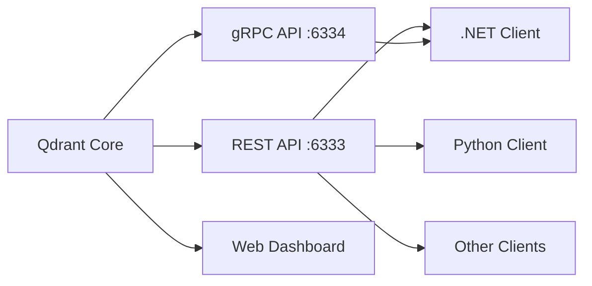
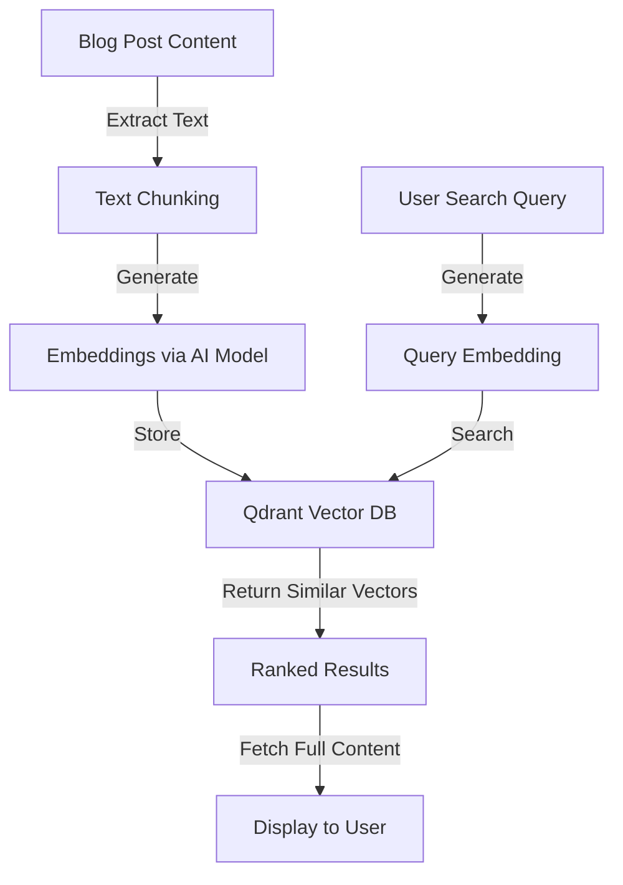
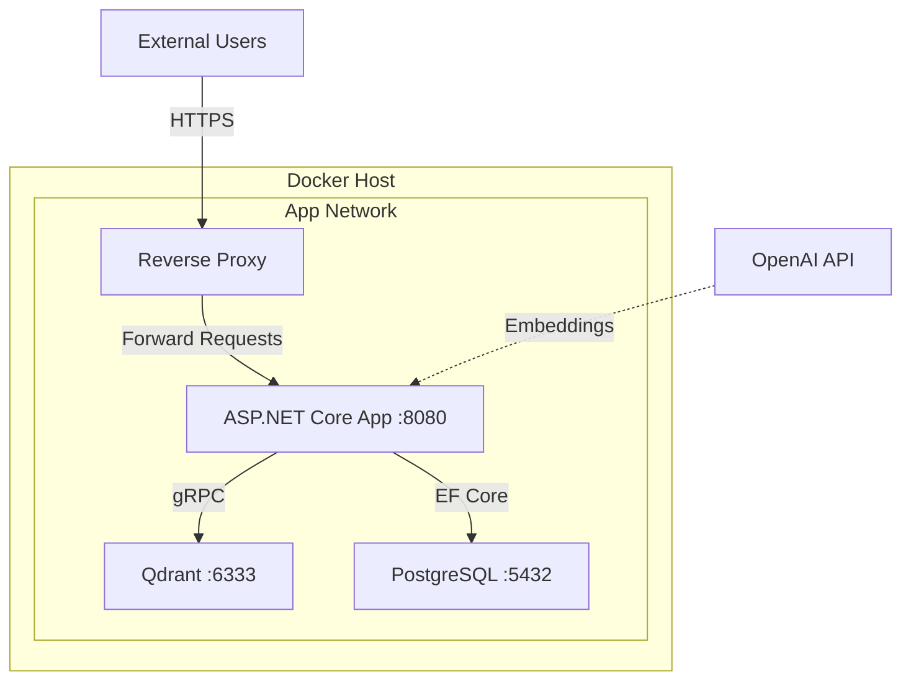
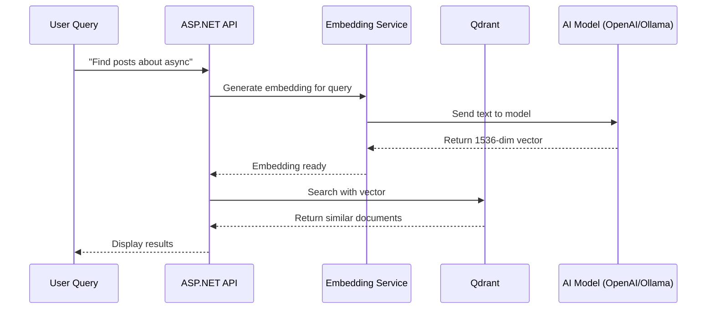
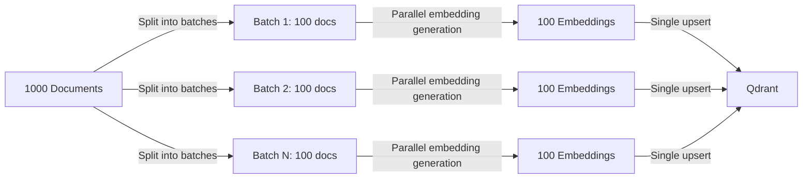

# Building a Semantic Search Engine with Qdrant and ASP.NET Core

<datetime class="hidden">2025-11-10T12:00</datetime>
<!-- category -- ASP.NET, Qdrant, Vector Search, Semantic Search, Docker -->

# Introduction

If you've been following the AI space, you've probably heard about vector databases and semantic search. Unlike traditional full-text search that matches keywords, semantic search understands the *meaning* behind your queries. This means searching for "feline pets" can return results about "cats" - rather clever stuff.

In this post, I'll show you how to build a self-hosted semantic search engine using Qdrant (a high-performance vector database) and ASP.NET Core. We'll cover everything from setting up Qdrant in Docker to integrating it into your ASP.NET application.

[TOC]

# What is Qdrant?

[Qdrant](https://qdrant.tech/) (pronounced "quadrant") is an open-source vector database and vector search engine written in Rust. It's designed to store and search high-dimensional vectors efficiently, making it perfect for semantic search, recommendation systems, and AI applications.

What makes Qdrant special:
- **Fast**: Built in Rust for maximum performance
- **Scalable**: Handles millions of vectors with ease
- **Self-hostable**: No vendor lock-in, run it yourself
- **Feature-rich**: Filtering, payload storage, and sophisticated search options
- **Easy to use**: Clean REST API and multiple client libraries



# Why Semantic Search?

Traditional PostgreSQL full-text search (like I use in this blog) is great for exact matches and keyword-based queries. But it falls short when users search using different terminology or need conceptual matches.

For example, with full-text search:
- Query: "error handling" → Finds only posts with those exact words
- Query: "exception management" → Might miss relevant posts about error handling

With semantic search:
- Both queries understand the *concept* and return relevant results regardless of exact wording
- You can search in one language and find results in another
- "How do I catch errors?" returns posts about exception handling, try-catch blocks, and error middleware

# Architecture Overview

Here's how our semantic search system will work:



# Setting up Qdrant

## Running Locally

The easiest way to get started is running Qdrant locally with Docker:

```bash
docker run -p 6333:6333 -p 6334:6334 \
    -v $(pwd)/qdrant_storage:/qdrant/storage:z \
    qdrant/qdrant
```

This will:
- Expose the REST API on port 6333
- Expose the gRPC API on port 6334
- Persist data to `./qdrant_storage`

You can then access the Qdrant dashboard at `http://localhost:6333/dashboard`

## Docker Compose Setup

For a production setup, add Qdrant to your `docker-compose.yml`. Here's how the deployment architecture looks:



Configuration for docker-compose.yml:

```yaml
services:
  qdrant:
    image: qdrant/qdrant:latest
    container_name: qdrant
    restart: unless-stopped
    ports:
      - "6333:6333"
      - "6334:6334"
    volumes:
      - /mnt/qdrant_storage:/qdrant/storage
    environment:
      - QDRANT__SERVICE__GRPC_PORT=6334
    networks:
      - app_network
```

Note that I'm storing the data in `/mnt/qdrant_storage` for persistence across container restarts. Make sure this directory exists and has the right permissions:

```bash
sudo mkdir -p /mnt/qdrant_storage
sudo chown -R 1000:1000 /mnt/qdrant_storage
```

Start it up:

```bash
docker-compose up -d qdrant
```

# Setting up the ASP.NET Core Client

## Installing the Package

First, install the official Qdrant .NET client:

```bash
dotnet add package Qdrant.Client
```

## Configuration

Add your Qdrant settings to `appsettings.json`:

```json
{
  "Qdrant": {
    "Endpoint": "http://localhost:6333",
    "ApiKey": "",
    "CollectionName": "blog_posts"
  }
}
```

Note: Qdrant doesn't require an API key by default for local development, but you should enable it for production deployments.

Create a configuration class:

```csharp
public class QdrantSettings
{
    public const string Section = "Qdrant";
    public string Endpoint { get; set; } = string.Empty;
    public string ApiKey { get; set; } = string.Empty;
    public string CollectionName { get; set; } = "blog_posts";
    public int VectorSize { get; set; } = 1536; // For OpenAI text-embedding-3-small
}
```

## Setting up the Service

Create a service to interact with Qdrant. I like to use my standard extension method pattern:

```csharp
public static class QdrantSetup
{
    public static void AddQdrantService(this IServiceCollection services, IConfiguration configuration)
    {
        var settings = services.ConfigurePOCO<QdrantSettings>(configuration.GetSection(QdrantSettings.Section));

        services.AddSingleton<QdrantClient>(sp =>
        {
            var channel = GrpcChannel.ForAddress(settings.Endpoint);
            return new QdrantClient(channel);
        });

        services.AddScoped<IVectorSearchService, QdrantVectorSearchService>();
    }
}
```

Then in your `Program.cs`:

```csharp
builder.Services.AddQdrantService(builder.Configuration);
```

# Creating the Vector Search Service

Now let's build the actual search service. This will handle creating collections, adding vectors, and searching.

## The Interface

```csharp
public interface IVectorSearchService
{
    Task InitializeCollectionAsync(CancellationToken ct = default);
    Task<bool> AddDocumentAsync(string id, string text, string title, Dictionary<string, object> metadata, CancellationToken ct = default);
    Task<List<SearchResult>> SearchAsync(string query, int limit = 10, CancellationToken ct = default);
}

public class SearchResult
{
    public string Id { get; set; }
    public string Title { get; set; }
    public string Text { get; set; }
    public float Score { get; set; }
    public Dictionary<string, object> Metadata { get; set; }
}
```

## The Implementation

Here's the full service implementation:

```csharp
public class QdrantVectorSearchService : IVectorSearchService
{
    private readonly QdrantClient _client;
    private readonly QdrantSettings _settings;
    private readonly ILogger<QdrantVectorSearchService> _logger;
    private readonly IEmbeddingService _embeddingService;

    public QdrantVectorSearchService(
        QdrantClient client,
        QdrantSettings settings,
        ILogger<QdrantVectorSearchService> logger,
        IEmbeddingService embeddingService)
    {
        _client = client;
        _settings = settings;
        _logger = logger;
        _embeddingService = embeddingService;
    }

    public async Task InitializeCollectionAsync(CancellationToken ct = default)
    {
        var collections = await _client.ListCollectionsAsync(ct);

        if (collections.Any(c => c.Name == _settings.CollectionName))
        {
            _logger.LogInformation("Collection {CollectionName} already exists", _settings.CollectionName);
            return;
        }

        _logger.LogInformation("Creating collection {CollectionName}", _settings.CollectionName);

        await _client.CreateCollectionAsync(
            collectionName: _settings.CollectionName,
            vectorsConfig: new VectorParams
            {
                Size = (ulong)_settings.VectorSize,
                Distance = Distance.Cosine
            },
            cancellationToken: ct
        );
    }

    public async Task<bool> AddDocumentAsync(
        string id,
        string text,
        string title,
        Dictionary<string, object> metadata,
        CancellationToken ct = default)
    {
        try
        {
            // Generate embedding for the text
            var embedding = await _embeddingService.GenerateEmbeddingAsync(text, ct);

            // Create the point with payload
            var point = new PointStruct
            {
                Id = new PointId { Uuid = id },
                Vectors = embedding,
                Payload =
                {
                    ["title"] = title,
                    ["text"] = text,
                    ["created_at"] = DateTime.UtcNow.ToString("O")
                }
            };

            // Add metadata
            foreach (var kvp in metadata)
            {
                point.Payload[kvp.Key] = kvp.Value;
            }

            await _client.UpsertAsync(
                collectionName: _settings.CollectionName,
                points: new[] { point },
                cancellationToken: ct
            );

            _logger.LogInformation("Successfully added document {Id} to collection", id);
            return true;
        }
        catch (Exception ex)
        {
            _logger.LogError(ex, "Failed to add document {Id}", id);
            return false;
        }
    }

    public async Task<List<SearchResult>> SearchAsync(string query, int limit = 10, CancellationToken ct = default)
    {
        try
        {
            // Generate embedding for the search query
            var queryEmbedding = await _embeddingService.GenerateEmbeddingAsync(query, ct);

            // Search for similar vectors
            var searchResult = await _client.SearchAsync(
                collectionName: _settings.CollectionName,
                vector: queryEmbedding,
                limit: (ulong)limit,
                cancellationToken: ct
            );

            return searchResult.Select(hit => new SearchResult
            {
                Id = hit.Id.ToString(),
                Score = hit.Score,
                Title = hit.Payload["title"].StringValue,
                Text = hit.Payload["text"].StringValue,
                Metadata = hit.Payload.ToDictionary(
                    kvp => kvp.Key,
                    kvp => (object)kvp.Value
                )
            }).ToList();
        }
        catch (Exception ex)
        {
            _logger.LogError(ex, "Search failed for query: {Query}", query);
            return new List<SearchResult>();
        }
    }
}
```

# Generating Embeddings

You'll notice we use an `IEmbeddingService` to generate embeddings. This is where you'll integrate with an AI model. Here's how the embedding flow works:



Here's an example using OpenAI:

## OpenAI Embeddings

First install the package:

```bash
dotnet add package Azure.AI.OpenAI
```

Then create the embedding service:

```csharp
public interface IEmbeddingService
{
    Task<float[]> GenerateEmbeddingAsync(string text, CancellationToken ct = default);
}

public class OpenAIEmbeddingService : IEmbeddingService
{
    private readonly OpenAIClient _client;
    private readonly ILogger<OpenAIEmbeddingService> _logger;
    private const string EmbeddingModel = "text-embedding-3-small";

    public OpenAIEmbeddingService(OpenAIClient client, ILogger<OpenAIEmbeddingService> logger)
    {
        _client = client;
        _logger = logger;
    }

    public async Task<float[]> GenerateEmbeddingAsync(string text, CancellationToken ct = default)
    {
        try
        {
            var response = await _client.GetEmbeddingsAsync(
                new EmbeddingsOptions(EmbeddingModel, new[] { text }),
                ct
            );

            return response.Value.Data[0].Embedding.ToArray();
        }
        catch (Exception ex)
        {
            _logger.LogError(ex, "Failed to generate embedding");
            throw;
        }
    }
}
```

Register it in your DI container:

```csharp
builder.Services.AddSingleton(new OpenAIClient(builder.Configuration["OpenAI:ApiKey"]));
builder.Services.AddScoped<IEmbeddingService, OpenAIEmbeddingService>();
```

## Local Alternative: Using Ollama

If you want to avoid external API calls, you can use [Ollama](https://ollama.ai/) for local embeddings:

```bash
# Install Ollama and pull an embedding model
ollama pull nomic-embed-text
```

Then create a local embedding service:

```csharp
public class OllamaEmbeddingService : IEmbeddingService
{
    private readonly HttpClient _httpClient;
    private readonly ILogger<OllamaEmbeddingService> _logger;
    private const string OllamaEndpoint = "http://localhost:11434/api/embeddings";
    private const string Model = "nomic-embed-text";

    public OllamaEmbeddingService(HttpClient httpClient, ILogger<OllamaEmbeddingService> logger)
    {
        _httpClient = httpClient;
        _logger = logger;
    }

    public async Task<float[]> GenerateEmbeddingAsync(string text, CancellationToken ct = default)
    {
        var request = new { model = Model, prompt = text };
        var response = await _httpClient.PostAsJsonAsync(OllamaEndpoint, request, ct);
        response.EnsureSuccessStatusCode();

        var result = await response.Content.ReadFromJsonAsync<OllamaEmbeddingResponse>(ct);
        return result.Embedding;
    }
}

public class OllamaEmbeddingResponse
{
    public float[] Embedding { get; set; }
}
```

# Populating the Index

Now let's create a background service to populate Qdrant with our blog posts:

```csharp
public class BlogIndexingService : IHostedService
{
    private readonly IServiceScopeFactory _scopeFactory;
    private readonly ILogger<BlogIndexingService> _logger;

    public BlogIndexingService(
        IServiceScopeFactory scopeFactory,
        ILogger<BlogIndexingService> logger)
    {
        _scopeFactory = scopeFactory;
        _logger = logger;
    }

    public async Task StartAsync(CancellationToken cancellationToken)
    {
        _logger.LogInformation("Starting blog indexing service");

        using var scope = _scopeFactory.CreateScope();
        var vectorSearch = scope.ServiceProvider.GetRequiredService<IVectorSearchService>();
        var blogService = scope.ServiceProvider.GetRequiredService<IBlogService>();

        // Initialize the collection
        await vectorSearch.InitializeCollectionAsync(cancellationToken);

        // Get all blog posts
        var posts = await blogService.GetAllPosts();

        foreach (var post in posts)
        {
            if (cancellationToken.IsCancellationRequested) break;

            var metadata = new Dictionary<string, object>
            {
                ["slug"] = post.Slug,
                ["category"] = post.Categories.FirstOrDefault() ?? "General",
                ["language"] = post.Language,
                ["published_date"] = post.PublishedDate.ToString("O")
            };

            // Combine title and content for better search context
            var searchableText = $"{post.Title}\n\n{post.PlainTextContent}";

            await vectorSearch.AddDocumentAsync(
                id: post.Id,
                text: searchableText,
                title: post.Title,
                metadata: metadata,
                ct: cancellationToken
            );

            _logger.LogInformation("Indexed post: {Title}", post.Title);
        }

        _logger.LogInformation("Blog indexing completed");
    }

    public Task StopAsync(CancellationToken cancellationToken) => Task.CompletedTask;
}
```

Register the hosted service:

```csharp
builder.Services.AddHostedService<BlogIndexingService>();
```

# Creating a Search API

Now let's create an API endpoint for searching:

```csharp
[ApiController]
[Route("api/[controller]")]
public class SearchController : ControllerBase
{
    private readonly IVectorSearchService _vectorSearch;
    private readonly ILogger<SearchController> _logger;

    public SearchController(
        IVectorSearchService vectorSearch,
        ILogger<SearchController> logger)
    {
        _vectorSearch = vectorSearch;
        _logger = logger;
    }

    [HttpGet]
    public async Task<ActionResult<SearchResponse>> Search(
        [FromQuery] string query,
        [FromQuery] int limit = 10,
        CancellationToken ct = default)
    {
        if (string.IsNullOrWhiteSpace(query))
        {
            return BadRequest("Query cannot be empty");
        }

        _logger.LogInformation("Searching for: {Query}", query);

        var results = await _vectorSearch.SearchAsync(query, limit, ct);

        return Ok(new SearchResponse
        {
            Query = query,
            Results = results,
            Count = results.Count
        });
    }
}

public class SearchResponse
{
    public string Query { get; set; }
    public List<SearchResult> Results { get; set; }
    public int Count { get; set; }
}
```

# Adding a Search UI

Here's a simple search interface using HTMX and Alpine.js (keeping with this blog's tech stack):

```html
<div x-data="{ query: '', results: [], loading: false }">
    <div class="search-box">
        <input
            type="text"
            x-model="query"
            @keyup.enter="
                loading = true;
                fetch(`/api/search?query=${encodeURIComponent(query)}&limit=10`)
                    .then(r => r.json())
                    .then(data => { results = data.results; loading = false; })
            "
            placeholder="Search blog posts semantically..."
            class="w-full px-4 py-2 border rounded-lg"
        >
    </div>

    <div x-show="loading" class="mt-4">
        <p>Searching...</p>
    </div>

    <div x-show="results.length > 0" class="mt-4 space-y-4">
        <template x-for="result in results" :key="result.id">
            <div class="border rounded-lg p-4 hover:shadow-lg transition">
                <h3 class="font-bold text-lg" x-text="result.title"></h3>
                <p class="text-gray-600 mt-2" x-text="result.text.substring(0, 200) + '...'"></p>
                <div class="mt-2 flex justify-between items-center">
                    <span class="text-sm text-gray-500">
                        Score: <span x-text="(result.score * 100).toFixed(1)"></span>%
                    </span>
                    <a :href="`/blog/${result.metadata.slug}`" class="text-blue-500 hover:underline">
                        Read more →
                    </a>
                </div>
            </div>
        </template>
    </div>
</div>
```

# Advanced Features

## Hybrid Search

Sometimes you want the best of both worlds - semantic search combined with traditional filtering. For example, you might want to search for "database performance" but only in posts from the last month, or only in the "ASP.NET" category.

Qdrant makes this straightforward by allowing you to apply filters alongside vector similarity search. The filters narrow down the candidate set before computing similarity scores, making searches both faster and more relevant.

Here's how to combine vector search with traditional filtering:

```csharp
public async Task<List<SearchResult>> HybridSearchAsync(
    string query,
    string category = null,
    DateTime? fromDate = null,
    int limit = 10,
    CancellationToken ct = default)
{
    var queryEmbedding = await _embeddingService.GenerateEmbeddingAsync(query, ct);

    var filter = new Filter();

    if (!string.IsNullOrEmpty(category))
    {
        filter.Must.Add(new Condition
        {
            Field = new Field { Key = "category" },
            Match = new Match { Keyword = category }
        });
    }

    if (fromDate.HasValue)
    {
        filter.Must.Add(new Condition
        {
            Field = new Field { Key = "published_date" },
            Range = new Range
            {
                Gte = fromDate.Value.ToString("O")
            }
        });
    }

    var searchResult = await _client.SearchAsync(
        collectionName: _settings.CollectionName,
        vector: queryEmbedding,
        filter: filter,
        limit: (ulong)limit,
        cancellationToken: ct
    );

    return MapResults(searchResult);
}
```

## Reranking Results

Reranking is a technique where you first retrieve a larger set of candidate results (say, 50), then use a more sophisticated model to rerank them and return only the best ones (say, 10). This two-stage approach balances performance with accuracy - the first stage is fast but approximate, the second stage is slower but more accurate.

This is particularly useful when your embedding model is optimised for speed rather than accuracy. You get fast initial retrieval, then apply a more powerful model to the top candidates.

Here's how to implement reranking:

```csharp
public async Task<List<SearchResult>> SearchWithRerankAsync(
    string query,
    int initialLimit = 50,
    int finalLimit = 10,
    CancellationToken ct = default)
{
    // First pass: get more results than needed
    var candidates = await SearchAsync(query, initialLimit, ct);

    // Second pass: rerank using more sophisticated model
    var rerankedResults = await _rerankingService.RerankAsync(query, candidates, ct);

    return rerankedResults.Take(finalLimit).ToList();
}
```

# Performance Considerations

## Chunking Long Documents

Most embedding models have a maximum input length (typically 512-8192 tokens). If your blog posts are longer than this, you'll need to split them into smaller chunks. But there's an art to chunking - you want each chunk to be semantically coherent.

The strategy below splits text on sentence boundaries and maintains a small overlap between chunks. The overlap ensures that concepts spanning chunk boundaries aren't lost. Think of it like pagination with context.

Here's a simple chunking implementation:

```csharp
public class TextChunker
{
    private const int ChunkSize = 500; // tokens, roughly 2000 characters
    private const int ChunkOverlap = 50; // overlap between chunks

    public List<string> ChunkText(string text)
    {
        var chunks = new List<string>();
        var sentences = text.Split(new[] { '.', '!', '?' }, StringSplitOptions.RemoveEmptyEntries);

        var currentChunk = new StringBuilder();
        var currentLength = 0;

        foreach (var sentence in sentences)
        {
            if (currentLength + sentence.Length > ChunkSize && currentLength > 0)
            {
                chunks.Add(currentChunk.ToString().Trim());

                // Keep overlap
                var words = currentChunk.ToString().Split(' ');
                currentChunk = new StringBuilder(string.Join(" ", words.TakeLast(ChunkOverlap)));
                currentLength = currentChunk.Length;
            }

            currentChunk.Append(sentence).Append(". ");
            currentLength += sentence.Length;
        }

        if (currentLength > 0)
        {
            chunks.Add(currentChunk.ToString().Trim());
        }

        return chunks;
    }
}
```

## Batch Processing

When indexing multiple documents, batch your requests to improve performance. Here's how the batching process works:



Here's the implementation:

```csharp
public async Task AddDocumentsBatchAsync(
    List<(string id, string text, string title, Dictionary<string, object> metadata)> documents,
    CancellationToken ct = default)
{
    const int batchSize = 100;

    for (int i = 0; i < documents.Count; i += batchSize)
    {
        var batch = documents.Skip(i).Take(batchSize);

        // Generate embeddings in parallel
        var embeddingTasks = batch.Select(doc =>
            _embeddingService.GenerateEmbeddingAsync(doc.text, ct)
        ).ToList();

        var embeddings = await Task.WhenAll(embeddingTasks);

        // Create points
        var points = batch.Zip(embeddings, (doc, embedding) => new PointStruct
        {
            Id = new PointId { Uuid = doc.id },
            Vectors = embedding,
            Payload =
            {
                ["title"] = doc.title,
                ["text"] = doc.text,
                // ... other fields
            }
        }).ToList();

        await _client.UpsertAsync(_settings.CollectionName, points, ct: ct);

        _logger.LogInformation("Indexed batch {Current}/{Total}", i + batch.Count(), documents.Count);
    }
}
```

# Monitoring and Maintenance

## Health Checks

Add a health check for Qdrant:

```csharp
public class QdrantHealthCheck : IHealthCheck
{
    private readonly QdrantClient _client;

    public QdrantHealthCheck(QdrantClient client)
    {
        _client = client;
    }

    public async Task<HealthCheckResult> CheckHealthAsync(
        HealthCheckContext context,
        CancellationToken cancellationToken = default)
    {
        try
        {
            var collections = await _client.ListCollectionsAsync(cancellationToken);
            return HealthCheckResult.Healthy($"Qdrant is responsive. Collections: {collections.Count}");
        }
        catch (Exception ex)
        {
            return HealthCheckResult.Unhealthy("Qdrant is not responsive", ex);
        }
    }
}
```

Register it:

```csharp
builder.Services.AddHealthChecks()
    .AddCheck<QdrantHealthCheck>("qdrant");
```

## Collection Statistics

Track your collection size:

```csharp
public async Task<CollectionInfo> GetCollectionStatsAsync(CancellationToken ct = default)
{
    var info = await _client.GetCollectionInfoAsync(_settings.CollectionName, ct);

    _logger.LogInformation(
        "Collection {Name}: {Points} points, {Segments} segments",
        _settings.CollectionName,
        info.PointsCount,
        info.SegmentsCount
    );

    return info;
}
```

# Cost Analysis

Running Qdrant self-hosted is remarkably cost-effective compared to managed services:

**OpenAI Embeddings Cost:**
- text-embedding-3-small: $0.02 per 1M tokens
- Average blog post: ~1000 tokens
- 1000 blog posts: ~$0.02 for one-time indexing

**Server Costs:**
- Small VPS for Qdrant: $5-10/month
- Can handle millions of vectors

**Managed Alternatives:**
- Pinecone: Starts at $70/month
- Weaviate Cloud: Starts at $25/month

Self-hosting wins by a landslide for small to medium projects!

# Common Gotchas

- **Vector dimensions must match**: Make sure your embedding model dimension matches your collection's vector size
- **Distance metrics matter**: Use Cosine for normalized embeddings, Euclidean for unnormalized
- **Persistence**: Always mount a volume for `/qdrant/storage` or you'll lose data on container restart
- **Memory usage**: Qdrant keeps vectors in memory for speed. Plan accordingly (roughly 4 bytes per dimension per vector)
- **Concurrent requests**: The gRPC client is more efficient than REST for high-throughput scenarios

# In Conclusion

We've built a complete semantic search system using Qdrant and ASP.NET Core. The best part? It's all self-hosted, giving you complete control and privacy over your data.

Key takeaways:
- Qdrant is fast, feature-rich, and easy to self-host
- Vector search dramatically improves search quality over keyword matching
- Integration with ASP.NET Core is straightforward
- Self-hosting is much more cost-effective than managed services

I'm using this exact setup for the semantic search feature I'm rolling out on this blog. It's been rock-solid, and the search quality is impressive. Give it a try!

The full code for this implementation is available in my [blog's GitHub repository](https://github.com/scottgal/mostlylucidweb).

Next up: I'll show you how to add similarity-based "related posts" recommendations using the same infrastructure. Stay tuned!
