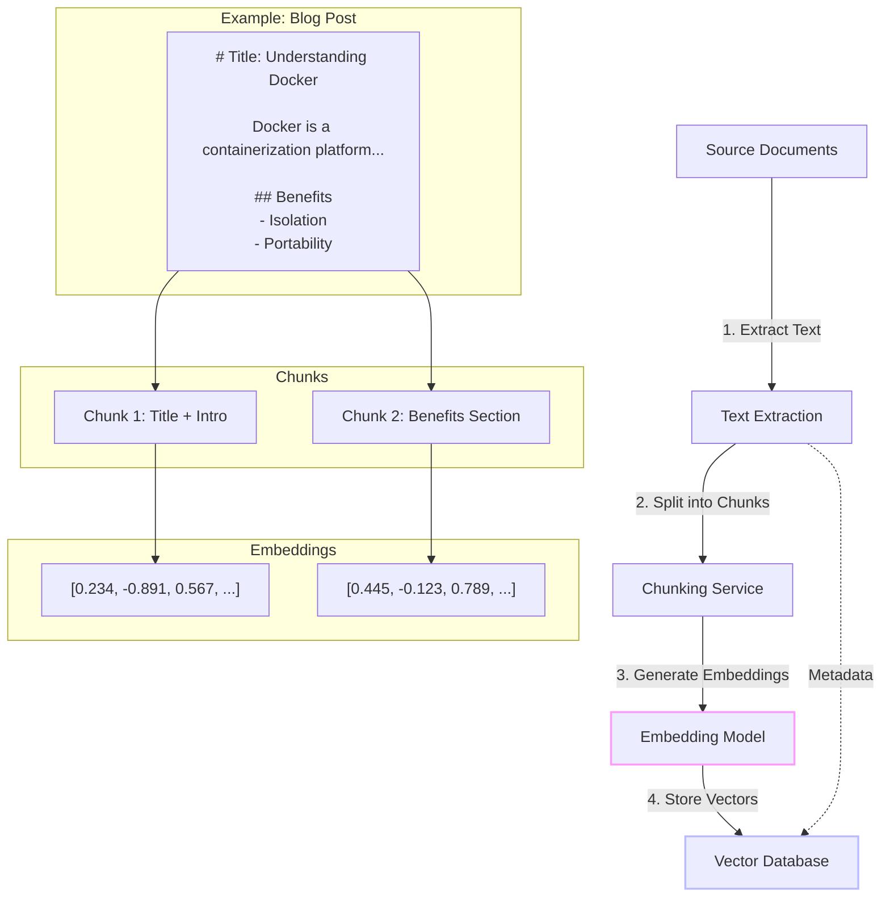
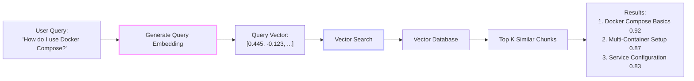
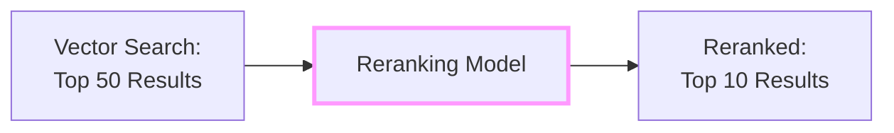
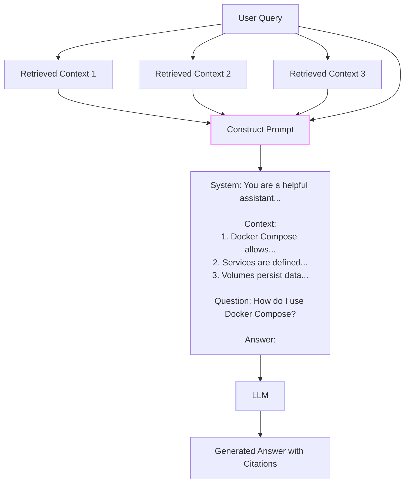
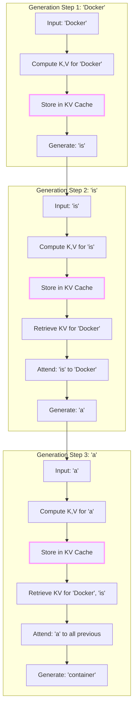
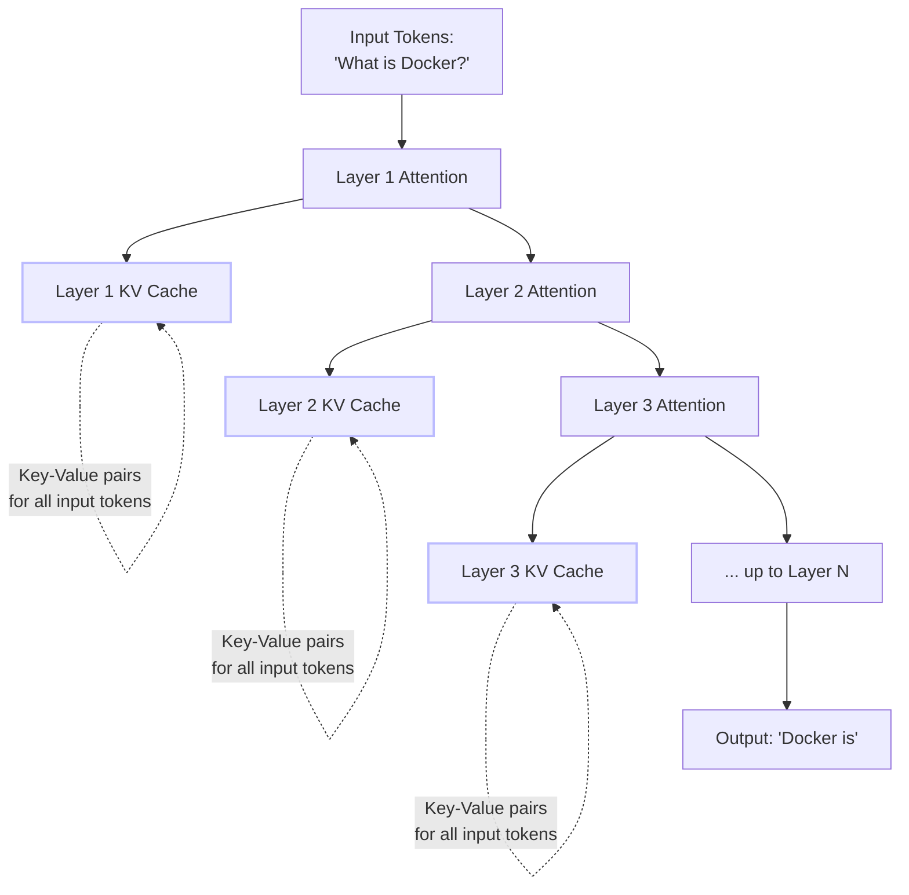
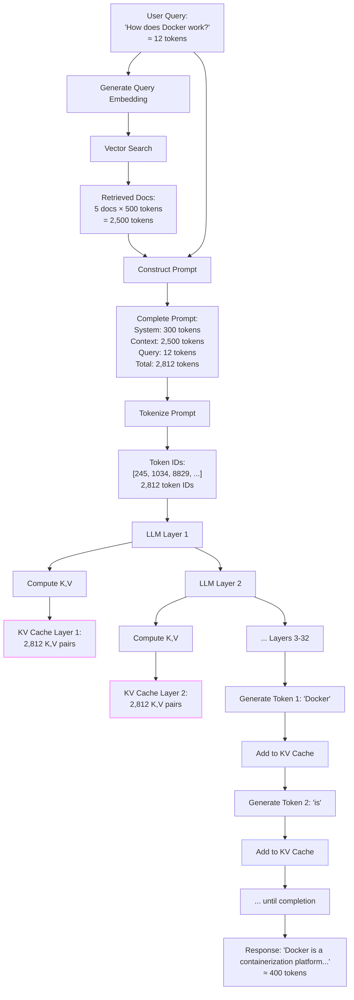

# RAG Architecture and Internals: How It Really Works

In [Part 1](/blog/rag-primer), we covered RAG's origins, fundamentals, and why it matters. You understand the high-level concept: retrieve relevant information, then use it to generate responses. Now we dive deep into the technical architecture—exactly how RAG systems work under the hood, from chunking strategies to LLM internals like tokens and KV caches.

<datetime class="hidden">2025-11-22T09:30</datetime>
<!-- category -- AI, RAG, Machine Learning, Semantic Search, LLM, AI-Article -->

# Introduction

**📖 Series Navigation:** This is Part 2 of a five-part series on RAG:
- [Part 1: Origins and Fundamentals](/blog/rag-primer) - History, motivation, and core concepts
- **Part 2: Architecture and Internals** (this article) - Technical deep dive into how RAG works
- [Part 3: RAG in Practice](/blog/rag-practical-applications) - Building real systems, challenges, and advanced techniques
- [Part 4: ONNX & Qdrant Implementation](/blog/semantic-search-with-onnx-and-qdrant) - CPU-friendly semantic search
- [Part 5: Hybrid Search & Auto-Indexing](/blog/rag-hybrid-search-and-indexing) - Production integration patterns

If you haven't read Part 1, I recommend starting there to understand:
- What RAG is and why it matters
- The history from keyword search to semantic understanding
- RAG vs fine-tuning and other approaches

This article assumes you understand those basics and focuses on **technical architecture, implementation details, and LLM internals**.

[TOC]

# How RAG Works: The Complete Picture

Let's break down exactly what happens in a RAG system, from the moment you add a document to when a user gets an answer.

## Phase 1: Indexing (Preparing the Knowledge Base)

Before RAG can retrieve anything, you need to index your knowledge base. This is a one-time process (though you can add new documents later).



### Step 1: Text Extraction

Extract plain text from your source documents. This could be:
- Markdown files (like my blog posts)
- PDFs (for documentation)
- HTML (for web scraping)
- Database records
- Emails, chat logs, etc.

**Example from my blog:**
```csharp
// From MarkdownRenderingService
public string ExtractPlainText(string markdown)
{
    // Remove code blocks
    var withoutCode = Regex.Replace(markdown, @"```[\s\S]*?```", "");

    // Convert markdown to plain text
    var document = Markdown.Parse(withoutCode);
    var plainText = document.ToPlainText();

    return plainText.Trim();
}
```

### Step 2: Chunking

This is where most RAG implementations fail. You can't just split on paragraph boundaries - you need semantically coherent chunks.

**Why chunking matters:**
- LLMs have token limits (context windows)
- Smaller chunks = more precise retrieval
- But chunks must contain enough context to be meaningful

**Bad chunking:**
```
Chunk 1: "Docker is a containerization platform. It allows you"
Chunk 2: "to package applications with their dependencies. This"
Chunk 3: "ensures consistency across environments."
```

**Good chunking:**
```
Chunk 1: "Docker is a containerization platform. It allows you to package applications with their dependencies. This ensures consistency across environments."

Chunk 2: "Benefits of Docker:
- Isolation: Each container runs in its own environment
- Portability: Containers run anywhere Docker is installed
- Efficiency: Lightweight compared to virtual machines"
```

**Example from my semantic search implementation:**
```csharp
public class TextChunker
{
    private const int TargetChunkSize = 500; // ~500 words
    private const int ChunkOverlap = 50;     // 50 words overlap

    public List<Chunk> ChunkDocument(string text, string sourceId)
    {
        var chunks = new List<Chunk>();

        // Split on section boundaries first (## headers in markdown)
        var sections = SplitOnHeaders(text);

        foreach (var section in sections)
        {
            // If section is small enough, keep it whole
            if (section.WordCount < TargetChunkSize)
            {
                chunks.Add(new Chunk
                {
                    Text = section.Text,
                    SourceId = sourceId,
                    SectionHeader = section.Header
                });
            }
            else
            {
                // Split large sections on sentence boundaries
                var subChunks = SplitOnSentences(section.Text, TargetChunkSize, ChunkOverlap);
                chunks.AddRange(subChunks.Select(c => new Chunk
                {
                    Text = c,
                    SourceId = sourceId,
                    SectionHeader = section.Header
                }));
            }
        }

        return chunks;
    }
}
```

**Common chunking strategies:**
- **Fixed-size**: Simple but breaks semantic boundaries
- **Sentence-based**: Respects grammar but can be too small
- **Paragraph-based**: Natural but variable size
- **Section-based**: Best for structured content (my preference)
- **Sliding window with overlap**: Ensures no context is lost at boundaries

### Step 3: Generate Embeddings

Embeddings are the magic that makes semantic search possible. An embedding is a vector (array of numbers) that represents the meaning of text.

**Key concept:** Similar meanings → similar vectors

```
"Docker container" → [0.234, -0.891, 0.567, ..., 0.123]
"containerization platform" → [0.221, -0.903, 0.534, ..., 0.119]
"apple fruit" → [0.891, 0.234, -0.567, ..., -0.789]
```

The first two vectors would be "close" in vector space (high cosine similarity), while the third is far away.

**How embeddings are generated:**
Modern embedding models are neural networks trained on massive text datasets to learn semantic relationships. Popular models:
- **all-MiniLM-L6-v2**: 384 dimensions, fast, good quality (what I use on this blog)
- **text-embedding-3-small** (OpenAI): 1536 dimensions, very high quality
- **BGE-base**: 768 dimensions, state-of-the-art open source

**Example from my ONNX embedding service:**
```csharp
public async Task<float[]> GenerateEmbeddingAsync(string text)
{
    // Tokenize the input text
    var tokens = Tokenize(text);

    // Create input tensors for ONNX model
    var inputIds = CreateInputTensor(tokens);
    var attentionMask = CreateAttentionMaskTensor(tokens.Length);
    var tokenTypeIds = CreateTokenTypeIdsTensor(tokens.Length);

    // Run ONNX inference
    var inputs = new List<NamedOnnxValue>
    {
        NamedOnnxValue.CreateFromTensor("input_ids", inputIds),
        NamedOnnxValue.CreateFromTensor("attention_mask", attentionMask),
        NamedOnnxValue.CreateFromTensor("token_type_ids", tokenTypeIds)
    };

    using var results = _session.Run(inputs);

    // Extract the output (sentence embedding)
    var output = results.First().AsTensor<float>();
    var embedding = output.ToArray();

    // L2 normalize the vector for cosine similarity
    return NormalizeVector(embedding);
}
```

**Why normalization matters:** After L2 normalization, cosine similarity becomes a simple dot product, making search much faster.

### Step 4: Store in Vector Database

Vector databases are optimized for storing and searching high-dimensional vectors. Unlike traditional databases that use SQL queries, vector databases use similarity search.

**Key operations:**
- **Upsert**: Add or update a vector with metadata
- **Search**: Find K most similar vectors to a query vector
- **Filter**: Combine vector search with metadata filters

**Example Qdrant implementation:**
```csharp
public async Task IndexDocumentAsync(
    string id,
    float[] embedding,
    Dictionary<string, object> metadata)
{
    var point = new PointStruct
    {
        Id = new PointId { Uuid = id },
        Vectors = embedding,
        Payload =
        {
            ["title"] = metadata["title"],
            ["source"] = metadata["source"],
            ["chunk_index"] = metadata["chunk_index"],
            ["created_at"] = DateTime.UtcNow.ToString("O")
        }
    };

    await _client.UpsertAsync(
        collectionName: "blog_posts",
        points: new[] { point }
    );
}
```

**Popular vector databases:**
- **Qdrant**: Fast, self-hostable, excellent C# support (my choice)
- **pgvector**: PostgreSQL extension (great if you're already using Postgres)
- **Pinecone**: Managed service (expensive but good)
- **Weaviate**: Feature-rich, good for complex schemas
- **ChromaDB**: Python-focused, lightweight

We'll explore setting up these databases in upcoming articles.

## Phase 2: Retrieval (Finding Relevant Information)

When a user asks a question, the RAG system needs to find the most relevant information from the knowledge base.



### Step 1: Generate Query Embedding

The user's question gets converted to a vector using the **same embedding model** used for indexing. This is critical - different models produce incompatible vectors.

```csharp
public async Task<List<SearchResult>> SearchAsync(string query, int limit = 10)
{
    // Same embedding model used for indexing
    var queryEmbedding = await _embeddingService.GenerateEmbeddingAsync(query);

    // Search in vector store
    var results = await _vectorStoreService.SearchAsync(
        queryEmbedding,
        limit
    );

    return results;
}
```

### Step 2: Similarity Search

The vector database computes similarity between the query vector and all stored vectors. Common metrics:

**Cosine Similarity** (most popular for normalized vectors):
```
similarity = (A · B) / (||A|| × ||B||)
```
Range: -1 to 1 (higher = more similar)

**Euclidean Distance** (for unnormalized vectors):
```
distance = sqrt(Σ(Ai - Bi)²)
```
Range: 0 to ∞ (lower = more similar)

**Dot Product** (when vectors are pre-normalized):
```
similarity = A · B
```
Range: -1 to 1 (higher = more similar)

**Example from my Qdrant service:**
```csharp
var searchResults = await _client.SearchAsync(
    collectionName: "blog_posts",
    vector: queryEmbedding,
    limit: (ulong)limit,
    scoreThreshold: 0.7f,  // Only return results with >70% similarity
    payloadSelector: true   // Include all metadata
);

return searchResults.Select(hit => new SearchResult
{
    Text = hit.Payload["text"].StringValue,
    Title = hit.Payload["title"].StringValue,
    Score = hit.Score,
    Source = hit.Payload["source"].StringValue
}).ToList();
```

### Step 3: Reranking (Optional but Recommended)

The initial retrieval is fast but approximate. Reranking uses a more sophisticated model to rescore the top K results.



**Why reranking helps:**
- Fast embedding models optimize for speed, sacrificing some accuracy
- Reranking models are slower but more accurate
- Two-stage approach balances speed and quality

**Example reranking implementation:**
```csharp
public async Task<List<SearchResult>> SearchWithRerankAsync(
    string query,
    int initialLimit = 50,
    int finalLimit = 10)
{
    // Stage 1: Fast vector search
    var candidates = await SearchAsync(query, initialLimit);

    // Stage 2: Precise reranking
    var rerankedResults = await _rerankingService.RerankAsync(
        query,
        candidates
    );

    return rerankedResults.Take(finalLimit).ToList();
}
```

## Phase 3: Generation (Creating the Answer)

Now that we have relevant information, we feed it to the LLM along with the user's question.



### Step 1: Prompt Construction

This is where RAG becomes an art. You need to structure the prompt so the LLM:
- Uses the provided context (not its internal knowledge)
- Cites sources when possible
- Admits when the context doesn't contain an answer
- Maintains a consistent tone/style

**Example prompt template from my Lawyer GPT system:**
```csharp
public string BuildRAGPrompt(string query, List<SearchResult> context)
{
    var sb = new StringBuilder();

    sb.AppendLine("You are a technical writing assistant. Your task is to answer the user's question using ONLY the provided context from past blog posts.");
    sb.AppendLine();
    sb.AppendLine("CONTEXT:");
    sb.AppendLine("========");

    for (int i = 0; i < context.Count; i++)
    {
        sb.AppendLine($"[{i + 1}] {context[i].Title}");
        sb.AppendLine($"Source: {context[i].Source}");
        sb.AppendLine($"Content: {context[i].Text}");
        sb.AppendLine($"Relevance: {context[i].Score:P0}");
        sb.AppendLine();
    }

    sb.AppendLine("========");
    sb.AppendLine();
    sb.AppendLine("INSTRUCTIONS:");
    sb.AppendLine("- Answer the question using the provided context");
    sb.AppendLine("- Cite sources using [1], [2], etc.");
    sb.AppendLine("- If the context doesn't contain enough information, say so");
    sb.AppendLine("- Maintain the technical, practical tone of the blog");
    sb.AppendLine();
    sb.AppendLine($"QUESTION: {query}");
    sb.AppendLine();
    sb.AppendLine("ANSWER:");

    return sb.ToString();
}
```

### Step 2: LLM Inference

The constructed prompt goes to the LLM for generation. This can be:
- **Cloud API**: OpenAI, Anthropic Claude, Google PaLM
- **Local model**: Using llama.cpp, ONNX Runtime, or TorchSharp

**Example using local LLM:**
```csharp
public async Task<string> GenerateResponseAsync(string prompt)
{
    var result = await _llamaSharp.InferAsync(prompt, new InferenceParams
    {
        Temperature = 0.7f,      // Creativity (0 = deterministic, 1 = creative)
        TopP = 0.9f,             // Nucleus sampling
        MaxTokens = 500,         // Response length limit
        StopSequences = new[] { "\n\n", "User:", "Question:" }
    });

    return result.Text.Trim();
}
```

**Key parameters explained:**
- **Temperature**: Controls randomness (0 = always pick most likely, 1 = sample randomly)
- **Top P**: Nucleus sampling - consider only tokens that make up top P probability mass
- **Max Tokens**: Limit response length
- **Stop Sequences**: When to stop generating

### Step 3: Post-Processing

After the LLM generates a response, we often need to:
- Extract citations and convert them to links
- Format code blocks
- Add metadata (sources, confidence scores)
- Log the interaction for debugging

**Example post-processing:**
```csharp
public RAGResponse PostProcess(string llmOutput, List<SearchResult> sources)
{
    var response = new RAGResponse
    {
        Answer = llmOutput,
        Sources = new List<Source>()
    };

    // Extract citations like [1], [2]
    var citations = Regex.Matches(llmOutput, @"\[(\d+)\]");

    foreach (Match match in citations)
    {
        int index = int.Parse(match.Groups[1].Value) - 1;
        if (index >= 0 && index < sources.Count)
        {
            var source = sources[index];
            response.Sources.Add(new Source
            {
                Title = source.Title,
                Url = GenerateUrl(source.Source),
                RelevanceScore = source.Score
            });
        }
    }

    // Convert markdown citations to hyperlinks
    response.FormattedAnswer = Regex.Replace(
        llmOutput,
        @"\[(\d+)\]",
        m => {
            int index = int.Parse(m.Groups[1].Value) - 1;
            if (index >= 0 && index < sources.Count)
            {
                var url = GenerateUrl(sources[index].Source);
                return $"[[{m.Groups[1].Value}]]({url})";
            }
            return m.Value;
        }
    );

    return response;
}
```

# Understanding LLM Internals: Tokens, KV Cache, and Context Windows

Before we move to practical applications, it's essential to understand how LLMs work internally. This knowledge helps you optimize RAG systems and avoid common pitfalls.

## What Are Tokens?

Tokens are the fundamental units that LLMs process. Text isn't fed directly to models - it's first broken down into tokens.

**Example tokenization:**
```
Input:  "Understanding Docker containers"
Tokens: ["Under", "standing", " Docker", " containers"]
```

Different models use different tokenization strategies:
- **GPT models**: Use Byte-Pair Encoding (BPE) with ~50K vocabulary
- **Claude**: Similar BPE approach
- **Llama models**: SentencePiece tokenization

**Why tokenization matters for RAG:**

```csharp
public class TokenCounter
{
    // Rough approximation: 1 token ≈ 0.75 words (English)
    public int EstimateTokens(string text)
    {
        var wordCount = text.Split(' ', StringSplitOptions.RemoveEmptyEntries).Length;
        return (int)(wordCount / 0.75);
    }

    public int EstimateTokensAccurate(string text, ITokenizer tokenizer)
    {
        // Use actual tokenizer for precision
        return tokenizer.Encode(text).Count;
    }
}
```

**Context window limits:**
- GPT-3.5: 16K tokens
- GPT-4: 8K-128K tokens (depending on variant)
- Claude 3.5 Sonnet: 200K tokens
- Llama 3: 8K tokens (though can be extended)

In RAG systems, you must fit:
```
Total tokens = System prompt + Retrieved context + User query + Response buffer
```

If your RAG retrieves 10 documents of 500 tokens each, that's 5,000 tokens just for context - before the query and response!

**Practical RAG token management:**

```csharp
public class ContextWindowManager
{
    private readonly int _maxContextTokens;
    private readonly int _systemPromptTokens;
    private readonly int _responseBufferTokens;

    public ContextWindowManager(
        int totalContextWindow = 4096,
        int systemPromptTokens = 300,
        int responseBufferTokens = 500)
    {
        _maxContextTokens = totalContextWindow;
        _systemPromptTokens = systemPromptTokens;
        _responseBufferTokens = responseBufferTokens;
    }

    public List<SearchResult> FitContextInWindow(
        List<SearchResult> retrievedDocs,
        string query)
    {
        var queryTokens = EstimateTokens(query);

        // Available tokens for retrieved context
        var availableForContext = _maxContextTokens
            - _systemPromptTokens
            - queryTokens
            - _responseBufferTokens;

        var selectedDocs = new List<SearchResult>();
        var currentTokens = 0;

        foreach (var doc in retrievedDocs.OrderByDescending(d => d.Score))
        {
            var docTokens = EstimateTokens(doc.Text);

            if (currentTokens + docTokens <= availableForContext)
            {
                selectedDocs.Add(doc);
                currentTokens += docTokens;
            }
            else
            {
                break; // Context window full
            }
        }

        return selectedDocs;
    }

    private int EstimateTokens(string text)
    {
        // Rule of thumb: 1 token ≈ 4 characters
        return text.Length / 4;
    }
}
```

## The KV Cache: LLM's Secret Weapon

When an LLM generates text, it doesn't reprocess everything from scratch for each token. It uses a **Key-Value (KV) cache** to remember what it has already computed.

### How Transformers Work (Simplified)

Transformers use an "attention" mechanism where each token "attends to" (looks at) all previous tokens to understand context.



**Without KV cache:**
- Step 1: Process 1 token → O(1)
- Step 2: Process 2 tokens from scratch → O(2)
- Step 3: Process 3 tokens from scratch → O(3)
- Total: O(1 + 2 + 3 + ... + N) = O(N²)

**With KV cache:**
- Step 1: Process 1 token, cache K,V → O(1)
- Step 2: Process 1 new token, reuse cached K,V → O(1)
- Step 3: Process 1 new token, reuse cached K,V → O(1)
- Total: O(N)

This makes generation **dramatically faster** - the difference between 10 tokens/second and 100 tokens/second.

### The KV Cache Tree Structure

The KV cache forms a "tree" because of how attention works in transformers. Each layer in the model has its own K,V matrices.



**Each layer stores:**
- **Keys (K)**: Representations used to compute attention scores
- **Values (V)**: Representations that get mixed together based on attention

For a model with:
- 32 layers
- 4096 hidden dimensions
- 32 attention heads
- 8K context window

The KV cache for one sequence is:
```
2 (K and V) × 32 layers × 4096 dimensions × 8192 tokens × 2 bytes (FP16)
≈ 4.3 GB of VRAM!
```

This is why long context windows are memory-intensive.

### KV Cache in RAG Systems

RAG systems can leverage KV cache optimization in clever ways:

**Prompt caching** (supported by some APIs like Anthropic Claude):

```csharp
public class CachedRAGService
{
    // System prompt and retrieved context can be cached!
    public async Task<string> GenerateWithCachedContextAsync(
        string systemPrompt,          // Cached
        List<SearchResult> context,   // Cached
        string userQuery)             // Not cached, changes each time
    {
        var contextText = FormatContext(context);

        // The KV cache for systemPrompt + contextText is reused across queries
        var prompt = $@"
{systemPrompt}

CONTEXT:
{contextText}

QUERY: {userQuery}

ANSWER:";

        return await _llm.GenerateAsync(prompt, useCaching: true);
    }
}
```

**Why this is powerful:**
- First query: Computes KV cache for system prompt + context (slow)
- Subsequent queries with same context: Reuses cached KV (10x faster!)
- Only the user query portion needs fresh computation

**Practical example:**
```
Query 1: "How do I use Docker?" → 2 seconds (no cache)
Query 2: "What are Docker benefits?" → 0.2 seconds (cache hit!)
Query 3: "Docker vs VMs?" → 0.2 seconds (cache hit!)
```

All three queries use the same retrieved context, so the KV cache for that context is reused.

## Token Limits and RAG Strategy

Understanding tokens and KV cache informs your RAG architecture decisions:

### 1. Chunking Size

Smaller chunks = more precise retrieval, but more overhead:

```csharp
// Option A: Small chunks (200 tokens each)
// Retrieve 20 chunks = 4,000 tokens
// Pro: Very precise, only relevant info
// Con: More KV cache entries, slower attention

// Option B: Larger chunks (500 tokens each)
// Retrieve 8 chunks = 4,000 tokens
// Pro: Better context coherence, fewer KV entries
// Con: More noise, less precise

public class AdaptiveChunker
{
    public int DetermineChunkSize(int contextWindowSize)
    {
        if (contextWindowSize <= 4096)
            return 200; // Small chunks for limited windows

        if (contextWindowSize <= 16384)
            return 500; // Medium chunks

        return 1000; // Large chunks for big windows
    }
}
```

### 2. Context Window Utilization

Don't max out the context window - leave room for generation:

```csharp
public class SafeContextManager
{
    public int GetSafeContextLimit(int totalContextWindow)
    {
        // Use only 75% for input, reserve 25% for output
        return (int)(totalContextWindow * 0.75);
    }

    // Example: 4K model
    // Total: 4096 tokens
    // Safe input: 3072 tokens
    // Reserved for output: 1024 tokens
}
```

### 3. Multi-Turn RAG Conversations

In chatbots, the conversation history grows with each turn:

```
Turn 1:
System + Context + Query1 = 3000 tokens
Response1 = 300 tokens
Total: 3300 tokens

Turn 2:
System + Context + Query1 + Response1 + Query2 = 3650 tokens
Response2 = 300 tokens
Total: 3950 tokens

Turn 3:
System + Context + Query1 + Response1 + Query2 + Response2 + Query3 = 4250 tokens
ERROR: Context window exceeded!
```

**Solution: Sliding window with re-retrieval**

```csharp
public class ConversationalRAG
{
    private readonly int _maxHistoryTokens = 1000;

    public async Task<string> ChatAsync(
        List<ConversationTurn> history,
        string newQuery)
    {
        // Re-retrieve context based on current query
        var context = await RetrieveContextAsync(newQuery);

        // Keep only recent conversation history
        var relevantHistory = TrimHistory(history, _maxHistoryTokens);

        var prompt = BuildPrompt(context, relevantHistory, newQuery);

        return await _llm.GenerateAsync(prompt);
    }

    private List<ConversationTurn> TrimHistory(
        List<ConversationTurn> history,
        int maxTokens)
    {
        var trimmed = new List<ConversationTurn>();
        var currentTokens = 0;

        // Keep most recent turns
        foreach (var turn in history.Reverse())
        {
            var turnTokens = EstimateTokens(turn.Query) + EstimateTokens(turn.Response);

            if (currentTokens + turnTokens <= maxTokens)
            {
                trimmed.Insert(0, turn);
                currentTokens += turnTokens;
            }
            else
            {
                break;
            }
        }

        return trimmed;
    }
}
```

### 4. Token Cost Optimization

API-based LLMs charge per token. RAG can explode costs if not careful:

```csharp
public class CostAwareRAG
{
    // OpenAI GPT-4 pricing (example):
    // Input: $0.03 per 1K tokens
    // Output: $0.06 per 1K tokens

    public decimal EstimateQueryCost(
        int systemPromptTokens,
        int retrievedContextTokens,
        int queryTokens,
        int expectedResponseTokens)
    {
        var inputTokens = systemPromptTokens + retrievedContextTokens + queryTokens;
        var outputTokens = expectedResponseTokens;

        var inputCost = (inputTokens / 1000m) * 0.03m;
        var outputCost = (outputTokens / 1000m) * 0.06m;

        return inputCost + outputCost;
    }

    // Example:
    // System: 300 tokens
    // Context: 3000 tokens (10 retrieved docs)
    // Query: 50 tokens
    // Response: 500 tokens
    //
    // Cost = ((300 + 3000 + 50) / 1000 * 0.03) + (500 / 1000 * 0.06)
    //      = (3350 / 1000 * 0.03) + (500 / 1000 * 0.06)
    //      = $0.1005 + $0.03
    //      = $0.1305 per query
    //
    // At 1000 queries/day = $130/day = $3,900/month!
}
```

**Cost reduction strategies:**
1. Retrieve fewer, better-ranked documents
2. Use prompt caching (Anthropic Claude: 90% cheaper for cached tokens)
3. Use cheaper models for re-ranking, expensive for final generation
4. Compress context using summarization

## Visualizing the Complete RAG Flow with Tokens

Here's how tokens, KV cache, and RAG fit together:



**Key insights:**
1. **Input tokens** (2,812) are processed once to build initial KV cache
2. **Generation** happens one token at a time, reusing the KV cache
3. **Each new token** adds to the KV cache for future tokens to attend to
4. **Total VRAM** needed = Model weights + KV cache for all tokens
5. **Longer context** = larger KV cache = more VRAM

## Practical Implications for RAG

Understanding tokens and KV cache leads to better RAG design:

**1. Pre-compute and cache common contexts:**
```csharp
// Cache KV for frequently used system prompts + static context
var cachedSystemContext = await _llm.PrecomputeKVCache(systemPrompt + staticContext);

// Reuse for each query (much faster)
foreach (var query in userQueries)
{
    var response = await _llm.GenerateAsync(query, reuseKVCache: cachedSystemContext);
}
```

**2. Optimize chunk boundaries:**
```csharp
// Bad: Arbitrary 500-character chunks
var chunks = text.Chunk(500);

// Good: Chunk on sentence boundaries, measure in tokens
public List<string> ChunkByTokens(string text, int maxTokensPerChunk)
{
    var sentences = SplitIntoSentences(text);
    var chunks = new List<string>();
    var currentChunk = new StringBuilder();
    var currentTokens = 0;

    foreach (var sentence in sentences)
    {
        var sentenceTokens = EstimateTokens(sentence);

        if (currentTokens + sentenceTokens > maxTokensPerChunk && currentTokens > 0)
        {
            chunks.Add(currentChunk.ToString());
            currentChunk.Clear();
            currentTokens = 0;
        }

        currentChunk.Append(sentence).Append(" ");
        currentTokens += sentenceTokens;
    }

    if (currentTokens > 0)
        chunks.Add(currentChunk.ToString());

    return chunks;
}
```

**3. Monitor token usage in production:**
```csharp
public class RAGTelemetry
{
    public void LogRAGQuery(
        string query,
        List<SearchResult> retrievedDocs,
        string response)
    {
        var queryTokens = EstimateTokens(query);
        var contextTokens = retrievedDocs.Sum(d => EstimateTokens(d.Text));
        var responseTokens = EstimateTokens(response);
        var totalTokens = queryTokens + contextTokens + responseTokens;

        _logger.LogInformation(
            "RAG Query: {Query} | Context: {ContextTokens} tokens from {DocCount} docs | " +
            "Response: {ResponseTokens} tokens | Total: {TotalTokens} tokens",
            query, contextTokens, retrievedDocs.Count, responseTokens, totalTokens
        );

        // Alert if approaching context limit
        if (totalTokens > _maxTokens * 0.9)
        {
            _logger.LogWarning("Approaching token limit: {TotalTokens}/{MaxTokens}",
                totalTokens, _maxTokens);
        }
    }
}
```

# Conclusion: Architecture Mastery

We've covered the complete technical architecture of RAG systems:

**Phase 1: Indexing**
- Text extraction from various sources
- Chunking strategies (section-based, sentence-based, with overlap)
- Embedding generation (ONNX, API services)
- Vector storage (Qdrant, pgvector, Pinecone)

**Phase 2: Retrieval**
- Query embedding (same model as indexing!)
- Similarity search (cosine, euclidean, dot product)
- Optional reranking for better precision
- Metadata filtering for refined results

**Phase 3: Generation**
- Prompt construction (context + instructions + query)
- LLM inference (temperature, top-p, max tokens)
- Post-processing (citation extraction, formatting)

**LLM Internals**
- Tokens: The fundamental units (not characters!)
- KV Cache: Why generation is fast (linear, not quadratic)
- Context windows: Managing token limits in RAG
- Cost optimization: Caching, compression, smart retrieval

**Key technical insights:**
1. **Same embedding model** for indexing and retrieval (critical!)
2. **Chunking matters more than you think** - preserves semantic coherence
3. **Reranking improves precision** at the cost of latency
4. **Token management is essential** - estimate before querying
5. **KV caching makes RAG feasible** - reuse prompt computations
6. **Context windows fill fast** - 10 docs × 500 tokens = 5K tokens

# Continue to Part 3: RAG in Practice

You now understand **how RAG works** at the technical level. But theory only gets you so far. How do you actually build these systems? What challenges will you face? What advanced techniques can you use?

In **[Part 3: RAG in Practice](/blog/rag-practical-applications)**, we move from architecture to implementation:

**Real-world applications:**
- Related posts recommendation on this blog
- Semantic blog search
- Building a "Lawyer GPT" writing assistant

**Common challenges and solutions:**
- Chunking strategies that preserve context
- Improving embedding quality for your domain
- Managing context windows dynamically
- Preventing hallucination despite having context
- Keeping your index up-to-date

**Advanced techniques:**
- Hypothetical Document Embeddings (HyDE)
- Self-querying with LLM-parsed filters
- Multi-query RAG for comprehensive results
- Contextual compression to reduce token usage
- Multi-hop RAG for complex queries
- Long-term conversational memory

**Getting started:**
- Week-by-week implementation plan
- Practical code examples
- Optimization strategies
- When NOT to use RAG

**[Continue to Part 3: RAG in Practice →](/blog/rag-practical-applications)**

## Resources

**Foundational Papers:**
- [Retrieval-Augmented Generation for Knowledge-Intensive NLP Tasks](https://arxiv.org/abs/2005.11401) - The original RAG paper
- [Dense Passage Retrieval for Open-Domain Question Answering](https://arxiv.org/abs/2004.04906) - DPR foundation
- [Attention Is All You Need](https://arxiv.org/abs/1706.03762) - Transformers

**Tools and Frameworks:**
- [Qdrant](https://qdrant.tech/) - Vector database
- [ONNX Runtime](https://onnxruntime.ai/) - Local embeddings
- [LLamaSharp](https://github.com/SciSharp/LLamaSharp) - Local LLM inference
- [Sentence Transformers](https://www.sbert.net/) - Embedding models

**Further Reading:**
- [Anthropic: Contextual Retrieval](https://www.anthropic.com/index/contextual-retrieval) - Advanced techniques

**Series navigation:**
- [Part 1: Origins and Fundamentals](/blog/rag-primer) - History and motivation
- **Part 2: Architecture and Internals** (this article) - Technical deep dive
- [Part 3: RAG in Practice](/blog/rag-practical-applications) - Building real systems

**[Continue to Part 3 →](/blog/rag-practical-applications)**
