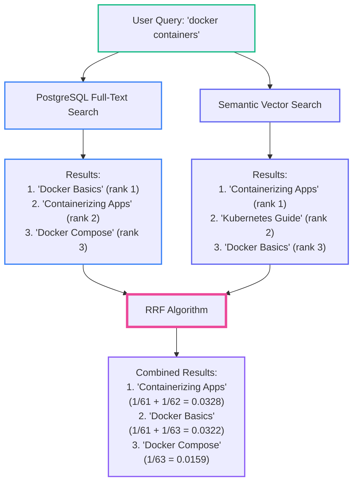
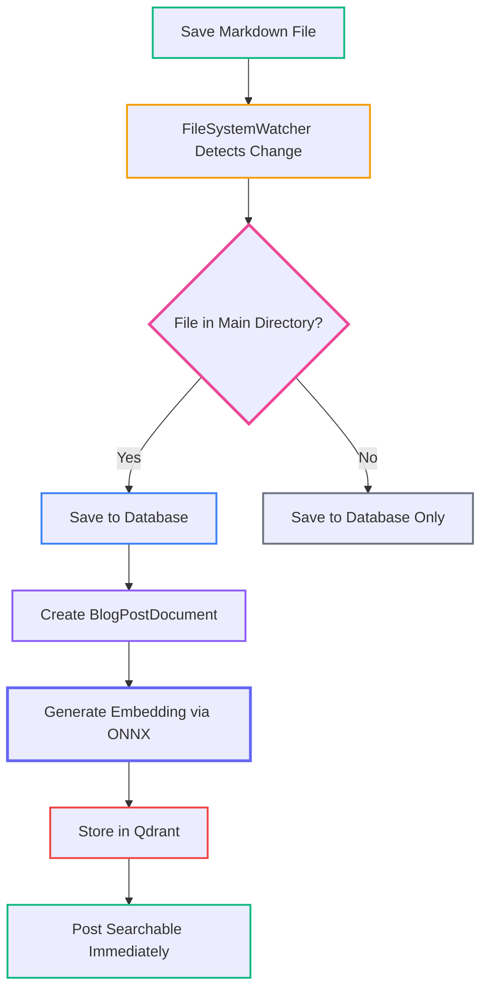
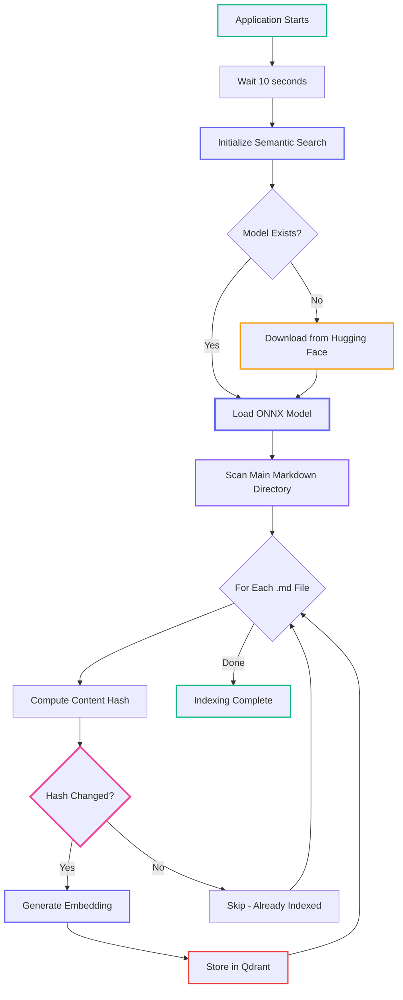

# RAG for Implementers: Hybrid Search and Automatic Indexing

<datetime class="hidden">2025-11-22T12:00</datetime>
<!-- category -- ASP.NET, Semantic Search, ONNX, Qdrant, Machine Learning, Vector Search, RAG, AI-Article -->

# Introduction

**📖 Part of the RAG Series:** This is Part 5 - production integration patterns:
- [Part 1: RAG Origins and Fundamentals](/blog/rag-primer) - What embeddings are, why they matter
- [Part 2: RAG Architecture and Internals](/blog/rag-architecture) - Chunking, tokenization, vector databases
- [Part 3: RAG in Practice](/blog/rag-practical-applications) - Building complete RAG systems
- [Part 4a: ONNX & Qdrant Implementation](/blog/semantic-search-with-onnx-and-qdrant) - CPU-friendly semantic search foundation
- [Part 4b: Semantic Search in Action](/blog/semantic-search-in-action) - Typeahead, hybrid search, and UI components
- **Part 5: Hybrid Search & Auto-Indexing** (this article) - Production integration patterns

In [Part 4a](/blog/semantic-search-with-onnx-and-qdrant), we built the foundation: ONNX embeddings and Qdrant storage. In [Part 4b](/blog/semantic-search-in-action), we covered the search UI and hybrid search implementation. Now we'll make it production-ready with **automatic indexing** (zero-touch content updates) via FileSystemWatcher.

[TOC]

# Hybrid Search: Best of Both Worlds

Semantic search is powerful but traditional full-text search still excels at exact phrases and technical terms. **The solution?** Use both.

**Why Hybrid?** Different approaches have different strengths:
- **PostgreSQL Full-Text** ([covered here](/blog/textsearchingpt1)): Exact matches, technical terms, Boolean operators
- **Semantic Vector Search**: Meaning, context, synonyms, conceptually related content

## Reciprocal Rank Fusion (RRF)

We use **Reciprocal Rank Fusion** to combine results from multiple search sources:



**The RRF formula:** `score = Σ(1 / (k + rank))`

- `k` = 60 (constant to prevent early ranks dominating)
- `rank` = position in that search method's results
- Results in **both** sources get scores from each added together

**Why RRF works:**
- **Deduplication**: Same result in both sources scores higher
- **Fairness**: No search method dominates unfairly
- **Simplicity**: No complex tuning required

## Implementation

```csharp
public class HybridSearchService : IHybridSearchService
{
    private readonly ISemanticSearchService _semanticSearchService;
    private const int RrfConstant = 60;

    public async Task<List<SearchResult>> SearchAsync(
        string query,
        string language = "en",
        int limit = 10,
        CancellationToken cancellationToken = default)
    {
        // Execute both searches in parallel
        var semanticResults = await _semanticSearchService.SearchAsync(
            query, limit * 2, cancellationToken);

        // Filter by language and apply RRF
        var filteredResults = semanticResults
            .Where(r => r.Language == language)
            .ToList();

        return ApplyReciprocalRankFusion(filteredResults)
            .Take(limit)
            .ToList();
    }

    private List<SearchResult> ApplyReciprocalRankFusion(List<SearchResult> results)
    {
        var rrfScores = new Dictionary<string, RrfScore>();

        for (int i = 0; i < results.Count; i++)
        {
            var result = results[i];
            var key = $"{result.Slug}_{result.Language}";

            if (!rrfScores.ContainsKey(key))
                rrfScores[key] = new RrfScore { Result = result };

            // RRF formula: 1 / (k + rank)
            rrfScores[key].Score += 1.0 / (RrfConstant + i + 1);
        }

        return rrfScores.Values
            .OrderByDescending(x => x.Score)
            .Select(x => x.Result)
            .ToList();
    }
}
```

> **Note:** This shows semantic search only. In production, execute PostgreSQL full-text search in parallel and include those results in the RRF calculation.

## Integration

If you've already implemented PostgreSQL full-text search ([as covered here](/blog/textsearchingpt1)), adding semantic search is straightforward:

```csharp
// Program.cs
services.AddSemanticSearch(configuration);
services.AddSingleton<IHybridSearchService, HybridSearchService>();
```

```csharp
[HttpGet("search/hybrid")]
public async Task<IActionResult> HybridSearch(string query, string language = "en")
{
    var results = await _hybridSearchService.SearchAsync(query, language);
    return PartialView("_SearchResults", results);
}
```

# Automatic Indexing with File System Watcher

The most powerful feature: **automatic indexing**. Save a blog post, it's immediately searchable - no manual intervention.

## How It Works



**Key Design Decision:** Only index files in the **main Markdown directory**, not subdirectories (`translated/`, `drafts/`, `comments/`). This keeps the search index clean.

## File Watcher Integration

The blog already has a `MarkdownDirectoryWatcherService`. We extend it to trigger semantic indexing:

```csharp
// In MarkdownDirectoryWatcherService.cs
private async Task OnChangedAsync(WaitForChangedResult e)
{
    if (e.Name == null) return;

    await retryPolicy.ExecuteAsync(async () =>
    {
        var savedModel = await blogService.SavePost(slug, language, markdown);

        // Index ONLY if file is in main directory (no path separators in name)
        if (!e.Name.Contains(Path.DirectorySeparatorChar) &&
            !e.Name.Contains(Path.AltDirectorySeparatorChar))
        {
            await IndexPostForSemanticSearchAsync(scope, savedModel, language);
        }
    });
}

private async Task IndexPostForSemanticSearchAsync(
    IServiceScope scope,
    BlogPostDto post,
    string language)
{
    var semanticSearchService = scope.ServiceProvider.GetService<ISemanticSearchService>();
    if (semanticSearchService == null) return; // Not configured

    var document = new BlogPostDocument
    {
        Id = $"{post.Slug}_{language}",
        Slug = post.Slug,
        Title = post.Title,
        Content = post.PlainTextContent,
        Language = language,
        Categories = post.Categories?.ToList() ?? new List<string>(),
        PublishedDate = post.PublishedDate
    };

    await semanticSearchService.IndexPostAsync(document);
    _logger.LogInformation("Indexed {Slug} ({Language}) in semantic search", post.Slug, language);
}
```

## Handling Deletions

When a post is deleted, remove it from the semantic index:

```csharp
private async Task OnDeletedAsync(WaitForChangedResult e)
{
    await blogService.Delete(slug, language);

    // Delete from semantic search ONLY if file was in main directory
    if (!e.Name.Contains(Path.DirectorySeparatorChar) &&
        !e.Name.Contains(Path.AltDirectorySeparatorChar))
    {
        var semanticSearchService = scope.ServiceProvider.GetService<ISemanticSearchService>();
        await semanticSearchService?.DeletePostAsync(slug, language);
    }
}
```

# Background Service for Initial Indexing

On startup, a background service indexes existing posts not yet in Qdrant:



```csharp
public class SemanticIndexingBackgroundService : BackgroundService
{
    protected override async Task ExecuteAsync(CancellationToken stoppingToken)
    {
        // Wait for app to be ready
        await Task.Delay(TimeSpan.FromSeconds(10), stoppingToken);

        // Initialize (downloads model if needed)
        await _semanticSearchService.InitializeAsync(stoppingToken);

        // Get all posts from main directory only
        var markdownFiles = Directory.GetFiles(
            _markdownConfig.MarkdownPath,
            "*.md",
            SearchOption.TopDirectoryOnly);  // NOT subdirectories

        foreach (var file in markdownFiles)
        {
            var needsIndexing = await _semanticSearchService.NeedsReindexingAsync(
                slug, language, contentHash, stoppingToken);

            if (needsIndexing)
                await _semanticSearchService.IndexPostAsync(document, stoppingToken);
        }
    }
}
```

**This ensures:**
1. **Lazy model loading** - Downloads on first use, not blocking startup
2. **Incremental indexing** - Only new/changed posts re-indexed (via content hash)
3. **Main directory only** - Drafts and translated files don't pollute the index

# What We've Built

Across Parts 4a, 4b, and 5, we now have:

- ✅ **CPU-friendly semantic search** - No GPU required
- ✅ **Related posts discovery** - Semantically similar content
- ✅ **Natural language search** - Find by meaning, not just keywords
- ✅ **Hybrid search** - Best of semantic + full-text
- ✅ **Automatic indexing** - Zero-touch content updates
- ✅ **Self-hosted** - Your data stays on your server

**Future enhancements:**
- **Category-Aware Search** - Boost results from specific categories
- **Multilingual Embeddings** - Language-specific embedding models
- **OpenSearch Integration** - Add OpenSearch to the hybrid mix ([see my OpenSearch article](/blog/textsearchingpt3))

# Conclusion

This completes the practical implementation of RAG-style semantic search. Combined with [Part 4a](/blog/semantic-search-with-onnx-and-qdrant) (foundation) and [Part 4b](/blog/semantic-search-in-action) (search UI), you have everything needed to add intelligent search to your .NET application - running entirely on CPU, at zero additional cost.

## Continue Learning

- **[RAG Part 1: Origins and Fundamentals](/blog/rag-primer)** - The theory behind embeddings
- **[RAG Part 2: Architecture and Internals](/blog/rag-architecture)** - Deep dive into RAG systems
- **[RAG Part 3: Practical Applications](/blog/rag-practical-applications)** - Complete RAG with LLM integration
- **[Part 4a: ONNX & Qdrant Implementation](/blog/semantic-search-with-onnx-and-qdrant)** - Foundation: embeddings and vector storage
- **[Part 4b: Semantic Search in Action](/blog/semantic-search-in-action)** - Typeahead, hybrid search, and UI
- **[Full-Text Search with PostgreSQL](/blog/textsearchingpt1)** - The full-text side of hybrid search

## Resources

### Qdrant & Vector Databases
- [Self-Hosted Vector Databases with Qdrant](/blog/self-hosted-vector-databases-qdrant) - Deep dive into Qdrant concepts, HNSW indexing, filtering, and C# client
- [Qdrant Hybrid Search](https://qdrant.tech/documentation/concepts/hybrid-queries/) - Qdrant's native hybrid support

### Hybrid Search
- [Reciprocal Rank Fusion Paper](https://plg.uwaterloo.ca/~gvcormac/cormacksigir09-rrf.pdf) - The RRF algorithm

### File System Watching
- [FileSystemWatcher Class](https://learn.microsoft.com/en-us/dotnet/api/system.io.filesystemwatcher) - .NET documentation
- [BackgroundService Class](https://learn.microsoft.com/en-us/dotnet/api/microsoft.extensions.hosting.backgroundservice) - Hosted services in ASP.NET Core

### Complete Code
All code is available at: [github.com/scottgal/mostlylucidweb](https://github.com/scottgal/mostlylucidweb)
- `Mostlylucid.SemanticSearch/` - Core semantic search library
- `Mostlylucid/Blog/WatcherService/` - File watcher with semantic indexing
 