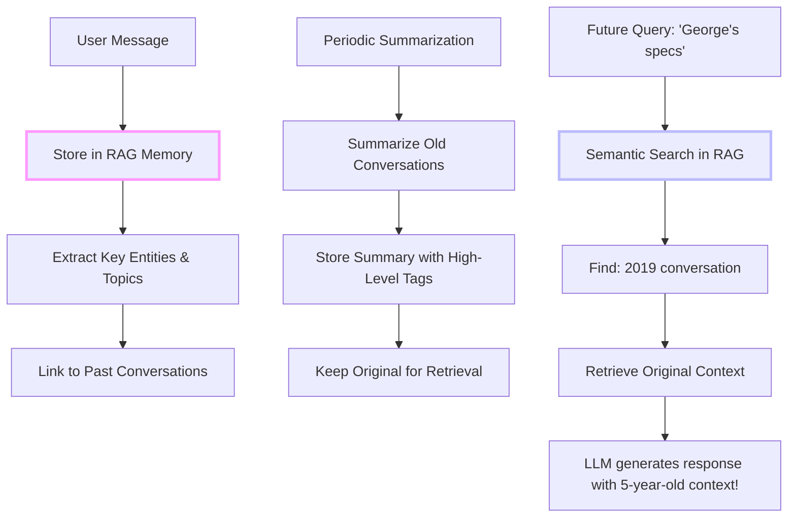

# RAG in Practice: Building Real-World Applications

In [Part 1](/blog/rag-primer) and [Part 2](/blog/rag-architecture) of this series, we covered RAG's origins, fundamentals, and technical architecture. You understand what RAG is, why it matters, and how it works under the hood. Now it's time to put that knowledge into practice. This article shows you how to build real RAG systems with working C# code, solve common challenges, and use advanced techniques from recent research.

<datetime class="hidden">2025-11-22T10:00</datetime>
<!-- category -- AI, RAG, Machine Learning, Semantic Search, LLM, AI-Article -->

# Introduction

**📖 Series Navigation:** This is Part 3 of the RAG series:
- [Part 1: Origins and Fundamentals](/blog/rag-primer) - History, motivation, and core concepts
- [Part 2: Architecture and Internals](/blog/rag-architecture) - Technical deep dive into how RAG works
- **Part 3: RAG in Practice** (this article) - Building real systems, challenges, and advanced techniques
- [Part 4a: ONNX & Qdrant Implementation](/blog/semantic-search-with-onnx-and-qdrant) - CPU-friendly semantic search foundation
- [Part 4b: Semantic Search in Action](/blog/semantic-search-in-action) - Typeahead, hybrid search, and UI
- [Part 5: Hybrid Search & Auto-Indexing](/blog/rag-hybrid-search-and-indexing) - Production integration patterns
- [Part 6: GraphRAG](/blog/graphrag-knowledge-graphs-for-rag) - Knowledge graphs for corpus-level understanding

If you haven't read Parts 1 and 2, I recommend starting there to understand:
- What RAG is and why it matters (Part 1)
- The history from keyword search to semantic understanding (Part 1)
- Complete RAG pipeline: indexing, retrieval, generation (Part 2)
- LLM internals: tokens, KV cache, context windows (Part 2)
- RAG vs fine-tuning and other approaches (Part 1)

This article assumes you understand those fundamentals and focuses on **implementation, optimization, and real-world patterns**.

[TOC]

# Real-World RAG Applications on This Blog

I've built several RAG-powered features on this blog. Let me show you concrete examples.

## 1. Related Posts Recommendation

Every blog post can show "Related Posts" using semantic similarity.

**How it works:**
1. Each blog post gets embedded when published
2. When viewing a post, we retrieve its embedding from Qdrant
3. Find the 5 most similar post embeddings
4. Display as "Related Posts"

**Why it's better than tags:**
- Tags require manual categorization
- Semantic search finds conceptually related posts even without matching tags
- "Docker Compose" and "Container orchestration" posts are related semantically

**Code snippet:**
```csharp
public async Task<List<SearchResult>> GetRelatedPostsAsync(
    string currentPostSlug,
    string language,
    int limit = 5)
{
    // Get the current post's embedding
    var currentPost = await _vectorStore.GetByIdAsync(currentPostSlug);

    if (currentPost == null)
        return new List<SearchResult>();

    // Find similar posts
    var similarPosts = await _vectorStore.SearchAsync(
        currentPost.Embedding,
        limit: limit + 1,  // +1 because result includes the current post
        filter: new Filter
        {
            Must =
            {
                new Condition
                {
                    Field = "language",
                    Match = new Match { Keyword = language }
                }
            },
            MustNot =
            {
                new Condition
                {
                    Field = "slug",
                    Match = new Match { Keyword = currentPostSlug }
                }
            }
        }
    );

    return similarPosts.Take(limit).ToList();
}
```

## 2. Semantic Blog Search

The search box on this blog uses RAG-style semantic search (though without the generation part - it's just retrieval).

**User experience:**
- Search for "setting up a database" → finds posts about PostgreSQL, Entity Framework, migrations
- Search for "deployment" → finds posts about Docker, hosting, CI/CD
- No need for exact keyword matches

**Implementation:** I'll cover building this in an upcoming article on vector databases.

## 3. The "Lawyer GPT" Writing Assistant

I'm building a complete RAG system to help me write new blog posts.

**Use case:** When I start writing about "adding authentication to ASP.NET Core", the system:
1. Embeds my current draft
2. Searches past posts for related content about authentication, ASP.NET, security
3. Suggests relevant code snippets I've used before
4. Auto-generates internal links to related posts
5. Maintains consistency with my writing style

**Full RAG pipeline:**
```csharp
public async Task<WritingAssistanceResponse> GetSuggestionsAsync(
    string currentDraft,
    string topic)
{
    // 1. Embed the current draft
    var draftEmbedding = await _embeddingService.GenerateEmbeddingAsync(
        currentDraft
    );

    // 2. Retrieve related past content
    var relatedPosts = await _vectorStore.SearchAsync(
        draftEmbedding,
        limit: 5
    );

    // 3. Build context for LLM
    var prompt = BuildWritingAssistancePrompt(
        currentDraft,
        topic,
        relatedPosts
    );

    // 4. Generate suggestions using local LLM
    var suggestions = await _llmService.GenerateAsync(prompt);

    // 5. Extract and format citations
    var response = ExtractCitations(suggestions, relatedPosts);

    return response;
}
```

This is RAG in action - retrieval (semantic search) + augmentation (adding context) + generation (LLM suggestions).

# Common RAG Challenges and Solutions

Building production RAG systems isn't trivial. Here are challenges I've encountered and how to solve them.

## Challenge 1: Chunking Strategy

**Problem:** How do you split documents? Too small = loss of context. Too large = irrelevant information.

**Solution:** Hybrid chunking based on document structure.

```csharp
public class SmartChunker
{
    public List<Chunk> ChunkDocument(string markdown, string sourceId)
    {
        var chunks = new List<Chunk>();

        // Parse markdown into sections
        var document = Markdown.Parse(markdown);
        var sections = ExtractSections(document);

        foreach (var section in sections)
        {
            var wordCount = CountWords(section.Content);

            if (wordCount < MinChunkSize)
            {
                // Merge small sections
                MergeWithPrevious(chunks, section);
            }
            else if (wordCount > MaxChunkSize)
            {
                // Split large sections
                var subChunks = SplitSection(section);
                chunks.AddRange(subChunks);
            }
            else
            {
                // Just right
                chunks.Add(CreateChunk(section, sourceId));
            }
        }

        return chunks;
    }
}
```

**Best practices:**
- Respect document structure (headers, paragraphs)
- Add overlap between chunks (50-100 words)
- Preserve code blocks intact
- Include section headers in each chunk for context

## Challenge 2: Embedding Quality

**Problem:** Generic embedding models may not capture domain-specific semantics.

**Solutions:**

**Option 1: Fine-tune embeddings** (advanced)
```python
# Using sentence-transformers in Python
from sentence_transformers import SentenceTransformer, InputExample, losses

model = SentenceTransformer('all-MiniLM-L6-v2')

# Create training examples from your domain
train_examples = [
    InputExample(texts=['Docker Compose', 'container orchestration'], label=0.9),
    InputExample(texts=['Entity Framework', 'ORM database'], label=0.9),
    InputExample(texts=['Docker', 'apple fruit'], label=0.1)
]

# Fine-tune
train_dataloader = DataLoader(train_examples, shuffle=True, batch_size=16)
train_loss = losses.CosineSimilarityLoss(model)
model.fit(train_objectives=[(train_dataloader, train_loss)], epochs=1)
```

**Option 2: Hybrid embeddings** (combine multiple models)
```csharp
public async Task<float[]> GenerateHybridEmbeddingAsync(string text)
{
    var semantic = await _semanticModel.GenerateEmbeddingAsync(text);
    var keyword = await _keywordModel.GenerateEmbeddingAsync(text);

    // Concatenate or weighted average
    return CombineEmbeddings(semantic, keyword);
}
```

**Option 3: Add metadata filtering**
```csharp
var results = await _vectorStore.SearchAsync(
    queryEmbedding,
    limit: 10,
    filter: new Filter
    {
        Must =
        {
            new Condition { Field = "category", Match = new Match { Keyword = "ASP.NET" } },
            new Condition { Field = "date", Range = new Range { Gte = "2024-01-01" } }
        }
    }
);
```

## Challenge 3: Context Window Management

**Problem:** LLMs have token limits. How do you fit query + context + prompt in the window?

**Solution:** Dynamic context selection and summarization.

```csharp
public string BuildContextAwarePrompt(
    string query,
    List<SearchResult> retrievedDocs,
    int maxTokens = 4096)
{
    var promptTemplate = GetPromptTemplate();
    var queryTokens = CountTokens(query);
    var templateTokens = CountTokens(promptTemplate);

    // Reserve tokens for: prompt + query + response
    var availableForContext = maxTokens - queryTokens - templateTokens - 500; // 500 for response

    // Add context until we hit limit
    var selectedContext = new List<SearchResult>();
    var currentTokens = 0;

    foreach (var doc in retrievedDocs.OrderByDescending(d => d.Score))
    {
        var docTokens = CountTokens(doc.Text);

        if (currentTokens + docTokens <= availableForContext)
        {
            selectedContext.Add(doc);
            currentTokens += docTokens;
        }
        else
        {
            // Try summarizing the doc if it's important
            if (doc.Score > 0.85)
            {
                var summary = await SummarizeAsync(doc.Text, maxTokens: 200);
                var summaryTokens = CountTokens(summary);

                if (currentTokens + summaryTokens <= availableForContext)
                {
                    selectedContext.Add(new SearchResult
                    {
                        Text = summary,
                        Title = doc.Title,
                        Score = doc.Score
                    });
                    currentTokens += summaryTokens;
                }
            }
        }
    }

    return FormatPrompt(query, selectedContext);
}
```

## Challenge 4: Hallucination Despite RAG

**Problem:** Even with context, LLMs sometimes ignore it and hallucinate.

**Solutions:**

**1. Prompt engineering:**
```csharp
var systemPrompt = @"
You are a technical assistant.

CRITICAL RULES:
1. ONLY use information from the provided CONTEXT sections
2. If the context doesn't contain the answer, say 'I don't have enough information in the provided context to answer that'
3. DO NOT use your training data to supplement answers
4. Always cite the source using [1], [2] notation
5. If you're unsure, say so

CONTEXT:
{context}

QUESTION: {query}

ANSWER (following all rules above):
";
```

**2. Post-generation validation:**
```csharp
public async Task<bool> ValidateResponseAgainstContext(
    string response,
    List<SearchResult> context)
{
    // Check if response contains claims not in context
    var responseSentences = SplitIntoSentences(response);

    foreach (var sentence in responseSentences)
    {
        var isSupported = await IsClaimSupportedByContext(sentence, context);

        if (!isSupported)
        {
            _logger.LogWarning("Hallucination detected: {Sentence}", sentence);
            return false;
        }
    }

    return true;
}
```

**3. Iterative refinement:**
```csharp
public async Task<string> GenerateWithValidationAsync(
    string query,
    List<SearchResult> context,
    int maxAttempts = 3)
{
    for (int attempt = 0; attempt < maxAttempts; attempt++)
    {
        var response = await _llm.GenerateAsync(
            BuildPrompt(query, context)
        );

        var isValid = await ValidateResponseAgainstContext(response, context);

        if (isValid)
            return response;

        // Refine prompt for next attempt
        query = $"{query}\n\nPrevious attempt hallucinated. Stick strictly to the context.";
    }

    return "I couldn't generate a reliable answer. Please rephrase your question.";
}
```

## Challenge 5: Keeping the Index Up-to-Date

**Problem:** As you add new documents, the vector database needs to stay current.

**Solution:** Automated indexing pipeline.

```csharp
public class BlogIndexingBackgroundService : BackgroundService
{
    private readonly IVectorStoreService _vectorStore;
    private readonly IMarkdownService _markdownService;
    private readonly ILogger<BlogIndexingBackgroundService> _logger;

    protected override async Task ExecuteAsync(CancellationToken stoppingToken)
    {
        while (!stoppingToken.IsCancellationRequested)
        {
            try
            {
                await IndexNewPostsAsync(stoppingToken);

                // Check for updates every hour
                await Task.Delay(TimeSpan.FromHours(1), stoppingToken);
            }
            catch (Exception ex)
            {
                _logger.LogError(ex, "Error in indexing service");
            }
        }
    }

    private async Task IndexNewPostsAsync(CancellationToken ct)
    {
        var allPosts = await _markdownService.GetAllPostsAsync();

        foreach (var post in allPosts)
        {
            var existingDoc = await _vectorStore.GetByIdAsync(post.Slug);

            // Check if content changed
            var currentHash = ComputeHash(post.Content);

            if (existingDoc == null || existingDoc.ContentHash != currentHash)
            {
                _logger.LogInformation("Indexing updated post: {Title}", post.Title);

                var chunks = _chunker.ChunkDocument(post.Content, post.Slug);

                foreach (var chunk in chunks)
                {
                    var embedding = await _embeddingService.GenerateEmbeddingAsync(chunk.Text);

                    await _vectorStore.UpsertAsync(
                        id: $"{post.Slug}_{chunk.Index}",
                        embedding: embedding,
                        metadata: new Dictionary<string, object>
                        {
                            ["slug"] = post.Slug,
                            ["title"] = post.Title,
                            ["chunk_index"] = chunk.Index,
                            ["content_hash"] = currentHash
                        },
                        ct: ct
                    );
                }
            }
        }
    }
}
```

# Advanced RAG Techniques

Let's explore cutting-edge RAG techniques from recent research.

## 1. Hypothetical Document Embeddings (HyDE)

**Problem:** User queries are often short and poorly formed. Document chunks are detailed and well-written. This mismatch hurts retrieval.

**Solution:** Generate a hypothetical ideal document that would answer the query, embed that, then search.

```csharp
public async Task<List<SearchResult>> HyDESearchAsync(string query)
{
    // Generate hypothetical answer (even if hallucinated)
    var hypotheticalAnswer = await _llm.GenerateAsync($@"
        Write a detailed, technical paragraph that would perfectly answer this question:

        Question: {query}

        Paragraph:"
    );

    // Embed the hypothetical answer
    var embedding = await _embeddingService.GenerateEmbeddingAsync(
        hypotheticalAnswer
    );

    // Search using this embedding
    return await _vectorStore.SearchAsync(embedding);
}
```

**Why it works:** The hypothetical answer uses similar language and structure to actual documents, improving retrieval.

## 2. Self-Querying

**Problem:** User queries often mix semantic search with metadata filters.

Example: "Recent posts about Docker" = semantic("Docker") + filter(date > 2024-01-01)

**Solution:** Use LLM to parse the query into semantic + metadata filters.

```csharp
public async Task<SearchQuery> ParseSelfQueryAsync(string naturalLanguageQuery)
{
    var parsingPrompt = $@"
        Parse this search query into:
        1. Semantic search query (what the user is looking for)
        2. Metadata filters (category, date range, etc.)

        User Query: {naturalLanguageQuery}

        Output JSON:
        {{
            ""semantic_query"": ""the core concept"",
            ""filters"": {{
                ""category"": ""...",
                ""date_after"": ""..."",
                ""date_before"": ""...""
            }}
        }}
    ";

    var jsonResponse = await _llm.GenerateAsync(parsingPrompt);
    var parsed = JsonSerializer.Deserialize<SearchQuery>(jsonResponse);

    return parsed;
}

// Use parsed query
var parsedQuery = await ParseSelfQueryAsync("Recent ASP.NET posts about authentication");
// semantic_query: "authentication"
// filters: { category: "ASP.NET", date_after: "2024-01-01" }

var results = await _vectorStore.SearchAsync(
    embedding: await _embeddingService.GenerateEmbeddingAsync(parsedQuery.SemanticQuery),
    filter: BuildFilter(parsedQuery.Filters)
);
```

## 3. Multi-Query RAG

**Problem:** A single query might miss relevant documents due to phrasing.

**Solution:** Generate multiple variations of the query, search with all, combine results.

```csharp
public async Task<List<SearchResult>> MultiQuerySearchAsync(string query)
{
    // Generate query variations
    var variations = await _llm.GenerateAsync($@"
        Generate 3 different ways to phrase this search query:

        Original: {query}

        Variations (one per line):
    ");

    var queries = variations.Split('\n', StringSplitOptions.RemoveEmptyEntries)
        .Prepend(query) // Include original
        .ToList();

    // Search with all variations
    var allResults = new List<SearchResult>();

    foreach (var q in queries)
    {
        var embedding = await _embeddingService.GenerateEmbeddingAsync(q);
        var results = await _vectorStore.SearchAsync(embedding, limit: 10);
        allResults.AddRange(results);
    }

    // Deduplicate and merge scores
    var merged = allResults
        .GroupBy(r => r.Id)
        .Select(g => new SearchResult
        {
            Id = g.Key,
            Text = g.First().Text,
            Title = g.First().Title,
            Score = g.Max(r => r.Score) // Take best score
        })
        .OrderByDescending(r => r.Score)
        .ToList();

    return merged;
}
```

## 4. Contextual Compression

**Problem:** Retrieved chunks contain irrelevant information. Sending it all wastes tokens.

**Solution:** Use a smaller LLM to compress retrieved context to only relevant parts.

```csharp
public async Task<string> CompressContextAsync(
    string query,
    List<SearchResult> retrievedDocs)
{
    var compressed = new List<string>();

    foreach (var doc in retrievedDocs)
    {
        var compressionPrompt = $@"
            Extract only the sentences from this document that are relevant to answering the question.

            Question: {query}

            Document:
            {doc.Text}

            Relevant excerpts (maintain original wording):
        ";

        var relevantExcerpt = await _smallLLM.GenerateAsync(compressionPrompt);

        if (!string.IsNullOrWhiteSpace(relevantExcerpt))
        {
            compressed.Add($"From '{doc.Title}':\n{relevantExcerpt}");
        }
    }

    return string.Join("\n\n", compressed);
}
```

## 5. Iterative Retrieval (Multi-Hop RAG)

**Problem:** Complex questions require information from multiple sources that need to be connected.

Example: "What database does the blog use and how is semantic search implemented?"
- Hop 1: Find what database is used (PostgreSQL)
- Hop 2: Find how semantic search works with that database

**Solution:** Iterative retrieval and synthesis.

```csharp
public async Task<string> MultiHopRAGAsync(string complexQuery, int maxHops = 3)
{
    var currentQuery = complexQuery;
    var allContext = new List<SearchResult>();

    for (int hop = 0; hop < maxHops; hop++)
    {
        // Retrieve for current query
        var results = await SearchAsync(currentQuery, limit: 5);
        allContext.AddRange(results);

        // Check if we have enough information
        var synthesisPrompt = $@"
            Original question: {complexQuery}

            Context so far:
            {FormatContext(allContext)}

            Can you answer the original question with this context?
            If yes, provide the answer.
            If no, what additional information do you need? (be specific)
        ";

        var synthesis = await _llm.GenerateAsync(synthesisPrompt);

        if (synthesis.Contains("yes", StringComparison.OrdinalIgnoreCase))
        {
            // We have enough information
            return ExtractAnswer(synthesis);
        }

        // Extract what we need for next hop
        currentQuery = ExtractNextQuery(synthesis);
    }

    // Final synthesis with all gathered context
    return await GenerateFinalAnswerAsync(complexQuery, allContext);
}
```

## 6. Long-Term Context Memory with RAG + Summarization

**Problem:** How do you build AI systems that remember conversations from months or years ago? Traditional chatbots lose context after each session.

**Solution:** Combine RAG with progressive summarization to create persistent, searchable memory.

This is the approach used in **DiSE (Directed Synthetic Evolution)** - an advanced system I'm building that uses RAG-based context memory to maintain shared conversational history indefinitely.

**Example scenario:**
```
User (Today): "Remember George's specs?"
AI: "Yes, you discussed George's prescription requirements in our conversation
     from 5 years ago (2019-03-15). He needed progressive lenses with..."
```

**How it works:**



**Implementation approach:**

```csharp
public class LongTermConversationalMemory
{
    private readonly IVectorStoreService _vectorStore;
    private readonly IEmbeddingService _embeddingService;

    public async Task StoreConversationAsync(
        string conversationId,
        string userId,
        List<ConversationTurn> turns,
        DateTime timestamp)
    {
        // Extract key entities and topics
        var entities = await ExtractEntitiesAsync(turns);
        var topics = await ExtractTopicsAsync(turns);

        // Create searchable representation
        var conversationText = string.Join("\n", turns.Select(t =>
            $"{t.Speaker}: {t.Message}"));

        // Generate embedding
        var embedding = await _embeddingService.GenerateEmbeddingAsync(
            conversationText);

        // Store in RAG with rich metadata
        await _vectorStore.IndexDocumentAsync(
            id: $"conv_{conversationId}",
            embedding: embedding,
            metadata: new Dictionary<string, object>
            {
                ["user_id"] = userId,
                ["timestamp"] = timestamp.ToString("O"),
                ["entities"] = entities,  // ["George", "specs", "prescription"]
                ["topics"] = topics,      // ["healthcare", "eyewear"]
                ["full_text"] = conversationText,
                ["turn_count"] = turns.Count
            }
        );
    }

    public async Task<List<PastContext>> RetrieveRelevantPastAsync(
        string currentQuery,
        string userId,
        int limit = 5)
    {
        // Embed the current query
        var queryEmbedding = await _embeddingService.GenerateEmbeddingAsync(
            currentQuery);

        // Search past conversations
        var results = await _vectorStore.SearchAsync(
            queryEmbedding,
            limit: limit,
            filter: new Filter
            {
                Must =
                {
                    new Condition { Field = "user_id", Match = new Match { Keyword = userId } }
                }
            }
        );

        return results.Select(r => new PastContext
        {
            ConversationId = r.Id,
            Timestamp = DateTime.Parse(r.Metadata["timestamp"].ToString()),
            Entities = (List<string>)r.Metadata["entities"],
            FullText = r.Metadata["full_text"].ToString(),
            Relevance = r.Score
        }).ToList();
    }

    // Periodic summarization to keep memory manageable
    public async Task SummarizeOldConversationsAsync(DateTime olderThan)
    {
        var oldConversations = await _vectorStore.FindByDateRangeAsync(
            endDate: olderThan);

        foreach (var conv in oldConversations)
        {
            // Generate summary using LLM
            var summary = await _llm.GenerateAsync($@"
                Summarize this conversation, preserving key facts and entities:

                {conv.FullText}

                Summary:");

            // Update document with summary while keeping original
            await _vectorStore.UpdateAsync(
                id: conv.Id,
                additionalMetadata: new Dictionary<string, object>
                {
                    ["summary"] = summary,
                    ["summarized_at"] = DateTime.UtcNow.ToString("O")
                }
            );
        }
    }
}
```

**Why this is powerful:**

1. **Infinite memory span** - Conversations from years ago are as accessible as yesterday's
2. **Semantic search** - "George's specs" finds the conversation even if stored as "George's prescription eyewear requirements"
3. **Entity linking** - All conversations mentioning "George" are connected
4. **Privacy-preserving** - Can implement per-user memory isolation
5. **Cost-effective** - Summarization prevents storage explosion while maintaining searchability

**Real-world example from DiSE:**

DiSE uses this approach to remember:
- **Tool invocations** from months ago (what worked, what failed)
- **Code patterns** that were successful in past projects
- **User preferences** established in earlier conversations
- **Domain knowledge** accumulated over time

This creates an AI system that genuinely "learns" from every interaction and builds institutional memory, rather than starting fresh each session.

**Challenges to consider:**

1. **Privacy**: Old conversations must be properly isolated per user
2. **Relevance decay**: Not all old information stays relevant
3. **Storage costs**: Need summarization strategy for scale
4. **Consistency**: Keeping summaries aligned with originals
5. **Retrieval precision**: Balancing between recent and historically important context

This technique transforms RAG from "search my documents" into "remember everything we've ever discussed" - a game-changer for long-term AI assistants.

# When NOT to Use RAG

RAG isn't always the answer. Here's when to avoid it:

**1. General knowledge questions**
- "What is the capital of France?" - LLM already knows this
- RAG adds latency and cost for no benefit

**2. Creative writing**
- Poetry, fiction, brainstorming
- RAG constrains creativity by grounding in existing text

**3. Real-time data needs**
- Stock prices, live sports scores
- Better served by API integrations, not RAG

**4. Mathematical reasoning**
- "Calculate 15% tip on $83.47"
- LLMs can do arithmetic; RAG doesn't help

**5. Very small knowledge bases**
- If your knowledge base fits in the context window, just include it all
- RAG overhead isn't worth it for 5 documents

**6. When you control the LLM's training**
- If you're training a model from scratch on your data, fine-tuning might be better
- RAG is best when using pre-trained models you don't control

# Getting Started with RAG: A Practical Guide

Want to build your own RAG system? Here's a step-by-step approach.

## Week 1: Start Simple

**Goal:** Get basic retrieval working with no LLM.

```csharp
// 1. Choose an embedding service (start with API for simplicity)
var openAI = new OpenAIClient(apiKey);

// 2. Embed a few test documents
var docs = new[]
{
    "Docker is a containerization platform",
    "Kubernetes orchestrates containers",
    "Entity Framework is an ORM for .NET"
};

var embeddings = new List<float[]>();
foreach (var doc in docs)
{
    var response = await openAI.GetEmbeddingsAsync(
        new EmbeddingsOptions("text-embedding-3-small", new[] { doc })
    );
    embeddings.Add(response.Value.Data[0].Embedding.ToArray());
}

// 3. Implement basic search (in-memory for now)
var query = "container orchestration";
var queryEmbedding = await GetEmbeddingAsync(query);

var results = embeddings
    .Select((emb, idx) => new
    {
        Text = docs[idx],
        Score = CosineSimilarity(queryEmbedding, emb)
    })
    .OrderByDescending(r => r.Score)
    .ToList();

// 4. Verify search works
foreach (var result in results)
{
    Console.WriteLine($"{result.Score:F3}: {result.Text}");
}
// Expected: Kubernetes scores highest
```

## Week 2: Add Vector Database

**Goal:** Scale to real document collections.

Next steps to implement:
1. Run Qdrant in Docker
2. Index your documents
3. Implement search endpoint

I'll cover this in detail in an upcoming article on vector databases.

## Week 3: Add LLM Generation

**Goal:** Complete the RAG pipeline.

```csharp
// 1. Retrieve context
var context = await SearchAsync(query, limit: 3);

// 2. Build prompt
var prompt = $@"
    Answer the question using this context:

    {FormatContext(context)}

    Question: {query}

    Answer:";

// 3. Generate (start with API)
var response = await openAI.GetChatCompletionsAsync(new ChatCompletionsOptions
{
    Messages =
    {
        new ChatMessage(ChatRole.System, "You are a helpful assistant."),
        new ChatMessage(ChatRole.User, prompt)
    },
    Temperature = 0.7f,
    MaxTokens = 500
});

return response.Value.Choices[0].Message.Content;
```

## Week 4: Optimize and Polish

- Add caching (save on API costs)
- Improve chunking strategy
- Add metadata filtering
- Implement hybrid search
- Add citation extraction

## Going Local (Optional)

Once the basics work, migrate to local inference (I'll cover this in upcoming articles):
- Local LLM inference with GPU acceleration
- CPU-friendly embeddings with ONNX Runtime

# Conclusion

RAG (Retrieval-Augmented Generation) is a powerful technique for making LLMs more accurate, up-to-date, and trustworthy by grounding their responses in actual documents. Instead of relying on the model's training data alone, RAG systems:

1. **Retrieve** relevant information from a knowledge base using semantic search
2. **Augment** the LLM's prompt with that retrieved context
3. **Generate** responses that are grounded in real sources with citations

**Key advantages of RAG:**
- Always up-to-date (just update your knowledge base)
- Grounded in sources (reduces hallucination)
- Explainable (can cite sources)
- Cost-effective (no expensive retraining)
- Privacy-preserving (can run entirely locally)
- Domain-specific (use your own documents)

**When to use RAG:**
- Knowledge-intensive tasks
- Frequently updating information
- Private/proprietary data
- Need for citations and auditability
- Cost and simplicity matter

**When to avoid RAG:**
- General knowledge questions
- Creative writing
- Real-time data (use APIs instead)
- Very small knowledge bases

The field is evolving rapidly with advanced techniques like HyDE, multi-query retrieval, and contextual compression, but the core concept remains simple: give LLMs access to the right information at the right time.

Start simple, measure results, and iterate. RAG is one of the most practical ways to build reliable AI systems today.

# Conclusion: From Theory to Production

You've now completed the three-part RAG series:

**[Part 1: Origins and Fundamentals](/blog/rag-primer)**
- What RAG is and why it matters
- History from keyword search to semantic understanding
- RAG vs fine-tuning, long context, and other approaches

**[Part 2: Architecture and Internals](/blog/rag-architecture)**
- Complete RAG pipeline: indexing, retrieval, generation
- LLM internals: tokens, KV cache, context windows
- Technical implementation details with C# code

**Part 3: RAG in Practice (this article)**
- Real-world implementations (Related Posts, Semantic Search, Writing Assistant)
- Common challenges and solutions (chunking, embedding quality, hallucination)
- Advanced techniques (HyDE, Self-Query, Multi-Query, Contextual Compression, Long-term Memory)
- When NOT to use RAG
- Getting started guide

**You now have the complete picture:** From understanding RAG's origins to building production systems with advanced optimizations.

# What's Next?

Now that you understand RAG from theory to practice, upcoming articles will show you how to build complete, production-ready RAG systems in C#:

**Coming soon:**
- **CPU-Friendly Semantic Search** - Building semantic search with ONNX embeddings that run on any VPS without GPU requirements
- **Self-Hosted Vector Databases** - Complete setup guide for Qdrant with Docker, including indexing, search, and optimization strategies
- **Building a RAG Writing Assistant** - A full series on creating an AI-powered writing assistant that uses your existing content as a knowledge base

These articles will take you from theory to practice, with complete working code, deployment strategies, and real-world optimizations based on running these systems in production on this blog.

Stay tuned for hands-on implementation guides that turn this RAG knowledge into working systems!

## Resources

**Foundational Papers:**
- [Retrieval-Augmented Generation for Knowledge-Intensive NLP Tasks](https://arxiv.org/abs/2005.11401) - The original RAG paper
- [Dense Passage Retrieval for Open-Domain Question Answering](https://arxiv.org/abs/2004.04906) - DPR (retrieval foundation)
- [Attention Is All You Need](https://arxiv.org/abs/1706.03762) - Transformers (embedding foundation)

**Tools and Frameworks:**
- [Qdrant](https://qdrant.tech/) - Vector database I use
- [ONNX Runtime](https://onnxruntime.ai/) - For local embeddings
- [LLamaSharp](https://github.com/SciSharp/LLamaSharp) - For local LLM inference
- [Sentence Transformers](https://www.sbert.net/) - Embedding models

**Further Reading:**
- [Anthropic: Contextual Retrieval](https://www.anthropic.com/index/contextual-retrieval) - Advanced RAG techniques
- [How Neural Machine Translation Works](/blog/how-neural-machine-translation-works) - Understanding the AI models behind embeddings

**This RAG Series:**
- [Part 1: Origins and Fundamentals](/blog/rag-primer) - History, motivation, core concepts
- [Part 2: Architecture and Internals](/blog/rag-architecture) - Technical deep dive
- **Part 3: RAG in Practice** (this article) - Building real systems

Happy building!
