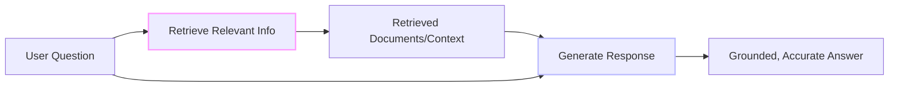
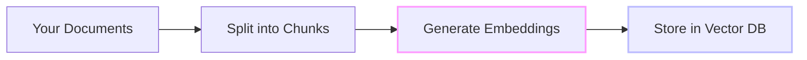
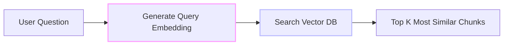
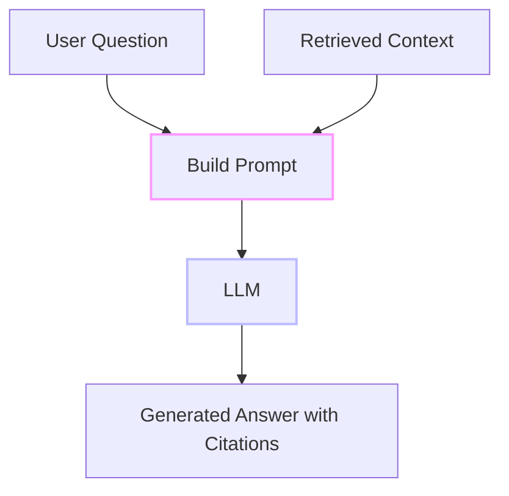

# RAG Explained: Origins and Fundamentals

Ever searched for "deployment guide" and got nothing, even though there's an article about "publishing to production"? RAG (Retrieval-Augmented Generation) solves this by understanding meaning, not just keywords. This three-part series shows you how RAG came about, how it works under the hood, and how to build production systems. From semantic search to AI-powered Q&A with citations—all with working C# code examples.

<datetime class="hidden">2025-11-22T09:00</datetime>
<!-- category -- AI, RAG, Machine Learning, Semantic Search, LLM, AI-Article -->

# Introduction

**📖 Series Navigation:** This is Part 1 of a five-part series on RAG (Retrieval-Augmented Generation):
- **Part 1: Origins and Fundamentals** (this article) - History, motivation, and core concepts
- [Part 2: Architecture and Internals](/blog/rag-architecture) - Technical deep dive into how RAG works
- [Part 3: RAG in Practice](/blog/rag-practical-applications) - Building real systems, challenges, and advanced techniques
- [Part 4: ONNX & Qdrant Implementation](/blog/semantic-search-with-onnx-and-qdrant) - CPU-friendly semantic search
- [Part 5: Hybrid Search & Auto-Indexing](/blog/rag-hybrid-search-and-indexing) - Production integration patterns

RAG (Retrieval-Augmented Generation) was developed to make AI smarter—giving LLMs access to information they weren't trained on. But here's what's interesting: the technology opens opportunities far beyond AI chatbots. It powers semantic search on websites, content recommendation, writing assistance, and knowledge management.

**The dual nature:** RAG can help customers (better search, accurate answers with citations) or exploit them (manipulative recommendations, burying negative reviews, surfacing upsell content). The difference isn't the technology—it's intent. A semantic search that helps users find what they actually need? Great. One that prioritizes what makes you the most money while appearing helpful? That's dark pattern territory, and it's why understanding how this works matters.

**Here's the truth about RAG:** It sounds intimidating. Vector embeddings? Transformer models? KV caches? But like everything else in software, it's just about understanding how it works. You don't need to know the math behind transformer architectures any more than you need to understand assembly to write C#.

**RAG in three steps:**
1. Turn text into numbers (embeddings)
2. Find similar numbers (vector search)
3. Use what you found (display results or feed to LLM)

That's it. The rest is implementation details.

This three-part series shows you how to build RAG systems with working C# code. No handwaving. No assumptions. Just the pieces and how they fit together.

**What you'll learn in this series:**
- **Part 1 (this article)**: How RAG came about and why it matters
- **Part 2**: Complete technical architecture and LLM internals
- **Part 3**: Building real systems with code examples

Later, I'll also show you how to build complete RAG systems including:
- [CPU-friendly semantic search with ONNX embeddings](/blog/semantic-search-with-onnx-and-qdrant) (Part 4)
- [Self-hosted vector databases with Qdrant](/blog/semantic-search-with-onnx-and-qdrant) (Part 4)
- [Hybrid search and automatic indexing](/blog/rag-hybrid-search-and-indexing) (Part 5)

[TOC]

# What is RAG?

**Retrieval-Augmented Generation:** Find relevant information, then use it.



**Without RAG:** User asks → LLM guesses from memory → might hallucinate

**With RAG:** User asks → Find relevant docs → LLM answers using those docs → grounded in reality

```csharp
// Without RAG: Hope the LLM knows
var answer = await llm.GenerateAsync("How do I deploy Docker?");
// Risk: Might make up outdated or wrong steps

// With RAG: Give it the docs
var relevantDocs = await vectorSearch.FindSimilar("How do I deploy Docker?");
var context = string.Join("\n", relevantDocs.Select(d => d.Text));
var answer = await llm.GenerateAsync($"Context: {context}\n\nQuestion: How do I deploy Docker?");
// Result: Answer based on YOUR actual Docker deployment docs
```

**Key insight:** Separate knowledge storage (search) from reasoning (LLM). Update your docs, search stays current. No retraining needed.

# Where Did RAG Come From?

RAG builds on decades of search and NLP research. Understanding this history helps you appreciate why RAG is designed the way it is—and what problems it solves.

## Traditional Search (pre-2010s)

**Keyword-based search:**
- **TF-IDF**: Term frequency × inverse document frequency - common words matter less
- **BM25**: Probabilistic ranking - still the baseline for keyword search
- **Fuzzy matching**:
  - **Soundex**: Phonetic algorithm ("Smith" matches "Smythe")
  - **Levenshtein Distance**: Edit distance (how many insertions/deletions/substitutions)
  - **N-Grams**: Character/word sequences for partial matching

**The problem:** These matched *characters*, not *meaning*. Search "container orchestration" and you won't find "Docker Swarm" unless those exact words appear. They could handle typos but not semantics.

## Early Question Answering (2010s)

**Watson (IBM, 2011):**
- Combined retrieval with rule-based reasoning
- Won Jeopardy! but required massive hand-crafted knowledge engineering
- Still relied heavily on keyword matching

**Reading comprehension models:**
- Could extract answers from provided passages
- But you had to give them the right passage first
- No semantic search to find that passage

## The Deep Learning Revolution (2017+)

**Transformers (2017):** "[Attention is All You Need](https://arxiv.org/abs/1706.03762)"
- Neural networks that could understand context
- Foundation for everything that followed

**BERT (2018):**
- Contextual understanding of language
- "Bank" means different things in "river bank" vs "savings bank"
- Could generate embeddings that captured meaning

**GPT-2/3 (2019/2020):**
- Large language models that could generate coherent text
- But limited to their training data
- Hallucination problems emerged

**Dense vector representations:**
- Text → meaningful numbers in high-dimensional space
- Similar meanings → nearby vectors
- This made semantic search possible

**BART (Facebook AI, October 2019):**
- Bidirectional and Auto-Regressive Transformer by Mike Lewis et al.
- Combined BERT-like encoder with GPT-like decoder
- Denoising autoencoder trained by corrupting text then reconstructing it
- Excellent for text generation and comprehension tasks
- Became the foundation for RAG

**M2M-100 (Facebook AI, October 2020):**
- First many-to-many multilingual translation model
- Direct translation between 100 languages without English pivot
- 2,200 language directions (10x more than previous models)
- Showed transformers could handle massive cross-lingual tasks

**Real-world example:** My [neural machine translation tool](https://github.com/scottgal/mostlyucid-nmt) uses BART as a fallback translation model when primary services are unavailable, demonstrating how these transformer-based models became practical building blocks for production systems.

## The Birth of Modern RAG (May 2020)

The seminal paper "[Retrieval-Augmented Generation for Knowledge-Intensive NLP Tasks](https://arxiv.org/abs/2005.11401)" by Patrick Lewis et al. (Facebook AI Research) formally introduced RAG, building directly on BART:

**What they combined:**
- Dense Passage Retrieval (DPR) - learned vector representations, not keywords
- BART generator - the seq2seq model from 2019
- End-to-end differentiable architecture - retrieve and generate together

**The results:** RAG systems outperformed much larger models on knowledge-intensive tasks while being more efficient and up-to-date. You could update the knowledge base without retraining the model.

## Why RAG Exploded (2023-Present)

ChatGPT, GPT-4, and Claude made RAG essential:

1. **Hallucination Problem** - LLMs confidently make up facts. RAG grounds responses in real documents.
2. **Knowledge Cutoff** - LLMs trained on 2021 data don't know about 2024 events. RAG uses current documents.
3. **Private Data** - LLMs can't access your company's internal docs. RAG can.
4. **Cost** - Fine-tuning LLMs is expensive ($10K-100K+). RAG is cheap (storage + embeddings).
5. **Explainability** - RAG can cite sources, making it auditable and trustworthy.

**Today (2024-2025):** RAG is the de facto standard for production AI systems that need accuracy and auditability. Every major AI company offers RAG tooling.

# How RAG Works: The Big Picture

Before diving deep into the technical details (which we'll cover in Part 2), let's understand the high-level workflow.

## The Three Phases

RAG systems operate in three distinct phases:

### Phase 1: Indexing (One-Time Setup)



**What happens:**
1. Take your knowledge base (docs, blog posts, manuals)
2. Split into manageable chunks (paragraphs, sections)
3. Convert each chunk to a vector embedding (array of numbers)
4. Store vectors in a database optimized for similarity search

**Key concept:** Similar meanings produce similar vectors, so "Docker container" and "containerization platform" end up close together in vector space.

### Phase 2: Retrieval (Every Query)



**What happens:**
1. User asks a question
2. Convert question to a vector (same model used for indexing)
3. Find most similar vectors in the database
4. Return the top K most relevant chunks (usually 3-10)

**Why it works:** "How do I deploy containers?" (query) is semantically similar to chunks about Docker deployment, even if the exact words differ.

### Phase 3: Generation (Every Query)



**What happens:**
1. Take the user's question
2. Take the retrieved context chunks
3. Construct a prompt: "Given this context..., answer this question..."
4. Send to LLM for generation
5. LLM produces answer grounded in the provided context

**The magic:** The LLM can't hallucinate facts that aren't in the context. It can only synthesize and explain what's provided.

## A Simple Example

Let's trace a query through the system:

**User asks:** "How do I use Docker Compose?"

**Step 1 - Retrieval:**
```
Query embedding: [0.234, -0.891, 0.567, ...]

Search vector DB for similar embeddings...

Retrieved chunks:
1. "Docker Compose is a tool for defining multi-container applications..." (similarity: 0.92)
2. "To use Docker Compose, create a docker-compose.yml file..." (similarity: 0.87)
3. "The docker-compose up command starts all services..." (similarity: 0.83)
```

**Step 2 - Generation:**
```
Prompt to LLM:
"Context:
[1] Docker Compose is a tool for defining multi-container applications...
[2] To use Docker Compose, create a docker-compose.yml file...
[3] The docker-compose up command starts all services...

Question: How do I use Docker Compose?

Answer (use the context above):"

LLM Response:
"To use Docker Compose [1], start by creating a docker-compose.yml file [2] that
defines your services. Then run 'docker-compose up' to start all services [3]..."
```

**Result:** Accurate answer with implicit citations from your documentation.

# RAG vs. Other Approaches

Understanding when to use RAG (and when not to) requires comparing it to alternatives.

## RAG vs. Fine-Tuning

| Aspect | RAG | Fine-Tuning |
|--------|-----|-------------|
| **Knowledge Updates** | Instant (just update the knowledge base) | Requires retraining |
| **Cost** | Low (storage + embedding) | High (GPU training time) |
| **Accuracy** | Grounded in sources | Can hallucinate |
| **Customization** | Limited to retrieval | Deep model adaptation |
| **Explainability** | High (can cite sources) | Low (black box) |
| **Best For** | Knowledge-intensive tasks | Style/format adaptation |

**When to use Fine-Tuning:**
- You need the model to learn a specific **style** or **format**
- You have a large, clean dataset
- You need the model to internalize **patterns**, not facts
- Example: Making GPT write like Shakespeare

**When to use RAG:**
- You need **factual accuracy** with citations
- Your knowledge base changes frequently
- You have private/proprietary data
- Cost and simplicity matter
- Example: Customer support chatbot (my company's docs change weekly)

**Can you combine both?** Yes! Fine-tune for style, RAG for facts.

## RAG vs. Long Context Windows

Modern LLMs boast huge context windows (GPT-4: 128K tokens, Claude: 200K tokens). Why not just dump all your documents into the context?

**Problems with long context:**
1. **Cost**: Pricing scales with tokens - $10-100 per query adds up fast
2. **Latency**: Processing 100K tokens takes time
3. **Lost in the middle**: LLMs struggle to use information in the middle of long contexts
4. **Dilution**: Relevant info gets buried in noise
5. **Practical limits**: You can't fit your entire company's docs in context

**When long context makes sense:**
- Single large document (e.g., analyzing a contract)
- Everything is relevant (no need to filter)
- Cost isn't a concern
- Low query volume

**When RAG makes sense:**
- Large knowledge base (millions of documents)
- Need to find relevant subset
- High query volume (cost matters)
- Real-time updates to knowledge

**Best practice:** Use RAG to select the most relevant content, then use long context for that subset.

## RAG vs. Prompting with Examples

Few-shot prompting (giving examples in the prompt) is a simple baseline.

**Example prompt:**
```
Examples:
Q: What is Docker?
A: Docker is a containerization platform...

Q: How does Kubernetes work?
A: Kubernetes orchestrates containers...

Q: What is my new question?
A: [LLM generates answer]
```

**Limitations:**
- Limited to what fits in context window
- Manual curation of examples
- Doesn't scale to large knowledge bases
- No semantic search - you manually pick examples

**RAG improvement:**
- Automatically finds best examples (via similarity search)
- Scales to unlimited examples (only top K sent to LLM)
- Adapts to query (different queries retrieve different examples)

You can think of RAG as "automated few-shot prompting at scale."

## Hybrid Search: RAG + Traditional Search

You can combine RAG with traditional full-text search using Reciprocal Rank Fusion (RRF).

**Why hybrid?**
- **Semantic search**: Great for conceptual matches ("error handling" finds "exception management")
- **Keyword search**: Great for exact terms ("Docker Compose", "Entity Framework")
- **Hybrid**: Best of both worlds

```csharp
public async Task<List<SearchResult>> HybridSearchAsync(string query)
{
    // Run both searches in parallel
    var semanticTask = SemanticSearchAsync(query, limit: 20);
    var keywordTask = KeywordSearchAsync(query, limit: 20);

    await Task.WhenAll(semanticTask, keywordTask);

    var semanticResults = await semanticTask;
    var keywordResults = await keywordTask;

    // Combine using Reciprocal Rank Fusion
    return ApplyRRF(semanticResults, keywordResults);
}

private List<SearchResult> ApplyRRF(
    List<SearchResult> list1,
    List<SearchResult> list2,
    int k = 60)
{
    var scores = new Dictionary<string, double>();

    // Score from first list
    for (int i = 0; i < list1.Count; i++)
    {
        var id = list1[i].Id;
        scores[id] = scores.GetValueOrDefault(id, 0) + 1.0 / (k + i + 1);
    }

    // Score from second list
    for (int i = 0; i < list2.Count; i++)
    {
        var id = list2[i].Id;
        scores[id] = scores.GetValueOrDefault(id, 0) + 1.0 / (k + i + 1);
    }

    // Merge and sort by combined score
    var allResults = list1.Concat(list2)
        .GroupBy(r => r.Id)
        .Select(g => g.First())
        .OrderByDescending(r => scores[r.Id])
        .ToList();

    return allResults;
}
```

# Why RAG Matters

Now that you understand what RAG is, where it came from, and how it compares to alternatives, here's why it matters:

**1. Democratization of AI**
- You don't need a $100K fine-tuning budget
- You don't need a team of ML engineers
- Any developer can build RAG systems with existing tools

**2. Practical Accuracy**
- Hallucination is the #1 problem with LLMs in production
- RAG solves it by grounding responses in real documents
- Citations make it auditable and trustworthy

**3. Always Up-to-Date**
- Traditional AI: Train once, knowledge is frozen
- RAG: Update your documents, knowledge updates instantly
- Critical for fast-moving domains (tech, news, regulations)

**4. Privacy and Control**
- Your data stays in your infrastructure
- Can run entirely locally (local embeddings + local LLM + local vector DB)
- No data sent to OpenAI or other cloud providers

**5. Cost-Effective**
- Storage is cheap (pennies per GB)
- Embeddings are cheap (fractions of a cent per 1000 documents)
- Much cheaper than fine-tuning or long context windows

**6. Versatile Applications**
- Semantic search (no LLM needed!)
- Q&A systems with citations
- Content recommendation
- Writing assistants
- Knowledge management
- Documentation helpers
- Research assistants

# Conclusion: From History to Implementation

We've traced RAG's evolution:
- **Pre-2010s**: Keyword search (characters, not meaning)
- **2010s**: Reading comprehension (needed the right passage)
- **2017-2020**: Transformers and embeddings (meaning → vectors)
- **2020**: Modern RAG (retrieve + generate)
- **2023-Present**: Production standard (hallucination + cost + privacy)

**Key insights from Part 1:**
- RAG separates **knowledge storage** (vector DB) from **reasoning** (LLM)
- It solves the hallucination problem by grounding responses in real documents
- It's cheaper and more flexible than fine-tuning
- It works better than long context for large knowledge bases
- It's essentially "automated few-shot prompting at scale"

**The three-step mental model:**
1. Turn text into numbers (embeddings)
2. Find similar numbers (vector search)
3. Use what you found (display or feed to LLM)

Everything else is optimization.

# Continue to Part 2: Architecture and Internals

You now understand **what** RAG is, **why** it matters, and **where** it came from. But how does it actually work under the hood?

In **[Part 2: RAG Architecture and Internals](/blog/rag-architecture)**, we dive deep into the technical details:

**Complete RAG pipeline:**
- Phase 1: Indexing (text extraction, chunking strategies, embedding generation, vector storage)
- Phase 2: Retrieval (query embeddings, similarity metrics, reranking)
- Phase 3: Generation (prompt construction, LLM parameters, post-processing)

**LLM internals:**
- What are tokens and why they matter for RAG
- The KV cache: How LLMs remember context
- Context windows and token management strategies
- Optimizing RAG for token efficiency and cost

**Technical deep dives:**
- Vector databases and similarity search algorithms
- Embedding models and normalization
- Chunking strategies that preserve context
- Practical code examples in C#

**[Continue to Part 2: Architecture and Internals →](/blog/rag-architecture)**

After Part 2, you'll be ready for Part 3, where we build real systems, solve common challenges, and explore advanced techniques like HyDE, multi-query RAG, and contextual compression.

## Resources

**Foundational Papers:**
- [Retrieval-Augmented Generation for Knowledge-Intensive NLP Tasks](https://arxiv.org/abs/2005.11401) - The original RAG paper
- [Dense Passage Retrieval for Open-Domain Question Answering](https://arxiv.org/abs/2004.04906) - DPR (retrieval foundation)
- [Attention Is All You Need](https://arxiv.org/abs/1706.03762) - Transformers (embedding foundation)

**Further Reading:**
- [How Neural Machine Translation Works](/blog/how-neural-machine-translation-works) - Understanding the AI models behind embeddings

**Next in this series:**
- [Part 2: RAG Architecture and Internals](/blog/rag-architecture) - Technical deep dive
- [Part 3: RAG in Practice](/blog/rag-practical-applications) - Building real systems

**[Continue to Part 2 →](/blog/rag-architecture)**
