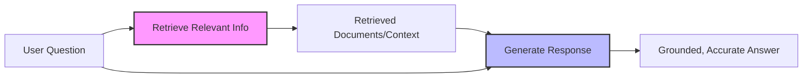
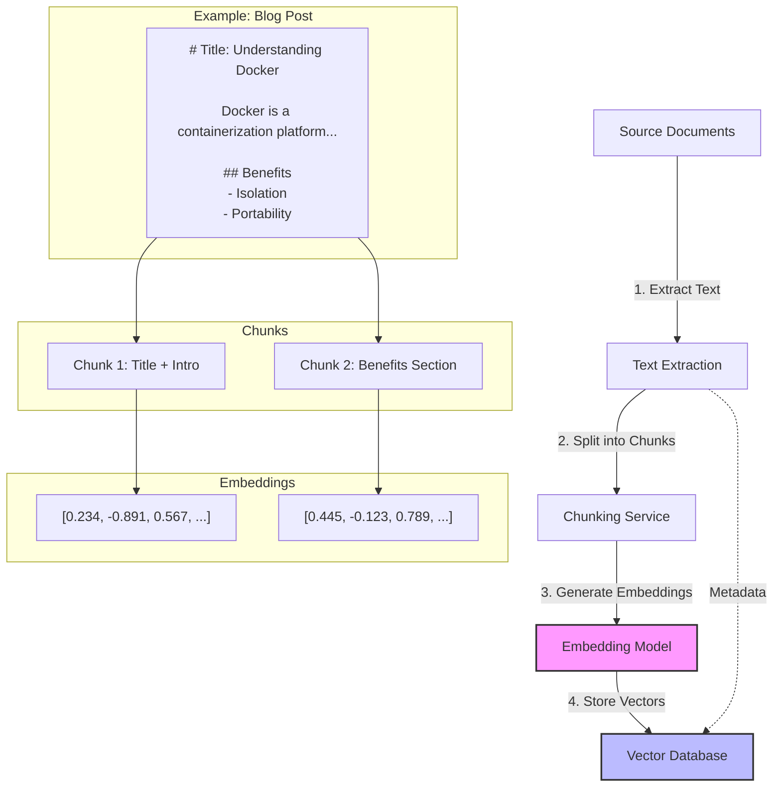
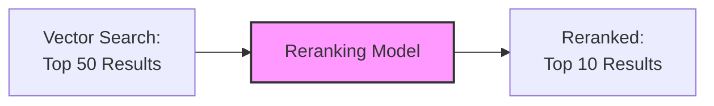
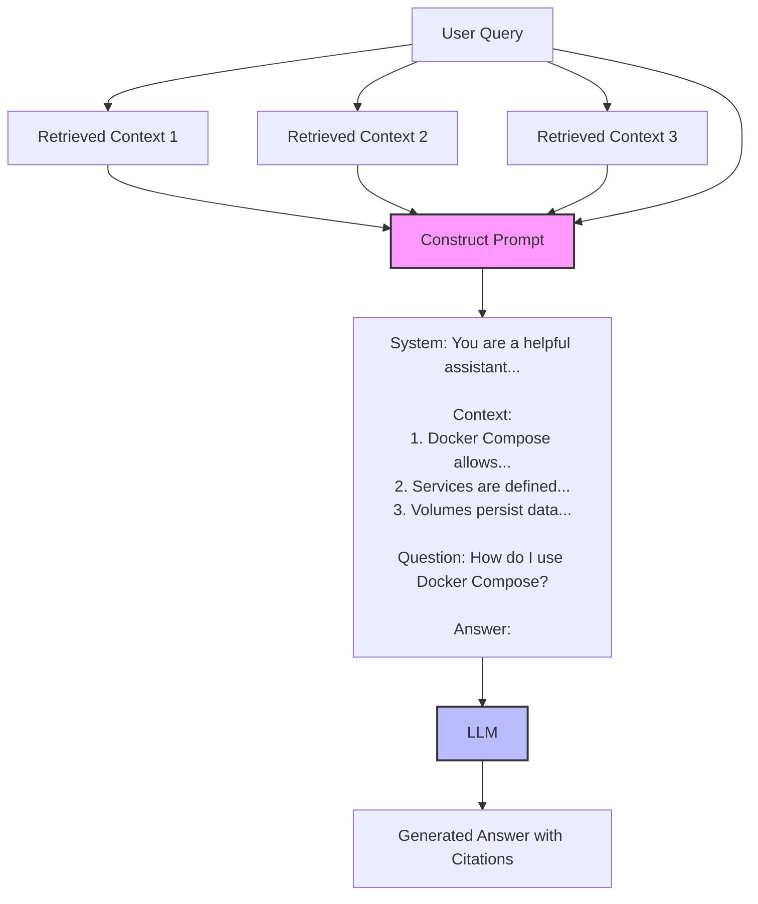
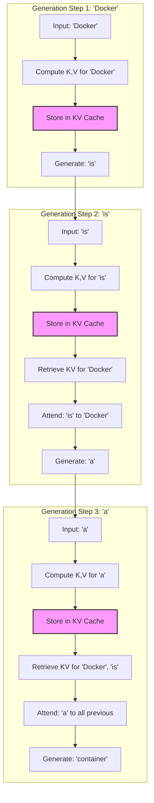
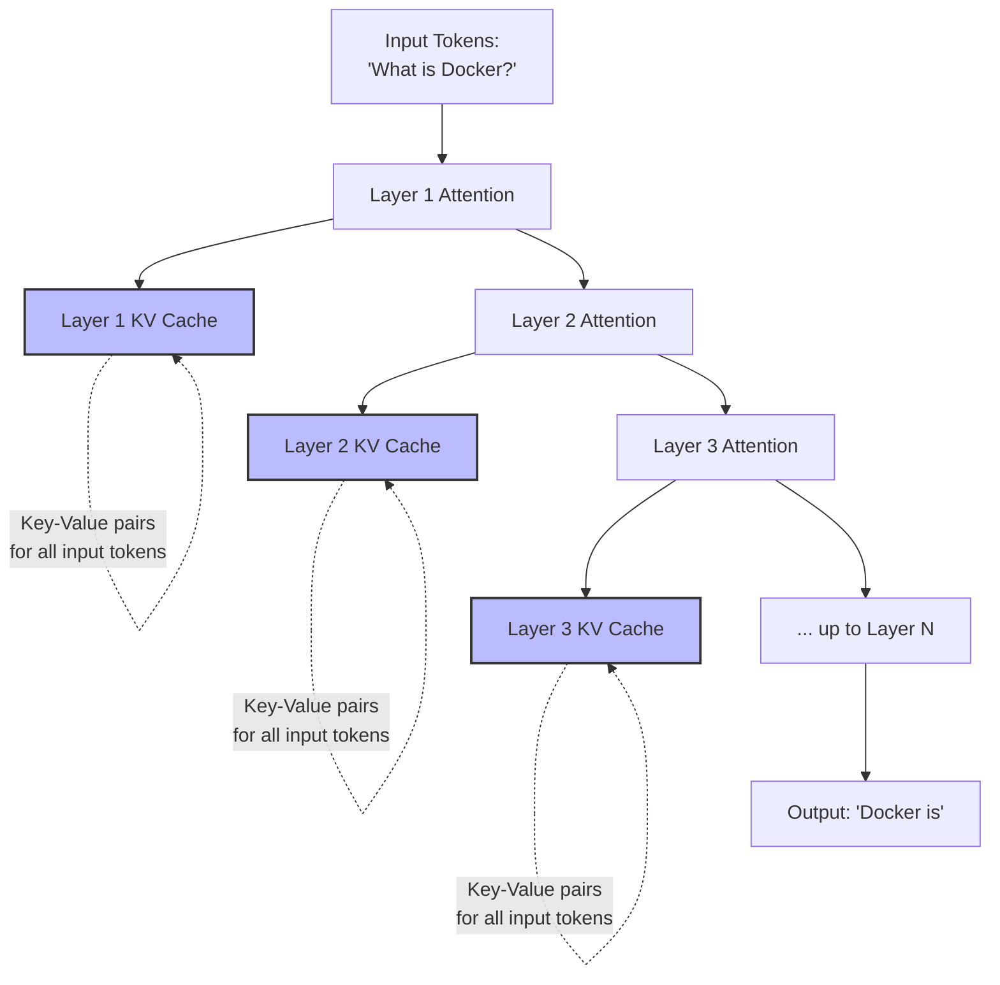
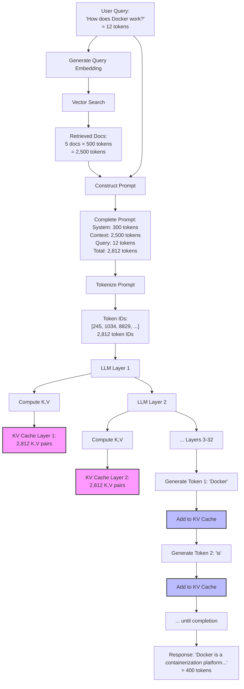

# RAG Explained: A Practical Primer on Retrieval-Augmented Generation

<datetime class="hidden">2025-01-21T09:00</datetime>
<!-- category -- AI, RAG, Machine Learning, Semantic Search, LLM, AI-Article -->

# Introduction

If you've been following the AI space, you've probably heard about RAG (Retrieval-Augmented Generation). It's one of those terms that gets thrown around constantly, but what does it actually mean? More importantly, how does it work, and when should you use it?

RAG is the technology that makes AI systems smarter by giving them access to relevant information at the moment they need it. Think of it like an open-book exam versus memorizing everything - the AI can look up specific facts rather than trying to remember everything it was ever trained on.

**Why does RAG matter?** Large Language Models (LLMs) are powerful, but they have fundamental limitations:
- They only "know" what they were trained on (their knowledge cutoff)
- They can hallucinate facts with confidence
- They can't access private or recent information
- Fine-tuning them is expensive and requires retraining for every update

RAG solves these problems elegantly by combining the reasoning power of LLMs with the precision of search. Instead of asking an LLM to generate an answer from memory alone, RAG first retrieves relevant information from a knowledge base, then feeds that context to the LLM to generate accurate, grounded responses.

In this primer, I'll explain what RAG is, where it came from, exactly how it works under the hood, and when you should (and shouldn't) use it. We'll use concrete examples from my own implementations on this blog, including:
- [Semantic search with ONNX and Qdrant](/blog/semantic-search-with-onnx-and-qdrant)
- [Building a self-hosted semantic search engine](/blog/qdrantwithaspdotnetcore)
- [The "Lawyer GPT" series](/blog/building-a-lawyer-gpt-for-your-blog-part1) - a complete RAG system

[TOC]

# What is RAG?

**Retrieval-Augmented Generation** is an AI technique that enhances language models by giving them access to external knowledge sources. Rather than relying solely on the model's training data (which is static and can become outdated), RAG systems dynamically retrieve relevant information and use it to inform the model's responses.

The core concept is simple:



Instead of:
1. User asks question → LLM generates answer (potentially hallucinated)

RAG does:
1. User asks question → **Find relevant information** → LLM generates answer **using that information**

**Key insight:** The LLM doesn't need to memorize everything. It needs to be good at reasoning over the information you give it. This is why RAG is so powerful - it separates "knowledge storage" (the retrieval system) from "reasoning" (the LLM).

# Where Did RAG Come From?

RAG isn't brand new - it builds on decades of research in information retrieval and natural language processing.

## The Historical Context

**Traditional Search (pre-2010s):**
- Keyword-based search (TF-IDF, BM25)
- Good for exact matches, poor for understanding meaning
- Search engines returned documents - you had to read them yourself

**Early Question Answering Systems (2010s):**
- Watson (IBM, 2011) - Combined retrieval with rule-based reasoning
- Reading comprehension models - Could extract answers from provided passages
- Still relied heavily on keyword matching

**The Deep Learning Revolution (2017+):**
- Transformer models (2017) - "Attention is All You Need"
- BERT (2018) - Contextual understanding of language
- GPT-2/3 (2019/2020) - Large language models that could generate coherent text
- Dense vector representations - Text could be converted to meaningful vectors

**The Birth of Modern RAG (2020):**
The seminal paper "[Retrieval-Augmented Generation for Knowledge-Intensive NLP Tasks](https://arxiv.org/abs/2005.11401)" by Lewis et al. (Facebook AI, 2020) formally introduced RAG as we know it today. They combined:
- Dense retrieval (using learned vector representations)
- Pre-trained language models (BART)
- End-to-end training of the complete system

The results were impressive - RAG systems outperformed much larger models on knowledge-intensive tasks while being more efficient and up-to-date.

## Why RAG Took Off (2023-Present)

The explosion of LLMs like ChatGPT, GPT-4, and Claude made RAG essential:

1. **Hallucination Problem** - LLMs confidently make up facts. RAG grounds responses in real documents.
2. **Knowledge Cutoff** - LLMs trained on 2021 data don't know about 2024 events. RAG uses current documents.
3. **Private Data** - LLMs can't access your company's internal docs. RAG can.
4. **Cost** - Fine-tuning LLMs on custom data is expensive. RAG is cheaper and more flexible.
5. **Explainability** - RAG can cite sources, making it auditable and trustworthy.

As of 2024-2025, RAG is the de facto standard for building production AI systems that need accuracy and auditability.

# How RAG Works: The Complete Picture

Let's break down exactly what happens in a RAG system, from the moment you add a document to when a user gets an answer.

## Phase 1: Indexing (Preparing the Knowledge Base)

Before RAG can retrieve anything, you need to index your knowledge base. This is a one-time process (though you can add new documents later).



### Step 1: Text Extraction

Extract plain text from your source documents. This could be:
- Markdown files (like my blog posts)
- PDFs (for documentation)
- HTML (for web scraping)
- Database records
- Emails, chat logs, etc.

**Example from my blog:**
```csharp
// From MarkdownRenderingService
public string ExtractPlainText(string markdown)
{
    // Remove code blocks
    var withoutCode = Regex.Replace(markdown, @"```[\s\S]*?```", "");

    // Convert markdown to plain text
    var document = Markdown.Parse(withoutCode);
    var plainText = document.ToPlainText();

    return plainText.Trim();
}
```

### Step 2: Chunking

This is where most RAG implementations fail. You can't just split on paragraph boundaries - you need semantically coherent chunks.

**Why chunking matters:**
- LLMs have token limits (context windows)
- Smaller chunks = more precise retrieval
- But chunks must contain enough context to be meaningful

**Bad chunking:**
```
Chunk 1: "Docker is a containerization platform. It allows you"
Chunk 2: "to package applications with their dependencies. This"
Chunk 3: "ensures consistency across environments."
```

**Good chunking:**
```
Chunk 1: "Docker is a containerization platform. It allows you to package applications with their dependencies. This ensures consistency across environments."

Chunk 2: "Benefits of Docker:
- Isolation: Each container runs in its own environment
- Portability: Containers run anywhere Docker is installed
- Efficiency: Lightweight compared to virtual machines"
```

**Example from my semantic search implementation:**
```csharp
public class TextChunker
{
    private const int TargetChunkSize = 500; // ~500 words
    private const int ChunkOverlap = 50;     // 50 words overlap

    public List<Chunk> ChunkDocument(string text, string sourceId)
    {
        var chunks = new List<Chunk>();

        // Split on section boundaries first (## headers in markdown)
        var sections = SplitOnHeaders(text);

        foreach (var section in sections)
        {
            // If section is small enough, keep it whole
            if (section.WordCount < TargetChunkSize)
            {
                chunks.Add(new Chunk
                {
                    Text = section.Text,
                    SourceId = sourceId,
                    SectionHeader = section.Header
                });
            }
            else
            {
                // Split large sections on sentence boundaries
                var subChunks = SplitOnSentences(section.Text, TargetChunkSize, ChunkOverlap);
                chunks.AddRange(subChunks.Select(c => new Chunk
                {
                    Text = c,
                    SourceId = sourceId,
                    SectionHeader = section.Header
                }));
            }
        }

        return chunks;
    }
}
```

**Chunking strategies I discuss in my [Lawyer GPT series](/blog/building-a-lawyer-gpt-for-your-blog-part4):**
- **Fixed-size**: Simple but breaks semantic boundaries
- **Sentence-based**: Respects grammar but can be too small
- **Paragraph-based**: Natural but variable size
- **Section-based**: Best for structured content (my preference)
- **Sliding window with overlap**: Ensures no context is lost at boundaries

### Step 3: Generate Embeddings

Embeddings are the magic that makes semantic search possible. An embedding is a vector (array of numbers) that represents the meaning of text.

**Key concept:** Similar meanings → similar vectors

```
"Docker container" → [0.234, -0.891, 0.567, ..., 0.123]
"containerization platform" → [0.221, -0.903, 0.534, ..., 0.119]
"apple fruit" → [0.891, 0.234, -0.567, ..., -0.789]
```

The first two vectors would be "close" in vector space (high cosine similarity), while the third is far away.

**How embeddings are generated:**
Modern embedding models are neural networks trained on massive text datasets to learn semantic relationships. Popular models:
- **all-MiniLM-L6-v2**: 384 dimensions, fast, good quality (what I use - see [my ONNX article](/blog/semantic-search-with-onnx-and-qdrant))
- **text-embedding-3-small** (OpenAI): 1536 dimensions, very high quality
- **BGE-base**: 768 dimensions, state-of-the-art open source

**Example from my ONNX embedding service:**
```csharp
public async Task<float[]> GenerateEmbeddingAsync(string text)
{
    // Tokenize the input text
    var tokens = Tokenize(text);

    // Create input tensors for ONNX model
    var inputIds = CreateInputTensor(tokens);
    var attentionMask = CreateAttentionMaskTensor(tokens.Length);
    var tokenTypeIds = CreateTokenTypeIdsTensor(tokens.Length);

    // Run ONNX inference
    var inputs = new List<NamedOnnxValue>
    {
        NamedOnnxValue.CreateFromTensor("input_ids", inputIds),
        NamedOnnxValue.CreateFromTensor("attention_mask", attentionMask),
        NamedOnnxValue.CreateFromTensor("token_type_ids", tokenTypeIds)
    };

    using var results = _session.Run(inputs);

    // Extract the output (sentence embedding)
    var output = results.First().AsTensor<float>();
    var embedding = output.ToArray();

    // L2 normalize the vector for cosine similarity
    return NormalizeVector(embedding);
}
```

**Why normalization matters:** After L2 normalization, cosine similarity becomes a simple dot product, making search much faster.

### Step 4: Store in Vector Database

Vector databases are optimized for storing and searching high-dimensional vectors. Unlike traditional databases that use SQL queries, vector databases use similarity search.

**Key operations:**
- **Upsert**: Add or update a vector with metadata
- **Search**: Find K most similar vectors to a query vector
- **Filter**: Combine vector search with metadata filters

**Example from my [Qdrant implementation](/blog/qdrantwithaspdotnetcore):**
```csharp
public async Task IndexDocumentAsync(
    string id,
    float[] embedding,
    Dictionary<string, object> metadata)
{
    var point = new PointStruct
    {
        Id = new PointId { Uuid = id },
        Vectors = embedding,
        Payload =
        {
            ["title"] = metadata["title"],
            ["source"] = metadata["source"],
            ["chunk_index"] = metadata["chunk_index"],
            ["created_at"] = DateTime.UtcNow.ToString("O")
        }
    };

    await _client.UpsertAsync(
        collectionName: "blog_posts",
        points: new[] { point }
    );
}
```

**Popular vector databases:**
- **Qdrant**: Fast, self-hostable, excellent C# support (my choice)
- **pgvector**: PostgreSQL extension (great if you're already using Postgres)
- **Pinecone**: Managed service (expensive but good)
- **Weaviate**: Feature-rich, good for complex schemas
- **ChromaDB**: Python-focused, lightweight

I compare these in detail in my [Qdrant article](/blog/qdrantwithaspdotnetcore).

## Phase 2: Retrieval (Finding Relevant Information)

When a user asks a question, the RAG system needs to find the most relevant information from the knowledge base.

```mermaid
flowchart LR
    A[User Query:<br/>'How do I use Docker Compose?'] --> B[Generate Query Embedding]
    B --> C[Query Vector:<br/>[0.445, -0.123, 0.789, ...]]
    C --> D[Vector Search]
    D --> E[Vector Database]
    E --> F[Top K Similar Chunks]
    F --> G["1. Docker Compose Basics (score: 0.92)<br/>2. Multi-Container Setup (score: 0.87)<br/>3. Service Configuration (score: 0.83)"]

    style B fill:#f9f,stroke:#333,stroke-width:2px
    style D fill:#bbf,stroke:#333,stroke-width:2px
```

### Step 1: Generate Query Embedding

The user's question gets converted to a vector using the **same embedding model** used for indexing. This is critical - different models produce incompatible vectors.

```csharp
public async Task<List<SearchResult>> SearchAsync(string query, int limit = 10)
{
    // Same embedding model used for indexing
    var queryEmbedding = await _embeddingService.GenerateEmbeddingAsync(query);

    // Search in vector store
    var results = await _vectorStoreService.SearchAsync(
        queryEmbedding,
        limit
    );

    return results;
}
```

### Step 2: Similarity Search

The vector database computes similarity between the query vector and all stored vectors. Common metrics:

**Cosine Similarity** (most popular for normalized vectors):
```
similarity = (A · B) / (||A|| × ||B||)
```
Range: -1 to 1 (higher = more similar)

**Euclidean Distance** (for unnormalized vectors):
```
distance = sqrt(Σ(Ai - Bi)²)
```
Range: 0 to ∞ (lower = more similar)

**Dot Product** (when vectors are pre-normalized):
```
similarity = A · B
```
Range: -1 to 1 (higher = more similar)

**Example from my Qdrant service:**
```csharp
var searchResults = await _client.SearchAsync(
    collectionName: "blog_posts",
    vector: queryEmbedding,
    limit: (ulong)limit,
    scoreThreshold: 0.7f,  // Only return results with >70% similarity
    payloadSelector: true   // Include all metadata
);

return searchResults.Select(hit => new SearchResult
{
    Text = hit.Payload["text"].StringValue,
    Title = hit.Payload["title"].StringValue,
    Score = hit.Score,
    Source = hit.Payload["source"].StringValue
}).ToList();
```

### Step 3: Reranking (Optional but Recommended)

The initial retrieval is fast but approximate. Reranking uses a more sophisticated model to rescore the top K results.



**Why reranking helps:**
- Fast embedding models optimize for speed, sacrificing some accuracy
- Reranking models are slower but more accurate
- Two-stage approach balances speed and quality

**Example reranking implementation:**
```csharp
public async Task<List<SearchResult>> SearchWithRerankAsync(
    string query,
    int initialLimit = 50,
    int finalLimit = 10)
{
    // Stage 1: Fast vector search
    var candidates = await SearchAsync(query, initialLimit);

    // Stage 2: Precise reranking
    var rerankedResults = await _rerankingService.RerankAsync(
        query,
        candidates
    );

    return rerankedResults.Take(finalLimit).ToList();
}
```

## Phase 3: Generation (Creating the Answer)

Now that we have relevant information, we feed it to the LLM along with the user's question.



### Step 1: Prompt Construction

This is where RAG becomes an art. You need to structure the prompt so the LLM:
- Uses the provided context (not its internal knowledge)
- Cites sources when possible
- Admits when the context doesn't contain an answer
- Maintains a consistent tone/style

**Example prompt template from my Lawyer GPT system:**
```csharp
public string BuildRAGPrompt(string query, List<SearchResult> context)
{
    var sb = new StringBuilder();

    sb.AppendLine("You are a technical writing assistant. Your task is to answer the user's question using ONLY the provided context from past blog posts.");
    sb.AppendLine();
    sb.AppendLine("CONTEXT:");
    sb.AppendLine("========");

    for (int i = 0; i < context.Count; i++)
    {
        sb.AppendLine($"[{i + 1}] {context[i].Title}");
        sb.AppendLine($"Source: {context[i].Source}");
        sb.AppendLine($"Content: {context[i].Text}");
        sb.AppendLine($"Relevance: {context[i].Score:P0}");
        sb.AppendLine();
    }

    sb.AppendLine("========");
    sb.AppendLine();
    sb.AppendLine("INSTRUCTIONS:");
    sb.AppendLine("- Answer the question using the provided context");
    sb.AppendLine("- Cite sources using [1], [2], etc.");
    sb.AppendLine("- If the context doesn't contain enough information, say so");
    sb.AppendLine("- Maintain the technical, practical tone of the blog");
    sb.AppendLine();
    sb.AppendLine($"QUESTION: {query}");
    sb.AppendLine();
    sb.AppendLine("ANSWER:");

    return sb.ToString();
}
```

### Step 2: LLM Inference

The constructed prompt goes to the LLM for generation. This can be:
- **Cloud API**: OpenAI, Anthropic Claude, Google PaLM
- **Local model**: Using llama.cpp, ONNX Runtime, or TorchSharp

**Example using local LLM (from my Lawyer GPT series):**
```csharp
public async Task<string> GenerateResponseAsync(string prompt)
{
    var result = await _llamaSharp.InferAsync(prompt, new InferenceParams
    {
        Temperature = 0.7f,      // Creativity (0 = deterministic, 1 = creative)
        TopP = 0.9f,             // Nucleus sampling
        MaxTokens = 500,         // Response length limit
        StopSequences = new[] { "\n\n", "User:", "Question:" }
    });

    return result.Text.Trim();
}
```

**Key parameters explained:**
- **Temperature**: Controls randomness (0 = always pick most likely, 1 = sample randomly)
- **Top P**: Nucleus sampling - consider only tokens that make up top P probability mass
- **Max Tokens**: Limit response length
- **Stop Sequences**: When to stop generating

### Step 3: Post-Processing

After the LLM generates a response, we often need to:
- Extract citations and convert them to links
- Format code blocks
- Add metadata (sources, confidence scores)
- Log the interaction for debugging

**Example post-processing:**
```csharp
public RAGResponse PostProcess(string llmOutput, List<SearchResult> sources)
{
    var response = new RAGResponse
    {
        Answer = llmOutput,
        Sources = new List<Source>()
    };

    // Extract citations like [1], [2]
    var citations = Regex.Matches(llmOutput, @"\[(\d+)\]");

    foreach (Match match in citations)
    {
        int index = int.Parse(match.Groups[1].Value) - 1;
        if (index >= 0 && index < sources.Count)
        {
            var source = sources[index];
            response.Sources.Add(new Source
            {
                Title = source.Title,
                Url = GenerateUrl(source.Source),
                RelevanceScore = source.Score
            });
        }
    }

    // Convert markdown citations to hyperlinks
    response.FormattedAnswer = Regex.Replace(
        llmOutput,
        @"\[(\d+)\]",
        m => {
            int index = int.Parse(m.Groups[1].Value) - 1;
            if (index >= 0 && index < sources.Count)
            {
                var url = GenerateUrl(sources[index].Source);
                return $"[[{m.Groups[1].Value}]]({url})";
            }
            return m.Value;
        }
    );

    return response;
}
```

# Understanding LLM Internals: Tokens, KV Cache, and Context Windows

Before we compare RAG to other approaches, it's essential to understand how LLMs work internally. This knowledge helps you optimize RAG systems and avoid common pitfalls.

## What Are Tokens?

Tokens are the fundamental units that LLMs process. Text isn't fed directly to models - it's first broken down into tokens.

**Example tokenization:**
```
Input:  "Understanding Docker containers"
Tokens: ["Under", "standing", " Docker", " containers"]
```

Different models use different tokenization strategies:
- **GPT models**: Use Byte-Pair Encoding (BPE) with ~50K vocabulary
- **Claude**: Similar BPE approach
- **Llama models**: SentencePiece tokenization

**Why tokenization matters for RAG:**

```csharp
public class TokenCounter
{
    // Rough approximation: 1 token ≈ 0.75 words (English)
    public int EstimateTokens(string text)
    {
        var wordCount = text.Split(' ', StringSplitOptions.RemoveEmptyEntries).Length;
        return (int)(wordCount / 0.75);
    }

    public int EstimateTokensAccurate(string text, ITokenizer tokenizer)
    {
        // Use actual tokenizer for precision
        return tokenizer.Encode(text).Count;
    }
}
```

**Context window limits:**
- GPT-3.5: 16K tokens
- GPT-4: 8K-128K tokens (depending on variant)
- Claude 3.5 Sonnet: 200K tokens
- Llama 3: 8K tokens (though can be extended)

In RAG systems, you must fit:
```
Total tokens = System prompt + Retrieved context + User query + Response buffer
```

If your RAG retrieves 10 documents of 500 tokens each, that's 5,000 tokens just for context - before the query and response!

**Practical RAG token management:**

```csharp
public class ContextWindowManager
{
    private readonly int _maxContextTokens;
    private readonly int _systemPromptTokens;
    private readonly int _responseBufferTokens;

    public ContextWindowManager(
        int totalContextWindow = 4096,
        int systemPromptTokens = 300,
        int responseBufferTokens = 500)
    {
        _maxContextTokens = totalContextWindow;
        _systemPromptTokens = systemPromptTokens;
        _responseBufferTokens = responseBufferTokens;
    }

    public List<SearchResult> FitContextInWindow(
        List<SearchResult> retrievedDocs,
        string query)
    {
        var queryTokens = EstimateTokens(query);

        // Available tokens for retrieved context
        var availableForContext = _maxContextTokens
            - _systemPromptTokens
            - queryTokens
            - _responseBufferTokens;

        var selectedDocs = new List<SearchResult>();
        var currentTokens = 0;

        foreach (var doc in retrievedDocs.OrderByDescending(d => d.Score))
        {
            var docTokens = EstimateTokens(doc.Text);

            if (currentTokens + docTokens <= availableForContext)
            {
                selectedDocs.Add(doc);
                currentTokens += docTokens;
            }
            else
            {
                break; // Context window full
            }
        }

        return selectedDocs;
    }

    private int EstimateTokens(string text)
    {
        // Rule of thumb: 1 token ≈ 4 characters
        return text.Length / 4;
    }
}
```

## The KV Cache: LLM's Secret Weapon

When an LLM generates text, it doesn't reprocess everything from scratch for each token. It uses a **Key-Value (KV) cache** to remember what it has already computed.

### How Transformers Work (Simplified)

Transformers use an "attention" mechanism where each token "attends to" (looks at) all previous tokens to understand context.



**Without KV cache:**
- Step 1: Process 1 token → O(1)
- Step 2: Process 2 tokens from scratch → O(2)
- Step 3: Process 3 tokens from scratch → O(3)
- Total: O(1 + 2 + 3 + ... + N) = O(N²)

**With KV cache:**
- Step 1: Process 1 token, cache K,V → O(1)
- Step 2: Process 1 new token, reuse cached K,V → O(1)
- Step 3: Process 1 new token, reuse cached K,V → O(1)
- Total: O(N)

This makes generation **dramatically faster** - the difference between 10 tokens/second and 100 tokens/second.

### The KV Cache Tree Structure

The KV cache forms a "tree" because of how attention works in transformers. Each layer in the model has its own K,V matrices.



**Each layer stores:**
- **Keys (K)**: Representations used to compute attention scores
- **Values (V)**: Representations that get mixed together based on attention

For a model with:
- 32 layers
- 4096 hidden dimensions
- 32 attention heads
- 8K context window

The KV cache for one sequence is:
```
2 (K and V) × 32 layers × 4096 dimensions × 8192 tokens × 2 bytes (FP16)
≈ 4.3 GB of VRAM!
```

This is why long context windows are memory-intensive.

### KV Cache in RAG Systems

RAG systems can leverage KV cache optimization in clever ways:

**Prompt caching** (supported by some APIs like Anthropic Claude):

```csharp
public class CachedRAGService
{
    // System prompt and retrieved context can be cached!
    public async Task<string> GenerateWithCachedContextAsync(
        string systemPrompt,          // Cached
        List<SearchResult> context,   // Cached
        string userQuery)             // Not cached, changes each time
    {
        var contextText = FormatContext(context);

        // The KV cache for systemPrompt + contextText is reused across queries
        var prompt = $@"
{systemPrompt}

CONTEXT:
{contextText}

QUERY: {userQuery}

ANSWER:";

        return await _llm.GenerateAsync(prompt, useCaching: true);
    }
}
```

**Why this is powerful:**
- First query: Computes KV cache for system prompt + context (slow)
- Subsequent queries with same context: Reuses cached KV (10x faster!)
- Only the user query portion needs fresh computation

**Practical example:**
```
Query 1: "How do I use Docker?" → 2 seconds (no cache)
Query 2: "What are Docker benefits?" → 0.2 seconds (cache hit!)
Query 3: "Docker vs VMs?" → 0.2 seconds (cache hit!)
```

All three queries use the same retrieved context, so the KV cache for that context is reused.

## Token Limits and RAG Strategy

Understanding tokens and KV cache informs your RAG architecture decisions:

### 1. Chunking Size

Smaller chunks = more precise retrieval, but more overhead:

```csharp
// Option A: Small chunks (200 tokens each)
// Retrieve 20 chunks = 4,000 tokens
// Pro: Very precise, only relevant info
// Con: More KV cache entries, slower attention

// Option B: Larger chunks (500 tokens each)
// Retrieve 8 chunks = 4,000 tokens
// Pro: Better context coherence, fewer KV entries
// Con: More noise, less precise

public class AdaptiveChunker
{
    public int DetermineChunkSize(int contextWindowSize)
    {
        if (contextWindowSize <= 4096)
            return 200; // Small chunks for limited windows

        if (contextWindowSize <= 16384)
            return 500; // Medium chunks

        return 1000; // Large chunks for big windows
    }
}
```

### 2. Context Window Utilization

Don't max out the context window - leave room for generation:

```csharp
public class SafeContextManager
{
    public int GetSafeContextLimit(int totalContextWindow)
    {
        // Use only 75% for input, reserve 25% for output
        return (int)(totalContextWindow * 0.75);
    }

    // Example: 4K model
    // Total: 4096 tokens
    // Safe input: 3072 tokens
    // Reserved for output: 1024 tokens
}
```

### 3. Multi-Turn RAG Conversations

In chatbots, the conversation history grows with each turn:

```
Turn 1:
System + Context + Query1 = 3000 tokens
Response1 = 300 tokens
Total: 3300 tokens

Turn 2:
System + Context + Query1 + Response1 + Query2 = 3650 tokens
Response2 = 300 tokens
Total: 3950 tokens

Turn 3:
System + Context + Query1 + Response1 + Query2 + Response2 + Query3 = 4250 tokens
ERROR: Context window exceeded!
```

**Solution: Sliding window with re-retrieval**

```csharp
public class ConversationalRAG
{
    private readonly int _maxHistoryTokens = 1000;

    public async Task<string> ChatAsync(
        List<ConversationTurn> history,
        string newQuery)
    {
        // Re-retrieve context based on current query
        var context = await RetrieveContextAsync(newQuery);

        // Keep only recent conversation history
        var relevantHistory = TrimHistory(history, _maxHistoryTokens);

        var prompt = BuildPrompt(context, relevantHistory, newQuery);

        return await _llm.GenerateAsync(prompt);
    }

    private List<ConversationTurn> TrimHistory(
        List<ConversationTurn> history,
        int maxTokens)
    {
        var trimmed = new List<ConversationTurn>();
        var currentTokens = 0;

        // Keep most recent turns
        foreach (var turn in history.Reverse())
        {
            var turnTokens = EstimateTokens(turn.Query) + EstimateTokens(turn.Response);

            if (currentTokens + turnTokens <= maxTokens)
            {
                trimmed.Insert(0, turn);
                currentTokens += turnTokens;
            }
            else
            {
                break;
            }
        }

        return trimmed;
    }
}
```

### 4. Token Cost Optimization

API-based LLMs charge per token. RAG can explode costs if not careful:

```csharp
public class CostAwareRAG
{
    // OpenAI GPT-4 pricing (example):
    // Input: $0.03 per 1K tokens
    // Output: $0.06 per 1K tokens

    public decimal EstimateQueryCost(
        int systemPromptTokens,
        int retrievedContextTokens,
        int queryTokens,
        int expectedResponseTokens)
    {
        var inputTokens = systemPromptTokens + retrievedContextTokens + queryTokens;
        var outputTokens = expectedResponseTokens;

        var inputCost = (inputTokens / 1000m) * 0.03m;
        var outputCost = (outputTokens / 1000m) * 0.06m;

        return inputCost + outputCost;
    }

    // Example:
    // System: 300 tokens
    // Context: 3000 tokens (10 retrieved docs)
    // Query: 50 tokens
    // Response: 500 tokens
    //
    // Cost = ((300 + 3000 + 50) / 1000 * 0.03) + (500 / 1000 * 0.06)
    //      = (3350 / 1000 * 0.03) + (500 / 1000 * 0.06)
    //      = $0.1005 + $0.03
    //      = $0.1305 per query
    //
    // At 1000 queries/day = $130/day = $3,900/month!
}
```

**Cost reduction strategies:**
1. Retrieve fewer, better-ranked documents
2. Use prompt caching (Anthropic Claude: 90% cheaper for cached tokens)
3. Use cheaper models for re-ranking, expensive for final generation
4. Compress context using summarization

## Visualizing the Complete RAG Flow with Tokens

Here's how tokens, KV cache, and RAG fit together:



**Key insights:**
1. **Input tokens** (2,812) are processed once to build initial KV cache
2. **Generation** happens one token at a time, reusing the KV cache
3. **Each new token** adds to the KV cache for future tokens to attend to
4. **Total VRAM** needed = Model weights + KV cache for all tokens
5. **Longer context** = larger KV cache = more VRAM

## Practical Implications for RAG

Understanding tokens and KV cache leads to better RAG design:

**1. Pre-compute and cache common contexts:**
```csharp
// Cache KV for frequently used system prompts + static context
var cachedSystemContext = await _llm.PrecomputeKVCache(systemPrompt + staticContext);

// Reuse for each query (much faster)
foreach (var query in userQueries)
{
    var response = await _llm.GenerateAsync(query, reuseKVCache: cachedSystemContext);
}
```

**2. Optimize chunk boundaries:**
```csharp
// Bad: Arbitrary 500-character chunks
var chunks = text.Chunk(500);

// Good: Chunk on sentence boundaries, measure in tokens
public List<string> ChunkByTokens(string text, int maxTokensPerChunk)
{
    var sentences = SplitIntoSentences(text);
    var chunks = new List<string>();
    var currentChunk = new StringBuilder();
    var currentTokens = 0;

    foreach (var sentence in sentences)
    {
        var sentenceTokens = EstimateTokens(sentence);

        if (currentTokens + sentenceTokens > maxTokensPerChunk && currentTokens > 0)
        {
            chunks.Add(currentChunk.ToString());
            currentChunk.Clear();
            currentTokens = 0;
        }

        currentChunk.Append(sentence).Append(" ");
        currentTokens += sentenceTokens;
    }

    if (currentTokens > 0)
        chunks.Add(currentChunk.ToString());

    return chunks;
}
```

**3. Monitor token usage in production:**
```csharp
public class RAGTelemetry
{
    public void LogRAGQuery(
        string query,
        List<SearchResult> retrievedDocs,
        string response)
    {
        var queryTokens = EstimateTokens(query);
        var contextTokens = retrievedDocs.Sum(d => EstimateTokens(d.Text));
        var responseTokens = EstimateTokens(response);
        var totalTokens = queryTokens + contextTokens + responseTokens;

        _logger.LogInformation(
            "RAG Query: {Query} | Context: {ContextTokens} tokens from {DocCount} docs | " +
            "Response: {ResponseTokens} tokens | Total: {TotalTokens} tokens",
            query, contextTokens, retrievedDocs.Count, responseTokens, totalTokens
        );

        // Alert if approaching context limit
        if (totalTokens > _maxTokens * 0.9)
        {
            _logger.LogWarning("Approaching token limit: {TotalTokens}/{MaxTokens}",
                totalTokens, _maxTokens);
        }
    }
}
```

# RAG vs. Other Approaches

Let's compare RAG to other methods of augmenting LLMs with knowledge.

## RAG vs. Fine-Tuning

| Aspect | RAG | Fine-Tuning |
|--------|-----|-------------|
| **Knowledge Updates** | Instant (just update the knowledge base) | Requires retraining |
| **Cost** | Low (storage + embedding) | High (GPU training time) |
| **Accuracy** | Grounded in sources | Can hallucinate |
| **Customization** | Limited to retrieval | Deep model adaptation |
| **Explainability** | High (can cite sources) | Low (black box) |
| **Best For** | Knowledge-intensive tasks | Style/format adaptation |

**When to use Fine-Tuning:**
- You need the model to learn a specific **style** or **format**
- You have a large, clean dataset
- You need the model to internalize **patterns**, not facts
- Example: Making GPT write like Shakespeare

**When to use RAG:**
- You need **factual accuracy** with citations
- Your knowledge base changes frequently
- You have private/proprietary data
- Cost and simplicity matter
- Example: Customer support chatbot (my company's docs change weekly)

**Can you combine both?** Yes! Fine-tune for style, RAG for facts.

## RAG vs. Long Context Windows

Modern LLMs boast huge context windows (GPT-4: 128K tokens, Claude: 200K tokens). Why not just dump all your documents into the context?

**Problems with long context:**
1. **Cost**: Pricing scales with tokens - $10-100 per query adds up fast
2. **Latency**: Processing 100K tokens takes time
3. **Lost in the middle**: LLMs struggle to use information in the middle of long contexts
4. **Dilution**: Relevant info gets buried in noise
5. **Practical limits**: You can't fit your entire company's docs in context

**When long context makes sense:**
- Single large document (e.g., analyzing a contract)
- Everything is relevant (no need to filter)
- Cost isn't a concern
- Low query volume

**When RAG makes sense:**
- Large knowledge base (millions of documents)
- Need to find relevant subset
- High query volume (cost matters)
- Real-time updates to knowledge

**Best practice:** Use RAG to select the most relevant content, then use long context for that subset.

## RAG vs. Prompting with Examples

Few-shot prompting (giving examples in the prompt) is a simple baseline.

**Example prompt:**
```
Examples:
Q: What is Docker?
A: Docker is a containerization platform...

Q: How does Kubernetes work?
A: Kubernetes orchestrates containers...

Q: What is my new question?
A: [LLM generates answer]
```

**Limitations:**
- Limited to what fits in context window
- Manual curation of examples
- Doesn't scale to large knowledge bases
- No semantic search - you manually pick examples

**RAG improvement:**
- Automatically finds best examples (via similarity search)
- Scales to unlimited examples (only top K sent to LLM)
- Adapts to query (different queries retrieve different examples)

You can think of RAG as "automated few-shot prompting at scale."

## Hybrid Search: RAG + Traditional Search

In my [semantic search article](/blog/semantic-search-with-onnx-and-qdrant), I discuss combining RAG with traditional full-text search using Reciprocal Rank Fusion (RRF).

**Why hybrid?**
- **Semantic search**: Great for conceptual matches ("error handling" finds "exception management")
- **Keyword search**: Great for exact terms ("Docker Compose", "Entity Framework")
- **Hybrid**: Best of both worlds

```csharp
public async Task<List<SearchResult>> HybridSearchAsync(string query)
{
    // Run both searches in parallel
    var semanticTask = SemanticSearchAsync(query, limit: 20);
    var keywordTask = KeywordSearchAsync(query, limit: 20);

    await Task.WhenAll(semanticTask, keywordTask);

    var semanticResults = await semanticTask;
    var keywordResults = await keywordTask;

    // Combine using Reciprocal Rank Fusion
    return ApplyRRF(semanticResults, keywordResults);
}

private List<SearchResult> ApplyRRF(
    List<SearchResult> list1,
    List<SearchResult> list2,
    int k = 60)
{
    var scores = new Dictionary<string, double>();

    // Score from first list
    for (int i = 0; i < list1.Count; i++)
    {
        var id = list1[i].Id;
        scores[id] = scores.GetValueOrDefault(id, 0) + 1.0 / (k + i + 1);
    }

    // Score from second list
    for (int i = 0; i < list2.Count; i++)
    {
        var id = list2[i].Id;
        scores[id] = scores.GetValueOrDefault(id, 0) + 1.0 / (k + i + 1);
    }

    // Merge and sort by combined score
    var allResults = list1.Concat(list2)
        .GroupBy(r => r.Id)
        .Select(g => g.First())
        .OrderByDescending(r => scores[r.Id])
        .ToList();

    return allResults;
}
```

# Real-World RAG Applications on This Blog

I've built several RAG-powered features on this blog. Let me show you concrete examples.

## 1. Related Posts Recommendation

Every blog post shows "Related Posts" using semantic similarity. See my [semantic search article](/blog/semantic-search-with-onnx-and-qdrant) for the full implementation.

**How it works:**
1. Each blog post gets embedded when published
2. When viewing a post, we retrieve its embedding from Qdrant
3. Find the 5 most similar post embeddings
4. Display as "Related Posts"

**Why it's better than tags:**
- Tags require manual categorization
- Semantic search finds conceptually related posts even without matching tags
- "Docker Compose" and "Container orchestration" posts are related semantically

**Code snippet:**
```csharp
public async Task<List<SearchResult>> GetRelatedPostsAsync(
    string currentPostSlug,
    string language,
    int limit = 5)
{
    // Get the current post's embedding
    var currentPost = await _vectorStore.GetByIdAsync(currentPostSlug);

    if (currentPost == null)
        return new List<SearchResult>();

    // Find similar posts
    var similarPosts = await _vectorStore.SearchAsync(
        currentPost.Embedding,
        limit: limit + 1,  // +1 because result includes the current post
        filter: new Filter
        {
            Must =
            {
                new Condition
                {
                    Field = "language",
                    Match = new Match { Keyword = language }
                }
            },
            MustNot =
            {
                new Condition
                {
                    Field = "slug",
                    Match = new Match { Keyword = currentPostSlug }
                }
            }
        }
    );

    return similarPosts.Take(limit).ToList();
}
```

## 2. Semantic Blog Search

The search box on this blog uses RAG-style semantic search (though without the generation part - it's just retrieval).

**User experience:**
- Search for "setting up a database" → finds posts about PostgreSQL, Entity Framework, migrations
- Search for "deployment" → finds posts about Docker, hosting, CI/CD
- No need for exact keyword matches

**Implementation details in my [Qdrant article](/blog/qdrantwithaspdotnetcore).**

## 3. The "Lawyer GPT" Writing Assistant

My [Lawyer GPT series](/blog/building-a-lawyer-gpt-for-your-blog-part1) is a complete RAG system for helping me write new blog posts.

**Use case:** When I start writing about "adding authentication to ASP.NET Core", the system:
1. Embeds my current draft
2. Searches past posts for related content about authentication, ASP.NET, security
3. Suggests relevant code snippets I've used before
4. Auto-generates internal links to related posts
5. Maintains consistency with my writing style

**Full RAG pipeline:**
```csharp
public async Task<WritingAssistanceResponse> GetSuggestionsAsync(
    string currentDraft,
    string topic)
{
    // 1. Embed the current draft
    var draftEmbedding = await _embeddingService.GenerateEmbeddingAsync(
        currentDraft
    );

    // 2. Retrieve related past content
    var relatedPosts = await _vectorStore.SearchAsync(
        draftEmbedding,
        limit: 5
    );

    // 3. Build context for LLM
    var prompt = BuildWritingAssistancePrompt(
        currentDraft,
        topic,
        relatedPosts
    );

    // 4. Generate suggestions using local LLM
    var suggestions = await _llmService.GenerateAsync(prompt);

    // 5. Extract and format citations
    var response = ExtractCitations(suggestions, relatedPosts);

    return response;
}
```

This is RAG in action - retrieval (semantic search) + augmentation (adding context) + generation (LLM suggestions).

# Common RAG Challenges and Solutions

Building production RAG systems isn't trivial. Here are challenges I've encountered and how to solve them.

## Challenge 1: Chunking Strategy

**Problem:** How do you split documents? Too small = loss of context. Too large = irrelevant information.

**Solution:** Hybrid chunking based on document structure.

```csharp
public class SmartChunker
{
    public List<Chunk> ChunkDocument(string markdown, string sourceId)
    {
        var chunks = new List<Chunk>();

        // Parse markdown into sections
        var document = Markdown.Parse(markdown);
        var sections = ExtractSections(document);

        foreach (var section in sections)
        {
            var wordCount = CountWords(section.Content);

            if (wordCount < MinChunkSize)
            {
                // Merge small sections
                MergeWithPrevious(chunks, section);
            }
            else if (wordCount > MaxChunkSize)
            {
                // Split large sections
                var subChunks = SplitSection(section);
                chunks.AddRange(subChunks);
            }
            else
            {
                // Just right
                chunks.Add(CreateChunk(section, sourceId));
            }
        }

        return chunks;
    }
}
```

**Best practices:**
- Respect document structure (headers, paragraphs)
- Add overlap between chunks (50-100 words)
- Preserve code blocks intact
- Include section headers in each chunk for context

## Challenge 2: Embedding Quality

**Problem:** Generic embedding models may not capture domain-specific semantics.

**Solutions:**

**Option 1: Fine-tune embeddings** (advanced)
```python
# Using sentence-transformers in Python
from sentence_transformers import SentenceTransformer, InputExample, losses

model = SentenceTransformer('all-MiniLM-L6-v2')

# Create training examples from your domain
train_examples = [
    InputExample(texts=['Docker Compose', 'container orchestration'], label=0.9),
    InputExample(texts=['Entity Framework', 'ORM database'], label=0.9),
    InputExample(texts=['Docker', 'apple fruit'], label=0.1)
]

# Fine-tune
train_dataloader = DataLoader(train_examples, shuffle=True, batch_size=16)
train_loss = losses.CosineSimilarityLoss(model)
model.fit(train_objectives=[(train_dataloader, train_loss)], epochs=1)
```

**Option 2: Hybrid embeddings** (combine multiple models)
```csharp
public async Task<float[]> GenerateHybridEmbeddingAsync(string text)
{
    var semantic = await _semanticModel.GenerateEmbeddingAsync(text);
    var keyword = await _keywordModel.GenerateEmbeddingAsync(text);

    // Concatenate or weighted average
    return CombineEmbeddings(semantic, keyword);
}
```

**Option 3: Add metadata filtering**
```csharp
var results = await _vectorStore.SearchAsync(
    queryEmbedding,
    limit: 10,
    filter: new Filter
    {
        Must =
        {
            new Condition { Field = "category", Match = new Match { Keyword = "ASP.NET" } },
            new Condition { Field = "date", Range = new Range { Gte = "2024-01-01" } }
        }
    }
);
```

## Challenge 3: Context Window Management

**Problem:** LLMs have token limits. How do you fit query + context + prompt in the window?

**Solution:** Dynamic context selection and summarization.

```csharp
public string BuildContextAwarePrompt(
    string query,
    List<SearchResult> retrievedDocs,
    int maxTokens = 4096)
{
    var promptTemplate = GetPromptTemplate();
    var queryTokens = CountTokens(query);
    var templateTokens = CountTokens(promptTemplate);

    // Reserve tokens for: prompt + query + response
    var availableForContext = maxTokens - queryTokens - templateTokens - 500; // 500 for response

    // Add context until we hit limit
    var selectedContext = new List<SearchResult>();
    var currentTokens = 0;

    foreach (var doc in retrievedDocs.OrderByDescending(d => d.Score))
    {
        var docTokens = CountTokens(doc.Text);

        if (currentTokens + docTokens <= availableForContext)
        {
            selectedContext.Add(doc);
            currentTokens += docTokens;
        }
        else
        {
            // Try summarizing the doc if it's important
            if (doc.Score > 0.85)
            {
                var summary = await SummarizeAsync(doc.Text, maxTokens: 200);
                var summaryTokens = CountTokens(summary);

                if (currentTokens + summaryTokens <= availableForContext)
                {
                    selectedContext.Add(new SearchResult
                    {
                        Text = summary,
                        Title = doc.Title,
                        Score = doc.Score
                    });
                    currentTokens += summaryTokens;
                }
            }
        }
    }

    return FormatPrompt(query, selectedContext);
}
```

## Challenge 4: Hallucination Despite RAG

**Problem:** Even with context, LLMs sometimes ignore it and hallucinate.

**Solutions:**

**1. Prompt engineering:**
```csharp
var systemPrompt = @"
You are a technical assistant.

CRITICAL RULES:
1. ONLY use information from the provided CONTEXT sections
2. If the context doesn't contain the answer, say 'I don't have enough information in the provided context to answer that'
3. DO NOT use your training data to supplement answers
4. Always cite the source using [1], [2] notation
5. If you're unsure, say so

CONTEXT:
{context}

QUESTION: {query}

ANSWER (following all rules above):
";
```

**2. Post-generation validation:**
```csharp
public async Task<bool> ValidateResponseAgainstContext(
    string response,
    List<SearchResult> context)
{
    // Check if response contains claims not in context
    var responseSentences = SplitIntoSentences(response);

    foreach (var sentence in responseSentences)
    {
        var isSupported = await IsClaimSupportedByContext(sentence, context);

        if (!isSupported)
        {
            _logger.LogWarning("Hallucination detected: {Sentence}", sentence);
            return false;
        }
    }

    return true;
}
```

**3. Iterative refinement:**
```csharp
public async Task<string> GenerateWithValidationAsync(
    string query,
    List<SearchResult> context,
    int maxAttempts = 3)
{
    for (int attempt = 0; attempt < maxAttempts; attempt++)
    {
        var response = await _llm.GenerateAsync(
            BuildPrompt(query, context)
        );

        var isValid = await ValidateResponseAgainstContext(response, context);

        if (isValid)
            return response;

        // Refine prompt for next attempt
        query = $"{query}\n\nPrevious attempt hallucinated. Stick strictly to the context.";
    }

    return "I couldn't generate a reliable answer. Please rephrase your question.";
}
```

## Challenge 5: Keeping the Index Up-to-Date

**Problem:** As you add new documents, the vector database needs to stay current.

**Solution:** Automated indexing pipeline.

```csharp
public class BlogIndexingBackgroundService : BackgroundService
{
    private readonly IVectorStoreService _vectorStore;
    private readonly IMarkdownService _markdownService;
    private readonly ILogger<BlogIndexingBackgroundService> _logger;

    protected override async Task ExecuteAsync(CancellationToken stoppingToken)
    {
        while (!stoppingToken.IsCancellationRequested)
        {
            try
            {
                await IndexNewPostsAsync(stoppingToken);

                // Check for updates every hour
                await Task.Delay(TimeSpan.FromHours(1), stoppingToken);
            }
            catch (Exception ex)
            {
                _logger.LogError(ex, "Error in indexing service");
            }
        }
    }

    private async Task IndexNewPostsAsync(CancellationToken ct)
    {
        var allPosts = await _markdownService.GetAllPostsAsync();

        foreach (var post in allPosts)
        {
            var existingDoc = await _vectorStore.GetByIdAsync(post.Slug);

            // Check if content changed
            var currentHash = ComputeHash(post.Content);

            if (existingDoc == null || existingDoc.ContentHash != currentHash)
            {
                _logger.LogInformation("Indexing updated post: {Title}", post.Title);

                var chunks = _chunker.ChunkDocument(post.Content, post.Slug);

                foreach (var chunk in chunks)
                {
                    var embedding = await _embeddingService.GenerateEmbeddingAsync(chunk.Text);

                    await _vectorStore.UpsertAsync(
                        id: $"{post.Slug}_{chunk.Index}",
                        embedding: embedding,
                        metadata: new Dictionary<string, object>
                        {
                            ["slug"] = post.Slug,
                            ["title"] = post.Title,
                            ["chunk_index"] = chunk.Index,
                            ["content_hash"] = currentHash
                        },
                        ct: ct
                    );
                }
            }
        }
    }
}
```

# Advanced RAG Techniques

Let's explore cutting-edge RAG techniques from recent research.

## 1. Hypothetical Document Embeddings (HyDE)

**Problem:** User queries are often short and poorly formed. Document chunks are detailed and well-written. This mismatch hurts retrieval.

**Solution:** Generate a hypothetical ideal document that would answer the query, embed that, then search.

```csharp
public async Task<List<SearchResult>> HyDESearchAsync(string query)
{
    // Generate hypothetical answer (even if hallucinated)
    var hypotheticalAnswer = await _llm.GenerateAsync($@"
        Write a detailed, technical paragraph that would perfectly answer this question:

        Question: {query}

        Paragraph:"
    );

    // Embed the hypothetical answer
    var embedding = await _embeddingService.GenerateEmbeddingAsync(
        hypotheticalAnswer
    );

    // Search using this embedding
    return await _vectorStore.SearchAsync(embedding);
}
```

**Why it works:** The hypothetical answer uses similar language and structure to actual documents, improving retrieval.

## 2. Self-Querying

**Problem:** User queries often mix semantic search with metadata filters.

Example: "Recent posts about Docker" = semantic("Docker") + filter(date > 2024-01-01)

**Solution:** Use LLM to parse the query into semantic + metadata filters.

```csharp
public async Task<SearchQuery> ParseSelfQueryAsync(string naturalLanguageQuery)
{
    var parsingPrompt = $@"
        Parse this search query into:
        1. Semantic search query (what the user is looking for)
        2. Metadata filters (category, date range, etc.)

        User Query: {naturalLanguageQuery}

        Output JSON:
        {{
            ""semantic_query"": ""the core concept"",
            ""filters"": {{
                ""category"": ""...",
                ""date_after"": ""..."",
                ""date_before"": ""...""
            }}
        }}
    ";

    var jsonResponse = await _llm.GenerateAsync(parsingPrompt);
    var parsed = JsonSerializer.Deserialize<SearchQuery>(jsonResponse);

    return parsed;
}

// Use parsed query
var parsedQuery = await ParseSelfQueryAsync("Recent ASP.NET posts about authentication");
// semantic_query: "authentication"
// filters: { category: "ASP.NET", date_after: "2024-01-01" }

var results = await _vectorStore.SearchAsync(
    embedding: await _embeddingService.GenerateEmbeddingAsync(parsedQuery.SemanticQuery),
    filter: BuildFilter(parsedQuery.Filters)
);
```

## 3. Multi-Query RAG

**Problem:** A single query might miss relevant documents due to phrasing.

**Solution:** Generate multiple variations of the query, search with all, combine results.

```csharp
public async Task<List<SearchResult>> MultiQuerySearchAsync(string query)
{
    // Generate query variations
    var variations = await _llm.GenerateAsync($@"
        Generate 3 different ways to phrase this search query:

        Original: {query}

        Variations (one per line):
    ");

    var queries = variations.Split('\n', StringSplitOptions.RemoveEmptyEntries)
        .Prepend(query) // Include original
        .ToList();

    // Search with all variations
    var allResults = new List<SearchResult>();

    foreach (var q in queries)
    {
        var embedding = await _embeddingService.GenerateEmbeddingAsync(q);
        var results = await _vectorStore.SearchAsync(embedding, limit: 10);
        allResults.AddRange(results);
    }

    // Deduplicate and merge scores
    var merged = allResults
        .GroupBy(r => r.Id)
        .Select(g => new SearchResult
        {
            Id = g.Key,
            Text = g.First().Text,
            Title = g.First().Title,
            Score = g.Max(r => r.Score) // Take best score
        })
        .OrderByDescending(r => r.Score)
        .ToList();

    return merged;
}
```

## 4. Contextual Compression

**Problem:** Retrieved chunks contain irrelevant information. Sending it all wastes tokens.

**Solution:** Use a smaller LLM to compress retrieved context to only relevant parts.

```csharp
public async Task<string> CompressContextAsync(
    string query,
    List<SearchResult> retrievedDocs)
{
    var compressed = new List<string>();

    foreach (var doc in retrievedDocs)
    {
        var compressionPrompt = $@"
            Extract only the sentences from this document that are relevant to answering the question.

            Question: {query}

            Document:
            {doc.Text}

            Relevant excerpts (maintain original wording):
        ";

        var relevantExcerpt = await _smallLLM.GenerateAsync(compressionPrompt);

        if (!string.IsNullOrWhiteSpace(relevantExcerpt))
        {
            compressed.Add($"From '{doc.Title}':\n{relevantExcerpt}");
        }
    }

    return string.Join("\n\n", compressed);
}
```

## 5. Iterative Retrieval (Multi-Hop RAG)

**Problem:** Complex questions require information from multiple sources that need to be connected.

Example: "What database does the blog use and how is semantic search implemented?"
- Hop 1: Find what database is used (PostgreSQL)
- Hop 2: Find how semantic search works with that database

**Solution:** Iterative retrieval and synthesis.

```csharp
public async Task<string> MultiHopRAGAsync(string complexQuery, int maxHops = 3)
{
    var currentQuery = complexQuery;
    var allContext = new List<SearchResult>();

    for (int hop = 0; hop < maxHops; hop++)
    {
        // Retrieve for current query
        var results = await SearchAsync(currentQuery, limit: 5);
        allContext.AddRange(results);

        // Check if we have enough information
        var synthesisPrompt = $@"
            Original question: {complexQuery}

            Context so far:
            {FormatContext(allContext)}

            Can you answer the original question with this context?
            If yes, provide the answer.
            If no, what additional information do you need? (be specific)
        ";

        var synthesis = await _llm.GenerateAsync(synthesisPrompt);

        if (synthesis.Contains("yes", StringComparison.OrdinalIgnoreCase))
        {
            // We have enough information
            return ExtractAnswer(synthesis);
        }

        // Extract what we need for next hop
        currentQuery = ExtractNextQuery(synthesis);
    }

    // Final synthesis with all gathered context
    return await GenerateFinalAnswerAsync(complexQuery, allContext);
}
```

# When NOT to Use RAG

RAG isn't always the answer. Here's when to avoid it:

**1. General knowledge questions**
- "What is the capital of France?" - LLM already knows this
- RAG adds latency and cost for no benefit

**2. Creative writing**
- Poetry, fiction, brainstorming
- RAG constrains creativity by grounding in existing text

**3. Real-time data needs**
- Stock prices, live sports scores
- Better served by API integrations, not RAG

**4. Mathematical reasoning**
- "Calculate 15% tip on $83.47"
- LLMs can do arithmetic; RAG doesn't help

**5. Very small knowledge bases**
- If your knowledge base fits in the context window, just include it all
- RAG overhead isn't worth it for 5 documents

**6. When you control the LLM's training**
- If you're training a model from scratch on your data, fine-tuning might be better
- RAG is best when using pre-trained models you don't control

# Getting Started with RAG: A Practical Guide

Want to build your own RAG system? Here's a step-by-step approach.

## Week 1: Start Simple

**Goal:** Get basic retrieval working with no LLM.

```csharp
// 1. Choose an embedding service (start with API for simplicity)
var openAI = new OpenAIClient(apiKey);

// 2. Embed a few test documents
var docs = new[]
{
    "Docker is a containerization platform",
    "Kubernetes orchestrates containers",
    "Entity Framework is an ORM for .NET"
};

var embeddings = new List<float[]>();
foreach (var doc in docs)
{
    var response = await openAI.GetEmbeddingsAsync(
        new EmbeddingsOptions("text-embedding-3-small", new[] { doc })
    );
    embeddings.Add(response.Value.Data[0].Embedding.ToArray());
}

// 3. Implement basic search (in-memory for now)
var query = "container orchestration";
var queryEmbedding = await GetEmbeddingAsync(query);

var results = embeddings
    .Select((emb, idx) => new
    {
        Text = docs[idx],
        Score = CosineSimilarity(queryEmbedding, emb)
    })
    .OrderByDescending(r => r.Score)
    .ToList();

// 4. Verify search works
foreach (var result in results)
{
    Console.WriteLine($"{result.Score:F3}: {result.Text}");
}
// Expected: Kubernetes scores highest
```

## Week 2: Add Vector Database

**Goal:** Scale to real document collections.

Follow my [Qdrant article](/blog/qdrantwithaspdotnetcore) to:
1. Run Qdrant in Docker
2. Index your documents
3. Implement search endpoint

## Week 3: Add LLM Generation

**Goal:** Complete the RAG pipeline.

```csharp
// 1. Retrieve context
var context = await SearchAsync(query, limit: 3);

// 2. Build prompt
var prompt = $@"
    Answer the question using this context:

    {FormatContext(context)}

    Question: {query}

    Answer:";

// 3. Generate (start with API)
var response = await openAI.GetChatCompletionsAsync(new ChatCompletionsOptions
{
    Messages =
    {
        new ChatMessage(ChatRole.System, "You are a helpful assistant."),
        new ChatMessage(ChatRole.User, prompt)
    },
    Temperature = 0.7f,
    MaxTokens = 500
});

return response.Value.Choices[0].Message.Content;
```

## Week 4: Optimize and Polish

- Add caching (save on API costs)
- Improve chunking strategy
- Add metadata filtering
- Implement hybrid search
- Add citation extraction

## Going Local (Optional)

Once the basics work, migrate to local inference:
- Follow my [Lawyer GPT series](/blog/building-a-lawyer-gpt-for-your-blog-part1) for local LLMs
- Follow my [ONNX article](/blog/semantic-search-with-onnx-and-qdrant) for local embeddings

# Conclusion

RAG (Retrieval-Augmented Generation) is a powerful technique for making LLMs more accurate, up-to-date, and trustworthy by grounding their responses in actual documents. Instead of relying on the model's training data alone, RAG systems:

1. **Retrieve** relevant information from a knowledge base using semantic search
2. **Augment** the LLM's prompt with that retrieved context
3. **Generate** responses that are grounded in real sources with citations

**Key advantages of RAG:**
- Always up-to-date (just update your knowledge base)
- Grounded in sources (reduces hallucination)
- Explainable (can cite sources)
- Cost-effective (no expensive retraining)
- Privacy-preserving (can run entirely locally)
- Domain-specific (use your own documents)

**When to use RAG:**
- Knowledge-intensive tasks
- Frequently updating information
- Private/proprietary data
- Need for citations and auditability
- Cost and simplicity matter

**When to avoid RAG:**
- General knowledge questions
- Creative writing
- Real-time data (use APIs instead)
- Very small knowledge bases

I've implemented RAG in multiple ways on this blog:
- [Semantic search with CPU-friendly ONNX embeddings](/blog/semantic-search-with-onnx-and-qdrant)
- [Self-hosted Qdrant vector database](/blog/qdrantwithaspdotnetcore)
- [Complete RAG writing assistant (Lawyer GPT series)](/blog/building-a-lawyer-gpt-for-your-blog-part1)

The field is evolving rapidly with advanced techniques like HyDE, multi-query retrieval, and contextual compression, but the core concept remains simple: give LLMs access to the right information at the right time.

Start simple, measure results, and iterate. RAG is one of the most practical ways to build reliable AI systems today.

## Resources

**Foundational Papers:**
- [Retrieval-Augmented Generation for Knowledge-Intensive NLP Tasks](https://arxiv.org/abs/2005.11401) - The original RAG paper
- [Dense Passage Retrieval for Open-Domain Question Answering](https://arxiv.org/abs/2004.04906) - DPR (retrieval foundation)
- [Attention Is All You Need](https://arxiv.org/abs/1706.03762) - Transformers (embedding foundation)

**My RAG Implementations:**
- [Semantic Search with ONNX and Qdrant](/blog/semantic-search-with-onnx-and-qdrant) - CPU-friendly embeddings and vector search
- [Building a Self-Hosted Semantic Search Engine](/blog/qdrantwithaspdotnetcore) - Complete Qdrant setup
- [Building a "Lawyer GPT" - Part 1](/blog/building-a-lawyer-gpt-for-your-blog-part1) - Full RAG writing assistant series

**Tools and Frameworks:**
- [Qdrant](https://qdrant.tech/) - Vector database I use
- [ONNX Runtime](https://onnxruntime.ai/) - For local embeddings
- [LLamaSharp](https://github.com/SciSharp/LLamaSharp) - For local LLM inference
- [Sentence Transformers](https://www.sbert.net/) - Embedding models

**Further Reading:**
- [Anthropic: Contextual Retrieval](https://www.anthropic.com/index/contextual-retrieval) - Advanced RAG techniques
- [How Neural Machine Translation Works](/blog/how-neural-machine-translation-works) - Understanding the AI models behind embeddings

Happy building!
