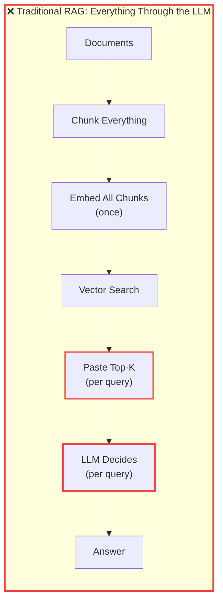
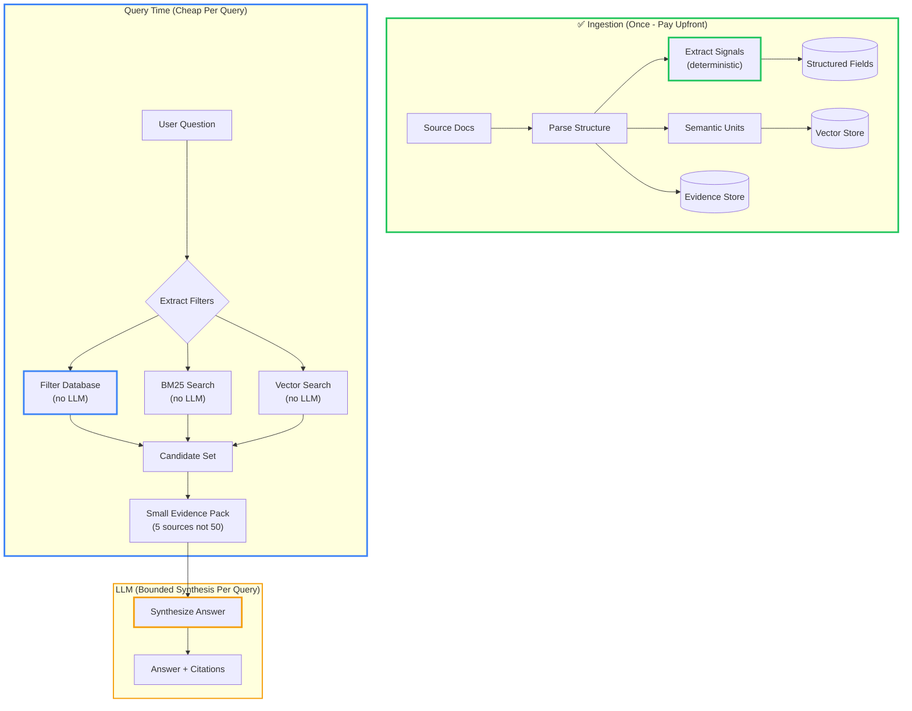

# Reduced RAG: Stop Stuffing Context Windows and Start Extracting Signals

<datetime class="hidden">2026-01-08T19:00</datetime>
<!-- category -- AI, RAG, LLM, Architecture, Semantic Search -->

If you're brand new to RAG, start with [RAG Explained](/blog/rag-primer) and [RAG Architecture](/blog/rag-architecture). This post is for the point where you've built a RAG pipeline that *mostly* works… and now you're paying for it in cost, fragility, and "why did it answer that?" debugging sessions.

**What this covers:** The architectural pattern behind production RAG. For hands-on implementation, see [Building a Document Summarizer with RAG](/blog/building-a-document-summarizer-with-rag).

**Where it comes from:** I built [DocSummarizer](/blog/building-a-document-summarizer-with-rag) (Document RAG engine), [DataSummarizer](/blog/datasummarizer-how-it-works) (Data RAG engine), [ImageSummarizer](/blog/constrained-fuzzy-image-intelligence) (Image RAG engine), and [lucidRAG](/blog/lucidrag-multi-document-rag-web-app) (multi-document Q&A). The same pattern kept emerging across documents, data, and images.

> NOTE: You may have rightly noticed the semantic search on this site is broken...and yeah it's a config issue I haven't had time to fix yet. NOT bad theory 🤓

## Quick RAG terminology refresher

| Term | What It Means | Example |
|------|---------------|---------|
| **RAG** | Retrieval-Augmented Generation | Giving an LLM your company docs before answering |
| **Chunking** | Splitting documents into smaller pieces | Breaking a PDF into paragraphs |
| **Top-k** | Get the k "best" results from a search | "Show me the 5 most relevant chunks" |
| **Vector search** | Finding similar text using embeddings | "Find docs similar to this error message" |
| **BM25** | Keyword search | "Find docs containing 'timeout' AND 'database'" |
| **Context window** | How much text you can fit in a prompt | Finite and expensive |
| **Signals** | Facts extracted without AI | "Created: 2025-01-15", "Priority: High" |

Retrieval-Augmented Generation (RAG) has become one of those phrases that means *everything and nothing*.

For a lot of teams, “doing RAG” is now:

1. Chunk documents
2. Embed them
3. Retrieve top-k
4. Paste everything into the prompt
5. Ask the model to “figure it out”

It works.
Until it doesn’t.

It’s expensive, it’s hard to reason about, and it quietly hands responsibility to the model: parse the structure, enforce the filters, decide what matters, reconcile contradictions, and be confident about it.

When people say “RAG hallucinates” or “RAG doesn’t filter well”, they’re usually blaming the wrong component.

The problem isn’t RAG.
The problem is **lazy RAG**.

This post describes a different default: **Reduced RAG** - use LLMs *less*, not more, by extracting deterministic signals up front and treating models as *synthesis engines*, not *datastores*.

[TOC]

## The core mistake: treating context windows like storage

A context window is:

- transient
- untyped
- expensive
- repaid on every query

It is not a datastore.

When you “just stick more in the prompt”, you’re asking the model to:

- re-parse structure every time
- infer filters instead of enforcing them
- summarise away detail you might need later
- sound confident even when it’s wrong

That’s why RAG demos look great and production RAG systems quietly rot.

## What “Reduced RAG” means

Reduced RAG flips the default.

Instead of:

> Retrieve text and let the model decide what matters.

You do:

> Decide what matters once, store it, and only involve the model when you need synthesis.

In practice that means: **deterministic ingestion, cheap retrieval, bounded generation**.

If this sounds familiar, it’s the same systems shape as [Constrained Fuzziness](/blog/constrained-fuzziness-pattern): let probabilistic components *propose*; let deterministic systems *decide*.

## Traditional RAG vs Reduced RAG

First, let's see what most teams do (and why it's expensive):



**Problems:**
- LLM re-parses structure every query
- Can't enforce filters (only "ask nicely" via prompt)
- Token costs scale with queries (↑ per query)
- Hallucinations when model invents filters

Now here's the Reduced RAG approach:



**Key differences:**

| Phase | Traditional RAG | Reduced RAG |
|-------|----------------|-------------|
| **Ingestion** | Just chunk and embed | Extract dates, categories, entities, quality flags |
| **Filtering** | Ask LLM to filter in prompt | Database WHERE clauses |
| **Search** | Vector only | BM25 + Vector + Structured filters |
| **LLM Role** | Parse, filter, AND answer | Just synthesize answer |
| **Cost** | Every query pays for full context | Ingestion once, queries cheap |

## Step 1: Deterministic ingestion (the boring bit that matters)

At ingestion time, parse what you can *without* an LLM.

**Example: Support Ticket System**

Instead of just chunking tickets into text:

```
Traditional: "Ticket #1234: Customer complained about slow loading..."
→ Embed entire text
→ Hope the LLM figures out it's about performance
```

Extract signals up front:

```csharp
// Parse once during ingestion
var ticket = new SupportTicket
{
    Id = "1234",
    CreatedDate = DateTime.Parse("2025-01-15"),
    Category = "Performance",              // ← Deterministic field
    Product = "WebApp",                     // ← Filterable
    Priority = "High",                      // ← Sortable
    Customer = "Enterprise",                // ← Segment filter
    SentimentScore = -0.3,                  // ← Computed once
    Tags = ["slow-loading", "timeout"],     // ← Searchable
    Text = "Customer complained about..."   // ← Still keep for RAG
};
```

**What you can extract deterministically:**

| Signal Type | Examples | Why It Matters |
|-------------|----------|----------------|
| **Temporal** | Created date, updated date, expiry | "Only show last week's errors" |
| **Categorical** | Status, priority, department, product | "Filter to Mobile team tickets" |
| **Numeric** | Price, quantity, score, confidence | "Sort by severity" |
| **Identity** | Author, customer ID, SKU, invoice # | "All tickets from Customer X" |
| **Quality** | OCR confidence, auto-generated flag | "Exclude low-confidence OCR" |
| **Provenance** | Source system, file path, URL | "Only from production logs" |

Do it once. Keep the output. That's the substrate your system can rely on.

**The hard part of RAG isn't the model - it's everything before the model.** For concrete implementations, see [Building a Document Summarizer with RAG](/blog/building-a-document-summarizer-with-rag) and [DocSummarizer: Building RAG Pipelines](/blog/docsummarizer-rag-pipeline).

## Step 2: Store signals (and keep evidence)

Instead of treating "chunks" as the unit of truth, store structured fields, signal-dense units, embeddings, and pointers back to source.

Text is still part of the system - but it becomes **evidence**, not "whatever we happened to paste into the prompt".

This is the difference between "RAG answers are vibes" and "RAG answers are inspectable".

### "But how do I know what signals to extract?"

You don't. Not upfront.

That's the whole point of storing **raw signals** instead of LLM-processed summaries.

**Traditional RAG (expensive to change):**
```csharp
// ❌ You asked the LLM to "summarize the key points"
var summary = await llm.Summarize(ticket.Text); // Expensive
await db.SaveAsync(summary); // Threw away the original structure

// Later: "Actually, we need sentiment scores too"
// 😱 Have to re-process 10,000 tickets through LLM again!
```

**Reduced RAG (cheap to change):**
```csharp
// ✅ Store raw signals extracted deterministically
var signals = new TicketSignals
{
    Text = ticket.Text,                    // ← Keep original
    WordCount = ticket.Text.Split().Length, // ← Cheap to compute
    ContainsErrorCode = Regex.IsMatch(ticket.Text, @"ERR-\d+"),
    MentionedProducts = ExtractProducts(ticket.Text), // ← Heuristic
    SentimentWords = CountSentimentWords(ticket.Text), // ← Word lists
    CreatedHour = ticket.Created.Hour      // ← Maybe useful later?
};

// Later: "We need to prioritize by sentiment"
// ✅ Just add a computed column - no LLM re-run needed!
await db.ExecuteSqlAsync(@"
    ALTER TABLE Tickets ADD COLUMN SentimentScore AS
    (SentimentWords->>'positive' - SentimentWords->>'negative')
");
```

**What just happened:**
- You stored **more signals than you needed** (cheap)
- When requirements changed, you **recomputed from stored signals** (free)
- You didn't re-run LLM inference on 10,000 documents (expensive + time-consuming)

This is the same pattern as:
- **[DiSE (Directed Synthetic Evolution)](/blog/dise-architecture-overview)** - stores test results, mutation history, quality metrics. When you change the scoring function, you don't re-run the LLM evolution—you re-score existing candidates from stored signals.
- **[Bot Detection](/blog/learning-lrus-when-capacity-makes-systems-better)** - stores request patterns, timing signals, behavior heuristics. When you adjust the threshold (0.3 → 0.4), you don't reprocess traffic—you re-evaluate stored signals.

**The rule:** Remember well *before* the LLM. Update your "memory" (retrieval logic) for free.

**Key architectural benefit: Evolvability.**
Because you store deterministic signals alongside embeddings (not instead of them), each part of the system can change independently. Swap embedding models? Re-embed without touching signals. Add a new signal? Compute it from stored text without re-embedding. Tune ranking? Adjust signal weights and scoring logic without reindexing.

With multi-vector stores (like Qdrant), you can even add **multiple embeddings per document**. Want to try a new embedding model? Add it alongside the existing one and gradually transition. Test both in production, compare quality, then deprecate the old one — all without reindexing or disrupting service.

Each component can evolve without forcing a full pipeline rebuild — and without degrading the others.

### What signals should you store?

Store anything you can compute **cheaply and deterministically**.

**Important:** Signals are just **short text strings, numbers, and booleans**—not giant data structures. You're storing "Performance" (8 chars), not "Customer complained about slow loading times..." (50+ words).

```csharp
public class DocumentSignals
{
    // Always extract (almost free)
    public int CharCount { get; set; }              // Example: 1247
    public int WordCount { get; set; }              // Example: 203
    public int ParagraphCount { get; set; }         // Example: 5
    public string[] UniqueWords { get; set; }       // Example: ["timeout", "error", "api"]

    // Structural (parse once)
    public bool HasCodeBlocks { get; set; }         // true/false
    public bool HasLinks { get; set; }              // true/false
    public int HeadingCount { get; set; }           // Example: 3

    // Heuristic (simple patterns)
    public string[] MentionedProducts { get; set; }       // Example: ["WebApp", "API"]
    public string[] ErrorCodes { get; set; }              // Example: ["ERR-404", "ERR-500"]
    public Dictionary<string, int> SentimentWords { get; set; } // { "positive": 3, "negative": 7 }

    // Metadata (already available)
    public DateTime Created { get; set; }           // Example: 2025-01-15T14:23:00
    public string Author { get; set; }              // Example: "user@example.com"
    public string Category { get; set; }            // Example: "Performance" (not essay-length)

    // Computed (cheap math)
    public double ReadingTimeMinutes { get; set; }  // Example: 4.2
    public double KeywordDensity { get; set; }      // Example: 0.034
}
```

**Storage cost comparison:**

| What You Store | Size per Document | 10k Documents |
|----------------|------------------|---------------|
| **Full text** | ~5 KB | 50 MB |
| **All these signals** | ~500 bytes | 5 MB |
| **LLM-generated summary** | ~2 KB | 20 MB |

Signals are **10x smaller** than text, **4x smaller** than LLM summaries, and **infinitely cheaper** to recompute (because you don't need an LLM).

**When you realize you needed a different signal:** Just compute it from the stored raw data. Storage is cheap; LLM inference is expensive.

This is why "over-extraction" is safe: you pay once in storage (negligible), not repeatedly in inference (substantial).

## Step 3: Search without an LLM (most queries don't need it)

Most "RAG queries" are really just search queries with constraints:

- "only the latest docs"
- "only for UK customers"
- "only the paid plan"
- "only errors from last week"

**Traditional RAG** (expensive, unreliable):

```csharp
// ❌ Paste everything into prompt and hope
var chunks = await vectorSearch.SearchAsync(query, k: 50); // 50 chunks!
var prompt = $@"
Given these 50 chunks of text, answer the question but ONLY use
docs from last week and ONLY for UK customers.

Chunks: {string.Join("\n", chunks)}

Question: {userQuestion}
";
var answer = await llm.GenerateAsync(prompt); // Expensive + unreliable
```

**Reduced RAG** (cheap, deterministic):

```csharp
// ✅ Filter first, retrieve less, synthesize last
var candidates = await db.Tickets
    .Where(t => t.CreatedDate > DateTime.Now.AddDays(-7))  // ← Database does this
    .Where(t => t.Region == "UK")                          // ← Not the LLM!
    .ToListAsync();

// Hybrid search on the filtered set
// (In production: push BM25 to database/index, not in-memory LINQ)
var bm25Results = candidates.Where(c => c.Text.Contains(keyword));
var vectorResults = await vectorSearch.SearchAsync(query, k: 5, filter: candidates);

// Small evidence pack
var evidence = RRF.Merge(bm25Results, vectorResults).Take(5);

// LLM only synthesizes
var answer = await llm.GenerateAsync($@"
Synthesize an answer using ONLY these 5 sources:
{FormatEvidence(evidence)}

Question: {userQuestion}
");
```

**What just happened:**
- Database filtered deterministically (not the LLM)
- LLM sees 5 sources instead of 50 (90% token reduction)
- Filters are guaranteed, not "suggested"

This is why hybrid search matters in production. If you haven't built it yet, [Hybrid Search & Auto-Indexing](/blog/rag-hybrid-search-and-indexing) is the most practical piece of the whole RAG series.

### Optional: Using an LLM to extract intent (as a proposal)

If a query is genuinely messy, you *can* use a small model to extract intent/filters ("compare vs explain vs troubleshoot"):

```csharp
// Use small model to propose filters (ephemeral - discarded after use)
var intent = await smallModel.ExtractIntent(userQuestion);
// Returns: { intent: "troubleshoot", filters: { priority: "high", product: "api" } }

// Validate the proposal against known fields (deterministic)
var validatedFilters = ValidateAgainstSchema(intent.filters);

// Use validated filters for retrieval
var results = await db.Tickets.Where(validatedFilters).ToListAsync();
```

**Core principle: The LLM proposes, the deterministic layer validates.**

This is the foundation of the [Constrained Fuzziness](/blog/constrained-fuzziness-pattern) pattern.

For a deeper dive into ephemeral execution patterns where you use LLMs temporarily without persisting their outputs, see [Fire and Don't Quite Forget](/blog/fire-and-dont-quite-forget-ephemeral-execution).

## Step 4: LLMs as synthesis engines (not judges)

Only after retrieval do you call the LLM. You give it a small, explicit set of facts with evidence pointers and clear uncertainty instructions.

The model's job: **synthesize, explain, compare**. Not: **enforce constraints, decide truth, invent structure**.

If you care about “LLMs dragging the whole context window into the answer”, you’ve already seen the failure mode. I called that out explicitly in [Constrained Fuzzy Context Dragging](/blog/constrained-fuzzy-context-dragging): it’s not malicious - it’s what you asked it to do.

## Why this is safer *and* cheaper

### Cost comparison (illustrative example)

Order-of-magnitude comparison for a typical customer support RAG system:

**Scenario:** 10,000 support tickets, 1,000 queries per day

| Approach | Ingestion Cost | Per-Query Cost | Daily Cost |
|----------|----------------|----------------|------------|
| **Traditional RAG** | Embed 10k tickets | 50 chunks × large context | ~**$75/day** |
| **Reduced RAG** | Embed + extract signals | 5 chunks × small context | ~**$7.50/day** |

**Order of magnitude:** ~10x cost reduction per day

**Even better:** With good evidence and deterministic filtering, you likely don't need a frontier model at all. A local Ollama model (free) with a small evidence pack often outperforms GPT-4 fed 50 chunks it has to parse itself.

Plus: reduced debugging time, fewer support escalations, and model flexibility (swap models without architectural changes).

### Reliability

**Traditional RAG** (hope-based filtering):
```csharp
// ❌ Prompt says "only UK customers" but model can ignore it
var answer = await llm.Generate(prompt); // No guarantee
```

**Reduced RAG** (enforced filtering):
```csharp
// ✅ Database physically prevents non-UK results
var results = db.Tickets.Where(t => t.Region == "UK"); // Guaranteed
```

**Why it's safer:** Filters are enforced before generation (model never owned them, can't forget them), and hallucinations are bounded by the evidence you control.

### Explainability

**Traditional RAG:** "The model said this, but I'm not sure why or which chunk it came from."

**Reduced RAG:**
```csharp
// You know exactly why each result matched
var result = new SearchResult
{
    Text = "Server timeout error",
    MatchedBecause = new[]
    {
        "Region = UK (database filter)",
        "Created in last 7 days (date filter)",
        "BM25 score: 4.2 (keyword 'timeout')",
        "Vector similarity: 0.89 (semantic match)"
    },
    SourceChunks = [chunk1, chunk2], // ← Audit trail
    ConfidenceScore = 0.89
};
```

You can inspect why each result matched, show evidence when confidence is low, and debug production issues by examining the candidate set before LLM synthesis.

## Getting started: Refactoring traditional → reduced RAG

If you already have a working RAG system, here's how to migrate:

### Step 1: Add structured fields to your ingestion

**Before:**
```csharp
public class Document
{
    public string Id { get; set; }
    public string Text { get; set; }           // ← Only unstructured text
    public float[] Embedding { get; set; }
}
```

**After:**
```csharp
public class Document
{
    public string Id { get; set; }
    public string Text { get; set; }           // ← Keep for evidence
    public float[] Embedding { get; set; }

    // Add deterministic signals (extract once during ingestion)
    public DateTime CreatedDate { get; set; }  // ← Parse from metadata
    public string Category { get; set; }       // ← Extract from filename/tags
    public string Author { get; set; }         // ← From file properties
    public string[] Tags { get; set; }         // ← Parse from content/metadata
    public double QualityScore { get; set; }   // ← Compute heuristics
}
```

### Step 2: Move filters out of prompts, into queries

**Before:**
```csharp
var prompt = "Only use docs from last month for product 'API'. Query: " + userQuery;
var chunks = await vectorStore.Search(userQuery, k: 50);
var answer = await llm.Generate(prompt + chunks); // ❌ LLM might ignore filters
```

**After:**
```csharp
// ✅ Database enforces filters
var candidates = await db.Documents
    .Where(d => d.CreatedDate > DateTime.Now.AddMonths(-1))
    .Where(d => d.Category == "API")
    .ToListAsync();

// Search only the filtered candidates
var results = await vectorStore.Search(userQuery, k: 5, filter: candidates.Select(c => c.Id));
var answer = await llm.Generate(FormatEvidence(results)); // Much smaller context
```

### Step 3: Add hybrid search (BM25 + Vector)

```csharp
// Combine keyword and semantic search
var keywordResults = await db.Documents
    .Where(d => EF.Functions.ToTsVector("english", d.Text)
        .Matches(EF.Functions.ToTsQuery("english", keywords)))
    .ToListAsync();

var vectorResults = await vectorStore.Search(userQuery, k: 20);

// Merge using Reciprocal Rank Fusion (RRF)
var merged = RRF.Merge(keywordResults, vectorResults, k: 5);
```

See [Hybrid Search & Auto-Indexing](/blog/rag-hybrid-search-and-indexing) for a complete implementation.

### Step 4: Measure the difference

Track these metrics before and after:

```csharp
public class RAGMetrics
{
    public int PromptTokens { get; set; }           // Should drop by 80-90%
    public int CandidatesRetrieved { get; set; }    // Should drop from 50+ to 5-10
    public TimeSpan QueryLatency { get; set; }      // Should improve
    public bool FiltersEnforced { get; set; }       // Should be true
    public List<string> EvidenceSources { get; set; } // Should be traceable
}
```

## Rule of thumb

If your system depends on ever-larger context windows to stay accurate, you don't have a retrieval problem. You have an ingestion problem.

## Pattern card

| | |
|---|---|
| **Intent** | Make RAG predictable, cheap, and debuggable |
| **Forces** | High token costs, weak filtering, silent hallucinations, untyped prompts |
| **Solution** | Extract signals once → enforce constraints deterministically → retrieve evidence → let the LLM synthesise within a budget |
| **Consequences** | More engineering up front; dramatically better operational behaviour |

---

## Summary: The Reduced RAG mental model

Reduced RAG isn't anti-LLM. It's anti-waste.

Think of it this way:

```
Traditional RAG = "LLM, here's 50 chunks. Figure out what matters and answer."
Reduced RAG    = "Database, filter to 100. BM25, find keywords. Vector, find similar.
                  Now LLM, here are the 5 most relevant sources. Synthesize an answer."
```

**The shift:**
- **From:** LLM as oracle (does everything)
- **To:** LLM as synthesis engine (does one thing well)

**The primitives:**
1. **Signals** (deterministic) - dates, categories, scores, filters
2. **Evidence** (text) - what you show to the LLM
3. **Constraints** (boundaries) - token budgets, filter validation, citation requirements

**The pattern:**
- Extract signals once (ingestion)
- Filter deterministically (databases are good at this)
- Search hybrid (BM25 + vectors)
- Synthesize bounded (small evidence pack → LLM)

It's what happens when you apply normal software engineering discipline to systems that happen to include language models.

## Next steps

If you're ready to build this:

1. **Start simple:** Add one structured field (CreatedDate) and one database filter
2. **Measure first:** Track token counts before/after
3. **Add hybrid search:** Implement BM25 + Vector with RRF ([guide here](/blog/rag-hybrid-search-and-indexing))
4. **Build incrementally:** Don't refactor everything at once

**Reference implementations:**
- [Building a Document Summarizer with RAG](/blog/building-a-document-summarizer-with-rag) - Practical implementation walkthrough
- [DocSummarizer RAG Pipeline](/blog/docsummarizer-rag-pipeline) - Complete ingestion pipeline
- [lucidRAG](/blog/lucidrag-multi-document-rag-web-app) - Full web app with hybrid search
- [Constrained Fuzziness](/blog/constrained-fuzziness-pattern) - The underlying pattern

The infrastructure is already there. You just have to stop treating the context window like a database.

