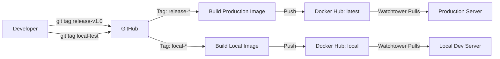
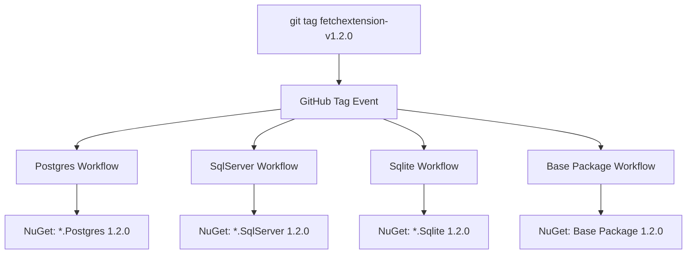
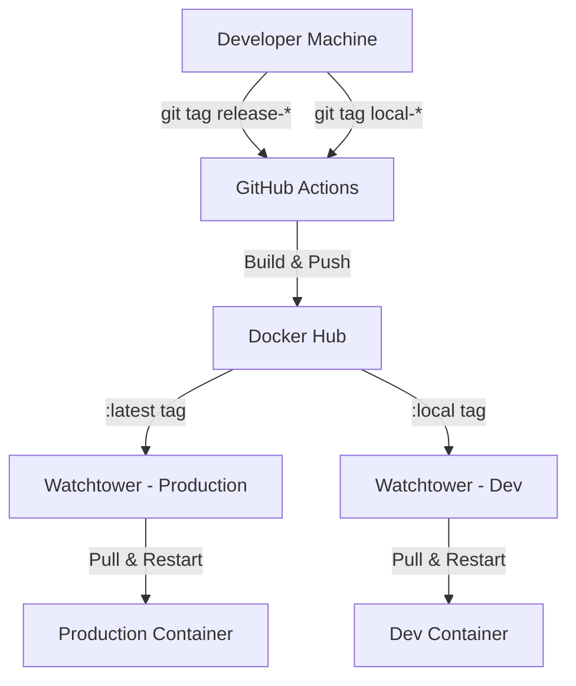

# Modern Release Strategies with GitHub Actions

<!--category-- DevOps, CI/CD, GitHub Actions -->
<datetime class="hidden">2025-12-01T12:00</datetime>

## Introduction

Deploying software isn't just about pushing code to production. It's about having repeatable, reliable processes that let you ship with confidence. Over time I've refined my release strategy for this blog and its associated packages into a system that handles everything from local testing to production deployments, multi-package versioning, and quality gates.

In this article I'll walk through the release strategies I use, covering branch-based releases, tag-based releases, monorepo challenges, quality assurance, and environment management. All examples come from real workflows running in this repository.

[TOC]

## The Landscape: Monorepo vs Multi-Repo

Before diving into specific strategies, it's worth understanding the fundamental architectural decision that shapes your release process.

### Monorepo Approach

This blog runs as a monorepo - one repository containing multiple deployable units:
- The main blog application (Docker image: `scottgal/mostlylucid`)
- A scheduler service (Docker image: `scottgal/mostlylucid-scheduler`)
- Multiple NuGet packages (`Umami.Net`, `Mostlylucid.Markdig.FetchExtension` and variants)
- An npm package (`@mostlylucid/mermaid-enhancements`)

```bash
mostlylucidweb/
├── Mostlylucid/                          # Main web application
├── Mostlylucid.SchedulerService/         # Background jobs service
├── Umami.Net/                            # Analytics client (NuGet)
├── Mostlylucid.Markdig.FetchExtension/   # Markdown extension (NuGet)
├── mostlylucid-mermaid/                  # Frontend package (npm)
└── .github/workflows/                    # Unified CI/CD
```

**Advantages:**
- Atomic commits across related changes
- Shared tooling and CI/CD infrastructure
- Easier to maintain consistency across packages
- Single source of truth for issues and documentation

**Challenges:**
- Need independent versioning per package
- Selective triggering (don't rebuild everything on every commit)
- More complex CI/CD logic
- Larger repository size

### Multi-Repo Alternative

The alternative is splitting each package into its own repository. I've seen this work well for larger teams where different groups own different packages, but for a solo developer or small team, the overhead isn't worth it.

## Strategy 1: Tag-Based Environment Targeting

The simplest and most reliable release strategy I use is tag-based deployment with environment targeting. This is what powers the main blog application.

### How It Works

Different tag prefixes route to different environments:

```yaml
# .github/workflows/docker-image.yml
on:
  push:
    tags:
      - 'release-*'  # Production releases
      - 'local-*'    # Local/dev environment releases
```

The workflow logic determines the destination based on the tag:

```yaml
- name: Build and tag the Docker image
  run: |
    TAG_NAME=${GITHUB_REF#refs/tags/}

    if [[ "$TAG_NAME" == local-* ]]; then
      # Local environment
      TAGS="scottgal/mostlylucid:local"
      ADDITIONAL_TAG="scottgal/mostlylucid:$TIMESTAMP-local"
    else
      # Production environment
      TAGS="scottgal/mostlylucid:latest"
      ADDITIONAL_TAG="scottgal/mostlylucid:$TIMESTAMP"
    fi

    docker build . --file Mostlylucid/Dockerfile --tag $TAGS --tag $ADDITIONAL_TAG
```

### Workflow Diagram



### Why This Works

1. **Simple mental model**: Want to deploy to production? Tag with `release-`. Testing locally? Tag with `local-`.
2. **No manual intervention**: Push the tag, everything else is automatic
3. **Rollback friendly**: Every build gets a timestamped tag for easy rollback
4. **Environment isolation**: Production never accidentally pulls a dev build

### Real Usage

```bash
# Deploy to local dev environment
git tag local-testing-new-feature
git push origin local-testing-new-feature

# Deploy to production
git tag release-v2024.12.01
git push origin release-v2024.12.01
```

## Strategy 2: Package-Specific Semantic Versioning

When you have multiple publishable packages in one repo, you need a way to version them independently. I use tag prefixes to identify which package is being released.

### Tag Prefix Routing

Each package has its own tag prefix:

```yaml
# Umami.Net NuGet package
on:
  push:
    tags:
      - 'umamiv*.*.*'  # e.g., umamiv1.0.5

# Markdig.FetchExtension package
on:
  push:
    tags:
      - 'fetchextension-v*.*.*'  # e.g., fetchextension-v1.2.0

# npm package
on:
  push:
    tags:
      - 'ml-mermaidv*'  # e.g., ml-mermaidv1.0.0
```

### Version Extraction

The workflow extracts the actual semantic version from the tag:

```yaml
- name: Extract version from tag
  id: get_version
  run: |
    TAG=${GITHUB_REF#refs/tags/fetchextension-v}
    echo "VERSION=$TAG" >> $GITHUB_OUTPUT
    echo "Publishing version: $TAG"
```

This version is then used throughout the build and publish process:

```yaml
- name: Build
  run: dotnet build --configuration Release -p:Version=${{ steps.get_version.outputs.VERSION }}

- name: Pack
  run: dotnet pack --configuration Release -p:PackageVersion=${{ steps.get_version.outputs.VERSION }}
```

### The Umami.Net Example

Here's the full workflow for publishing the Umami.Net package:

```yaml
name: Publish Umami.NET

on:
  push:
    tags:
      - 'umamiv*.*.*'

jobs:
  publish:
    runs-on: ubuntu-latest
    steps:
      - name: Checkout code
        uses: actions/checkout@v4
        with:
          fetch-depth: 0  # MinVer needs full history

      - name: Setup .NET
        uses: actions/setup-dotnet@v4
        with:
          dotnet-version: |
            8.x
            9.x

      - name: Restore dependencies
        run: dotnet restore ./Umami.Net/Umami.Net.csproj

      - name: Build project (multi-targeting)
        run: |
          dotnet build --configuration Release ./Umami.Net/Umami.Net.csproj --framework net8.0
          dotnet build --configuration Release ./Umami.Net/Umami.Net.csproj --framework net9.0

      - name: Run tests
        run: dotnet test --configuration Release ./Umami.Net.Test/Umami.Net.Test.csproj

      - name: Pack project
        run: dotnet pack --configuration Release ./Umami.Net/Umami.Net.csproj --output ./nupkg

      - name: Publish to NuGet
        run: dotnet nuget push ./nupkg/*.nupkg --source https://api.nuget.org/v3/index.json --api-key ${{ secrets.UMAMI_NUGET_API_KEY }}
```

### MinVer Integration

For automatic versioning, I use MinVer which calculates versions from Git tags:

```xml
<PackageReference Include="MinVer" Version="6.0.0">
  <PrivateAssets>all</PrivateAssets>
</PackageReference>

<PropertyGroup>
  <MinVerTagPrefix>umamiv</MinVerTagPrefix>
  <MinVerSkip Condition="'$(Configuration)' == 'Debug'">true</MinVerSkip>
</PropertyGroup>
```

This means:
- Tag `umamiv1.0.5` becomes version `1.0.5`
- Commits after the tag get a pre-release version like `1.0.5-alpha.0.1`
- Debug builds skip versioning (faster local builds)

## Strategy 3: Database Variants from a Single Codebase

An interesting challenge is publishing multiple variations of the same package. The Markdig.FetchExtension comes in three flavors:
- `Mostlylucid.Markdig.FetchExtension` (in-memory/no DB)
- `Mostlylucid.Markdig.FetchExtension.Postgres`
- `Mostlylucid.Markdig.FetchExtension.SqlServer`
- `Mostlylucid.Markdig.FetchExtension.Sqlite`

Each has its own workflow but they share the same tag pattern:

```yaml
# publish-fetchextension-postgres.yml
on:
  push:
    tags:
      - 'fetchextension-v*.*.*'

jobs:
  build-and-publish:
    steps:
      # ... build steps ...
      - name: Pack
        run: dotnet pack Mostlylucid.Markdig.FetchExtension.Postgres/Mostlylucid.Markdig.FetchExtension.Postgres.csproj
```

The trick is each workflow file specifies which project to build, but they all trigger on the same tag. This ensures all variants are published simultaneously with the same version number.

### Workflow Coordination



## Monorepo Package Management: The Local NuGet Feed

One of the biggest challenges in a monorepo is using your own packages during development before they're published. Here's how I handle it.

### The Old Manual Approach

Previously I had this in my `.csproj` files:

```xml
<Target Name="NugetPackAutoVersioning" AfterTargets="Build" Condition="'$(Configuration)' == 'Debug'">
  <RemoveDir Directories="$(SolutionDir)nuget" />
  <MakeDir Directories="$(SolutionDir)nuget" />
  <Exec Command="dotnet pack -p:PackageVersion=$([System.DateTime]::Now.ToString(&quot;yyyy.MM.dd.HHmm&quot;))-preview --output &quot;$(SolutionDir)nuget&quot;" />
  <Exec Command="dotnet nuget push $(SolutionDir)nuget\*.nupkg --source Local" />
</Target>
```

This auto-generates timestamped preview packages on every Debug build and pushes them to a local feed defined in `Nuget.config`:

```xml
<?xml version="1.0" encoding="utf-8"?>
<configuration>
  <packageSources>
    <add key="nuget.org" value="https://api.nuget.org/v3/index.json" />
    <add key="Local" value="e:\nuget" />
  </packageSources>
</configuration>
```

### The Better Approach: Project References

Now I primarily use project references during development:

```xml
<ItemGroup>
  <!-- Development: use project reference -->
  <ProjectReference Include="..\Umami.Net\Umami.Net.csproj" />

  <!-- Production: use NuGet package -->
  <!-- <PackageReference Include="Umami.Net" Version="1.0.0" /> -->
</ItemGroup>
```

This is much simpler - you get:
- Immediate rebuild when you change the library
- Better debugging with source code stepping
- No versioning headaches
- Faster build times (no packing/unpacking)

The commented PackageReference serves as documentation for which version will be used when deployed. Before release, I verify the published package version matches my expectation.

## Quality Gates: Don't Ship Broken Code

Having fast deployment is useless if you're deploying bugs. Here's how I ensure quality.

### Test Execution in CI

Every workflow runs tests before publishing:

```yaml
- name: Run tests
  run: dotnet test --configuration Release ./Umami.Net.Test/Umami.Net.Test.csproj
```

If tests fail, the workflow stops. The package never gets published.

### Build Verification for npm Packages

For the npm package, I verify the build output exists:

```yaml
- name: Build
  run: npm run build:all

- name: Verify build output
  run: |
    if [ ! -d "dist" ]; then
      echo "❌ Build failed - dist directory not found"
      exit 1
    fi
    echo "✅ Build successful"
```

### Multi-Framework Testing

The Umami.Net package targets both .NET 8 and .NET 9, so I build both:

```yaml
- name: Build project (net8.0)
  run: dotnet build --configuration Release ./Umami.Net/Umami.Net.csproj --framework net8.0

- name: Build project (net9.0)
  run: dotnet build --configuration Release ./Umami.Net/Umami.Net.csproj --framework net9.0
```

This ensures compatibility across both frameworks before publishing.

## Environment Management: Local vs Production

I run two complete environments:
1. **Production**: Live blog served to the internet
2. **Local**: Development instance running on a home server

### Docker Compose Environments

Both environments use the same `docker-compose.yml` but with different configurations:

```yaml
services:
  mostlylucid:
    image: scottgal/mostlylucid:latest  # Production uses :latest
    # image: scottgal/mostlylucid:local   # Dev uses :local
    restart: always
    labels:
      - "com.centurylinklabs.watchtower.enable=true"
    env_file:
      - .env
    volumes:
      - /mnt/imagecache:/app/wwwroot/cache
      - /mnt/logs:/app/logs
      - /mnt/markdown:/app/Markdown
```

### Watchtower for Auto-Updates

The key to this working smoothly is Watchtower, which automatically pulls new images:

```yaml
watchtower:
  image: containrrr/watchtower
  volumes:
    - /var/run/docker.sock:/var/run/docker.sock
  environment:
    - WATCHTOWER_CLEANUP=true
    - WATCHTOWER_LABEL_ENABLE=true
  command: --interval 300  # Check every 5 minutes
```

### Deployment Flow



The entire deployment happens in about 5-10 minutes:
1. Push tag (1 second)
2. GitHub Actions build (3-5 minutes)
3. Push to Docker Hub (30 seconds)
4. Watchtower detects new image (up to 5 minutes)
5. Container restart (10 seconds)

## Blue-Green Deployments with Docker Tags

While I don't run true blue-green deployments (limited resources on my home server), the pattern is built into my tagging strategy.

### Timestamped Releases

Every build creates a timestamped tag alongside the environment tag:

```yaml
TIMESTAMP=$(date +%s)
docker build --tag scottgal/mostlylucid:latest \
             --tag scottgal/mostlylucid:$TIMESTAMP
```

This means I have:
- `scottgal/mostlylucid:latest` - current production
- `scottgal/mostlylucid:1733064000` - specific build from Dec 1, 2025
- `scottgal/mostlylucid:1733063700` - previous build

### Instant Rollback

If a deployment goes wrong:

```bash
# Check what's running
docker ps

# Roll back to previous version
docker pull scottgal/mostlylucid:1733063700
docker stop mostlylucid_container
docker run -d --name mostlylucid_container scottgal/mostlylucid:1733063700

# Or let Watchtower do it by temporarily changing the tag in docker-compose.yml
```

### "Slots" Simulation for Testing

In Azure App Service you have deployment slots. I simulate this locally by running two containers:

```yaml
# docker-compose.yml
services:
  mostlylucid-prod:
    image: scottgal/mostlylucid:latest
    ports:
      - "8080:8080"

  mostlylucid-staging:
    image: scottgal/mostlylucid:local
    ports:
      - "8081:8080"
```

I can test the staging slot (port 8081) before swapping the tags to promote it to production. This isn't automatic, but it provides a safety net.

## OIDC and Trusted Publishing to NuGet

Traditional NuGet publishing requires storing an API key in GitHub Secrets. The newer approach uses OIDC (OpenID Connect) for passwordless authentication.

### Setting Up Trusted Publishing

1. On NuGet.org, configure your package to trust GitHub Actions from your repository
2. Grant `id-token: write` permission in your workflow

```yaml
permissions:
  id-token: write
  contents: read
```

3. Use the official NuGet login action:

```yaml
- name: Login to NuGet (OIDC)
  id: nuget_login
  uses: NuGet/login@v1
  with:
    user: 'mostlylucid'

- name: Publish to NuGet
  run: |
    dotnet nuget push ./artifacts/*.nupkg \
      --api-key ${{ steps.nuget_login.outputs.NUGET_API_KEY }} \
      --source https://api.nuget.org/v3/index.json
```

The login action exchanges the GitHub OIDC token for a short-lived NuGet API key. No secrets stored, no keys to rotate.

## Branch-Based Releases: An Alternative Pattern

While I primarily use tag-based releases, the scheduler service uses a hybrid approach with branch-based triggers:

```yaml
on:
  push:
    tags:
      - 'scheduler-*'
    branches:
      - "main"
      - "local"
```

This allows:
- **Tag-based releases**: `scheduler-v1.0.0` triggers a build
- **Branch-based auto-deploy**: Pushing to `main` or `local` branches auto-deploys

```yaml
if: startsWith(github.ref, 'refs/tags/scheduler-')  # Only tags trigger publish
```

The workflow only publishes on tags, but builds on branch pushes (for CI verification).

### When to Use Branch-Based

Branch-based deployments work well when:
- You have a clear `main` = production, `develop` = staging mapping
- You want automatic deployments on merge
- Your team is disciplined about branch protection

I prefer tag-based because:
- Explicit about what's being deployed
- Easier to track in Git history
- Prevents accidental deployments
- Clearer rollback story

## Practical Tips and Gotchas

### Git Tag Cleanup

Git tags stick around forever. Clean up old test tags:

```bash
# List local tags
git tag

# Delete local tag
git tag -d local-old-test

# Delete remote tag
git push origin :refs/tags/local-old-test
```

### Workflow Testing

Test workflow changes carefully. A syntax error can break all deployments. Use:

```bash
# Validate workflow syntax locally
npm install -g @actions/workflow-parser
workflow-parser .github/workflows/docker-image.yml
```

Or use the GitHub Actions extension in VS Code for real-time validation.

### Tag Naming Conventions

Be consistent with tag naming. I use:
- `release-*` for production (human-readable dates like `release-2024.12.01`)
- `local-*` for dev (descriptive like `local-test-new-feature`)
- Package versions always include version numbers (`umamiv1.0.5`)

### Secrets Management

Secrets required:
- `DOCKER_HUB_USER_NAME` and `DOCKER_HUB_ACCESS_TOKEN` for Docker
- `UMAMI_NUGET_API_KEY` for NuGet (or use OIDC)
- `NPM_TOKEN` for npm publishing

Store these in GitHub repository secrets, never in code.

### Docker Build Context

Mind your Docker build context. My Dockerfile is in the project directory but needs files from the solution root:

```dockerfile
# Mostlylucid/Dockerfile
FROM mcr.microsoft.com/dotnet/sdk:9.0 AS build
WORKDIR /src
COPY ["Mostlylucid/Mostlylucid.csproj", "Mostlylucid/"]
COPY ["Mostlylucid.Shared/Mostlylucid.Shared.csproj", "Mostlylucid.Shared/"]
RUN dotnet restore "Mostlylucid/Mostlylucid.csproj"
COPY . .
```

Build from the solution root:

```bash
docker build -f Mostlylucid/Dockerfile .
```

## Monitoring and Observability

### Deployment Success Tracking

I track deployments in my Umami analytics instance. The blog sends a deployment event on startup:

```csharp
await umamiClient.Track("deployment", new UmamiEventData
{
    { "version", Assembly.GetExecutingAssembly().GetName().Version.ToString() },
    { "environment", Environment.GetEnvironmentVariable("ASPNETCORE_ENVIRONMENT") }
});
```

This lets me see:
- When deployments happened
- How often (detecting Watchtower restart loops)
- Which version is running

### Health Checks

Every service exposes a health check endpoint:

```csharp
app.MapHealthChecks("/healthz");
```

Watchtower can check this before swapping containers (though I don't currently use this feature).

### Logging

All logs go to:
1. **Console** for Docker logs
2. **File** for persistent storage
3. **Seq** for structured querying

```yaml
volumes:
  - /mnt/logs:/app/logs  # Persistent logs survive container restarts
```

This has been invaluable for debugging deployment issues.

## What About Kubernetes?

The patterns I've described work great for Docker Compose deployments. If you move to Kubernetes, the same principles apply but the mechanisms change:

- **Tags → Image Tags**: Same tagging strategy
- **Watchtower → ArgoCD/Flux**: GitOps-based deployment tools
- **Environments → Namespaces**: `production` and `staging` namespaces
- **Slots → Services**: Blue-green with service selectors

The mental model stays the same, just different tools.

## Conclusion

Release strategies aren't one-size-fits-all. What works for a monorepo solo project differs from a microservices team deployment. The key principles remain:

1. **Make releases boring**: Automate everything, remove manual steps
2. **Version independently**: Each package gets its own version and release cadence
3. **Test before shipping**: Quality gates prevent broken releases
4. **Enable rollback**: Always have an escape hatch
5. **Visibility matters**: Track what's deployed, when, and where

My setup has evolved over time from manual Docker builds to a fully automated CI/CD pipeline. It's not perfect - I'd like better automated smoke tests, proper blue-green deployments, and staging environment parity - but it's reliable, fast, and most importantly, it gets out of my way so I can focus on writing code.

The workflows I've shown are all running in this repository. Check them out in `.github/workflows/` to see the complete implementations.
