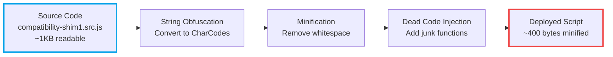
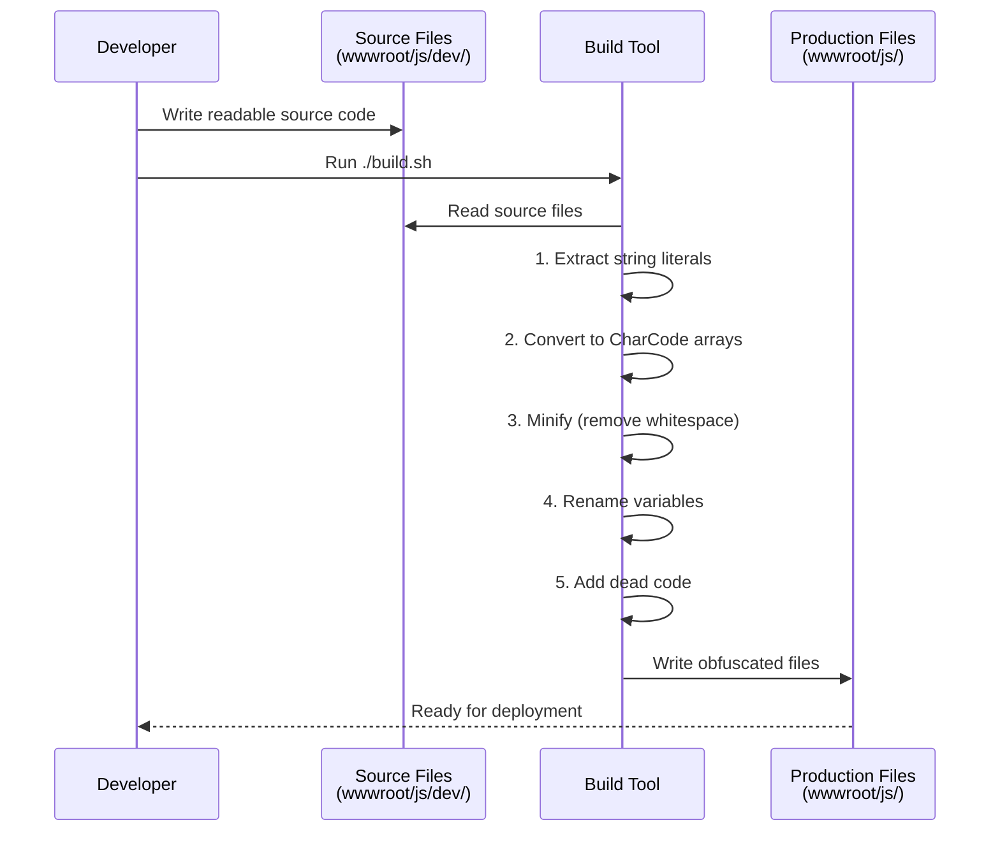
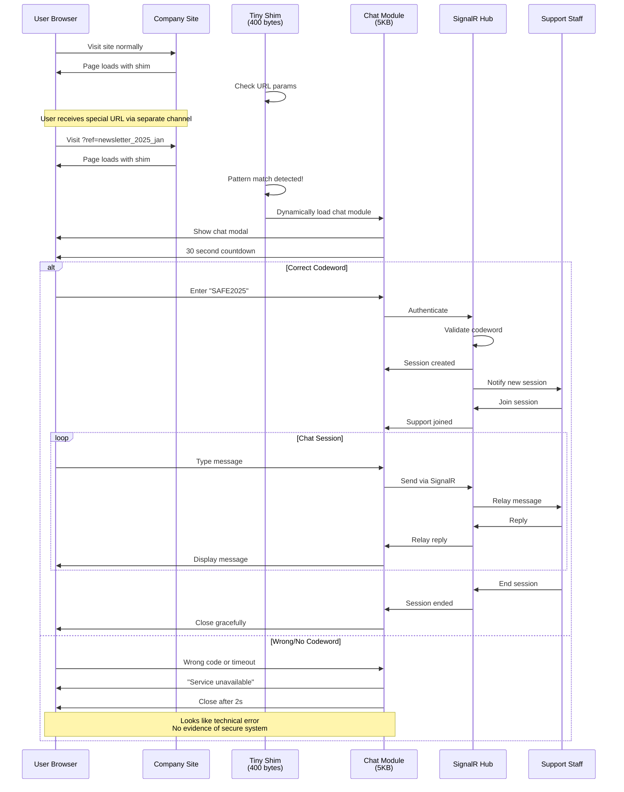


# Demo Implementation: A Trivial Proof of Concept

<!--category-- Security, History, JavaScript -->
<datetime class="hidden">2025-11-11T18:00</datetime>

# Introduction

To illustrate the concepts from [this article ](/blog/hiddensystems) in action, I've created a demonstration project that shows how such a system might work. **This is a trivial implementation for educational purposes only** and deliberately includes minimal security to keep the code readable and understandable.

[TOC]
### ⚠️ Critical Warning About the Demo

**The demo code has MANY security weaknesses and is NOT suitable for any real-world use.** It's designed to demonstrate concepts, not to be deployed. See the complete list of security issues in the demo's README.

### Demo Project Structure

The demo is a separate ASP.NET Core 9.0 project in the repository at `Mostlylucid.SecureChat.Demo/` with the following components:

```
Mostlylucid.SecureChat.Demo/
├── Controllers/DemoController.cs       # Routes for demo pages
├── Hubs/SecureChatHub.cs              # SignalR for real-time chat
├── Views/
│   ├── Demo/Company.cshtml            # Fake company site (client)
│   └── Demo/Support.cshtml            # Support staff interface
└── wwwroot/js/
    ├── compatibility-shim1.js         # Tiny trigger (1KB)
    └── secure-chat.js                 # Chat application
```

### How to Run the Demo

1. Clone the repository and navigate to `Mostlylucid.SecureChat.Demo`
2. Run `dotnet build && dotnet run`
3. Open browser to `http://localhost:5000/Demo/Company`
4. Add trigger parameter: `?ref=newsletter_2025_jan`
5. Enter codeword when prompted: `SAFE2025`
6. In another tab, open `/Demo/Support` to respond as support staff

### The Tiny Trigger Script

Here's the actual code from `compatibility-shim1.js` - note how small and innocuous it is:

```javascript
(function() {
    'use strict';

    // Actual compatibility checks (makes it look legitimate)
    if (!window.Promise) {
        console.warn('Browser does not support Promises');
    }
    if (!window.fetch) {
        console.warn('Browser does not support Fetch API');
    }

    // Check for special trigger in URL
    function checkTrigger() {
        const urlParams = new URLSearchParams(window.location.search);
        const ref = urlParams.get('ref');

        // Pattern that looks like a marketing tracking parameter
        // e.g., ?ref=newsletter_2025_jan
        if (ref && ref.match(/^newsletter_\d{4}_[a-z]+$/i)) {
            console.log('Loading enhanced support features...');
            loadSecureChat();
            return true;
        }
        return false;
    }

    // Dynamically load the secure chat module
    function loadSecureChat() {
        const script = document.createElement('script');
        script.src = '/js/secure-chat.js';
        script.onload = function() {
            if (window.SecureChat) {
                window.SecureChat.init();
            }
        };
        document.head.appendChild(script);
    }

    // Check on page load
    if (document.readyState === 'loading') {
        document.addEventListener('DOMContentLoaded', checkTrigger);
    } else {
        checkTrigger();
    }
})();
```

This script is only ~1KB and does two legitimate things (browser compatibility checks) before checking for the trigger. To anyone inspecting the code, it looks like a standard polyfill helper.

### The SignalR Hub

The backend uses SignalR for real-time bidirectional communication. Here's the simplified hub structure:

```csharp
public class SecureChatHub : Hub
{
    private static readonly ConcurrentDictionary<string, ChatSession> Sessions = new();

    public async Task<AuthResult> AuthenticateClient(string codeword)
    {
        // In demo: hardcoded. Production: dynamic, time-limited, rotated
        var validCodeword = "SAFE2025";

        if (codeword == validCodeword)
        {
            var sessionId = Guid.NewGuid().ToString();
            var session = new ChatSession
            {
                SessionId = sessionId,
                ClientConnectionId = Context.ConnectionId,
                StartTime = DateTime.UtcNow,
                IsAuthenticated = true
            };

            Sessions.TryAdd(Context.ConnectionId, session);
            await Groups.AddToGroupAsync(Context.ConnectionId, "authenticated-users");

            // Notify support staff
            await Clients.Group("support-staff")
                .SendAsync("NewSessionAvailable", sessionId, DateTime.UtcNow);

            return new AuthResult { Success = true, SessionId = sessionId };
        }

        return new AuthResult { Success = false };
    }

    public async Task SendMessage(string sessionId, string message)
    {
        if (!Sessions.TryGetValue(Context.ConnectionId, out var session)
            || !session.IsAuthenticated)
        {
            return; // Silently fail
        }

        var chatMessage = new ChatMessage
        {
            SessionId = sessionId,
            Message = message,
            Timestamp = DateTime.UtcNow,
            FromSupport = false
        };

        // Send to support staff in this session
        await Clients.Group($"session-{sessionId}")
            .SendAsync("ReceiveMessage", chatMessage);
    }

    // Additional methods for support staff, session management, etc.
}
```

### The Client-Side Chat

When triggered, the chat module creates a modal window with a 30-second authentication countdown:

```javascript
function showAuthPrompt() {
    const chatBody = document.getElementById('chat-body');
    const countdown = { seconds: 30 };

    chatBody.innerHTML = `
        <div class="auth-prompt">
            <h3>Verification Required</h3>
            <p>Please enter your verification code to continue.</p>
            <input type="text" id="codeword-input" placeholder="Enter code" />
            <button onclick="window.SecureChat.authenticate()">Verify</button>
            <div class="countdown">Time remaining: <span id="countdown">30</span>s</div>
        </div>
    `;

    // Countdown timer
    authTimeout = setInterval(() => {
        countdown.seconds--;
        document.getElementById('countdown').textContent = countdown.seconds;
        if (countdown.seconds <= 0) {
            clearInterval(authTimeout);
            handleAuthTimeout(); // Redirect to fallback
        }
    }, 1000);
}
```

If authentication fails or times out, the system redirects to a fallback URL (stored in a hidden meta tag on the page):

```javascript
function handleAuthFailure() {
    const fallbackMeta = document.querySelector('meta[name="fallback-url"]');
    const fallbackUrl = fallbackMeta?.getAttribute('content')
        ?? 'https://www.example.com/support';

    // Show "service unavailable" briefly
    chatBody.innerHTML = `
        <div class="message system">
            Service temporarily unavailable.<br/>
            Redirecting to standard support...
        </div>
    `;

    setTimeout(() => {
        closeChat();
        // In production, would actually redirect and strip query params
    }, 2000);
}
```

### What the Demo Shows

**Core Concepts Illustrated:**

1. **Hidden Trigger**: URL parameter `?ref=newsletter_2025_jan` looks like marketing tracking
2. **Dynamic Loading**: Chat module only loads when triggered, keeping initial payload tiny
3. **Time-Limited Auth**: 30-second window prevents indefinite probing
4. **Plausible Failure**: Failed auth looks like a broken support widget
5. **Real-Time Communication**: SignalR enables bidirectional chat
6. **Separation of Concerns**: Support staff interface is completely separate

**What the Demo DOESN'T Show:**

The production system had vastly more sophisticated features not included in the demo:
- Actual encryption (messages sent in plaintext in demo)
- Obfuscated/minified code (demo code is readable)
- Traffic padding and timing randomization
- Secure key exchange protocols
- Session token rotation
- Rate limiting and abuse prevention
- Comprehensive audit logging
- Anti-forensics measures
- And dozens of other security layers...

### The Build System: Obfuscation and Minification

One critical aspect of steganographic systems is making the code difficult to analyze. The demo includes a simple build system that demonstrates basic obfuscation techniques.

#### From Source to Deployed Script

Here's the transformation process:



#### Source Code (Readable)

The source is clean and understandable:

```javascript
// Check for trigger pattern
const params = new URLSearchParams(window.location.search);
const ref = params.get('ref');

if (ref && /^newsletter_\d{4}_[a-z]+$/i.test(ref)) {
    // Load the secure chat module
    const script = document.createElement('script');
    script.src = '/js/secure-chat.js';
    document.head.appendChild(script);
}
```

#### Obfuscated Version (Deployed)

After obfuscation, strings are split and encoded:

```javascript
!function(){if(new URLSearchParams(window.location.search).get(String.fromCharCode(114,101,102))?.match(new RegExp(String.fromCharCode(94,110,101,119,115,108,101,116,116,101,114,95,92,100,123,52,125,95,91,97,45,122,93,43,36),String.fromCharCode(105)))){const e=document.createElement(String.fromCharCode(115,99,114,105,112,116));e.src=String.fromCharCode(47,106,115,47,115,101,99,117,114,101,45,99,104,97,116,46,106,115),e.async=!0,document.head.appendChild(e)}}();
```

Notice:
- `'ref'` becomes `String.fromCharCode(114,101,102)`
- `/^newsletter_\d{4}_[a-z]+$/i` becomes a character array
- `'script'` becomes `String.fromCharCode(115,99,114,105,112,116)`
- All whitespace removed, variable names shortened

#### Build Process Flow



#### Obfuscation Techniques Demonstrated

**1. String Encoding**

```csharp
// C# build tool helper
public static string StringToCharCodes(string input)
{
    var codes = input.Select(c => ((int)c).ToString());
    return $"String.fromCharCode({string.Join(",", codes)})";
}

// "ref" becomes "String.fromCharCode(114,101,102)"
```

**2. String Splitting**

```csharp
public static string SplitString(string input)
{
    var chunks = new List<string>();
    for (int i = 0; i < input.Length; i += 3)
    {
        var chunk = input.Substring(i, Math.Min(3, input.Length - i));
        chunks.Add($"\"{chunk}\"");
    }
    return $"[{string.Join(",", chunks)}].join('')";
}

// "newsletter" becomes ["new","sle","tte","r"].join('')
```

**3. XOR Encoding (Simple)**

```csharp
public static string XorEncode(string input, int key)
{
    var encoded = input.Select(c => (char)(c ^ key)).ToArray();
    var codes = encoded.Select(c => ((int)c).ToString());
    return $"String.fromCharCode({string.Join(",", codes)})";
}
```

#### What Production Would Add

Real production systems would include:

1. **Custom Encryption Schemes**
    - Domain-locked decryption keys
    - Time-based key derivation
    - Environment-specific encryption

2. **Control Flow Obfuscation**
    - Flatten control structures
    - Replace if/else with lookup tables
    - Add bogus conditional branches

3. **AST Manipulation**
    - Restructure code at syntax tree level
    - Transform expressions to equivalent forms
    - Inject dead code that looks legitimate

4. **Anti-Debugging**
    - Detect debugger presence
    - Timing checks to detect single-stepping
    - Self-modifying code
    - Environment fingerprinting

5. **Traffic Obfuscation**
    - Pad messages to fixed sizes
    - Random timing delays
    - Dummy traffic generation
    - Protocol mimicry

#### Configuration and Flexibility

The demo is designed to be configurable for different backends:

```javascript
// Configuration via meta tag (looks like analytics config)
const config = {
    hubUrl: document.querySelector('meta[name="chat-hub-url"]')
        ?.getAttribute('content') || '/securechat',
    codeword: null
};

// Can point to different backends
// e.g., LLMApi (https://github.com/scottgal/LLMApi)
```

In the HTML (looks like standard metadata):

```html
<meta name="chat-hub-url" content="/securechat" data-hidden />
```

This allows the same client code to work with different backend implementations without modification.

### Complete Flow Diagram

Here's how all the pieces work together:



### Try It Yourself

The complete demo code is in the repository. Read the README carefully for the full list of security warnings. The code is heavily commented to explain each concept.

**Key files to examine:**

JavaScript (Source vs. Obfuscated):
- `wwwroot/js/dev/compatibility-shim1.src.js` - Readable trigger script
- `wwwroot/js/compatibility-shim1.js` - Obfuscated trigger (~400 bytes)
- `wwwroot/js/dev/secure-chat.src.js` - Readable chat application
- `wwwroot/js/secure-chat.js` - Minified chat application (~5KB)

Backend:
- `Hubs/SecureChatHub.cs` - SignalR hub for real-time chat
- `Controllers/DemoController.cs` - Page routing

Frontend:
- `Views/Demo/Company.cshtml` - The "company website" with hidden config
- `Views/Demo/Support.cshtml` - Support staff interface

Build System:
- `Build/JsObfuscator.cs` - String obfuscation utilities
- `Build/BuildObfuscated.cs` - Build tool for creating minified versions
- `build.sh` - Shell script for building

Remember: This is a **trivial implementation of the concept**. It demonstrates ideas, not production-ready security.