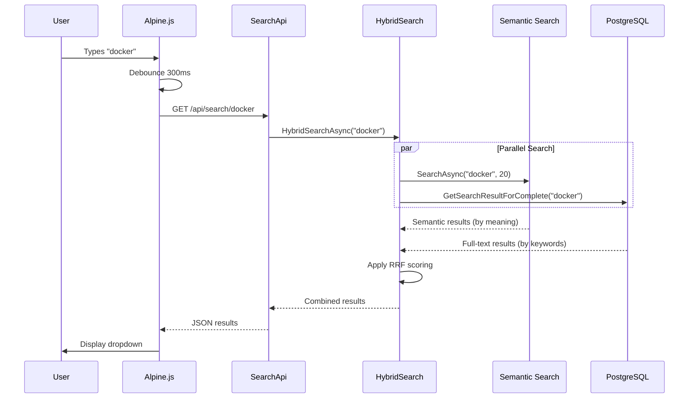
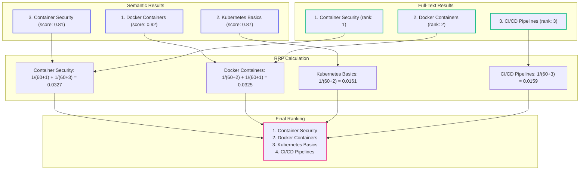
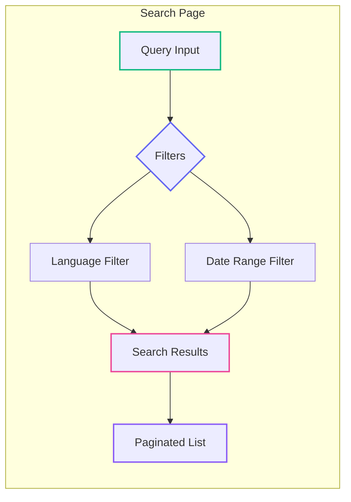

# RAG for Implementers: Semantic Search in Action

<datetime class="hidden">2025-11-23T09:00</datetime>
<!-- category -- ASP.NET, Semantic Search, Alpine.js, HTMX, Hybrid Search, RAG, AI-Article -->

# Introduction

**📖 Part of the RAG Series:** This is Part 4b - search features and UI:
- [Part 1: RAG Origins and Fundamentals](/blog/rag-primer) - What embeddings are, why they matter
- [Part 2: RAG Architecture and Internals](/blog/rag-architecture) - Chunking, tokenization, vector databases
- [Part 3: RAG in Practice](/blog/rag-practical-applications) - Building complete RAG systems
- [Part 4a: ONNX & Qdrant Implementation](/blog/semantic-search-with-onnx-and-qdrant) - CPU-friendly semantic search foundation
- **Part 4b: Semantic Search in Action** (this article) - Typeahead, hybrid search, and UI components
- [Part 5: Hybrid Search & Auto-Indexing](/blog/rag-hybrid-search-and-indexing) - Production integration patterns

In [Part 4a](/blog/semantic-search-with-onnx-and-qdrant), we built the foundation: ONNX embeddings and Qdrant vector storage. Now let's put it to work with a **real search UI** - including typeahead autocomplete, hybrid search combining semantic + full-text, and advanced filtering.

This article covers the actual search experience users interact with on this blog.

[TOC]

# The Typeahead Search Experience

The search box at the top of this site provides instant search-as-you-type results. Here's how it works:



## The Alpine.js Typeahead Component

The search box uses [Alpine.js](https://alpinejs.dev/) for reactive UI without heavy JavaScript frameworks. Here's the component:

```javascript
export function typeahead() {
    return {
        query: '',
        results: [],
        highlightedIndex: -1, // Tracks keyboard navigation

        search() {
            // Minimum 2 characters to trigger search
            if (this.query.length < 2) {
                this.results = [];
                this.highlightedIndex = -1;
                return;
            }

            fetch(`/api/search/${encodeURIComponent(this.query)}`, {
                method: 'GET',
                headers: { 'Content-Type': 'application/json' }
            })
            .then(response => {
                if (response.ok) return response.json();
                return Promise.reject(response);
            })
            .then(data => {
                this.results = data;
                this.highlightedIndex = -1;
                // Process HTMX attributes in results
                this.$nextTick(() => {
                    htmx.process(document.getElementById('searchresults'));
                });
            })
            .catch((response) => {
                console.log("Error fetching search results");
            });
        },

        // Keyboard navigation
        moveDown() {
            if (this.highlightedIndex < this.results.length - 1) {
                this.highlightedIndex++;
            }
        },

        moveUp() {
            if (this.highlightedIndex > 0) {
                this.highlightedIndex--;
            }
        },

        selectHighlighted() {
            if (this.highlightedIndex >= 0 && this.highlightedIndex < this.results.length) {
                this.selectResult(this.highlightedIndex);
            }
        },

        selectResult(selectedIndex) {
            // Click the HTMX link to navigate
            let links = document.querySelectorAll('#searchresults a');
            links[selectedIndex].click();
            this.results = [];
            this.highlightedIndex = -1;
            this.query = '';
        }
    }
}
```

**Key features:**

1. **Debounced Input**: 300ms delay prevents hammering the server
2. **Minimum Length**: At least 2 characters required
3. **Keyboard Navigation**: Arrow keys + Enter for accessibility
4. **HTMX Integration**: Results use HTMX for smooth navigation

## The Search Box HTML

```html
<div x-data="window.mostlylucid.typeahead()"
     class="relative"
     x-on:click.outside="results = []">

    <label class="input input-sm bg-white dark:bg-custom-dark-bg input-bordered flex items-center gap-2">
        <input
            type="text"
            x-model="query"
            x-on:input.debounce.300ms="search"
            x-on:keydown.down.prevent="moveDown"
            x-on:keydown.up.prevent="moveUp"
            x-on:keydown.enter.prevent="selectHighlighted"
            placeholder="Search..."
            class="border-0 grow input-sm text-black dark:text-white bg-transparent w-full"/>
        <i class="bx bx-search"></i>
    </label>

    <!-- Dropdown Results -->
    <ul x-show="results.length > 0"
        id="searchresults"
        class="absolute z-10 my-2 w-full bg-white dark:bg-custom-dark-bg border rounded-lg shadow-lg">
        <template x-for="(result, index) in results" :key="result.slug">
            <li :class="{'bg-blue-light dark:bg-blue-dark': index === highlightedIndex}"
                class="cursor-pointer text-sm p-2 m-2 hover:bg-blue-light dark:hover:bg-blue-dark">
                <a hx-boost="true"
                   hx-target="#contentcontainer"
                   hx-swap="innerHTML show:window:top"
                   :href="result.url"
                   x-text="result.title"></a>
            </li>
        </template>
    </ul>
</div>
```

**Why `x-on:click.outside`?** Clicking outside the dropdown closes it - standard UX pattern for autocomplete.

# The Search API

The `/api/search/{query}` endpoint powers the typeahead. Here's the controller:

```csharp
[ApiController]
[Route("api")]
public class SearchApi(
    BlogSearchService searchService,
    UmamiBackgroundSender umamiBackgroundSender,
    ISemanticSearchService semanticSearchService,
    SemanticSearchConfig semanticSearchConfig) : ControllerBase
{
    private const int RrfConstant = 60; // Reciprocal Rank Fusion constant

    [HttpGet]
    [Route("search/{query}")]
    [OutputCache(Duration = 3600, VaryByQueryKeys = new[] { "query" })]
    public async Task<Results<JsonHttpResult<List<SearchResults>>, BadRequest<string>>> Search(string query)
    {
        using var activity = Log.Logger.StartActivity("Search {query}", query);
        try
        {
            var host = Request.Host.Value;
            List<SearchResults> output;

            // Use hybrid search if semantic search is enabled
            if (semanticSearchConfig.Enabled)
            {
                output = await HybridSearchAsync(query, host);
            }
            else
            {
                // Fallback to full-text search only
                output = await FullTextSearchAsync(query, host);
            }

            // Track search event for analytics
            var encodedQuery = HttpUtility.UrlEncode(query);
            await umamiBackgroundSender.Track("searchEvent", new UmamiEventData { { "query", encodedQuery } });

            return TypedResults.Json(output);
        }
        catch (Exception e)
        {
            Log.Error(e, "Error in search");
            return TypedResults.BadRequest("Error in search");
        }
    }
}
```

**Important design decisions:**

1. **Feature Flag**: `semanticSearchConfig.Enabled` lets you toggle semantic search
2. **Output Caching**: 1-hour cache reduces server load for common queries
3. **Analytics Tracking**: Every search is tracked (helps understand user behavior)
4. **Graceful Degradation**: Falls back to PostgreSQL if semantic search fails

# Hybrid Search with Reciprocal Rank Fusion

The real magic is **hybrid search** - combining semantic and full-text results. We use Reciprocal Rank Fusion (RRF) to merge them fairly.

## Why Hybrid Search?

Different search approaches have different strengths:

| Search Type | Strengths | Weaknesses |
|------------|-----------|------------|
| **Semantic** | Synonyms, meaning, concepts | May miss exact phrases |
| **Full-Text** | Exact keywords, technical terms | No synonym understanding |

**Example:** Searching for "container deployment"
- Semantic finds: "Docker tutorials", "Kubernetes guides" (related concepts)
- Full-text finds: Posts containing exactly "container deployment"
- Hybrid gets the best of both!

## The RRF Algorithm



**The formula:** `score = Σ(1 / (k + rank))`

Where:
- `k = 60` (constant to prevent early ranks from dominating)
- `rank` = position in that search method's results (1-indexed)

**Why RRF works:**
- Results appearing in **both** sources score higher
- No single source can dominate
- No complex tuning required

## Implementation

```csharp
private async Task<List<SearchResults>> HybridSearchAsync(string query, string host)
{
    // Run both searches in parallel
    var fullTextTask = GetFullTextResultsAsync(query);
    var semanticTask = semanticSearchService.SearchAsync(query, limit: 20);

    await Task.WhenAll(fullTextTask, semanticTask);

    var fullTextResults = await fullTextTask;
    var semanticResults = await semanticTask;

    // Apply Reciprocal Rank Fusion to combine results
    var rrfScores = new Dictionary<string, (double Score, string Title, string Slug)>();

    // Score full-text results
    for (int i = 0; i < fullTextResults.Count; i++)
    {
        var (title, slug) = fullTextResults[i];
        var key = slug.ToLowerInvariant();
        var rrfScore = 1.0 / (RrfConstant + i + 1);

        if (rrfScores.TryGetValue(key, out var existing))
        {
            rrfScores[key] = (existing.Score + rrfScore, title, slug);
        }
        else
        {
            rrfScores[key] = (rrfScore, title, slug);
        }
    }

    // Score semantic results
    for (int i = 0; i < semanticResults.Count; i++)
    {
        var result = semanticResults[i];
        var key = result.Slug.ToLowerInvariant();
        var rrfScore = 1.0 / (RrfConstant + i + 1);

        if (rrfScores.TryGetValue(key, out var existing))
        {
            rrfScores[key] = (existing.Score + rrfScore, existing.Title, existing.Slug);
        }
        else
        {
            rrfScores[key] = (rrfScore, result.Title, result.Slug);
        }
    }

    // Sort by combined RRF score and return top results
    return rrfScores.Values
        .OrderByDescending(x => x.Score)
        .Take(15)
        .Select(x => new SearchResults(
            x.Title.Trim(),
            x.Slug,
            Url.ActionLink("Show", "Blog", new { x.Slug }, "https", host)))
        .ToList();
}
```

**Key implementation details:**

1. **Parallel Execution**: Both searches run simultaneously (`Task.WhenAll`)
2. **Case-Insensitive Dedup**: Slugs normalized with `ToLowerInvariant()`
3. **Score Accumulation**: Same post in both sources gets scores added
4. **Top 15 Results**: Enough for typeahead, not overwhelming

# Full-Text Search Fallback

When semantic search is disabled or fails, we fall back to PostgreSQL full-text search.

## Query Handling

The full-text search handles two cases differently:

```csharp
private async Task<List<(string Title, string Slug)>> GetFullTextResultsAsync(string query)
{
    if (!query.Contains(' '))
        return await searchService.GetSearchResultForComplete(query);  // Wildcard
    else
        return await searchService.GetSearchResultForQuery(query);     // Web search
}
```

**Single word** ("docker"): Uses wildcard prefix search `docker:*`
**Multiple words** ("docker containers"): Uses PostgreSQL's web search syntax

## PostgreSQL Queries

```csharp
// Single word with wildcard
private IQueryable<BlogPostEntity> QueryForWildCard(string query)
{
    return context.BlogPosts
        .Include(x => x.Categories)
        .Include(x => x.LanguageEntity)
        .AsNoTracking()
        .Where(x =>
            !x.IsHidden
            && (x.ScheduledPublishDate == null || x.ScheduledPublishDate <= now)
            && (x.SearchVector.Matches(EF.Functions.ToTsQuery("english", query + ":*"))
                || x.Categories.Any(c =>
                    EF.Functions.ToTsVector("english", c.Name)
                        .Matches(EF.Functions.ToTsQuery("english", query + ":*"))))
            && x.LanguageEntity.Name == "en")
        .OrderByDescending(x =>
            x.SearchVector.Rank(EF.Functions.ToTsQuery("english", query + ":*")));
}

// Multiple words with web search
private IQueryable<BlogPostEntity> QueryForSpaces(string processedQuery)
{
    return context.BlogPosts
        .Where(x =>
            x.SearchVector.Matches(EF.Functions.WebSearchToTsQuery("english", processedQuery))
            || x.Categories.Any(c =>
                EF.Functions.ToTsVector("english", c.Name)
                    .Matches(EF.Functions.WebSearchToTsQuery("english", processedQuery))))
        .OrderByDescending(x =>
            x.SearchVector.Rank(EF.Functions.WebSearchToTsQuery("english", processedQuery)));
}
```

**Why `WebSearchToTsQuery`?** It handles natural language queries like Google:
- `"docker containers"` → searches for both words
- `docker OR kubernetes` → Boolean OR
- `docker -compose` → excludes "compose"

For more on PostgreSQL full-text search, see [Full Text Searching with Postgres](/blog/textsearchingpt1).

# The Full Search Page

Beyond typeahead, there's a full search results page with advanced filtering:



## SearchController

```csharp
[Route("search")]
public class SearchController(
    BaseControllerService baseControllerService,
    BlogSearchService searchService,
    ISemanticSearchService semanticSearchService,
    ILogger<SearchController> logger)
    : BaseController(baseControllerService, logger)
{
    [HttpGet]
    [Route("")]
    [OutputCache(Duration = 3600, VaryByQueryKeys = new[] { "query", "page", "pageSize", "language", "dateRange", "startDate", "endDate" })]
    public async Task<IActionResult> Search(
        string? query,
        int page = 1,
        int pageSize = 10,
        string? language = null,
        DateRangeOption dateRange = DateRangeOption.AllTime,
        DateTime? startDate = null,
        DateTime? endDate = null,
        [FromHeader] bool pagerequest = false)
    {
        // Calculate date range based on option
        var (calculatedStartDate, calculatedEndDate) = CalculateDateRange(dateRange, startDate, endDate);

        // Get available languages for the filter dropdown
        var availableLanguages = await searchService.GetAvailableLanguagesAsync();

        if (string.IsNullOrEmpty(query?.Trim()))
        {
            var emptyModel = new SearchResultsModel { /* ... */ };
            if (Request.IsHtmx()) return PartialView("SearchResults", emptyModel);
            return View("SearchResults", emptyModel);
        }

        var searchResults = await searchService.HybridSearchWithPagingAsync(
            query,
            language,
            calculatedStartDate,
            calculatedEndDate,
            page,
            pageSize);

        // Build response model...
        if (pagerequest && Request.IsHtmx())
            return PartialView("_SearchResultsPartial", searchModel.SearchResults);
        if (Request.IsHtmx())
            return PartialView("SearchResults", searchModel);
        return View("SearchResults", searchModel);
    }
}
```

## Date Range Options

```csharp
public enum DateRangeOption
{
    AllTime,
    LastWeek,
    LastMonth,
    LastYear,
    Custom
}

private static (DateTime? StartDate, DateTime? EndDate) CalculateDateRange(
    DateRangeOption dateRange, DateTime? startDate, DateTime? endDate)
{
    var now = DateTime.UtcNow;
    return dateRange switch
    {
        DateRangeOption.LastWeek => (now.AddDays(-7), now),
        DateRangeOption.LastMonth => (now.AddMonths(-1), now),
        DateRangeOption.LastYear => (now.AddYears(-1), now),
        DateRangeOption.Custom => (startDate, endDate),
        _ => (null, null) // AllTime - no date filter
    };
}
```

# Related Posts with Lazy Loading

Each blog post shows semantically similar posts in a collapsible panel. This uses HTMX for lazy loading:

```html
<!-- In blog post view -->
<div class="print:hidden"
     hx-get="/search/related/@Model.Slug/@Model.Language"
     hx-trigger="load delay:500ms"
     hx-swap="innerHTML">
    <!-- Loading placeholder -->
    <div class="mt-8 mb-8 text-center opacity-50">
        <span class="loading loading-spinner loading-md"></span>
        <p class="text-sm mt-2">Finding related posts...</p>
    </div>
</div>
```

**Why delay 500ms?** The main content loads first, then related posts load in the background. Users see content immediately.

## Related Posts Endpoint

```csharp
[HttpGet]
[Route("related/{slug}/{language}")]
[OutputCache(Duration = 7200, VaryByRouteValueNames = new[] {"slug", "language"})]
public async Task<IActionResult> RelatedPosts(string slug, string language, int limit = 5)
{
    var results = await semanticSearchService.GetRelatedPostsAsync(slug, language, limit);

    if (Request.IsHtmx())
    {
        return PartialView("_RelatedPosts", results);
    }

    return Json(results);
}
```

**2-hour cache**: Related posts don't change often, so aggressive caching is safe.

## The Related Posts Component

A DaisyUI collapse component with radial progress showing similarity scores:

```html
@model List<SearchResult>

@if (Model != null && Model.Any())
{
    <div class="mt-8 mb-8">
        <div class="collapse collapse-arrow bg-base-200">
            <input type="checkbox" class="peer" />
            <div class="collapse-title text-xl font-medium">
                <i class='bx bx-brain text-2xl mr-2'></i>
                Related Posts
                <span class="badge badge-secondary badge-sm ml-2">@Model.Count</span>
            </div>
            <div class="collapse-content">
                <div class="divider mt-0"></div>
                <div class="space-y-2">
                    @foreach (var post in Model)
                    {
                        <div class="card bg-base-100 shadow-sm hover:shadow-md transition-shadow">
                            <div class="card-body p-4">
                                <div class="flex items-start justify-between">
                                    <div class="flex-1">
                                        <a hx-boost="true"
                                           hx-target="#contentcontainer"
                                           asp-action="Show"
                                           asp-controller="Blog"
                                           asp-route-slug="@post.Slug"
                                           asp-route-language="@post.Language"
                                           class="card-title text-base hover:text-secondary">
                                            @post.Title
                                        </a>

                                        @if (post.Categories?.Any() == true)
                                        {
                                            <div class="flex flex-wrap gap-1 mt-2">
                                                @foreach (var category in post.Categories.Take(3))
                                                {
                                                    <span class="badge badge-outline badge-sm">@category</span>
                                                }
                                            </div>
                                        }

                                        <div class="flex items-center gap-3 mt-2 text-sm opacity-70">
                                            <span>
                                                <i class='bx bx-calendar'></i>
                                                @post.PublishedDate.ToString("MMM dd, yyyy")
                                            </span>
                                            <span>
                                                <i class='bx bx-planet'></i>
                                                @post.Language.ToUpper()
                                            </span>
                                        </div>
                                    </div>

                                    <!-- Similarity Score -->
                                    <div class="flex flex-col items-end ml-4">
                                        <div class="radial-progress text-primary text-xs"
                                             style="--value:@(post.Score * 100); --size:3rem; --thickness:3px;"
                                             role="progressbar">
                                            @((post.Score * 100).ToString("F0"))%
                                        </div>
                                        <span class="text-xs opacity-60 mt-1">similarity</span>
                                    </div>
                                </div>
                            </div>
                        </div>
                    }
                </div>
            </div>
        </div>
    </div>
}
```

**The radial progress** shows similarity as a percentage (0-100%), helping users understand how related each post is.

# API Reference

## Typeahead Search

```
GET /api/search/{query}
```

| Parameter | Type | Description |
|-----------|------|-------------|
| `query` | string (path) | Search term (min 2 characters) |

**Response:** `List<SearchResults>`
```json
[
  {
    "title": "Docker Containers Explained",
    "slug": "docker-containers",
    "url": "https://example.com/blog/docker-containers"
  }
]
```

**Caching:** 1 hour, varies by query

## Semantic Search

```
GET /search/semantic?query={query}&limit={limit}
```

| Parameter | Type | Default | Description |
|-----------|------|---------|-------------|
| `query` | string | required | Search term |
| `limit` | int | 10 | Max results |

**Response:** `List<SearchResult>` with similarity scores

## Related Posts

```
GET /search/related/{slug}/{language}?limit={limit}
```

| Parameter | Type | Default | Description |
|-----------|------|---------|-------------|
| `slug` | string | required | Blog post slug |
| `language` | string | required | Language code (en, es, etc.) |
| `limit` | int | 5 | Max related posts |

**Response:** `List<SearchResult>` sorted by similarity

**Caching:** 2 hours, varies by slug and language

## Full Search with Filters

```
GET /search?query={query}&page={page}&pageSize={pageSize}&language={language}&dateRange={dateRange}&startDate={startDate}&endDate={endDate}
```

| Parameter | Type | Default | Description |
|-----------|------|---------|-------------|
| `query` | string | required | Search term |
| `page` | int | 1 | Page number |
| `pageSize` | int | 10 | Results per page |
| `language` | string | null | Filter by language |
| `dateRange` | enum | AllTime | AllTime, LastWeek, LastMonth, LastYear, Custom |
| `startDate` | DateTime | null | Start date (with dateRange=Custom) |
| `endDate` | DateTime | null | End date (with dateRange=Custom) |

# Performance Tips

## Caching Strategy

```csharp
// Typeahead - 1 hour (queries are repeated often)
[OutputCache(Duration = 3600, VaryByQueryKeys = new[] { "query" })]

// Related posts - 2 hours (rarely change)
[OutputCache(Duration = 7200, VaryByRouteValueNames = new[] {"slug", "language"})]

// Full search - 1 hour (many filter combinations)
[OutputCache(Duration = 3600, VaryByQueryKeys = new[] { "query", "page", "pageSize", "language", "dateRange", "startDate", "endDate" })]
```

## Debouncing

Always debounce user input to prevent excessive API calls:

```html
x-on:input.debounce.300ms="search"
```

300ms is a good balance - fast enough to feel responsive, slow enough to reduce server load.

## Lazy Loading

Use HTMX's `load delay:` trigger for non-critical content:

```html
hx-trigger="load delay:500ms"
```

This ensures the main content is visible before secondary content loads.

# What's Next

This article covered the **search experience** - how users interact with semantic search. For **production deployment** including automatic indexing and the background service, continue to:

**[Part 5: Hybrid Search & Auto-Indexing](/blog/rag-hybrid-search-and-indexing)** - Production integration patterns:
- FileSystemWatcher for real-time indexing
- Background service for startup indexing
- Content hash detection for incremental updates

# Resources

## Related Articles
- [Part 4a: ONNX & Qdrant Implementation](/blog/semantic-search-with-onnx-and-qdrant) - The foundation this article builds on
- [Full Text Searching with PostgreSQL](/blog/textsearchingpt1) - PostgreSQL full-text search setup
- [Full Text Searching - The Typeahead](/blog/textsearchingpt11) - Original typeahead implementation

## Technologies Used
- [Alpine.js](https://alpinejs.dev/) - Lightweight reactive JavaScript
- [HTMX](https://htmx.org/) - HTML over the wire
- [DaisyUI](https://daisyui.com/) - TailwindCSS component library
- [Reciprocal Rank Fusion](https://plg.uwaterloo.ca/~gvcormac/cormacksigir09-rrf.pdf) - The RRF algorithm paper

## Complete Code
All code available at: [github.com/scottgal/mostlylucidweb](https://github.com/scottgal/mostlylucidweb)
- `Mostlylucid/API/SearchApi.cs` - Typeahead API
- `Mostlylucid/Controllers/SearchController.cs` - Full search page
- `Mostlylucid.Services/Blog/BlogSearchService.cs` - Hybrid search logic
- `Mostlylucid/src/js/typeahead.js` - Alpine.js component
