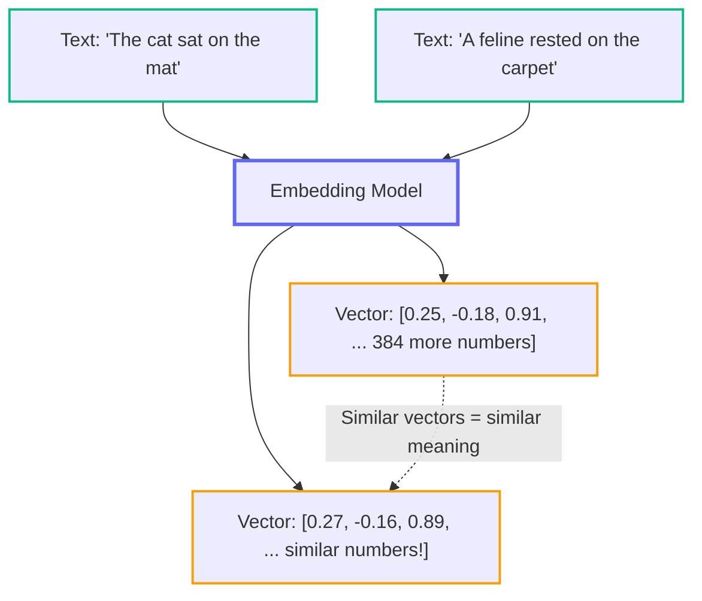
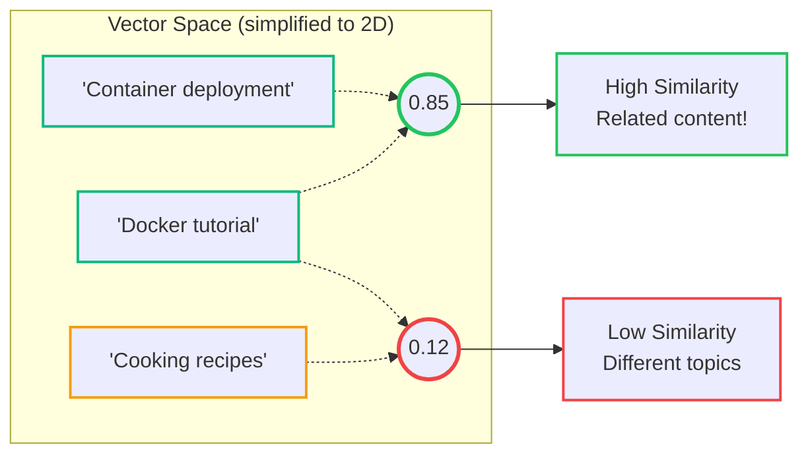
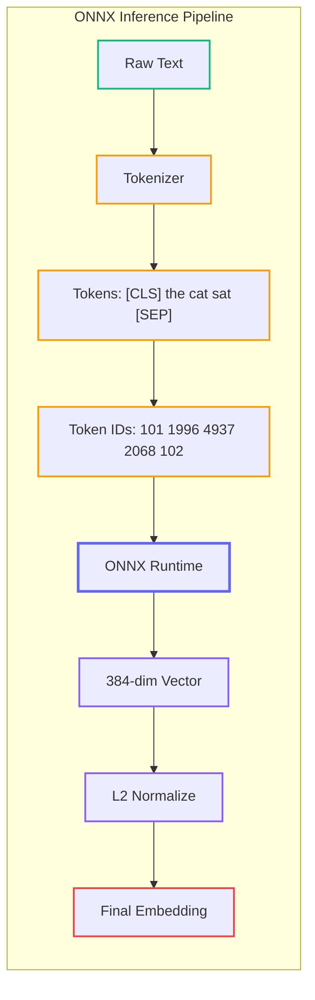
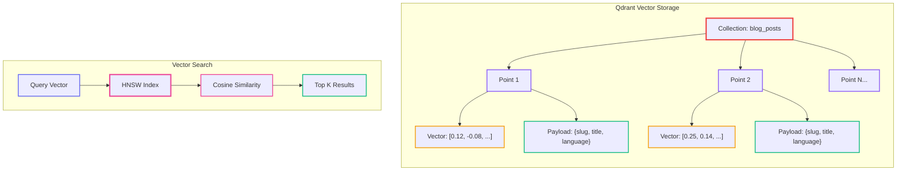
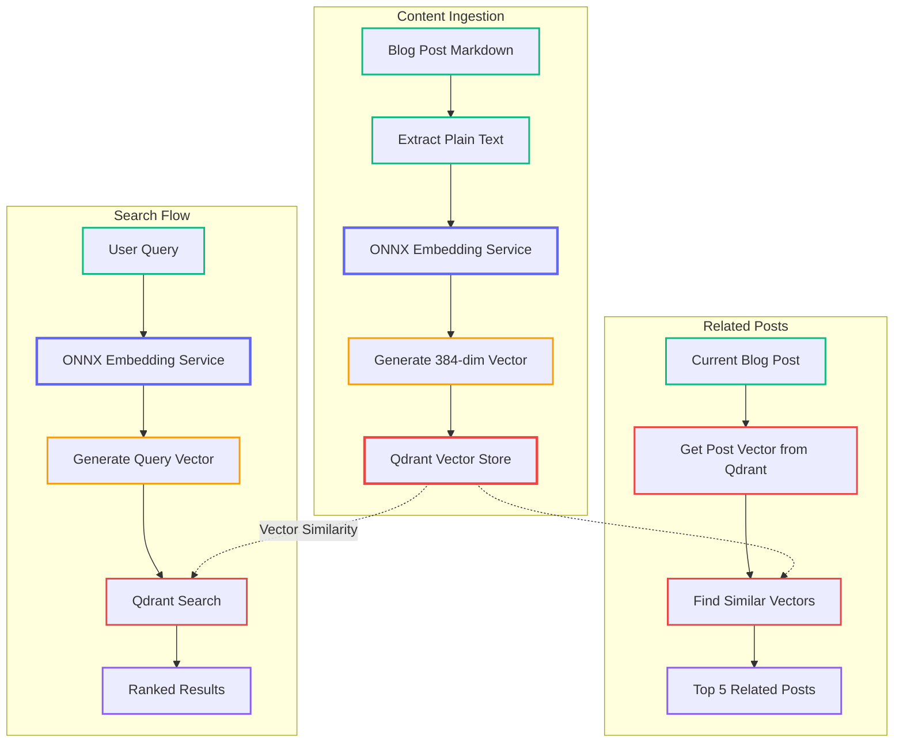

# RAG for Implementers: CPU-Friendly Semantic Search with ONNX and Qdrant

<datetime class="hidden">2025-11-25T11:00</datetime>
<!-- category -- ASP.NET, Semantic Search, ONNX, Qdrant, Machine Learning, Vector Search, RAG, AI-Article -->

# Introduction

**📖 Part of the RAG Series:** This is Part 4a - core implementation:
- [Part 1: RAG Origins and Fundamentals](/blog/rag-primer) - What embeddings are, why they matter
- [Part 2: RAG Architecture and Internals](/blog/rag-architecture) - Chunking, tokenisation, vector databases
- [Part 3: RAG in Practice](/blog/rag-practical-applications) - Building complete RAG systems
- **Part 4a: ONNX & Qdrant Implementation** (this article) - CPU-friendly semantic search foundation
- [Part 4b: Semantic Search in Action](/blog/semantic-search-in-action) - Typeahead, hybrid search, and UI components
- [Part 5: Hybrid Search & Auto-Indexing](/blog/rag-hybrid-search-and-indexing) - Production integration patterns
- [Part 6: GraphRAG](/blog/graphrag-knowledge-graphs-for-rag) - Knowledge graphs for corpus-level understanding

Parts 1-3 explain *why* semantic search works. This article shows *how* to build the foundation - a **zero-cost, CPU-friendly implementation** using ONNX Runtime and Qdrant. [Part 4b](/blog/semantic-search-in-action) covers the search UI and hybrid search implementation, and [Part 5](/blog/rag-hybrid-search-and-indexing) covers production auto-indexing.

**The Challenge:** Most semantic search solutions require expensive GPU infrastructure or costly managed services. What if you're an indie developer running a blog on a modest VPS?

**The Solution:** A fully functional semantic search system that runs entirely on CPU, using free open-source tools. This is the exact setup running on this blog - zero extra cost beyond existing hosting.

[TOC]

# Core Concepts

These concepts are covered in depth in the [RAG series](/blog/rag-primer), but here's what you need to know for this implementation:

## Embeddings: Text as Numbers

Embeddings are vectors (arrays of numbers) that capture the *meaning* of text. Similar meanings produce similar vectors - that's the magic.



**Key insight:** Texts with similar meanings will have similar vectors (embeddings). This is how we can find "related" content - we're literally measuring the distance between meanings!

### Understanding Cosine Similarity

[Cosine similarity](https://en.wikipedia.org/wiki/Cosine_similarity) measures the angle between two vectors - if they point in similar directions, they're semantically similar:



The formula: `similarity = (A · B) / (||A|| × ||B||)` - but since we L2-normalize our vectors, it simplifies to just the dot product!

## What is ONNX?

[ONNX (Open Neural Network Exchange)](https://onnx.ai/) is an open standard format for machine learning models that allows them to run efficiently across different platforms. Think of it like a universal translator for AI models. The [ONNX Runtime](https://onnxruntime.ai/) is Microsoft's high-performance inference engine that executes these models.

**Why ONNX for our use case:**
- Runs on CPU (no GPU needed!) - see the [ONNX Runtime CPU execution provider docs](https://onnxruntime.ai/docs/execution-providers/CPU-Execution-Provider.html)
- Much faster than running models in Python
- Smaller memory footprint
- Integrates seamlessly with .NET via [Microsoft.ML.OnnxRuntime NuGet package](https://www.nuget.org/packages/Microsoft.ML.OnnxRuntime)
- Supports [graph optimizations](https://onnxruntime.ai/docs/performance/model-optimizations/graph-optimizations.html) for faster inference



## What is Qdrant?

[Qdrant](https://qdrant.tech/) is an open-source vector database - basically a database optimized for storing and searching these embedding vectors. For a deep dive into Qdrant's concepts, configuration, and C# integration, see [Self-Hosted Vector Databases with Qdrant](/blog/self-hosted-vector-databases-qdrant). While you *could* store vectors in PostgreSQL, Qdrant is purpose-built for this and offers:

- Lightning-fast similarity search using [HNSW algorithm](https://qdrant.tech/documentation/concepts/indexing/#vector-index)
- [Metadata filtering](https://qdrant.tech/documentation/concepts/filtering/) - filter results by payload fields
- Scalability to millions of vectors with [distributed deployment](https://qdrant.tech/documentation/guides/distributed_deployment/)
- Low resource usage - runs comfortably on modest hardware
- Self-hostable with Docker - see the [Qdrant Docker quickstart](https://qdrant.tech/documentation/quick-start/)
- [gRPC and REST APIs](https://qdrant.tech/documentation/interfaces/) for integration
- Native .NET support via [Qdrant.Client NuGet package](https://www.nuget.org/packages/Qdrant.Client)



# Architecture Overview

Here's how our semantic search system fits together:



**The flow in plain English:**

1. **Indexing**: When you write a blog post, we convert it to a vector and store it in Qdrant
2. **Searching**: When someone searches, we convert their query to a vector and find similar vectors in Qdrant
3. **Related Posts**: For any blog post, we can find other posts with similar vectors

# Project Structure

We've created a clean, modular structure:

```
Mostlylucid.SemanticSearch/
├── Config/
│   └── SemanticSearchConfig.cs      # Configuration settings
├── Models/
│   ├── BlogPostDocument.cs          # Document model for indexing
│   └── SearchResult.cs               # Search result model
├── Services/
│   ├── IEmbeddingService.cs         # Embedding interface
│   ├── OnnxEmbeddingService.cs      # ONNX-based embeddings
│   ├── IVectorStoreService.cs       # Vector store interface
│   ├── QdrantVectorStoreService.cs  # Qdrant implementation
│   ├── ISemanticSearchService.cs    # High-level search interface
│   └── SemanticSearchService.cs     # Orchestration service
├── Extensions/
│   └── ServiceCollectionExtensions.cs  # DI registration
├── download-models.sh               # Model download script
└── README.md
```

# Implementation

## Step 1: Setting Up the Project

First, create the new class library:

```bash
dotnet new classlib -n Mostlylucid.SemanticSearch -f net9.0
dotnet sln add Mostlylucid.SemanticSearch
```

Add the necessary NuGet packages:

```bash
cd Mostlylucid.SemanticSearch
dotnet add package Microsoft.Extensions.Logging.Abstractions
dotnet add package Microsoft.ML.OnnxRuntime --version 1.21.1
dotnet add package Qdrant.Client --version 1.14.0
dotnet add reference ../Mostlylucid.Shared/Mostlylucid.Shared.csproj
```

## Step 2: Configuration

Let's set up our configuration class. We're using the `IConfigSection` pattern that's used throughout Mostlylucid:

```csharp
using Mostlylucid.Shared.Config;

namespace Mostlylucid.SemanticSearch.Config;

/// <summary>
/// Configuration for semantic search functionality
/// </summary>
public class SemanticSearchConfig : IConfigSection
{
    public static string Section => "SemanticSearch";

    /// <summary>
    /// Enable or disable semantic search
    /// </summary>
    public bool Enabled { get; set; } = true;

    /// <summary>
    /// Qdrant server URL (e.g., http://localhost:6333)
    /// </summary>
    public string QdrantUrl { get; set; } = "http://localhost:6333";

    /// <summary>
    /// Optional read-only API key for Qdrant (used for search operations)
    /// </summary>
    public string? ReadApiKey { get; set; }

    /// <summary>
    /// Optional read-write API key for Qdrant (used for indexing operations)
    /// </summary>
    public string? WriteApiKey { get; set; }

    /// <summary>
    /// Collection name in Qdrant for blog posts
    /// </summary>
    public string CollectionName { get; set; } = "blog_posts";

    /// <summary>
    /// Path to the ONNX embedding model file
    /// </summary>
    public string EmbeddingModelPath { get; set; } = "models/all-MiniLM-L6-v2.onnx";

    /// <summary>
    /// Path to the tokenizer vocabulary file
    /// </summary>
    public string VocabPath { get; set; } = "models/vocab.txt";

    /// <summary>
    /// Embedding vector size (384 for all-MiniLM-L6-v2)
    /// </summary>
    public int VectorSize { get; set; } = 384;

    /// <summary>
    /// Number of related posts to return
    /// </summary>
    public int RelatedPostsCount { get; set; } = 5;

    /// <summary>
    /// Minimum similarity score (0-1) for related posts
    /// </summary>
    public float MinimumSimilarityScore { get; set; } = 0.5f;

    /// <summary>
    /// Number of search results to return
    /// </summary>
    public int SearchResultsCount { get; set; } = 10;
}
```

**Why separate API keys?** Security! Your read key can be used in public-facing search endpoints, while your write key stays server-side for admin operations only.

Add this to your `appsettings.json`:

```json
{
  "SemanticSearch": {
    "Enabled": false,
    "QdrantUrl": "http://localhost:6333",
    "ReadApiKey": "",
    "WriteApiKey": "",
    "CollectionName": "blog_posts",
    "EmbeddingModelPath": "models/all-MiniLM-L6-v2.onnx",
    "VocabPath": "models/vocab.txt",
    "VectorSize": 384,
    "RelatedPostsCount": 5,
    "MinimumSimilarityScore": 0.5,
    "SearchResultsCount": 10
  }
}
```

## Step 3: The ONNX Embedding Service

This is where the magic happens. We're using the all-MiniLM-L6-v2 model, which is specifically designed for semantic similarity tasks and runs efficiently on CPU.

**Why this model?**
- Small size (~90MB)
- Fast inference on CPU (~50-100ms per embedding)
- Good quality embeddings (384 dimensions)
- Trained on over 1 billion sentence pairs

Here's the complete implementation:

```csharp
using Microsoft.Extensions.Logging;
using Microsoft.ML.OnnxRuntime;
using Microsoft.ML.OnnxRuntime.Tensors;
using Mostlylucid.SemanticSearch.Config;
using System.Text.RegularExpressions;

namespace Mostlylucid.SemanticSearch.Services;

public class OnnxEmbeddingService : IEmbeddingService, IDisposable
{
    private readonly ILogger<OnnxEmbeddingService> _logger;
    private readonly SemanticSearchConfig _config;
    private readonly InferenceSession? _session;
    private readonly Dictionary<string, int> _vocabulary;
    private readonly SemaphoreSlim _semaphore = new(1, 1);
    private bool _disposed;

    private const int MaxSequenceLength = 256;
    private const string PadToken = "[PAD]";
    private const string UnkToken = "[UNK]";
    private const string ClsToken = "[CLS]";
    private const string SepToken = "[SEP]";

    public OnnxEmbeddingService(
        ILogger<OnnxEmbeddingService> logger,
        SemanticSearchConfig config)
    {
        _logger = logger;
        _config = config;
        _vocabulary = new Dictionary<string, int>();

        if (!_config.Enabled)
        {
            _logger.LogInformation("Semantic search is disabled");
            return;
        }

        try
        {
            // Check if model file exists
            if (!File.Exists(_config.EmbeddingModelPath))
            {
                _logger.LogWarning("Embedding model not found at {Path}. Semantic search will be disabled.",
                    _config.EmbeddingModelPath);
                return;
            }

            // Load vocabulary if it exists
            if (File.Exists(_config.VocabPath))
            {
                LoadVocabulary(_config.VocabPath);
            }

            // Create ONNX session with CPU execution provider
            var sessionOptions = new SessionOptions
            {
                ExecutionMode = ExecutionMode.ORT_SEQUENTIAL,
                GraphOptimizationLevel = GraphOptimizationLevel.ORT_ENABLE_ALL
            };

            _session = new InferenceSession(_config.EmbeddingModelPath, sessionOptions);
            _logger.LogInformation("ONNX embedding model loaded successfully from {Path}",
                _config.EmbeddingModelPath);
        }
        catch (Exception ex)
        {
            _logger.LogError(ex, "Failed to initialize ONNX embedding service");
        }
    }

    private void LoadVocabulary(string vocabPath)
    {
        var lines = File.ReadAllLines(vocabPath);
        for (int i = 0; i < lines.Length; i++)
        {
            var token = lines[i].Trim();
            if (!string.IsNullOrEmpty(token))
            {
                _vocabulary[token] = i;
            }
        }
        _logger.LogInformation("Loaded vocabulary with {Count} tokens", _vocabulary.Count);
    }

    public async Task<float[]> GenerateEmbeddingAsync(string text, CancellationToken cancellationToken = default)
    {
        if (_session == null || !_config.Enabled)
        {
            return new float[_config.VectorSize];
        }

        if (string.IsNullOrWhiteSpace(text))
        {
            return new float[_config.VectorSize];
        }

        // Use semaphore to prevent concurrent ONNX inference (not thread-safe)
        await _semaphore.WaitAsync(cancellationToken);
        try
        {
            return await Task.Run(() => GenerateEmbedding(text), cancellationToken);
        }
        finally
        {
            _semaphore.Release();
        }
    }

    private float[] GenerateEmbedding(string text)
    {
        try
        {
            // Tokenize the input text
            var tokens = Tokenize(text);

            // Create input tensors for ONNX model
            var inputIds = CreateInputTensor(tokens, "input_ids");
            var attentionMask = CreateAttentionMaskTensor(tokens.Length);
            var tokenTypeIds = CreateTokenTypeIdsTensor(tokens.Length);

            // Run inference
            var inputs = new List<NamedOnnxValue>
            {
                NamedOnnxValue.CreateFromTensor("input_ids", inputIds),
                NamedOnnxValue.CreateFromTensor("attention_mask", attentionMask),
                NamedOnnxValue.CreateFromTensor("token_type_ids", tokenTypeIds)
            };

            using var results = _session!.Run(inputs);

            // Extract the output tensor (sentence embedding)
            var output = results.First().AsTensor<float>();
            var embedding = output.ToArray();

            // Normalize the vector (L2 normalization)
            return NormalizeVector(embedding);
        }
        catch (Exception ex)
        {
            _logger.LogError(ex, "Error generating embedding for text: {Text}",
                text[..Math.Min(100, text.Length)]);
            return new float[_config.VectorSize];
        }
    }

    private List<int> Tokenize(string text)
    {
        // Simple whitespace + punctuation tokenization
        var tokens = new List<int>();

        // Add [CLS] token at the start
        if (_vocabulary.TryGetValue(ClsToken, out var clsId))
            tokens.Add(clsId);

        // Tokenize the text
        var words = Regex.Split(text.ToLowerInvariant(), @"(\W+)")
            .Where(w => !string.IsNullOrWhiteSpace(w))
            .Take(MaxSequenceLength - 2); // Leave room for [CLS] and [SEP]

        foreach (var word in words)
        {
            if (_vocabulary.Count > 0)
            {
                if (_vocabulary.TryGetValue(word, out var tokenId))
                    tokens.Add(tokenId);
                else if (_vocabulary.TryGetValue(UnkToken, out var unkId))
                    tokens.Add(unkId);
            }
            else
            {
                // Fallback: use hash code as token ID
                tokens.Add(Math.Abs(word.GetHashCode()) % 30000);
            }
        }

        // Add [SEP] token at the end
        if (_vocabulary.TryGetValue(SepToken, out var sepId))
            tokens.Add(sepId);

        return tokens;
    }

    private Tensor<long> CreateInputTensor(List<int> tokens, string name)
    {
        var length = Math.Min(tokens.Count, MaxSequenceLength);
        var tensorData = new long[1, MaxSequenceLength];

        for (int i = 0; i < length; i++)
        {
            tensorData[0, i] = tokens[i];
        }

        // Pad the rest
        var padId = _vocabulary.TryGetValue(PadToken, out var id) ? id : 0;
        for (int i = length; i < MaxSequenceLength; i++)
        {
            tensorData[0, i] = padId;
        }

        return new DenseTensor<long>(tensorData, new[] { 1, MaxSequenceLength });
    }

    private Tensor<long> CreateAttentionMaskTensor(int actualLength)
    {
        var length = Math.Min(actualLength, MaxSequenceLength);
        var tensorData = new long[1, MaxSequenceLength];

        for (int i = 0; i < length; i++)
        {
            tensorData[0, i] = 1; // Attend to actual tokens
        }

        return new DenseTensor<long>(tensorData, new[] { 1, MaxSequenceLength });
    }

    private Tensor<long> CreateTokenTypeIdsTensor(int actualLength)
    {
        var tensorData = new long[1, MaxSequenceLength];
        // All zeros for single sentence
        return new DenseTensor<long>(tensorData, new[] { 1, MaxSequenceLength });
    }

    private float[] NormalizeVector(float[] vector)
    {
        // L2 normalization
        var sumOfSquares = vector.Sum(v => v * v);
        var magnitude = MathF.Sqrt(sumOfSquares);

        if (magnitude > 0)
        {
            for (int i = 0; i < vector.Length; i++)
            {
                vector[i] /= magnitude;
            }
        }

        return vector;
    }

    public void Dispose()
    {
        if (_disposed) return;

        _session?.Dispose();
        _semaphore?.Dispose();
        _disposed = true;

        GC.SuppressFinalize(this);
    }
}
```

**Key points for junior devs:**

1. **Tokenization**: We're breaking text into smaller pieces (tokens) that the model can understand
2. **Tensors**: These are multi-dimensional arrays that ONNX models work with
3. **Attention Mask**: Tells the model which parts of the input are actual content vs. padding
4. **L2 Normalization**: Makes all vectors have the same "length", so we can compare them fairly
5. **Semaphore**: Ensures thread safety (ONNX isn't thread-safe by default)

## Step 4: Qdrant Vector Store

Now let's implement the vector storage and search:

```csharp
using Microsoft.Extensions.Logging;
using Mostlylucid.SemanticSearch.Config;
using Mostlylucid.SemanticSearch.Models;
using Qdrant.Client;
using Qdrant.Client.Grpc;

namespace Mostlylucid.SemanticSearch.Services;

public class QdrantVectorStoreService : IVectorStoreService
{
    private readonly ILogger<QdrantVectorStoreService> _logger;
    private readonly SemanticSearchConfig _config;
    private readonly QdrantClient? _client;
    private bool _collectionInitialized;

    public QdrantVectorStoreService(
        ILogger<QdrantVectorStoreService> logger,
        SemanticSearchConfig config)
    {
        _logger = logger;
        _config = config;

        if (!_config.Enabled)
        {
            _logger.LogInformation("Semantic search is disabled");
            return;
        }

        try
        {
            var uri = new Uri(_config.QdrantUrl);
            var host = uri.Host;
            var port = uri.Port > 0 ? uri.Port : 6334; // Default gRPC port

            _client = new QdrantClient(host, port, https: uri.Scheme == "https");
            _logger.LogInformation("Connected to Qdrant at {Host}:{Port}", host, port);
        }
        catch (Exception ex)
        {
            _logger.LogError(ex, "Failed to connect to Qdrant at {Url}", _config.QdrantUrl);
        }
    }

    public async Task InitializeCollectionAsync(CancellationToken cancellationToken = default)
    {
        if (_client == null || !_config.Enabled || _collectionInitialized)
            return;

        try
        {
            var collections = await _client.ListCollectionsAsync(cancellationToken);
            var collectionExists = collections.Any(c => c.Name == _config.CollectionName);

            if (!collectionExists)
            {
                _logger.LogInformation("Creating collection {CollectionName}", _config.CollectionName);

                await _client.CreateCollectionAsync(
                    collectionName: _config.CollectionName,
                    vectorsConfig: new VectorParams
                    {
                        Size = (ulong)_config.VectorSize,
                        Distance = Distance.Cosine // Cosine similarity for semantic search
                    },
                    cancellationToken: cancellationToken
                );

                _logger.LogInformation("Collection {CollectionName} created successfully", _config.CollectionName);
            }

            _collectionInitialized = true;
        }
        catch (Exception ex)
        {
            _logger.LogError(ex, "Failed to initialize collection {CollectionName}", _config.CollectionName);
            throw;
        }
    }

    public async Task<List<SearchResult>> FindRelatedPostsAsync(
        string slug,
        string language,
        int limit = 5,
        CancellationToken cancellationToken = default)
    {
        if (_client == null || !_config.Enabled)
            return new List<SearchResult>();

        try
        {
            // Find the document by slug and language
            var scrollResults = await _client.ScrollAsync(
                collectionName: _config.CollectionName,
                filter: new Filter
                {
                    Must =
                    {
                        new Condition
                        {
                            Field = new FieldCondition
                            {
                                Key = "slug",
                                Match = new Match { Keyword = slug }
                            }
                        },
                        new Condition
                        {
                            Field = new FieldCondition
                            {
                                Key = "language",
                                Match = new Match { Keyword = language }
                            }
                        }
                    }
                },
                limit: 1,
                cancellationToken: cancellationToken
            );

            var point = scrollResults.FirstOrDefault();
            if (point == null)
            {
                _logger.LogWarning("Post {Slug} ({Language}) not found in vector store", slug, language);
                return new List<SearchResult>();
            }

            // Use the document's vector to find similar posts
            var searchResults = await _client.SearchAsync(
                collectionName: _config.CollectionName,
                vector: point.Vectors.Vector.Data.ToArray(),
                limit: (ulong)(limit + 1), // +1 because the first result will be the post itself
                scoreThreshold: _config.MinimumSimilarityScore,
                cancellationToken: cancellationToken
            );

            // Filter out the original post and return top N similar posts
            return searchResults
                .Where(r => r.Payload["slug"].StringValue != slug || r.Payload["language"].StringValue != language)
                .Take(limit)
                .Select(result => new SearchResult
                {
                    Slug = result.Payload["slug"].StringValue,
                    Title = result.Payload["title"].StringValue,
                    Language = result.Payload["language"].StringValue,
                    Categories = result.Payload.TryGetValue("categories", out var cats)
                        ? cats.ListValue.Values.Select(v => v.StringValue).ToList()
                        : new List<string>(),
                    Score = result.Score,
                    PublishedDate = DateTime.Parse(result.Payload["published_date"].StringValue)
                })
                .ToList();
        }
        catch (Exception ex)
        {
            _logger.LogError(ex, "Failed to find related posts for {Slug} ({Language})", slug, language);
            return new List<SearchResult>();
        }
    }

    // ... Additional methods for IndexDocument, Search, Delete, etc.
}
```

**What's happening here:**

1. **Cosine Distance**: We're using cosine similarity, which is perfect for comparing normalized vectors
2. **Metadata Storage**: Qdrant lets us store extra data (payload) alongside vectors
3. **Filtering**: We can filter results by metadata before comparing vectors
4. **Score Threshold**: Only return results above a certain similarity score

## Step 5: The Orchestration Service

This high-level service ties everything together:

```csharp
using Microsoft.Extensions.Logging;
using Mostlylucid.SemanticSearch.Config;
using Mostlylucid.SemanticSearch.Models;
using System.Security.Cryptography;
using System.Text;

namespace Mostlylucid.SemanticSearch.Services;

public class SemanticSearchService : ISemanticSearchService
{
    private readonly ILogger<SemanticSearchService> _logger;
    private readonly SemanticSearchConfig _config;
    private readonly IEmbeddingService _embeddingService;
    private readonly IVectorStoreService _vectorStoreService;

    public SemanticSearchService(
        ILogger<SemanticSearchService> logger,
        SemanticSearchConfig config,
        IEmbeddingService embeddingService,
        IVectorStoreService vectorStoreService)
    {
        _logger = logger;
        _config = config;
        _embeddingService = embeddingService;
        _vectorStoreService = vectorStoreService;
    }

    public async Task IndexPostAsync(BlogPostDocument document, CancellationToken cancellationToken = default)
    {
        if (!_config.Enabled)
            return;

        try
        {
            // Prepare text for embedding: combine title and content
            // We give more weight to the title by including it twice
            var textToEmbed = $"{document.Title}. {document.Title}. {document.Content}";

            // Truncate to reasonable length (embedding models have token limits)
            const int maxLength = 2000;
            if (textToEmbed.Length > maxLength)
            {
                textToEmbed = textToEmbed[..maxLength];
            }

            // Generate embedding
            var embedding = await _embeddingService.GenerateEmbeddingAsync(textToEmbed, cancellationToken);

            // Compute content hash if not provided
            if (string.IsNullOrEmpty(document.ContentHash))
            {
                document.ContentHash = ComputeContentHash(document.Content);
            }

            // Store in vector database
            await _vectorStoreService.IndexDocumentAsync(document, embedding, cancellationToken);

            _logger.LogInformation("Indexed post {Slug} ({Language})", document.Slug, document.Language);
        }
        catch (Exception ex)
        {
            _logger.LogError(ex, "Failed to index post {Slug} ({Language})", document.Slug, document.Language);
        }
    }

    public async Task<List<SearchResult>> SearchAsync(
        string query,
        int limit = 10,
        CancellationToken cancellationToken = default)
    {
        if (!_config.Enabled || string.IsNullOrWhiteSpace(query))
            return new List<SearchResult>();

        try
        {
            // Generate embedding for the search query
            var queryEmbedding = await _embeddingService.GenerateEmbeddingAsync(query, cancellationToken);

            // Search in vector store
            var results = await _vectorStoreService.SearchAsync(
                queryEmbedding,
                Math.Min(limit, _config.SearchResultsCount),
                _config.MinimumSimilarityScore,
                cancellationToken);

            _logger.LogDebug("Search for '{Query}' returned {Count} results", query, results.Count);

            return results;
        }
        catch (Exception ex)
        {
            _logger.LogError(ex, "Search failed for query '{Query}'", query);
            return new List<SearchResult>();
        }
    }

    public async Task<List<SearchResult>> GetRelatedPostsAsync(
        string slug,
        string language,
        int limit = 5,
        CancellationToken cancellationToken = default)
    {
        if (!_config.Enabled)
            return new List<SearchResult>();

        try
        {
            var results = await _vectorStoreService.FindRelatedPostsAsync(
                slug,
                language,
                Math.Min(limit, _config.RelatedPostsCount),
                cancellationToken);

            _logger.LogDebug("Found {Count} related posts for {Slug} ({Language})",
                results.Count, slug, language);

            return results;
        }
        catch (Exception ex)
        {
            _logger.LogError(ex, "Failed to get related posts for {Slug} ({Language})", slug, language);
            return new List<SearchResult>();
        }
    }

    private string ComputeContentHash(string content)
    {
        using var sha256 = SHA256.Create();
        var bytes = Encoding.UTF8.GetBytes(content);
        var hashBytes = sha256.ComputeHash(bytes);
        return Convert.ToBase64String(hashBytes);
    }
}
```

## Step 6: Dependency Injection Setup

Register everything in the DI container:

```csharp
using Microsoft.Extensions.Configuration;
using Microsoft.Extensions.DependencyInjection;
using Mostlylucid.SemanticSearch.Config;
using Mostlylucid.SemanticSearch.Services;
using Mostlylucid.Shared.Config;

namespace Mostlylucid.SemanticSearch.Extensions;

public static class ServiceCollectionExtensions
{
    public static void AddSemanticSearch(
        this IServiceCollection services,
        IConfiguration configuration)
    {
        // Bind configuration using POCO pattern
        services.ConfigurePOCO<SemanticSearchConfig>(
            configuration.GetSection(SemanticSearchConfig.Section));

        // Register services as singletons for efficiency
        services.AddSingleton<IEmbeddingService, OnnxEmbeddingService>();
        services.AddSingleton<IVectorStoreService, QdrantVectorStoreService>();
        services.AddSingleton<ISemanticSearchService, SemanticSearchService>();
    }
}
```

In your `Program.cs`:

```csharp
using Mostlylucid.SemanticSearch.Extensions;
using Mostlylucid.SemanticSearch.Services;

// Add services
services.AddSemanticSearch(config);

// Initialize after building the app
using (var scope = app.Services.CreateScope())
{
    var semanticSearch = scope.ServiceProvider.GetRequiredService<ISemanticSearchService>();
    await semanticSearch.InitializeAsync();
}
```

# Setting Up Infrastructure

## Docker Compose for Qdrant

Create a separate docker-compose file for semantic search services:

```yaml
version: '3.8'

services:
  qdrant:
    image: qdrant/qdrant:latest
    container_name: mostlylucid-qdrant
    restart: unless-stopped
    ports:
      - "6333:6333"  # HTTP API
      - "6334:6334"  # gRPC API
    volumes:
      - qdrant_storage:/qdrant/storage
    environment:
      - QDRANT__SERVICE__HTTP_PORT=6333
      - QDRANT__SERVICE__GRPC_PORT=6334
    networks:
      - mostlylucid_network
    healthcheck:
      test: ["CMD", "curl", "-f", "http://localhost:6333/health"]
      interval: 30s
      timeout: 10s
      retries: 3
      start_period: 40s

volumes:
  qdrant_storage:
    driver: local

networks:
  mostlylucid_network:
    name: mostlylucidweb_app_network
    external: true
```

Start it with:

```bash
docker-compose -f semantic-search-docker-compose.yml up -d
```

## Download the Embedding Model

We're using the [all-MiniLM-L6-v2](https://huggingface.co/sentence-transformers/all-MiniLM-L6-v2) model from Hugging Face's [Sentence Transformers](https://www.sbert.net/) library. This model is specifically trained on semantic similarity tasks and produces 384-dimensional embeddings.

### Automatic Download (Recommended)

The service automatically downloads the model from Hugging Face on first run if it doesn't exist:

```csharp
// In OnnxEmbeddingService.cs
private const string ModelUrl = "https://huggingface.co/sentence-transformers/all-MiniLM-L6-v2/resolve/main/onnx/model.onnx";
private const string VocabUrl = "https://huggingface.co/sentence-transformers/all-MiniLM-L6-v2/resolve/main/vocab.txt";

public async Task EnsureInitializedAsync(CancellationToken cancellationToken = default)
{
    if (_initialized || !_config.Enabled) return;

    // Download model if not exists
    if (!File.Exists(_config.EmbeddingModelPath))
    {
        _logger.LogInformation("Downloading ONNX embedding model to {Path}...", _config.EmbeddingModelPath);
        await DownloadFileAsync(ModelUrl, _config.EmbeddingModelPath, cancellationToken);
    }

    // Download vocab if not exists
    if (!File.Exists(_config.VocabPath))
    {
        _logger.LogInformation("Downloading vocabulary file to {Path}...", _config.VocabPath);
        await DownloadFileAsync(VocabUrl, _config.VocabPath, cancellationToken);
    }

    // Initialize ONNX session...
}
```

This is particularly useful when deploying with Docker - you can map a volume for the models directory:

```yaml
volumes:
  - ./mlmodels:/app/mlmodels  # Model persists across container restarts
```

### Manual Download

Alternatively, you can download manually:

```bash
chmod +x Mostlylucid.SemanticSearch/download-models.sh
./Mostlylucid.SemanticSearch/download-models.sh
```

Or directly from Hugging Face:

```bash
mkdir -p mlmodels
curl -L https://huggingface.co/sentence-transformers/all-MiniLM-L6-v2/resolve/main/onnx/model.onnx -o mlmodels/all-MiniLM-L6-v2.onnx
curl -L https://huggingface.co/sentence-transformers/all-MiniLM-L6-v2/resolve/main/vocab.txt -o mlmodels/vocab.txt
```

This downloads:
- `all-MiniLM-L6-v2.onnx` (~90MB) - The [ONNX-exported embedding model](https://huggingface.co/sentence-transformers/all-MiniLM-L6-v2/tree/main/onnx)
- `vocab.txt` (~230KB) - The [WordPiece tokenizer vocabulary](https://huggingface.co/sentence-transformers/all-MiniLM-L6-v2/blob/main/vocab.txt)

# Performance Considerations

## Embedding Generation

- **CPU Performance**: ~50-100ms per embedding on a modern CPU
- **Optimization**: We use a semaphore to prevent concurrent ONNX inference
- **Batching**: For bulk indexing, process posts in batches of 10-20

## Vector Search

- **Search Speed**: <10ms for collections up to 100K vectors
- **Memory Usage**: ~1KB per vector (with metadata)
- **Scalability**: Qdrant can handle millions of vectors on modest hardware

## Caching Strategy

We use ASP.NET Core output caching:

```csharp
[OutputCache(Duration = 7200, VaryByRouteValueNames = new[] {"slug", "language"})]
```

This caches related posts for 2 hours, significantly reducing load.

# What We've Built

At this point you have a complete, working semantic search foundation:

- ✅ **ONNX embeddings** - CPU-friendly, auto-downloads from Hugging Face
- ✅ **Qdrant vector storage** - Fast similarity search with metadata filtering
- ✅ **Related posts** - Find semantically similar content
- ✅ **Search API** - Natural language queries
- ✅ **Content indexing** - Store blog posts as vectors

**This is the exact setup running on this blog** - zero GPU, zero additional cost.

# Next: Semantic Search in Action

In [Part 4b: Semantic Search in Action](/blog/semantic-search-in-action), we cover:

- **Typeahead Search** - How the search-as-you-type works with Alpine.js
- **Hybrid Search** - Combining semantic + PostgreSQL full-text with Reciprocal Rank Fusion
- **Search API** - Complete API documentation with filters
- **Related Posts UI** - DaisyUI components with HTMX lazy loading
- **Advanced Filters** - Language and date range filtering

**Continue to [Part 4b](/blog/semantic-search-in-action) for the search UI and hybrid search implementation.**

Then [Part 5: Hybrid Search & Auto-Indexing](/blog/rag-hybrid-search-and-indexing) covers production integration patterns.

# Resources

## ONNX Documentation
- [ONNX Official Site](https://onnx.ai/) - The open standard for ML models
- [ONNX Runtime](https://onnxruntime.ai/) - Microsoft's high-performance inference engine
- [ONNX Runtime .NET API](https://onnxruntime.ai/docs/api/csharp-api.html) - C# API docs
- [ONNX Runtime Performance](https://onnxruntime.ai/docs/performance/tune-performance/threading.html) - Optimization guide

## Qdrant Documentation
- [Self-Hosted Vector Databases with Qdrant](/blog/self-hosted-vector-databases-qdrant) - Deep dive into Qdrant concepts and C# client
- [Qdrant Official Docs](https://qdrant.tech/documentation/) - Main documentation hub
- [Qdrant Quick Start](https://qdrant.tech/documentation/quick-start/) - Getting started
- [Qdrant Vector Indexing](https://qdrant.tech/documentation/concepts/indexing/#vector-index) - HNSW algorithm
- [Qdrant .NET Client](https://github.com/qdrant/qdrant-dotnet) - Official .NET SDK

## Embedding Models
- [all-MiniLM-L6-v2](https://huggingface.co/sentence-transformers/all-MiniLM-L6-v2) - The model we use
- [Sentence Transformers](https://www.sbert.net/) - Semantic embeddings library

## Complete Code
All code available at: [github.com/scottgal/mostlylucidweb](https://github.com/scottgal/mostlylucidweb)
- `Mostlylucid.SemanticSearch/` - Core semantic search library
