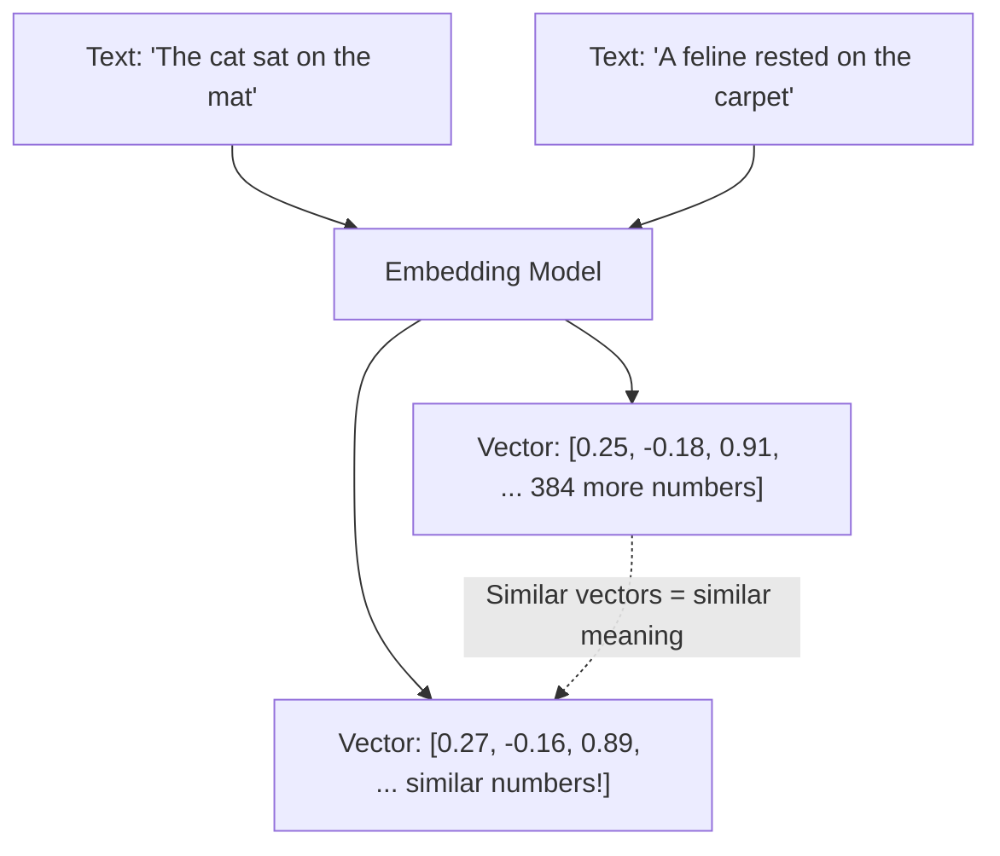
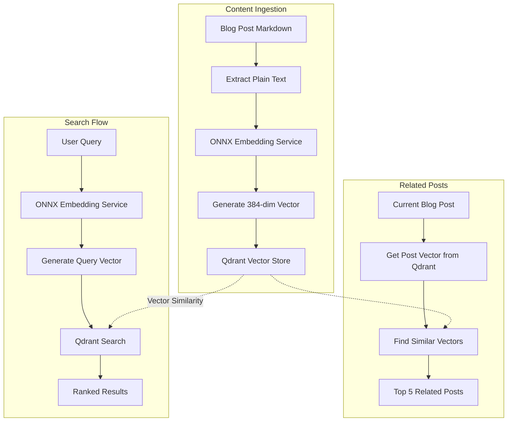
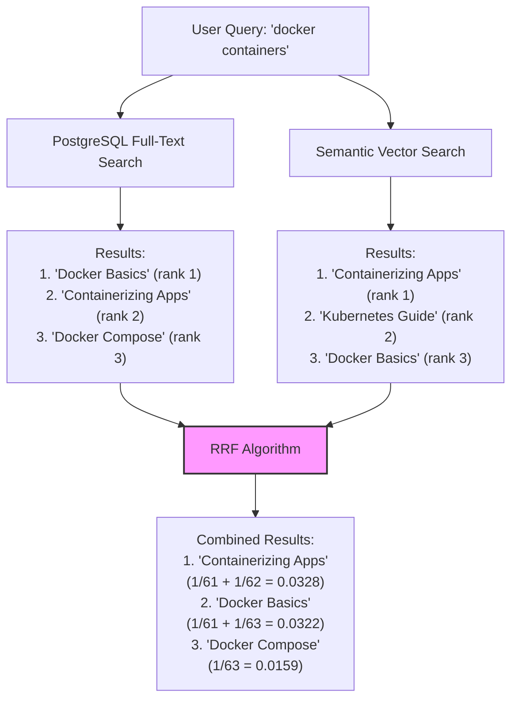

# Building CPU-Friendly Semantic Search with ONNX Embeddings and Qdrant

<datetime class="hidden">2025-01-20T10:00</datetime>
<!-- category -- ASP.NET, Semantic Search, ONNX, Qdrant, Machine Learning, Vector Search -->

# Introduction

Semantic search is one of those technologies that seems magical when it works well. Unlike traditional keyword search that looks for exact word matches, semantic search understands the *meaning* behind your text. This means when someone searches for "debugging techniques", they'll also find your posts about "troubleshooting methods" or "finding bugs" - even if those exact words don't appear in the original query.

This article covers the practical implementation of semantic search - the "retrieval" part of Retrieval-Augmented Generation (RAG). If you're new to RAG or want to understand the broader context of how semantic search fits into modern AI systems, check out my [RAG Primer](/blog/rag-primer) first.

**The Challenge:** Most semantic search solutions require expensive GPU infrastructure or costly managed services. What if you're an indie developer running a blog on a modest VPS? What if you don't have a GPU? What if you want to keep costs down while still providing an excellent search experience?

**The Solution:** In this post, I'll show you how to build a fully functional semantic search system that runs entirely on CPU, using free open-source tools. We'll use ONNX Runtime for efficient embeddings, Qdrant as our vector database, and integrate everything into ASP.NET Core with a slick DaisyUI interface.

This is the exact setup I'm using on this blog - it costs me nothing extra beyond my existing hosting, and it provides genuinely useful "related posts" suggestions and semantic search capabilities.

[TOC]

# Understanding the Concepts 

Before we dive into code, let's make sure we understand the key concepts. If you're new to semantic search or vector databases, this section is for you!

## What are Embeddings?

Think of embeddings as coordinates in a multi-dimensional space. Just like you can represent a location on Earth with latitude and longitude (2 dimensions), we can represent the "meaning" of text using hundreds of dimensions.



**Key insight:** Texts with similar meanings will have similar vectors (embeddings). This is how we can find "related" content - we're literally measuring the distance between meanings!

## What is ONNX?

ONNX (Open Neural Network Exchange) is a format for machine learning models that allows them to run efficiently across different platforms. Think of it like a universal translator for AI models.

**Why ONNX for our use case:**
- Runs on CPU (no GPU needed!)
- Much faster than running models in Python
- Smaller memory footprint
- Integrates seamlessly with .NET via Microsoft.ML.OnnxRuntime

## What is Qdrant?

Qdrant is a vector database - basically a database optimized for storing and searching these embedding vectors. While you *could* store vectors in PostgreSQL, Qdrant is purpose-built for this and offers:

- Lightning-fast similarity search
- Metadata filtering
- Scalability to millions of vectors
- Low resource usage
- Self-hostable with Docker

# Architecture Overview

Here's how our semantic search system fits together:



**The flow in plain English:**

1. **Indexing**: When you write a blog post, we convert it to a vector and store it in Qdrant
2. **Searching**: When someone searches, we convert their query to a vector and find similar vectors in Qdrant
3. **Related Posts**: For any blog post, we can find other posts with similar vectors

# Project Structure

We've created a clean, modular structure:

```
Mostlylucid.SemanticSearch/
├── Config/
│   └── SemanticSearchConfig.cs      # Configuration settings
├── Models/
│   ├── BlogPostDocument.cs          # Document model for indexing
│   └── SearchResult.cs               # Search result model
├── Services/
│   ├── IEmbeddingService.cs         # Embedding interface
│   ├── OnnxEmbeddingService.cs      # ONNX-based embeddings
│   ├── IVectorStoreService.cs       # Vector store interface
│   ├── QdrantVectorStoreService.cs  # Qdrant implementation
│   ├── ISemanticSearchService.cs    # High-level search interface
│   └── SemanticSearchService.cs     # Orchestration service
├── Extensions/
│   └── ServiceCollectionExtensions.cs  # DI registration
├── download-models.sh               # Model download script
└── README.md
```

# Implementation

## Step 1: Setting Up the Project

First, create the new class library:

```bash
dotnet new classlib -n Mostlylucid.SemanticSearch -f net9.0
dotnet sln add Mostlylucid.SemanticSearch
```

Add the necessary NuGet packages:

```bash
cd Mostlylucid.SemanticSearch
dotnet add package Microsoft.Extensions.Logging.Abstractions
dotnet add package Microsoft.ML.OnnxRuntime --version 1.21.1
dotnet add package Qdrant.Client --version 1.14.0
dotnet add reference ../Mostlylucid.Shared/Mostlylucid.Shared.csproj
```

## Step 2: Configuration

Let's set up our configuration class. We're using the `IConfigSection` pattern that's used throughout Mostlylucid:

```csharp
using Mostlylucid.Shared.Config;

namespace Mostlylucid.SemanticSearch.Config;

/// <summary>
/// Configuration for semantic search functionality
/// </summary>
public class SemanticSearchConfig : IConfigSection
{
    public static string Section => "SemanticSearch";

    /// <summary>
    /// Enable or disable semantic search
    /// </summary>
    public bool Enabled { get; set; } = true;

    /// <summary>
    /// Qdrant server URL (e.g., http://localhost:6333)
    /// </summary>
    public string QdrantUrl { get; set; } = "http://localhost:6333";

    /// <summary>
    /// Optional read-only API key for Qdrant (used for search operations)
    /// </summary>
    public string? ReadApiKey { get; set; }

    /// <summary>
    /// Optional read-write API key for Qdrant (used for indexing operations)
    /// </summary>
    public string? WriteApiKey { get; set; }

    /// <summary>
    /// Collection name in Qdrant for blog posts
    /// </summary>
    public string CollectionName { get; set; } = "blog_posts";

    /// <summary>
    /// Path to the ONNX embedding model file
    /// </summary>
    public string EmbeddingModelPath { get; set; } = "models/all-MiniLM-L6-v2.onnx";

    /// <summary>
    /// Path to the tokenizer vocabulary file
    /// </summary>
    public string VocabPath { get; set; } = "models/vocab.txt";

    /// <summary>
    /// Embedding vector size (384 for all-MiniLM-L6-v2)
    /// </summary>
    public int VectorSize { get; set; } = 384;

    /// <summary>
    /// Number of related posts to return
    /// </summary>
    public int RelatedPostsCount { get; set; } = 5;

    /// <summary>
    /// Minimum similarity score (0-1) for related posts
    /// </summary>
    public float MinimumSimilarityScore { get; set; } = 0.5f;

    /// <summary>
    /// Number of search results to return
    /// </summary>
    public int SearchResultsCount { get; set; } = 10;
}
```

**Why separate API keys?** Security! Your read key can be used in public-facing search endpoints, while your write key stays server-side for admin operations only.

Add this to your `appsettings.json`:

```json
{
  "SemanticSearch": {
    "Enabled": false,
    "QdrantUrl": "http://localhost:6333",
    "ReadApiKey": "",
    "WriteApiKey": "",
    "CollectionName": "blog_posts",
    "EmbeddingModelPath": "models/all-MiniLM-L6-v2.onnx",
    "VocabPath": "models/vocab.txt",
    "VectorSize": 384,
    "RelatedPostsCount": 5,
    "MinimumSimilarityScore": 0.5,
    "SearchResultsCount": 10
  }
}
```

## Step 3: The ONNX Embedding Service

This is where the magic happens. We're using the all-MiniLM-L6-v2 model, which is specifically designed for semantic similarity tasks and runs efficiently on CPU.

**Why this model?**
- Small size (~90MB)
- Fast inference on CPU (~50-100ms per embedding)
- Good quality embeddings (384 dimensions)
- Trained on over 1 billion sentence pairs

Here's the complete implementation:

```csharp
using Microsoft.Extensions.Logging;
using Microsoft.ML.OnnxRuntime;
using Microsoft.ML.OnnxRuntime.Tensors;
using Mostlylucid.SemanticSearch.Config;
using System.Text.RegularExpressions;

namespace Mostlylucid.SemanticSearch.Services;

public class OnnxEmbeddingService : IEmbeddingService, IDisposable
{
    private readonly ILogger<OnnxEmbeddingService> _logger;
    private readonly SemanticSearchConfig _config;
    private readonly InferenceSession? _session;
    private readonly Dictionary<string, int> _vocabulary;
    private readonly SemaphoreSlim _semaphore = new(1, 1);
    private bool _disposed;

    private const int MaxSequenceLength = 256;
    private const string PadToken = "[PAD]";
    private const string UnkToken = "[UNK]";
    private const string ClsToken = "[CLS]";
    private const string SepToken = "[SEP]";

    public OnnxEmbeddingService(
        ILogger<OnnxEmbeddingService> logger,
        SemanticSearchConfig config)
    {
        _logger = logger;
        _config = config;
        _vocabulary = new Dictionary<string, int>();

        if (!_config.Enabled)
        {
            _logger.LogInformation("Semantic search is disabled");
            return;
        }

        try
        {
            // Check if model file exists
            if (!File.Exists(_config.EmbeddingModelPath))
            {
                _logger.LogWarning("Embedding model not found at {Path}. Semantic search will be disabled.",
                    _config.EmbeddingModelPath);
                return;
            }

            // Load vocabulary if it exists
            if (File.Exists(_config.VocabPath))
            {
                LoadVocabulary(_config.VocabPath);
            }

            // Create ONNX session with CPU execution provider
            var sessionOptions = new SessionOptions
            {
                ExecutionMode = ExecutionMode.ORT_SEQUENTIAL,
                GraphOptimizationLevel = GraphOptimizationLevel.ORT_ENABLE_ALL
            };

            _session = new InferenceSession(_config.EmbeddingModelPath, sessionOptions);
            _logger.LogInformation("ONNX embedding model loaded successfully from {Path}",
                _config.EmbeddingModelPath);
        }
        catch (Exception ex)
        {
            _logger.LogError(ex, "Failed to initialize ONNX embedding service");
        }
    }

    private void LoadVocabulary(string vocabPath)
    {
        var lines = File.ReadAllLines(vocabPath);
        for (int i = 0; i < lines.Length; i++)
        {
            var token = lines[i].Trim();
            if (!string.IsNullOrEmpty(token))
            {
                _vocabulary[token] = i;
            }
        }
        _logger.LogInformation("Loaded vocabulary with {Count} tokens", _vocabulary.Count);
    }

    public async Task<float[]> GenerateEmbeddingAsync(string text, CancellationToken cancellationToken = default)
    {
        if (_session == null || !_config.Enabled)
        {
            return new float[_config.VectorSize];
        }

        if (string.IsNullOrWhiteSpace(text))
        {
            return new float[_config.VectorSize];
        }

        // Use semaphore to prevent concurrent ONNX inference (not thread-safe)
        await _semaphore.WaitAsync(cancellationToken);
        try
        {
            return await Task.Run(() => GenerateEmbedding(text), cancellationToken);
        }
        finally
        {
            _semaphore.Release();
        }
    }

    private float[] GenerateEmbedding(string text)
    {
        try
        {
            // Tokenize the input text
            var tokens = Tokenize(text);

            // Create input tensors for ONNX model
            var inputIds = CreateInputTensor(tokens, "input_ids");
            var attentionMask = CreateAttentionMaskTensor(tokens.Length);
            var tokenTypeIds = CreateTokenTypeIdsTensor(tokens.Length);

            // Run inference
            var inputs = new List<NamedOnnxValue>
            {
                NamedOnnxValue.CreateFromTensor("input_ids", inputIds),
                NamedOnnxValue.CreateFromTensor("attention_mask", attentionMask),
                NamedOnnxValue.CreateFromTensor("token_type_ids", tokenTypeIds)
            };

            using var results = _session!.Run(inputs);

            // Extract the output tensor (sentence embedding)
            var output = results.First().AsTensor<float>();
            var embedding = output.ToArray();

            // Normalize the vector (L2 normalization)
            return NormalizeVector(embedding);
        }
        catch (Exception ex)
        {
            _logger.LogError(ex, "Error generating embedding for text: {Text}",
                text[..Math.Min(100, text.Length)]);
            return new float[_config.VectorSize];
        }
    }

    private List<int> Tokenize(string text)
    {
        // Simple whitespace + punctuation tokenization
        var tokens = new List<int>();

        // Add [CLS] token at the start
        if (_vocabulary.TryGetValue(ClsToken, out var clsId))
            tokens.Add(clsId);

        // Tokenize the text
        var words = Regex.Split(text.ToLowerInvariant(), @"(\W+)")
            .Where(w => !string.IsNullOrWhiteSpace(w))
            .Take(MaxSequenceLength - 2); // Leave room for [CLS] and [SEP]

        foreach (var word in words)
        {
            if (_vocabulary.Count > 0)
            {
                if (_vocabulary.TryGetValue(word, out var tokenId))
                    tokens.Add(tokenId);
                else if (_vocabulary.TryGetValue(UnkToken, out var unkId))
                    tokens.Add(unkId);
            }
            else
            {
                // Fallback: use hash code as token ID
                tokens.Add(Math.Abs(word.GetHashCode()) % 30000);
            }
        }

        // Add [SEP] token at the end
        if (_vocabulary.TryGetValue(SepToken, out var sepId))
            tokens.Add(sepId);

        return tokens;
    }

    private Tensor<long> CreateInputTensor(List<int> tokens, string name)
    {
        var length = Math.Min(tokens.Count, MaxSequenceLength);
        var tensorData = new long[1, MaxSequenceLength];

        for (int i = 0; i < length; i++)
        {
            tensorData[0, i] = tokens[i];
        }

        // Pad the rest
        var padId = _vocabulary.TryGetValue(PadToken, out var id) ? id : 0;
        for (int i = length; i < MaxSequenceLength; i++)
        {
            tensorData[0, i] = padId;
        }

        return new DenseTensor<long>(tensorData, new[] { 1, MaxSequenceLength });
    }

    private Tensor<long> CreateAttentionMaskTensor(int actualLength)
    {
        var length = Math.Min(actualLength, MaxSequenceLength);
        var tensorData = new long[1, MaxSequenceLength];

        for (int i = 0; i < length; i++)
        {
            tensorData[0, i] = 1; // Attend to actual tokens
        }

        return new DenseTensor<long>(tensorData, new[] { 1, MaxSequenceLength });
    }

    private Tensor<long> CreateTokenTypeIdsTensor(int actualLength)
    {
        var tensorData = new long[1, MaxSequenceLength];
        // All zeros for single sentence
        return new DenseTensor<long>(tensorData, new[] { 1, MaxSequenceLength });
    }

    private float[] NormalizeVector(float[] vector)
    {
        // L2 normalization
        var sumOfSquares = vector.Sum(v => v * v);
        var magnitude = MathF.Sqrt(sumOfSquares);

        if (magnitude > 0)
        {
            for (int i = 0; i < vector.Length; i++)
            {
                vector[i] /= magnitude;
            }
        }

        return vector;
    }

    public void Dispose()
    {
        if (_disposed) return;

        _session?.Dispose();
        _semaphore?.Dispose();
        _disposed = true;

        GC.SuppressFinalize(this);
    }
}
```

**Key points for junior devs:**

1. **Tokenization**: We're breaking text into smaller pieces (tokens) that the model can understand
2. **Tensors**: These are multi-dimensional arrays that ONNX models work with
3. **Attention Mask**: Tells the model which parts of the input are actual content vs. padding
4. **L2 Normalization**: Makes all vectors have the same "length", so we can compare them fairly
5. **Semaphore**: Ensures thread safety (ONNX isn't thread-safe by default)

## Step 4: Qdrant Vector Store

Now let's implement the vector storage and search:

```csharp
using Microsoft.Extensions.Logging;
using Mostlylucid.SemanticSearch.Config;
using Mostlylucid.SemanticSearch.Models;
using Qdrant.Client;
using Qdrant.Client.Grpc;

namespace Mostlylucid.SemanticSearch.Services;

public class QdrantVectorStoreService : IVectorStoreService
{
    private readonly ILogger<QdrantVectorStoreService> _logger;
    private readonly SemanticSearchConfig _config;
    private readonly QdrantClient? _client;
    private bool _collectionInitialized;

    public QdrantVectorStoreService(
        ILogger<QdrantVectorStoreService> logger,
        SemanticSearchConfig config)
    {
        _logger = logger;
        _config = config;

        if (!_config.Enabled)
        {
            _logger.LogInformation("Semantic search is disabled");
            return;
        }

        try
        {
            var uri = new Uri(_config.QdrantUrl);
            var host = uri.Host;
            var port = uri.Port > 0 ? uri.Port : 6334; // Default gRPC port

            _client = new QdrantClient(host, port, https: uri.Scheme == "https");
            _logger.LogInformation("Connected to Qdrant at {Host}:{Port}", host, port);
        }
        catch (Exception ex)
        {
            _logger.LogError(ex, "Failed to connect to Qdrant at {Url}", _config.QdrantUrl);
        }
    }

    public async Task InitializeCollectionAsync(CancellationToken cancellationToken = default)
    {
        if (_client == null || !_config.Enabled || _collectionInitialized)
            return;

        try
        {
            var collections = await _client.ListCollectionsAsync(cancellationToken);
            var collectionExists = collections.Any(c => c.Name == _config.CollectionName);

            if (!collectionExists)
            {
                _logger.LogInformation("Creating collection {CollectionName}", _config.CollectionName);

                await _client.CreateCollectionAsync(
                    collectionName: _config.CollectionName,
                    vectorsConfig: new VectorParams
                    {
                        Size = (ulong)_config.VectorSize,
                        Distance = Distance.Cosine // Cosine similarity for semantic search
                    },
                    cancellationToken: cancellationToken
                );

                _logger.LogInformation("Collection {CollectionName} created successfully", _config.CollectionName);
            }

            _collectionInitialized = true;
        }
        catch (Exception ex)
        {
            _logger.LogError(ex, "Failed to initialize collection {CollectionName}", _config.CollectionName);
            throw;
        }
    }

    public async Task<List<SearchResult>> FindRelatedPostsAsync(
        string slug,
        string language,
        int limit = 5,
        CancellationToken cancellationToken = default)
    {
        if (_client == null || !_config.Enabled)
            return new List<SearchResult>();

        try
        {
            // Find the document by slug and language
            var scrollResults = await _client.ScrollAsync(
                collectionName: _config.CollectionName,
                filter: new Filter
                {
                    Must =
                    {
                        new Condition
                        {
                            Field = new FieldCondition
                            {
                                Key = "slug",
                                Match = new Match { Keyword = slug }
                            }
                        },
                        new Condition
                        {
                            Field = new FieldCondition
                            {
                                Key = "language",
                                Match = new Match { Keyword = language }
                            }
                        }
                    }
                },
                limit: 1,
                cancellationToken: cancellationToken
            );

            var point = scrollResults.FirstOrDefault();
            if (point == null)
            {
                _logger.LogWarning("Post {Slug} ({Language}) not found in vector store", slug, language);
                return new List<SearchResult>();
            }

            // Use the document's vector to find similar posts
            var searchResults = await _client.SearchAsync(
                collectionName: _config.CollectionName,
                vector: point.Vectors.Vector.Data.ToArray(),
                limit: (ulong)(limit + 1), // +1 because the first result will be the post itself
                scoreThreshold: _config.MinimumSimilarityScore,
                cancellationToken: cancellationToken
            );

            // Filter out the original post and return top N similar posts
            return searchResults
                .Where(r => r.Payload["slug"].StringValue != slug || r.Payload["language"].StringValue != language)
                .Take(limit)
                .Select(result => new SearchResult
                {
                    Slug = result.Payload["slug"].StringValue,
                    Title = result.Payload["title"].StringValue,
                    Language = result.Payload["language"].StringValue,
                    Categories = result.Payload.TryGetValue("categories", out var cats)
                        ? cats.ListValue.Values.Select(v => v.StringValue).ToList()
                        : new List<string>(),
                    Score = result.Score,
                    PublishedDate = DateTime.Parse(result.Payload["published_date"].StringValue)
                })
                .ToList();
        }
        catch (Exception ex)
        {
            _logger.LogError(ex, "Failed to find related posts for {Slug} ({Language})", slug, language);
            return new List<SearchResult>();
        }
    }

    // ... Additional methods for IndexDocument, Search, Delete, etc.
}
```

**What's happening here:**

1. **Cosine Distance**: We're using cosine similarity, which is perfect for comparing normalized vectors
2. **Metadata Storage**: Qdrant lets us store extra data (payload) alongside vectors
3. **Filtering**: We can filter results by metadata before comparing vectors
4. **Score Threshold**: Only return results above a certain similarity score

## Step 5: The Orchestration Service

This high-level service ties everything together:

```csharp
using Microsoft.Extensions.Logging;
using Mostlylucid.SemanticSearch.Config;
using Mostlylucid.SemanticSearch.Models;
using System.Security.Cryptography;
using System.Text;

namespace Mostlylucid.SemanticSearch.Services;

public class SemanticSearchService : ISemanticSearchService
{
    private readonly ILogger<SemanticSearchService> _logger;
    private readonly SemanticSearchConfig _config;
    private readonly IEmbeddingService _embeddingService;
    private readonly IVectorStoreService _vectorStoreService;

    public SemanticSearchService(
        ILogger<SemanticSearchService> logger,
        SemanticSearchConfig config,
        IEmbeddingService embeddingService,
        IVectorStoreService vectorStoreService)
    {
        _logger = logger;
        _config = config;
        _embeddingService = embeddingService;
        _vectorStoreService = vectorStoreService;
    }

    public async Task IndexPostAsync(BlogPostDocument document, CancellationToken cancellationToken = default)
    {
        if (!_config.Enabled)
            return;

        try
        {
            // Prepare text for embedding: combine title and content
            // We give more weight to the title by including it twice
            var textToEmbed = $"{document.Title}. {document.Title}. {document.Content}";

            // Truncate to reasonable length (embedding models have token limits)
            const int maxLength = 2000;
            if (textToEmbed.Length > maxLength)
            {
                textToEmbed = textToEmbed[..maxLength];
            }

            // Generate embedding
            var embedding = await _embeddingService.GenerateEmbeddingAsync(textToEmbed, cancellationToken);

            // Compute content hash if not provided
            if (string.IsNullOrEmpty(document.ContentHash))
            {
                document.ContentHash = ComputeContentHash(document.Content);
            }

            // Store in vector database
            await _vectorStoreService.IndexDocumentAsync(document, embedding, cancellationToken);

            _logger.LogInformation("Indexed post {Slug} ({Language})", document.Slug, document.Language);
        }
        catch (Exception ex)
        {
            _logger.LogError(ex, "Failed to index post {Slug} ({Language})", document.Slug, document.Language);
        }
    }

    public async Task<List<SearchResult>> SearchAsync(
        string query,
        int limit = 10,
        CancellationToken cancellationToken = default)
    {
        if (!_config.Enabled || string.IsNullOrWhiteSpace(query))
            return new List<SearchResult>();

        try
        {
            // Generate embedding for the search query
            var queryEmbedding = await _embeddingService.GenerateEmbeddingAsync(query, cancellationToken);

            // Search in vector store
            var results = await _vectorStoreService.SearchAsync(
                queryEmbedding,
                Math.Min(limit, _config.SearchResultsCount),
                _config.MinimumSimilarityScore,
                cancellationToken);

            _logger.LogDebug("Search for '{Query}' returned {Count} results", query, results.Count);

            return results;
        }
        catch (Exception ex)
        {
            _logger.LogError(ex, "Search failed for query '{Query}'", query);
            return new List<SearchResult>();
        }
    }

    public async Task<List<SearchResult>> GetRelatedPostsAsync(
        string slug,
        string language,
        int limit = 5,
        CancellationToken cancellationToken = default)
    {
        if (!_config.Enabled)
            return new List<SearchResult>();

        try
        {
            var results = await _vectorStoreService.FindRelatedPostsAsync(
                slug,
                language,
                Math.Min(limit, _config.RelatedPostsCount),
                cancellationToken);

            _logger.LogDebug("Found {Count} related posts for {Slug} ({Language})",
                results.Count, slug, language);

            return results;
        }
        catch (Exception ex)
        {
            _logger.LogError(ex, "Failed to get related posts for {Slug} ({Language})", slug, language);
            return new List<SearchResult>();
        }
    }

    private string ComputeContentHash(string content)
    {
        using var sha256 = SHA256.Create();
        var bytes = Encoding.UTF8.GetBytes(content);
        var hashBytes = sha256.ComputeHash(bytes);
        return Convert.ToBase64String(hashBytes);
    }
}
```

## Step 6: Dependency Injection Setup

Register everything in the DI container:

```csharp
using Microsoft.Extensions.Configuration;
using Microsoft.Extensions.DependencyInjection;
using Mostlylucid.SemanticSearch.Config;
using Mostlylucid.SemanticSearch.Services;
using Mostlylucid.Shared.Config;

namespace Mostlylucid.SemanticSearch.Extensions;

public static class ServiceCollectionExtensions
{
    public static void AddSemanticSearch(
        this IServiceCollection services,
        IConfiguration configuration)
    {
        // Bind configuration using POCO pattern
        services.ConfigurePOCO<SemanticSearchConfig>(
            configuration.GetSection(SemanticSearchConfig.Section));

        // Register services as singletons for efficiency
        services.AddSingleton<IEmbeddingService, OnnxEmbeddingService>();
        services.AddSingleton<IVectorStoreService, QdrantVectorStoreService>();
        services.AddSingleton<ISemanticSearchService, SemanticSearchService>();
    }
}
```

In your `Program.cs`:

```csharp
using Mostlylucid.SemanticSearch.Extensions;
using Mostlylucid.SemanticSearch.Services;

// Add services
services.AddSemanticSearch(config);

// Initialize after building the app
using (var scope = app.Services.CreateScope())
{
    var semanticSearch = scope.ServiceProvider.GetRequiredService<ISemanticSearchService>();
    await semanticSearch.InitializeAsync();
}
```

# The User Interface

## DaisyUI Related Posts Component

We've created a beautiful, collapsible related posts panel using DaisyUI:

```cshtml
@model List<Mostlylucid.SemanticSearch.Models.SearchResult>

@if (Model != null && Model.Any())
{
    <div class="mt-8 mb-8">
        <div class="collapse collapse-arrow bg-base-200">
            <input type="checkbox" class="peer" />
            <div class="collapse-title text-xl font-medium">
                <i class='bx bx-brain text-2xl mr-2'></i>
                Related Posts
                <span class="badge badge-secondary badge-sm ml-2">@Model.Count</span>
            </div>
            <div class="collapse-content">
                <div class="divider mt-0"></div>
                <div class="space-y-2">
                    @foreach (var post in Model)
                    {
                        <div class="card bg-base-100 shadow-sm hover:shadow-md transition-shadow duration-200">
                            <div class="card-body p-4">
                                <div class="flex items-start justify-between">
                                    <div class="flex-1">
                                        <a hx-boost="true"
                                           hx-target="#contentcontainer"
                                           hx-swap="show:window:top"
                                           asp-action="Show"
                                           asp-controller="Blog"
                                           asp-route-slug="@post.Slug"
                                           asp-route-language="@post.Language"
                                           class="card-title text-base hover:text-secondary transition-colors">
                                            @post.Title
                                        </a>

                                        @if (post.Categories?.Any() == true)
                                        {
                                            <div class="flex flex-wrap gap-1 mt-2">
                                                @foreach (var category in post.Categories.Take(3))
                                                {
                                                    <span class="badge badge-outline badge-sm">@category</span>
                                                }
                                            </div>
                                        }

                                        <div class="flex items-center gap-3 mt-2 text-sm opacity-70">
                                            <span>
                                                <i class='bx bx-calendar text-sm'></i>
                                                @post.PublishedDate.ToString("MMM dd, yyyy")
                                            </span>
                                            <span>
                                                <i class='bx bx-planet text-sm'></i>
                                                @post.Language.ToUpper()
                                            </span>
                                        </div>
                                    </div>

                                    <div class="flex flex-col items-end ml-4">
                                        <div class="radial-progress text-primary text-xs"
                                             style="--value:@(post.Score * 100); --size:3rem; --thickness: 3px;"
                                             role="progressbar">
                                            @((post.Score * 100).ToString("F0"))%
                                        </div>
                                        <span class="text-xs opacity-60 mt-1">similarity</span>
                                    </div>
                                </div>
                            </div>
                        </div>
                    }
                </div>
            </div>
        </div>
    </div>
}
```

## HTMX Integration

Add this to your blog post partial view to load related posts dynamically:

```cshtml
@* Related Posts Section - Loaded via HTMX *@
<div class="print:hidden"
     hx-get="/search/related/@Model.Slug/@Model.Language"
     hx-trigger="load delay:500ms"
     hx-swap="innerHTML">
    @* Loading placeholder *@
    <div class="mt-8 mb-8 text-center opacity-50">
        <span class="loading loading-spinner loading-md"></span>
        <p class="text-sm mt-2">Finding related posts...</p>
    </div>
</div>
```

**Why delay the load?** This improves initial page load performance - the related posts load after the main content is visible.

## Controller Endpoints

```csharp
[HttpGet]
[Route("related/{slug}/{language}")]
[OutputCache(Duration = 7200, VaryByRouteValueNames = new[] {"slug", "language"})]
public async Task<IActionResult> RelatedPosts(string slug, string language, int limit = 5)
{
    var results = await semanticSearchService.GetRelatedPostsAsync(slug, language, limit);

    if (Request.IsHtmx())
    {
        return PartialView("_RelatedPosts", results);
    }

    return Json(results);
}

[HttpGet]
[Route("semantic")]
[OutputCache(Duration = 3600, VaryByQueryKeys = new[] {"query", "limit"})]
public async Task<IActionResult> SemanticSearch(string? query, int limit = 10)
{
    if (string.IsNullOrWhiteSpace(query))
    {
        return BadRequest("Query cannot be empty");
    }

    var results = await semanticSearchService.SearchAsync(query, limit);

    if (Request.IsHtmx())
    {
        return PartialView("_SemanticSearchResults", results);
    }

    return Json(results);
}
```

# Setting Up Infrastructure

## Docker Compose for Qdrant

Create a separate docker-compose file for semantic search services:

```yaml
version: '3.8'

services:
  qdrant:
    image: qdrant/qdrant:latest
    container_name: mostlylucid-qdrant
    restart: unless-stopped
    ports:
      - "6333:6333"  # HTTP API
      - "6334:6334"  # gRPC API
    volumes:
      - qdrant_storage:/qdrant/storage
    environment:
      - QDRANT__SERVICE__HTTP_PORT=6333
      - QDRANT__SERVICE__GRPC_PORT=6334
    networks:
      - mostlylucid_network
    healthcheck:
      test: ["CMD", "curl", "-f", "http://localhost:6333/health"]
      interval: 30s
      timeout: 10s
      retries: 3
      start_period: 40s

volumes:
  qdrant_storage:
    driver: local

networks:
  mostlylucid_network:
    name: mostlylucidweb_app_network
    external: true
```

Start it with:

```bash
docker-compose -f semantic-search-docker-compose.yml up -d
```

## Download the Embedding Model

We've created a handy script to download the model:

```bash
chmod +x Mostlylucid.SemanticSearch/download-models.sh
./Mostlylucid.SemanticSearch/download-models.sh
```

This downloads:
- `all-MiniLM-L6-v2.onnx` (~90MB) - The embedding model
- `vocab.txt` (~230KB) - The tokenizer vocabulary

# Performance Considerations

## Embedding Generation

- **CPU Performance**: ~50-100ms per embedding on a modern CPU
- **Optimization**: We use a semaphore to prevent concurrent ONNX inference
- **Batching**: For bulk indexing, process posts in batches of 10-20

## Vector Search

- **Search Speed**: <10ms for collections up to 100K vectors
- **Memory Usage**: ~1KB per vector (with metadata)
- **Scalability**: Qdrant can handle millions of vectors on modest hardware

## Caching Strategy

We use ASP.NET Core output caching:

```csharp
[OutputCache(Duration = 7200, VaryByRouteValueNames = new[] {"slug", "language"})]
```

This caches related posts for 2 hours, significantly reducing load.

# Practical Tips for Your Implementation

## Start Simple

1. **Index a few posts first** - Don't index your entire blog immediately
2. **Test similarity scores** - Adjust the `MinimumSimilarityScore` to find what works
3. **Monitor resource usage** - Check CPU and memory during indexing

## Optimize Indexing

```csharp
// Index posts in batches to avoid overwhelming the system
public async Task IndexAllPostsAsync(IEnumerable<BlogPostDocument> posts)
{
    const int batchSize = 20;
    var batches = posts.Chunk(batchSize);

    foreach (var batch in batches)
    {
        var tasks = batch.Select(post => IndexPostAsync(post));
        await Task.WhenAll(tasks);

        // Small delay between batches to prevent CPU spikes
        await Task.Delay(100);
    }
}
```

## Content Preparation Tips

**DO:**
- Include the title multiple times (it's the most important signal)
- Use plain text (strip HTML/markdown)
- Keep content under 2000 characters for better embeddings

**DON'T:**
- Include code blocks (they skew the embeddings)
- Index navigation text or boilerplate
- Include the same content in multiple languages without marking them properly

# Troubleshooting Common Issues

## "Model not found" Error

```bash
# Check model file exists
ls -la Mostlylucid/models/

# Re-download if missing
./Mostlylucid.SemanticSearch/download-models.sh
```

## Low Similarity Scores

If everything gets a score < 0.3, you might have:
- Different embedding models for indexing vs. searching
- Text that's too short
- Code/technical content that doesn't embed well

**Solution:** Lower the threshold temporarily, inspect what's being indexed.

## Qdrant Connection Issues

```bash
# Check Qdrant is running
docker ps | grep qdrant

# Check logs
docker logs mostlylucid-qdrant

# Test the API
curl http://localhost:6333/health
```

## High CPU Usage

ONNX inference is CPU-intensive. If you're seeing high CPU:

1. **Reduce batch size** during indexing
2. **Add delays** between operations
3. **Index during off-peak hours**
4. **Consider caching** frequently-accessed embeddings

# Hybrid Search: Combining PostgreSQL Full-Text with Semantic Search

While semantic search is powerful, traditional full-text search still has its place. Sometimes users search for exact phrases, technical terms, or specific words that keyword-based search handles better. The solution? Use both!

## Why Hybrid Search?

Different search approaches have different strengths:

**PostgreSQL Full-Text Search** ([covered in my earlier article](/blog/textsearchingpt1)):
- Excellent for exact phrase matching
- Great for technical terms and code
- Understands language-specific stemming
- Fast for keyword queries
- Handles Boolean operators (AND, OR, NOT)

**Semantic Vector Search**:
- Understands meaning and context
- Finds conceptually related content
- Handles synonyms naturally
- Works across different phrasings
- Great for exploratory search

**Hybrid search combines both**, giving you the best of both worlds!

## Implementing Hybrid Search with Reciprocal Rank Fusion

We use an algorithm called **Reciprocal Rank Fusion (RRF)** to combine results from multiple search sources. It's elegantly simple:



**The RRF formula:**

For each result, we compute: `score = Σ(1 / (k + rank))`

- `k` is a constant (typically 60) to prevent early ranks from dominating
- `rank` is the position in that search method's results (1, 2, 3, ...)
- Results appearing in multiple sources get scores from each added together

This beautifully handles:
- **Deduplication**: Same result in both sources gets higher score
- **Fairness**: No search method dominates unfairly
- **Simplicity**: No complex tuning required

## The Implementation

Here's our `HybridSearchService` that combines PostgreSQL tsvector search with Qdrant semantic search:

```csharp
public class HybridSearchService : IHybridSearchService
{
    private readonly ILogger<HybridSearchService> _logger;
    private readonly ISemanticSearchService _semanticSearchService;
    private const int RrfConstant = 60;

    public async Task<List<SearchResult>> SearchAsync(
        string query,
        string language = "en",
        int limit = 10,
        CancellationToken cancellationToken = default)
    {
        // Execute both searches
        var semanticResults = await _semanticSearchService.SearchAsync(
            query, limit * 2, cancellationToken);

        // Filter by language
        var filteredSemanticResults = semanticResults
            .Where(r => r.Language == language)
            .ToList();

        // Apply Reciprocal Rank Fusion
        var fusedResults = ApplyReciprocalRankFusion(filteredSemanticResults);

        return fusedResults.Take(limit).ToList();
    }

    private List<SearchResult> ApplyReciprocalRankFusion(
        List<SearchResult> semanticResults)
    {
        var rrfScores = new Dictionary<string, RrfScore>();

        // Score semantic results
        for (int i = 0; i < semanticResults.Count; i++)
        {
            var result = semanticResults[i];
            var key = $"{result.Slug}_{result.Language}";

            if (!rrfScores.ContainsKey(key))
            {
                rrfScores[key] = new RrfScore { Result = result };
            }

            // RRF formula: 1 / (k + rank)
            var rrfScore = 1.0 / (RrfConstant + i + 1);
            rrfScores[key].Score += rrfScore;
        }

        // Sort by combined score
        return rrfScores.Values
            .OrderByDescending(x => x.Score)
            .Select(x => x.Result)
            .ToList();
    }
}
```

**Note:** The code above shows a simplified version focusing on semantic search. In a full implementation, you'd also execute PostgreSQL full-text search in parallel and include those results in the RRF calculation.

## Real-World Benefits

On this blog, hybrid search provides:

1. **Better technical search**: Searching for "docker compose" finds exact matches via PostgreSQL
2. **Better exploratory search**: Searching for "deployment strategies" finds related content via semantic search
3. **Deduplication**: Results appearing in both sources bubble to the top
4. **Language filtering**: Only returns posts in the requested language

## Integration with Existing Search

If you've already implemented PostgreSQL full-text search ([as covered here](/blog/textsearchingpt1)), adding semantic search is straightforward:

```csharp
// In your Program.cs or service registration
services.AddSemanticSearch(configuration);

// Register hybrid search
services.AddSingleton<IHybridSearchService, HybridSearchService>();
```

Now your search endpoints can use either semantic-only or hybrid search depending on the context:

```csharp
[HttpGet("search/hybrid")]
public async Task<IActionResult> HybridSearch(string query, string language = "en")
{
    var results = await _hybridSearchService.SearchAsync(query, language);
    return PartialView("_SearchResults", results);
}
```

# What's Next?

This implementation gives you:
- ✅ CPU-friendly semantic search
- ✅ Related posts discovery
- ✅ Natural language search
- ✅ Self-hosted infrastructure
- ✅ Hybrid search combining multiple approaches

**Future enhancements you might consider:**

1. **Markdown Pipeline Integration** - Automatically index posts when they're imported
2. **Typeahead Search** - Add semantic search to the search-as-you-type feature (see [search box implementation](/blog/textsearchingpt11))
3. **Category-Aware Search** - Boost results from specific categories
4. **Multilingual Support** - Use language-specific models for better results
5. **OpenSearch Integration** - Add OpenSearch to the hybrid mix ([see my OpenSearch article](/blog/textsearchingpt3))
6. **A/B Testing** - Compare semantic vs. full-text vs. hybrid search effectiveness

# Conclusion

Building semantic search doesn't require expensive GPU infrastructure or managed services. With ONNX Runtime and Qdrant, you can run a sophisticated semantic search system entirely on CPU, perfect for blogs, documentation sites, or small to medium applications.

The key advantages of this approach:

- **No GPU Required**: Runs on any VPS or shared hosting
- **Cost-Effective**: Use existing infrastructure, no additional service fees
- **Privacy-Focused**: Your content never leaves your server
- **Customizable**: Full control over models, thresholds, and behavior
- **Scalable**: Handle thousands of posts on modest hardware

I'm using this exact setup on this blog, and it's been running smoothly with excellent results. The related posts feature genuinely surface relevant content, and the semantic search catches queries that traditional full-text search would miss.

## Complete Code Repository

All the code from this post is available in my repository:
[https://github.com/scottgal/mostlylucidweb](https://github.com/scottgal/mostlylucidweb)

The semantic search project is at:
`Mostlylucid.SemanticSearch/`

## Resources

- [all-MiniLM-L6-v2 Model](https://huggingface.co/sentence-transformers/all-MiniLM-L6-v2)
- [Qdrant Documentation](https://qdrant.tech/documentation/)
- [ONNX Runtime](https://onnxruntime.ai/)
- [Sentence Transformers](https://www.sbert.net/)
- [DaisyUI Components](https://daisyui.com/)

Happy searching! 🔍✨
