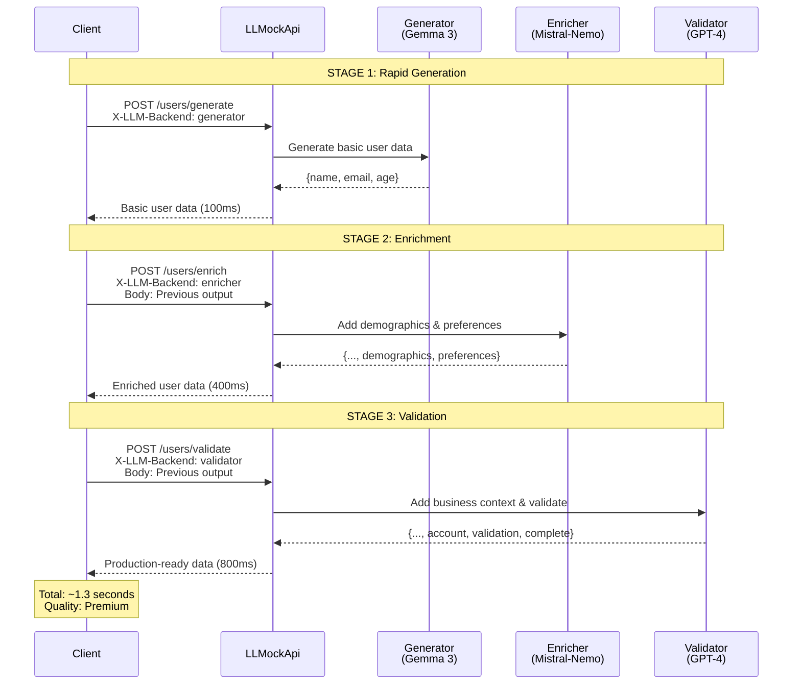
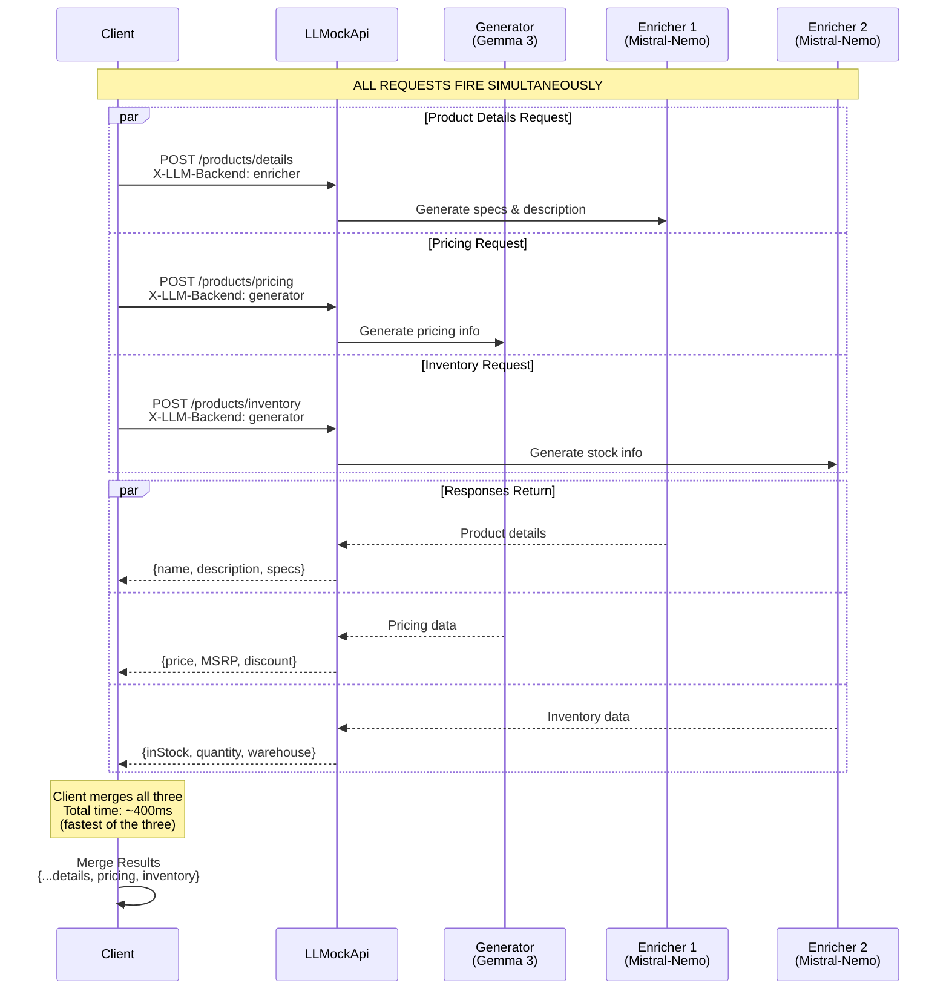

# Multi-LLM Synthetic Decision Engine - Part 2: Configuration & Implementation

## Configuration & Implementation Examples

<datetime class="hidden">2025-11-13T23:00</datetime>
<!-- category -- AI-Article, AI, Sci-Fi, Emergent Intelligence-->

> **Note:** AI drafted and  inspired by thinking about extensions to mostlylucid.mockllmapi and material for the sci-fi novel "Michael" about emergent AI


This is Part 2 of the Multi-LLM Synthetic Decision Engine series. [Read Part 1](semantidintelligence-part1) for architecture patterns overview.

[TOC]

## Configuration: Multi-Backend Setup

### Basic Configuration

Configure all backends you'll use in your pipeline:

```json
{
  "MockLlmApi": {
    "Temperature": 1.2,
    "TimeoutSeconds": 60,
    "MaxContextWindow": 8192,

    "LlmBackends": [
      {
        "Name": "generator",
        "Provider": "ollama",
        "BaseUrl": "http://localhost:11434/v1/",
        "ModelName": "gemma3:4b",
        "MaxTokens": 2048,
        "Enabled": true,
        "Weight": 1
      },
      {
        "Name": "enricher",
        "Provider": "ollama",
        "BaseUrl": "http://localhost:11434/v1/",
        "ModelName": "mistral-nemo",
        "MaxTokens": 4096,
        "Enabled": true,
        "Weight": 1
      },
      {
        "Name": "validator",
        "Provider": "openai",
        "BaseUrl": "https://api.openai.com/v1/",
        "ModelName": "gpt-4",
        "ApiKey": "sk-your-api-key",
        "MaxTokens": 4096,
        "Enabled": false,
        "Weight": 1
      }
    ],

    "EnableRetryPolicy": true,
    "MaxRetryAttempts": 3,
    "EnableCircuitBreaker": true
  }
}
```

### Cost-Optimized Configuration

Use expensive models sparingly:

```json
{
  "MockLlmApi": {
    "LlmBackends": [
      {
        "Name": "bulk-generator",
        "Provider": "ollama",
        "ModelName": "gemma3:4b",
        "Enabled": true,
        "Weight": 10
      },
      {
        "Name": "quality-refiner",
        "Provider": "ollama",
        "ModelName": "mistral-nemo",
        "Enabled": true,
        "Weight": 3
      },
      {
        "Name": "premium-validator",
        "Provider": "openai",
        "ModelName": "gpt-4",
        "ApiKey": "${OPENAI_API_KEY}",
        "Enabled": false,
        "Weight": 1
      }
    ]
  }
}
```

## Implementation Examples

### Example 1: Three-Stage Enhancement Pipeline

**Scenario:** Generate realistic user profiles with progressive enrichment

**Visual Overview:**



**What's Happening:**

1. **Stage 1** - Client asks for basic data → Fast model generates quickly
2. **Stage 2** - Client takes that output, asks for enrichment → Quality model adds details
3. **Stage 3** - Client takes enriched output, asks for validation → Premium model ensures quality

**Key Insight:** Each request is independent, but the CLIENT orchestrates the pipeline by feeding outputs as inputs.

#### Stage 1: Rapid Generation (Gemma 3)

Generate basic user data quickly:

```http
POST http://localhost:5116/api/mock/users/generate
Content-Type: application/json
X-LLM-Backend: generator

{
  "count": 10,
  "shape": {
    "users": [{
      "firstName": "string",
      "lastName": "string",
      "email": "string",
      "age": 0
    }]
  }
}
```

**Response:**
```json
{
  "users": [
    {
      "firstName": "Sarah",
      "lastName": "Chen",
      "email": "sarah.chen@example.com",
      "age": 34
    }
  ]
}
```

#### Stage 2: Enrichment (Mistral-Nemo)

Add demographic and behavioral data:

```http
POST http://localhost:5116/api/mock/users/enrich
Content-Type: application/json
X-LLM-Backend: enricher

{
  "users": [
    {
      "firstName": "Sarah",
      "lastName": "Chen",
      "email": "sarah.chen@example.com",
      "age": 34
    }
  ],
  "shape": {
    "users": [{
      "firstName": "string",
      "lastName": "string",
      "email": "string",
      "age": 0,
      "demographics": {
        "city": "string",
        "state": "string",
        "occupation": "string",
        "income": 0
      },
      "preferences": {
        "interests": ["string"],
        "communicationChannel": "string"
      }
    }]
  }
}
```

**Response:**
```json
{
  "users": [
    {
      "firstName": "Sarah",
      "lastName": "Chen",
      "email": "sarah.chen@example.com",
      "age": 34,
      "demographics": {
        "city": "Seattle",
        "state": "WA",
        "occupation": "Software Engineer",
        "income": 125000
      },
      "preferences": {
        "interests": ["technology", "hiking", "photography"],
        "communicationChannel": "email"
      }
    }
  ]
}
```

#### Stage 3: Validation & Enhancement (GPT-4)

Add business context and validate consistency:

```http
POST http://localhost:5116/api/mock/users/validate
Content-Type: application/json
X-LLM-Backend: validator

{
  "users": [...],
  "shape": {
    "users": [{
      "userId": "string",
      "firstName": "string",
      "lastName": "string",
      "email": "string",
      "age": 0,
      "demographics": {
        "city": "string",
        "state": "string",
        "zipCode": "string",
        "occupation": "string",
        "income": 0,
        "educationLevel": "string"
      },
      "preferences": {
        "interests": ["string"],
        "communicationChannel": "string",
        "marketingConsent": true
      },
      "account": {
        "created": "ISO-8601",
        "status": "active|inactive|suspended",
        "tier": "free|premium|enterprise",
        "lastLogin": "ISO-8601"
      },
      "validation": {
        "emailVerified": true,
        "phoneVerified": true,
        "identityVerified": true
      }
    }]
  }
}
```

### Example 2: Parallel Processing with Merge

**Scenario:** Generate comprehensive product catalog by merging parallel specializations

**Visual Overview:**



**The Key Difference from Sequential:**

```
Sequential Pipeline (Example 1):
  Request 1 → Wait → Response 1 → Request 2 → Wait → Response 2 → Request 3 → Wait → Response 3
  Total Time: 100ms + 400ms + 800ms = 1,300ms

Parallel Processing (Example 2):
  ┌─ Request 1 → Wait → Response 1
  ├─ Request 2 → Wait → Response 2  (ALL AT ONCE)
  └─ Request 3 → Wait → Response 3
  Total Time: Max(400ms, 100ms, 400ms) = 400ms

  SPEED UP: 3.25x faster!
```

**When Each Pattern Makes Sense:**

| Pattern | When to Use | Example |
|---------|-------------|---------|
| **Sequential** | Each stage needs previous output | Generate user → Add address based on user's city → Add preferences based on demographics |
| **Parallel** | Each aspect is independent | Generate product specs + pricing + inventory (none depend on each other) |

#### Client-Side Orchestration

```javascript
async function generateEnhancedProduct(baseSku) {
  // Parallel requests to different backends
  const [productDetails, pricing, inventory] = await Promise.all([
    // Product specs from quality model
    fetch('http://localhost:5116/api/mock/products/details', {
      method: 'POST',
      headers: {
        'Content-Type': 'application/json',
        'X-LLM-Backend': 'enricher'
      },
      body: JSON.stringify({
        sku: baseSku,
        shape: {
          name: "string",
          description: "string",
          specs: {
            dimensions: "string",
            weight: "string",
            material: "string"
          }
        }
      })
    }).then(r => r.json()),

    // Pricing from fast model
    fetch('http://localhost:5116/api/mock/products/pricing', {
      method: 'POST',
      headers: {
        'Content-Type': 'application/json',
        'X-LLM-Backend': 'generator'
      },
      body: JSON.stringify({
        sku: baseSku,
        shape: {
          price: 0.0,
          msrp: 0.0,
          discount: 0,
          currency: "USD"
        }
      })
    }).then(r => r.json()),

    // Inventory from fast model
    fetch('http://localhost:5116/api/mock/products/inventory', {
      method: 'POST',
      headers: {
        'Content-Type': 'application/json',
        'X-LLM-Backend': 'generator'
      },
      body: JSON.stringify({
        sku: baseSku,
        shape: {
          inStock: true,
          quantity: 0,
          warehouse: "string",
          nextRestock: "ISO-8601"
        }
      })
    }).then(r => r.json())
  ]);

  // Merge results
  return {
    sku: baseSku,
    ...productDetails,
    pricing,
    inventory,
    generated: new Date().toISOString()
  };
}
```

### Example 3: Quality Gate Pattern

**Scenario:** Generate data with a fast model, validate with premium model only when needed

```javascript
async function generateWithQualityGate(request, complexityThreshold = 5) {
  // Stage 1: Generate with fast model
  const generated = await fetch('http://localhost:5116/api/mock/data', {
    method: 'POST',
    headers: {
      'Content-Type': 'application/json',
      'X-LLM-Backend': 'generator'
    },
    body: JSON.stringify(request)
  }).then(r => r.json());

  // Assess complexity (example: count nested objects)
  const complexity = assessComplexity(generated);

  // Stage 2: If complex, validate with premium model
  if (complexity > complexityThreshold) {
    console.log('Complex data detected, validating with premium model...');

    const validated = await fetch('http://localhost:5116/api/mock/validate', {
      method: 'POST',
      headers: {
        'Content-Type': 'application/json',
        'X-LLM-Backend': 'validator'
      },
      body: JSON.stringify({
        data: generated,
        validationRules: [
          "Ensure all dates are valid ISO-8601",
          "Verify email formats",
          "Check for logical consistency"
        ]
      })
    }).then(r => r.json());

    return validated;
  }

  // Simple data passes through
  return generated;
}

function assessComplexity(data) {
  // Simple heuristic: count nested levels and array sizes
  const str = JSON.stringify(data);
  const nestedObjects = (str.match(/\{/g) || []).length;
  const arrays = (str.match(/\[/g) || []).length;
  return nestedObjects + (arrays * 2);
}
```

### Example 4: Iterative Refinement Loop

**Scenario:** Generate content, validate, and refine until quality threshold met

```javascript
async function generateUntilQuality(request, maxIterations = 3) {
  let iteration = 0;
  let data = null;
  let quality = 0;

  while (iteration < maxIterations && quality < 0.8) {
    iteration++;

    // Generate or refine
    const backend = iteration === 1 ? 'generator' : 'enricher';
    const endpoint = iteration === 1 ? '/generate' : '/refine';

    data = await fetch(`http://localhost:5116/api/mock${endpoint}`, {
      method: 'POST',
      headers: {
        'Content-Type': 'application/json',
        'X-LLM-Backend': backend
      },
      body: JSON.stringify({
        ...(data ? { previous: data } : {}),
        ...request
      })
    }).then(r => r.json());

    // Assess quality
    quality = await assessQuality(data);

    console.log(`Iteration ${iteration}: Quality score ${quality}`);

    if (quality >= 0.8) {
      console.log('Quality threshold met!');
      break;
    }
  }

  // Final validation pass with premium model if enabled
  if (quality < 0.8) {
    console.log('Max iterations reached, final validation pass...');

    data = await fetch('http://localhost:5116/api/mock/validate', {
      method: 'POST',
      headers: {
        'Content-Type': 'application/json',
        'X-LLM-Backend': 'validator'
      },
      body: JSON.stringify(data)
    }).then(r => r.json());
  }

  return data;
}

async function assessQuality(data) {
  // Implement quality metrics:
  // - Completeness (all required fields present)
  // - Validity (formats correct)
  // - Realism (values make sense)
  // Returns score 0.0-1.0
  return 0.85; // Simplified example
}
```

---

**Continue to [Part 3: Real-World Use Cases & Best Practices](semantidintelligence-part3)**
