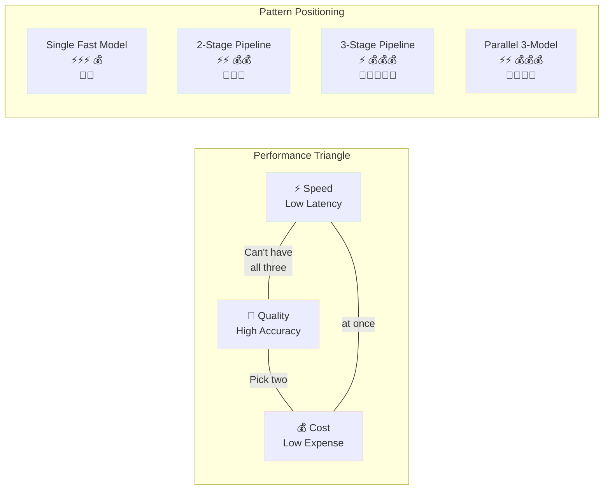
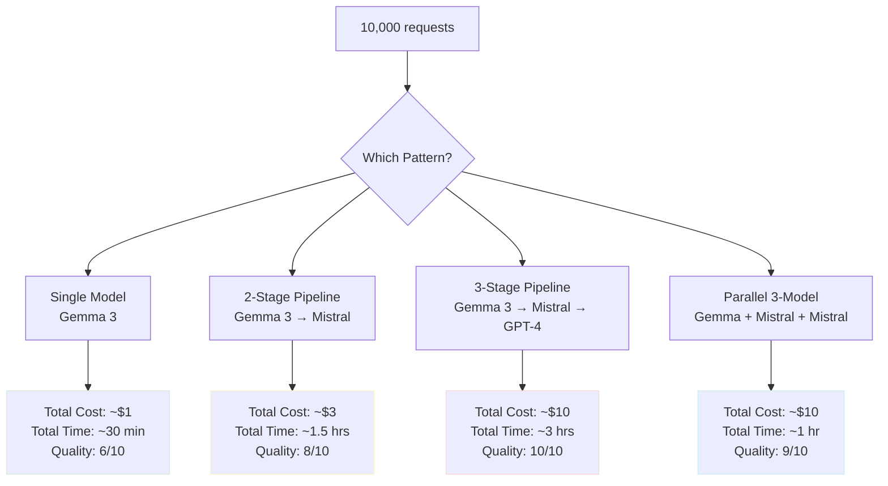

# Multi-LLM Synthetic Decision Engine - Part 3: Real-World Use Cases & Best Practices

## Real-World Use Cases & Best Practices


> **Note:** AI drafted and  inspired by thinking about extensions to mostlylucid.mockllmapi and material for the sci-fi novel "Michael" about emergent AI

<datetime class="hidden">2025-11-13T23:00</datetime>
<!-- category -- AI-Article, AI, Sci-Fi, Emergent Intelligence-->

This is Part 3 of the Multi-LLM Synthetic Decision Engine series. [Read Part 1](semantidintelligence-part1) | [Read Part 2](semantidintelligence-part2)

[TOC]

## Real-World Use Cases

### Use Case 1: Test Data Generation at Scale

**Challenge:** Generate 10,000 realistic customer records for load testing

**Solution:** Multi-stage pipeline with cost optimization

```javascript
async function generateTestDataset(count = 10000) {
  const batchSize = 100;
  const batches = Math.ceil(count / batchSize);
  const results = [];

  for (let i = 0; i < batches; i++) {
    console.log(`Processing batch ${i + 1}/${batches}...`);

    // Stage 1: Bulk generation with fast model
    const basicData = await fetch('http://localhost:5116/api/mock/customers', {
      method: 'POST',
      headers: {
        'Content-Type': 'application/json',
        'X-LLM-Backend': 'generator'  // Fast model
      },
      body: JSON.stringify({
        count: batchSize,
        shape: {
          customers: [{
            id: "string",
            name: "string",
            email: "string",
            phone: "string"
          }]
        }
      })
    }).then(r => r.json());

    // Stage 2: Enrich every 10th record with quality model
    // (Spot-checking approach)
    if (i % 10 === 0) {
      const enriched = await fetch('http://localhost:5116/api/mock/customers/enrich', {
        method: 'POST',
        headers: {
          'Content-Type': 'application/json',
          'X-LLM-Backend': 'enricher'  // Quality model
        },
        body: JSON.stringify(basicData)
      }).then(r => r.json());

      results.push(enriched);
    } else {
      results.push(basicData);
    }
  }

  return results.flat();
}
```

**Result:** 10,000 records generated in ~5 minutes, 90% fast model (cheap), 10% quality model (enriched)

### Use Case 2: API Contract Testing

**Challenge:** Generate valid and invalid test cases for API endpoint validation

**Solution:** Parallel generation of positive and negative test cases

```javascript
async function generateApiTestCases(endpoint, schema) {
  const [validCases, edgeCases, invalidCases] = await Promise.all([
    // Valid cases: fast model, high volume
    fetch('http://localhost:5116/api/mock/testcases/valid', {
      method: 'POST',
      headers: {
        'Content-Type': 'application/json',
        'X-LLM-Backend': 'generator'
      },
      body: JSON.stringify({
        endpoint,
        schema,
        count: 20,
        type: 'valid'
      })
    }).then(r => r.json()),

    // Edge cases: quality model for tricky scenarios
    fetch('http://localhost:5116/api/mock/testcases/edge', {
      method: 'POST',
      headers: {
        'Content-Type': 'application/json',
        'X-LLM-Backend': 'enricher'
      },
      body: JSON.stringify({
        endpoint,
        schema,
        count: 10,
        type: 'edge',
        scenarios: [
          'boundary values',
          'null/empty fields',
          'special characters',
          'unicode handling'
        ]
      })
    }).then(r => r.json()),

    // Invalid cases: premium model for realistic error scenarios
    fetch('http://localhost:5116/api/mock/testcases/invalid', {
      method: 'POST',
      headers: {
        'Content-Type': 'application/json',
        'X-LLM-Backend': 'validator'
      },
      body: JSON.stringify({
        endpoint,
        schema,
        count: 15,
        type: 'invalid',
        errorTypes: [
          'type mismatch',
          'missing required fields',
          'constraint violations',
          'malformed data'
        ]
      })
    }).then(r => r.json())
  ]);

  return {
    valid: validCases,
    edge: edgeCases,
    invalid: invalidCases,
    total: validCases.length + edgeCases.length + invalidCases.length
  };
}
```

### Use Case 3: Progressive Data Quality Enhancement

**Challenge:** Migrate legacy data to new schema with enhanced quality

**Solution:** Sequential enhancement pipeline with validation gates

```javascript
async function migrateLegacyData(legacyRecords) {
  const results = {
    migrated: [],
    failed: [],
    warnings: []
  };

  for (const record of legacyRecords) {
    try {
      // Stage 1: Transform schema with fast model
      let transformed = await fetch('http://localhost:5116/api/mock/transform', {
        method: 'POST',
        headers: {
          'Content-Type': 'application/json',
          'X-LLM-Backend': 'generator'
        },
        body: JSON.stringify({
          legacyRecord: record,
          targetSchema: NEW_SCHEMA
        })
      }).then(r => r.json());

      // Stage 2: Enrich missing fields with quality model
      if (hasMissingFields(transformed)) {
        transformed = await fetch('http://localhost:5116/api/mock/enrich', {
          method: 'POST',
          headers: {
            'Content-Type': 'application/json',
            'X-LLM-Backend': 'enricher'
          },
          body: JSON.stringify(transformed)
        }).then(r => r.json());
      }

      // Stage 3: Validate critical records with premium model
      if (record.importance === 'critical') {
        const validation = await fetch('http://localhost:5116/api/mock/validate', {
          method: 'POST',
          headers: {
            'Content-Type': 'application/json',
            'X-LLM-Backend': 'validator'
          },
          body: JSON.stringify({
            record: transformed,
            rules: CRITICAL_VALIDATION_RULES
          })
        }).then(r => r.json());

        if (!validation.passed) {
          results.warnings.push({
            originalId: record.id,
            issues: validation.issues
          });
        }
      }

      results.migrated.push(transformed);

    } catch (error) {
      results.failed.push({
        originalId: record.id,
        error: error.message
      });
    }
  }

  return results;
}
```

## Best Practices

### 1. Start Cheap, Refine Selectively

Use expensive models only where they add value:

```javascript
// ✅ GOOD: Selective use of premium models
async function smartGeneration(complexity) {
  if (complexity === 'simple') {
    return generateWith('generator');  // Fast model
  } else if (complexity === 'medium') {
    return generateWith('enricher');   // Quality model
  } else {
    return generateWith('validator');  // Premium model
  }
}

// ❌ BAD: Always using premium models
async function expensiveGeneration() {
  return generateWith('validator');  // Wastes money on simple tasks
}
```

### 2. Cache Aggressively Between Stages

Use LLMockApi's built-in caching:

```json
{
  "shape": {
    "$cache": 10,
    "users": [{"id": 0, "name": "string"}]
  }
}
```

This primes the cache with variants, avoiding regeneration in subsequent pipeline stages.

### 3. Implement Quality Gates

Don't blindly pipeline—validate at each stage:

```javascript
async function pipelineWithGates(data) {
  // Stage 1
  let result = await stage1(data);
  if (!validate(result, STAGE1_RULES)) {
    throw new Error('Stage 1 validation failed');
  }

  // Stage 2
  result = await stage2(result);
  if (!validate(result, STAGE2_RULES)) {
    // Attempt correction
    result = await correctWith('enricher', result);
  }

  return result;
}
```

### 4. Monitor Backend Performance

Track which backends are used and their performance:

```javascript
class BackendMonitor {
  constructor() {
    this.stats = new Map();
  }

  async callWithTracking(backend, endpoint, body) {
    const start = Date.now();

    try {
      const response = await fetch(endpoint, {
        method: 'POST',
        headers: {
          'Content-Type': 'application/json',
          'X-LLM-Backend': backend
        },
        body: JSON.stringify(body)
      });

      const duration = Date.now() - start;
      this.recordSuccess(backend, duration);

      return await response.json();

    } catch (error) {
      const duration = Date.now() - start;
      this.recordFailure(backend, duration, error);
      throw error;
    }
  }

  recordSuccess(backend, duration) {
    const stats = this.getStats(backend);
    stats.calls++;
    stats.successes++;
    stats.totalDuration += duration;
    stats.avgDuration = stats.totalDuration / stats.calls;
  }

  recordFailure(backend, duration, error) {
    const stats = this.getStats(backend);
    stats.calls++;
    stats.failures++;
    stats.totalDuration += duration;
    stats.avgDuration = stats.totalDuration / stats.calls;
    stats.lastError = error.message;
  }

  getStats(backend) {
    if (!this.stats.has(backend)) {
      this.stats.set(backend, {
        calls: 0,
        successes: 0,
        failures: 0,
        totalDuration: 0,
        avgDuration: 0,
        lastError: null
      });
    }
    return this.stats.get(backend);
  }

  report() {
    console.log('Backend Performance Report:');
    for (const [backend, stats] of this.stats) {
      console.log(`\n${backend}:`);
      console.log(`  Calls: ${stats.calls}`);
      console.log(`  Success Rate: ${(stats.successes / stats.calls * 100).toFixed(1)}%`);
      console.log(`  Avg Duration: ${stats.avgDuration.toFixed(0)}ms`);
      if (stats.lastError) {
        console.log(`  Last Error: ${stats.lastError}`);
      }
    }
  }
}

// Usage
const monitor = new BackendMonitor();
const result = await monitor.callWithTracking('generator', 'http://...', data);
monitor.report();
```

### 5. Design for Fallbacks

Always have a backup plan:

```javascript
async function generateWithFallback(data) {
  // Try primary backend
  try {
    return await fetch('http://localhost:5116/api/mock/generate', {
      method: 'POST',
      headers: { 'X-LLM-Backend': 'enricher' },
      body: JSON.stringify(data)
    }).then(r => r.json());
  } catch (error) {
    console.warn('Primary backend failed, falling back to generator');

    // Fallback to faster model
    return await fetch('http://localhost:5116/api/mock/generate', {
      method: 'POST',
      headers: { 'X-LLM-Backend': 'generator' },
      body: JSON.stringify(data)
    }).then(r => r.json());
  }
}
```

### 6. Batch Strategically

Balance latency vs. throughput:

```javascript
// For sequential pipelines: small batches for lower latency
async function sequentialPipeline(items) {
  const batchSize = 10;  // Small batches
  for (let i = 0; i < items.length; i += batchSize) {
    const batch = items.slice(i, i + batchSize);
    await processBatch(batch);  // Process and continue
  }
}

// For parallel pipelines: larger batches for higher throughput
async function parallelPipeline(items) {
  const batchSize = 50;  // Larger batches
  const batches = [];
  for (let i = 0; i < items.length; i += batchSize) {
    const batch = items.slice(i, i + batchSize);
    batches.push(processBatch(batch));
  }
  await Promise.all(batches);  // All at once
}
```

## Performance Considerations

### Latency vs. Quality Trade-offs

Understanding the trade-offs between speed, quality, and cost is crucial for designing effective multi-LLM systems.



**Detailed Breakdown:**

| Pattern | Latency | Quality | Cost | Best For |
|---------|---------|---------|------|----------|
| **Single fast model** | ⚡⚡⚡ Low (100-300ms) | 💎💎 Medium | 💰 Low ($0.0001/request) | High volume, simple data |
| **Sequential 2-stage** | ⚡⚡ Medium (500ms-1s) | 💎💎💎 High | 💰💰 Medium ($0.0003/request) | Balanced quality/speed |
| **Sequential 3-stage** | ⚡ High (1-2s) | 💎💎💎💎💎 Very High | 💰💰💰 High ($0.001/request) | Critical data quality |
| **Parallel 3-model** | ⚡⚡ Medium (300-600ms) | 💎💎💎💎 High | 💰💰💰 High ($0.001/request) | Comprehensive coverage |

**Real-World Cost Analysis:**



**Key Insights:**

1. **Parallel is faster than sequential** when using same models, but costs same
2. **Adding GPT-4 significantly increases cost** but maximizes quality
3. **2-stage pipelines offer best balance** for most use cases
4. **Single model is best** when you have 100k+ requests and quality can be medium

### Optimization Strategies

1. **Parallel where possible** - Run independent stages concurrently
2. **Cache extensively** - Reuse results across pipeline stages
3. **Batch smartly** - Group similar requests to same backend
4. **Monitor and tune** - Track actual performance and adjust
5. **Use appropriate models** - Don't over-engineer simple tasks

## Troubleshooting

### Issue: Pipeline Takes Too Long

**Symptoms:** Multi-stage pipeline exceeds timeout

**Solutions:**
- Reduce `MaxTokens` in configuration
- Use parallel processing instead of sequential
- Implement selective processing (quality gates)
- Increase `TimeoutSeconds` for complex pipelines

### Issue: Inconsistent Quality Between Stages

**Symptoms:** Each stage produces conflicting data

**Solutions:**
- Pass previous stage output as context
- Use explicit validation rules
- Implement quality scoring
- Add correction loops

### Issue: High Costs with Cloud Models

**Symptoms:** OpenAI/Anthropic bills are high

**Solutions:**
- Use cloud models only for final validation
- Implement smart routing (complexity-based)
- Cache aggressively
- Batch requests to reduce overhead

### Issue: Backend Selection Not Working

**Symptoms:** Always using same backend despite headers

**Solutions:**
- Verify backend name matches configuration
- Check backend is enabled (`"Enabled": true`)
- Ensure header syntax: `X-LLM-Backend: backend-name`
- Check logs for "Using requested backend" message

## Advanced Topics

### Dynamic Backend Selection

Route based on request characteristics:

```javascript
function selectBackend(request) {
  const complexity = analyzeComplexity(request);
  const budget = request.budget || 'low';

  if (budget === 'unlimited' && complexity > 8) {
    return 'validator';  // Premium model
  } else if (complexity > 5) {
    return 'enricher';   // Quality model
  } else {
    return 'generator';  // Fast model
  }
}

async function smartGenerate(request) {
  const backend = selectBackend(request);

  return await fetch('http://localhost:5116/api/mock/generate', {
    method: 'POST',
    headers: {
      'Content-Type': 'application/json',
      'X-LLM-Backend': backend
    },
    body: JSON.stringify(request)
  }).then(r => r.json());
}
```

### Consensus Voting Pattern

Use multiple models and vote on best result:

```javascript
async function generateWithConsensus(request, backends = ['generator', 'enricher']) {
  // Generate with multiple backends
  const results = await Promise.all(
    backends.map(backend =>
      fetch('http://localhost:5116/api/mock/generate', {
        method: 'POST',
        headers: {
          'Content-Type': 'application/json',
          'X-LLM-Backend': backend
        },
        body: JSON.stringify(request)
      }).then(r => r.json())
    )
  );

  // Score each result
  const scores = results.map(result => ({
    result,
    score: scoreQuality(result)
  }));

  // Return highest scoring result
  scores.sort((a, b) => b.score - a.score);
  return scores[0].result;
}
```

### Self-Healing Pipelines

Automatically detect and fix quality issues:

```javascript
async function selfHealingPipeline(data, maxAttempts = 3) {
  let attempt = 0;
  let result = data;

  while (attempt < maxAttempts) {
    attempt++;

    // Process with current stage
    result = await processStage(result, attempt);

    // Validate result
    const issues = validateResult(result);

    if (issues.length === 0) {
      break;  // Success!
    }

    console.log(`Attempt ${attempt}: Found ${issues.length} issues, healing...`);

    // Use quality model to fix issues
    result = await fetch('http://localhost:5116/api/mock/heal', {
      method: 'POST',
      headers: {
        'Content-Type': 'application/json',
        'X-LLM-Backend': 'enricher'
      },
      body: JSON.stringify({
        data: result,
        issues: issues
      })
    }).then(r => r.json());
  }

  return result;
}
```

---

**Continue to [Part 4: Advanced Self-Organizing Systems](semantidintelligence-part4)**
