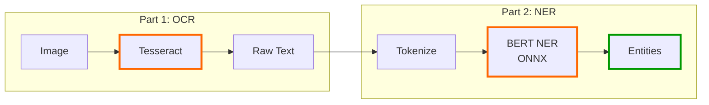
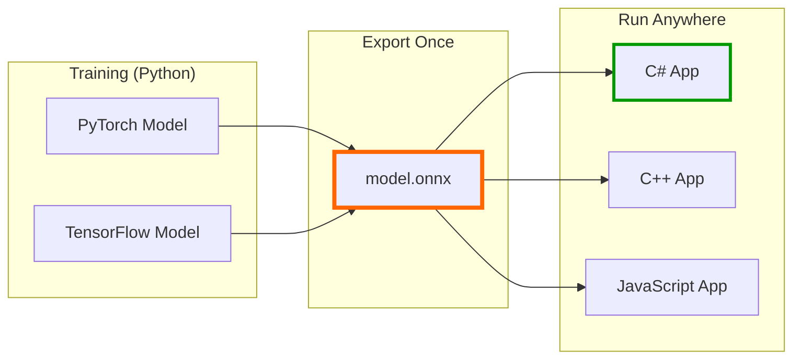
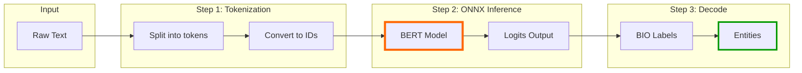
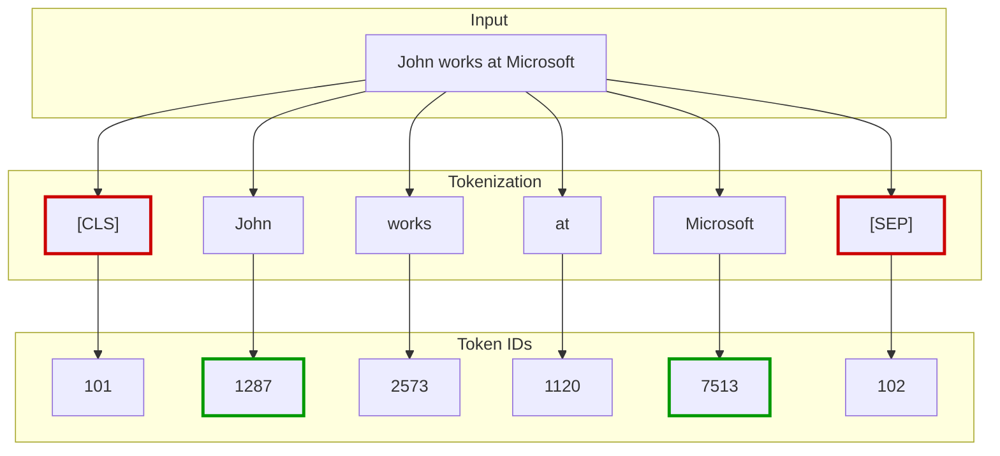
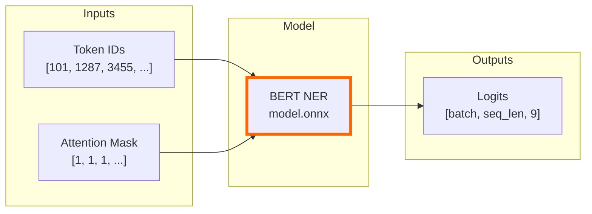
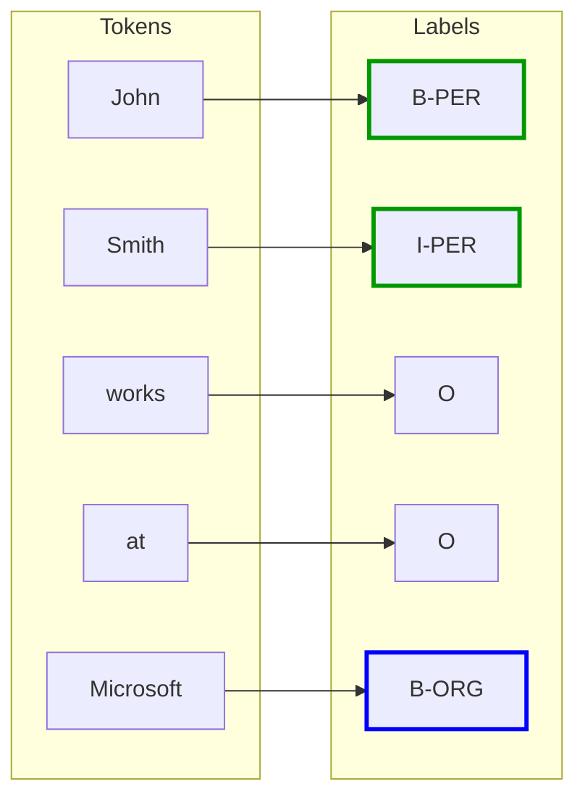
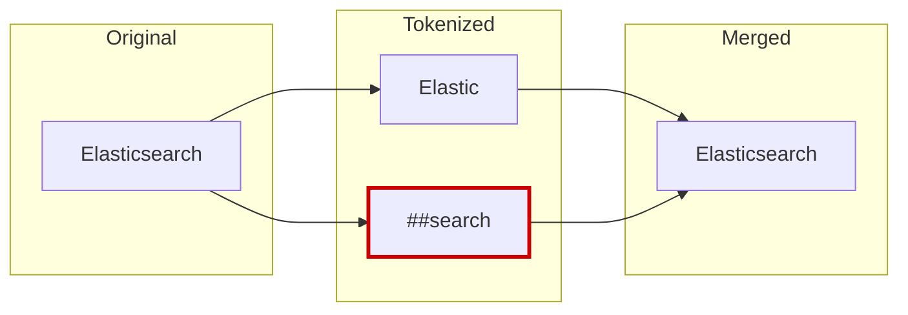

# Simple OCR and NER Feature Extraction in C# with ONNX

<!-- category -- AI,OCR,NER,ONNX,Docker,CSharp,Tutorial -->

<datetime class="hidden">2026-01-21T12:00</datetime>

[](https://www.nuget.org/packages/Mostlylucid.OcrNer/) [](https://www.nuget.org/packages/Mostlylucid.OcrNer/) [](https://github.com/scottgal/mostlylucidweb/releases?q=ocrner)

As I've been building [***lucid*RAG**](https://www.lucidrag.com) I'm reading social media where people keep asking the same thing. 'How do you get features from scanned text?' the category error is always 'just use an LLM'...which WORKS but is very expensive. SO as I'm already [deep in the OCR space](/blog/constrained-fuzzy-image-ocr-pipeline) I thought I'd write a 'beginner friendly' approach to the NON-LLM (or LLM optional) way to do this.

You have images with text. You want to extract that text, then find the useful structure inside it (names, companies, places) without calling an LLM, shipping data to the cloud, or paying per token.

This article shows the **simplest possible** pipeline: **Tesseract** for text extraction, then **BERT NER** (via ONNX) for entity recognition. All local. All deterministic. All in C#.

Deterministic here means fixed versions, fixed language data, and no adaptive learning at runtime.

> **Want the packaged version?** This pipeline is now a NuGet package with auto-downloading models, OpenCV preprocessing, Florence-2 vision, and a CLI tool. See **[Part 2: The NuGet Package](/blog/simple-ocr-ner-nuget)** for the ready-to-use version.

[TOC]

---

## The Full Pipeline



Two steps, two models, both running locally. Let's build each part.

---

# Part 1: OCR with Tesseract

[Tesseract](https://github.com/tesseract-ocr/tesseract) is the standard open-source OCR engine. We'll use [Tesseract.NET](https://github.com/charlesw/tesseract), a C# wrapper.

```bash
dotnet add package Tesseract
```

You also need the trained data files. Download `eng.traineddata` from [tessdata](https://github.com/tesseract-ocr/tessdata) and place it in a `tessdata` folder.

```csharp
using Tesseract;

public static string ExtractText(string imagePath)
{
    using var engine = new TesseractEngine("./tessdata", "eng", EngineMode.Default);
    using var img = Pix.LoadFromFile(imagePath);
    using var page = engine.Process(img);

    return page.GetText();
}
```

That's it. Call `ExtractText("invoice.png")` and you get a string.

> **Important**: `TesseractEngine` is expensive to create. In real applications, create it once and reuse it.

### Limitations

Tesseract works well for **clean, high-contrast text in standard fonts**. It struggles with:

- Stylized or decorative fonts
- Low-quality scans or photos
- Rotated or curved text
- Text on complex backgrounds
- Animated GIFs with subtitles
- Hyphenated line breaks (`inter-\nnational`) may need post-processing before NER

For production systems that need to handle the weird stuff, see [The Three-Tier OCR Pipeline](/blog/constrained-fuzzy-image-ocr-pipeline)-which adds Florence-2 ONNX as a middle tier and Vision LLM escalation for hard cases.

For this tutorial, we'll assume you have clean images or text from another source (PDF parsing, copy-paste, etc.).

> In practice, you will usually want to normalize OCR output (trim whitespace, collapse repeated newlines, fix obvious hyphenation) before passing it to NER.

---

# Part 2: NER with ONNX

## Why This Approach Works

Before diving into code, let's understand what we're actually doing. If you're a C# developer who's never touched ML, this section is for you.

### What is NER?

**Named Entity Recognition (NER)** is a solved problem. Researchers have trained neural networks that can read text and highlight the "interesting bits":

- **PER** - Person names ("John Smith", "Dr. Jane Doe")
- **ORG** - Organizations ("Microsoft", "NHS", "Acme Corp")
- **LOC** - Locations ("London", "Mount Everest")
- **MISC** - Other entities ("COVID-19", "iPhone 15")

The model doesn't "understand" the text-it's learned statistical patterns from millions of labelled examples. **NER is feature extraction, not reasoning.** It's pattern matching on steroids.

### Why ONNX?

**ONNX** (Open Neural Network Exchange) is a standard format for ML models. Think of it like a **frozen inference DLL** for neural networks: fixed weights in, tensors out, no training logic, no randomness:



The key insight: **someone else did the hard work** (training the model in Python). You just run inference in C#.

### Why Not Just Use an LLM?

You could send text to GPT-4 and ask "find the people and companies in this text". It works! But:

| Approach          | Speed | Cost per 1000 docs | Privacy               | Consistency |
|-------------------|-------|--------------|-----------------------|-------------|
| **ONNX NER**      | ~50ms | $0 | Local                 | High |
| **Local LLM API** | 4-30s | $0 | Small Models can be flaky | Variable |
| **LLM API**       | 1-5s  | $20-50 | Data sent externally  | Variable |

LLMs are great for complex reasoning. For pattern extraction at scale, a dedicated model is 40x faster and free.

---

## The Pipeline

Here's what we're building:



Each step is simple. Let's walk through them.

---

## Step 1: Download the Model

You need three files from HuggingFace. Download them manually to a folder (e.g., `./models/ner/`):

| File | Size | URL |
|------|------|-----|
| `model.onnx` | ~430MB | [Download](https://huggingface.co/protectai/bert-base-NER-onnx/resolve/main/model.onnx) |
| `vocab.txt` | ~230KB | [Download](https://huggingface.co/protectai/bert-base-NER-onnx/resolve/main/vocab.txt) |
| `config.json` | ~1KB | [Download](https://huggingface.co/protectai/bert-base-NER-onnx/resolve/main/config.json) |

The model is [bert-base-NER](https://huggingface.co/dslim/bert-base-NER) exported to ONNX format by [protectai](https://huggingface.co/protectai/bert-base-NER-onnx).

Your folder should look like:
```
models/
  ner/
    model.onnx      (the neural network)
    vocab.txt       (word → ID mapping)
    config.json     (label definitions)
```

---

## Step 2: Project Setup

Create a new console app and add the NuGet packages:

```bash
dotnet new console -n NerDemo
cd NerDemo
dotnet add package Microsoft.ML.OnnxRuntime
dotnet add package Microsoft.ML.Tokenizers
```

That's it. Two packages:
- **OnnxRuntime** - Runs the model
- **ML.Tokenizers** - Handles text → token conversion

---

## Step 3: Understanding Tokenization

Before the model can process text, we need to convert it to numbers. This is called **tokenization**.



Key points:
- `[CLS]` and `[SEP]` are special tokens that mark sentence boundaries
- Each word becomes a number from `vocab.txt`
- The model only sees numbers, never the actual text

### Loading the Tokenizer

```csharp
using Microsoft.ML.Tokenizers;

// Load the vocabulary file
var vocabPath = "./models/ner/vocab.txt";

var options = new BertOptions
{
    LowerCaseBeforeTokenization = false,  // BERT-NER is case-sensitive!
    UnknownToken = "[UNK]",
    ClassificationToken = "[CLS]",
    SeparatorToken = "[SEP]",
    PaddingToken = "[PAD]"
};

using var stream = File.OpenRead(vocabPath);
var tokenizer = BertTokenizer.Create(stream, options);
```

Why `LowerCaseBeforeTokenization = false`? This model was trained on cased text. "John" and "john" have different meanings-one's likely a name, one's likely not.

> **Important**: The tokenizer *must* match the model exactly. Using a different vocab, casing option, or special token IDs will silently degrade results. Always use the `vocab.txt` that ships with the model.

### Tokenizing Text

```csharp
var text = "John Smith works at Microsoft in London.";

// Tokenize (splits into subwords)
var encoded = tokenizer.EncodeToTokens(text, out _);

// Get special token IDs
var clsId = 101;  // [CLS] token
var sepId = 102;  // [SEP] token

// Build the full sequence: [CLS] + tokens + [SEP]
var tokenIds = new List<int> { clsId };
tokenIds.AddRange(encoded.Select(t => t.Id));
tokenIds.Add(sepId);

// Also keep the text tokens for later
var tokens = new List<string> { "[CLS]" };
tokens.AddRange(encoded.Select(t => t.Value));
tokens.Add("[SEP]");
```

After this, we have:
- `tokenIds`: `[101, 1287, 3455, 2573, 1120, 7513, 1999, 2414, 119, 102]`
- `tokens`: `["[CLS]", "John", "Smith", "works", "at", "Microsoft", "in", "London", ".", "[SEP]"]`

---

## Step 4: Running the Model

Now we feed those numbers into the ONNX model. The model returns "logits"-raw scores for each possible label at each position.



### Loading the Model

```csharp
using Microsoft.ML.OnnxRuntime;
using Microsoft.ML.OnnxRuntime.Tensors;

// Configure for best performance
var sessionOptions = new SessionOptions
{
    GraphOptimizationLevel = GraphOptimizationLevel.ORT_ENABLE_ALL,
    IntraOpNumThreads = Math.Min(4, Environment.ProcessorCount)
};

// Load the model (takes ~2 seconds first time)
var session = new InferenceSession("./models/ner/model.onnx", sessionOptions);
```

> **Important**: Create the tokenizer and inference session once (singleton/service) and reuse them. Don't reload per document-`InferenceSession` is expensive to create.

### Preparing Inputs

The model expects:
- **input_ids**: Our token IDs as `long[]`
- **attention_mask**: 1 for real tokens, 0 for padding

```csharp
// Pad to a fixed length (BERT requires fixed shapes; powers of 2 are cache-friendly)
int sequenceLength = 64;  // or 128, 256, 512

var inputIds = new long[sequenceLength];
var attentionMask = new long[sequenceLength];

for (int i = 0; i < sequenceLength; i++)
{
    if (i < tokenIds.Count)
    {
        inputIds[i] = tokenIds[i];
        attentionMask[i] = 1;
    }
    else
    {
        inputIds[i] = 0;   // PAD token
        attentionMask[i] = 0;
    }
}
```

### Running Inference

```csharp
// Create tensors (shape: [batch_size=1, sequence_length])
var inputIdsTensor = new DenseTensor<long>(inputIds, [1, sequenceLength]);
var attentionMaskTensor = new DenseTensor<long>(attentionMask, [1, sequenceLength]);

// Build inputs
var inputs = new List<NamedOnnxValue>
{
    NamedOnnxValue.CreateFromTensor("input_ids", inputIdsTensor),
    NamedOnnxValue.CreateFromTensor("attention_mask", attentionMaskTensor)
};

// Run the model
using var results = session.Run(inputs);

// Get output logits
var output = results.First(r => r.Name == "logits");
var logits = output.AsTensor<float>();
```

The output `logits` has shape `[1, sequence_length, 9]`-9 possible labels for each token position.

---

## Step 5: Decoding the Output

The model outputs raw scores. We need to:
1. Find the highest-scoring label for each token
2. Convert those labels to actual entities

### Understanding BIO Tags

The model uses **BIO notation**:



- **B-PER** = Beginning of a Person entity
- **I-PER** = Inside (continuation) of a Person entity
- **O** = Outside any entity (not interesting)
- **B-ORG** = Beginning of an Organization

This lets the model handle multi-word entities like "John Smith" or "United Kingdom".

### The Label Mapping

```csharp
// These are the 9 labels from the protectai/bert-base-NER-onnx config.json (id2label field)
string[] labels =
{
    "O",       // 0: Outside any entity
    "B-MISC",  // 1: Beginning of Miscellaneous
    "I-MISC",  // 2: Inside Miscellaneous
    "B-PER",   // 3: Beginning of Person
    "I-PER",   // 4: Inside Person
    "B-ORG",   // 5: Beginning of Organization
    "I-ORG",   // 6: Inside Organization
    "B-LOC",   // 7: Beginning of Location
    "I-LOC"    // 8: Inside Location
};
```

> **Note**: This specific model uses the standard 9-label CoNLL schema. Some ONNX exports include label names in `config.json` (`id2label` field). If you swap models, read labels from config rather than hardcoding.

### Finding the Best Label

For each token, we pick the label with the highest logit score:

```csharp
var predictions = new List<(string Token, string Label, float Confidence)>();

int numLabels = 9;

for (int i = 0; i < tokens.Count; i++)
{
    // Skip special tokens
    if (tokens[i] is "[CLS]" or "[SEP]" or "[PAD]")
        continue;

    // Find highest scoring label
    float maxScore = float.MinValue;
    int maxIndex = 0;

    for (int j = 0; j < numLabels; j++)
    {
        float score = logits[0, i, j];
        if (score > maxScore)
        {
            maxScore = score;
            maxIndex = j;
        }
    }

    // Convert logit to probability (softmax)
    float confidence = Softmax(logits, i, numLabels, maxIndex);

    predictions.Add((tokens[i], labels[maxIndex], confidence));
}
```

The `Softmax` function converts raw scores to probabilities (0-1):

```csharp
static float Softmax(Tensor<float> logits, int position, int numLabels, int targetIndex)
{
    // Find max for numerical stability
    float maxLogit = float.MinValue;
    for (int j = 0; j < numLabels; j++)
        maxLogit = Math.Max(maxLogit, logits[0, position, j]);

    // Compute softmax
    float sumExp = 0f;
    for (int j = 0; j < numLabels; j++)
        sumExp += MathF.Exp(logits[0, position, j] - maxLogit);

    return MathF.Exp(logits[0, position, targetIndex] - maxLogit) / sumExp;
}
```

> **Note on confidence**: Softmax scores are *relative*, not calibrated probabilities. They're useful for ranking and thresholding, but don't treat `0.92` as "92% correct". Use them to filter low-confidence predictions, not as ground truth.

---

## Step 6: Extracting Entities

Now we have per-token predictions. We need to merge them into entities.

First, the WordPiece merge helpers. These handle `##` subwords and punctuation spacing correctly:

```csharp
static void AppendWordPiece(StringBuilder sb, string token)
{
    if (string.IsNullOrEmpty(token)) return;

    // WordPiece continuation: "##soft" → append without space
    if (token.StartsWith("##", StringComparison.Ordinal))
    {
        sb.Append(token.AsSpan(2));
        return;
    }

    // No leading space if first token or if punctuation
    if (sb.Length > 0 && !IsPunctuationToken(token))
        sb.Append(' ');

    sb.Append(token);
}

static bool IsPunctuationToken(string token) =>
    token.Length == 1 && char.IsPunctuation(token[0]);

static string MergeWordPieces(IEnumerable<string> tokens)
{
    var sb = new StringBuilder();
    foreach (var t in tokens)
        AppendWordPiece(sb, t);
    return sb.ToString();
}
```

Now the entity extraction. Entity confidence is the **minimum token confidence** across the span-conservative, so a single weak token isn't hidden by averaging:

```csharp
public sealed class Entity
{
    public required string Text { get; init; }
    public required string Type { get; init; }  // PER, ORG, LOC, MISC
    public required float Confidence { get; init; }
}

static List<Entity> ExtractEntities(
    IReadOnlyList<(string Token, string Label, float Confidence)> predictions)
{
    var entities = new List<Entity>();

    string? currentType = null;
    var currentTokens = new List<string>();
    float currentConfidence = 1.0f;

    void Flush()
    {
        if (currentType == null || currentTokens.Count == 0) return;

        entities.Add(new Entity
        {
            Type = currentType,
            Text = MergeWordPieces(currentTokens),
            Confidence = currentConfidence
        });

        currentType = null;
        currentTokens.Clear();
        currentConfidence = 1.0f;
    }

    foreach (var (token, label, conf) in predictions)
    {
        // Continue current entity if model says I-<same type>
        if (currentType != null && label == $"I-{currentType}")
        {
            currentTokens.Add(token);  // keep ## form, merge handles it
            currentConfidence = Math.Min(currentConfidence, conf);
            continue;
        }

        // New entity begins
        if (label.StartsWith("B-", StringComparison.Ordinal))
        {
            Flush();
            currentType = label[2..];
            currentTokens.Add(token);
            currentConfidence = conf;
            continue;
        }

        // Anything else (O, or I- without matching current type) ends the entity
        Flush();
    }

    Flush();
    return entities;
}
```

Note: WordPiece is handled entirely by `MergeWordPieces`-no special control flow needed.

---

## Complete Example

Here's a minimal working example you can copy and run:

```csharp
using System.Text;
using Microsoft.ML.OnnxRuntime;
using Microsoft.ML.OnnxRuntime.Tensors;
using Microsoft.ML.Tokenizers;

// === Configuration ===
var modelPath = "./models/ner/model.onnx";
var vocabPath = "./models/ner/vocab.txt";

// === Load tokenizer ===
var bertOptions = new BertOptions
{
    LowerCaseBeforeTokenization = false,
    UnknownToken = "[UNK]",
    ClassificationToken = "[CLS]",
    SeparatorToken = "[SEP]"
};

using var vocabStream = File.OpenRead(vocabPath);
var tokenizer = BertTokenizer.Create(vocabStream, bertOptions);

// === Load model ===
var sessionOptions = new SessionOptions
{
    GraphOptimizationLevel = GraphOptimizationLevel.ORT_ENABLE_ALL
};
using var session = new InferenceSession(modelPath, sessionOptions);

// === Process text ===
var text = "John Smith, CEO of Microsoft, announced the acquisition in London yesterday.";

// Tokenize
var encoded = tokenizer.EncodeToTokens(text, out _);

// Build sequence with special tokens
var tokens = new List<string> { "[CLS]" };
tokens.AddRange(encoded.Select(t => t.Value));
tokens.Add("[SEP]");

var rawIds = new List<int> { 101 };  // [CLS]
rawIds.AddRange(encoded.Select(t => t.Id));
rawIds.Add(102);  // [SEP]

// Pad to fixed length
int seqLen = 64;
var inputIds = new long[seqLen];
var attentionMask = new long[seqLen];

for (int i = 0; i < seqLen; i++)
{
    inputIds[i] = i < rawIds.Count ? rawIds[i] : 0;
    attentionMask[i] = i < rawIds.Count ? 1 : 0;
}

// === Run inference ===
var inputs = new List<NamedOnnxValue>
{
    NamedOnnxValue.CreateFromTensor("input_ids",
        new DenseTensor<long>(inputIds, [1, seqLen])),
    NamedOnnxValue.CreateFromTensor("attention_mask",
        new DenseTensor<long>(attentionMask, [1, seqLen]))
};

using var results = session.Run(inputs);
var logits = results.First().AsTensor<float>();

// === Decode predictions ===
string[] labels = ["O", "B-MISC", "I-MISC", "B-PER", "I-PER", "B-ORG", "I-ORG", "B-LOC", "I-LOC"];

// WordPiece merge helper
static string MergeWordPieces(List<string> tokens)
{
    var sb = new StringBuilder();
    foreach (var t in tokens)
    {
        if (t.StartsWith("##", StringComparison.Ordinal))
            sb.Append(t.AsSpan(2));
        else if (sb.Length > 0 && t.Length > 0 && !char.IsPunctuation(t[0]))
            sb.Append(' ').Append(t);
        else
            sb.Append(t);
    }
    return sb.ToString();
}

Console.WriteLine($"Input: {text}\n");
Console.WriteLine("Entities found:");

string? currentType = null;
var currentTokens = new List<string>();

for (int i = 1; i < tokens.Count - 1; i++)  // Skip [CLS] and [SEP]
{
    var token = tokens[i];

    // Find best label
    int bestIdx = 0;
    float bestScore = float.MinValue;
    for (int j = 0; j < 9; j++)
    {
        if (logits[0, i, j] > bestScore)
        {
            bestScore = logits[0, i, j];
            bestIdx = j;
        }
    }

    var label = labels[bestIdx];

    // Continue current entity if model says I-<same type>
    if (currentType != null && label == $"I-{currentType}")
    {
        currentTokens.Add(token);
        continue;
    }

    // New entity begins
    if (label.StartsWith("B-"))
    {
        if (currentType != null)
            Console.WriteLine($"  [{currentType}] {MergeWordPieces(currentTokens)}");

        currentType = label[2..];
        currentTokens = [token];
        continue;
    }

    // Anything else ends the current entity
    if (currentType != null)
        Console.WriteLine($"  [{currentType}] {MergeWordPieces(currentTokens)}");
    currentType = null;
    currentTokens.Clear();
}

// Output last entity
if (currentType != null)
    Console.WriteLine($"  [{currentType}] {MergeWordPieces(currentTokens)}");
```

**Output:**
```
Input: John Smith, CEO of Microsoft, announced the acquisition in London yesterday.

Entities found:
  [PER] John Smith
  [ORG] Microsoft
  [LOC] London
```

---

## Understanding WordPiece Subwords

BERT uses **WordPiece tokenization**, which splits unknown words into subwords. The `##` prefix means "continuation of previous word":



The `MergeWordPieces` helper handles this: `##` tokens are appended without a space, producing `"Elasticsearch"` instead of `"Elastic search"`.

---

## Performance Tips

### 1. Batch Multiple Texts

If you have many texts, process them in batches:

```csharp
// Instead of: 1 text × 1 inference = 50ms
// Do: 16 texts × 1 inference = 100ms (6ms per text)

int batchSize = 16;
var batchInputIds = new long[batchSize, seqLen];
// ... fill batch ...
var tensor = new DenseTensor<long>(batchInputIds, [batchSize, seqLen]);
```

### 2. Use Smart Bucketing

Don't always pad to 512. Use the smallest bucket that fits:

```csharp
int[] buckets = [32, 64, 128, 256, 512];
int targetLength = buckets.FirstOrDefault(b => b >= tokenIds.Count);
if (targetLength == 0) targetLength = 512;
```

In practice, ONNX NER is fast enough to run **inline during ingestion**, not just as a batch job. You can extract entities as documents arrive rather than queuing them for later.

### 3. GPU Acceleration (Optional)

For high throughput, use DirectML (Windows) or CUDA:

```bash
dotnet add package Microsoft.ML.OnnxRuntime.DirectML  # Windows GPU
# or
dotnet add package Microsoft.ML.OnnxRuntime.Gpu       # NVIDIA CUDA
```

```csharp
var options = new SessionOptions();
options.AppendExecutionProvider_DML();  // Use GPU
```

---

## When to Use This vs LLM

| Use ONNX NER | Use LLM (GPT-4/Claude) |
|--------------|------------------------|
| High volume (1000s of docs) | One-off analysis |
| Standard entities (people, orgs, places) | Custom entity types |
| Privacy-sensitive data | When you need explanations |
| Deterministic pipelines | Exploratory analysis |
| Feature extraction | Interpretation / synthesis |

Both approaches work. They solve **different problems**. NER extracts structure; LLMs reason about meaning.

---

## The Bigger Picture

This pattern-**deterministic extraction with frozen models, followed by optional synthesis later**-scales far better than pushing raw text into an LLM and hoping it behaves.

NER is not something you "agentify". It's infrastructure. You run it on ingestion, store the entities, and use them downstream for filtering, linking, or feeding into more sophisticated pipelines.

The same approach applies to other feature extraction tasks: embeddings, classification, sentiment. Train once (or use pretrained), export to ONNX, run everywhere, deterministically.

> **Where this fits**: This OCR + NER pipeline is one building block. For the full picture-how extracted entities feed into graph construction, deduplication, and retrieval-see [Reduced RAG](/blog/reduced-rag-concept) and the [***lucid*RAG** documentation](https://github.com/scottgal/lucidrag). The entities you extract here become nodes; the documents become edges; the LLM only sees what it needs to.

---

## Resources

**Libraries & Models**:
- **[Tesseract.NET](https://github.com/charlesw/tesseract)** - C# wrapper for Tesseract OCR
- **[tessdata](https://github.com/tesseract-ocr/tessdata)** - Trained data files for Tesseract
- **[BERT-base-NER ONNX](https://huggingface.co/protectai/bert-base-NER-onnx)** - The NER model we use
- **[ONNX Runtime](https://onnxruntime.ai/docs/)** - Official documentation
- **[ML.Tokenizers](https://www.nuget.org/packages/Microsoft.ML.Tokenizers)** - Microsoft's tokenizer library

**Next Step**:
- **[Part 2: The NuGet Package](/blog/simple-ocr-ner-nuget)** - This pipeline as a one-line NuGet install with OpenCV preprocessing, Florence-2 vision, Microsoft.Recognizers, and a CLI tool

**Related Articles**:
- **[The Three-Tier OCR Pipeline](/blog/constrained-fuzzy-image-ocr-pipeline)** - When simple OCR isn't enough
- **[Reduced RAG](/blog/reduced-rag-concept)** - Where extracted entities fit in the bigger picture
- **[*lucid*RAG](https://github.com/scottgal/lucidrag)** - Full implementation with entity deduplication and graph construction
