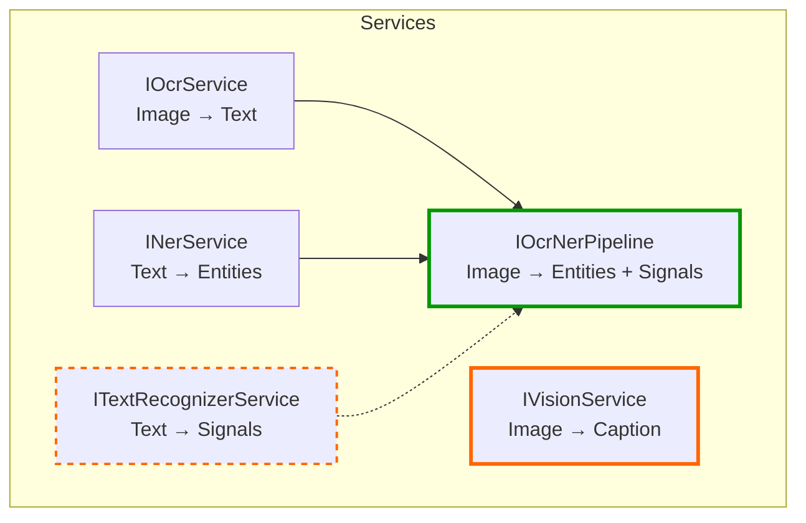
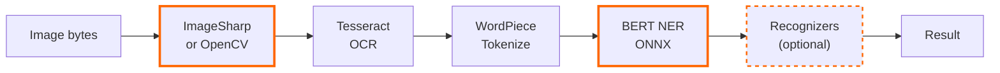
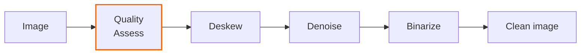
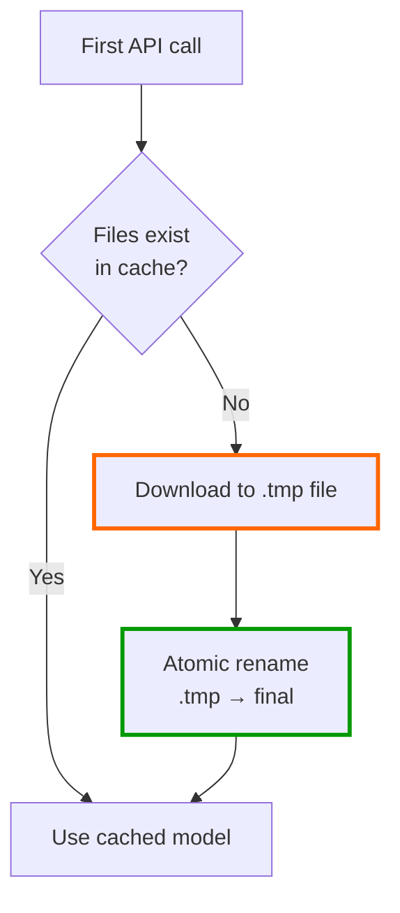
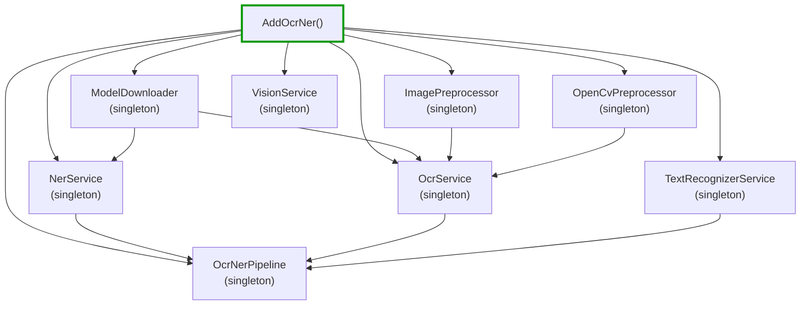
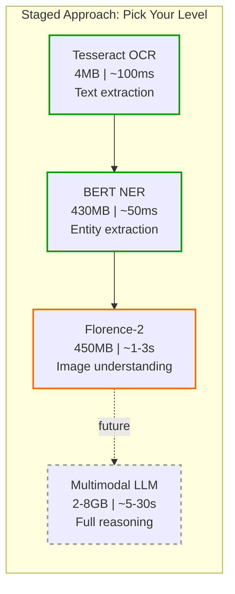

# Mostlylucid.OcrNer - The NuGet Package (Part 2)

<!-- category -- AI,OCR,NER,ONNX,CSharp,Tutorial,NuGet -->

<datetime class="hidden">2026-02-12T12:00</datetime>

[](https://www.nuget.org/packages/Mostlylucid.OcrNer/) [](https://www.nuget.org/packages/Mostlylucid.OcrNer/) [](https://github.com/scottgal/mostlylucidweb/releases?q=ocrner)


In [Part 1](/blog/simple-ocr-ner-extraction) I showed the raw pipeline: manually downloading models, writing a tokenizer, wiring up ONNX inference, and decoding BIO tags by hand. Educational, but a lot of plumbing to get right.

Now it's a NuGet package. **One line of setup, zero model downloads** - everything auto-downloads on first use.

> **Note:** This package is a simplified, focused tool for extracting text and entities from images. If you need a full multi-phase pipeline that can read text from *anything* (photos, documents, screenshots, handwriting, animated gifs and even videos) with fuzzy matching, OCR consensus, and structured extraction, check out [***lucid*RAG**](https://www.lucidrag.com) where the production-grade version of this pipeline lives.

[TOC]

---

## Quick Glossary (If You're New to This)

Before we dive in, here's what the key terms mean:

- **OCR** (Optical Character Recognition) - converting an image of text into actual text characters your code can work with. Think: photo of a receipt turns into a string of text.
- **NER** (Named Entity Recognition) - scanning text to find and classify names of things. "John Smith works at Microsoft in Seattle" becomes: John Smith = Person, Microsoft = Organization, Seattle = Location.
- **ONNX Runtime** - a way to run machine learning models (like the BERT model we use for NER) on your machine without needing Python, TensorFlow, or a GPU. It runs the model as a portable `.onnx` file, locally, using just your CPU.
- **BERT** - a pre-trained language model from Google that understands context in text. The NER variant has been fine-tuned on the [CoNLL-2003](https://www.clips.uantwerpen.be/conll2003/ner/) dataset to recognize people, organizations, locations, and miscellaneous entities.
- **Florence-2** - a small vision model from Microsoft that can describe what it *sees* in an image (captions, objects, text). Different from Tesseract in that it understands the whole scene, not just characters.

---

## Why More Than Plain Tesseract?

Tesseract is strong for clean document text, but it falls down on noisy photos, low-contrast scans, and mixed "scene + text" images. It also stops at raw text - you still need extra code to turn that text into structured entities you can actually use.

This package closes those gaps:

1. **[ImageSharp](https://sixlabors.com/products/imagesharp/) preprocessing** - grayscale, contrast boost, sharpening tuned for OCR
2. **[OpenCV](https://opencv.org/) advanced preprocessing** - deskew, denoise, and binarization for damaged/skewed documents (opt-in)
3. **[Florence-2](https://huggingface.co/microsoft/Florence-2-base)** vision - local image captioning and OCR via ONNX (no cloud API)
4. **BERT NER on top of OCR text** - convert extracted text into typed entities (PER/ORG/LOC/MISC) you can act on
5. **[Microsoft.Recognizers.Text](https://github.com/microsoft/Recognizers-Text)** - rule-based extraction of dates, numbers, URLs, phones, emails, and IPs (opt-in)
6. **Proper DI integration** - `AddOcrNer()` and you're done
7. **CLI tool** - A [Spectre.Console](https://spectreconsole.net/) command-line app that just works out of the box

---

## What Changed from Part 1

```mermaid
flowchart LR
    subgraph Part1["Part 1: Manual"]
        M1[Download models]
        M2[Write tokenizer]
        M3[Wire ONNX]
        M4[BIO decode]
    end

    subgraph Part2["Part 2: NuGet Package"]
        N1["AddOcrNer()"]
        N2[Auto-download]
        N3[ImageSharp + OpenCV]
        N4[Florence-2]
        N5[Recognizers]
        N6[CLI Tool]
    end

    Part1 -->|"packaged into"| Part2

    style N1 stroke:#090,stroke-width:3px
    style N2 stroke:#090,stroke-width:3px
    style N3 stroke:#f60,stroke-width:3px
    style N4 stroke:#f60,stroke-width:3px
    style N5 stroke:#f60,stroke-width:3px
    style N6 stroke:#f60,stroke-width:3px
```



Part 1 was educational - understanding what each piece does. Part 2 is practical - using it without thinking about the internals.

---

## Getting Started

### Install

```bash
dotnet add package Mostlylucid.OcrNer
```

### Register Services

The `AddOcrNer()` extension method registers everything: OCR, NER, the combined pipeline, Florence-2 vision, the model downloader, and the image preprocessor. All as singletons, all lazy-initialized.

Here's the actual registration code from `ServiceCollectionExtensions.cs`:

```csharp
// Option 1: From appsettings.json (reads the "OcrNer" section)
builder.Services.AddOcrNer(builder.Configuration);

// Option 2: Inline configuration
builder.Services.AddOcrNer(config =>
{
    config.EnableOcr = true;
    config.TesseractLanguage = "eng";
    config.MinConfidence = 0.5f;
});
```

That's it. No model downloads, no file paths, no ONNX wiring. Under the hood, `AddOcrNer()` registers these services:

```csharp
// From ServiceCollectionExtensions.cs - what gets registered
services.AddSingleton<ModelDownloader>();           // Auto-downloads models on first use
services.AddSingleton<ImagePreprocessor>();         // ImageSharp-based image enhancement
services.AddSingleton<OpenCvPreprocessor>();        // OpenCV advanced preprocessing
services.AddSingleton<INerService, NerService>();   // BERT NER from text
services.AddSingleton<IOcrService, OcrService>();   // Tesseract OCR from images
services.AddSingleton<IOcrNerPipeline, OcrNerPipeline>();         // Combined OCR + NER
services.AddSingleton<ITextRecognizerService, TextRecognizerService>(); // Microsoft.Recognizers
services.AddSingleton<IVisionService, VisionService>();           // Florence-2 vision
```

### Configuration (appsettings.json)

```json
{
  "OcrNer": {
    "EnableOcr": true,
    "TesseractLanguage": "eng",
    "MinConfidence": 0.5,
    "MaxSequenceLength": 512,
    "ModelDirectory": "models/ocrner",
    "Preprocessing": "Default",
    "EnableAdvancedPreprocessing": false,
    "EnableRecognizers": false,
    "RecognizerCulture": "en-us"
  }
}
```

Here's the actual `OcrNerConfig` class these map to:

```csharp
// From OcrNerConfig.cs
public class OcrNerConfig
{
    public string ModelDirectory { get; set; } =
        Path.Combine(AppContext.BaseDirectory, "models", "ocrner");
    public bool EnableOcr { get; set; } = true;
    public string TesseractLanguage { get; set; } = "eng";
    public int MaxSequenceLength { get; set; } = 512;
    public float MinConfidence { get; set; } = 0.5f;
    public string NerModelRepo { get; set; } = "protectai/bert-base-NER-onnx";
    public PreprocessingLevel Preprocessing { get; set; } = PreprocessingLevel.Default;
    public bool EnableAdvancedPreprocessing { get; set; } = false;  // OpenCV pipeline
    public bool EnableRecognizers { get; set; } = false;            // Microsoft.Recognizers
    public string RecognizerCulture { get; set; } = "en-us";       // Recognizer language
}
```

All settings have sensible defaults. You can omit the entire section and everything works. The two opt-in features (`EnableAdvancedPreprocessing` and `EnableRecognizers`) default to `false` so the package stays lightweight for users who don't need them.

The `Preprocessing` option controls image enhancement before OCR:

| Value | What it does | When to use |
|-------|-------------|-------------|
| `None` | No preprocessing | Images are already optimized |
| `Minimal` | Grayscale only | Clean scans |
| `Default` | Grayscale + contrast + sharpen | Most images (recommended) |
| `Aggressive` | Strong contrast + sharpen + upscale | Poor quality photos |

---

## The Four Services

The package registers five services, each usable independently. Pick the one that fits your use case - there's no need to load Florence-2 if all you need is NER from text.



### Choosing the Right Service for Your Use Case

The key principle is **efficiency**: pick the lightest tool that does the job. Don't load a 450MB vision model when a 4MB OCR engine will do.

| Service | What it does | Model size | Speed | Use when... |
|---------|-------------|------------|-------|-------------|
| `INerService` | BERT NER from text | ~430MB | ~50ms | You already have text (PDFs, databases, user input) |
| `IOcrService` | Tesseract OCR from images | ~4MB | ~100ms | You need text from document scans, screenshots |
| `IOcrNerPipeline` | OCR then NER in one call | Both models | ~150ms | You have images and want entities in one step |
| `ITextRecognizerService` | Rule-based extraction (dates, phones, etc.) | None | ~1ms | You want structured data alongside NER entities |
| `IVisionService` | Florence-2 captioning + OCR | ~450MB | ~1-3s | You need image understanding, not just text reading |

---

## NER from Text (No Images Needed)

If you already have text (from PDFs, databases, user input), you can use NER directly. This is the fastest path - no OCR, no image processing, just text in, entities out.

The `INerService` interface is simple - one method:

```csharp
// From INerService.cs
public interface INerService
{
    Task<NerResult> ExtractEntitiesAsync(string text, CancellationToken ct = default);
}
```

Here's how to use it in your own service:

```csharp
public class MyService
{
    private readonly INerService _nerService;

    public MyService(INerService nerService)
    {
        _nerService = nerService;
    }

    public async Task ProcessDocumentAsync(string text)
    {
        var result = await _nerService.ExtractEntitiesAsync(text);

        foreach (var entity in result.Entities)
        {
            // entity.Label: "PER", "ORG", "LOC", or "MISC"
            // entity.Text: "John Smith"
            // entity.Confidence: 0.9996
            // entity.StartOffset / EndOffset: character positions in the source
        }
    }
}
```

The result models are straightforward:

```csharp
// From NerResult.cs / NerEntity.cs
public class NerResult
{
    public string SourceText { get; init; } = string.Empty;
    public List<NerEntity> Entities { get; init; } = [];
}

public class NerEntity
{
    public string Text { get; init; } = string.Empty;     // "John Smith"
    public string Label { get; init; } = string.Empty;    // "PER", "ORG", "LOC", "MISC"
    public float Confidence { get; init; }                 // 0.0 to 1.0
    public int StartOffset { get; init; }                  // Where in the source text
    public int EndOffset { get; init; }                    // End position (exclusive)
}
```

The first call downloads the BERT NER model (~430MB) from HuggingFace. Subsequent calls use the cached model - startup is instant.

---

## OCR + NER Pipeline

For images, the pipeline handles preprocessing, OCR, and NER in one call. The `IOcrNerPipeline` combines `IOcrService` and `INerService`:

```csharp
// From OcrNerPipeline.cs - the actual pipeline code
public async Task<OcrNerResult> ProcessImageAsync(string imagePath, CancellationToken ct = default)
{
    // Step 1: OCR (includes preprocessing automatically)
    var ocrResult = await _ocrService.ExtractTextAsync(imagePath, ct);

    if (string.IsNullOrWhiteSpace(ocrResult.Text))
        return new OcrNerResult
        {
            OcrResult = ocrResult,
            NerResult = new NerResult { SourceText = string.Empty }
        };

    // Step 2: NER on extracted text
    var nerResult = await _nerService.ExtractEntitiesAsync(ocrResult.Text, ct);

    return new OcrNerResult
    {
        OcrResult = ocrResult,
        NerResult = nerResult
    };
}
```

Using it:

```csharp
var pipeline = serviceProvider.GetRequiredService<IOcrNerPipeline>();

var result = await pipeline.ProcessImageAsync("invoice.png");

// What OCR found
var text = result.OcrResult.Text;           // The full extracted text
var confidence = result.OcrResult.Confidence; // 0.0 to 1.0

// What NER found in that text
foreach (var entity in result.NerResult.Entities)
{
    // [PER] John Smith, [ORG] Microsoft, [LOC] Seattle...
}
```

### What Happens Under the Hood



---

## Image Preprocessing

Part 1 had raw Tesseract calls. In practice, both Tesseract and Florence-2 work better with preprocessed images. Preprocessing is **on by default** but completely optional - you can disable it with `Preprocessing = "None"` in config or `--preprocess none` on the CLI.

The `ImagePreprocessor` uses **ImageSharp** (pure C#, no native dependencies):

```csharp
// From ImagePreprocessor.cs - the actual preprocessing steps
public byte[] Preprocess(byte[] imageBytes, PreprocessingOptions? options = null)
{
    options ??= PreprocessingOptions.Default;
    using var image = Image.Load<Rgba32>(imageBytes);

    image.Mutate(ctx =>
    {
        // Step 1: Upscale small images (Tesseract wants 300+ DPI equivalent)
        if (options.EnableUpscale && (image.Width < options.MinWidth || image.Height < options.MinHeight))
        {
            var scale = Math.Max(
                (float)options.MinWidth / image.Width,
                (float)options.MinHeight / image.Height);
            scale = Math.Min(scale, options.MaxUpscaleFactor);
            ctx.Resize((int)(image.Width * scale), (int)(image.Height * scale),
                KnownResamplers.Lanczos3);
        }

        // Step 2: Grayscale (single channel = faster, more accurate)
        if (options.EnableGrayscale)
            ctx.Grayscale();

        // Step 3: Contrast boost (text stands out from background)
        if (options.EnableContrast && options.ContrastAmount != 1.0f)
            ctx.Contrast(options.ContrastAmount);

        // Step 4: Sharpen (crisp character edges)
        if (options.EnableSharpen)
            ctx.GaussianSharpen(options.SharpenSigma);
    });

    using var ms = new MemoryStream();
    image.SaveAsPng(ms);  // PNG = lossless, no additional artifacts
    return ms.ToArray();
}
```

Three presets are built in. The `PreprocessingOptions` class defines them:

```csharp
// From ImagePreprocessor.cs
public static PreprocessingOptions Default => new();  // Grayscale + 1.5x contrast + sharpen

public static PreprocessingOptions Minimal => new()   // Grayscale only
{
    EnableContrast = false,
    EnableSharpen = false,
    EnableUpscale = false
};

public static PreprocessingOptions Aggressive => new() // For poor quality images
{
    ContrastAmount = 1.8f,
    SharpenSigma = 1.5f,
    MinWidth = 1024,
    MinHeight = 768,
    MaxUpscaleFactor = 4.0f
};
```

| Preset | When to use | What it does |
|--------|------------|--------------|
| `Default` | Most images | Grayscale + 1.5x contrast + light sharpen |
| `Minimal` | Clean scans | Grayscale only |
| `Aggressive` | Poor quality photos | 1.8x contrast + strong sharpen + larger upscale |

### Advanced Preprocessing with OpenCV

For seriously degraded documents - skewed scans, noisy photos, faded historical pages - the ImageSharp pipeline isn't enough. Enable `EnableAdvancedPreprocessing` to switch to a full OpenCV pipeline ported from [ImageSummarizer](https://github.com/scottgal/lucidrag).

The OpenCV preprocessor chains four stages, each driven by an automatic quality assessment:



**Quality Assessment** (`ImageQualityAssessor`) measures blur, skew angle, noise level, contrast, brightness uniformity, and text density. Based on the results, it recommends which stages to apply - so clean images skip unnecessary processing.

**Deskew** (`SkewCorrector`) corrects rotated documents using three methods: Hough line detection (default), minimum area rectangle, or projection profile analysis.

**Denoise** (`NoiseReducer`) offers Gaussian blur (fast), bilateral filter (edge-preserving), non-local means (highest quality), and morphological operations.

**Binarize** (`InkExtractor`) converts to clean black-and-white using Otsu, adaptive thresholding, Sauvola (for degraded historical documents), CLAHE + Otsu (for low contrast), or morphological background removal.

Enable it in config or on the CLI:

```csharp
config.EnableAdvancedPreprocessing = true;
```

```bash
ocrner ocr damaged-scan.png -a
```

---

## Microsoft.Recognizers: Rule-Based Entity Extraction

BERT NER finds people, organizations, locations, and miscellaneous entities. But some structured data - dates, phone numbers, emails, URLs, IP addresses - is better caught by deterministic rules than by a neural network.

Enable `EnableRecognizers` to add a second extraction pass using [Microsoft.Recognizers.Text](https://github.com/microsoft/Recognizers-Text). This runs **after** NER and extracts:

| Type | Examples |
|------|----------|
| DateTime | "January 15, 2024", "next Tuesday", "last week" |
| Number | "42", "three million", "15%" |
| URL | "https://example.com", "www.github.com" |
| Phone | "555-1234", "+1 (555) 123-4567" |
| Email | "john@microsoft.com" |
| IP Address | "192.168.1.1" |

The recognizer supports multiple cultures (en-us, en-gb, de-de, fr-fr, etc.) so it handles locale-specific date formats and number conventions.

```csharp
config.EnableRecognizers = true;
config.RecognizerCulture = "en-us";
```

```bash
ocrner ner "John Smith joined Microsoft on January 15, 2024. Call 555-1234." -r
```

The two extraction methods complement each other: BERT NER understands context ("Apple" the company vs. "apple" the fruit), while the recognizers reliably catch structured patterns that BERT might miss. The `OcrNerResult` model now includes an optional `Signals` property:

```csharp
public class OcrNerResult
{
    public OcrResult OcrResult { get; init; } = new();
    public NerResult NerResult { get; init; } = new();
    public RecognizedSignals? Signals { get; init; }  // Only when EnableRecognizers = true
}
```

---

## Florence-2 Vision

Florence-2 is a completely different approach from Tesseract. Where Tesseract is a specialized OCR engine that reads text character by character, Florence-2 is a **vision model** that understands the whole image - objects, scenes, people, and text.

```csharp
// From IVisionService.cs
public interface IVisionService
{
    Task<VisionCaptionResult> CaptionAsync(string imagePath, bool detailed = true,
        CancellationToken ct = default);
    Task<VisionOcrResult> ExtractTextAsync(string imagePath,
        CancellationToken ct = default);
    Task<bool> IsAvailableAsync(CancellationToken ct = default);
}
```

Using it:

```csharp
var vision = serviceProvider.GetRequiredService<IVisionService>();

// Generate a caption describing the image
var caption = await vision.CaptionAsync("photo.jpg", detailed: true);
if (caption.Success)
{
    // caption.Caption: "A man in a blue suit standing at a podium"
    // caption.DurationMs: how long it took
}

// Extract visible text using Florence-2's built-in OCR
var ocrResult = await vision.ExtractTextAsync("screenshot.png");
if (ocrResult.Success)
{
    // ocrResult.Text: the visible text Florence-2 detected
}
```

### When to Use Which

| Use case | Tesseract (`IOcrService`) | Florence-2 (`IVisionService`) |
|----------|--------------------------|-------------------------------|
| **Document scans** | Best choice - fast, accurate | OK but overkill |
| **Photos of signs** | Decent | Better - understands scene context |
| **Screenshots** | Good | Good |
| **Image captioning** | Can't do this | Best choice |
| **Speed** | Fast (~100ms) | Slower (~1-3s) |
| **Model size** | ~4MB | ~450MB |

The point is **efficiency**: use Tesseract for documents and text extraction (it's 10x faster with a 100x smaller model). Use Florence-2 when you actually need image *understanding*.

Florence-2 auto-downloads its models (~450MB) on first use to `{ModelDirectory}/florence2/`.

---

## How the NER Pipeline Works Internally

The NER pipeline follows the same three-step process covered in detail in [Part 1](/blog/simple-ocr-ner-extraction): **tokenize → infer → decode**. Part 1 walks through every concept — WordPiece tokenization, ONNX tensor inference, BIO tag decoding, softmax confidence — from scratch with a complete buildable example.

Here's what the package adds beyond the manual approach:

### Offset Tracking

Part 1's tokenizer converts text to token IDs. The package's `BertNerTokenizer` also tracks **character offsets** — so you know exactly where in the source text each entity was found:

```csharp
// From BertNerTokenizer.cs
// "John Smith works at Microsoft" becomes:
// [CLS] John Smith works at Micro ##soft [SEP] [PAD] ...
//
// Each token tracks its source position:
// "John"     → chars 0-4
// "Smith"    → chars 5-10
// "Micro"    → chars 20-29  (WordPiece splits "Microsoft")
// "##soft"   → chars 20-29  (same source range)
```

This is how `NerEntity.StartOffset` and `EndOffset` work — they map back to exact character positions in your original text.

### Confidence-Filtered Entity Extraction

Part 1's decoder produces all entities. The package filters during decoding — low-confidence noise never reaches your code:

```csharp
// From NerService.cs
private void FlushEntity(
    List<NerEntity> entities, string text,
    string type, int start, int end, float confidence)
{
    if (confidence < _config.MinConfidence) return;  // Filter low-confidence

    var entityText = text[start..end].Trim();
    if (string.IsNullOrWhiteSpace(entityText)) return;

    entities.Add(new NerEntity
    {
        Text = entityText,
        Label = type,
        Confidence = confidence,
        StartOffset = start,
        EndOffset = end
    });
}
```

---

## Auto-Download: How It Works

All models download automatically on first use. No manual setup needed.



The `ModelDownloader` downloads from HuggingFace (NER model) and GitHub (tessdata). It uses an atomic `.tmp` pattern - if a download is interrupted, no corrupt files are left behind:

```csharp
// From ModelDownloader.cs - atomic download pattern
await using var fileStream = new FileStream(tempPath, FileMode.Create,
    FileAccess.Write, FileShare.None, 81920, true);
// ... stream download to .tmp file ...
await fileStream.FlushAsync(ct);
fileStream.Close();

File.Move(tempPath, localPath, overwrite: true);  // Atomic rename
```

Default cache location: `{AppBaseDir}/models/ocrner/`

```text
models/ocrner/
  ner/
    model.onnx      (~430MB - BERT NER)
    vocab.txt       (~230KB - WordPiece vocabulary)
    config.json     (~1KB - label mapping)
  tessdata/
    eng.traineddata (~4MB - English OCR data)
  florence2/
    ...             (~450MB - Vision model files)
```

---

## Architecture

Everything is a singleton with lazy initialization. Expensive resources (ONNX `InferenceSession`, `TesseractEngine`, Florence-2 model) are created once on first use and reused for the lifetime of the application.



Thread safety: all services use `SemaphoreSlim` for initialization. Multiple threads calling the service simultaneously on first use will only trigger one download/load:

```csharp
// From NerService.cs - lazy init pattern used by all services
private async Task EnsureInitializedAsync(CancellationToken ct)
{
    if (_initialized) return;           // Fast path: already loaded

    await _initLock.WaitAsync(ct);      // Only one thread enters
    try
    {
        if (_initialized) return;       // Double-check after lock

        var paths = await _downloader.EnsureNerModelAsync(ct);
        _tokenizer = new BertNerTokenizer(paths.VocabPath, _config.MaxSequenceLength);
        _session = new InferenceSession(paths.ModelPath, sessionOptions);
        _initialized = true;
    }
    finally { _initLock.Release(); }
}
```

---

## CLI Tool

The repo includes a command-line tool built with [Spectre.Console](https://spectreconsole.net/). It's designed as a "pit of success" - just pass your input and it works.

### Quick Start

```bash
# NER from text (auto-detected)
ocrner "John Smith works at Microsoft in Seattle"

# OCR from an image (auto-detected)
ocrner invoice.png

# Explicit commands
ocrner ner "Marie Curie won the Nobel Prize in Stockholm"
ocrner ocr scan.png
ocrner caption photo.jpg
```

**Smart routing**: the CLI auto-detects your intent. From `Program.cs`:

```csharp
// From Program.cs - smart routing logic
if (IsImageFile(args2[0]) || IsGlobPattern(args2[0]) || Directory.Exists(args2[0]))
{
    args2 = ["ocr", .. args2];   // Image file → ocr command
}
else
{
    args2 = ["ner", .. args2];   // Text string → ner command
}
```

If you pass a text string, it runs NER. If you pass an image file, glob, or directory, it runs OCR + NER. No command needed.

### Three Commands

| Command | What it does | Engine | Speed |
|---------|-------------|--------|-------|
| `ner <text>` | Extract entities from text | BERT NER (ONNX) | ~50ms |
| `ocr <path>` | OCR + NER from images | Tesseract + BERT | ~100-300ms |
| `caption <path>` | Image captioning + optional OCR | Florence-2 (ONNX) | ~1-3s |

**Tesseract is the default OCR engine** because it's 5-10x faster and optimized for document text. Florence-2 is for when you need image understanding (captions, scene text, photos of signs).

### Real Output

Here's actual output from running the CLI against real sample documents.

**NER from text:**

```bash
ocrner ner "Marie Curie won the Nobel Prize in Stockholm"
```

```text
╭──────┬─────────────┬────────────┬──────────╮
│ Type │ Entity      │ Confidence │ Position │
├──────┼─────────────┼────────────┼──────────┤
│ PER  │ Marie Curie │ 100%       │ 0-11     │
│ MISC │ Nobel Prize │ 100%       │ 20-31    │
│ LOC  │ Stockholm   │ 100%       │ 35-44    │
╰──────┴─────────────┴────────────┴──────────╯
```

**NER with recognizers** - combining BERT entities with rule-based signal extraction:

```bash
ocrner ner "Shelby Lucier from SCS Agency in Cambridge, UK sent an invoice on 13/02/15. Call 07981423683." -r
```

```text
╭──────┬───────────────┬────────────┬──────────╮
│ Type │ Entity        │ Confidence │ Position │
├──────┼───────────────┼────────────┼──────────┤
│ PER  │ Shelby Lucier │ 100%       │ 0-13     │
│ ORG  │ SCS Agency    │ 100%       │ 19-29    │
│ LOC  │ Cambridge     │ 100%       │ 33-42    │
│ LOC  │ UK            │ 100%       │ 44-46    │
╰──────┴───────────────┴────────────┴──────────╯

── Recognized Signals ─────────────────────────
  Type       Text          Details
  DateTime   13/02/15      datetimeV2.date
  Phone      07981423683
```

BERT finds the people, organizations, and locations. The recognizers catch the date and phone number — structured patterns that a neural network would be unreliable at extracting.

**OCR from a scanned document** (an Amazon shareholder letter, scanned with hole-punch marks):

```bash
ocrner ocr shareholder-letter.jpg -q
```

```text
╭──────┬───────────────┬────────────┬──────────╮
│ Type │ Entity        │ Confidence │ Position │
├──────┼───────────────┼────────────┼──────────┤
│ ORG  │ Amazon        │ 87%        │ 285-291  │
│ PER  │ Jeff          │ 99%        │ 293-297  │
│ ORG  │ AWS           │ 95%        │ 984-987  │
│ LOC  │ America       │ 98%        │ 2315-2322│
╰──────┴───────────────┴────────────┴──────────╯
OCR Confidence: 89%
```

Tesseract extracts near-verbatim text from the scanned letter at 89% confidence, and NER correctly identifies Amazon, Jeff (Bezos), AWS, and North America.

### Tesseract vs Florence-2: A Real Comparison

Same scanned shareholder letter processed by both engines:

| | Tesseract (`ocrner ocr`) | Florence-2 (`ocrner caption --ocr`) |
|---|---|---|
| **Speed** | ~200ms | ~14s |
| **OCR accuracy** | Near-verbatim, 89% confidence | Heavily garbled, hallucinated phrases |
| **Key text** | "Over the past 25 years at Amazon, I've had the opportunity..." | "Over the past 25 years at Amazon. I've had the opportunity to write many narrative, email..." |
| **NER entities** | Jeff (PER), Amazon (ORG), AWS (ORG), America (LOC) | N/A (text too garbled for reliable NER) |
| **Caption** | N/A | "A paper with some text" |

Florence-2 is a **vision** model — it understands scenes, objects, and spatial relationships. It was never designed to compete with Tesseract at reading document text. Use it when you need image *understanding* (what's in this photo?), not text *extraction* (what does this document say?).

### JSON Output for Automation & LLM Tools

The `--json` flag outputs structured JSON to stdout with all logging suppressed — designed for piping into other tools, LLM function calling, or automation scripts:

```bash
ocrner ner "Shelby Lucier from SCS Agency in Cambridge, UK sent an invoice on 13/02/15. Call 07981423683." -r --json
```

```json
{
  "command": "ner",
  "success": true,
  "sourceText": "Shelby Lucier from SCS Agency in Cambridge, UK...",
  "entityCount": 4,
  "entities": [
    { "type": "PER", "text": "Shelby Lucier", "confidence": 0.9996, "startOffset": 0, "endOffset": 13 },
    { "type": "ORG", "text": "SCS Agency", "confidence": 0.999, "startOffset": 19, "endOffset": 29 },
    { "type": "LOC", "text": "Cambridge", "confidence": 0.9975, "startOffset": 33, "endOffset": 42 },
    { "type": "LOC", "text": "UK", "confidence": 0.9991, "startOffset": 44, "endOffset": 46 }
  ],
  "signals": {
    "dateTimes": [{ "text": "13/02/15", "typeName": "datetimeV2.date" }],
    "phoneNumbers": [{ "text": "07981423683" }]
  }
}
```

This makes the CLI usable as a **tool** for LLMs and agents. An LLM can call `ocrner ner "..." --json`, parse the JSON response, and reason over the structured entities — no custom code needed. Pipe into `jq`, feed to an agent framework, or read from any language:

```bash
# Pipe to jq for quick filtering
ocrner ocr invoice.png --json | jq '.results[0].entities[] | select(.type == "PER")'

# Use from Python, Node, or any language that can shell out
echo "John Smith at Microsoft" | ocrner ner --json
```

To save to a file instead, use `-o` with a `.json` extension — same structured data, written to disk:

```bash
ocrner ocr "scans/*.png" -o results.json
```

### Batch Processing

Process multiple images with glob patterns or directories:

```bash
# All PNGs in a directory
ocrner ocr "scans/*.png" -o results.json

# All images in a folder
ocrner ocr ./documents/

# Batch captioning with Florence-2
ocrner caption "photos/*.jpg" --ocr -o captions.md
```

### All CLI Options

| Flag | Applies to | Description |
|------|------------|-------------|
| `--json` | `ner`, `ocr`, `caption` | Structured JSON to stdout (implies `--quiet`, suppresses all logging) |
| `-c` | `ner`, `ocr` | Minimum entity confidence threshold (0.0-1.0) |
| `--language` | `ocr` | Tesseract language (for example `eng`, `fra`) |
| `--max-tokens` | `ner`, `ocr` | Maximum BERT sequence length |
| `--model-dir` | `ner`, `ocr`, `caption` | Model cache directory override |
| `-p`, `--preprocess` | `ocr`, `caption` | Preprocessing preset: `none`, `minimal`, `default`, `aggressive` |
| `-a`, `--advanced-preprocess` | `ocr`, `caption` | Use OpenCV preprocessing (deskew, denoise, binarize) |
| `-r`, `--recognizers` | `ner`, `ocr` | Enable rule-based extraction (dates, numbers, URLs, phones, emails, IPs) |
| `--culture` | `ner`, `ocr` | Recognizer culture, e.g. `en-us`, `de-de` (default: `en-us`) |
| `--brief` | `caption` | Generate a shorter, less detailed caption |
| `-q`, `--quiet` | `ner`, `ocr`, `caption` | Quiet mode (reduced console output) |
| `-o` | `ner`, `ocr`, `caption` | Output file path (`.txt`, `.md`, `.json`) |
| `--ocr` | `caption` | Also run OCR during caption command |
| `--ner` | `caption` | Extract NER from OCR text (implies `--ocr`) |

---

## Performance: Quantized Models and What's Next

The current NER model is the full-precision `protectai/bert-base-NER-onnx` (~430MB). For many use cases - especially on resource-constrained machines or when processing high volumes - a **quantized** (INT8) version of the same model would be significantly faster with minimal accuracy loss.

ONNX Runtime supports INT8 quantization out of the box, which typically reduces model size by ~4x and improves inference speed by 2-3x on CPU. This is on the roadmap. The `NerModelRepo` config option already supports pointing to a different HuggingFace repo, so when a quantized model is published you'd just change:

```json
{
  "OcrNer": {
    "NerModelRepo": "protectai/bert-base-NER-onnx-quantized"
  }
}
```

The architecture is designed for this - swap the model, keep the same API.

---

## The Bigger Picture: Where This Fits

This package is a **single-stage pipeline**: one OCR engine, one NER model, one optional vision model. It's designed to be simple and efficient for the common case.

For more complex scenarios - reading text from *anything* (handwritten notes, photos of whiteboards, low-quality camera captures), with multi-engine OCR consensus, fuzzy matching, and structured extraction - check out the full pipeline at [***lucid*RAG**](https://www.lucidrag.com). That's where the production-grade, multi-phase version of this work lives.

### What's Next: Multimodal LLMs

Florence-2 is the current ceiling for local vision in this package. The next logical step is a **multimodal LLM** - a model that can see an image *and* reason about it in natural language. Instead of separate OCR + NER steps, you'd send the image directly and ask for structured extraction.

Here's roughly what that API could look like:

```csharp
// Hypothetical future IMultimodalService
public interface IMultimodalService
{
    Task<StructuredExtractionResult> ExtractAsync(
        string imagePath,
        string prompt = "Extract all people, organizations, and locations from this image. Return as JSON.",
        CancellationToken ct = default);
}

// Usage
var multimodal = serviceProvider.GetRequiredService<IMultimodalService>();
var result = await multimodal.ExtractAsync("business-card.jpg");

// result.Entities: [{ "John Smith", PER }, { "Acme Corp", ORG }, { "New York", LOC }]
// result.RawText: "John Smith, VP Engineering, Acme Corp, New York, NY 10001"
// result.Summary: "Business card for John Smith at Acme Corp in New York"
```

Small local multimodal models (like [Phi-3.5-vision](https://huggingface.co/microsoft/Phi-3.5-vision-instruct) or [LLaVA](https://llava-vl.github.io/)) are getting good enough for this. The trade-off is always the same: bigger model = smarter but slower. The right choice depends on your latency budget and accuracy requirements.



Each tier adds capability at the cost of size and latency. The package currently covers tiers 1-3. Tier 4 is where multimodal LLMs come in - and where [***lucid*RAG**](https://www.lucidrag.com) is heading.

---

## Resources

**This Package**:
- **[Mostlylucid.OcrNer on NuGet](https://www.nuget.org/packages/Mostlylucid.OcrNer)** - Install it
- **[Source Code](https://github.com/scottgal/mostlylucidweb/tree/main/Mostlylucid.OcrNer)** - Browse the implementation

**Part 1**:
- **[Simple OCR and NER Feature Extraction](/blog/simple-ocr-ner-extraction)** - The tutorial that explains every piece

**Dependencies**:
- **[Tesseract.NET](https://github.com/charlesw/tesseract)** - C# wrapper for Tesseract OCR
- **[BERT-base-NER ONNX](https://huggingface.co/protectai/bert-base-NER-onnx)** - The NER model
- **[Florence-2](https://www.nuget.org/packages/Florence2)** - Vision model NuGet package
- **[ImageSharp](https://sixlabors.com/products/imagesharp/)** - Cross-platform image processing
- **[OpenCvSharp4](https://github.com/shimat/opencvsharp)** - OpenCV wrapper for advanced preprocessing
- **[Microsoft.Recognizers.Text](https://github.com/microsoft/Recognizers-Text)** - Rule-based entity extraction
- **[ONNX Runtime](https://onnxruntime.ai/)** - Cross-platform model inference

**Related Articles**:
- **[The Three-Tier OCR Pipeline](/blog/constrained-fuzzy-image-ocr-pipeline)** - When you need more than simple OCR
- **[Reduced RAG](/blog/reduced-rag-concept)** - Where extracted entities fit in the bigger picture
- **[*lucid*RAG](https://www.lucidrag.com)** - The full multi-phase production pipeline
