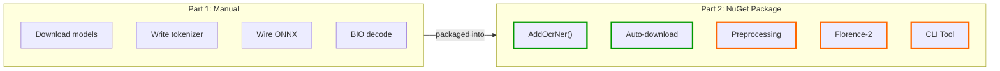
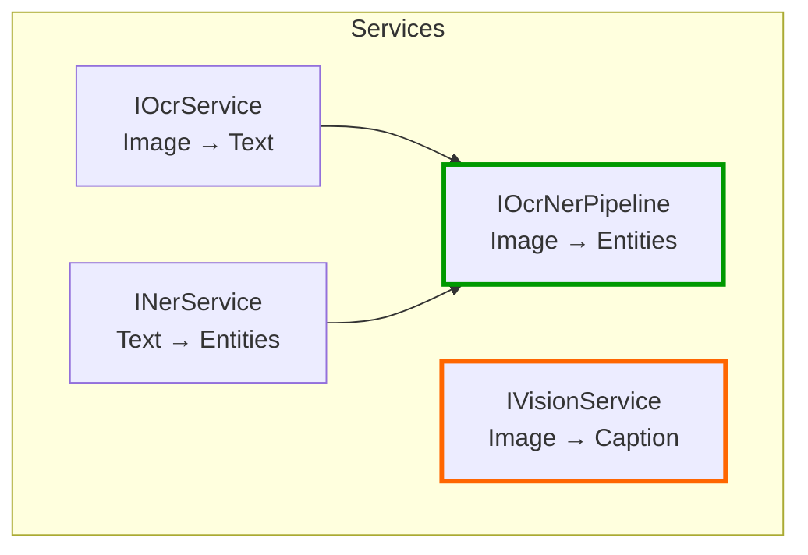
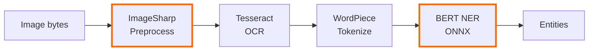
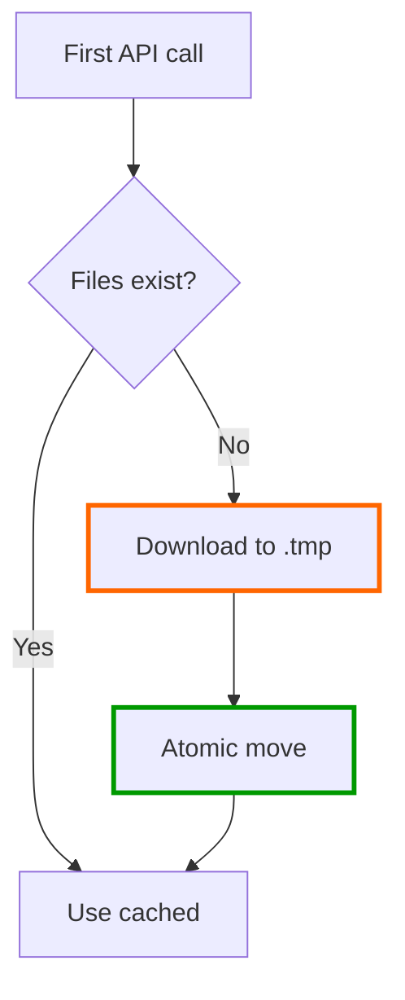
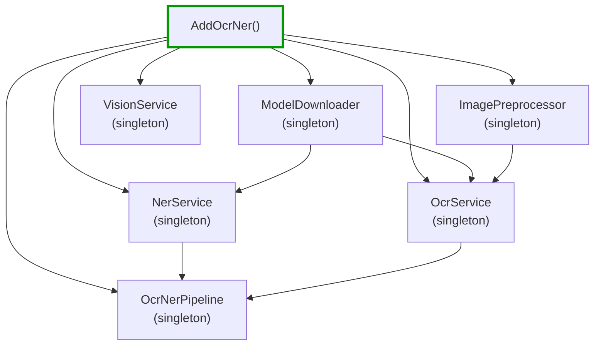

# Mostlylucid.OcrNer - The NuGet Package (Part 2)

<!-- category -- AI,OCR,NER,ONNX,CSharp,Tutorial,NuGet -->

<datetime class="hidden">2026-02-06T12:00</datetime>

In [Part 1](/blog/simple-ocr-ner-extraction) I showed the raw pipeline: Tesseract for OCR, BERT NER via ONNX for entity extraction. Copy-paste code, manual model downloads, wiring everything up yourself.

Now it's a NuGet package. **One line of setup, zero model downloads** - everything auto-downloads on first use.

This part also adds four things the original didn't have:

1. **ImageSharp preprocessing** - grayscale, contrast boost, sharpening tuned for OCR (both Tesseract and Florence-2)
2. **Florence-2 vision** - local image captioning and OCR via ONNX (no cloud API)
3. **Proper DI integration** - `AddOcrNer()` and you're done
4. **CLI tool** - A Spectre.Console command-line app that just works out of the box

[TOC]

---

## What Changed from Part 1



Part 1 was educational - understanding what each piece does. Part 2 is practical - using it without thinking about the internals.

---

## Getting Started

### Install

```bash
dotnet add package Mostlylucid.OcrNer
```

### Register Services

```csharp
// In Program.cs
builder.Services.AddOcrNer(builder.Configuration);
```

Or configure inline:

```csharp
builder.Services.AddOcrNer(config =>
{
    config.EnableOcr = true;
    config.TesseractLanguage = "eng";
    config.MinConfidence = 0.5f;
});
```

That's it. No model downloads, no file paths, no ONNX wiring.

### Configuration (appsettings.json)

```json
{
  "OcrNer": {
    "EnableOcr": true,
    "TesseractLanguage": "eng",
    "MinConfidence": 0.5,
    "MaxSequenceLength": 512,
    "ModelDirectory": "models/ocrner",
    "Preprocessing": "Default"
  }
}
```

The `Preprocessing` option controls image enhancement before OCR. It improves results for both Tesseract and Florence-2:

| Value | What it does | When to use |
|-------|-------------|-------------|
| `None` | No preprocessing | Images are already optimized |
| `Minimal` | Grayscale only | Clean scans |
| `Default` | Grayscale + contrast + sharpen | Most images (recommended) |
| `Aggressive` | Strong contrast + sharpen + upscale | Poor quality photos |

All settings have sensible defaults. You can omit the entire section and everything works.

---

## The Four Services

The package registers four services, each usable independently:



| Service | What it does | Model size |
|---------|-------------|------------|
| `INerService` | BERT NER from text | ~430MB (auto-downloaded) |
| `IOcrService` | Tesseract OCR from images | ~4MB tessdata (auto-downloaded) |
| `IOcrNerPipeline` | OCR then NER in one call | Both models |
| `IVisionService` | Florence-2 captioning + OCR | ~450MB (auto-downloaded) |

---

## NER from Text (No Images Needed)

If you already have text (from PDFs, databases, user input), you can use NER directly:

```csharp
public class MyService
{
    private readonly INerService _nerService;

    public MyService(INerService nerService)
    {
        _nerService = nerService;
    }

    public async Task ProcessDocumentAsync(string text)
    {
        var result = await _nerService.ExtractEntitiesAsync(text);

        foreach (var entity in result.Entities)
        {
            // entity.Label: "PER", "ORG", "LOC", or "MISC"
            // entity.Text: "John Smith"
            // entity.Confidence: 0.95
            // entity.StartOffset / EndOffset: character positions
            Console.WriteLine($"[{entity.Label}] {entity.Text} ({entity.Confidence:P0})");
        }
    }
}
```

The first call downloads the BERT NER model (~430MB). Subsequent calls use the cached model.

---

## OCR + NER Pipeline

For images, the pipeline handles preprocessing, OCR, and NER in one call:

```csharp
// Resolve from your service provider
var pipeline = serviceProvider.GetRequiredService<IOcrNerPipeline>();

var result = await pipeline.ProcessImageAsync("invoice.png");

// What OCR found
Console.WriteLine($"OCR text: {result.OcrResult.Text}");
Console.WriteLine($"OCR confidence: {result.OcrResult.Confidence:P0}");

// What NER found in that text
foreach (var entity in result.NerResult.Entities)
{
    Console.WriteLine($"[{entity.Label}] {entity.Text}");
}
```

### What Happens Under the Hood



---

## Image Preprocessing

Part 1 had raw Tesseract calls. In practice, both Tesseract and Florence-2 work better with preprocessed images. Preprocessing is **on by default** but completely optional - you can disable it with `Preprocessing = "None"` in config or `--preprocess none` on the CLI.

The package includes an `ImagePreprocessor` that uses **ImageSharp** (pure C#, no native dependencies) to prepare images:

1. **Upscale** small images (Tesseract wants 300+ DPI equivalent)
2. **Grayscale** conversion (single channel = faster, more accurate)
3. **Contrast boost** (text stands out from background)
4. **Sharpen** (crisp character edges)

```csharp
// The preprocessor is used automatically by IOcrService.
// You can also use it directly:
var preprocessor = serviceProvider.GetRequiredService<ImagePreprocessor>();

// Default options: grayscale + 1.5x contrast + light sharpen
var defaultProcessed = preprocessor.PreprocessFile("scan.png");

// For poor quality images:
var aggressiveProcessed = preprocessor.PreprocessFile("photo.png", PreprocessingOptions.Aggressive);

// Minimal (already clean scans):
var minimalProcessed = preprocessor.PreprocessFile("clean.png", PreprocessingOptions.Minimal);
```

### Preprocessing Options

```csharp
// Custom options
var options = new PreprocessingOptions
{
    EnableGrayscale = true,      // Convert to grayscale
    EnableContrast = true,       // Boost contrast
    ContrastAmount = 1.5f,       // 1.0 = no change, 1.5 = 50% more
    EnableSharpen = true,        // Sharpen edges
    SharpenSigma = 1.0f,         // 0.5 = subtle, 3.0 = aggressive
    EnableUpscale = true,        // Upscale tiny images
    MinWidth = 640,              // Upscale trigger threshold
    MaxUpscaleFactor = 3.0f,     // Maximum 3x upscale
};
```

Three presets are built in:

| Preset | When to use | What it does |
|--------|------------|--------------|
| `Default` | Most images | Grayscale + 1.5x contrast + light sharpen |
| `Minimal` | Clean scans | Grayscale only |
| `Aggressive` | Poor quality photos | 1.8x contrast + strong sharpen + larger upscale |

---

## Florence-2 Vision

Florence-2 is a completely different approach from Tesseract. Where Tesseract is a specialized OCR engine that reads text character by character, Florence-2 is a **vision model** that understands the whole image - objects, scenes, people, and text.

Both engines benefit from the ImageSharp preprocessing pipeline (contrast, sharpening, upscaling). The preprocessing is applied automatically for Tesseract; for Florence-2 you can enable it via the `--preprocess` flag or in code.

```csharp
var vision = serviceProvider.GetRequiredService<IVisionService>();

// Generate a caption
var caption = await vision.CaptionAsync("photo.jpg", detailed: true);
if (caption.Success)
{
    Console.WriteLine($"Caption: {caption.Caption}");
    // "A man in a blue suit standing at a podium with a Microsoft logo"
}

// Extract visible text (Florence-2's built-in OCR)
var ocrResult = await vision.ExtractTextAsync("screenshot.png");
if (ocrResult.Success)
{
    Console.WriteLine($"Text: {ocrResult.Text}");
}
```

### When to Use Which

| Use | Tesseract (`IOcrService`) | Florence-2 (`IVisionService`) |
|-----|--------------------------|-------------------------------|
| **Document scans** | Best choice | OK but slower |
| **Photos of signs** | Decent | Better |
| **Screenshots** | Good | Good |
| **Image captioning** | Can't do this | Best choice |
| **Speed** | Fast (~100ms) | Slower (~1-3s) |
| **Model size** | ~4MB | ~450MB |

Florence-2 auto-downloads its models (~450MB) on first use to `{ModelDirectory}/florence2/`.

---

## Auto-Download: How It Works

All three models download automatically. No manual setup needed.



Downloads use an atomic `.tmp` pattern - if a download is interrupted, no corrupt files are left behind. Just restart and it retries cleanly.

Default cache location: `{AppBaseDir}/models/ocrner/`

```text
models/ocrner/
  ner/
    model.onnx      (~430MB - BERT NER)
    vocab.txt       (~230KB - WordPiece vocabulary)
    config.json     (~1KB - label mapping)
  tessdata/
    eng.traineddata (~4MB - English OCR data)
  florence2/
    ...             (~450MB - Vision model files)
```

---

## Architecture

Everything is a singleton with lazy initialization. Expensive resources (ONNX `InferenceSession`, `TesseractEngine`, Florence-2 model) are created once on first use and reused for the lifetime of the application.



Thread safety: all services use `SemaphoreSlim` for initialization, so multiple threads calling the service simultaneously on first use will only trigger one download/load.

---

## What's Inside (For the Curious)

If you read Part 1, here's how the NuGet package maps to those concepts:

| Part 1 concept | NuGet implementation |
|---------------|---------------------|
| Manual model download | `ModelDownloader` - auto-downloads from HuggingFace/GitHub |
| `BertTokenizer.Create()` | `BertNerTokenizer` - custom WordPiece with offset tracking |
| `InferenceSession` + tensor setup | `NerService.RunInference()` - handles all the tensor plumbing |
| BIO tag decoding loop | `NerService.DecodeEntities()` - with confidence filtering |
| `TesseractEngine` creation | `OcrService` - lazy init with preprocessor |
| (not in Part 1) | `ImagePreprocessor` - ImageSharp-based image enhancement |
| (not in Part 1) | `VisionService` - Florence-2 ONNX captioning |

The tokenizer deserves a mention: Part 1 used `Microsoft.ML.Tokenizers.BertTokenizer`. The NuGet package uses a custom `BertNerTokenizer` that tracks character offsets. This means every entity knows exactly where it appeared in the original text (`StartOffset` / `EndOffset`), which is critical for downstream processing like highlighting or linking.

---

## CLI Tool

The repo includes a command-line tool built with [Spectre.Console](https://spectreconsole.net/). It's designed as a "pit of success" - just pass your input and it works.

### Quick Start

```bash
cd Mostlylucid.OcrNer.CLI

# NER from text (auto-detected)
dotnet run -- "John Smith works at Microsoft in Seattle"

# OCR from an image (auto-detected)
dotnet run -- invoice.png

# Explicit commands
dotnet run -- ner "Marie Curie won the Nobel Prize in Stockholm"
dotnet run -- ocr scan.png
dotnet run -- caption photo.jpg
```

Smart routing: if you pass a text string, it runs NER. If you pass an image file, glob, or directory, it runs OCR + NER. No command needed.

### Three Commands

| Command | What it does | Engine | Speed |
|---------|-------------|--------|-------|
| `ner <text>` | Extract entities from text | BERT NER (ONNX) | ~50ms |
| `ocr <path>` | OCR + NER from images | Tesseract + BERT | ~100-300ms |
| `caption <path>` | Image captioning + optional OCR | Florence-2 (ONNX) | ~1-3s |

**Tesseract is the default OCR engine** because it's 5-10x faster and optimized for document text. Florence-2 is for when you need image understanding (captions, scene text, photos of signs).

### Output Formats

Output to console (default) or save to file:

```bash
# Console output with colored tables
dotnet run -- ner "Apple Inc. hired Jane Doe in London"

# Save as JSON
dotnet run -- ocr invoice.png -o results.json

# Save as Markdown
dotnet run -- ocr ./scans/*.png -o report.md

# Save as plain text
dotnet run -- caption photo.jpg --ocr -o output.txt

# Caption + OCR + NER in one JSON
dotnet run -- caption photo.jpg --ner -o analysis.json
```

### Batch Processing

Process multiple images with glob patterns or directories:

```bash
# All PNGs in a directory
dotnet run -- ocr "scans/*.png" -o results.json

# All images in a folder
dotnet run -- ocr ./documents/

# Batch captioning with Florence-2
dotnet run -- caption "photos/*.jpg" --ocr -o captions.md
```

### All Options

Common config options are exposed as CLI flags:

```bash
dotnet run -- ocr invoice.png \
  -c 0.8               # Min confidence (0.0-1.0)
  --language fra        # Tesseract language
  --max-tokens 256      # BERT sequence length
  --model-dir ./cache   # Model cache directory
  -p aggressive         # Preprocessing: none/minimal/default/aggressive
  -q                    # Quiet mode (no banners/progress)
  -o output.json        # Output file (.txt/.md/.json)
```

### Option Matrix (NuGet README + GitHub Release)

Use this as the single source of truth for documentation. The NuGet README and GitHub release notes should both include this matrix so users can see exactly which flags apply to which command.

| Flag | Applies to | Description |
|------|------------|-------------|
| `-c` | `ner`, `ocr` | Minimum entity confidence threshold (0.0-1.0) |
| `--language` | `ocr` | Tesseract language (for example `eng`, `fra`) |
| `--max-tokens` | `ner`, `ocr` | Maximum BERT sequence length |
| `--model-dir` | `ner`, `ocr`, `caption` | Model cache directory override |
| `-p`, `--preprocess` | `ocr`, `caption` | Preprocessing preset: `none`, `minimal`, `default`, `aggressive` |
| `-q`, `--quiet` | `ner`, `ocr`, `caption` | Quiet mode (reduced console output) |
| `-o` | `ner`, `ocr`, `caption` | Output file path (`.txt`, `.md`, `.json`) |
| `--ocr` | `caption` | Also run OCR during caption command |
| `--ner` | `caption` | Extract NER from OCR text (implies `--ocr`) |

### GitHub Release Template (CLI)

When publishing a CLI release, include an options section that mirrors the matrix above.

```markdown
## Mostlylucid.OcrNer CLI <version>

### Commands
- `ner <text>`: extract entities from text
- `ocr <path>`: OCR + NER from images
- `caption <path>`: image captioning (optional OCR with `--ocr`)

### Options
| Flag | Applies to | Description |
|------|------------|-------------|
| `-c` | `ner`, `ocr` | Minimum entity confidence threshold (0.0-1.0) |
| `--language` | `ocr` | Tesseract language (for example `eng`, `fra`) |
| `--max-tokens` | `ner`, `ocr` | Maximum BERT sequence length |
| `--model-dir` | `ner`, `ocr`, `caption` | Model cache directory override |
| `-p`, `--preprocess` | `ocr`, `caption` | Preprocessing preset: `none`, `minimal`, `default`, `aggressive` |
| `-q`, `--quiet` | `ner`, `ocr`, `caption` | Quiet mode (reduced console output) |
| `-o` | `ner`, `ocr`, `caption` | Output file path (`.txt`, `.md`, `.json`) |
| `--ocr` | `caption` | Also run OCR during caption command |
| `--ner` | `caption` | Extract NER from OCR text (implies `--ocr`) |
```

### Example Output

```text
Input: "John Smith works at Microsoft in Seattle, Washington."

╭──────────────────────────────────────────────────╮
│ Type   │ Entity     │ Confidence │ Position      │
├────────┼────────────┼────────────┼───────────────┤
│ PER    │ John Smith │ 98%        │ 0-10          │
│ ORG    │ Microsoft  │ 99%        │ 20-29         │
│ LOC    │ Seattle    │ 97%        │ 33-40         │
│ LOC    │ Washington │ 95%        │ 42-52         │
╰──────────────────────────────────────────────────╯
```

---

## Resources

**This Package**:
- **[Mostlylucid.OcrNer on NuGet](https://www.nuget.org/packages/Mostlylucid.OcrNer)** - Install it
- **[Source Code](https://github.com/scottgal/mostlylucidweb/tree/main/Mostlylucid.OcrNer)** - Browse the implementation

**Part 1**:
- **[Simple OCR and NER Feature Extraction](/blog/simple-ocr-ner-extraction)** - The tutorial that explains every piece

**Dependencies**:
- **[Tesseract.NET](https://github.com/charlesw/tesseract)** - C# wrapper for Tesseract OCR
- **[BERT-base-NER ONNX](https://huggingface.co/protectai/bert-base-NER-onnx)** - The NER model
- **[Florence-2](https://www.nuget.org/packages/Florence2)** - Vision model NuGet package
- **[ImageSharp](https://sixlabors.com/products/imagesharp/)** - Cross-platform image processing

**Related Articles**:
- **[The Three-Tier OCR Pipeline](/blog/constrained-fuzzy-image-ocr-pipeline)** - When you need more than simple OCR
- **[Reduced RAG](/blog/reduced-rag-concept)** - Where extracted entities fit in the bigger picture
