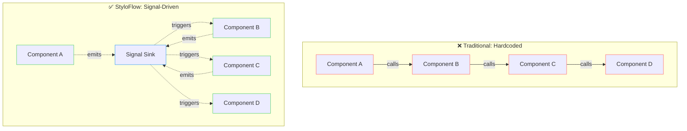
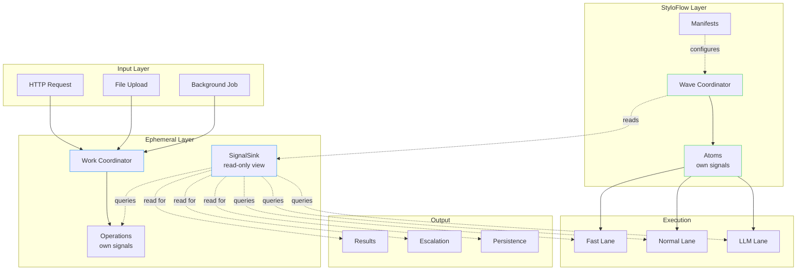
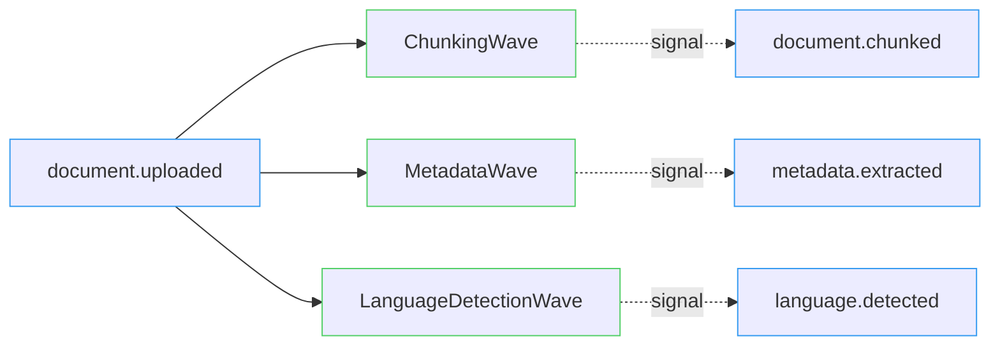
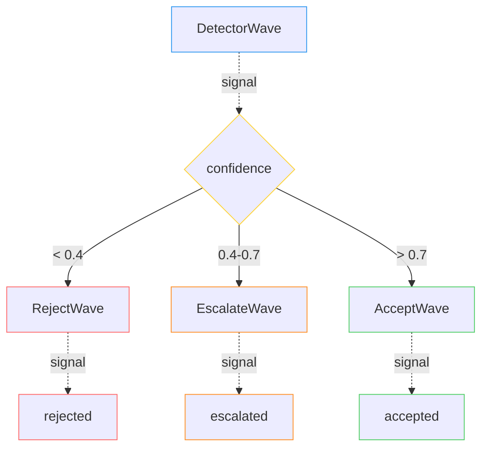
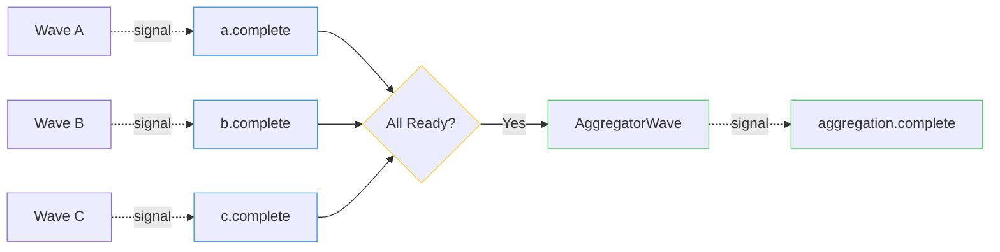

# StyloFlow: Constrained Fuzzy Signal-Driven Workflows

<!--category-- Architecture, AI, Workflows, C#, Signals, RAG -->
<datetime class="hidden">2026-01-11T14:00</datetime>

I built StyloFlow because I kept writing [the same pattern over and over](https://www.mostlylucid.net/blog/reduced-rag): components that react to what happened before, emit confidence scores, and sometimes need to escalate to more expensive analysis. Existing workflow engines wanted me to think in terms of DAGs or state machines. I wanted to think in signals.

> NOTE: StyloFlow is not YET a finished product; as I build lucidRAG and StyloBot I'm adding missing features and polishing the API on BOTH StyloFllow and ephemeral. It's still in active development, but you can try it out and provide feedback. I will update here later (the SignalSink stuff for example will change for ephemeral v3.0 to be 'read only')

**StyloFlow is a signal-driven orchestration library that matches [how I think](https://www.mostlylucid.net/blog/thinking-in-systems) about[ AI pipelines](https://www.mostlylucid.net/blog/tencommandments):** components declare what they produce and what they need, confidence scores guide execution, and cheap operations run first with escalation to expensive ones only when needed.

This is the infrastructure powering **[*lucid*RAG](https://www.mostlylucid.net/blog/lucidrag-multi-document-rag-web-app)** - a cross-modal graph RAG tool that combines [DocSummarizer](/blog/building-a-document-summarizer-with-rag) (documents), [DataSummarizer](/blog/datasummarizer-how-it-works) (structured data), and [ImageSummarizer](/blog/constrained-fuzzy-image-intelligence) (images) into a unified question-answering system with knowledge graph visualization. It also powers [Stylobot](https://www.stylobot.net) (an advanced bot protection system) and implements the [Reduced RAG](/blog/reduced-rag) pattern.


**Source:** [GitHub - StyloFlow](https://github.com/scottgal/styloflow)


[TOC]

---

## What This Is

**StyloFlow is a working prototype of a signal-driven orchestration model.** The API and shape will evolve as I build lucidRAG and Stylobot, but the execution semantics and patterns described here are the point: signals as first-class facts, confidence-driven branching, and escalation as a structural pattern.

This isn't a new DSL or workflow language. It's a set of **execution semantics** built around signals, confidence, and bounded escalation. Today it runs in-process with bounded concurrency. Tomorrow it will distribute lanes across machines while keeping signals as the stable boundary.

---

## The Problem with Traditional Workflows

Here's what most workflow engines look like:

```csharp
// ❌ Traditional: Hardcoded dependencies
public async Task ProcessDocumentAsync(string path)
{
    var text = await ExtractTextAsync(path);
    var chunks = await ChunkTextAsync(text);
    var embeddings = await GenerateEmbeddingsAsync(chunks);
    var entities = await ExtractEntitiesAsync(chunks);
    await StoreEverythingAsync(embeddings, entities);
}
```

This works until:
- You want to skip entity extraction for simple queries
- You need to run extraction and embedding in parallel
- You want to escalate to a better model based on confidence
- You need to add a new processing stage without touching existing code

You end up with either:
1. **Rigid pipelines** that can't adapt
2. **Massive if/else** trees for routing
3. **God classes** that know about everything

## The Foundation: Ephemeral Execution

StyloFlow builds on [mostlylucid.ephemeral](/blog/ephemeral-execution-library) - a library for bounded, trackable async execution.

Quick recap of what ephemeral provides:

```csharp
// Bounded concurrent processing with full visibility
var coordinator = new EphemeralWorkCoordinator<DocumentJob>(
    async (job, operation, ct) => {
        await ProcessAsync(job, ct);
        operation.Signal("document.processed");
    },
    new EphemeralOptions { MaxConcurrency = 4 });

// Enqueue work
await coordinator.EnqueueAsync(new DocumentJob(filePath));

// Full observability
Console.WriteLine($"Active: {coordinator.ActiveCount}");
Console.WriteLine($"Completed: {coordinator.TotalCompleted}");
```

**Key benefits from ephemeral:**
- Bounded concurrency (no runaway memory)
- [LRU eviction](/blog/learning-lrus-when-capacity-makes-systems-better) of old operations
- Signal publishing for cross-component coordination
- Operation pinning to prevent premature eviction

For details, see [Fire and Don't Quite Forget](/blog/fire-and-dont-quite-forget-ephemeral-execution).

---

## What This Model Enables

This orchestration model extends ephemeral with:

1. **YAML-driven component manifests** - Declarative configuration
2. **Signal-based triggers** - Components run when signals appear
3. **Wave coordination** - Priority-based execution with concurrency lanes
4. **Escalation patterns** - Defer expensive analysis until needed
5. **Entity contracts** - Type-safe input/output specifications
6. **Budget management** - Token limits, cost caps, timeouts

Here's the key architectural shift:



Components never call each other. They emit signals and react to signals.

---

## Core Concept: Signals and Ownership

**Signals are facts about what happened**, not commands or events. They're immutable, timestamped, and carry confidence scores. Each atom owns its signals - they're externally immutable. Nothing else can modify that list.

```csharp
public record Signal
{
    public required string Key { get; init; }           // "document.chunked"
    public object? Value { get; init; }                 // Optional payload
    public double Confidence { get; init; } = 1.0;      // 0.0 to 1.0
    public required string Source { get; init; }        // Which component
    public DateTime Timestamp { get; init; }
    public Dictionary<string, object>? Metadata { get; init; }
}
```

**Critical architectural point: SignalSink is a persistent historical view.**

**SignalSink** provides a queryable view across all operations on all coordinators that share it. Signals persist across coordinator lifecycles - when an operation evicts from its coordinator, the signals remain in the sink until manually cleared.

```csharp
// Create a shared signal sink (no parameters, signals persist)
var sink = new SignalSink();

// Coordinators manage operation lifetime, NOT signal lifetime
var coordinator = new EphemeralWorkCoordinator<string>(
    ProcessAsync,
    new EphemeralOptions
    {
        MaxConcurrency = 8,
        MaxTrackedOperations = 100,         // Operations evict after this
        MaxOperationLifetime = TimeSpan.FromMinutes(5),  // Or after this time
        Signals = sink                      // Share the persistent view
    });

// Operations emit via their emitter
public async Task ProcessAsync(string docId, SignalEmitter emitter, CancellationToken ct)
{
    // Store actual data externally (cache, database, blob storage)
    await cache.SetAsync($"doc-{docId}", documentData);

    // Signal carries a REFERENCE, not the data
    emitter.Emit("document.chunked", key: docId); // Key references external data
}

// SignalSink is readonly - it cannot alter signals
// Signals persist until their operation evicts from the coordinator
```

**SignalSink provides TWO coordination patterns:**

**1. Push-based (Subscribe):**

```csharp
// Subscribe to the sink for push notifications
sink.Subscribe(signal => {
    if (signal.Is("document.chunked"))
    {
        // React immediately - signal includes OperationId
        Console.WriteLine($"Op {signal.OperationId} chunked doc at {signal.Timestamp}");
    }
});

// Returns IDisposable for cleanup
using var subscription = sink.Subscribe(HandleSignal);
```

**2. Pull-based (Query):**

```csharp
// Get all signals for a specific operation
var opSignals = sink.GetOpSignals(operationId);

// Detect if any operation has emitted a signal
if (sink.Detect("embeddings.generated"))
{
    // At least one operation has generated embeddings
}

// Sense all signals matching a condition
var recentErrors = sink.Sense(s =>
    s.Signal.StartsWith("error.") &&
    s.Timestamp > DateTimeOffset.UtcNow.AddMinutes(-5)
);

// Get operation summary from its signal history
var summary = sink.GetOp(operationId);
Console.WriteLine($"Operation ran for {summary?.Duration}");
```

**Why this matters:**

- **Readonly view** - SignalSink cannot alter signals; it only provides query access
- **Signals persist** - Signals remain in the view until their operation evicts from the coordinator
- **Signals are coordination, not transport** - Signals carry keys/references to external data, NOT the data itself
- **Coordinator independence** - Multiple coordinators can share one sink; signal history spans all of them
- **Thread-safe** - Lock-free reads for query operations
- **Both push and pull** - Subscribe() for reactive, Sense()/Detect() for polling
- **Operation correlation** - Every signal includes OperationId for tracing across coordinators
- **Pattern matching** - Query by exact match, prefix, or custom predicate

**Key design principle:** Store large data (documents, images, vectors) in caches or databases. Signals only carry references like `"cache://doc-123"` or operation keys.

Example coordination:

```csharp
// Operation emits signal via ISignalEmitter interface
public async Task ProcessAsync(Item item, ISignalEmitter emitter, CancellationToken ct)
{
    // Emit to the sink
    emitter.Emit("processing.started");

    await DoWorkAsync(item, ct);

    emitter.Emit("processing.completed");
}

// Wave checks if it should run by querying sink
public bool ShouldRun(string path, AnalysisContext ctx)
{
    // Pull pattern: query the sink via context
    return ctx.Detect("document.chunked");
}

// UI subscribes to sink for reactive updates
sink.Subscribe(signal => {
    if (signal.Signal.StartsWith("document."))
    {
        // Push pattern: react immediately
        UpdateProgressUI(signal);
    }
});
```

**Escalation happens at two levels:**

1. **Within a coordinator** - Waves check signal confidence and conditionally run expensive analysis
2. **Between coordinators** - EscalatorAtom routes signals from fast coordinator → expensive coordinator based on signal criteria

```csharp
// Pattern 1: Intra-coordinator escalation (wave checks signals)
public bool ShouldRun(string path, AnalysisContext ctx)
{
    var quality = ctx.GetSignal("quality.score");
    return quality?.Confidence < 0.7; // Only run if quality is low
}

// Pattern 2: Inter-coordinator escalation (atom routes to another coordinator)
// Option A: Explicit escalation signal
typed.Raise("escalate.to.expensive", payload, key: "doc-123");

// Option B: EscalatorAtom examines signals and decides
new EscalatorAtomOptions<T> {
    ShouldEscalate = evt => evt.Payload.Confidence < 0.7
}
```

Multiple coordinators run independently. EscalatorAtom watches signals from one coordinator and forwards work to another when needed.

For the theory behind this, see [Constrained Fuzzy Context Dragging](/blog/constrained-fuzzy-context-dragging).

### Signals Carry References, Not Data

**Critical:** Signals are coordination events, not data transport. Large data (documents, images, embeddings) should live in external storage.

```csharp
// ❌ BAD: Carrying data in signals (memory pressure, boxing)
var imageBytes = await ProcessImageAsync(input);
emitter.Emit("image.processed", metadata: new { Data = imageBytes });

// ✅ GOOD: Store externally, signal the reference
var imageBytes = await ProcessImageAsync(input);
var cacheKey = $"processed/{docId}";
await cache.SetAsync(cacheKey, imageBytes);
emitter.Emit("image.processed", key: cacheKey);

// Later: Retrieve when needed
if (sink.Detect("image.processed"))
{
    var signals = sink.GetOpSignals(operationId);
    var imageKey = signals.FirstOrDefault(s => s.Signal == "image.processed")?.Key;
    if (imageKey != null)
    {
        var bytes = await cache.GetAsync<byte[]>(imageKey);
    }
}
```

**Best practices:**

- Use caches (in-memory or distributed) for ephemeral data
- Use databases for durable data
- Use blob storage for large files
- Signal URIs: `"cache://key"`, `"blob://container/file"`, `"db://table/id"`
- Keep signals lightweight - just keys, confidence scores, timestamps

---

## Core Concept: Component Manifests

**Manifests declare contracts (what triggers me, what I emit, what I cost)** separate from implementation. This separation exists so you can understand the workflow without reading code, and change execution order without recompiling.

```yaml
name: BotDetector
priority: 10              # Lower runs first
enabled: true

# What kind of component is this?
taxonomy:
  kind: analyzer          # sensor|analyzer|proposer|gatekeeper
  determinism: probabilistic
  persistence: ephemeral

# When should this run?
triggers:
  requires:
    - signal: http.request.received
      condition: exists

# What does it produce?
emits:
  on_complete:
    - key: bot.detected
      confidence_range: [0.0, 1.0]

  conditional:
    - key: bot.escalation.needed
      when: confidence < 0.7

# Resource limits
lane:
  name: fast              # fast|normal|slow|llm
  max_concurrency: 8

budget:
  max_duration: 100ms

# Configuration values
defaults:
  confidence:
    bot_detected: 0.6
  timing:
    timeout_ms: 100
```

**Benefits:**

1. **Runtime reconfiguration** - Change priority without recompiling
2. **Environment overrides** - Override via appsettings.json
3. **Clear contracts** - See what signals trigger what
4. **Self-documenting** - Manifest is the spec

### Visual Workflow Builder

While you can write YAML manifests by hand, StyloFlow includes a visual workflow builder that lets you design signal-driven workflows using modular-synth-style patching:


The UI provides:
- **Drag-and-drop components** from the taxonomy (sensors, analyzers, proposers, etc.)
- **Signal wire patching** - Connect outputs to inputs visually
- **Live manifest preview** - See the generated YAML as you build
- **Trigger visualization** - See which signals trigger which components
- **Lane assignment** - Drag components into fast/normal/slow/llm lanes
- **Real-time validation** - Catch invalid signal references immediately

This makes it easy to experiment with different workflow shapes without writing YAML by hand, while still giving you full control over the generated configuration.

---

## Core Concept: Waves

A wave is a composable analysis stage. **This interface exists to make "should we run?" a first-class decision**, not an implementation detail buried in conditional logic.

```csharp
public interface IContentAnalysisWave
{
    string Name { get; }
    int Priority { get; }               // Higher runs first
    bool Enabled { get; set; }

    // Quick filter - avoid expensive work
    bool ShouldRun(string contentPath, AnalysisContext context);

    // Do the analysis
    Task<IEnumerable<Signal>> AnalyzeAsync(
        string contentPath,
        AnalysisContext context,
        CancellationToken ct);
}
```

**Simple wave example:**

```csharp
public class FileTypeWave : IContentAnalysisWave
{
    public string Name => "FileType";
    public int Priority => 100;
    public bool Enabled { get; set; } = true;

    public bool ShouldRun(string path, AnalysisContext ctx)
    {
        // Skip if we already know the type
        return ctx.GetSignal("file.type") == null;
    }

    public async Task<IEnumerable<Signal>> AnalyzeAsync(
        string path,
        AnalysisContext ctx,
        CancellationToken ct)
    {
        var extension = Path.GetExtension(path);
        var mimeType = GetMimeType(extension);

        return new[]
        {
            new Signal
            {
                Key = "file.type",
                Value = mimeType,
                Confidence = 1.0,
                Source = Name
            }
        };
    }
}
```

**Wave coordination:**

The `WaveCoordinator` runs waves in priority order:

```csharp
var coordinator = new WaveCoordinator(waves, profile);
var context = new AnalysisContext();

var results = await coordinator.ExecuteAsync(filePath, context, ct);

// All signals from all waves
foreach (var signal in context.GetAllSignals())
{
    Console.WriteLine($"{signal.Key}: {signal.Value}");
}
```

**Concurrency lanes:**

Waves run in lanes with different concurrency limits:

| Lane | Purpose | Concurrency |
|------|---------|-------------|
| `fast` | Quick checks (IP lookup, file type) | 16 |
| `normal` | Standard processing (parsing, chunking) | 8 |
| `io` | I/O bound (file reads, API calls) | 32 |
| `llm` | Expensive LLM calls | 2 |

This prevents expensive operations from blocking cheap ones.

---

## Architecture: How It Fits Together

Here's the complete picture:



**Flow:**

1. Input arrives (HTTP request, file, job)
2. Ephemeral coordinator creates operation (which owns an empty signal list)
3. Operation adds signals to its owned list
4. Wave coordinator READS signals via SignalSink view to check trigger conditions
5. Waves whose triggers match run in priority order within concurrency lanes
6. Each wave adds signals to its operation's owned list (externally immutable)
7. Wave coordinator continues reading signals to find newly satisfied triggers
8. Final output queries SignalSink to read signals and determine actions

**Ownership model:** Each operation/atom owns its signals. SignalSink provides a read-only view across all operations. Signals can be escalated (copied) or echoed (preserved when evicted), but the owned list is externally immutable.

**Current execution model:** Single-process, bounded concurrency, observable operations with LRU eviction.

**Future execution model:** Distributed lanes across machines, SignalSink queries remote operations, atoms execute on different hosts. **Signals remain the stable boundary** - they're already serializable, timestamped, and self-contained. The ownership model doesn't change.

The in-process implementation validates the semantics. Distribution is about scaling the execution substrate, not changing the orchestration model.

---

## Use Case: lucidRAG Document Processing

Let's see how [lucidRAG](/blog/lucidrag-multi-document-rag-web-app) uses StyloFlow:

**Stage 1: Initial Detection**

```csharp
public class FileTypeDetectorWave : IContentAnalysisWave
{
    public int Priority => 100;  // Run first

    public async Task<IEnumerable<Signal>> AnalyzeAsync(...)
    {
        var extension = Path.GetExtension(path);

        return new[]
        {
            new Signal
            {
                Key = "file.extension",
                Value = extension,
                Source = "FileTypeDetector"
            }
        };
    }
}
```

**Stage 2: Chunking (triggered by file.extension)**

```csharp
// In manifest:
// triggers:
//   requires:
//     - signal: file.extension
//       condition: in
//       value: [".pdf", ".docx", ".md"]

public class ChunkingWave : ConfiguredComponentBase, IContentAnalysisWave
{
    public int Priority => 80;

    public async Task<IEnumerable<Signal>> AnalyzeAsync(...)
    {
        var chunks = await ChunkDocumentAsync(path);

        ctx.SetCached("chunks", chunks);  // Share with other waves

        return new[]
        {
            new Signal
            {
                Key = "document.chunked",
                Value = chunks.Count,
                Source = Name
            }
        };
    }
}
```

**Stage 3: Embedding (triggered by document.chunked)**

```csharp
public class EmbeddingWave : ConfiguredComponentBase, IContentAnalysisWave
{
    public int Priority => 60;

    public bool ShouldRun(string path, AnalysisContext ctx)
    {
        // Only run if chunking succeeded
        return ctx.GetSignal("document.chunked") != null;
    }

    public async Task<IEnumerable<Signal>> AnalyzeAsync(...)
    {
        var chunks = ctx.GetCached<List<Chunk>>("chunks");
        var embeddings = await GenerateEmbeddingsAsync(chunks);

        ctx.SetCached("embeddings", embeddings);

        return new[]
        {
            new Signal
            {
                Key = "embeddings.generated",
                Value = embeddings.Count,
                Source = Name
            }
        };
    }
}
```

**Stage 4: Entity Extraction (parallel with embedding)**

```csharp
public class EntityExtractionWave : ConfiguredComponentBase, IContentAnalysisWave
{
    public int Priority => 60;  // Same as embedding - runs in parallel

    public async Task<IEnumerable<Signal>> AnalyzeAsync(...)
    {
        var chunks = ctx.GetCached<List<Chunk>>("chunks");

        // Use deterministic IDF scoring, not LLM per chunk
        // (See Reduced RAG pattern)
        var entities = await ExtractEntitiesAsync(chunks);

        return new[]
        {
            new Signal
            {
                Key = "entities.extracted",
                Value = entities.Count,
                Confidence = CalculateConfidence(entities),
                Source = Name
            }
        };
    }
}
```

**Stage 5: Quality Check**

```csharp
public class QualityCheckWave : ConfiguredComponentBase, IContentAnalysisWave
{
    public int Priority => 40;  // After embedding + entities

    public async Task<IEnumerable<Signal>> AnalyzeAsync(...)
    {
        var embeddingSignal = ctx.GetSignal("embeddings.generated");
        var entitySignal = ctx.GetSignal("entities.extracted");

        var embeddingCount = (int)embeddingSignal.Value;
        var entityConfidence = entitySignal.Confidence;

        var quality = CalculateQuality(embeddingCount, entityConfidence);

        var signals = new List<Signal>
        {
            new Signal
            {
                Key = "quality.score",
                Value = quality,
                Source = Name
            }
        };

        // Trigger escalation if quality is poor
        if (quality < GetParam<double>("quality_threshold", 0.7))
        {
            signals.Add(new Signal
            {
                Key = "escalation.needed",
                Value = "low_quality_document",
                Source = Name
            });
        }

        return signals;
    }
}
```

**Benefits of this approach:**

1. **Parallel execution** - Embedding and entity extraction run simultaneously
2. **Conditional branching** - Quality check decides if escalation is needed
3. **Shared context** - Waves access chunks without passing them explicitly
4. **Easy to extend** - Add a new wave without changing existing ones
5. **Observable** - Every stage emits signals you can monitor

This is the [Reduced RAG](/blog/reduced-rag) pattern in action: deterministic extraction up front, LLMs only for synthesis.

---

## Use Case: Stylobot Bot Detection

[Stylobot](https://www.stylobot.net) is an advanced bot detection system that uses StyloFlow for multi-stage threat analysis. See the complete escalation example in the "Escalation: From Fast to Thorough" section for detailed code.

---

## Signal-Driven Orchestration Patterns

**Pattern 1: Fan-Out**

One signal triggers multiple waves:



**Pattern 2: Sequential Dependency**

Waves wait for previous signals:


**Pattern 3: Conditional Branching**

Different waves run based on signals:



**Pattern 4: Aggregation**

Multiple signals trigger one wave:



---

## Escalation Patterns

StyloFlow supports escalation at two levels:

1. **Intra-coordinator**: Waves check signal confidence and conditionally run expensive steps
2. **Inter-coordinator**: EscalatorAtom routes signals from fast coordinator → expensive coordinator

Example from lucidRAG: Fast entity extraction runs first. If quality < 0.7, EscalatorAtom routes the document to an expensive LLM refinement coordinator. This saves 20x on cost by avoiding expensive LLM calls for high-quality extractions.

---

## Minimal Shape

> This is not a quick-start guide; it's the smallest example that shows how the model fits together.

**Installation:**

```bash
dotnet add package StyloFlow.Complete
```

**Conceptual entry point:**

```csharp
// 1. Define a wave
public class MyAnalysisWave : IContentAnalysisWave
{
    public string Name => "MyAnalysis";
    public int Priority => 50;
    public bool Enabled { get; set; } = true;

    public bool ShouldRun(string path, AnalysisContext ctx) => true;

    public async Task<IEnumerable<Signal>> AnalyzeAsync(
        string path,
        AnalysisContext ctx,
        CancellationToken ct)
    {
        // Your analysis logic here
        var result = await AnalyzeAsync(path);

        return new[]
        {
            new Signal
            {
                Key = "my.signal",
                Value = result,
                Confidence = 1.0,
                Source = Name
            }
        };
    }
}

// 2. Register waves
var waves = new List<IContentAnalysisWave>
{
    new MyAnalysisWave(),
    new AnotherWave(),
};

// 3. Create coordinator
var coordinator = new WaveCoordinator(
    waves,
    CoordinatorProfile.Default);

// 4. Execute
var context = new AnalysisContext();
var results = await coordinator.ExecuteAsync(filePath, context);

// 5. Read signals
foreach (var signal in context.GetAllSignals())
{
    Console.WriteLine($"{signal.Key}: {signal.Value} ({signal.Confidence})");
}
```

**With manifests:**

```csharp
// Load manifests from directory
var loader = new FileSystemManifestLoader("./manifests");
var manifests = await loader.LoadAllAsync();

// Build waves from manifests
var waves = manifests
    .Where(m => m.Enabled)
    .OrderBy(m => m.Priority)
    .Select(m => WaveFactory.Create(m))
    .ToList();

var coordinator = new WaveCoordinator(waves, profile);
```

For complete examples, see the [StyloFlow GitHub repository](https://github.com/scottgal/styloflow).

---

## Workflow Discoverability: YAML Manifests

Manifests declare what triggers a wave, what it emits, resource limits, and costs - making workflows self-documenting.

**Example: Deterministic wave**

```yaml
name: ChunkingWave
priority: 80
description: Splits documents into semantic chunks

taxonomy:
  kind: extractor
  determinism: deterministic

triggers:
  requires:
    - signal: file.extension
      condition: in
      value: [".pdf", ".docx", ".md"]

emits:
  on_complete:
    - key: document.chunked
      type: integer

lane:
  name: normal
  max_concurrency: 8

budget:
  max_duration: 30s

defaults:
  chunking:
    max_chunk_size: 512
    overlap: 50
```

**Example: Conditional escalation**

```yaml
name: QualityCheckWave
priority: 40
description: Validates extraction quality

triggers:
  requires:
    - signal: embeddings.generated
    - signal: entities.extracted

emits:
  on_complete:
    - key: quality.score
      confidence_range: [0.0, 1.0]

  conditional:
    - key: escalation.needed
      when: quality.score < 0.7  # Trigger LLM refinement

lane:
  name: fast
  max_concurrency: 16
```

**Benefits:**
- Execution order visible from priority numbers
- Dependencies clear from required signals
- Resource limits explicit (lanes, budgets)
- Conditional logic declarative

---

## Emergent Properties

**1. Declarative composition**

Components declare their contracts (triggers, signals, budget), not their dependencies. The system figures out execution order. This isn't a feature - it's what happens when you make signals first-class.

**2. Observable by default**

Every action is a signal. You don't add observability - it's inherent. Full execution trace, confidence tracking, escalation paths, and budget consumption fall out naturally.

**3. Adaptive execution**

Confidence scores drive branching without explicit routing logic. Skip expensive stages when unnecessary, escalate when unsure, abort early on high-confidence failures. The control flow emerges from signal patterns.

**4. Testability without mocking frameworks**

Mock signals, not components:

```csharp
var context = new AnalysisContext();
context.AddSignal(new Signal
{
    Key = "document.chunked",
    Value = 10,
    Confidence = 1.0,
    Source = "Test"
});

var wave = new EmbeddingWave();
var results = await wave.AnalyzeAsync(path, context, ct);

Assert.Single(results);
Assert.Equal("embeddings.generated", results.First().Key);
```

**5. Incremental complexity**

Start simple:
```csharp
var coordinator = new EphemeralWorkCoordinator<Job>(ProcessAsync);
```

Add signals when needed:
```csharp
new EphemeralOptions { Signals = signalSink }
```

Add waves for multi-stage:
```csharp
var waveCoordinator = new WaveCoordinator(waves, profile);
```

Add manifests for declarative config:
```yaml
name: MyWave
triggers: [...]
emits: [...]
```

---

## Comparison to Other Workflow Engines

| Feature | StyloFlow | Temporal | Airflow | Step Functions |
|---------|-----------|----------|---------|----------------|
| **Coordination** | Signal-driven | RPC-based | DAG-based | State machine |
| **Declarative** | ✅ YAML manifests | ❌ Code-first | ✅ DAGs | ✅ JSON/YAML |
| **Conditional** | ✅ Signal triggers | ✅ Conditions | ✅ Branching | ✅ Choice states |
| **Escalation** | ✅ Built-in | ❌ Manual | ❌ Manual | ❌ Manual |
| **Observability** | ✅ Signal trace | ✅ Workflow history | ✅ Task logs | ✅ Execution history |
| **Budget control** | ✅ Token/cost limits | ❌ Manual | ❌ Manual | ❌ Manual |
| **Local execution** | ✅ In-process | ❌ Requires cluster | ❌ Requires cluster | ❌ AWS only |
| **Concurrency lanes** | ✅ Fast/Normal/LLM | ❌ Manual | ✅ Pools | ❌ Service limits |

**Where this model fits naturally:**

- AI/ML pipelines with escalation (cheap → expensive)
- Document processing with conditional stages
- Bot detection with multi-stage analysis
- RAG systems with hybrid search + generation
- Any workflow where components react to confidence scores

**Where it doesn't (and won't):**

- Simple sequential jobs (ephemeral coordinator is enough)
- Mature distributed workflows across data centers (Temporal solves this)
- Long-running workflows with human approvals (Temporal/Airflow)
- Workflow versioning with schema migration (Temporal)

---

## Where This Model Leads

> These are natural extensions of the model, not commitments to a specific implementation.

As the semantics stabilize through lucidRAG and Stylobot development, these patterns become viable:

**1. Learning from signals**

Track which escalation paths work best:
```csharp
// Did the LLM escalation improve accuracy?
// Learn to skip it if behavioral analysis is sufficient
```

**2. Cost optimization**

Automatic lane assignment based on historical performance:
```csharp
// If a "slow" wave completes quickly, promote to "normal"
```

**3. Signal replay**

Debug by replaying signal sequences:
```csharp
var replay = SignalReplay.FromFile("trace.jsonl");
await coordinator.ReplayAsync(replay);
```

**4. Multi-machine coordination**

Distribute lanes across machines while keeping signals centralized.

---

## Why Signals Matter

The core insight is this: **in AI systems, every component has confidence**.

Traditional workflows assume success/failure. AI workflows need:
- **Confidence scores** - How sure are we?
- **Conditional execution** - Skip expensive stages if confident
- **Escalation** - Try harder when unsure
- **Aggregation** - Combine multiple signals

Signals provide this naturally:

```csharp
// Multiple detectors vote
var signals = context.GetSignals("bot.detected");

// Aggregate by confidence
var verdict = signals
    .OrderByDescending(s => s.Confidence)
    .First();

// Or majority vote
var isBot = signals
    .Count(s => (bool)s.Value) > signals.Count() / 2;

// Or weighted average
var score = signals
    .Sum(s => (bool)s.Value ? s.Confidence : -s.Confidence)
    / signals.Count();
```

This is why StyloFlow works well for [Reduced RAG](/blog/reduced-rag) - every extraction stage produces a confidence score, and synthesis only happens when confidence is high enough.

---

## Summary

**The execution model:**

- Signals as first-class facts (not events or messages)
- Confidence scores drive control flow
- Waves coordinate via triggers, not direct calls
- Lanes enforce resource boundaries
- Built on [mostlylucid.ephemeral](/blog/ephemeral-execution-library)

**Why signals matter:**

1. **Stable distribution boundary** - Serializable, timestamped, self-contained
2. **Declarative composition** - Manifests define contracts, runtime figures out execution
3. **Adaptive routing** - Confidence enables escalation without hardcoded branching
4. **Inherent observability** - Every action is already a signal
5. **Clear ownership** - Atoms own signals, external immutability prevents action-at-a-distance

**Working implementations:**

- [lucidRAG](/blog/lucidrag-multi-document-rag-web-app) - Cross-modal document Q&A with conditional entity extraction
- [Stylobot](https://www.stylobot.net) - Bot detection with confidence-driven escalation (IP → behavior → LLM)
- [Reduced RAG](/blog/reduced-rag) - Deterministic extraction + bounded LLM synthesis

**Related articles:**

- [Ephemeral Execution Library](/blog/ephemeral-execution-library) - The foundation
- [Reduced RAG](/blog/reduced-rag) - Why deterministic extraction matters
- [LRU and Capacity](/blog/learning-lrus-when-capacity-makes-systems-better) - Memory-bounded windows
- [Constrained Fuzzy Context Dragging](/blog/constrained-fuzzy-context-dragging) - The theory

**Source code:** [GitHub - StyloFlow](https://github.com/scottgal/styloflow)

---

## The Core Insight

Traditional workflow engines ask you to declare **what happens next**. This model asks components to declare **what they produce** and **what they need**, then lets signals coordinate execution.

The key shift: **signals decouple, confidence guides, lanes protect**.

This isn't about choosing StyloFlow over Temporal or Airflow - those solve different problems (durable execution, workflow versioning, distributed coordination across data centers). This is about articulating a different orchestration model: one where control flow emerges from signal patterns rather than being explicitly programmed.

If you're building AI/ML pipelines where:
- Confidence matters (not just success/failure)
- Escalation is structural (not a special case)
- Components shouldn't know about each other
- Observability should be inherent (not bolted on)

...then these execution semantics might fit how you think.

The [ephemeral library](/blog/ephemeral-execution-library) is the stable foundation. StyloFlow adds the signal-driven orchestration layer on top. Both are evolving through real use in lucidRAG and Stylobot.

For questions or feedback, see the [GitHub repository](https://github.com/scottgal/styloflow).
