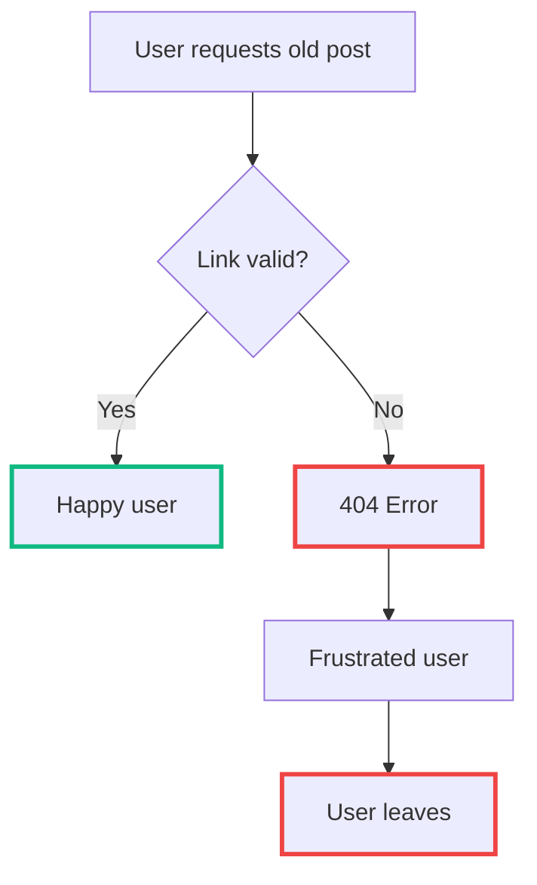
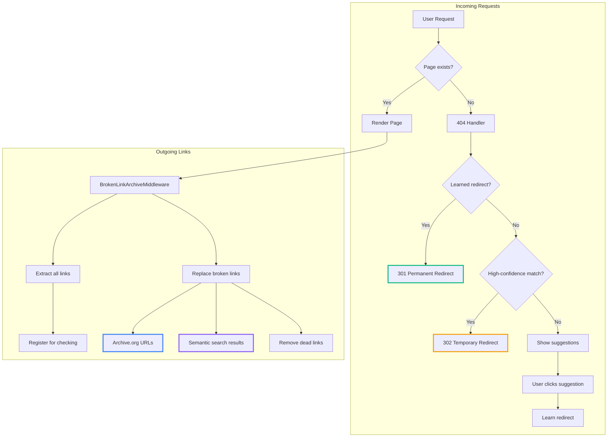
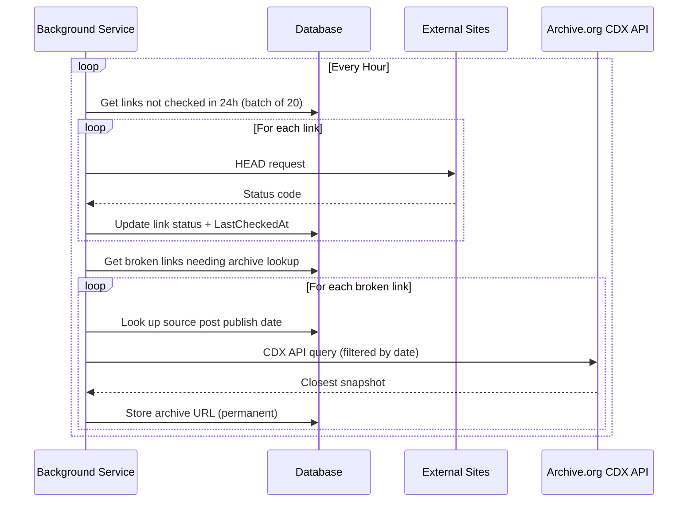
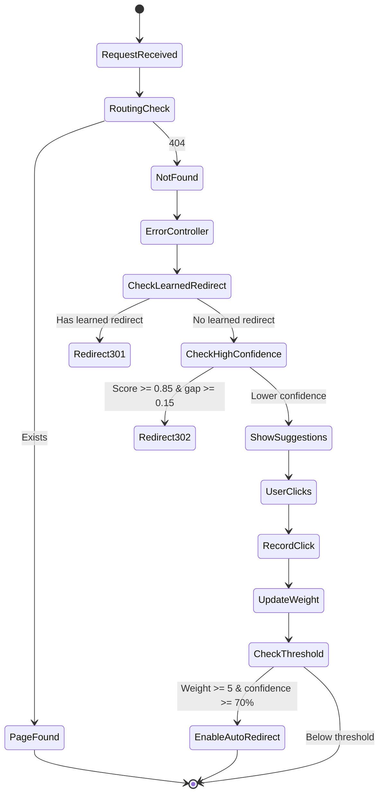
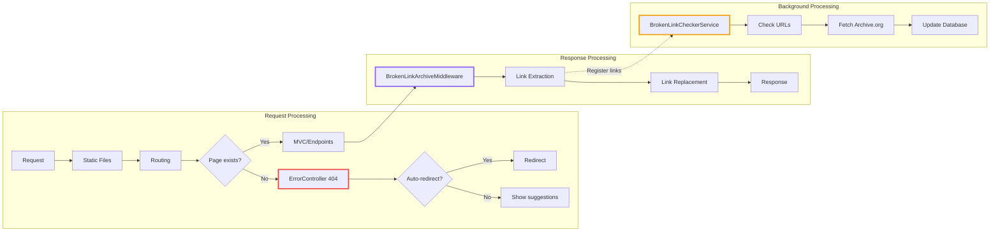

# The War on 404

<!--category-- ASP.NET, C# -->
<datetime class="hidden">2025-11-23T09:00</datetime>

## The War On 404: Making Old Stuff Work Again

When you've been blogging since 2004 (yes, really), you accumulate a lot of digital detritus. I recently imported my old posts from 2004-2009 and discovered that approximately *everything* was broken. External links pointing to sites that vanished a decade ago, old URL schemes that no longer match the current structure, the whole lot.

The problem breaks down into three parts:

1. **Internal links** - Fixed during the import process itself using my [ArchiveOrg importer tool](https://github.com/scottgal/mostlylucid.nugetpackages/tree/main/Mostlylucid.ArchiveOrg). My old posts referenced each other using the old URL scheme, so I rewrote those as part of the migration.

2. **External links (outgoing)** - This is the big one. Links to external resources that have since vanished, moved, or become completely different sites. A link to some documentation from 2006? Gone. A reference to a blog post by someone who's long since taken their site down? Dead. These need runtime handling.

3. **Incoming requests** - People (and search engines) still try to access old URLs like `/archive/2006/05/15/123.aspx`. The semantic search system can often figure out what they were after, even without an exact slug match.

Now, I *could* have baked the archive.org lookups into the import process. But here's the thing: links break over time. A site that's working today might be gone next month. By handling this at runtime with periodic re-checking, the system automatically catches *future* breakages, not just the ones that existed at import time.

This article covers my approach:
- **Outgoing links**: `BrokenLinkArchiveMiddleware` - replaces dead external links with archive.org snapshots
- **Incoming links**: The 404 handler with semantic search - finds the right content even from old URL schemes
- **The learning system**: How the site gets smarter over time from user clicks
- **Background processing**: Checking links without blocking requests

[TOC]

## The Problem with Old Content

Here's the thing about the internet: it's not permanent. That excellent blog post you linked to in 2006? Gone. That documentation site? Restructured three times. Your own URL scheme from before you settled on a proper slugging convention? Embarrassing.



The naive approach is to fix links manually. But when you've got hundreds of posts with thousands of links, that's not on. We need automation.

## Architecture Overview

The system has two main components working in tandem:



## Part 1: Handling Outgoing Links

### The BrokenLinkArchiveMiddleware

This middleware intercepts HTML responses and does three things:
1. Extracts all links for background checking
2. Replaces known broken external links with archive.org versions
3. Uses semantic search to find replacements for broken internal links

The key insight here is that we want to find archive.org snapshots from *around the time the post was written*. A snapshot from 2024 of a 2006 article might reference completely different content. So we look up the blog post's publish date and ask archive.org for the closest snapshot.

Here's the core structure:

```csharp
public partial class BrokenLinkArchiveMiddleware(
    RequestDelegate next,
    ILogger<BrokenLinkArchiveMiddleware> logger,
    IServiceScopeFactory serviceScopeFactory)
{
    public async Task InvokeAsync(
        HttpContext context,
        IBrokenLinkService? brokenLinkService,
        ISemanticSearchService? semanticSearchService)
    {
        // Only process HTML responses for blog pages
        if (!ShouldProcessRequest(context))
        {
            await next(context);
            return;
        }

        // Capture the response so we can modify it
        var originalBodyStream = context.Response.Body;
        using var responseBody = new MemoryStream();
        context.Response.Body = responseBody;

        await next(context);

        // Process the HTML response
        if (IsSuccessfulHtmlResponse(context, responseBody))
        {
            var html = await ReadResponseAsync(responseBody);
            html = await ProcessLinksAsync(html, context, brokenLinkService, semanticSearchService);
            await WriteModifiedResponseAsync(originalBodyStream, html, context);
        }
        else
        {
            await CopyOriginalResponseAsync(responseBody, originalBodyStream);
        }
    }
}
```

### Extracting Links

We use a generated regex to pull out all `href` attributes. The `[GeneratedRegex]` attribute in .NET gives us compile-time regex generation, which is both faster and allocation-free:

```csharp
[GeneratedRegex(@"<a[^>]*\shref\s*=\s*[""']([^""']+)[""'][^>]*>",
    RegexOptions.IgnoreCase | RegexOptions.Compiled)]
private static partial Regex HrefRegex();

private List<string> ExtractAllLinks(string html, HttpRequest request)
{
    var links = new List<string>();
    var matches = HrefRegex().Matches(html);

    foreach (Match match in matches)
    {
        var href = match.Groups[1].Value;

        // Skip special links (anchors, mailto, etc.)
        if (SkipPatterns.Any(p => href.StartsWith(p, StringComparison.OrdinalIgnoreCase)))
            continue;

        if (Uri.TryCreate(href, UriKind.Absolute, out var uri))
        {
            if (uri.Scheme == "http" || uri.Scheme == "https")
                links.Add(href);
        }
        else if (href.StartsWith("/"))
        {
            // Convert relative URLs to absolute for tracking
            var baseUri = new UriBuilder(request.Scheme, request.Host.Host,
                request.Host.Port ?? (request.Scheme == "https" ? 443 : 80));
            links.Add(new Uri(baseUri.Uri, href).ToString());
        }
    }

    return links.Distinct().ToList();
}
```

### Registering Links for Background Checking

We don't want to block the response while checking links. Instead, we fire off a background task:

```csharp
var allLinks = ExtractAllLinks(html, context.Request);
var sourcePageUrl = context.Request.Path.Value;

if (allLinks.Count > 0)
{
    // Fire and forget - don't block the response
    _ = Task.Run(async () =>
    {
        using var scope = serviceScopeFactory.CreateScope();
        var scopedService = scope.ServiceProvider.GetRequiredService<IBrokenLinkService>();
        await scopedService.RegisterUrlsAsync(allLinks, sourcePageUrl);
    });
}
```

Note the `IServiceScopeFactory` - we need a new scope because the original request's scoped services will be disposed before our background task completes.

**Important**: This is an *eventual consistency* model. When *any* link is first discovered, it gets queued for validation - we don't know if it's broken yet. The background service checks it (HEAD request), and if it's broken, fetches an archive.org replacement. The *next* visitor to that page will see the fixed link. For a blog with regular traffic, this typically means broken links get fixed within hours of first discovery. The beauty is we don't have to guess which links might be broken - we just validate them all automatically.

### Replacing Broken Links

Once we know a link is broken and have an archive.org replacement (from a previous background check), we swap them out with a helpful tooltip:

```csharp
foreach (var (originalUrl, archiveUrl) in archiveMappings)
{
    if (html.Contains(originalUrl))
    {
        var tooltipText = $"Original link ({originalUrl}) is dead - archive.org version used";
        var originalPattern = $"href=\"{originalUrl}\"";
        var archivePattern = $"href=\"{archiveUrl}\" class=\"tooltip tooltip-warning\" " +
                            $"data-tip=\"{tooltipText}\" data-original-url=\"{originalUrl}\"";

        html = html.Replace(originalPattern, archivePattern);
    }
}
```

For internal broken links, we try semantic search first:

```csharp
if (isInternal && semanticSearchService != null)
{
    var replacement = await TryFindSemanticReplacementAsync(
        brokenUrl, semanticSearchService, request, cancellationToken);

    if (replacement != null)
    {
        html = ReplaceHref(html, brokenUrl, replacement);
        continue;
    }
}

// No replacement found - convert to plain text
html = RemoveHref(html, brokenUrl);
```

## Part 2: Background Link Checking

The middleware doesn't check links during the request - that would be far too slow. Instead, it queues discovered links for background processing via a database table, and a `BrokenLinkCheckerBackgroundService` handles the actual checking.

The service runs hourly and does two things:
1. **Check link validity** - HEAD requests to see if links are still alive
2. **Fetch archive.org URLs** - For broken links, find the closest historical snapshot

Crucially, links are **periodically re-checked**. A link that was working last week might be dead today. The service picks up links that haven't been checked in the last 24 hours and verifies them again. However, once we've found an archive.org replacement for a broken link, we don't re-check the original - it's already dead and we have a working replacement.



### The Archive.org CDX API

Archive.org provides a CDX (Capture Index) API that lets us query for snapshots. The clever bit is filtering by date:

```csharp
private async Task<string?> GetArchiveUrlAsync(
    string originalUrl,
    DateTime? beforeDate,
    CancellationToken cancellationToken)
{
    var queryParams = new List<string>
    {
        $"url={Uri.EscapeDataString(originalUrl)}",
        "output=json",
        "fl=timestamp,original,statuscode",
        "filter=statuscode:200",  // Only successful responses
        "limit=1"
    };

    // Find snapshot closest to the blog post's publish date
    if (beforeDate.HasValue)
    {
        queryParams.Add($"to={beforeDate.Value:yyyyMMdd}");
        queryParams.Add("sort=closest");
        queryParams.Add($"closest={beforeDate.Value:yyyyMMdd}");
    }

    var apiUrl = $"https://web.archive.org/cdx/search/cdx?{string.Join("&", queryParams)}";

    // ... fetch and parse response

    return $"https://web.archive.org/web/{timestamp}/{original}";
}
```

This means if I wrote a post in 2008 linking to some resource, I'll get the archive.org snapshot from around 2008, not a modern version that might be completely different.

### Link Status Tracking

We track links with a proper entity:

```csharp
[Table("broken_links", Schema = "mostlylucid")]
public class BrokenLinkEntity
{
    public int Id { get; set; }
    public string OriginalUrl { get; set; } = string.Empty;
    public string? ArchiveUrl { get; set; }
    public bool IsBroken { get; set; } = false;
    public int? LastStatusCode { get; set; }
    public DateTimeOffset? LastCheckedAt { get; set; }
    public int ConsecutiveFailures { get; set; } = 0;
    public string? SourcePageUrl { get; set; }  // For publish date lookup
}
```

### Periodic Re-checking

The key to catching future breakages is re-checking. The service queries for links that haven't been validated recently:

```csharp
public async Task<List<BrokenLinkEntity>> GetLinksToCheckAsync(int batchSize, CancellationToken cancellationToken)
{
    var cutoff = DateTimeOffset.UtcNow.AddHours(-24);

    return await _dbContext.BrokenLinks
        .Where(x => x.LastCheckedAt == null || x.LastCheckedAt < cutoff)
        .OrderBy(x => x.LastCheckedAt ?? DateTimeOffset.MinValue)  // Oldest first
        .Take(batchSize)
        .ToListAsync(cancellationToken);
}
```

This means every link gets re-validated at least once a day. If a previously working link starts returning 404s, we'll catch it and start looking for an archive.org replacement. The `ConsecutiveFailures` field lets us be a bit forgiving - we don't mark a link as broken after one transient error.

## Part 3: Handling Incoming Requests

Now for the other side of the coin: people (and search engines) requesting URLs that don't exist. This includes:

- **Old URL schemes** - My ancient blog used paths like `/archive/2006/05/15/123.aspx`. Some of these are still indexed, bookmarked, or linked from other sites.
- **Typos** - Someone fat-fingers the URL or copies it incorrectly.
- **Partial slugs** - Search engines sometimes index weird fragments.

The semantic search system is particularly helpful here. Even without a direct slug match, we can extract meaningful terms from the requested URL and find content that semantically matches. The system knows both the slug and has embedding data for each post, so it can find "close enough" matches even for completely different URL structures.

### Why Not Middleware?

My first instinct was to handle redirects in middleware - intercept requests early, check for known redirects, and redirect before the routing even kicks in. This *could* work, and here's what it would look like:

```csharp
// DON'T DO THIS - runs on EVERY request
public class SlugRedirectMiddleware(RequestDelegate next)
{
    public async Task InvokeAsync(HttpContext context, ISlugSuggestionService? service)
    {
        if (context.Request.Path.StartsWithSegments("/blog"))
        {
            var targetSlug = await service.GetAutoRedirectSlugAsync(slug, language);
            if (!string.IsNullOrWhiteSpace(targetSlug))
            {
                context.Response.Redirect($"/blog/{targetSlug}", permanent: true);
                return;
            }
        }
        await next(context);
    }
}
```

The problem? This runs on *every single request* to `/blog/*`. That's a database query on every page view, even for perfectly valid URLs. For a blog with decent traffic, you're hammering the database for no good reason 99% of the time.

The much better approach: hook into the 404 handler. If ASP.NET has already determined the page doesn't exist, *then* we check for redirects. No wasted queries on valid pages.

### The Learning System

When someone hits a 404, we show them suggestions using fuzzy string matching and (optionally) semantic search. If they click a suggestion, we record that. After enough clicks with sufficient confidence, we start auto-redirecting.



### The 404 Handler

All the redirect logic lives in the `ErrorController`. ASP.NET's `UseStatusCodePagesWithReExecute` middleware re-executes the request through our error handler when a 404 occurs:

```csharp
public class ErrorController(
    BaseControllerService baseControllerService,
    ILogger<ErrorController> logger,
    ISlugSuggestionService? slugSuggestionService = null) : BaseController(baseControllerService, logger)
{
    [Route("/error/{statusCode}")]
    [HttpGet]
    public async Task<IActionResult> HandleError(int statusCode, CancellationToken cancellationToken = default)
    {
        var statusCodeReExecuteFeature = HttpContext.Features.Get<IStatusCodeReExecuteFeature>();

        switch (statusCode)
        {
            case 404:
                // Check for auto-redirects before showing 404 page
                var autoRedirectResult = await TryAutoRedirectAsync(statusCodeReExecuteFeature, cancellationToken);
                if (autoRedirectResult != null)
                    return autoRedirectResult;

                var model = await CreateNotFoundModel(statusCodeReExecuteFeature, cancellationToken);
                return View("NotFound", model);

            case 500:
                return View("ServerError");

            default:
                return View("Error");
        }
    }
}
```

The `TryAutoRedirectAsync` method handles both learned redirects and high-confidence first-time matches:

```csharp
private async Task<IActionResult?> TryAutoRedirectAsync(
    IStatusCodeReExecuteFeature? statusCodeReExecuteFeature,
    CancellationToken cancellationToken)
{
    if (slugSuggestionService == null || statusCodeReExecuteFeature == null)
        return null;

    var originalPath = statusCodeReExecuteFeature.OriginalPath ?? string.Empty;
    var (slug, language) = ExtractSlugAndLanguage(originalPath);

    // First: check for learned redirects (user previously clicked a suggestion)
    // These get 301 Permanent Redirect - confirmed patterns
    var learnedTargetSlug = await slugSuggestionService.GetAutoRedirectSlugAsync(
        slug, language, cancellationToken);

    if (!string.IsNullOrWhiteSpace(learnedTargetSlug))
    {
        var redirectUrl = BuildRedirectUrl(learnedTargetSlug, language);
        logger.LogInformation("Learned auto-redirect (301): {Original} -> {Target}", originalPath, redirectUrl);
        return RedirectPermanent(redirectUrl);
    }

    // Second: check for high-confidence first-time matches
    // These get 302 Temporary Redirect until confirmed by user clicks
    var firstTimeTargetSlug = await slugSuggestionService.GetFirstTimeAutoRedirectSlugAsync(
        slug, language, cancellationToken);

    if (!string.IsNullOrWhiteSpace(firstTimeTargetSlug))
    {
        var redirectUrl = BuildRedirectUrl(firstTimeTargetSlug, language);
        logger.LogInformation("First-time auto-redirect (302): {Original} -> {Target}", originalPath, redirectUrl);
        return Redirect(redirectUrl);
    }

    return null;  // No redirect - show suggestions
}
```

### Similarity Scoring

The suggestion service uses Levenshtein distance (edit distance) plus some heuristics:

```csharp
private double CalculateSimilarity(string source, string target)
{
    if (string.Equals(source, target, StringComparison.OrdinalIgnoreCase))
        return 1.0;

    source = source.ToLowerInvariant();
    target = target.ToLowerInvariant();

    // Levenshtein distance converted to similarity (0-1)
    var distance = CalculateLevenshteinDistance(source, target);
    var maxLength = Math.Max(source.Length, target.Length);
    var levenshteinSimilarity = 1.0 - (double)distance / maxLength;

    // Bonus if one string contains the other
    var substringBonus = (source.Contains(target) || target.Contains(source)) ? 0.2 : 0.0;

    // Bonus for common prefix (catches typos at the end)
    var prefixLength = GetCommonPrefixLength(source, target);
    var prefixBonus = (double)prefixLength / Math.Min(source.Length, target.Length) * 0.1;

    return Math.Min(1.0, levenshteinSimilarity + substringBonus + prefixBonus);
}
```

### Learning from User Behaviour

When a user clicks a suggestion, we record it and update confidence scores:

```csharp
public async Task RecordSuggestionClickAsync(
    string requestedSlug,
    string clickedSlug,
    string language,
    int suggestionPosition,
    double originalScore,
    CancellationToken cancellationToken = default)
{
    var redirect = await _context.SlugRedirects
        .FirstOrDefaultAsync(r =>
            r.FromSlug == normalizedRequestedSlug &&
            r.ToSlug == normalizedClickedSlug &&
            r.Language == language,
            cancellationToken);

    if (redirect == null)
    {
        redirect = new SlugRedirectEntity
        {
            FromSlug = normalizedRequestedSlug,
            ToSlug = normalizedClickedSlug,
            Language = language,
            Weight = 1
        };
        _context.SlugRedirects.Add(redirect);
    }
    else
    {
        redirect.Weight++;
        redirect.LastClickedAt = DateTimeOffset.UtcNow;
    }

    redirect.UpdateConfidenceScore();
    await _context.SaveChangesAsync(cancellationToken);
}
```

The confidence score calculation considers both clicks and impressions:

```csharp
public void UpdateConfidenceScore()
{
    var total = Weight + ShownCount;
    ConfidenceScore = total > 0 ? (double)Weight / total : 0.0;

    // Enable auto-redirect after 5+ clicks with 70%+ confidence
    if (Weight >= AutoRedirectWeightThreshold &&
        ConfidenceScore >= AutoRedirectConfidenceThreshold)
    {
        AutoRedirect = true;
    }
}
```

### Two-Tier Auto-Redirect

We have two levels of automatic redirects:

1. **First-time high-confidence (302)**: If the similarity score is >= 0.85 AND there's a significant gap to the second-best match, we redirect immediately with a 302. This catches obvious typos.

2. **Learned redirects (301)**: After 5+ clicks with 70%+ confidence, we use a permanent 301 redirect. This is the "the humans have spoken" case.

```csharp
public async Task<string?> GetFirstTimeAutoRedirectSlugAsync(
    string requestedSlug,
    string language,
    CancellationToken cancellationToken = default)
{
    var suggestions = await GetSuggestionsWithScoreAsync(requestedSlug, language, 2, cancellationToken);

    if (suggestions.Count == 0) return null;

    var topMatch = suggestions[0];

    // Need high confidence
    if (topMatch.Score < 0.85) return null;

    // If there's only one suggestion with high score, redirect
    if (suggestions.Count == 1) return topMatch.Post.Slug;

    // Multiple suggestions - only redirect if there's a clear winner
    var scoreGap = topMatch.Score - suggestions[1].Score;
    if (scoreGap >= 0.15)
        return topMatch.Post.Slug;

    return null;  // Too close to call - show suggestions instead
}
```

## Putting It All Together

### When Middleware Makes Sense (and When It Doesn't)

For **outgoing links**, middleware is the right choice. The `BrokenLinkArchiveMiddleware` needs to intercept the HTML response *after* it's been rendered but *before* it's sent to the client. There's no other sensible place to do this - we need to modify the response stream, and middleware is designed for exactly that.

For **incoming redirects**, middleware is the wrong choice. We'd be running database queries on every `/blog/*` request just to check if maybe, possibly, this URL might need a redirect. The 404 handler approach only runs that logic when we've already determined the page doesn't exist - much more efficient.

```csharp
// In Program.cs
app.UseStatusCodePagesWithReExecute("/error/{0}");  // Handles 404s through ErrorController
app.UseStaticFiles();
app.UseRouting();
// ... other middleware
app.UseBrokenLinkArchive();  // Process outgoing links in responses (ONLY for middleware)
```

The flow looks like this:



## Conclusion

This system has been running for a while now and it's rather satisfying watching it learn. The database gradually fills up with redirect mappings, broken links get archive.org replacements, and users rarely see a naked 404 anymore.

The key principles:
- **Don't block requests** - use background processing for expensive operations
- **Learn from users** - their clicks are valuable signals
- **Be conservative with auto-redirects** - only redirect when you're confident
- **Time-aware archiving** - find archive.org snapshots from when the content was written
- **Graceful degradation** - if services aren't available, just continue normally

It's not perfect - some links are genuinely gone forever, and semantic search doesn't always find the right replacement. But it's a damn sight better than leaving thousands of broken links lying about.

## Coming Soon: Semantic Search Deep Dive

This week (w/c 24th November 2025) I'll be publishing my semantic search series which goes into much more detail about how the vector-based search works under the hood. That series will cover embedding generation, Qdrant vector storage, and how it all ties into this 404 handling system. If you're curious about how `ISemanticSearchService.SearchAsync` actually finds "similar" content, that's where you'll want to look.

The complete source is in the repository if you want to nick any of it for your own projects.
