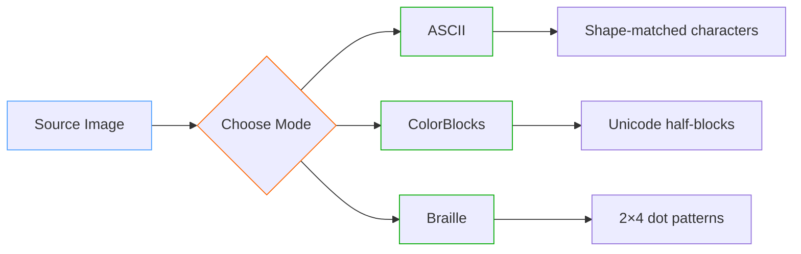
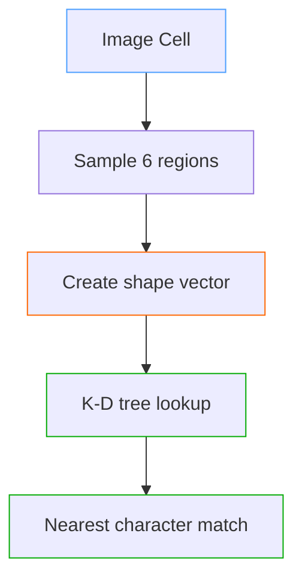
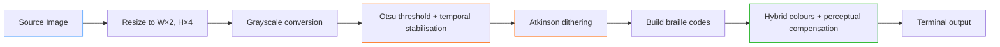
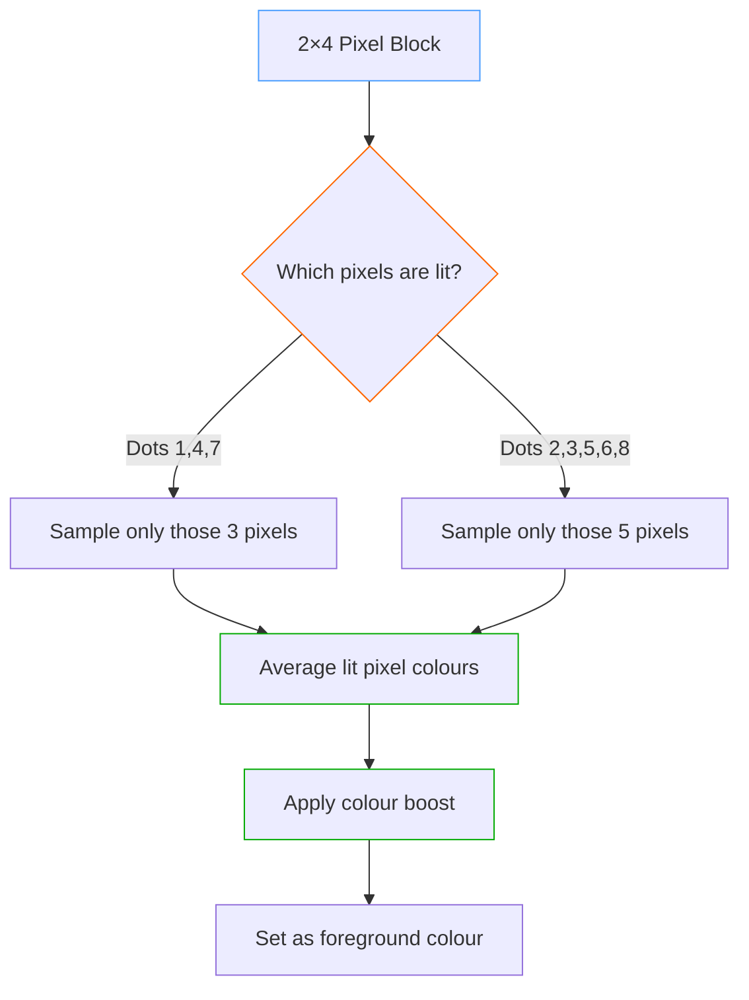
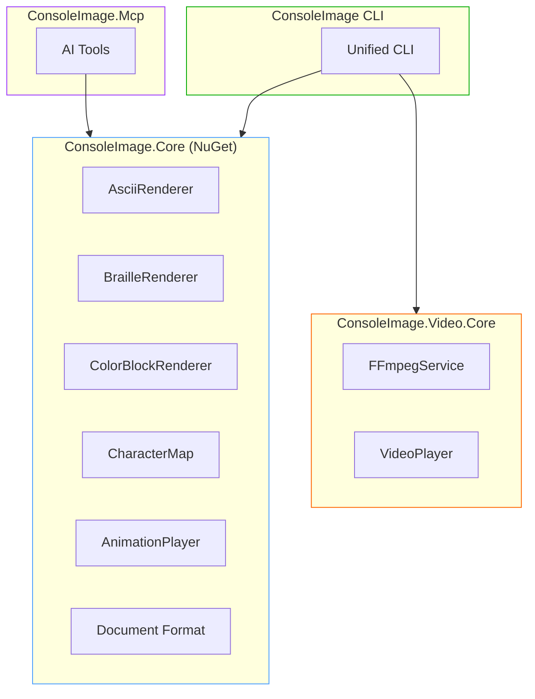

# Time Boxed Tool: ConsoleImage

<!--category-- .NET, Tools, ASCII Art -->

<datetime class="hidden">2026-01-24T12:00</datetime>

[](https://www.nuget.org/packages/mostlylucid.consoleimage/)
[](https://unlicense.org)
[](https://github.com/scottgal/mostlylucid.consoleimage/releases)

> **A glyph-based terminal renderer using shape-matching algorithms. Supports images, animated GIFs, videos, YouTube playback, and live subtitles with multiple render modes including Braille for maximum detail.**

*The goal is not pixel accuracy; it is watchability under extreme bandwidth constraints.*

## Introduction

This is one of my "time boxed" tools - small projects I build as a limited time exercise, typically over a couple of days. The idea is to scratch an itch, learn something new, and ship something useful without getting bogged down in endless feature creep.

This particular project started when I came across [Alex Harri's excellent article on ASCII rendering](https://alexharri.com/blog/ascii-rendering). His approach to shape-matching rather than simple brightness mapping was fascinating, and I thought "I could build that in C#". What began as a simple ASCII image viewer grew into a terminal graphics system with multiple rendering modes, video support, and even an AI integration layer.

The full source code is available on GitHub: [https://github.com/scottgal/mostlylucid.consoleimage](https://github.com/scottgal/mostlylucid.consoleimage)

**Download the latest release:** [GitHub Releases](https://github.com/scottgal/mostlylucid.consoleimage/releases)

**NuGet Packages:**
- [`mostlylucid.consoleimage`](https://www.nuget.org/packages/mostlylucid.consoleimage/) - Core rendering library
- [`mostlylucid.consoleimage.video`](https://www.nuget.org/packages/mostlylucid.consoleimage.video/) - Video support (FFmpeg)
- [`mostlylucid.consoleimage.transcription`](https://www.nuget.org/packages/mostlylucid.consoleimage.transcription/) - Whisper transcription + subtitle generation
- [`mostlylucid.consoleimage.player`](https://www.nuget.org/packages/mostlylucid.consoleimage.player/) - Document playback
- [`mostlylucid.consoleimage.player.spectre`](https://www.nuget.org/packages/mostlylucid.consoleimage.player.spectre/) - Spectre.Console playback renderables
- [`mostlylucid.consoleimage.spectre`](https://www.nuget.org/packages/mostlylucid.consoleimage.spectre/) - Spectre.Console integration

## Quick Start

ConsoleImage is a single CLI that turns media into glyph-driven terminal video. The point is not exact pixels; it's watchability under brutal constraints.

```bash
consoleimage photo.jpg
consoleimage "https://youtu.be/dQw4w9WgXcQ" --subs whisper
```


[TOC]

## New in v4.0: YouTube + Live Subtitles

ConsoleImage has quietly grown into a full terminal media player. Version 4.0 adds YouTube playback, auto-downloaded dependencies, and live AI subtitles powered by Whisper, all wrapped in the same "one command and it just works" flow.

### Zero-Setup Auto Downloads

Dependencies are pulled down on first use and cached locally, so new features work without manual installs:

| Component | First Download Trigger | Cache Location |
|-----------|------------------------|----------------|
| FFmpeg | First video playback | `~/.local/share/consoleimage/ffmpeg/` |
| yt-dlp | First YouTube URL | `~/.local/share/consoleimage/ytdlp/` |
| Whisper Runtime | First `--subs whisper` | `~/.local/share/consoleimage/whisper/runtimes/` |
| Whisper Models | First transcription | `~/.local/share/consoleimage/whisper/` |

On Windows, caches live under `%LOCALAPPDATA%\consoleimage\`.

Use `-y` / `--yes` to auto-confirm all downloads.

### YouTube Playback

YouTube URLs play directly in the terminal via yt-dlp, running through the same render pipeline as local files. This
means the same modes, widths, and output formats apply whether you are watching live or saving a clip. If you already
have a custom yt-dlp install, ConsoleImage can point at it.

### Subtitles and Live Transcription

Subtitles come from three sources: existing files, YouTube captions, or live Whisper transcription. Whisper runs in
the background in 15-second chunks, stays ahead of playback, and caches `.vtt` files so replays are instant. It supports
multiple model sizes, language selection, and hosted endpoints so you can trade speed for accuracy or offload the work.

Transcript-only output is supported too, which turns ConsoleImage into a subtitle generator that can feed other tools
without rendering video.

### Slideshow Mode

Point it at a folder and it becomes an image slideshow with keyboard controls, optional shuffle, and manual or timed
advance.

## From Simple Viewer to Terminal Graphics

What started as a weekend project to implement Alex Harri's algorithm became something more ambitious. The evolution went roughly like this:

1. **Day 1**: Basic ASCII rendering using shape-matching
2. **Day 2**: Added colour support and animated GIF playback
3. **Day 3**: Implemented ColorBlocks mode for higher fidelity
4. **Day 4**: Added Braille mode for 8x resolution
5. **Later**: Video support, Matrix effects, document format, MCP server
6. **Much later**: Temporal stabilisation for motion, perceptual colour compensation

The scope creep was real, but each addition felt natural and useful. Now it handles images, GIFs, videos, and even provides an MCP server for AI tool integration.

## The Three Rendering Modes

ConsoleImage provides three distinct ways to render images in the terminal, each with its own trade-offs:



| Mode | Command | Resolution | Best For |
|------|---------|------------|----------|
| **Braille** | `consoleimage photo.jpg` | 8× pixels per cell (2×4 dots) | **DEFAULT** - Maximum detail |
| **ASCII** | `consoleimage photo.jpg -a` | 1× (shape-matched) | Widest compatibility |
| **Blocks** | `consoleimage photo.jpg -b` | 2× vertical (half-blocks) | Photos, high fidelity |

### Terminal Protocol Modes

Some terminals support inline graphics protocols (iTerm2, Kitty, Sixel). ConsoleImage can target those modes for
pixel-accurate rendering while keeping the same pipeline and tooling.

### Mode Comparison

Here is the same animated GIF rendered in each mode:

| ASCII | Braille | Braille (Mono) | ColorBlocks |
|-------|---------|----------------|-------------|
|  |  |  |  |
| Shape-matched characters | 2×4 dot patterns | Compact, no colour | Unicode half-blocks (▀▄) |

The ASCII output shows shape-matching at work - diagonal edges use `/` and `\`, curves use `(` and `)`, and different densities use characters like `@`, `#`, `*`, and `.`. The monochrome braille version is 3× smaller than colour modes while retaining full dot resolution.

### Braille Resolution: The Amiga Boingball

The resolution advantage becomes clear with the classic Amiga bouncing ball - an animation that demands smooth curves and clean diagonals:

| Braille (Monochrome) | Braille (Colour) |
|----------------------|------------------|
|  |  |
| 8× resolution, no colour | 8× resolution, full colour |

Both use the same 2×4 dot grid (8 pixels per character cell). The monochrome version omits ANSI colour codes entirely, producing much smaller output.

### Monochrome Braille: Compact & Fast

For quick previews, SSH sessions, or bandwidth-constrained environments, monochrome braille (`--mono`) drops colour entirely:

```bash
consoleimage animation.gif --mono -w 120
```

The results are **3-5x smaller** than colour modes while retaining full resolution. That boingball animation above? The monochrome version is 259 KB versus 863 KB for colour braille. For text-heavy content or line art, monochrome often looks *better* because there's no colour noise competing with the shape information.

## How ASCII Shape-Matching Works

Traditional ASCII art uses brightness mapping - darker pixels get denser characters like `@` or `#`, lighter pixels get sparse ones like `.` or ` `. This works, but ignores the actual *shape* of characters.

Alex Harri's approach is smarter: analyse the visual shape of each character, then match image regions to characters with similar shapes. A diagonal line should map to `/` or `\`, not just any character of similar brightness.

Once you treat each character as a tiny 2D shape, rendering becomes nearest-neighbour search in a low-dimensional "shape space".

### The Shape Vector

Each character is analysed using a **6-point sampling grid** in a 3×2 staggered pattern:

```
[0]  [1]  [2]   ← Top row (staggered vertically)
[3]  [4]  [5]   ← Bottom row
```

The left circles are lowered and right circles are raised to minimise gaps whilst avoiding overlap. Each sampling circle measures "ink coverage" at that position, creating a 6-dimensional shape vector.

You can see this in action in the ASCII output below. Notice how diagonal edges get `/` and `\` characters, curves get `(` and `)`, and high-density areas get characters like `@` and `#`:


```csharp
// Staggered sampling positions (3x2 grid as per Harri's article)
private static readonly (float X, float Y)[] InternalSamplingPositions =
[
    (0.17f, 0.30f), // Top-left (lowered)
    (0.50f, 0.25f), // Top-center
    (0.83f, 0.20f), // Top-right (raised)
    (0.17f, 0.80f), // Bottom-left (lowered)
    (0.50f, 0.75f), // Bottom-center
    (0.83f, 0.70f)  // Bottom-right (raised)
];
```

### Building the Character Map

When the renderer initialises, it renders each ASCII character to a small image and samples the 6 regions:

```csharp
private void GenerateVectors(string characterSet, string? fontFamily, int cellSize)
{
    var font = GetFont(fontFamily, cellSize);

    foreach (var c in characterSet.Distinct())
    {
        var vector = RenderCharacterVector(c, font, cellSize);
        _vectors[c] = vector;
    }

    // Normalise vectors for comparable magnitudes
    NormalizeVectors();
}
```

The result is a lookup table mapping each character to its shape signature.

### K-D Tree Matching

Finding the best character for each image cell requires searching 6-dimensional space. A naive linear search would be slow, so we use a **[K-D tree](https://en.wikipedia.org/wiki/K-d_tree)** for fast nearest-neighbour lookups:



The [K-D tree](https://en.wikipedia.org/wiki/K-d_tree) provides O(log n) lookups instead of O(n), and results are cached using quantised vectors for even faster repeated lookups.

### Contrast Enhancement

Raw shape matching can look flat. The algorithm applies two types of contrast enhancement:

**Global Contrast** - A power function that crunches lower values toward zero:

```
value = (value / max)^power × max
```

**Directional Contrast** - 10 external sampling circles detect edges where content meets empty space:

```csharp
// 10 external sampling positions for directional contrast
private static readonly (float X, float Y)[] ExternalSamplingPositions =
[
    (0.17f, -0.10f), // Above top-left
    (0.50f, -0.10f), // Above top-center
    (0.83f, -0.10f), // Above top-right
    (-0.15f, 0.30f), // Left of top-left
    (1.15f, 0.20f),  // Right of top-right
    (-0.15f, 0.80f), // Left of bottom-left
    (1.15f, 0.70f),  // Right of bottom-right
    (0.17f, 1.10f),  // Below bottom-left
    (0.50f, 1.10f),  // Below bottom-center
    (0.83f, 1.10f)   // Below bottom-right
];
```

### Performance Optimisations

The renderer includes several performance tricks:

- **Pre-computed trigonometry** - Lookup tables replace per-cell trig with cheap array indexing
- **SIMD optimisation** - Uses `Vector128`/`Vector256`/`Vector512` for distance calculations
- **Parallel processing** - Multi-threaded rendering for larger images
- **Stack allocation** - Avoids heap pressure for temporary buffers

```csharp
// Pre-computed sin/cos lookup tables (major performance optimisation)
private static readonly (float Cos, float Sin)[] InnerRingAngles = PrecomputeAngles(6, 0);
private static readonly (float Cos, float Sin)[] MiddleRingAngles = PrecomputeAngles(12, MathF.PI / 12);
private static readonly (float Cos, float Sin)[] OuterRingAngles = PrecomputeAngles(18, 0);
```

## Braille Rendering: 8x Resolution

The braille mode was the biggest technical leap. Traditional ASCII gives you one "pixel" per character cell. Unicode braille characters pack **8 pixels** into each cell, and ConsoleImage treats those dots as a *temporal* signal, not just a static bitmap. The result is a kind of glyph-level "superresolution" where motion and frame-to-frame stability make the perceived detail noticeably higher than the raw grid would suggest.

### The Unicode Braille Block

Braille characters (U+2800 - U+28FF) encode an 8-dot pattern in a 2×4 grid:

```
┌─────┬─────┐
│  1  │  4  │  ← Row 0
├─────┼─────┤
│  2  │  5  │  ← Row 1
├─────┼─────┤
│  3  │  6  │  ← Row 2
├─────┼─────┤
│  7  │  8  │  ← Row 3
└─────┴─────┘
  Col0  Col1
```

Each dot corresponds to a bit:

```csharp
// Dot bit positions in braille character
// Pattern:  1 4
//           2 5
//           3 6
//           7 8
private static readonly int[] DotBits = { 0x01, 0x08, 0x02, 0x10, 0x04, 0x20, 0x40, 0x80 };
```

The character code is simply `0x2800 + (bit pattern)`. An empty braille cell is `⠀` (U+2800), a full block is `⣿` (U+28FF).

### The Braille Pipeline



### Otsu's Method: Automatic Thresholding

Converting to braille requires binary decisions - each dot is on or off. A fixed threshold (like 50% brightness) fails for images that are predominantly light or dark.

**[Otsu's method](https://en.wikipedia.org/wiki/Otsu%27s_method)** finds the optimal threshold by maximising the variance between foreground and background. The algorithm:

1. Build a histogram of pixel intensities (256 bins)
2. For each possible threshold (0-255), calculate between-class variance
3. Select the threshold that maximises variance

This automatically adapts to any image - dark images get low thresholds, bright images get high thresholds. (Full implementation in the [BrailleRenderer source](https://github.com/scottgal/mostlylucid.consoleimage/blob/master/ConsoleImage.Core/BrailleRenderer.cs).)

In practice, naïve Otsu thresholding is insufficient for animation. The implementation layers temporal coherence (think: hysteresis so dot decisions do not flip frame-to-frame) and perceptual compensation on top, which is why the output remains stable in motion rather than flickering between frames.

### Atkinson Dithering

Binary thresholding creates harsh edges. **Dithering** diffuses quantisation error to neighbouring pixels, creating the illusion of intermediate tones.

We use **[Atkinson dithering](https://beyondloom.com/blog/dither.html)** (developed by Bill Atkinson for the original Macintosh) instead of the more common [Floyd-Steinberg algorithm](https://en.wikipedia.org/wiki/Floyd%E2%80%93Steinberg_dithering):

```
        X   1   1
    1   1   1
        1

(each "1" receives 1/8 of the error)
```

Why Atkinson works better for braille:

| Aspect | Floyd-Steinberg | Atkinson |
|--------|-----------------|----------|
| Error diffused | 100% (16/16) | 75% (6/8) |
| Spread pattern | 4 pixels | 6 pixels |
| Result | Softer gradients | Higher contrast |
| Best for | Photos | Line art, text |

Atkinson deliberately discards 25% of the error, producing sharper edges - critical for small dot patterns.

```csharp
private static void ApplyAtkinsonDithering(Span<short> buffer, int width, int height, byte threshold)
{
    for (int y = 0; y < height; y++)
    {
        for (int x = 0; x < width; x++)
        {
            int idx = y * width + x;
            short oldPixel = buffer[idx];
            byte newPixel = oldPixel > threshold ? (byte)255 : (byte)0;
            buffer[idx] = newPixel;

            short error = (short)(oldPixel - newPixel);
            short diffuse = (short)(error / 8);  // 1/8 of error

            // Diffuse to 6 neighbours (only 6/8 = 75% of error)
            if (x + 1 < width)
                buffer[idx + 1] += diffuse;
            if (x + 2 < width)
                buffer[idx + 2] += diffuse;
            if (y + 1 < height)
            {
                if (x > 0)
                    buffer[idx + width - 1] += diffuse;
                buffer[idx + width] += diffuse;
                if (x + 1 < width)
                    buffer[idx + width + 1] += diffuse;
            }
            if (y + 2 < height)
                buffer[idx + width * 2] += diffuse;
        }
    }
}
```

### Hybrid Colour Sampling

Terminal colours present a challenge: we can only set **one foreground colour** per character, but braille represents **8 different source pixels**.

Averaging all 8 pixel colours produces a "solarized" look - colours mix into muddy greys. Instead, we **only sample colours from pixels where dots are lit**:



This ensures the displayed colour matches what the user actually sees - the lit dots.

### Perceptual Colour Compensation for Sparse Glyphs

Braille characters are inherently sparse - a character with only 2-3 dots lit appears dimmer than a solid block. Without compensation, braille output looks objectively "correct" but visually dull.

To restore perceived chroma rather than exaggerate colour:

Default boosts (tunable):
- **Saturation**: +25% (restores perceived vividness)
- **Brightness**: +15% (compensates for sparse dot coverage)

```csharp
// Apply gamma correction and boost saturation/brightness for braille
(r, g, b) = BoostBrailleColor(r, g, b, _options.Gamma);
```

### Resolution Comparison

For a 100×50 character output:

| Mode | Effective Pixels |
|------|------------------|
| ASCII | 100 × 50 = 5,000 |
| ColorBlocks | 100 × 100 = 10,000 |
| Braille | 200 × 200 = 40,000 |

Braille provides **8x the resolution** of ASCII and **4x the resolution** of colour blocks.

### Braille in Action: Landscape Detail

The best demonstration of braille's resolution advantage is with smooth gradients and fine detail. This landscape photograph shows how braille captures subtle tonal variations that would be lost in ASCII:


At this point I realized I wasn't looking at "ASCII art" anymore - it was recognisable imagery.

Notice how the sky gradients and terrain details remain visible even at terminal resolution. With standard ASCII, these would become blocky and lose their smooth transitions. The 2×4 dot grid provides enough spatial resolution that the eye integrates the pattern as continuous imagery rather than discrete characters.

## Matrix Mode

There is also a `-M` flag for a Matrix digital rain overlay effect, because why not. It composites falling katakana streams over your source image. Silly, but fun.

## Animation and Video

### Flicker-Free Playback

Animation in terminals is tricky - naive approaches cause visible flicker. ConsoleImage uses several techniques:

**[DECSET 2026 Synchronised Output](https://gist.github.com/christianparpart/d8a62cc1ab659194337d73e399004036)** - a terminal feature that lets you "commit" a whole frame at once, preventing tearing (widely supported in modern terminals, silently ignored elsewhere):

```csharp
// Start synchronised output
Console.Write("\x1b[?2026h");

// Write entire frame
Console.Write(frameContent);

// End synchronised output
Console.Write("\x1b[?2026l");
```

**Delta Rendering** - Only updates changed cells:

```csharp
public (string output, CellData[,] cells) RenderWithDelta(
    Image<Rgba32> image,
    CellData[,]? previousCells,
    int colorThreshold = 8)
{
    var cells = RenderToCells(image);
    var height = cells.GetLength(0);
    var width = cells.GetLength(1);

    // First frame or dimension change - full redraw
    if (previousCells == null)
        return (RenderCellsToString(cells), cells);

    // Delta render - only output changed cells
    var sb = new StringBuilder();

    for (var y = 0; y < height; y++)
    {
        for (var x = 0; x < width; x++)
        {
            var current = cells[y, x];
            var previous = previousCells[y, x];

            // Skip if cell hasn't changed
            if (current.IsSimilar(previous, colorThreshold))
                continue;

            // Position cursor and output
            sb.Append($"\x1b[{y + 1};{x + 1}H");
            sb.Append(current.ToAnsi());
        }
    }

    return (sb.ToString(), cells);
}
```

This typically reduces output by **70-90%** for video content where most of the frame is static.

### Temporal Stability (Dejitter)

For moving content, small per-frame colour changes can shimmer. ConsoleImage includes a dejitter pass that smooths
colour changes across frames, improving perceived stability, especially in braille and colour-block modes.

### Video Support

Video files and YouTube URLs are handled via FFmpeg and yt-dlp (auto-downloaded on first use). You can start at offsets,
trim durations, switch render modes, add subtitles, and export to GIF or document formats using the same rendering core.

**Video Playback Controls:**

| Key | Action |
|-----|--------|
| `Space` | Pause/Resume |
| `Q` / `Esc` | Quit |

## Document Format

ConsoleImage can save rendered output to self-contained documents that play back without the original source. The `.cidz`
format uses GZip compression with delta encoding (often ~7:1 versus raw JSON), and long videos can be streamed as NDJSON
so frames are written incrementally instead of buffered in memory.

There is also a lightweight player package (`ConsoleImage.Player`) that can replay documents without ImageSharp or FFmpeg,
which makes animated CLI logos feasible without bundling heavy dependencies.

## API & Integrations

There is a full C# API for rendering images, GIFs, video, and documents with fine-grained render options. The same
renderers back the CLI, so you can embed the algorithms in your own tools without re-implementing the pipeline.

Spectre.Console integration is available for both live renders and document playback, which lets you treat images as
renderables inside layouts. The README and NuGet package pages cover the API surface in detail.

## Readmes & Deep Dives

If you want the full technical detail, these are the canonical docs:

- [ConsoleImage CLI README](https://github.com/scottgal/mostlylucid.consoleimage/blob/master/ConsoleImage/README.md)
- [Core Library README](https://github.com/scottgal/mostlylucid.consoleimage/blob/master/ConsoleImage.Core/README.md)
- [Video Core README](https://github.com/scottgal/mostlylucid.consoleimage/blob/master/ConsoleImage.Video.Core/README.md)
- [Transcription README](https://github.com/scottgal/mostlylucid.consoleimage/blob/master/ConsoleImage.Transcription/README.nuget.md)
- [Player README](https://github.com/scottgal/mostlylucid.consoleimage/blob/master/ConsoleImage.Player/README.md)
- [Spectre Integration README](https://github.com/scottgal/mostlylucid.consoleimage/blob/master/ConsoleImage.Spectre/README.nuget.md)
- [Player.Spectre README](https://github.com/scottgal/mostlylucid.consoleimage/blob/master/ConsoleImage.Player.Spectre/README.md)
- [MCP Server README](https://github.com/scottgal/mostlylucid.consoleimage/blob/master/ConsoleImage.Mcp/README.md)
- [Braille Rendering Notes](https://github.com/scottgal/mostlylucid.consoleimage/blob/master/docs/BRAILLE-RENDERING.md)
- [JSON/CIDZ Format Spec](https://github.com/scottgal/mostlylucid.consoleimage/blob/master/docs/JSON-FORMAT.md)
- [Changelog](https://github.com/scottgal/mostlylucid.consoleimage/blob/master/CHANGELOG.md)

## MCP Server for AI Integration

ConsoleImage includes an MCP (Model Context Protocol) server that turns it into a "visual probe" for AI workflows. Rather than just being "AI integration because trend", it's actually useful: the model can ask for reduced views of media, measure simple signals (colour, motion, change), and only then decide what to keep.

Because ConsoleImage can render perceptually meaningful previews, an AI can reason about video content iteratively: sampling, comparing, and refining rather than consuming entire videos blindly.

### Concrete AI Tasks

With MCP integration, an AI can:

- **Find colourful segments**: Scan a video at low resolution, identify the most vibrant or highest-contrast frames, and export a short GIF
- **Detect scene changes**: Measure frame-to-frame delta energy to identify important moments
- **Locate content of interest**: Use heuristics to find frames that appear to contain people or human figures (unless running an actual detector)
- **Generate storyboards**: Create a contact sheet of N key frames as a single rendered document

### Real Example: Building This Article

While writing this article, I used ConsoleImage as an MCP tool to find good example clips. The workflow:

```
→ extract_frames (low-res preview at various timestamps)
→ compare_render_modes (ASCII vs braille at promising scenes)
→ render_to_gif (final export of selected clips)
```

Here's a tiny braille preview at 30 characters wide - enough to spot composition and movement:

```
⣿⣿⣿⣿⣿⣿⣿⣿⡿⢃⠌⡱⢈⠱⣈⠱⣈⠱⢈⠛⢿⠿⠟⢛⠛⢛⣿⣿⣿⣿⢿⣿⣿⣿⣿⣿⣿⣿⣿⣿
⣿⣿⣿⣿⣿⣿⣿⣿⠇⡌⠒⡄⢃⢲⣾⣷⠶⡉⠤⡀⢆⠢⢉⠢⡘⢄⢂⠉⣺⣽⢿⣞⣷⣻⣞⣷⣻⣞⣷⣿
⣿⣿⣿⣿⣿⣿⣿⣿⠐⡈⢅⠢⡁⣾⣿⡏⠤⠑⡂⢅⠢⣕⢨⣔⠡⠌⣂⠱⠘⠯⠿⣾⣽⣳⠯⣝⡗⢿⣞⣿
```

This let me quickly scan content to identify interesting frames rather than rendering everything at full resolution.

### Configuration

Setup is a single MCP server entry; see the [MCP README](https://github.com/scottgal/mostlylucid.consoleimage/tree/master/ConsoleImage.Mcp) for details.
Key tools include `render_image`, `render_to_gif`, `extract_frames`, and `compare_render_modes`.

## Architecture



## Conclusion

What started as a quick implementation of Alex Harri's ASCII rendering algorithm turned into a terminal graphics system. The time-boxing approach meant shipping something useful quickly, then iterating when inspiration struck.

Key learnings:
- **Shape-matching beats brightness mapping** for character selection quality
- **Braille characters** provide surprising resolution in terminals
- **Delta rendering** is essential for smooth video playback
- **Temporal coherence + perceptual compensation** are the difference between "recognisable" and "watchable"

The code is public domain (Unlicense) - use it however you like. Contributions welcome on [GitHub](https://github.com/scottgal/mostlylucid.consoleimage).

## Coming Next: Part 2 - lucidVIEW

Another time-boxed tool is [**lucidVIEW**](https://github.com/scottgal/lucidview) - a fast, small Avalonia client that renders Markdown nicely without using a WebView.

More on that in Part 2.

## References

- [Alex Harri's ASCII Rendering Article](https://alexharri.com/blog/ascii-rendering) - The inspiration
- [Unicode Braille Patterns Block](https://unicode.org/charts/PDF/U2800.pdf) - Braille encoding reference
- [Otsu's Method (Wikipedia)](https://en.wikipedia.org/wiki/Otsu%27s_method) - Automatic thresholding
- [Atkinson Dithering](https://beyondloom.com/blog/dither.html) - The MacPaint algorithm
