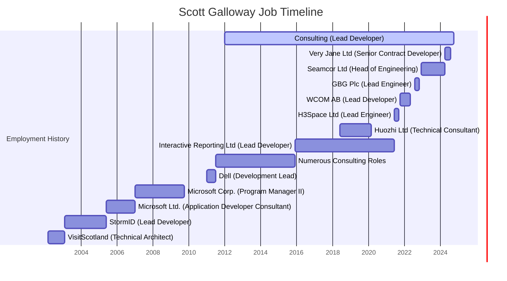

# Reanudar  Scott Galloway .NET Desarrollador  Remoto

<!--category-- Resume , introduction -->
<datetime class="hidden">2024-09-29T22:30</datetime>

Soy un desarrollador versátil y exitoso y lider con más de 25 años de experiencia construyendo equipos y plataformas y revitalizando startups.
Dotado de C#, ASP.NET y marcos web modernos, con amplia experiencia en computación en nube, DevOps, gestión de bases de datos y tecnologías de búsqueda. Un historial comprobado de proyectos de desarrollo exitosos líderes en diversas industrias, desde gigantes tecnológicos hasta startups innovadoras.

¿Necesitas ayuda para construir tu próximo proyecto?

**Correo electrónico:** [scott.galloway@gmail.com](mailto:scott.galloway@gmail.com)

**Teléfono:** +44 7498 479 614

**Puedes descargar un PDF de mi currículum [aquí](/uploads/ScottGallowayResume.pdf) y versión de Word [aquí](/uploads/ScottGallowayResume.docx)**

[TOC]

---

# Competencias

### Idiomas y marcos

- Lado del servidor: **C#** (25+años), **JavaScript** (20+ años), **ASP.NET a.NET 8** (25+ años). En menor medida: **Python**, **Java**, **C++**, **PHP**
- Interfaz: **Vue.js**, **JQuery**, **HTMX**, **Alpine.js**, **Reaccionar**, **Angular**, **Blazor** (y muchos más)
- Marcos CSS: **Coilwind CSS**, **Bootstrap**, **Manual**

### Bases de datos

- **SQL**: SQL Server, PostgreSQL, MySQL, SQLite
- **NoSQL**: MongoDB, RavenDB

### Computación en la nube y DevOps

- **Azure**, **Docker**, **Kubernetes**

### Liderazgo y desarrollo de software

- Funciones: Desarrollador principal, Desarrollador Senior.NET, Líder de Desarrollo, Jefe de Ingeniería, CTO
- Metodologías: Agile, Scrum, Kanban
- Herramientas: Jira, Trello, Azure DevOps, GitHub, GitLab
- Formación: Programa de formación de desarrolladores con tasa de éxito en el empleo del 90%
- Mentorship: Mentored junior developers y lideró equipos remotos geográficamente dispersos

---

## Aspectos destacados profesionales

- **Experiencia de desarrollo probada**: Un historial de más de 25 años en la conducción de desarrollo de software de pila completa, desde la codificación práctica a los roles de liderazgo ejecutivo.
- **Impacto en la industria**: Hizo contribuciones significativas a organizaciones líderes de la industria como Microsoft y Dell, así como a startups innovadoras en diversos sectores.
- **Liderazgo del equipo remoto**: Equipos remotos Spearheaded, fomentando la colaboración y la innovación entre los equipos globales, mientras diseñan un programa de formación para desarrolladores con una tasa de éxito de empleo del 90%.
- **Enfoque tecnológico de corte-Edge**: Avance continuo de la experiencia en pilas de desarrollo moderno, con un fuerte enfoque en metodologías de trabajo remotas y distribuidas.
- **Producto Estratégico y Constructor de Equipo**: Equipos de desarrollo de alto rendimiento construidos y asesorados, que los llevan a entregar productos impactantes en todas las industrias, asegurando la alineación con los objetivos de negocio y las necesidades de los usuarios.

---

# Historial del empleo (abreviado... he estado por aquí un tiempo)

## Consultoría  Desarrollador principal / Arquitecto / Director Gerente  Remoto

Ene 2012 – Presente

Dirigió varios proyectos de clientes como Lead Developer, Architect y CTO interino, asegurando lanzamientos de productos exitosos y la finalización de proyectos.
Desarrolló un programa de capacitación integral para más de 200 desarrolladores novatos, logrando una tasa de éxito laboral del 90%.
Modernizar los sistemas heredados, mejorando la eficiencia operacional y la experiencia de los usuarios mediante soluciones tecnológicas avanzadas.
Rebasó una plataforma de comercio electrónico, mejorando el rendimiento, la escalabilidad y la mantenibilidad.

## Muy Jane Ltd  Senior Contract Developer  Remote

Abr 2024 – Ago 2024

Sistemas de backend archivados para una gran aplicación de comercio electrónico, integrando sistemas de pago como Stripe Connect e Hyperwallet.
Implementó soluciones ASP.NET 8 para agilizar la carga de productos, pagos y promociones.

## Seamcor Ltd  Jefe de Ingeniería (Contrato)  Remoto

Dic 2022 – Abr 2024

Dirigió un equipo de 6 desarrolladores en la construcción y rearquitectura de un sistema ASP.NET Core, integrando Docker Compose y OpenSearch para mejorar el acceso a los datos y la presentación de informes.
Se aseguró una transición sin fisuras y escalabilidad de los sistemas para satisfacer las cambiantes necesidades de los clientes.

## GBG Plc (Loqate)  Ingeniero principal  Remoto

Ago 2022 – Nov 2022

Encabezó el desarrollo de un producto de búsqueda global usando microservicios.NET 6 y Kubernetes, optimizando para un alto rendimiento y grandes conjuntos de datos.
Establezca la dirección técnica para las operaciones de CI/CD, pruebas y sistemas a escala mundial.

## WCOM AB  Desarrollador principal (Contrato)  Remoto

Oct 2021 – May 2022

Ejecutó varios proyectos utilizando Azure DevOps, Azure Functions y Blazor Server para una arquitectura integral de informes y microservicios.
Desarrolló aplicaciones de réplica de pantalla y IPC basadas en SignalR para mejorar la interacción del usuario.

## H3Space Limited  Ingeniero principal  Remoto

Jun 2021 – Sep 2021

Construyó un equipo de desarrollo y una arquitectura de plataforma definida para una comunidad en línea escalable que apoya una herramienta de escritorio Unity 3D.
Se entregaron soluciones completas utilizando los servicios de React JS, GraphQL y Azure.

## Huozhi Limited  Consultor Técnico / Plomo Dev (Contrato)  Remoto

Jun 2018 – Mar 2020

Proporcionó liderazgo técnico y formación de equipo para una startup, regresando para resolver desafíos de desarrollo y liberación.

## Informe interactivo limitado  Desarrollador principal (contrato)  Remoto

Dic 2015 – Jun 2021

Desarrolló una plataforma de informes basada en la web utilizando ASP.NET MVC, WPF y WinForms, soportando múltiples backends de bases de datos.

## Dell  Líder de desarrollo  Glasgow, Reino Unido

Ene 2011 - Julio 2011
Lideró el desarrollo de una plataforma de implementación de imagen de máquina personalizada usando ASP.NET MVC y SQL Server.

## Microsoft Corp.  Administrador de programas II  Redmond, WA, USA

Ene 2007 – Oct 2009

Dirigió el ciclo de vida de lanzamiento de ASP.NET, gestionando el triaje de errores y la integración con la comunidad.NET más amplia.
Ofrece características básicas y nueva infraestructura de seguridad para Project Server.

## Microsoft Ltd.  Appplication Developer Consultant II  Reading, UK

Jun 2005 – Jan 2007

Especializada en análisis de rendimiento y afinación para una amplia variedad de clientes que van desde un gran proyecto NHS hasta pequeñas compañías de viajes, software para la policía del Reino Unido, etc. Dirigí múltiples laboratorios de rendimiento en los laboratorios de Microsoft UK, así como en aplicaciones de HPC en Stuttgart.
Ayudaron a los clientes a ofrecer una gran variedad de sistemas, al tiempo que mantenían enlaces con numerosos equipos de productos en Microsoft Corporate para ayudar a los clientes a resolver sus problemas de desarrollo.

## StormID  Desarrollador principal  Edimburgo, Reino Unido

Feb 2003 - Jun 2005

Entorno de agencia de ritmo rápido donde trabajé en muchos y variados proyectos de un sistema de fusión de correo masivo escalable (.5 millones +) utilizando ASP.NET, Windows Services, etc a través de un portal de educación para Microsoft UK y múltiples sistemas de comercio electrónico personalizados que aumentaron las tasas de conversión por orden de magnitud.

## VisitScotland – Arquitecto Técnico  Edimburgo, Reino Unido

Marzo de 2002 a febrero de 2003

Requisito para un número «templable» de sitios web basados en nuevas tecnologías; el conjunto de competencias existentes de los desarrolladores utilizaba un complejo sistema CORBA que ya no era adecuado para su finalidad.
Capacitación dirigida, arquitectura, flujo de trabajo para el equipo de 20 desarrolladores para pasar a un sistema basado en J2EE / MVC que permitió la entrega simple de múltiples sitios web temáticos basados en una sola plataforma ampliable.

# Educación

Universidad de Stirling  BSc (Hons) Psicología
Fecha de inicio: Sep 1992 - Fecha de finalización: Jun 1996
Ubicación: Stirling, Escocia, Reino Unido

# Vínculos

LinkedIn: [Scott Galloway](https://www.linkedin.com/in/scott-galloway-91608691/)
GitHub: [Este blog](https://github.com/scottgal/mostlylucidweb)