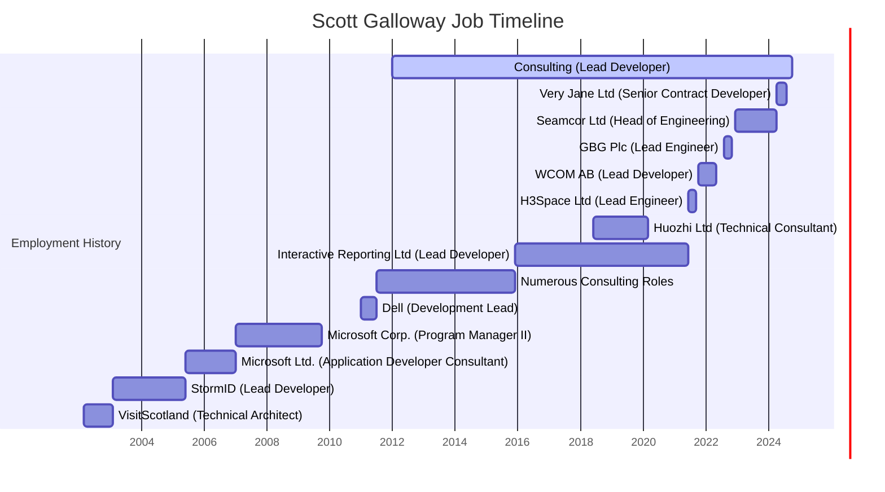

# Résumé Scott Galloway.NET Développeur à distance

<!--category-- Resume , introduction -->
<datetime class="hidden">2024-09-29T22:30</datetime>

Je suis un développeur polyvalent et accompli avec un record de plus de 25 ans de construction d'équipes et de plateformes et de startups revitalisantes.
Compétence en C#, ASP.NET, et des cadres Web modernes, avec une vaste expérience dans l'informatique en nuage, DevOps, la gestion de bases de données et les technologies de recherche. Expérience éprouvée de projets de développement couronnés de succès dans diverses industries, des géants technologiques aux startups innovantes.

Besoin d'aide pour construire votre prochain projet?

**Courriel :** [scott.gloway@gmail.com](mailto:scott.galloway@gmail.com)

**Téléphone :** +44 7498 479 614

**Vous pouvez télécharger un PDF de mon CV [Ici.](/uploads/ScottGallowayResume.pdf) et version Word [Ici.](/uploads/ScottGallowayResume.docx)**

[TOC]

---

# Compétences

### Langues et cadres

- Côté serveur & #160;: **C#** (25 ans et plus), **Cliquez sur « & #160; JavaScript & #160; »** (20 ans et plus), **ASP.NET vers.NET 8** (25 ans et plus). Dans une moindre mesure: **Python**, **Java**, **C++**, **PHP**
- Avant-garde : **Vue.js**, **JQuery**, **HTMX**, **Alpine.js**, **Réagir**, **Angulaire**, **Blazor** (et beaucoup d'autres)
- Cadres CSS : **Le vent de queue CSS**, **Poignée d'embouteillage**, **Manuel**

### Bases de données

- **SQL**: Serveur SQL, PostgreSQL, MySQL, SQLite
- **NuméroSQL**: MongoDB, RavenDB

### Cloud Computing & DevOps

- **Atteinte**, **Poivrons**, **Kubernetes**

### Leadership & Développement de logiciels

- Rôles : Développeur principal, Développeur principal.NET, Responsable du développement, Chef de l'ingénierie, CTO
- Méthodologies: Agile, Scrum, Kanban
- Outils: Jira, Trello, Azure DevOps, GitHub, GitLab
- Formation : Programme de formation des développeurs avec un taux de réussite d'emploi de 90 %
- Mentorship: mentoré des développeurs juniors et dirigé des équipes éloignées géographiquement dispersées

---

## Faits saillants pour les professionnels

- **Expertise éprouvée en développement**: Un bilan de plus de 25 ans en matière de développement de logiciels complets, du codage pratique aux rôles de direction.
- **Impact sur l'industrie**: A apporté des contributions importantes à des organisations de premier plan comme Microsoft et Dell, ainsi qu'à des start-up innovantes dans divers secteurs.
- **Leadership d'équipe à distance**: Des équipes éloignées, favorisant la collaboration et l'innovation entre les équipes mondiales, tout en concevant un programme de formation des développeurs avec un taux de réussite d'emploi de 90%.
- **Cutting-Edge Technological Focus**: Perfectionnement continu de l'expertise dans les piles de développement moderne, en mettant fortement l'accent sur les méthodologies de travail à distance et distribuées.
- **Produit stratégique et constructeur d'équipe**: Des équipes de développement à haut rendement ont été construites et encadrées, les conduisant à fournir des produits performants dans toutes les industries, en assurant l'alignement sur les objectifs commerciaux et les besoins des utilisateurs.

---

# Historique de l'emploi (abrévié... J'ai été quelque temps)

## Conseils Développeur / Architecte / Directeur Général

Janv. 2012 – Présent

Dirigé plusieurs projets clients en tant que développeur principal, architecte et CTO intérimaire, assurant le lancement réussi de produits et l'achèvement du projet.
Élaboration d'un programme de formation complet à l'intention de plus de 200 concepteurs novices, ce qui a permis d'atteindre un taux de réussite d'emploi de 90 %.
Modernisation des systèmes existants, amélioration de l'efficacité opérationnelle et de l'expérience des utilisateurs grâce à des solutions technologiques de pointe.
Réaménagé une plate-forme de commerce électronique, améliorant les performances, l'évolutivité et la maintenance.

## Très Jane Ltd. Développeur principal du contrat à distance

Avril 2024 – Août 2024

Systèmes d'arrière-plan architecturés pour une grande application e-commerce, intégrant des systèmes de paiement comme Stripe Connect et Hyperwallet.
Mise en œuvre de solutions ASP.NET 8 pour rationaliser le chargement, les paiements et les promotions des produits.

## Seamcor Ltd. Responsable de l'ingénierie (contrat)

Déc 2022 – Avr 2024

Dirigé une équipe de 6 développeurs dans la construction et la retouche d'un système ASP.NET Core, intégrant Docker Compose et OpenSearch pour améliorer l'accès aux données et les rapports.
Assurer une transition transparente et l'évolutivité des systèmes pour répondre à l'évolution des besoins des clients.

## GBG Plc (Loqate) (Engineer) (Engineer) (Engineer) (Engineer) (Engineer) (Engineer) (Engineer) (Engineer) (Engineer)

Août 2022 – Nov 2022

Spearhead le développement d'un produit de recherche global utilisant.NET 6 microservices et Kubernetes, l'optimisation pour un débit élevé et de grands ensembles de données.
Définir la direction technique pour l'IC/CD, les essais et les opérations des systèmes à l'échelle mondiale.

## Développeur en chef (Contract)

Oct 2021 – Mai 2022

Exécuté divers projets utilisant Azure DevOps, Azure Functions et Blazor Server pour une architecture complète de reporting et de microservices.
Mise au point d'applications de IPC et de miroir d'écran basées sur le signalR pour améliorer l'interaction des utilisateurs.

## H3Space Limited (en anglais seulement) Ingénieur principal (en anglais seulement) Remote

Juin 2021 – Sep 2021

Construit une équipe de développement et une architecture de plate-forme définie pour une communauté en ligne évolutive soutenant un outil Unity 3D Desktop.
Des solutions complètes ont été fournies grâce aux services React JS, GraphQL et Azure.

## Huozhi Limited: Consultant technique / Dev Lead (contrat)

Juin 2018 – mars 2020

A fourni un leadership technique et la formation d'équipe pour une startup, retour à résoudre les défis de développement et de libération.

## Interactive Reporting Limited : Développeur principal (contrat) : Remote

Déc. 2015 – juin 2021

Mise au point d'une plate-forme de reporting en ligne à l'aide de ASP.NET MVC, WPF et WinForms, prenant en charge plusieurs bases de données.

## Lead de développement de Dell, Glasgow, Royaume-Uni

Janv. 2011 - Juillet 2011
Dirigé le développement d'une plate-forme de déploiement d'images de machine personnalisée à l'aide d'ASP.NET MVC et SQL Server.

## Gestionnaire de programme II de Microsoft Corp. de Redmond, WA, États-Unis

Janvier 2007 – octobre 2009

Drive le cycle de vie d'ASP.NET, la gestion du triage des bogues et l'intégration avec la communauté.NET plus large.
Fonctions de base fournies et nouvelle infrastructure de sécurité pour Project Server.

## Microsoft Ltd. (en anglais seulement) Application Developer Consultant II (en anglais seulement) Reading (en anglais seulement)

Juin 2005 – janvier 2007

Spécialisé dans l'analyse des performances et le réglage pour une grande variété de clients allant d'un grand projet NHS à de petites entreprises de voyage, des logiciels pour la police britannique, etc. J'ai dirigé plusieurs laboratoires de performance dans les laboratoires de Microsoft UK ainsi que dans les applications HPC à Stuttgart.
Les clients ont aidé à fournir une très grande variété de systèmes tout en assurant la liaison avec de nombreuses équipes de produits chez Microsoft Corporate pour aider les clients à résoudre leurs problèmes de développement.

## Développeur en chef d'Edimbourg, Royaume-Uni

Fév 2003 - Juin 2005

Un environnement d'agence rapide où j'ai travaillé sur des projets nombreux et variés d'un système de fusion de courrier massivement évolutive (plus de 5 millions) utilisant ASP.NET, Windows Services etc par le biais d'un portail d'éducation pour Microsoft UK et de plusieurs systèmes de commerce électronique personnalisés qui ont diversement augmenté les taux de conversion par ordre de grandeur.

## VisitScotland – Architecte technique Édimbourg, Royaume-Uni

Mars 2002 - Fév 2003

L'exigence d'un «nombre provisoire» de sites Web basés sur des technologies plus récentes; les compétences existantes des développeurs utilisaient un système CORBA complexe qui n'était plus adapté à des fins précises.
Formation dirigée, architecture, flux de travail pour l'équipe de 20 développeurs pour passer à un système basé sur J2EE / MVC qui a permis la livraison simple de plusieurs sites thématiques basés sur une plate-forme extensible unique.

# Éducation

Université de Stirling-Sc (Hons) Psychologie
Date de début: Septembre 1992 - Date de fin: Juin 1996
Lieu: Stirling, Écosse, Royaume-Uni

# Liens

LinkedIn: [Scott Galloway](https://www.linkedin.com/in/scott-galloway-91608691/)
C'est GitHub. [Ce blog](https://github.com/scottgal/mostlylucidweb)