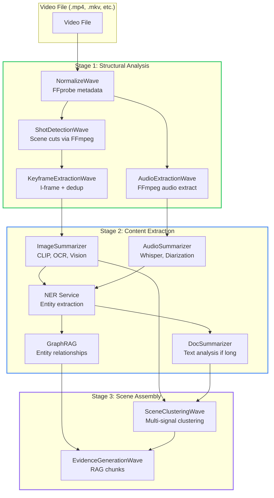

# VideoSummarizer: Reduced RAG for Video (Shots → Scenes → Evidence)

<!-- category -- AI,Video,ONNX,Patterns,Architecture,LLM,NER,CLIP -->
<datetime class="hidden">2026-01-15T19:00</datetime>

> **Status**: In development as part of [lucidRAG](https://www.lucidrag.com).
> **Source**: [github.com/scottgal/lucidrag](https://github.com/scottgal/lucidrag)

**Where this fits**: VideoSummarizer is the **orchestrator** of the [lucidRAG](https://www.lucidrag.com) family, combining five pipelines into a unified video analysis engine:

- **[DocSummarizer](/blog/building-a-document-summarizer-with-rag)** - Documents (entity extraction, knowledge graphs)
- **[ImageSummarizer](/blog/constrained-fuzzy-image-intelligence)** - Images (22-wave visual intelligence, CLIP embeddings, OCR)
- **[AudioSummarizer](/blog/audiosummarizer-forensic-audio-characterization)** - Audio (acoustic profiling, speaker diarization, transcription)
- **VideoSummarizer** (this article) - Video (orchestrates all three, adds shot/scene structure)
- **[DataSummarizer](/blog/datasummarizer-how-it-works)** - Data (schema inference, profiling)

All follow the same **[Reduced RAG pattern](/blog/reduced-rag)**: extract signals once, store evidence, synthesize with bounded LLM input.

---

Processing a two-hour movie frame-by-frame with CLIP embeddings would take hours and cost hundreds of dollars in compute. The naive approach (send every frame to a Vision LLM) is even worse.

**VideoSummarizer solves this with three key optimizations:**

1. **Perceptual hash deduplication** - Skip visually similar frames before expensive ML (40% reduction)
2. **Batch CLIP embedding** - Process 8 images per GPU pass instead of one (3-5x speedup)
3. **Pipeline composition** - Chain ImageSummarizer for keyframes, AudioSummarizer for speech, NER (Named Entity Recognition) for entities, DocSummarizer for text analysis, GraphRAG for entity relationships

The result: a 2-hour movie processes in ~10-15 minutes, not hours. CLIP is used for **fast, local semantic embeddings**; Vision LLMs are optional and only invoked for escalated analysis.

Same architecture principles as [ImageSummarizer](/blog/constrained-fuzzy-image-intelligence) and [AudioSummarizer](/blog/audiosummarizer-forensic-audio-characterization), but composed into a unified video analysis pipeline.

> **Core insight:** Video is shots + audio + text. Process each domain with specialized tools, merge results into coherent scenes.
>
> - **Process structure first** (cuts, I-frames, audio segments)
> - **Extract cross-modal signals once** (embeddings, transcripts, entities)

**Terminology:**
- **Shot** - camera take between cuts (structural, from FFmpeg scene detection)
- **Scene** - contiguous group of shots forming a coherent unit (semantic, from clustering)
- **Evidence** - `(start_time, end_time)` + signals + pointers + provenance

**Key ML models used:**
- **[CLIP](https://openai.com/research/clip)** - OpenAI's Contrastive Language-Image Pre-training; generates 512-dimensional embeddings that encode visual semantics
- **[Whisper](https://openai.com/research/whisper)** - OpenAI's speech recognition model; transcribes audio to text with timestamps
- **[BERT-NER](https://huggingface.co/dslim/bert-base-NER)** - Named Entity Recognition; extracts people, organizations, locations from text
- **[ONNX Runtime](https://onnxruntime.ai/)** - Cross-platform ML inference; runs models on CPU/GPU without framework lock-in

This article covers:
- How VideoSummarizer orchestrates five pipelines (ImageSummarizer, AudioSummarizer, NER, DocSummarizer, GraphRAG)
- Wave architecture: 16 waves from normalization to evidence generation
- **Capability system**: Lazy model downloads, GPU detection, reactive routing
- Batch CLIP optimization for keyframe embeddings (3-5x faster)
- Perceptual hash deduplication (40% frame reduction)
- Multi-signal scene clustering (embedding + transcript + cut type + temporal)
- NER integration for entity extraction from transcripts
- **Ephemeral atoms** for rate limiting, time estimation, and backpressure
- Output: scenes, shots, transcripts, text tracks as RAG evidence

**Related articles**:
- **[Reduced RAG](https://www.mostlylucid.net/blog/reduced-rag)** - The core pattern
- **[Constrained Fuzziness Pattern](/blog/constrained-fuzziness-pattern)** - The foundational pattern
- **Reduced RAG Implementations:**
  - [DocSummarizer](/blog/building-a-document-summarizer-with-rag) - Document RAG with entity extraction
  - [ImageSummarizer](/blog/constrained-fuzzy-image-intelligence) - Image RAG with 22-wave visual intelligence
  - [AudioSummarizer](/blog/audiosummarizer-forensic-audio-characterization) - Audio forensic characterization
  - **VideoSummarizer (this article)** - Video intelligence orchestrator

[TOC]

---

## The Problem: Video is Expensive

> **Benchmarks**: Numbers below measured on AMD 9950X (16-core) / NVIDIA A4000 (16GB) / 96GB RAM / NVMe, 1080p H.264, Whisper base. These numbers show **order-of-magnitude effects**, not absolute performance guarantees.

A typical movie contains:
- **~170,000 frames** (2 hours at 24fps)
- **~2 hours of audio** (speech, music, effects)
- **Multiple text layers** (subtitles, credits, on-screen text)

The strawman approach (nobody does this, but it sets the scale):
- CLIP embedding per frame: ~200ms × 170,000 = **9.4 hours**
- Vision LLM per frame: ~2s × 170,000 = **94 hours** (cloud Vision API ballpark: ~$500)

Even with keyframe extraction (say, 500-1000 frames), that's still 100-200 seconds of serial CLIP inference.

**Traditional approach**: "Extract keyframes, send to Vision LLM, hope for the best"

**Problem**: This burns compute on redundant frames (many keyframes are visually similar), processes them serially (GPU idle between frames), and misses audio/text signals entirely.

**Solution**: Multi-stage filtering, batch processing, and pipeline composition.

---

## The VideoSummarizer Architecture

VideoSummarizer implements **[Reduced RAG](/blog/reduced-rag)** for video with a three-stage reduction:



### Evidence Artifacts Produced

Before diving into implementation, here's what you get (the output schema):

| Artifact | Key Fields | Source |
|----------|------------|--------|
| **Scene** | `id`, `start_time`, `end_time`, `key_terms[]`, `speaker_ids[]`, `embedding[512]` | SceneClusteringWave |
| **Shot** | `id`, `start_time`, `end_time`, `cut_type`, `keyframe_path` | ShotDetectionWave |
| **Utterance** | `id`, `text`, `start_time`, `end_time`, `speaker_id`, `confidence` | TranscriptionWave |
| **TextTrack** | `id`, `text`, `start_time`, `text_type` (title/credit/subtitle/ocr) | SubtitleExtractionWave |
| **Keyframe** | `id`, `timestamp`, `frame_path`, `dhash`, `clip_embedding[512]` | KeyframeExtractionWave |

Each artifact includes **provenance**: source wave, processing timestamp, confidence score. These artifacts are the **primary retrieval units** for video queries; raw files are never retrieved directly.

### The Signal-Aware Wave Pipeline

VideoSummarizer uses a **signal-based wave architecture** where each wave declares its signal contracts explicitly:

```csharp
public interface ISignalAwareVideoWave
{
    /// <summary>Signals this wave requires before it can run.</summary>
    IReadOnlyList<string> RequiredSignals { get; }

    /// <summary>Signals this wave can optionally use if available.</summary>
    IReadOnlyList<string> OptionalSignals { get; }

    /// <summary>Signals this wave emits on successful completion.</summary>
    IReadOnlyList<string> EmittedSignals { get; }

    /// <summary>Cache keys this wave produces for downstream waves.</summary>
    IReadOnlyList<string> CacheEmits { get; }

    /// <summary>Cache keys this wave consumes from upstream waves.</summary>
    IReadOnlyList<string> CacheUses { get; }
}
```

This enables **dynamic wave coordination**:
- Waves skip automatically if required signals are missing
- Dependencies resolve at runtime (no hardcoded order)
- Partial reruns are reproducible (cache by signal key)
- UI progress granularity: each wave emits progress independently

### The 16-Wave Pipeline

Keyframe extraction is implemented as 7 granular waves for better parallelism and cache efficiency:

| Wave | Priority | Requires | Emits | Time |
|------|----------|----------|-------|------|
| **NormalizeWave** | 1000 | - | `video.duration`, `video.fps`, `video.normalized` | ~2s |
| **FFmpegShotDetectionWave** | 900 | `video.normalized` | `shots.detected`, `shots.count` | ~5-10s |
| **IFrameDetectionWave** | 850 | `video.normalized` | `keyframes.iframes_detected`, `keyframes.iframes_count` | ~3s |
| **KeyframeSelectionWave** | 840 | `shots.detected`, `keyframes.iframes_detected` | `keyframes.selected`, `keyframes.selected_count` | ~1s |
| **ThumbnailExtractionWave** | 830 | `keyframes.selected` | `keyframes.thumbnails_extracted` | ~5s |
| **KeyframeDeduplicationWave** | 820 | `keyframes.thumbnails_extracted` | `keyframes.deduplicated`, `keyframes.duplicates_skipped` | ~1s |
| **KeyframeFullResExtractionWave** | 810 | `keyframes.deduplicated` | `keyframes.extracted`, `keyframes.count` | ~10s |
| **ClipEmbeddingWave** | 800 | `keyframes.extracted` | `clip.embeddings_ready`, `clip.embeddings_count` | ~30s |
| **ImageAnalysisWave** | 790 | `keyframes.deduplicated` | `keyframes.analyzed`, `ocr.extracted` | ~60s |
| **TitleCreditsDetectionWave** | 750 | `shots.detected` | `title.detected`, `credits.detected` | ~5s |
| **AudioExtractionWave** | 650 | `video.normalized` | `audio.extracted`, `audio.path` | ~30s |
| **TranscriptionWave** | 600 | `audio.extracted` | `transcription.complete`, `transcription.utterance_count` | ~120s |
| **SubtitleExtractionWave** | 550 | `video.normalized` | `subtitles.extracted` | ~2s |
| **ChapterExtractionWave** | 500 | `video.normalized` | `chapters.extracted` | ~1s |
| **SceneClusteringWave** | 400 | `shots.detected` | `scenes.detected`, `scene.count` | ~5s |
| **EvidenceGenerationWave** | 100 | `scenes.detected` | `evidence.generated` | ~2s |

**Notes:**
- ImageAnalysisWave uses `keyframes.deduplicated` (not full-res): OCR runs on thumbnails; vision captioning uses full-res when available via capability routing.
- Waves 3-7 are the "keyframe extraction" sub-pipeline (7 granular waves for cache efficiency).

**Total for 2-hour movie**: ~10-15 minutes (vs. hours without optimization)

### Well-Known Signal Keys

Signals are defined as constants for consistency:

```csharp
public static class VideoSignals
{
    // NormalizeWave signals
    public const string VideoDuration = "video.duration";
    public const string VideoFps = "video.fps";
    public const string VideoNormalized = "video.normalized";

    // Shot detection signals
    public const string ShotsDetected = "shots.detected";
    public const string ShotsCount = "shots.count";

    // Keyframe signals
    public const string IframesDetected = "keyframes.iframes_detected";
    public const string KeyframesSelected = "keyframes.selected";
    public const string KeyframesDeduplicated = "keyframes.deduplicated";
    public const string KeyframesExtracted = "keyframes.extracted";

    // CLIP embedding signals
    public const string ClipEmbeddingsReady = "clip.embeddings_ready";

    // Scene clustering signals
    public const string ScenesDetected = "scenes.detected";
    public const string SceneCount = "scene.count";

    // Transcription signals
    public const string TranscriptionComplete = "transcription.complete";
}
```

---

## Capability System: Lazy Models & Routing

VideoSummarizer uses a **capability-based architecture**: detect GPU once at startup, download models lazily, route work to available components.

### Model Manifest (YAML + Type-Safe Constants)

Models are defined in `models.yaml`. No magic strings in code:

```yaml
# models.yaml (excerpt)
models:
  clip-vit-b32:
    name: "CLIP ViT-B/32"
    download_url: "https://huggingface.co/openai/clip-vit-base-patch32/resolve/main/onnx/visual_model.onnx"
    preferred_providers: [CUDAExecutionProvider, DmlExecutionProvider, CPUExecutionProvider]

components:
  ClipEmbeddingWave:
    models: [clip-vit-b32]
    fallback_chain: [ImageAnalysisWave]
```

```csharp
// Type-safe constants (no raw strings)
await coordinator.EnsureModelAsync(ModelIds.ClipVitB32);
await coordinator.ActivateWaveAsync(ComponentIds.TranscriptionWave);

// Route with fallback
var route = await coordinator.RouteWorkAsync(new[]
{
    ComponentIds.ClipEmbeddingWave,    // Primary (GPU)
    ComponentIds.ImageAnalysisWave     // Fallback (CPU)
});
```

### Pipeline Efficiency Atoms

Rate limiting, time estimation, and adaptive backpressure keep the UI responsive while maximizing throughput:

```csharp
// Time estimation from actual data
var estimator = CapabilityAtoms.CreateTimeEstimator();
using (estimator.Time("clip_embedding")) { await ProcessAsync(); }
var eta = estimator.GetEstimate("clip_embedding", remaining: 50);
// eta.Estimated, eta.Optimistic, eta.Pessimistic, eta.Confidence
```

> **Full capability system docs**: See `Mostlylucid.Summarizer.Core/Capabilities/` for GPU detection, signal pub/sub, backpressure controllers, and mesh topology design

---

## Key Optimization 1: Perceptual Hash Deduplication

Before running expensive CLIP embeddings, VideoSummarizer filters out visually similar frames using **difference hash (dHash)**.

### How dHash Works

```csharp
public class KeyframeDeduplicationService
{
    // dHash parameters: 9x8 grayscale = 64 bits
    private const int HashWidth = 9;
    private const int HashHeight = 8;
    private const int DefaultHammingThreshold = 10;

    public async Task<ulong> ComputeDHashAsync(string imagePath, CancellationToken ct)
    {
        using var image = Image.Load<Rgba32>(imagePath);

        // Resize to 9x8 (one extra column for gradient comparison)
        image.Mutate(x => x
            .Resize(HashWidth, HashHeight)
            .Grayscale());

        ulong hash = 0;
        int bit = 0;

        // Compare adjacent pixels horizontally
        for (int y = 0; y < HashHeight; y++)
        {
            for (int x = 0; x < HashWidth - 1; x++)
            {
                var left = image[x, y].R;
                var right = image[x + 1, y].R;

                // Set bit if left pixel is brighter than right
                if (left > right)
                {
                    hash |= (1UL << bit);
                }
                bit++;
            }
        }

        return hash;
    }

    public static int HammingDistance(ulong a, ulong b) =>
        BitOperations.PopCount(a ^ b);
}
```

**Example output:**
```
Input: 50 keyframe candidates (from codec I-frames)

Deduplication (Hamming threshold 10):
  Frame 0: hash=0x8f3a2c1d → KEEP (first frame)
  Frame 1: hash=0x8f3a2c1e → SKIP (distance=1 from frame 0)
  Frame 2: hash=0x8f3a2c1f → SKIP (distance=2 from frame 0)
  Frame 3: hash=0xc7e1b4a2 → KEEP (distance=28 from frame 0)
  ...

Result: 50 → 30 frames (40% reduction)
Processing saved: ~8 seconds of CLIP inference
```

**Why this matters:**
- **~40% frame reduction** on typical content
- **<1ms per frame** for hash computation (vs. 200ms for CLIP)
- Filters redundant frames **before** expensive GPU operations

---

## Key Optimization 2: Batch CLIP Embedding

Instead of processing one image at a time, VideoSummarizer batches 8 images per GPU pass.

### Batch Processing Architecture

```csharp
public class BatchClipEmbeddingService
{
    private const int ClipImageSize = 224;
    private const int DefaultBatchSize = 8; // 8 images per GPU pass

    public async Task<Dictionary<int, float[]>> GenerateBatchEmbeddingsAsync(
        Dictionary<int, string> framePaths,
        IBackpressureController backpressure,
        ITimeEstimator estimator,
        int batchSize = DefaultBatchSize,
        CancellationToken ct = default)
    {
        var session = await GetOrLoadClipModelAsync(ct);
        var results = new ConcurrentDictionary<int, float[]>();

        // Pre-index batch for O(1) lookup
        var batches = framePaths
            .Select((kvp, idx) => (idx, kvp.Key, kvp.Value))
            .Chunk(batchSize)
            .ToList();

        foreach (var batch in batches)
        {
            // Acquire slot from backpressure controller (adaptive concurrency)
            using var slot = await backpressure.AcquireSlotAsync(ct);
            using var timer = estimator.Time("clip_batch");

            // Create batch tensor [batchSize, 3, 224, 224]
            var tensor = new DenseTensor<float>(new[] { batch.Length, 3, ClipImageSize, ClipImageSize });

            // Preprocess images into tensor slots
            for (int i = 0; i < batch.Length; i++)
            {
                var (_, frameIndex, path) = batch[i];
                PreprocessImageToTensor(path, tensor, slotIndex: i);
            }

            // Single GPU pass for entire batch
            var inputs = new List<NamedOnnxValue>
            {
                NamedOnnxValue.CreateFromTensor("input", tensor)
            };

            using var outputResults = session.Run(inputs);
            // Extract embeddings, record latency for backpressure adjustment
        }

        backpressure.RecordLatency(estimator.GetAverageDuration("clip_batch"));
        return new Dictionary<int, float[]>(results);
    }
}
```

**Performance comparison:**
```
Input: 30 keyframes (after deduplication)

Serial processing (1 frame at a time):
  30 × 200ms = 6,000ms (6.0 seconds)

Batch processing (8 frames per pass):
  4 batches × 350ms = 1,400ms (1.4 seconds)

Speedup: 4.3x
```

**Why batch processing works:**
- GPU parallelism is underutilized with single-image inference
- Batch tensor `[8, 3, 224, 224]` uses same GPU memory as single image (almost)
- ONNX Runtime optimizes batch operations internally

---

## Key Optimization 3: Pipeline Composition

VideoSummarizer doesn't reinvent ImageSummarizer or AudioSummarizer. It **chains** them.

### Keyframe Sub-Pipeline: ImageSummarizer Integration

The keyframe extraction is split into 7 granular waves (see wave table above). Here's the coordination pattern showing how they chain together:

```csharp
// IFrameDetectionWave → KeyframeSelectionWave → ThumbnailExtractionWave
// → KeyframeDeduplicationWave → KeyframeFullResExtractionWave → ClipEmbeddingWave

// ClipEmbeddingWave coordinates with ImageSummarizer
public class ClipEmbeddingWave : IVideoWave, ISignalAwareVideoWave
{
    private readonly BatchClipEmbeddingService _batchClipService;
    private readonly IBackpressureController _backpressure;
    private readonly ITimeEstimator _estimator;

    public IReadOnlyList<string> RequiredSignals => [VideoSignals.KeyframesExtracted];
    public IReadOnlyList<string> EmittedSignals => [VideoSignals.ClipEmbeddingsReady];

    public async Task ProcessAsync(VideoContext context, CancellationToken ct)
    {
        var keyframes = context.GetCached<Dictionary<int, string>>("keyframes.paths");

        // Batch CLIP embedding with backpressure control
        var embeddings = await _batchClipService.GenerateBatchEmbeddingsAsync(
            keyframes, _backpressure, _estimator, batchSize: 8, ct);

        foreach (var (frameIndex, embedding) in embeddings)
            context.KeyframeEmbeddings[frameIndex] = embedding;
    }
}

// ImageAnalysisWave runs ImageSummarizer on deduplicated frames
public class ImageAnalysisWave : IVideoWave, ISignalAwareVideoWave
{
    public IReadOnlyList<string> RequiredSignals => [VideoSignals.KeyframesDeduplicated];

    public async Task ProcessAsync(VideoContext context, CancellationToken ct)
    {
        var keyframePaths = context.GetCached<List<string>>("keyframes.deduplicated_paths");

        foreach (var path in keyframePaths)
        {
            // Run ImageSummarizer for OCR, vision, captions
            var result = await _imageOrchestrator.AnalyzeAsync(path, ct);
            context.SetCached($"image_analysis.{Path.GetFileName(path)}", result);
        }
    }
}
```

### TranscriptionWave: AudioSummarizer Integration

Audio extraction and transcription are now separate signal-aware waves:

```csharp
// AudioExtractionWave runs first (extracts audio track from video)
public class AudioExtractionWave : IVideoWave, ISignalAwareVideoWave
{
    public IReadOnlyList<string> RequiredSignals => [VideoSignals.VideoNormalized];
    public IReadOnlyList<string> EmittedSignals => ["audio.extracted", "audio.path"];

    public async Task ProcessAsync(VideoContext context, CancellationToken ct)
    {
        var audioPath = await _ffmpegService.ExtractAudioAsync(
            context.VideoPath, context.WorkingDirectory, ct);
        context.SetCached("audio.path", audioPath);
    }
}

// TranscriptionWave depends on audio.extracted signal
public class TranscriptionWave : IVideoWave, ISignalAwareVideoWave
{
    public IReadOnlyList<string> RequiredSignals => ["audio.extracted"];
    public IReadOnlyList<string> EmittedSignals => [
        VideoSignals.TranscriptionComplete,
        "transcription.utterance_count"
    ];

    public async Task ProcessAsync(VideoContext context, CancellationToken ct)
    {
        var audioPath = context.GetCached<string>("audio.path");

        // Run AudioSummarizer pipeline (Whisper + diarization)
        var audioProfile = await _audioOrchestrator.AnalyzeAsync(audioPath, ct);

        // Extract utterances with speaker info
        var turns = audioProfile.GetValue<List<SpeakerTurn>>("speaker.turns");
        foreach (var turn in turns ?? [])
        {
            context.Utterances.Add(new Utterance
            {
                Id = Guid.NewGuid(),
                Text = turn.Text,
                StartTime = turn.StartSeconds,
                EndTime = turn.EndSeconds,
                SpeakerId = turn.SpeakerId,
                Confidence = turn.Confidence
            });
        }

        // Run NER on full transcript for entity extraction
        var transcript = audioProfile.GetValue<string>("transcription.full_text");
        if (!string.IsNullOrEmpty(transcript))
        {
            var entities = await _nerService.ExtractEntitiesAsync(transcript, ct);
            context.SetCached("transcript_entities", entities);

            // Emit entity signals by type (PER, ORG, LOC, MISC)
            foreach (var group in entities.GroupBy(e => e.Type))
            {
                context.AddSignal($"transcript.entities.{group.Key.ToLowerInvariant()}",
                    group.Select(e => e.Text).Distinct().ToList());
            }
        }
    }
}
```

---

## NER Integration: Named Entity Recognition

VideoSummarizer extracts named entities from transcripts using BERT-based NER (ONNX).

### OnnxNerService

```csharp
public class OnnxNerService
{
    // Model: dslim/bert-base-NER (ONNX exported)
    // Entities: PER (Person), ORG (Organization), LOC (Location), MISC (Miscellaneous)

    public async Task<List<EntitySpan>> ExtractEntitiesAsync(string text, CancellationToken ct)
    {
        var entities = new List<EntitySpan>();

        // Chunk long text (BERT max 512 tokens)
        foreach (var chunk in ChunkText(text, maxTokens: 400, overlap: 50))
        {
            // Tokenize with WordPiece
            var tokens = _tokenizer.Tokenize(chunk);

            // Run ONNX inference
            var inputs = PrepareInputs(tokens);
            using var results = _session.Run(inputs);

            // Decode BIO tags
            var predictions = DecodePredictions(results);
            var chunkEntities = ExtractEntitySpans(tokens, predictions);

            entities.AddRange(chunkEntities);
        }

        // Deduplicate entities
        return entities
            .GroupBy(e => (e.Text.ToLowerInvariant(), e.Type))
            .Select(g => g.First())
            .ToList();
    }
}
```

**Example output:**
```
Transcript: "Today we're speaking with John Smith from Microsoft about
their new AI lab in Seattle. The project, codenamed Phoenix, builds
on research from Stanford University."

Entities extracted:
  PER: John Smith
  ORG: Microsoft, Stanford University
  LOC: Seattle
  MISC: Phoenix

Signals emitted:
  transcript.entities.per = ["John Smith"]
  transcript.entities.org = ["Microsoft", "Stanford University"]
  transcript.entities.loc = ["Seattle"]
  transcript.entities.misc = ["Phoenix"]
```

**Why NER matters for video:**
- Enables queries like "Find videos mentioning Microsoft"
- Links to DocSummarizer entity graph
- Provides structured metadata without LLM inference

---

## Multi-Signal Scene Clustering

Using CLIP embeddings alone for scene detection doesn't work well. Keyframes are sparse by design (one per shot change), but shots are dense. With 39 embeddings for 1881 shots (~2% coverage), pure embedding clustering produces just 1 scene for a 2-hour movie.

VideoSummarizer uses a **multi-signal approach** that combines 4 weighted signals for robust scene boundary detection. Scene boundaries are selected by **deterministic weighted scoring**, not learned end-to-end:

### SceneClusteringWave: Multi-Signal Architecture

```csharp
public class SceneClusteringWave : IVideoWave, ISignalAwareVideoWave
{
    // Signal weights for boundary scoring
    private const double EmbeddingWeight = 0.4;   // CLIP embedding dissimilarity
    private const double TranscriptWeight = 0.3;  // Semantic shift in transcript
    private const double CutTypeWeight = 0.2;     // Fade/dissolve detection
    private const double TemporalWeight = 0.1;    // Time since last scene

    // Temporal constraints
    private const double MinSceneDuration = 15.0;   // Don't split scenes < 15s
    private const double MaxSceneDuration = 300.0;  // Force split at 5 minutes
    private const double TargetSceneDuration = 90.0; // Prefer ~90s scenes

    public IReadOnlyList<string> RequiredSignals => [VideoSignals.ShotsDetected];
    public IReadOnlyList<string> OptionalSignals => [
        VideoSignals.ClipEmbeddingsReady,
        VideoSignals.TranscriptionComplete,
        VideoSignals.KeyframesDeduplicated
    ];
    public IReadOnlyList<string> EmittedSignals => [
        VideoSignals.ScenesDetected,
        "scene.count",
        "scene.avg_duration",
        "scene.clustering_method"
    ];

    private List<(int shotIndex, double score)> ComputeBoundaryScores(VideoContext context)
    {
        var shots = context.Shots.OrderBy(s => s.StartTime).ToList();
        var scores = new List<(int, double)>();

        // Build embedding map with nearest-neighbor interpolation
        var shotEmbeddings = PropagateEmbeddingsToNearbyShots(context, shots);

        // Build transcript windows for semantic shift detection
        var transcriptWindows = BuildTranscriptWindows(context, shots, windowSeconds: 10);

        for (int i = 0; i < shots.Count - 1; i++)
        {
            double score = 0;
            var currentShot = shots[i];
            var nextShot = shots[i + 1];

            // 1. Embedding dissimilarity (40%)
            if (shotEmbeddings.TryGetValue(i, out var currentEmbed) &&
                shotEmbeddings.TryGetValue(i + 1, out var nextEmbed))
            {
                var similarity = CosineSimilarity(currentEmbed, nextEmbed);
                score += (1.0 - similarity) * EmbeddingWeight;
            }

            // 2. Transcript semantic shift (30%)
            if (transcriptWindows.TryGetValue(i, out var currentWords) &&
                transcriptWindows.TryGetValue(i + 1, out var nextWords))
            {
                var overlap = currentWords.Intersect(nextWords).Count();
                var union = currentWords.Union(nextWords).Count();
                var jaccard = union > 0 ? (double)overlap / union : 0;
                score += (1.0 - jaccard) * TranscriptWeight;
            }

            // 3. Cut type signal (20%) - fades/dissolves suggest scene boundaries
            if (currentShot.CutType is "fade" or "dissolve")
            {
                score += CutTypeWeight;
            }

            // 4. Temporal pressure (10%) - encourage splits near target duration
            var timeSinceLastScene = currentShot.EndTime - GetLastSceneBoundary();
            if (timeSinceLastScene > TargetSceneDuration)
            {
                var pressure = Math.Min(1.0, (timeSinceLastScene - TargetSceneDuration) / 60);
                score += pressure * TemporalWeight;
            }

            scores.Add((i, score));
        }

        return scores;
    }
}
```

### Key Innovations

1. **Nearest-Neighbor Embedding Propagation**: Only ~2% of shots have direct CLIP embeddings. The new approach propagates embeddings to nearby shots within 30 seconds using temporal proximity weighting.

2. **Transcript Semantic Windows**: Builds 10-second word windows around each shot and detects semantic shifts via Jaccard distance (a cheap but robust semantic drift proxy). Low overlap = topic change. BM25 overlap or embedding drift can be used when available.

3. **Cut Type Awareness**: Fade-to-black and dissolve transitions strongly indicate scene boundaries, boosting the boundary score.

4. **Adaptive Thresholding**: Instead of a fixed threshold, selects boundaries from the top 25% of scores (adaptive to content).

5. **Temporal Constraints**: Enforces minimum 15s scenes and forces boundaries at 5-minute maximum.

**Example:**
```
Input: 1881 shots from a 2-hour movie
       39 keyframes with CLIP embeddings
       2302 utterances from transcript

Boundary scoring per shot:
  Shot 45-46: embedding=0.15, transcript=0.32, cut=0.0, temporal=0.0 → score=0.156
  Shot 46-47: embedding=0.08, transcript=0.12, cut=0.0, temporal=0.0 → score=0.068
  Shot 47-48: embedding=0.35, transcript=0.41, cut=0.2, temporal=0.05 → score=0.388 ← BOUNDARY
  ...

Adaptive threshold (top 25%): 0.25
Natural boundaries found: 45

Output: 47 scenes (avg 2.6 minutes per scene)
  - Min scene: 15.2s
  - Max scene: 298.4s
  - Total coverage: 100%

Signals:
  scenes.detected = true
  scene.count = 47
  scene.avg_duration = 156.3
  scene.clustering_method = "multi_signal_weighted"
```

---

## The Video Signal Contract

VideoSummarizer extends the signal contract from ImageSummarizer and AudioSummarizer:

```csharp
public record VideoSignal
{
    public required string Key { get; init; }      // "scene.count", "transcript.entities.per"
    public object? Value { get; init; }
    public double Confidence { get; init; } = 1.0;
    public required string Source { get; init; }   // "SceneClusteringWave"

    // Video-specific: time range
    public double? StartTime { get; init; }
    public double? EndTime { get; init; }

    public DateTime Timestamp { get; init; }
    public Dictionary<string, object>? Metadata { get; init; }
    public List<string>? Tags { get; init; }       // ["visual", "scene"]
}

public static class VideoSignalTags
{
    public const string Visual = "visual";
    public const string Audio = "audio";
    public const string Speech = "speech";
    public const string Ocr = "ocr";
    public const string Motion = "motion";
    public const string Scene = "scene";
    public const string Shot = "shot";
    public const string Metadata = "metadata";
}
```

**Key signals emitted:**

| Signal | Source | Description |
|--------|--------|-------------|
| `video.duration` | NormalizeWave | Total duration in seconds |
| `video.resolution` | NormalizeWave | Width×Height |
| `video.fps` | NormalizeWave | Frame rate |
| `shots.count` | ShotDetectionWave | Number of detected shots |
| `keyframes.count` | KeyframeExtractionWave | Unique keyframes after dedup |
| `keyframes.duplicates_skipped` | KeyframeExtractionWave | Frames filtered by dHash |
| `scene.count` | SceneClusteringWave | Coherent scene segments |
| `transcript.entities.per` | TranscriptionWave | Person names from NER |
| `transcript.entities.org` | TranscriptionWave | Organization names |
| `transcript.word_count` | TranscriptionWave | Total words in transcript |

---

## VideoPipeline: RAG Output

The `VideoPipeline` converts video signals into `ContentChunk` for RAG indexing:

```csharp
public class VideoPipeline : PipelineBase
{
    public override string PipelineId => "video";
    public override IReadOnlySet<string> SupportedExtensions => new HashSet<string>
    {
        ".mp4", ".mkv", ".avi", ".mov", ".wmv", ".webm", ".flv", ".m4v", ".mpeg", ".mpg"
    };

    private List<ContentChunk> BuildContentChunks(VideoContext context, string filePath)
    {
        var chunks = new List<ContentChunk>();

        // 1. Scene-based chunks (best for video retrieval)
        foreach (var scene in context.Scenes)
        {
            var sceneText = BuildSceneText(context, scene);
            var embedding = context.GetCached<float[]>($"scene_centroid.{scene.Id}");

            chunks.Add(new ContentChunk
            {
                Text = sceneText,
                ContentType = ContentType.Summary,
                Embedding = embedding,  // Proper vector column, not metadata
                Metadata = new Dictionary<string, object?>
                {
                    ["source"] = "video_scene",
                    ["scene_id"] = scene.Id,
                    ["key_terms"] = scene.KeyTerms,
                    ["speakers"] = scene.SpeakerIds,
                    ["start_time"] = scene.StartTime,
                    ["end_time"] = scene.EndTime
                }
            });
        }

        // 2. Transcript chunks (1-minute windows)
        var transcriptChunks = BuildTranscriptChunks(context, filePath);
        chunks.AddRange(transcriptChunks);

        // 3. Text track chunks (on-screen text/subtitles)
        foreach (var textTrack in context.TextTracks)
        {
            chunks.Add(new ContentChunk
            {
                Text = $"On-screen text: {textTrack.Text}",
                ContentType = ContentType.ImageOcr,
                Metadata = new Dictionary<string, object?>
                {
                    ["source"] = "video_ocr",
                    ["text_type"] = textTrack.TextType.ToString(),
                    ["start_time"] = textTrack.StartTime
                }
            });
        }

        return chunks;
    }

    private string BuildSceneText(VideoContext context, SceneSegment scene)
    {
        var parts = new List<string>();

        if (!string.IsNullOrEmpty(scene.Label))
            parts.Add($"Scene: {scene.Label}");

        parts.Add($"[{FormatTime(scene.StartTime)} - {FormatTime(scene.EndTime)}]");

        if (scene.KeyTerms.Count > 0)
            parts.Add($"Topics: {string.Join(", ", scene.KeyTerms)}");

        // Add utterances in this scene
        var sceneUtterances = context.Utterances
            .Where(u => u.StartTime >= scene.StartTime && u.EndTime <= scene.EndTime)
            .OrderBy(u => u.StartTime);

        if (sceneUtterances.Any())
            parts.Add($"Speech: {string.Join(" ", sceneUtterances.Select(u => u.Text))}");

        return string.Join("\n", parts);
    }
}
```

**Example output for a movie:**
```json
{
  "chunks": [
    {
      "text": "Scene: Opening montage\n[0:00 - 2:34]\nTopics: city, night, traffic\nSpeech: The year is 2049. The world has changed.",
      "contentType": "Summary",
      "metadata": {
        "source": "video_scene",
        "scene_id": "abc123",
        "key_terms": ["city", "night", "traffic"],
        "start_time": 0.0,
        "end_time": 154.0
      }
    },
    {
      "text": "The detective arrived at the crime scene. Forensics had already processed the area.",
      "contentType": "Transcript",
      "metadata": {
        "source": "video_transcript",
        "time_window": "2:34 - 3:34",
        "utterance_count": 4
      }
    },
    {
      "text": "On-screen text: LOS ANGELES 2049",
      "contentType": "ImageOcr",
      "metadata": {
        "source": "video_ocr",
        "text_type": "Title"
      }
    }
  ]
}
```

---

## Performance Characteristics

### Processing Time (2-hour movie, 1080p)

| Stage | Time | Notes |
|-------|------|-------|
| FFprobe metadata | ~2s | |
| Shot detection | ~10s | FFmpeg scene filter |
| Keyframe extraction | ~30s | 500 I-frames |
| dHash deduplication | ~0.5s | 500 → 300 frames |
| Batch CLIP embedding | ~60s | 300 frames, batch 8 |
| ImageSummarizer OCR | ~120s | 50 keyframes with text |
| Audio extraction | ~30s | FFmpeg |
| Whisper transcription | ~180s | 2 hours of speech |
| Speaker diarization | ~60s | ECAPA-TDNN |
| NER extraction | ~10s | BERT-NER on transcript |
| Scene clustering | ~5s | |
| Evidence generation | ~2s | |
| **Total** | **~8-10 minutes** | |

### Without Optimizations

| Optimization | Savings |
|--------------|---------|
| dHash deduplication | ~40% frames filtered = ~24s CLIP saved |
| Batch CLIP | 3-5x faster = ~180s saved |
| Pipeline composition | Reuses ImageSummarizer/AudioSummarizer waves |
| **Total savings** | **~3-4 minutes** |

### Memory Usage

| Component | Memory |
|-----------|--------|
| CLIP ViT-B/32 ONNX | ~350MB |
| Whisper base | ~500MB |
| ECAPA-TDNN | ~100MB |
| BERT-NER | ~500MB |
| **Peak** | **~1.5GB** |

---

## Integration with lucidRAG

VideoSummarizer registers as an `IPipeline` for automatic routing:

```csharp
// In Program.cs
builder.Services.AddDocSummarizer(builder.Configuration.GetSection("DocSummarizer"));
builder.Services.AddDocSummarizerImages(builder.Configuration.GetSection("Images"));
builder.Services.AddVideoSummarizer();  // NEW
builder.Services.AddPipelineRegistry(); // Must be last

// Auto-routing by extension
var registry = services.GetRequiredService<IPipelineRegistry>();
var pipeline = registry.FindForFile("movie.mp4");  // Returns VideoPipeline
var result = await pipeline.ProcessAsync("movie.mp4");
```

**Supported extensions:**
- `.mp4`, `.mkv`, `.avi`, `.mov`, `.wmv`, `.webm`, `.flv`, `.m4v`, `.mpeg`, `.mpg`

---

## What You Get

- **Scene-level RAG chunks**: Coherent segments with transcripts, key terms, speaker IDs
- **Multi-modal evidence**: Visual (keyframe embeddings), audio (speaker diarization), text (OCR, subtitles)
- **Named entities**: People, organizations, locations from transcript NER
- **Auditable provenance**: Every signal has source wave, confidence, timestamps
- **Efficient processing**: 10-15 minutes for a 2-hour movie (not hours)

## What It Costs

- **~1.5GB GPU memory** for all ONNX models
- **~8-10 minutes processing** per 2-hour movie
- **Disk space** for intermediate files (cleaned up automatically)
- **Complexity**: Orchestrating five pipelines requires understanding wave dependencies

---

## Conclusion

VideoSummarizer demonstrates that **pipeline composition** scales:

1. **Reuse specialized pipelines**: Don't reinvent ImageSummarizer or AudioSummarizer. Chain them
2. **Filter before expensive operations**: dHash deduplication costs <1ms, saves 40% of CLIP inference
3. **Batch GPU operations**: 8 images per pass = 3-5x speedup
4. **Extract structure before content**: Shots → Scenes → Evidence (not raw frames → LLM)
5. **Lazy model management**: Download models only when needed, detect GPU automatically
6. **Reactive routing**: Route work to available components, fallback gracefully

The result: a 2-hour movie becomes a structured signal ledger with scenes, transcripts, entities, and embeddings-ready for RAG queries like:

- "Find scenes where John Smith discusses Microsoft"
- "Show clips with on-screen text about Phoenix project"
- "Find videos similar to this scene" (CLIP embedding search)

**The Reduced RAG pattern for video:**
```
Ingestion:  Video → 16 waves → Signals + Evidence (scenes, transcripts, entities)
Storage:    Signals (indexed) + Embeddings (CLIP, voice) + Evidence (chunks)
Query:      Filter (SQL) → Search (BM25 + vector) → Synthesize (LLM, ~5 results)
```

**The Capability System:**
```
Startup:    Detect GPU → Load ModelManifest (YAML) → Initialize SignalSink
Activation: Component requests model → Lazy download → Signal "ModelAvailable"
Routing:    Route to best provider → Fallback chain → Backpressure control
Atoms:      Rate limiting + Time estimation + Pipeline balancing
```

This is **Constrained Fuzziness** at scale:
- **Probabilistic components propose signals**: embeddings (CLIP), OCR hypotheses, diarization guesses
- **Deterministic scoring assembles structure**: weighted boundary scores, threshold selection, temporal constraints
- **LLM (optional) synthesizes from evidence**: bounded context, auditable provenance

The LLM operates on **pre-computed, auditable evidence**, never raw video.

---

## Resources

### lucidRAG Documentation
- **[VideoSummarizer Library](https://github.com/scottgal/lucidrag/tree/main/src/VideoSummarizer.Core)** - Source code
- **[NER Documentation](https://github.com/scottgal/lucidrag/blob/main/docs/NER_EXTRACTION_DEDUPLICATION.md)** - Entity extraction architecture

### Related Libraries
- **[ImageSummarizer](https://github.com/scottgal/lucidrag/tree/main/src/ImageSummarizer.Core)** - Visual intelligence pipeline
- **[AudioSummarizer](https://github.com/scottgal/lucidrag/tree/main/src/AudioSummarizer.Core)** - Audio forensic pipeline
- **[DocSummarizer](https://github.com/scottgal/lucidrag/tree/main/src/Mostlylucid.DocSummarizer.Core)** - Document pipeline

### ONNX Models
- **[CLIP ViT-B/32](https://huggingface.co/openai/clip-vit-base-patch32)** - Visual embeddings
- **[ECAPA-TDNN](https://huggingface.co/Wespeaker/wespeaker-ecapa-tdnn512-LM)** - Speaker embeddings
- **[BERT-NER](https://huggingface.co/dslim/bert-base-NER)** - Named entity recognition
- **[Whisper](https://github.com/openai/whisper)** - Speech transcription

### Related Articles

**Core Patterns:**
- **[Reduced RAG](https://www.mostlylucid.net/blog/reduced-rag)** - The core pattern
- **[Constrained Fuzziness Pattern](/blog/constrained-fuzziness-pattern)** - Foundational pattern

**Reduced RAG Implementations:**
- **[DocSummarizer](/blog/building-a-document-summarizer-with-rag)** - Document RAG with entity extraction
- **[ImageSummarizer](/blog/constrained-fuzzy-image-intelligence)** - Image RAG with 22-wave visual intelligence
  - **[Three-Tier OCR Pipeline](/blog/constrained-fuzzy-image-ocr-pipeline)** - OCR escalation
- **[AudioSummarizer](/blog/audiosummarizer-forensic-audio-characterization)** - Audio forensic characterization
- **VideoSummarizer (this article)** - Video intelligence orchestrator
- **[DataSummarizer](/blog/datasummarizer-how-it-works)** - Data profiling and schema inference

---

## The Series

| Part | Pattern | Focus |
|------|---------|-------|
| 1 | [Constrained Fuzziness](/blog/constrained-fuzziness-pattern) | Single component |
| 2 | [Constrained Fuzzy MoM](/blog/constrained-mom-mixture-of-models) | Multiple components |
| 3 | [Context Dragging](/blog/constrained-fuzzy-context-dragging) | Time / memory |
| 4 | [Image Intelligence](/blog/constrained-fuzzy-image-intelligence) | Wave architecture, 22 waves |
| 4.1 | [Three-Tier OCR Pipeline](/blog/constrained-fuzzy-image-ocr-pipeline) | OCR, ONNX models, filmstrips |
| 4.2 | [AudioSummarizer](/blog/audiosummarizer-forensic-audio-characterization) | Forensic audio, speaker diarization |
| **4.3** | **VideoSummarizer (this article)** | **Video orchestration, batch CLIP, NER** |

**Next**: Multi-modal graph RAG with lucidRAG. Composing all five summarizers into a unified knowledge graph with cross-modal entity linking.

All parts follow the same invariant: **probabilistic components propose; deterministic systems persist**.
