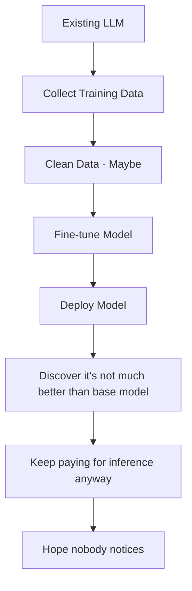
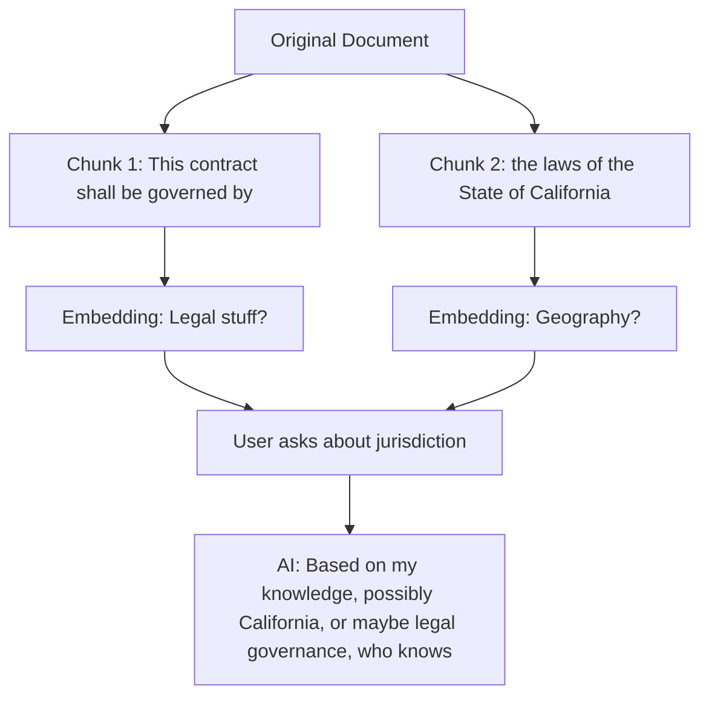
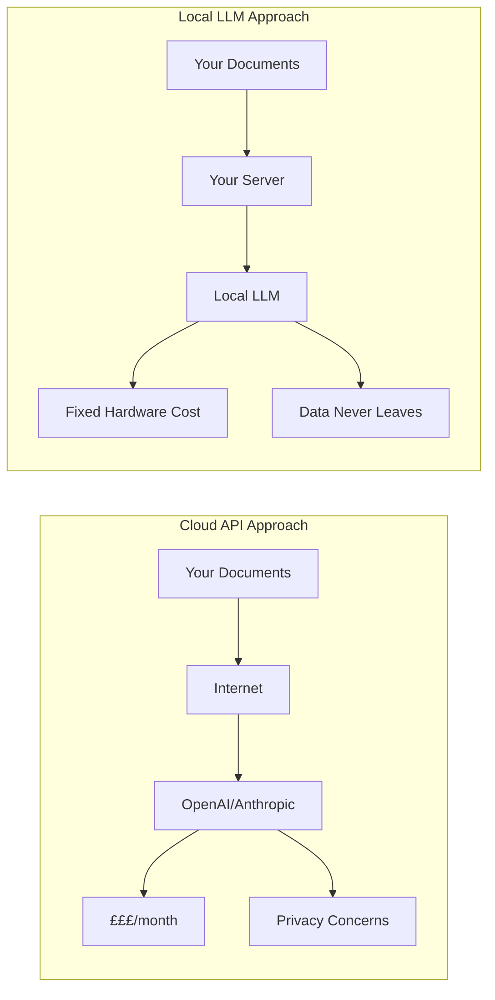
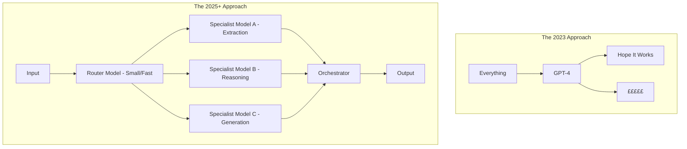

# Why Most Commercial 'AI' Projects Are Dumb

<!--category-- AI, Opinion, Software Development, LLM -->
<datetime class="hidden">2025-11-25T09:00</datetime>

## Introduction

I've been watching the "AI" gold rush with a mixture of amusement and despair. Every company suddenly has an "AI strategy." Every startup is "AI-powered." Every consultant is selling "AI transformation."

And you know what most of them are building? The same bloody thing. Over and over. With varying degrees of competence (mostly on the lower end).

Here's the dirty secret that nobody in management wants to hear: **most commercial AI projects aren't innovative. They're commodity plumbing with a fancy label.**

Let me explain.

[TOC]

## The Two Types of Commercial AI Projects

Strip away the marketing bollocks and you'll find that approximately 95% of commercial "AI" projects fall into one of two categories:

### Type 1: The RAG Pipeline

This is by far the most common. Every "enterprise AI solution" follows this pattern:

That red box? That's where everything breaks. More on that in a moment.

The pitch sounds impressive: "We've built an AI that understands your company's documents and can answer questions intelligently!"

The reality: You've built a search engine with extra steps and a £10,000/month OpenAI bill.

### Type 2: The Fine-Tuned Model

This one's even sillier. The pitch: "We've trained our own AI model specifically for your industry!"

The reality: You've taken someone else's model and fine-tuned it on a dataset that's probably too small, too dirty, and too narrow to make a meaningful difference over just using the base model with good prompts.

Most fine-tuning projects I've seen would have been better served by spending the same money on improving their prompts and retrieval systems.

## Why Document Ingestion Is Where Dreams Go to Die

Let's talk about that red box in the RAG diagram. **Document ingestion is the part that fails most often**, and it's the part that gets the least attention in the flashy demos.

Here's what the sales demo shows:
- Beautiful PDFs flowing into the system
- Clean markdown extracted perfectly
- All your knowledge, searchable by AI!

Here's what actually happens:

### The PDF Problem

PDFs are a nightmare. They were designed for printing, not for extracting structured data. Every PDF parser I've used has different failure modes:

- Columns that get merged incorrectly
- Tables that become gibberish
- Headers and footers that pollute the content
- Scanned documents that need OCR (and OCR has its own error rates)
- Security-protected documents that can't be processed at all
- Font encoding issues that turn text into garbage

And that's just PDFs. Wait until you hit:
- PowerPoint files with text in SmartArt
- Word documents with track changes
- Excel files with merged cells
- Scanned images with handwriting
- Legacy formats from systems that died in the 90s

### The Chunking Catastrophe

Once you've extracted text (poorly), you need to chunk it for your vector database. This is where more magic thinking happens.

"We'll use semantic chunking!" Great, your 200-page contract is now 500 chunks, and the AI has no idea which ones are related or in what order they appear.

"We'll use fixed-size chunks with overlap!" Perfect, you've just split a sentence in half and the embedding now represents nonsense.

### The Metadata Mess

Good RAG needs good metadata. But extracting metadata from documents is hard:

- What's the document date? Is it the creation date, modification date, or the date mentioned in the content?
- Who's the author? The person who created the file, the legal author, or the subject matter expert?
- What category does it belong to? Your taxonomy probably doesn't match how the documents were actually organised.
- Is this document still valid? Or has it been superseded by something newer that your system doesn't know about?

Most organisations have decades of documents with inconsistent naming conventions, folder structures that made sense to someone who left in 2003, and metadata that's either missing or wrong.

## The Fine-Tuning Fantasy

Let me be clear: fine-tuning has its place. But the way most companies approach it is fundamentally broken.

### The Data Problem

Fine-tuning requires quality training data. Most companies don't have it. They have:

- Noisy, inconsistent data scattered across systems
- Data that reflects how things were done, not how they should be done
- Data that's full of errors nobody ever bothered to fix
- Data that's proprietary but not actually that valuable

"We'll fine-tune on our support tickets!" Your support tickets are full of frustrated customers, incorrect information from junior staff, and edge cases that don't represent normal usage.

"We'll fine-tune on our sales calls!" You mean the ones where salespeople make promises the product can't keep?

### The Evaluation Problem

How do you know if your fine-tuned model is actually better? Most companies can't answer this because:

- They don't have a good benchmark dataset
- They don't have clear evaluation metrics
- They haven't done rigorous A/B testing
- They're comparing vibes, not data

I've seen companies spend six months fine-tuning a model and then have no way to prove it's better than just using GPT-4 with a good system prompt.

### The Maintenance Problem

Fine-tuned models need updating. Your business changes. Your products change. Your processes change. That model you fine-tuned in January is now giving answers based on outdated information.

But updating means:
- Collecting new training data
- Running training again
- Validating the new model
- Deploying it
- Hoping you didn't introduce regressions

Most companies fine-tune once and then just live with the drift. The model slowly becomes less relevant while everyone pretends it's still adding value.

## What "AI" Projects Are Actually Good For

Don't get me wrong. There are legitimate use cases where these patterns make sense:

### RAG Actually Works When:

- Your documents are well-structured and consistent
- You have clear metadata and organisation
- Your use case is genuinely search + synthesis (not complex reasoning)
- You've invested heavily in the ingestion pipeline
- You have good feedback loops to improve retrieval quality
- You're honest about the limitations

### Fine-Tuning Actually Works When:

- You have large amounts of high-quality, domain-specific data
- The base model genuinely struggles with your domain (rare with modern models)
- You have resources for ongoing maintenance
- You have clear evaluation metrics
- The task is specific enough that fine-tuning helps
- You've already optimised prompting and RAG and still need more

## The Real Problems Nobody's Solving

While everyone's building the same RAG pipeline, the actually interesting problems in commercial AI are being ignored:

### Data Quality

The biggest constraint on AI effectiveness isn't the model. It's the data. Most organisations have:

- Data spread across dozens of systems that don't talk to each other
- No single source of truth for anything
- Data governance that's more aspiration than reality
- Quality issues that nobody has budget to fix

**But "data quality initiative" doesn't get you a Forbes article like "AI transformation" does.**

### Process Integration

Dropping an AI chatbot into an existing process doesn't magically make it better. The process needs to be redesigned around the AI's capabilities and limitations. Most companies just bolt AI onto broken processes and wonder why it doesn't help.

### Human-AI Collaboration

The best AI implementations augment human capabilities rather than trying to replace them. But that's harder to sell than "AI that does X automatically!"

Humans + AI working together requires:
- Clear handoff points
- Transparent AI reasoning
- Easy override mechanisms
- Feedback loops for improvement

Most commercial AI projects treat the human as an afterthought.

### Genuine Innovation

The truly valuable AI applications aren't "chatbot on your documents." They're applications that:
- Enable things that were previously impossible
- Create new categories of value
- Solve problems in fundamentally new ways

But those are hard. RAG pipelines are easy (well, easier). So that's what everyone builds.

## The Consultancy Industrial Complex

A significant driver of dumb AI projects is the consultancy ecosystem. Here's how it works:

1. **Big consultancy** tells C-suite that they need an AI strategy or they'll be left behind
2. **C-suite panics** and authorises a big AI initiative
3. **Consultancy deploys** an army of juniors to "assess AI readiness"
4. **Recommendations** always include building a RAG system and/or fine-tuning experiments
5. **Consultancy builds** the same thing they've built for the last 20 clients
6. **Demo goes well** because demos always go well
7. **Reality sets in** when it hits real data and real users
8. **Consultancy moves on** to the next client, leaving behind a system nobody knows how to maintain
9. **Internal team struggles** to make it actually work
10. **Project quietly fails** but nobody admits it because careers are on the line

I've seen this pattern dozens of times. The consultancy gets paid. The executives get to say they "did AI." The engineers get stuck maintaining something that barely works. And the actual business problem remains unsolved.

## What Should You Actually Do?

If you're considering an AI project, here's my honest advice:

### 1. Start with the Problem, Not the Technology

Don't ask "how can we use AI?" Ask "what problem are we trying to solve?" If AI is the right solution, great. But often it isn't.

### 2. Fix Your Data First

Before you build a RAG pipeline, fix your document mess. Before you fine-tune, clean your training data. The AI won't fix your data problems; it will amplify them.

### 3. Start Small and Iterate

Don't launch a massive "AI transformation." Build a small proof of concept. Test it with real users. Learn what actually works. Then expand.

### 4. Invest in the Boring Bits

The document ingestion pipeline isn't sexy. The data cleaning isn't exciting. The evaluation framework isn't something you can demo to the board. But these are what determine success or failure.

### 5. Be Honest About Limitations

AI isn't magic. Current LLMs hallucinate. RAG systems miss relevant documents. Fine-tuned models drift. Set realistic expectations.

### 6. Plan for Maintenance

Building the system is maybe 30% of the effort. Maintaining it, improving it, and keeping it relevant is the other 70%. Budget accordingly.

### 7. Consider Whether You Need a Custom Solution at All

Maybe what you need is just better use of off-the-shelf tools. ChatGPT with some custom instructions might be enough. Not everything needs a bespoke AI platform.

## The Path Forward

I'm not saying commercial AI is worthless. I'm saying most implementations are dumb because they're:

- Solving the wrong problems
- Using technology for technology's sake
- Ignoring the hard parts (data quality, document ingestion)
- Following a template instead of thinking critically
- Driven by FOMO rather than genuine need

The companies getting real value from AI are:
- Relentlessly focused on specific, measurable problems
- Investing in data quality before AI capabilities
- Building feedback loops and continuous improvement
- Being honest about what works and what doesn't
- Treating AI as a tool, not a magic wand

If your AI project is "build a RAG system on our documents" or "fine-tune a model for our domain" without deeper thinking about why and how, you're probably building something dumb.

And that's fine, I suppose. Just don't be surprised when it doesn't deliver the transformation you were promised.

## But They Don't Have to Be Dumb

Right, I've spent 2000 words slagging off commercial AI projects. Now for the hopeful bit: **these projects can actually work, if you approach them sensibly.**

The problem isn't RAG or fine-tuning as concepts. The problem is lazy implementation, unrealistic expectations, and ignoring the fundamentals. Here's how to do it better.

### Hook AI Into Existing Workflows, Don't Replace Them

The biggest mistake I see is treating AI as a replacement for existing processes rather than an enhancement. Your business already has workflows that work (mostly). Instead of ripping them out and replacing them with an "AI-powered" version, hook AI into the gaps.

Notice what's different:
- **Humans are still in the loop** for decisions that matter
- **AI handles the tedious bits** - extraction, summarisation, categorisation
- **Each AI step is small and verifiable** - if the AI gets extraction wrong, the human catches it during review
- **Feedback loops exist** - logged results train future AI improvements

This is vastly more robust than "AI handles everything and sometimes a human checks."

### Use Local LLMs for Cost and Confidentiality

Here's a dirty secret: you probably don't need GPT-4 or Claude for most tasks. And you definitely don't need to send your confidential documents to OpenAI's servers.

**The Cost Problem**

At scale, API costs add up fast. A busy RAG system might make thousands of LLM calls per day. At $0.01-0.03 per 1K tokens, that's real money. And as you scale, it gets worse.

**The Confidentiality Problem**

Many organisations can't (or shouldn't) send their documents to external APIs:
- Legal documents with client information
- Medical records
- Financial data
- Proprietary research
- Anything covered by GDPR, HIPAA, etc.

**The Solution: Local Models**

Modern open-source models are bloody good. Running locally means:
- **Zero marginal cost per query** - you've paid for the hardware, inference is "free"
- **Complete data privacy** - nothing leaves your infrastructure
- **No rate limits** - scale as much as your hardware allows
- **Customisation options** - fine-tune without data leaving your control

#### Practical Local Model Options

For **embedding** (the RAG vector search bit):
- **sentence-transformers** - Fast, accurate, runs on modest hardware
- **nomic-embed** - Great quality, small footprint
- **BGE models** - Competitive with commercial options

For **generation** (the actual "AI" responses):
- **Llama 3.1 8B/70B** - Excellent general purpose, great instruction following
- **Mistral/Mixtral** - Fast, efficient, good reasoning
- **Phi-3** - Surprisingly capable for its size
- **Qwen 2.5** - Strong multilingual support

For **coding tasks**:
- **CodeLlama** - Specifically trained for code
- **DeepSeek Coder** - Excellent code understanding
- **StarCoder** - Good for many languages

Running these locally isn't as hard as you'd think. Tools like **Ollama**, **llama.cpp**, **vLLM**, or **text-generation-inference** make it straightforward.

#### The Hybrid Approach

You don't have to go all-or-nothing. A sensible architecture uses:

1. **Local models for high-volume, lower-complexity tasks**
   - Document classification
   - Entity extraction
   - Simple Q&A
   - Summarisation

2. **Cloud APIs for complex reasoning when needed**
   - Complex multi-step analysis
   - Tasks requiring the largest context windows
   - Fallback when local model confidence is low

This hybrid approach gives you the cost benefits of local inference with the capability of cloud models when you genuinely need it.

### Build Incremental Value, Not Big Bang Transformations

The projects that actually work follow this pattern:

**Week 1-2**: Solve one small, specific problem with AI. Maybe it's auto-categorising incoming documents. Measure the results.

**Week 3-4**: Refine based on feedback. Fix the edge cases. Improve accuracy.

**Week 5-6**: Add another small capability. Maybe now it extracts key dates and entities.

**Week 7-8**: Refine. Measure. Improve.

Each step delivers measurable value. Each step teaches you something about what works and what doesn't. If something fails, you've lost weeks, not months.

Compare this to the typical failed approach:
- Month 1-3: Massive requirements gathering
- Month 4-6: Building the "platform"
- Month 7-9: Integration and testing
- Month 10: Demo to stakeholders (looks great!)
- Month 11: Real users discover it doesn't work with real data
- Month 12: Project quietly shelved

### Make Document Ingestion a First-Class Concern

Remember that red box in the diagram? Here's how to actually fix it:

**Invest in quality over quantity.** It's better to have 1,000 perfectly processed documents than 100,000 poorly processed ones. Start with your most important documents and get them right.

**Use AI to help with ingestion.** Modern vision-language models (GPT-4V, Claude, LLaVA locally) can actually read complex documents - tables, charts, handwritten notes - in ways that traditional OCR cannot. Use them for the hard documents.

**Build feedback loops.** When retrieval fails, log it. When users say "that's not what the document says," capture it. Use this feedback to improve your ingestion pipeline.

**Accept that some documents won't work.** Not every ancient scanned PDF is worth fighting with. Sometimes the answer is "we'll handle that type manually" rather than spending months on edge cases.

### Think About the Full System, Not Just the AI Bit

A working AI solution needs:

| Component | What Most Projects Do | What Actually Works |
|-----------|----------------------|---------------------|
| Data ingestion | Afterthought | Primary focus |
| Data quality | "AI will figure it out" | Dedicated cleaning pipeline |
| Retrieval | Basic vector search | Hybrid search + reranking |
| Generation | Raw LLM output | Structured output with validation |
| Human review | Optional | Integrated into workflow |
| Feedback | None | Continuous improvement loop |
| Monitoring | "It's working" | Detailed metrics & alerting |
| Maintenance | "Version 1 forever" | Regular updates & retraining |

The AI model is maybe 20% of a working system. The other 80% is the boring stuff that actually makes it work in production.

### Build in Observability From Day One

You can't improve what you can't measure. Every AI system should track:

- **Retrieval quality**: Are you finding relevant documents? Track retrieval precision and recall.
- **Generation quality**: Are responses accurate? Track hallucination rates (yes, this is hard).
- **User satisfaction**: Do people actually find it useful? Track usage, completion rates, thumbs up/down.
- **Cost per query**: What are you actually spending? Track token usage, latency, infrastructure costs.
- **Failure modes**: When does it break? Track error rates by document type, query type, etc.

This data tells you where to invest effort. Maybe your retrieval is great but generation is hallucinating. Maybe certain document types always fail. You can't fix what you can't see.

### The Realistic Path to Value

Here's what an actually-sensible AI project looks like:

**Phase 1: Foundation (1-2 months)**
- Set up local LLM infrastructure (Ollama + a capable open model)
- Build a basic document ingestion pipeline for ONE document type
- Create a simple retrieval system with hybrid search
- Deploy internally, gather feedback

**Phase 2: Iteration (2-3 months)**
- Expand to more document types based on Phase 1 learnings
- Improve ingestion quality based on real failures
- Add human-in-the-loop review for high-stakes queries
- Track metrics religiously

**Phase 3: Scale (ongoing)**
- Gradually expand capabilities based on proven patterns
- Consider cloud APIs for specific complex tasks
- Build self-improving feedback loops
- Continuously measure ROI

Notice what's missing? A six-month "platform build" phase. A massive up-front investment. A big bang launch.

The successful AI projects I've seen all followed this incremental pattern. They started small, proved value, and expanded based on evidence.

### The End of "Big LLM Solves Everything"

Here's the most important shift happening right now: **the era of "throw everything at GPT-4 and hope for the best" is ending.**

The 2023-2024 approach was simple: get the biggest model you can afford, stuff your context window full of everything, and pray. It worked... sort of. For demos. For prototypes. For getting investment.

But it doesn't scale. It's expensive. It's slow. And increasingly, it's being outperformed by smarter architectures.

#### The Shift to Orchestrated Small Models

The future isn't one giant model doing everything. It's **multiple specialised models working together**, each doing what it's good at.

This is what I've been exploring in my [DiSE (Directed Synthetic Evolution)](/blog/disejustvoyager) work—the idea that **structure beats brilliance**. A carefully orchestrated pipeline of smaller, focused models outperforms a single massive model trying to do everything.

The same thinking applies to the [Synthetic Decision Engine](/blog/semantidintelligence) concept: using multiple LLM backends in sequence, where each model brings different strengths. Fast models for triage, accurate models for validation, creative models for generation. Each doing what it does best.

#### Why This Matters for RAG

If you haven't already, check out my [RAG series](/blog/rag-primer) which goes deep on the fundamentals. But here's the key insight: **RAG itself is a form of this orchestrated approach**. You're using embeddings (one model) to find relevant content, then using an LLM (another model) to synthesise an answer.

The next evolution is taking this further:
- **Embedding model** → finds candidate documents
- **Reranking model** → orders by actual relevance
- **Classification model** → determines query intent
- **Small generation model** → handles simple factual queries
- **Large reasoning model** → handles complex analysis (only when needed)

Each model is smaller, faster, and cheaper than using GPT-4 for everything. But together, they outperform the monolithic approach.

#### The Agentic Future

The real game-changer is what we're seeing with **agentic AI**—models that can use tools, execute code, and orchestrate their own workflows. This is what Anthropic's latest models (including the Opus 4.5 I'm literally using to write this) demonstrate so effectively.

Here's the thing that makes the fine-tuning crowd uncomfortable: **if you describe tools well enough, you don't need expensive fine-tuning to use them.** Modern foundation models are remarkably good at tool use out of the box—you just need clear function schemas and good documentation in the context.

This is a massive shift from the Toolformer approach (fine-tune a model to learn when to use tools by measuring outcomes). That's expensive, requires specialised training data, and locks you into a specific set of tools. The alternative? Describe your tools clearly, give the model good context, and let it figure out when to use them.

The results are often better because:
- **Tool descriptions can be updated instantly** - no retraining needed
- **New tools can be added at runtime** - just add another schema
- **The model benefits from its general reasoning** - not just memorised patterns
- **You can use any capable model** - not a specifically fine-tuned one

The pattern isn't "ask LLM question, get answer." It's:
1. LLM understands the task
2. LLM breaks it into steps
3. LLM selects and uses appropriate tools (from well-described schemas)
4. LLM evaluates results
5. LLM iterates until done

This is fundamentally different from the RAG chatbot pattern. And it's where the real value lies.

**Frameworks like LangChain, LlamaIndex, and Semantic Kernel make this possible today.** You can build systems where:
- A small fast model handles routing and classification
- Specialised models handle domain-specific tasks
- Tool use extends capabilities beyond pure language
- Feedback loops enable continuous improvement

The companies that figure this out will build AI systems that actually work. The ones still trying to fine-tune their way to success or building yet another RAG chatbot will continue to be disappointed.

#### Where to Learn More

I've written extensively about these patterns:
- [DiSE vs Voyager](/blog/disejustvoyager) - Why structured orchestration beats monolithic models
- [Multi-LLM Synthetic Decision Engines](/blog/semantidintelligence) - Building pipelines of specialised models
- [RAG Series](/blog/rag-primer) - The fundamentals of retrieval-augmented generation
- [Semantic Search Implementation](/blog/semantic-search-with-onnx-and-qdrant) - Practical local embeddings with ONNX

The technology exists. The patterns are emerging. The question is whether your organisation will build something sensible or another dumb AI project.

## Conclusion

The current commercial AI landscape reminds me of the early web era. Everyone needed a "web strategy." Companies built websites because they had to, not because they knew what to do with them. Most of those websites were useless.

Eventually, the companies that succeeded were the ones who figured out what the web was actually good for and built for that. The same will happen with AI.

Right now, we're in the "build it because we have to" phase. Most projects are dumb. Most will fail or underdeliver. That's normal for new technology.

But if you want to be one of the ones that succeeds, stop following the template. Start with real problems. Invest in the boring bits. And for the love of god, fix your document ingestion pipeline before you blame the LLM.

The AI isn't the problem. Your data is. Your processes are. Your unrealistic expectations are.

Fix those first, and maybe, just maybe, your AI project won't be dumb.
