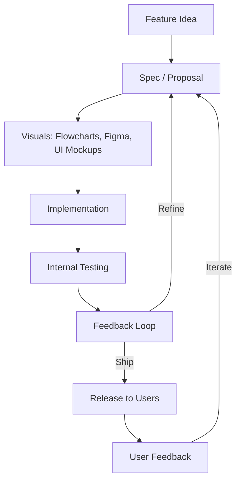

# Agile Speccing: Writing Feature Specs That Actually Work

<!--category-- Software Development, Documentation, Agile -->
<datetime class="hidden">2025-11-11T11:30</datetime>

# Introduction
Over the years I've read / written hundreds of feature specifications. Some were brilliant; most were bloody awful. The difference between a good spec and a bad one isn't about length or formality; it's about whether it actually helps developers build the right thing without driving them mad in the process.

Here's something I learned at Microsoft that changed how I think about specs: **A spec is not a bible; it's a tool.** Like any tool, you use it to get a job done. You add as much detail as you, the stakeholders, and the developers need to get going. Then you adapt it, change it, and update it as the feature develops.

Treat a spec as a sacred, unchangeable document and you're building the wrong thing perfectly ('running very very fast in the wrong direction'). Treat it as a living tool and you're building something that actually solves problems.

This agile approach to specs creates a particular challenge: if the feature can evolve as you learn, how the hell do you estimate it? How do you know when you're done? That's what this article is about.

**Fundamentally; a Feature Spec is a conversation NOT a dogmatic, unchanging LAW.

[TOC]

## Why Agile (and What That Actually Means)

Agile isn’t stand-ups and sticky notes. It’s an **economic strategy for building the right thing under uncertainty**. Specs live inside that uncertainty, so they have to be agile too. Read the [Agile Manifesto](https://agilemanifesto.org/), let it become how you think about building ANYTHING. Think of it as a design pattern for product development. It's not a process; it's a mindset.

### First principles

* **Change is the default, not the exception.** Markets move, users surprise you, dependencies slip. A spec that can’t flex becomes fiction.
* **Learning beats predicting.** You discover the real requirements only after humans touch the thing. Agile makes learning *cheap and fast*.
* **Flow over heroics.** Small, continuous moves beat large, infrequent “big bang” drops.

### The economics (why this saves you money)

* **Minimise the cost of being wrong.** Short cycles + lightweight specs mean bad ideas die quickly instead of after a six-week build.
* **Delay irreversible decisions.** Keep options open until the last responsible moment; commit when information is highest and risk is lowest.
* **Reduce inventory.** Half-written epics and massive “future” sections are work-in-progress debt. Ship thin slices, bank the value.

### Feedback loops are the product

Every loop shortens the distance between “idea” and “useful”:

* **Spec ⇄ Dev:** catch impossibilities before code cements them.
* **Dev ⇄ QA:** turn acceptance criteria into executable checks.
* **Internal dogfood ⇄ Users:** prove it solves a real problem, not an imagined one.

> Update the spec after each loop. The change log is the *story of what you learned*.

# What Makes a Good Feature Spec

## The Problem-Solution Pattern
The single most important principle for writing specs: **Always start with the problem, not the solution.**

This pattern is simple:
1. **Problem** - What's actually broken? What pain are users experiencing? What opportunity would the feature create?
2. **Solution** - Here's how we propose to fix it / exploit that opportunity
3. **In Scope** - What we're doing in this spec
4. **Out of Scope** - What we're explicitly NOT doing (equally important; feeds into future planning and stops the 'why aren't we doing x' questions)

I've seen countless specs that jump straight into "User clicks button X which calls API Y" without ever explaining what the user is actually trying to achieve. This is arse-backwards. The implementation details should flow naturally from understanding the problem.

Remember developers are feature building machines REALLY (code is the tool to deliver features); tell them what *needs doing* NOT how to do it. if you have a UX person whp's responsible for the UX spec then the dev and them should work together. The point is making the best feature *for the user* that can change and anyone is empowered to push for the change (in the spec) and have that review process tes the idea.



## Clarity of Purpose
Before you write a single word about implementation, you need to answer one question: **WHY?**

Why are we building this? What problem does it solve? Who benefits? If you can't answer these questions clearly, you haven't got a feature; you've got a wish list.

A good spec starts with:
1. **The Problem Statement** - What's broken or missing? Be specific.
2. **The User Impact** - Who cares and why? Quantify if possible.
3. **Success Criteria** - How do we know we've solved it? Make it measurable.
4. **Non-Goals** - What are we explicitly NOT doing? This prevents scope creep and endless debates.

## The Right Level of Detail
This is where most specs go tits-up. Too vague and developers are left guessing; too detailed and you're micromanaging implementation choices that developers are better qualified to make.

The trick is to specify **WHAT** needs to happen without prescribing **HOW** it happens. For example:

**Good**: "When a user attempts to submit a form with invalid data, they should receive immediate feedback indicating which fields need correction."

**Bad**: "On form submission, the submit button's onClick handler should call validateForm() which iterates through formFields array checking each field.value against its validation.regex property and if any fail should call showError() with the field.name and validation.message parameters."

The first tells me what the user experience should be; I can implement it in React, Vue, vanilla JavaScript, or carrier pigeon for all it matters. The second assumes implementation details that might be completely wrong for the tech stack or introduce unnecessary constraints. Different people have different strengths often the person writing the spec isn't technical / isn't the one writign the code. Imagine being a cab driver and not being told the destination but every gear change, mirror look etc..etc..makes you all stabby. 


## Use Pictures / flowcharts; Get The Point Across
Remember you're trying to get people to unserstand what you're suggesting. Some teams include Figma documents (a storyboard / ux 'spec') or images of the UI the designer built. Like everythign else though these are 'until we try it' suggedtions until they've been through a feedback loop. It's all about *ensuring you're being understood*. Use whatever tools you need.

[In a Wiki mermaid.js diagrams are GREAT for this! ](https://www.mostlylucid.net/blog/category/Mermaid); remember AI is GREAT at generating these too given a textual description.

Some people can parse written descriptions, some need pictures and movies!


## Edge Cases and Error Handling
If there's one thing I've learned it's this: **Users will find ways to break your shit that you never imagined.**

A good spec doesn't just describe the happy path; it considers:
- What happens when the network fails mid-operation?
- What if the user has no permissions?
- What about concurrent modifications?
- How do we handle partial failures in distributed operations?

You don't need to solve all these in the spec, but you need to acknowledge they exist. Nothing irritates developers more than discovering halfway through implementation that nobody thought about what happens when the external API is down.

For MANY it's likely they're outn of scope for THIS spec. You may have 'technical specs' which DO detail the implemntation details and technical spolutions to 'technical issues' 

## Security and Performance Considerations
These shouldn't be afterthoughts shoehorned in during code review. If there are specific security requirements (authentication levels, data encryption, audit logging) spell them out in the spec.

Similarly, if there are performance constraints that matter ("This search needs to complete in under 200ms for datasets of up to 1 million records"), put them in the spec. Don't leave developers to guess at non-functional requirements.

# The Structure of a Good Spec

Here's the template I use for feature specs. It's not gospel, but it's served me well:

## 1. Overview
A paragraph or two summarising what we're building and why it matters. Your CEO should be able to read just this section and understand the value.

## 2. Background/Context
What's the current state of affairs? What prompted this feature? What have users been asking for? What would help us make more money? This helps developers understand the problem space without having been in every product meeting.

Got it—let’s expand your section on **User Stories** with personas woven in, so it’s not just a checklist but a living map of how different kinds of users interact with the system.

---

## 3. User Stories (with Personas)

User stories aren’t just a box-ticking exercise—they’re a way to **embody real people** and their goals. You know, your users **the whole point of building this shit**.
By anchoring each story to a persona, you force yourself to think about actual usage patterns, motivations, and constraints. The format is simple but powerful:

In the end personas are a greeat way of identifying HOW your software can serve different TYPES of users. Maybe  Alex needs a dashboard to view security issues in your feature, maybe Morgan needs his permissions restricted to stop him breaking shit etc.

**As a [persona / type of user] I want [to do something] So that [I achieve some goal].**

The **“so that”** clause is the safeguard against building features nobody needs—it ties every function back to a real-world outcome.

---

### Example Personas
- **Alex the Administrator** – cares about control, oversight, and efficiency.
- **Jamie the Casual User** – values simplicity and quick wins.
- **Priya the Power User** – pushes the system to its limits, wants advanced customization.
- **Morgan the Newcomer** – needs guidance, onboarding, and reassurance.
- **Taylor the Stakeholder** – doesn’t use the system daily but needs visibility into outcomes.

---

### Sample User Stories

| Persona | Story | Why it matters |
|---------|-------|----------------|
| Alex (Administrator) | As an **Administrator**, I want to assign roles and permissions **so that** I can ensure data security and compliance. | Prevents unauthorized access and keeps the system trustworthy. |
| Jamie (Casual User) | As a **Casual User**, I want a simple dashboard **so that** I can quickly see the most important information without being overwhelmed. | Reduces friction and increases adoption. |
| Priya (Power User) | As a **Power User**, I want to create custom workflows **so that** I can automate repetitive tasks and save time. | Unlocks efficiency and advanced use cases. |
| Morgan (Newcomer) | As a **Newcomer**, I want guided tutorials and tooltips **so that** I can learn the system without feeling lost. | Improves onboarding and retention. |
| Taylor (Stakeholder) | As a **Stakeholder**, I want regular reports emailed to me **so that** I can track progress without logging in. | Keeps decision-makers informed and engaged. |

---

### Why Personas + Stories Work Together
-  **Personas humanize the abstract.** Instead of “users,” you’re thinking about Alex, Jamie, Priya, Morgan, and Taylor.
-  **Stories tie features to goals.** The “so that” clause forces clarity: every feature must serve a purpose.
-  **Patterns emerge.** When you line up multiple stories, you see overlaps, conflicts, and priorities across personas.


## 4. Detailed Requirements
This is your meat and potatoes. Break it down by functional area. Use subheadings liberally. Include mockups or wireframes if you have them; a picture is worth a thousand words of description.

For each requirement, specify:
- The expected behaviour
- Any constraints or validation rules
- Error handling requirements
- How it interacts with existing features

## 5. Non-Functional Requirements
Performance targets, security requirements, accessibility standards, browser/device support. Don't assume these are obvious. But in some teams these may be WHOLE OTHER TEAMS...but don't lose focus. If one part of your cycle becomes a waterfall then you've lost agility by definition.

## 6. Out of Scope
This section is just as important as what's IN scope. Be explicit about what you're NOT doing in THIS spec.

Why this matters:
- **Prevents Scope Creep** - "But couldn't we just..." conversations die quickly when you can point to the Out of Scope section
- **Sets Expectations** - Stakeholders know what **won't** be delivered (this time)
- **Enables Future Work** - Items here might become their own specs later
- **Focuses the Team** - Everyone knows the boundaries of this work

Examples of good Out of Scope items:
- "Mobile support (will be addressed in separate spec)"
- "Migration of existing data (current spec only handles new data)"
- "Admin UI for configuration (will use config files initially)"
- "Integration with System X (dependency not yet available)"

If someone argues an out-of-scope item should be in scope, that's a conversation worth having BEFORE development starts, not halfway through implementation.

## 7. Open Questions
Be honest about what you don't know. Mark these clearly and make sure they get answered before development starts. Nothing worse than blocking development because nobody decided whether we're doing soft deletes or hard deletes.

## 8. Dependencies
What other systems/teams/features does this rely on? What needs to be ready before development can start?

## 9. Acceptance Criteria
How will QA test this? These should be concrete, testable statements. Bonus points if they're written in a format that could become automated tests (Given/When/Then style).

# The Problem of Spec Bugs

Here's something that doesn't get talked about enough: **Specs can have bugs too.**

A spec bug is when the specification itself is wrong. Maybe it contradicts itself, or it specifies behaviour that's technically impossible, or it solves the wrong problem entirely. These are insidious because developers might implement exactly what's written and still end up with a product that doesn't work properly (in Agile the main focus is making this 'feedback lopp' as short as possible for exactly thids reason).

## How Spec Bugs Happen

1. **Incomplete Understanding** - The person writing the spec didn't fully understand the problem or the existing system.
2. **Conflicting Requirements** - Different stakeholders want different things and nobody resolved the conflict.
3. **Technical Impossibility** - The spec asks for something that can't actually be done (or can't be done within reasonable constraints).
4. **Changing Requirements** - The world moved on but the spec didn't get updated.

## Handling Spec Bugs

When you find a spec bug as a developer, you have a few options:

### Option 1: Raise It Immediately
This is almost always the right answer. As soon as you spot something that doesn't make sense, raise it. Don't wait until you're halfway through implementation.

Send a clear message to whoever owns the spec:
- What the spec says
- Why it's problematic
- What you think should happen instead (if you have a suggestion)

Do this in writing (email, ticket, whatever) so there's a record.

### Option 2: Implement It Anyway
Sometimes you might be tempted to just build what's specified even though you know it's wrong. **DON'T DO THIS.**

I've seen developers implement specs they knew were wrong because "that's what it said to do" and then act surprised when QA rejects it or users complain. You're a professional; part of your job is to speak up when you see problems.

The exception is if you've raised the issue, been told to proceed anyway, and got that in writing. Then fine; you've done your due diligence.

### Option 3: Fix It Yourself
If you're confident you know what the spec should say, you might be tempted to just correct it yourself. This is fine for obvious typos or formatting issues, but for substantive changes you need to get agreement from stakeholders.

Never silently change requirements. That's how you end up building features nobody asked for.

## Preventing Spec Bugs

The best approach is to prevent spec bugs in the first place:

1. **Involve Developers Early** - Get technical review of specs before they're finalised. We'll spot impossibilities and edge cases that product people might miss.
2. **Involve QA Early** - If it can't be tested it can't be built, your job is making something that makes it to users, QA is CRITICAL here.
3. **Use Examples Liberally** - Abstract descriptions are easy to misinterpret. Concrete examples ("User John has permission X, tries to do Y, and sees Z") are much clearer.
4. **Validate Against Existing System** - Does the spec make assumptions about how things currently work? Double-check those assumptions.
5. **Iterate on Specs** - Treat the spec as a living document. As you learn more during implementation, update it. Future developers will thank you.

# Common Spec Pitfalls

## The Novel-Length Spec
Some people think more detail is always better. It's not. A 50-page spec that nobody reads is worse than a 5-page spec that everyone understands.

If your spec is turning into War and Peace, you either:
- Need to break it into multiple features
- Are specifying implementation details that should be left to developers
- Are solving the wrong problem and need to step back

## The Vague Handwave
The opposite problem: "Build a reporting system." Right, cheers for that. I'll just knock up something and we'll see if it matches what you had in your head, shall we?

If your spec can be fully captured in a single sentence, it's not a spec; it's a vague wish.

## The Solution-First Spec
"We need a dashboard" isn't a requirement; it's a preconceived solution. Maybe you do need a dashboard, but maybe you need something completely different. Start with the problem. "Bob the system admin can't see when there's issues in the system quickly and easily"

## The Moving Target
Requirements that change daily aren't requirements; they're chaos. If things are changing that fast, you don't understand the problem well enough yet. Stop and do more discovery before writing specs.

## The Kitchen Sink
"While we're in there, could we also..." No. No we couldn't. Every feature has a cost. If you want to add something new, write a separate spec for it and prioritise it properly.

# Treating Specs Like Source Code

This is the mindset shift that changed how I write specs: **Treat your spec exactly like you treat source code.**

## Version Control
Your specs should live in version control alongside your code. Check them in. Track changes. Write meaningful commit messages when you update them. This creates a history of how requirements evolved.

At Microsoft, we kept specs in the same repositories as code. When a spec changed, it went through the same review process as code. This wasn't bureaucracy; it was ensuring everyone understood what was changing and why. Even revision tracking in Word is better than nothing (you can have a 'revisions' section but don't let this get out of control; TOO MANY revisions after dev starts means the spec wasn't cooked when you started building). 

## Refactoring Specs
Just as code needs refactoring, so do specs. As you learn more during implementation, the spec should evolve to reflect that learning.

Found a better way to solve the problem? Update the spec to reflect the new approach and explain why you changed direction. Discovered an edge case you hadn't considered? Add it to the spec.

The spec after development should be more refined than the spec before development. If it's not, you've missed an opportunity to document what you learned.

## The Living Document Principle
A spec isn't "done" when development starts, it's just 'ready' for that stage . It's done when the feature ships and becomes maintenance mode. Until then, it's a living document that evolves with your understanding of the problem.

This doesn't mean the spec should change daily. Major changes to requirements need discussion and agreement. But clarifications, additional examples, newly discovered edge cases should all be folded back into the spec as you find them.

Think of it this way: if you wouldn't leave outdated comments in code, don't leave outdated information in specs.

## Why Specs Need to Stay Current

Here's something that doesn't get discussed enough: **your spec becomes the foundation for everything that comes after.**

**Test Plans**: QA writes test cases based on the spec. If the spec is outdated, tests are testing the wrong thing. You get false positives (tests pass but feature is broken) or false negatives (tests fail but feature works fine).

**Documentation**: User documentation, API docs, help systems, your fancy RAG AI support agent - they all start from the spec. If the spec describes features that don't exist or misses features that do, your docs are wrong from day one.

**Future Development**: When someone needs to extend the feature six months later, they'll read the spec to understand how it works. If it doesn't match reality, they're starting with incorrect assumptions.

**Onboarding**: New team members learn the system partly by reading specs. Outdated specs teach them the wrong mental model of how features work.

This is why the spec must stay current. It's not just about the initial implementation; it's foundational to everything else.

At Microsoft, we treated spec updates with the same importance as code updates. Spec changes went through review. They were versioned alongside code. When a feature changed, updating the spec wasn't optional; it was part of the definition of "done."

If you change the code but don't update the spec, you've created TECHNICAL DEBY. Future work will be slower because nobody knows what the current state actually is.


# The Relationship Between Spec and Implementation

Here's something junior developers often don't grasp: **The spec is not the source of truth; the code is.**

The spec tells you what you're trying to build. The code is what you actually built. These two things should align, but when they don't, the code wins. You can't run a spec; you can run code (BDD not withstanding...future topic!).

This means:

1. **Specs Should Evolve** - As you discover things during implementation, update the spec. It's documentation of what you're building, not a sacred text.
2. **Implementation Details Don't Belong in Specs** - Once you've started implementing, the code itself documents the how (in some places a 'Technical Spec' but these are rare and often a product of nasty 'Agile Frameworks'  - a pet hate. Proscribing an inherently adaptive practice like Agile makes me barf a little). The spec should document the why.
3. **Tests Bridge the Gap** - Good tests verify that the implementation matches the requirements. They're the executable form of the spec.

# Writing Specs for Different Audiences

Different people need different things from specs:

**Executives** - Want to know the business value and rough timeline. Give them the overview and success criteria.

**Product Managers** - Need to understand how it fits into the broader product strategy and roadmap. Give them the user stories and dependencies.

**Developers** - Need enough detail to implement correctly without being told how to do their job. Give them the requirements, edge cases, and non-functional requirements.

**QA** - Need to know how to verify it works. Give them the acceptance criteria.

**Designers** - Need to know what the user experience should be. Give them the user stories and interaction flows. Even better have them develop a UX spec / storyboards in parallel while working with the dev & spec writer; be that PM, BA etc. Who writes the spec is less important than it making the end feature BETTER.

A good spec serves all these audiences without being bloated. Use sections and structure so people can read what matters to them.

# Testing Your Spec

Before you call a spec done, ask yourself:

1. **Could a developer who's never seen this feature build it from this spec?** If not, you're missing details. NEVER have pieces like 'this works like feature x in the currrent system'. First that's lazy AF, second, that feature could change or be hard to understand edge cases.
2. **Could QA write test cases from this spec?** If not, your acceptance criteria aren't clear enough.
3. **Could you build something completely useless that still matches this spec?** If so, you haven't captured the actual requirements properly.
4. **Does this spec describe HOW to implement or WHAT to achieve?** If it's the former, you're micromanaging.

# The Agile Approach to Specs

"But we're agile! We don't need specs!" I hear this a lot. It's nonsense.

Agile doesn't mean "no planning" or "no documentation." It means responding to change over following a plan. The key insight: **specs are tools, not contracts.** You create them with just enough detail to get started, then evolve them as you learn. My 'Agile journey' was even more extreme; as you get super good at specs even those become more Agile, you wil ladapt and improve based on what your team wants / needs. 

## How Agile Specs Differ from Waterfall

The fundamental difference isn't format or length; it's mindset and process.

**Waterfall Specs**:
- Written entirely up front before any development
- Aim for completeness from day one
- Changes require formal change control processes
- Spec is "locked" once approved
- Assumption: we can know everything before we start
- Linear: Spec → Build → Test → Deploy

**Agile Specs**:
- Start with minimum viable detail to begin
- Expect incompleteness at the start (and that's fine)
- Changes are expected and welcome
- Spec evolves continuously with the feature
- Assumption: we'll learn as we build
- Cyclical: Draft → Build → Learn → Update Spec → Build More → Learn More

The waterfall approach assumes you can specify everything perfectly before writing a line of code. That's a lovely fantasy. In reality, you discover half the requirements once users actually try the feature. Plan for that, embrace it. Users are the ULTIMATE testers. They can break shit you didn't even know you'd made at a pace that seems to violate causality. Expect it, plan it, log it and fix it (and add it to a future spec / this one if you're still in the spec's 'lifespan'). 


## Feedback Loops Are Everything

In agile speccing, feedback loops are your best friend. You're constantly gathering input and updating the spec:

**Developer Feedback**: "The initial approach won't work because of X. I'm proposing Y instead." → Update spec to reflect new approach and why it changed. In the end you're ALWAYS the first 'user' of a feature. If it looks shit...sepc bug and get it sorted (even if you stop whatever sprint / spike etc to do it...don't wait!)

**User Feedback**: Try the feature with real users (even internally). "This doesn't actually solve my problem because..." → **Pivot** the spec based on what you learn.


**Implementation Feedback**: As you build, you discover edge cases, technical constraints, or better approaches. → Fold these learnings back into the spec.

**QA Feedback**: "The spec says X but didn't consider Y scenario." → Add the scenario to the spec.

Each of these feedback loops makes the spec better. The spec after a sprint of development should be more accurate than the spec before, because you've learned things you couldn't have known at the start.

This is why waterfall specs often fail: they skip the feedback loops. By the time you discover the spec was wrong, you've built the wrong thing and "changing the spec" means massive rework.

**Big thing, feedback AS EARLY AS FEASIBLE. It's why I built [LLMApi](https://www.mostlylucid.net/blog/llmapi)  it helps you build a BIT then use fake data to get useful feedback.** 

## Embrace Incompleteness (At First)

Here's something that makes traditional project managers nervous: **it's completely fine if the initial spec has gaps.**

Mark sections as "TBD" if you don't know yet. List open questions prominently. Be explicit about what you haven't figured out yet.

This isn't sloppiness; it's honesty. You don't know everything up front. Pretending you do just means you'll write confident specifications for the wrong solution.

Start with:
- Clear problem statement (you must know this)
- Proposed solution approach (might change)
- Rough "done" criteria (will be refined)
- Known unknowns marked as open questions

Then fill in the gaps as you learn. It's far better to have an incomplete-but-honest spec than a complete-but-wrong one.

## The Spec WILL Change

Accept this now: **your spec will change during development.** If it doesn't, you either got incredibly lucky or you're not learning anything.

Changes you should expect:
- Technical approach shifts when you discover constraints
- Scope adjustments when you realise you're building too much (or too little)
- "Done" criteria refinement as you understand the problem better
- New edge cases discovered during implementation
- Better solutions found through experimentation

Each change should be:
1. **Documented** - Update the spec, don't just change the code
2. **Communicated** - Tell stakeholders what changed and why
3. **Reasoned** - Explain what you learned that prompted the change

The spec's version history becomes a record of what you learned. That's valuable documentation for future features.

## When Agile Speccing Goes Wrong

The agile approach can fail if you forget one critical thing: **"will change" doesn't mean "no boundaries."**

Bad agile speccing:
- Spec changes daily with no clear reason
- No definition of "done" so feature keeps growing
- Changes aren't communicated (spec updates are expected to jump straight to your colleagues brains), people work off different understandings
- "Agile" used as excuse for not thinking things through
- Stakeholders surprised by scope changes because nobody told them

Good agile speccing:
- Changes happen for clear reasons based on learning
- "Done" criteria are clear even if other details aren't
- Changes are discussed, agreed, and documented
- Being agile doesn't mean being sloppy
- Stakeholders are part of the feedback loop

The spec is a living document, but it's not chaos. It evolves based on learning, not on whims.

AGILE IS NEVER DOING WHATEVER THE FUCK YOU WANT AND CALLING IT AGILE.

It's a dynamic process that has the SOLE GOAL of building the best stuff as quickly as possible.  As the [Agile Manifesto ](https://agilemanifesto.org/principles.html) says as it's first principle. 

> "Our highest priority is to satisfy the customer
through early and continuous delivery
of valuable software."

It's not to faff around spunking out code because you like the feeling.

## Just Enough Detail to Start

The question isn't "how detailed should the spec be?" It's "what do we need to know to start building confidently?"

For some features that might be:
- A paragraph describing the problem
- Three bullet points sketching the solution
- A clear definition of what "done" looks like

For others it might be:
- Detailed user flows with mockups
- Performance requirements backed by data
- Integration specifications for multiple systems

**Add detail where uncertainty exists.** If everyone agrees on how something should work, you don't need to write it down in excruciating detail. If there's disagreement or confusion, that's where you need specifics.

But in the end it's 'is there enough detail to start the feedback loop'. 


## Templates and AI: Getting Started Quickly

Don't overthink the initial spec. The purpose at the beginning is to have enough to meet your immediate needs, whether that's:
- A rough estimate (even a SWAG - Shitty Wild-Assed Guess - is better than nothing)
- Input for prioritisation discussions
- Just enough for you personally to get started coding

**Use Templates**: Have a basic template with the key sections (Problem, Solution, In Scope, Out of Scope, Done Criteria). Fill in what you know. Leave sections blank if you don't know yet. Mark them as "TBD" and move on.

A simple template might be:
```
# [Feature Name]

## Problem
[What's broken? What pain exists?]

## Proposed Solution
[High-level approach]

## What "Done" Looks Like
- [ ] Specific, testable criterion 1
- [ ] Specific, testable criterion 2
- [ ] Specific, testable criterion 3

## In Scope
-
-

## Out of Scope
-
-

## Open Questions
-
-
```

That's it. Five minutes of filling that in and you've got enough to start discussing or even building.

**Using AI to Draft Specs**: Tools like Claude or ChatGPT can be brilliant for getting a first draft. Feed it the problem and some context, ask it to draft a spec.

BUT - and this is critical - **don't let the AI's thoroughness seduce you into adding everything.**

AI loves to be comprehensive. It'll give you sections on Security Considerations, Performance Requirements, Accessibility, Internationalization, Error Handling, Logging, Monitoring, Deployment Strategy, Rollback Plans, and seventeen other things you might need... eventually.

Strip most of that out. Keep what you need NOW. The rest can be added later when you actually need it.

Think of the AI-generated spec as a menu. Pick the bits that matter for getting started. Ignore the rest. You can always come back for seconds.

The goal isn't a complete spec; it's enough spec to start working. Whether that's a quick estimate, a decision on priority, or just clarity on what you're building for yourself.

## The Collaborative Model
Here's what changes in agile: **You don't write a spec and throw it over the wall to developers.** The spec is a collaborative effort.

The best approach I've seen:
1. **Product/PM sketches the problem** - What needs solving and why
2. **Developers contribute technical approach** - How we might solve it, what the constraints are
3. **Designers contribute UX requirements** - What the user experience should be
4. **QA contributes test scenarios** - Edge cases and validation approaches

Everyone contributes to the spec. Nobody owns it exclusively. This collaborative approach catches problems early when they're cheap to fix rather than late when they're expensive.

More importantly, it means the spec reflects what's actually possible, not what someone wished for in isolation.

## Evolution During Development

Here's where agile specs differ from traditional ones: **the feature can evolve as you build it.**

You discover that your initial approach won't work? Update the spec to reflect the new approach.

You try the feature and realise it doesn't actually solve the problem? Pivot and document why.

User feedback reveals a better solution? Incorporate it and explain the change.

This evolution is a feature, not a bug. You're responding to new information. The spec should capture that learning, not pretend you had perfect knowledge from day one.

But this creates a problem: if the feature can change, how do you estimate it? How do you know when you're done?

## The Estimation Challenge

This is the dirty secret of agile: **estimation is bloody difficult when features can evolve.**

Traditional estimation assumes you know what you're building. You can break it down into tasks, estimate each task, add them up. Simple.

Agile estimation acknowledges you don't know everything up front. The feature might change as you learn. So how do you estimate?

**You estimate ranges, not absolutes.** Instead of "this will take 3 weeks" you say "somewhere between 2 and 5 weeks depending on what we discover."

**You estimate in iterations.** "We'll spend one sprint exploring this and report back on what we learned. Then we can estimate the rest more accurately."

**You time-box instead of scope-boxing.** "We'll spend 2 weeks on this. At the end of 2 weeks we'll have the best version we can build in that time."

But all of these approaches have one critical requirement: **you need to know what "done" means.** Without a clear definition of done, a feature can keep metastasising forever.

It's acommon criticism of Agile compared to Waterfall approaches 'without a concrete spec thare can be no good estimates'. Dunno I'd rathe rhave a floppy estimate which leads to a good feature than a dead on one for crap. 

# Defining "Done" (Or How to Stop Feature Metastasis)

This is where many agile specs fall apart. Everyone's excited about flexibility and iteration, but nobody wants to be the one who says "right, that's it, we're done."

Without a clear definition of done, features don't finish; they metastasise. They spread. They grow tendrils into other parts of the system. Before you know it, your "simple comment system" has morphed into a full social network with messaging, profiles, and friend requests.

## The Problem with Vague "Done"

I've seen specs with acceptance criteria like:
- "Users can comment on posts"
- "The dashboard shows relevant information"
- "Search works well"

These aren't definitions of done; they're vague aspirations. What does "relevant information" mean? What's "works well"? You can iterate on these forever and never be done.

The developer needs to know: **what specific thing, when implemented, means I can stop working on this feature?**

## Writing Concrete "Done" Criteria

Good "done" criteria are:
- **Testable** - You can verify whether it's met
- **Specific** - No vague words like "good" or "relevant"
- **Bounded** - They don't imply infinite scope

**Bad**: "Comments should be moderated"
**Good**: "Admin users can approve, reject, or delete comments from the admin panel. Non-approved comments are not visible to regular users. Email notification sent to admin when new comment is posted."

**Bad**: "Search should be fast"
**Good**: "Search returns results within 200ms for the 95th percentile of queries against a dataset of 100,000 posts. Results are ranked by relevance (full-text search score) with date as tie-breaker."

**Bad**: "Dashboard shows useful metrics"
**Good**: "Dashboard displays: total page views (last 30 days), unique visitors (last 30 days), top 5 posts by views (last 7 days), and visitor breakdown by country. All metrics update once per hour."

Notice the difference? The good examples tell you exactly what needs to exist and when you can stop adding things.

## The Out of Scope Section Is Your Friend

Remember earlier when I said the Out of Scope section is as important as what's in scope? This is why.

For every feature, there are dozens of things you could add. The Out of Scope section explicitly calls out what you're NOT doing. This prevents the "while we're in there, we could also..." conversations that cause feature metastasis.

**In Scope**: Nested comments (one level of replies)
**Out of Scope**: Unlimited comment threading, comment voting, comment threading, best comment sorting, comment permalinks (these may come later as separate features)

Now when someone suggests "shouldn't comments have upvotes?" you can point to the spec and say "that's out of scope for this iteration. Let's discuss it as a separate feature once basic comments are working."

Oh and the NEXT spec? Well you have a bunch of unused good ideas already captured! Way easier to start!

## Time-Boxing as a Last Resort

Sometimes you genuinely don't know exactly what "done" looks like when you start. The problem space is too uncertain, entirely novel or even some back end system is having to be built simultaneously. In these cases, time-boxing can work:

"We'll spend 2 weeks (or until backend is ready) prototyping different approaches to the recommendation algorithm. At the end of 2 weeks we'll evaluate what we've learned and decide whether to productionise one approach, try something different, or abandon the feature."

But notice: you still have a concrete "done" condition (2 weeks, then evaluate). You're not just building indefinitely. These explorations are often doing in a condect like a 'Sprint in SCRUM called a 'Spike'

### Spikes & Sprints. 
A Spike is one of these 'go have a play and figure out this tech' it can last as long as a Sprint (or longer) but it typically just a few days.  When I have devs do these I typically ask for a mail at the end (or a wiki post etc) with the findings, is it worth it, should we adopt it etc. 

A Sprint is expected to have deliverables at the end (something someone other than the person engaged in it can test for the loop). A Spike MIGHT have but probably the only deliverable is the knowledge for the team.

They're also FUN for devs and help the team I often collect Spike ideas during a project and when there's a lull I let devs pick one to explore (USUALLY for some future dev but often just to stop Jim the junior dev KEEP GOING ON ABOUT IT).

## Preventing Scope Creep During Development

Even with clear "done" criteria, scope can creep. You discover edge cases. You realise users need something you hadn't considered. How do you handle this without breaking your definition of done?

**Document it, don't just do it.** When you discover something new that needs to be added, update the spec. Make it explicit that the scope has changed. Get agreement from stakeholders.

This serves two purposes:
1. **Visibility** - Everyone knows the scope changed and why
2. **Cost awareness** - Stakeholders see that adding things impacts timeline

If your spec keeps growing, that's a signal. Either you're building the wrong thing (and need to step back and rethink), or this should be multiple features, or you need to cut scope to ship something useful sooner.

## When to Call It Done

At some point, you need to ship. The feature doesn't need to be perfect; it needs to be useful.

A good test: **Can users get value from this feature as it stands?**

If yes, ship it. You can always iterate in the next version. Done doesn't mean "will never be improved." It means "solves the problem well enough that users benefit and we can move on to other work."

If no, you're not done yet, regardless of what your spec says.

The hardest part of agile isn't starting work; it's stopping work. Clear "done" criteria make stopping possible.

But remember that you have to weight up whethern you release it to everyone, have a close group for A/B / UAT (user acceptance testing) .That's  often a business decision around risk. Sometimes the public is FUCKING DUMB and sees a partially cokppleted preview feature as the GOSPEL FOR YOUR SYSTEM QUALITY. If that's an issue a controlled group is safer.


# The Spec Review Process

A spec isn't done when you finish writing it; it's done when it's been reviewed by the people who'll use it.

## Treat Spec Reviews Like Code Reviews

The best practice I learned at Microsoft: **spec reviews work exactly like code reviews.** They're collaborative, not adversarial (though the Microsoft 'boys club' often made the spec reviews feel like gladiatorial combat if someone was a dick; hey Simon!). The goal isn't to catch you out; it's to make the spec better.

When reviewing specs:
- **Ask questions** - "What happens if X occurs?" isn't criticism; it's identifying a gap
- **Suggest alternatives** - "Have you considered Y approach?" opens discussion
- **Point out missing cases** - "This doesn't cover Z scenario" helps complete the picture
- **Challenge assumptions** - "Why are we solving it this way?" might reveal better approaches

When your spec is being reviewed:
- **Questions are opportunities** - They reveal what's unclear and what you've missed
- **Suggestions improve the spec** - Consider them seriously even if you don't accept all of them
- **It's not personal** - Like code review, it's about making the work better, not attacking you
- **The reviewer might be wrong** - Explain why your approach makes sense, they might learn something too

The best spec reviews are conversations. You go back and forth. You learn from each other. The spec that emerges is better than what either person could have written alone.

## Who Should Review

Get reviews from all the perspectives that matter:

**Developer Review** - Will this actually work? Are there technical constraints we haven't considered? Is there enough detail to implement? What questions would you have if you were building this?

**Product Review** - Does this solve the right problem? Does it align with product strategy? What's missing? Does the "done" criteria actually indicate value to users?

**Design Review** - Does the user experience make sense? Have we considered accessibility? What about mobile? Are we solving the user's problem or just building features?

**QA Review** - Can we test this? Are the acceptance criteria clear enough? What about edge cases? What could go wrong?

You don't need formal sign-off from everyone. You need their input to make the spec better. Think of it as "request for comments" not "request for approval."

## Common Review Questions

Good reviewers ask questions that improve the spec:

- "What happens if the user does X?" (edge cases)
- "How does this interact with existing feature Y?" (integration)
- "What's our fallback if dependency Z isn't ready?" (risk)
- "Could we simplify this by doing W instead?" (alternatives)
- "How will we know if this succeeded?" (success metrics)
- "What are we NOT doing?" (scope)

None of these are gotchas. They're genuine questions that help flesh out the spec.

## Incorporating Feedback

You won't accept every suggestion. That's fine. But for each piece of feedback:

1. **Consider it honestly** - Don't dismiss it because "they don't understand"
2. **If you accept it** - Update the spec, thank the reviewer
3. **If you don't accept it** - Explain why, maybe they're missing context
4. **If it's out of scope** - Add it to the "Out of Scope" or "Future Enhancements" section

The spec should get better with each round of review. If it doesn't, you're not listening or your reviewers aren't engaged.

Get reviews from all these perspectives before you start implementation. Finding problems in the spec costs minutes; finding them in production costs weeks.

# A Concrete Example: Markdown Translation Service

To make this all less abstract, here's what a spec might look like for the automatic markdown translation feature I built for this blog. This demonstrates the principles we've discussed.

## Problem Statement
Blog posts written in English only exclude non-English speaking readers. Manual translation of each post to multiple languages is time-consuming and delays publication. We need an automated solution that translates markdown blog posts to multiple target languages without requiring manual intervention for each post.

## Solution
Implement a background service that automatically translates markdown files to configured target languages using the EasyNMT machine translation service. The service will:
- Monitor markdown files for changes
- Extract translatable text while preserving markdown structure and code blocks
- Batch translation requests for efficiency
- Generate translated markdown files with appropriate language suffixes

## Success Criteria (What "Done" Looks Like)
These criteria tell us exactly when we can stop working on this feature:

- New blog posts are automatically translated to all configured languages (initially: Spanish, French, German, Italian, Portuguese, Chinese, Arabic, Hindi, Japanese, Korean, Dutch, Russian)
- Translated files maintain identical markdown structure to originals
- Code blocks, image URLs, and formatting remain unchanged
- Translation completes within 15 minutes for a typical blog post (2000-3000 words)
- System only re-translates files that have changed (verified via hash comparison)
- Service starts successfully even if translation API is temporarily unavailable
- Errors during translation are logged but don't crash the application

Notice these are specific and testable. We can verify each one. When all are met, we're done. We don't keep adding features like "translation quality scoring" or "manual translation editing" unless we explicitly expand the scope.

## In Scope
- Background service to process markdown files
- Integration with EasyNMT translation API
- Hash-based change detection to avoid unnecessary re-translation
- Batch processing to handle EasyNMT's word limit
- Round-robin load balancing across multiple EasyNMT instances
- Preservation of markdown syntax, code blocks, and images during translation

## Out of Scope
- User interface for manual translation editing (future enhancement)
- Translation memory or glossary management (may add if quality issues arise)
- Real-time translation (background processing is acceptable)
- Translation of code comments within code blocks (intentionally excluded)
- Automatic quality assessment of translations (manual review required initially)

## Technical Constraints
- EasyNMT has a ~500 word limit per request (NOT true for [mostlylucid-nmt](/blog/mostlylucid-nmt-complete-guide) which can take fucking BOOKS) ; must batch accordingly
- Translation service can be slow (~15 second timeout per batch) (mostlylucid-nmt is aroudn 3 seconds)
- Multiple EasyNMT instances needed for reasonable performance (nope mostlylucid-nmt 😜)
- File system I/O must not block main application

## Open Questions at Spec Time
- ~~Should we cache translations to avoid re-translating unchanged files?~~ **Resolved: Yes, using file hash comparison**
- ~~How do we handle EasyNMT service failures?~~ **Resolved: Log error and skip file; will retry on next service restart / a circuit breaker (maybe a spike?)**
- What quality issues might we see with technical content? **Decision: Ship and evaluate; manual review catches issues**

## What We Learned Duith 20-line batches, but found 10 lines more reliable for staying under EasyNring Implementation
Several things emerged during development that refined the spec:

**Image Detection**: Initially, image filenames in markdown were being sent to the translation service, breaking sentence parsing. Added file extension detection to skip image paths.

**Service Availability**: EasyNMT can be temperamental on startup. Added health check that queries the `/model_name` endpoint before attempting translations.

**Batch Size Tuning**: Started wMT's word limit while maintaining context.

**Hash Storage**: Originally planned database storage for file hashes, but filesystem-based `.hash` files proved simpler and avoided database dependency for this service.

These learnings were folded back into documentation and informed similar features later.

## Why This Spec Worked
This spec followed the principles discussed:
- **Problem-first**: Started with the actual problem (manual translation is slow) not the solution (use EasyNMT)
- **Clear scope**: Explicitly called out what we weren't doing (translation memory, UI editing)
- **Right level of detail**: Specified what needed to happen (preserve markdown structure) without prescribing exact implementation
- **Living document**: Open questions were resolved and decisions documented as implementation progressed
- **Collaborative**: Raised during implementation issues (like image filename handling) were discussed and resolved, then documented

The result: a feature that's been running in production for months, automatically translating every blog post with minimal intervention.

# Common Questions About Agile Specs

Based on what we've covered, here are questions that come up frequently:

## "Do I really need a spec for a small feature?"

It depends on "small." If it's truly trivial (changing button text, fixing a typo), no. But if you need to:
- Estimate how long it'll take
- Get agreement from stakeholders
- Ensure QA knows what to test
- Document what you built for future reference

Then yes, even a quick spec helps. It doesn't need to be formal. A few bullet points in a ticket covering Problem, Solution, and Done criteria is often enough.

The test: if you can't explain what "done" looks like in two sentences, you need a spec.

## "How do I handle stakeholders who want everything in scope?"

Point to the Out of Scope section. Explain that:
1. **Adding more increases timeline** - Do they want feature A in 2 weeks or features A, B, C, and D in 3 months?
2. **We can do it next** - "That's a great idea. Let's get the core working first, then tackle that as a separate spec."
3. **Time-box forces priorities** - "We have 2 weeks. Which of these is most important?"

If they insist everything is equally critical, suggest they choose which other work to delay instead. That usually clarifies priorities quickly.

## "What if the spec changes so much it's unrecognizable from the start?"

That's fine, as long as:
- Changes are documented (update the spec, don't just change the code)
- Changes are communicated (stakeholders know what shifted and why)
- You learned something (the changes reflect learning, not chaos)

If the spec is unrecognizable because you completely misunderstood the problem initially, that's a sign to do more discovery before starting next time. But iteration and learning are expected.

The spec's version history should tell the story of what you learned.

In Startups this is called a 'Pivot' where you start buildign a game and end up building an amazing messaging system instead..you haven't heard of mobile game Glitch, you likely HAVE heard of the messaging bit; 'Slack'.


Don't get too locked in. If there's opportunities by pivoting TAKE THEM. 

## "Should I write specs for bug fixes?"

For critical bugs: no, just fix them.

For complex bugs that affect multiple systems or require architectural changes: yes. Treat it like a feature. What's broken (problem), how you'll fix it (solution), how you'll know it's fixed (done criteria), what you're not changing (out of scope).

For everything in between: use your judgement. If the fix isn't obvious or might have side effects, a quick spec helps.

This is ESPECIALLY true for security bugs. You need to know EXACTLY what you're fixing and how you'll verify it & share the fixes WIDELY.

## "How formal should the spec be?"

As formal as your team needs. Some teams are fine with detailed JIRA tickets. Others want proper documents in version control.

The formality matters less than the content:
- Clear problem statement
- Proposed solution
- Definition of done
- Clear scope boundaries

You can write that in Markdown, Confluence, Word, or scrawled on a napkin. The format doesn't matter; the thinking does.

This is the often unmentioned KEY to Agile development; and why I hate Agile Frameworks (and SCRUM). The WHOLE POINT is that like an agile spec your process needs to be adaptive too. If writing a little doesn't work for one team but a lot does, do that. If no docs works for a tiny team but full docs work for a big one, do that. 
If 5 day cycles work for one team but 2 week sprints for another, do that.
The WHOLE IDEA is to make the best product; your team is the machine MAKING that product. Make the machine work as smoothly as possible. 

As a manager look at what your outputs are; if the board needs a burn down graph then how can YOU use the current data to build one. If you have to use the risible 'story points' does THAT get the data you need?

In the end you team outputs features AND what stakeholders need. If YOU can reduce the impact on the team then  that's YOUR PART.

## "What if I'm the only developer on the project?"

You still need specs, maybe more so. In six months when you need to extend this feature, you won't remember why you made certain decisions. The spec is your past self talking to your future self.

Plus you still need to:
- Estimate work for whoever's paying you
- Define what "done" means so you can finish
- Document what you built for others who might join later

Writing specs for yourself is like writing unit tests: it feels slower now but saves time later (like me, I'm in my 50s, I FORGET SHIT nowadays, write it down so it gets done, even if it's only a github issues list).


## "How do I deal with scope creep disguised as 'requirements clarification'?"

Call it out. When someone says "Oh, I forgot to mention it should also do X," that's not clarification; it's new scope.

Response: "That's a good requirement, but it's not what we agreed in the spec. Let's add it to the Out of Scope section for now and discuss whether to include it or save it for version 2."

If it really is a requirement (not a nice-to-have), then:
1. Update the spec to include it
2. Update the estimate
3. Get agreement on the new timeline or what to cut to fit the original timeline

Never silently absorb scope creep. It'll destroy your estimates and credibility.

## "Can I start coding before the spec is complete?"

Yes, if you're prototyping to answer open questions. No, if you're building for production.

Prototyping to learn is good: "We have three approaches. Let me spike each one to see which works best." That informs the spec.

Building production code before the spec is ready means you're guessing at requirements. You'll probably build the wrong thing.

Exception: if you're the product owner and developer (solo project), you can spec and code simultaneously. But still document your decisions as you go.

The 'until the spec is ready' is a GREAT way to get the devs charged up to begin. Evaluating technology approaches, writing common boilerplate etc.

## "What if my team doesn't read specs?"

Find out why:
- **Too long?** Make them shorter, more scannable
- **Too formal?** Use a lighter format
- **Not relevant?** Make sure they actually need the detail you're providing
- **Bad habit?** Start requiring spec review before development starts

If people skip spec reviews and then build the wrong thing, make the pain visible. "This wasn't in the spec, so we'll need to rework it" is a lesson learned.

Also: make specs easy to find. If they're buried in some obscure wiki, nobody will read them.

## "How much time should I spend on a spec?"

Rule of thumb: 5-10% of development time.

For a 2-week feature: 1-2 days on the spec.
For a 1-week feature: half a day on the spec.
For a 2-day feature: an hour or two on the spec.

But don't be religious about it. Some features need more up-front thinking. Others are obvious and the spec takes 20 minutes.

If you're spending more time on the spec than on implementation, you're overthinking it. Remember: specs are tools to help you work, not artworks.

## "Why are estimates always wrong?"

Because software estimation is fundamentally difficult. Here's the uncomfortable truth: **estimates only work if you've done EXACTLY that task before, in that environment, with those tools, with unchanging requirements.**

Which almost never happens.

Every time you estimate, you're dealing with:
- **Unknown unknowns** - Problems you don't know exist yet
- **Known unknowns** - Problems you know exist but have NO IDEA how to solve
- **Changing requirements** - The spec evolves as you build (the CEO has a crazy idea in the shower..it happens; I once got a 3am call from my HUGELY DRUNK customer in the shower with a stupid ides)
- **Environment differences** - That library worked in your last project, but this one has different dependencies. You've run it all in IIS but this one needs to run on Linux & Kestrel.
- **Tooling issues** - The build system, deployment pipeline, or test environment behaves differently
- **Integration surprises** - That API you're calling doesn't quite work as documented
- **Human factors** - You're interrupted, sick, or dealing with production issues
- **Finances** - sometimes a smaller version is needed sooner because *otherwise we're out of money^ that's COMMON in startups. (I'll have an article on 'Startup dev' and how it differs from 'normal dev' in future)

This is why:
- **Ranges beat point estimates** - "2-5 days" acknowledges uncertainty
- **Spikes help** - Spend a day investigating before estimating the full work; is this tech harder or easier than I estimated, where can it save time etc.
- **Time-boxing works** - "We'll spend 2 weeks and see what we get" sets expectations
- **Historical data matters** - Track how long similar tasks actually took
- **Padding is honest** - If you think 3 days, say 5. You'll be right more often. The 'Scotty' approach.


The more novel the work, the worse your estimates. Building the same CRUD form you've built 50 times? You'll be close. Integrating with a new service using an unfamiliar protocol? Your estimate is a guess wrapped in hope.

This is why specs need clear "done" criteria. You can't estimate accurately, but you can define when to stop. That's more valuable.

## "What about specs for research or exploration tasks?"

These need different "done" criteria. Instead of "feature X works," it's "we've answered question Y."

Example spec for exploration:
- **Problem**: We don't know if approach A or approach B is better for the recommendation engine
- **Solution**: Spend 1 week prototyping both approaches
- **Done criteria**: We have working prototypes of each, performance metrics for both, and a recommendation on which to pursue
- **Out of scope**: Production implementation (comes after we decide)

Time-boxing is critical for exploration. Without it, research tasks never end.

## "How do I write specs for features I don't fully understand yet?"

Start with what you know:
- Problem statement (you should know this)
- Proposed approach (your best guess)
- Open questions (everything you don't know)
- Done criteria (even if rough)

Mark sections as "TBD." Be honest about uncertainty.

Then use the spec review process to fill gaps. The conversations during review often clarify what you didn't understand.

Remember: incomplete-but-honest beats complete-but-wrong.

## "Can GitHub issues/JIRA tickets be the spec?"

Absolutely. The spec doesn't need to be a separate document. A well-written GitHub issue or JIRA ticket can serve as the spec perfectly well.

What matters is the content, not the container. A good issue-as-spec should have:
- **Clear problem statement** - What are we solving and why?
- **Proposed solution** - How we'll approach it
- **Done criteria** - Specific, testable acceptance criteria
- **Scope boundaries** - What's in and out of scope (use labels like "out-of-scope" for items you're explicitly not doing)
- **Open questions** - Mark these with a "question" label or similar

The advantages of using issues:
- **Everything in one place** - Code, spec, discussion, and task tracking together
- **Easy linking** - Reference related issues, PRs, commits
- **Built-in versioning** - Issue edit history shows how requirements evolved
- **Familiar workflow** - Team already knows how to use it

Tips for using issues as specs:
- Use the issue description for the spec, not buried in comments (people read the description)
- Update the description as the spec evolves (add "Edit:" sections to show changes)
- Use labels to indicate state: "needs-spec," "spec-ready," "spec-changed," etc.
- Pin important spec discussions so they don't get lost in 100 comments
- Link to supporting documents (diagrams, mockups) if needed

The test: could someone read the issue and know what to build, what "done" means, and what's out of scope? If yes, it's a good spec regardless of format.

## "What about specs in regulated industries?"

If you're in healthcare, finance, aerospace, or other regulated fields, you might need more formal specs for compliance. The principles still apply:
- Start with the problem
- Define done clearly
- Evolve as you learn
- Keep specs current

But you'll also need to:
- Follow your industry's documentation standards
- Include required sections (safety analysis, regulatory compliance, audit trails)
- Get formal sign-offs where required
- Maintain more detailed version history
- Keep specs after the project ends (for audits)

Even in regulated environments, agile speccing works. You just have more hoops to jump through. The spec is still a tool; it's ju~~~~st a tool that needs to satisfy regulators as well as developers.

# In Conclusion

Writing good feature specs in an agile environment is a skill that improves with practice. The goal isn't to write perfect specs up front (they don't exist); it's to write specs that help your team get started and evolve as you learn.

The key principles:
- **Specs are tools, not contracts** - Add detail where you need it, evolve as you learn
- **Start with the problem, not the solution** - Implementation flows from understanding the problem
- **Collaborate, don't dictate** - Everyone contributes to making the spec better
- **Define "done" clearly** - Prevent feature metastasis with concrete, testable criteria
- **Out of scope matters** - What you're NOT doing is as important as what you are
- **Expect evolution** - Features change as you build them; capture that learning
- **Keep specs current** - They become the foundation for tests, docs, and future development

The hardest part isn't writing the initial spec. It's knowing when to stop working on a feature. Without clear "done" criteria, features grow forever and never ship.

This is why agile estimation is so difficult. You're not just estimating implementation time; you're estimating learning time. How long will it take to discover what actually solves the problem? Nobody knows, because you haven't discovered it yet.

The best you can do: be clear about what "done" means, time-box uncertainty, and update the spec as you learn. Treat it like code: version it, refactor it, improve it.

A good spec empowers developers to solve problems intelligently while knowing exactly when they can stop. It's a conversation starter, not a straitjacket.

And if you're a developer reading a spec that doesn't make sense or has no clear "done" criteria: speak up. It's not being difficult; it's being professional. Better to sort it now than to build a feature that keeps growing until it takes over the entire application.
