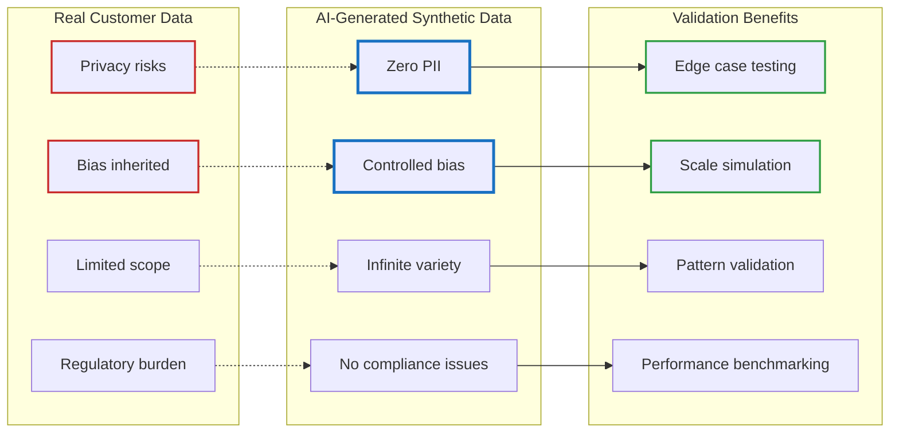

# Zero PII Customer Intelligence — Part 1.1: Generating Realistic Test Data with Local AI

<!--category-- Product, Privacy, LLM, ComfyUI, C# -->
<datetime class="hidden">2025-12-24T20:00</datetime>

## Introduction

In [Part 1](/blog/zero-pii-customer-intelligence-part1), we established the conceptual foundation for zero-PII customer intelligence. But there's a practical challenge: **how do you test and validate these systems without real customer data?**

The answer lies in generating sophisticated synthetic data that mirrors real-world complexity while containing zero personal information. This isn't just about creating dummy records—it's about building a realistic testbed that can stress-test your algorithms and demonstrate the system's capabilities.

We'll use local Large Language Models (LLMs) and AI image generation (ComfyUI) to create a complete ecommerce ecosystem—products, customers, sellers, and visual content—that's both realistic and completely synthetic.

## Why Synthetic Data Matters

### The Validation Problem

Building intelligent systems requires validation. You need to answer questions like:

- Does our semantic segmentation actually group related products?
- Do customer profiles evolve realistically over time?
- Can our recommendation engine handle edge cases?
- How does the system perform with different data distributions?

Using real customer data is problematic:
- Privacy concerns and regulatory compliance
- Bias amplification from historical data
- Limited to existing patterns (hard to test novel scenarios)
- Data access restrictions and governance overhead

### The Synthetic Data Advantage

Synthetic data, when generated intelligently, solves these problems:



## The Architecture: Local AI Pipeline

Our data generation pipeline combines three key components:

### 1. Local LLMs for Content Generation

We use Ollama running locally to generate:
- **Product descriptions** with realistic marketing language
- **Customer personas** with consistent interests and behaviors
- **Seller profiles** with authentic business details
- **Review content** that reflects actual customer experiences

```csharp
// Example: Product generation prompt
var prompt = $"""
    Generate {count} unique products for "{category.DisplayName}" category.
    
    Category description: {category.Description}
    Price range: £{category.PriceRange.Min:F2} - £{category.PriceRange.Max:F2}
    
    For each product, provide:
    - Compelling name (brand-style)
    - Detailed description (2-3 sentences, key features/benefits)
    - Realistic price within range
    - 3-5 relevant tags
    - Trending/featured status (20%/15% respectively)
    - Image generation prompt (product photography style)
    - 2-3 colour variants
    
    Respond with valid JSON only.
    """;
```

### 2. ComfyUI for Realistic Images

Visual content makes the synthetic ecosystem believable. We use ComfyUI (local Stable Diffusion) to generate:

- **Product photography** with consistent lighting and backgrounds
- **Customer profile pictures** with diverse, realistic portraits
- **Color variants** for each product
- **Category-appropriate styling** (tech products vs fashion items)

```csharp
// Image generation workflow integration
var workflow = BuildWorkflow(product.ImagePrompt);
var promptId = await QueuePromptAsync(workflow);
var imageData = await WaitForImageAsync(promptId);
await File.WriteAllBytesAsync(filePath, imageData);
```

### 3. Structured Taxonomy for Consistency

The secret to realistic data is a **taxonomy** that ensures consistency:

```json
{
  "categories": {
    "tech": {
      "display_name": "Technology & Electronics",
      "subcategories": {
        "audio": {
          "products": [
            {"type": "Wireless Headphones", "variants": ["Over-ear", "In-ear", "On-ear"]},
            {"type": "Bluetooth Speakers", "variants": ["Portable", "Home", "Outdoor"]}
          ]
        }
      },
      "price_range": {"min": 29.99, "max": 1299.99}
    }
  }
}
```

This taxonomy guides the LLM to generate coherent data that follows real-world patterns.

## The Generation Process: Step by Step

### Step 1: Category-Driven Product Creation

We start with the taxonomy and ask the LLM to generate products that fit specific categories and price ranges:

```csharp
public async Task<List<GeneratedProduct>> GenerateProductsAsync(
    string categorySlug,
    int count,
    bool useOllama = true)
{
    var category = _taxonomy.Categories[categorySlug];
    
    if (useOllama)
    {
        var prompt = BuildProductGenerationPrompt(category, count);
        var response = await CallOllamaAsync(prompt);
        return ParseProductResponse(response, categorySlug);
    }
    else
    {
        // Fallback to taxonomy-based generation
        return GenerateFromTaxonomy(category, count);
    }
}
```

The LLM creates products like:

```json
{
  "name": "AuraSound Pro X1",
  "description": "Premium wireless headphones with active noise cancellation and 40-hour battery life. Engineered for audiophiles who demand crystal-clear audio and all-day comfort.",
  "price": 249.99,
  "original_price": 349.99,
  "tags": ["wireless", "noise-cancelling", "premium", "long-battery"],
  "image_prompt": "Professional product photography of high-end wireless headphones, studio lighting, white background, sleek modern design, commercial photography style",
  "colour_variants": ["Midnight Black", "Arctic White", "Space Gray"]
}
```

### Step 2: Image Generation with Contextual Awareness

Each product gets multiple images:

1. **Primary product image** using the LLM-generated prompt
2. **Color variants** by modifying the base prompt
3. **Different angles** (when applicable)

```csharp
private static string ModifyPromptForColour(string basePrompt, string colour)
{
    return $"{basePrompt}, {colour} colour variant, product colour is {colour}";
}
```

The result is realistic product photography that matches the item's description and price point.

### Step 3: Customer Persona Generation

We create synthetic customers with:

- **Interest profiles** aligned with product categories
- **Behavioral patterns** (view, cart, purchase probabilities)
- **Demographic consistency** (age-appropriate interests)
- **Visual identity** through AI-generated portraits

```csharp
public class GeneratedProfile
{
    public string ProfileKey { get; set; } // Anonymous identifier
    public Dictionary<string, double> Interests { get; set; } // Category weights
    public List<GeneratedSignal> Signals { get; set; } // Behavioral data
    public string? DisplayName { get; set; }
    public string? Bio { get; set; }
    public int? Age { get; set; }
    public string? ProfileImagePath { get; set; } // AI-generated portrait
}
```

The LLM ensures personas are consistent:

```json
{
  "name": "Alex Chen",
  "bio": "Tech enthusiast who values quality and sustainability. Always looking for innovative gadgets that make life easier.",
  "age": 28,
  "interests": {
    "tech": 0.85,
    "sustainability": 0.72,
    "home-automation": 0.68
  },
  "shopping_style": "Research-driven, prefers premium quality over price"
}
```

## Why This Approach is Powerful

### 1. Realistic Complexity

Real ecommerce data is messy. Our synthetic generation includes:

- **Price elasticity**: Some products have discounts, others don't
- **Inventory variation**: Not all colors/sizes are available
- **Quality ranges**: Budget options alongside premium ones
- **Seasonal trends**: Some products marked as "trending"
- **Customer diversity**: Different shopping patterns and preferences

This complexity is crucial for testing segmentation algorithms that need to handle real-world variation.

### 2. Edge Case Generation

LLMs can create scenarios that are rare in real data but critical for testing:

```csharp
// Generate edge case products
var edgeCases = await GenerateProductsAsync("tech", 5, new EdgeCaseOptions
{
    IncludeExtremePricing = true, // £9.99 and £1999.99 items
    IncludeBundles = true, // Multi-item packages
    IncludeLimitedEdition = true, // Scarcity signals
    IncludeNewCategories = true // Novel product types
});
```

### 3. Controlled Bias

Unlike real data that inherits societal biases, we can control our synthetic data:

```csharp
public class BiasControls
{
    public float GenderBalance { get; set; } = 0.5f; // 50/50 split
    public float AgeDistribution { get; set; } = 0.3f; // Younger skew
    public Dictionary<string, float> CategoryDiversity { get; set; } // Category balance
    public bool IncludeUnderrepresented { get; set; } = true; // Ensure inclusion
}
```

This lets us test for algorithmic fairness and bias mitigation.

### 4. Scale and Reproducibility

Need to test with 1 million customers? Just adjust the parameters:

```bash
sampledata gen --sellers 1000 --products 50 --customers 1000000 --no-images
```

Every generation run is reproducible through seeded random numbers and deterministic LLM parameters.

## Real-World Testing Scenarios

### Scenario 1: Cold Start Performance

Generate a fresh dataset and test:
- How quickly does the system identify customer segments?
- When do recommendations become meaningful?
- What's the minimum data needed for useful personalization?

```csharp
// Test cold start with varying data densities
var testScenarios = new[]
{
    new { Products = 100, Customers = 1000, InteractionsPerCustomer = 2 },
    new { Products = 500, Customers = 5000, InteractionsPerCustomer = 5 },
    new { Products = 2000, Customers = 20000, InteractionsPerCustomer = 15 }
};
```

### Scenario 2: Seasonal Shifts

Generate time-stamped data to test:
- How does the system handle changing interests?
- Do decay functions work as expected?
- Can it detect emerging trends?

```csharp
// Simulate seasonal behavior
var seasonalGenerator = new SeasonalDataGenerator
{
    SummerInterest = new Dictionary<string, double> { ["outdoor"] = 0.8, ["sport"] = 0.7 },
    WinterInterest = new Dictionary<string, double> { ["home"] = 0.9, ["tech"] = 0.6 },
    TransitionRate = 0.1 // Interest drift per week
};
```

### Scenario 3: Anomaly Detection

Inject unusual patterns to test:
- Can the system detect bot-like behavior?
- Are outlier customers identified correctly?
- How does it handle sudden market changes?

## Performance and Resource Considerations

### Local AI Benefits

Running everything locally provides:

1. **Privacy**: No data leaves your environment
2. **Cost**: No API calls after initial model download
3. **Speed**: Parallel processing on local hardware
4. **Customization**: Fine-tune models for your domain

### Resource Optimization

```csharp
// Batch processing for efficiency
public async Task GenerateInBatches<T>(
    IEnumerable<T> items,
    Func<T, Task> processor,
    int batchSize = 10)
{
    var batches = items.Chunk(batchSize);
    await Parallel.ForEachAsync(batches, async batch =>
    {
        await Task.WhenAll(batch.Select(processor));
    });
}
```

### Fallback Strategies

Not everyone has powerful GPUs. The system gracefully degrades:

```csharp
// Check service availability and adapt
if (!await ollamaService.IsAvailableAsync())
{
    AnsiConsole.MarkupLine("[yellow]Ollama not available - using rule-based generation[/]");
    await GenerateUsingRulesAsync();
}

if (!await comfyUIService.IsAvailableAsync())
{
    AnsiConsole.MarkupLine("[yellow]ComfyUI not available - using placeholder images[/]");
    await GeneratePlaceholderImagesAsync();
}
```

## Validation: How Good Is Our Synthetic Data?

### Semantic Consistency

We validate that generated products make semantic sense:

```csharp
public float CalculateSemanticConsistency(GeneratedProduct product)
{
    var nameEmbedding = _embeddingService.GenerateEmbedding(product.Name);
    var descriptionEmbedding = _embeddingService.GenerateEmbedding(product.Description);
    
    return CosineSimilarity(nameEmbedding, descriptionEmbedding);
}
```

### Price Plausibility

Check that prices align with product categories and features:

```csharp
public bool ValidatePrice(GeneratedProduct product, CategoryDefinition category)
{
    var expectedRange = category.PriceRange;
    
    // Allow some outliers but flag extreme cases
    if (product.Price < expectedRange.Min * 0.5 || product.Price > expectedRange.Max * 2.0)
    {
        AnsiConsole.MarkupLine($"[yellow]Unusual price: {product.Name} - £{product.Price}[/]");
        return false;
    }
    
    return true;
}
```

### Diversity Metrics

Ensure the generated dataset represents different segments:

```csharp
public void AnalyzeDiversity(List<GeneratedProfile> profiles)
{
    var categoryDistribution = profiles
        .SelectMany(p => p.Interests)
        .GroupBy(kvp => kvp.Key)
        .ToDictionary(g => g.Key, g => g.Average(kvp => kvp.Value));
    
    // Check for healthy distribution across categories
    foreach (var category in categoryDistribution)
    {
        AnsiConsole.MarkupLine($"[dim]{category.Key}: {category.Value:F2} average interest[/]");
    }
}
```

## Integration with the Zero-PII System

This synthetic data becomes the foundation for testing our zero-PII customer intelligence:

1. **Products**: No PII, just semantic attributes and embeddings
2. **Customers**: Anonymous profiles with interest signatures
3. **Interactions**: Behavioral signals without identity linkage
4. **Images**: Realistic visuals without real people or products

```csharp
// All data is PII-free by design
public class SyntheticCustomer
{
    public string ProfileKey { get; set; } // Hashed anonymous ID
    public Dictionary<string, double> Interests { get; set; } // Semantic interests
    public List<BehavioralSignal> Signals { get; set; } // Actions, not identity
    public float[] InterestEmbedding { get; set; } // Vector representation
}
```

## Next Steps

With this synthetic data pipeline, we can:

1. **Build and test** the complete zero-PII intelligence system
2. **Benchmark** different algorithms without privacy concerns
3. **Demonstrate** capabilities with realistic examples
4. **Stress test** edge cases and failure modes
5. **Validate** that transparency doesn't harm performance

The generated data serves as both a testing platform and a demonstration dataset—proving that sophisticated customer intelligence doesn't require harvesting personal information.

---

**Next:** [Part 2 - Core Implementation] where we'll use this synthetic data to build the actual zero-PII segmentation system.

**Code Repository:** The complete data generation pipeline is available in the `Mostlylucid.SegmentCommerce.SampleData` project.

*This approach demonstrates how local AI can create realistic, privacy-preserving test data that enables innovation without compromising ethics.*