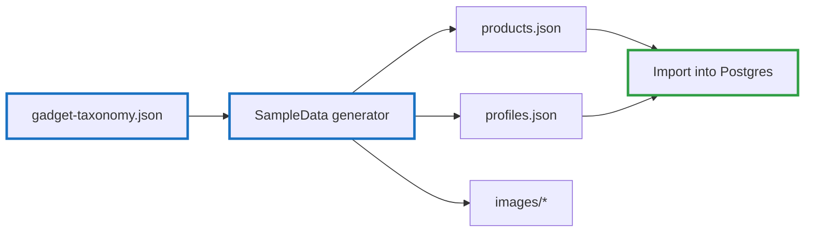
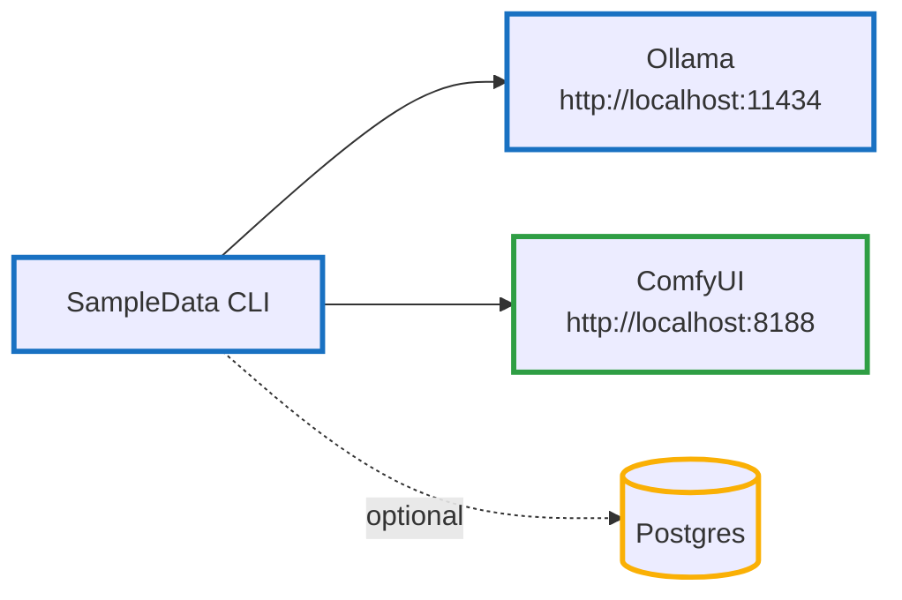
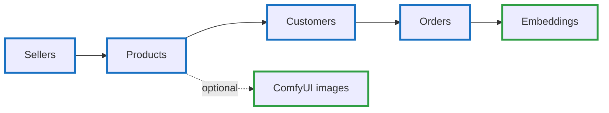
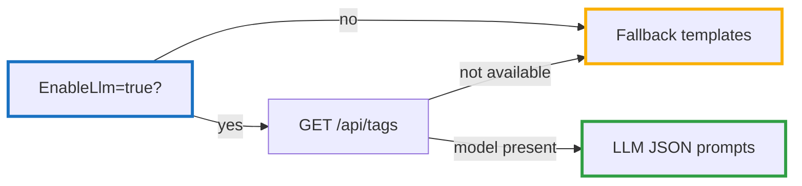
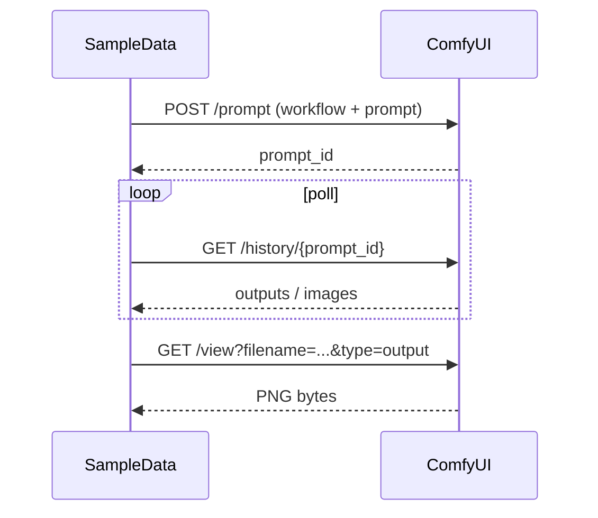
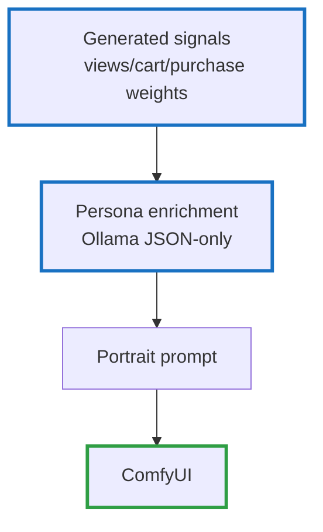

# Zero PII Customer Intelligence — Part 1.1: Generating Sample Data (and Images) Locally

<!--category-- Product, Privacy, LLM, ComfyUI, C# -->
<datetime class="hidden">2025-12-24T20:00</datetime>

In [Part 1](/blog/zero-pii-customer-intelligence-part1) I talked about the architecture: sessions, anonymous profiles, decay, and explainable segments.

Here’s the very practical follow-up: **how do you validate any of this without ever touching real customer data?**

For this series I generate a complete synthetic ecommerce dataset locally:
- Product catalog (names, descriptions, tags, prices)
- Anonymous “profiles” / personas (interests + signals)
- Product images (and profile portraits) via ComfyUI
- Optional DB import so the real app can run against it

This is one of those “it feels like cheating” workflows: you get realistic inputs, you can regenerate them any time, and you never introduce PII into your dev environment.

## Why Local Synthetic Data Is So Powerful

If you’re building segmentation / personalisation, you need datasets that:
- Have enough variation to break naive heuristics
- Are safe to share (in code, tests, demos)
- Are reproducible (so you can compare model changes)

Real data is the opposite: sensitive, messy, hard to move around, and full of historical bias.

Synthetic data gives you three superpowers:

1. **Fast iteration**: change the segmentation logic, regenerate, re-run.
2. **Hardening**: simulate weird long-tail behaviours you won’t see in a tiny dev dataset.
3. **Explainability testing**: you can *inspect every generated field* and confirm your “show me why” UI is truthful.



## The Tooling (What Actually Runs)

The generator lives in `Mostlylucid.SegmentCommerce.SampleData`.

It’s intentionally not “a framework”; it’s a pragmatic CLI that talks to:

- **Ollama** (local LLM) for structured JSON generation.
- **ComfyUI** (local Stable Diffusion) for product photography-style images.
- A **taxonomy JSON** that keeps outputs coherent (categories, types, variants, price ranges).

Configuration is wired up so you can drive it via environment variables:

```csharp
// Mostlylucid.SegmentCommerce.SampleData/Program.cs
var configuration = new ConfigurationBuilder()
    .SetBasePath(AppContext.BaseDirectory)
    .AddJsonFile("appsettings.json", optional: true)
    .AddEnvironmentVariables("SAMPLEDATA_")
    .Build();
```

## Quickstart

You’ll typically run three local services alongside the generator:



Run the generator from the repo root:

```bash
dotnet run --project Mostlylucid.SegmentCommerce.SampleData -- status
```

Then generate a dataset:

```bash
# v1 generator: taxonomy + optional Ollama + optional ComfyUI
# Writes ./Output/products.json, ./Output/profiles.json, ./Output/images/...
dotnet run --project Mostlylucid.SegmentCommerce.SampleData -- generate --count 20
```

Useful switches:

```bash
# No LLM calls, taxonomy only
dotnet run --project Mostlylucid.SegmentCommerce.SampleData -- generate --no-ollama

# No ComfyUI images
dotnet run --project Mostlylucid.SegmentCommerce.SampleData -- generate --no-images

# Write into Postgres (uses configured connection string)
dotnet run --project Mostlylucid.SegmentCommerce.SampleData -- generate --db
```

Note: if ComfyUI isn’t available, the v1 generator falls back to placeholder images (it uses `picsum.photos`, so that path is not “fully offline”). If you want strictly-local, run with `--no-images`.

## v2 Generator: Sellers → Products → Customers → Orders → Embeddings

There’s also a newer generator command (`gen`) that builds a more complete “marketplace-shaped” dataset:

```bash
# v2 generator
# Writes dataset.json plus sellers/products/customers/orders split files
dotnet run --project Mostlylucid.SegmentCommerce.SampleData -- gen --sellers 50 --products 20 --customers 1000
```

It’s orchestrated as a multi-phase pipeline:



And you can see those phases directly in code:

```csharp
// Mostlylucid.SegmentCommerce.SampleData/Services/DataGenerator.cs
// 1. Generate Sellers
// 2. Generate Products for each seller
// 3. Generate Customers
// 4. Generate Orders (with fake checkout data via Bogus)
// 5. Generate embeddings for all entities
```

### Embeddings (Local ONNX, Cached After First Run)

The v2 generator can compute embeddings using an ONNX model (default: `all-MiniLM-L6-v2`). The first time you run it, it downloads the model and vocab into your output folder.

That means:
- First run needs network access (model download)
- Subsequent runs are local and fast
- If you want “no network ever”, run `--no-embeddings`

```csharp
// Mostlylucid.SegmentCommerce.SampleData/Services/EmbeddingService.cs
private const string ModelUrl = "https://huggingface.co/sentence-transformers/all-MiniLM-L6-v2/resolve/main/onnx/model.onnx";
private const string VocabUrl = "https://huggingface.co/sentence-transformers/all-MiniLM-L6-v2/resolve/main/vocab.txt";

// Download model if not exists
if (!File.Exists(_config.ModelPath))
{
    await DownloadFileAsync(ModelUrl, _config.ModelPath, ct);
}
```

## How We Generate “LLM-Shaped” Products (JSON Only)

The product generation prompt is deliberately strict: the LLM must return JSON only, with an embedded JSON schema example.

```csharp
// Mostlylucid.SegmentCommerce.SampleData/Services/OllamaProductGenerator.cs
return $"""
    You are a product catalog generator for an e-commerce store. Generate {count} unique, realistic product listings for the \"{category.DisplayName}\" category.

    Category description: {category.Description}
    Example products in this category: {category.ExampleProducts}
    Price range: £{category.PriceRange.Min:F2} - £{category.PriceRange.Max:F2}

    For each product, provide:
    1. A compelling product name (realistic brand-style naming)
    2. A detailed description (2-3 sentences, highlighting key features and benefits)
    3. A realistic price within the range
    4. Optional original price if on sale (20-40% higher than current price)
    5. 3-5 relevant tags
    6. Whether it's trending (about 20% should be trending)
    7. Whether it's featured (about 15% should be featured)
    8. An image prompt for AI image generation (detailed, product photography style)
    9. 2-3 colour variants for the product

    IMPORTANT: Respond with ONLY valid JSON, no markdown formatting, no code blocks, no explanations.

    Generate {count} diverse products now:
    """;
```

This matters because downstream systems (image generation + import + embeddings) want structured data. The LLM is producing *inputs to a pipeline*, not writing prose.

### LLM Responses: Parse JSON, or Fall Back

LLMs are not compilers. Even with “JSON only”, you still need defensive parsing and graceful fallback.

The v2 generator does that via a small helper (`LlmService`) that extracts the first `{...}` block and deserializes it:

```csharp
// Mostlylucid.SegmentCommerce.SampleData/Services/LlmService.cs
var jsonStart = response.IndexOf('{');
var jsonEnd = response.LastIndexOf('}');

if (jsonStart >= 0 && jsonEnd > jsonStart)
{
    var jsonStr = response.Substring(jsonStart, jsonEnd - jsonStart + 1);
    return JsonSerializer.Deserialize<T>(jsonStr, new JsonSerializerOptions
    {
        PropertyNameCaseInsensitive = true
    });
}
```

And the overall generation pipeline explicitly checks availability and downgrades to deterministic templates when needed:



### Example: Customer Personas (v2)

The persona prompt for customers is short and structured so it can be generated quickly with a small local model:

```csharp
// Mostlylucid.SegmentCommerce.SampleData/Services/DataGenerator.cs
var prompt = $$"""
    Generate a shopper persona interested in: {{string.Join(", ", categoryNames)}}.

    Return JSON only:
    {
      "persona": "Brief persona description (e.g. 'Tech enthusiast who values quality')",
      "name": "Realistic first name",
      "bio": "One sentence about their shopping habits",
      "age": 25,
      "shopping_style": "budget|value|premium|luxury",
      "preferred_categories": ["category1", "category2"]
    }
    """;
```

## ComfyUI: Product Photography via API

ComfyUI is great because it gives you a controllable pipeline (workflows) rather than a “single black box image endpoint”.

The generator:
1. Loads a workflow template (`ComfyUI/workflows/product_image.json`)
2. Patches the prompt into `CLIPTextEncode`
3. Queues `/prompt`
4. Polls `/history/{promptId}`
5. Downloads the image via `/view?...`



ComfyUI model selection is also patched into the workflow at runtime (so you can swap checkpoints without editing the JSON):

```csharp
// Mostlylucid.SegmentCommerce.SampleData/Services/ComfyUIImageGenerator.cs
TryPatchCheckpoint(workflow, _config.ComfyUICheckpointName ?? "sd_xl_base_1.0.safetensors");
TryPatchRefiner(workflow, _config.ComfyUIRefinerName ?? "sd_xl_refiner_1.0.safetensors");
```

And the workflow patching is intentionally simple and robust:

```csharp
// Mostlylucid.SegmentCommerce.SampleData/Services/ComfyUIImageGenerator.cs
// Update CLIPTextEncode nodes with our prompt
if (classType == "CLIPTextEncode")
{
    var inputs = nodeObj["inputs"]?.AsObject();
    if (inputs != null && inputs.ContainsKey("text"))
    {
        var currentText = inputs["text"]?.GetValue<string>() ?? "";
        if (!currentText.Contains("bad") && !currentText.Contains("ugly") && !currentText.Contains("deformed"))
        {
            inputs["text"] = prompt;
        }
    }
}

// Update image dimensions
if (classType == "EmptyLatentImage")
{
    var inputs = nodeObj["inputs"]?.AsObject();
    if (inputs != null)
    {
        inputs["width"] = _config.ImageWidth;
        inputs["height"] = _config.ImageHeight;
    }
}
```

## Profiles and Personas (Useful, Not Creepy)

The v1 generator creates anonymous profiles and then enriches them with a persona (still no PII). You end up with realistic “people-shaped” test data without emails, addresses, or anything you could ever accidentally ship.

In v1, profiles are keyed using a one-way hash, so there’s nothing to “recover”:

```csharp
// Mostlylucid.SegmentCommerce.SampleData/Services/ProfileGenerator.cs
var profileKey = Hash($"fp-{Guid.NewGuid():N}");

private static string Hash(string input)
{
    using var sha = SHA256.Create();
    var bytes = sha.ComputeHash(Encoding.UTF8.GetBytes(input));
    return Convert.ToHexString(bytes).ToLowerInvariant();
}
```

That’s exactly the mindset of the whole series: you can’t leak what you never stored.



## Validation: What This Lets You Prove

This local pipeline is powerful because it supports *model validation*, not just demos.

- **Segmentation sanity**: do the segments you compute “feel” coherent when you inspect product names/tags and generated personas?
- **Recommendation explainability**: does “show me why” point at a real signal you can verify?
- **Cold start**: if you wipe the dataset and regenerate, does the system behave predictably?
- **Regression testing**: regenerate the same shape of data and ensure your changes don’t break ranking, scoring, or UI.

The important subtlety: by generating both the *text* and the *images*, you can validate the entire product experience, not just back-end math.

## Next

**Next:** [Part 2 - Core Implementation] where we wire session signals, decay, and segments against this dataset.

If you want to explore the generator code as you read this post:
- `Mostlylucid.SegmentCommerce.SampleData/Commands/GenerateCommand.cs`
- `Mostlylucid.SegmentCommerce.SampleData/Services/OllamaProductGenerator.cs`
- `Mostlylucid.SegmentCommerce.SampleData/Services/ComfyUIImageGenerator.cs`
