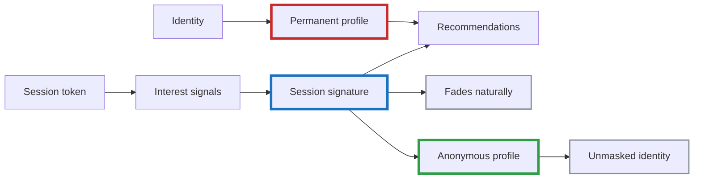
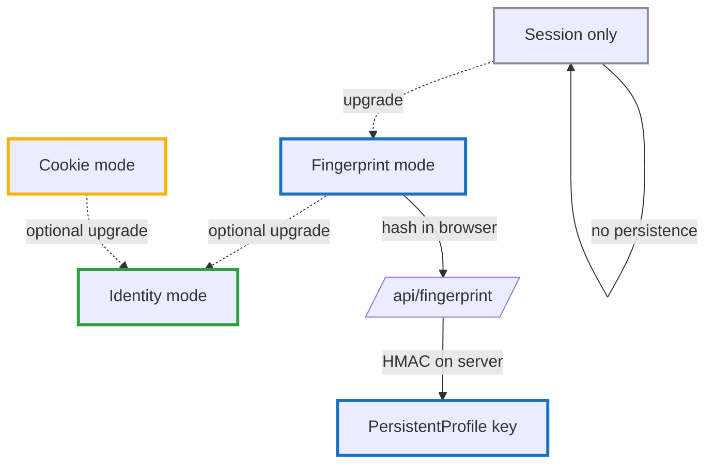
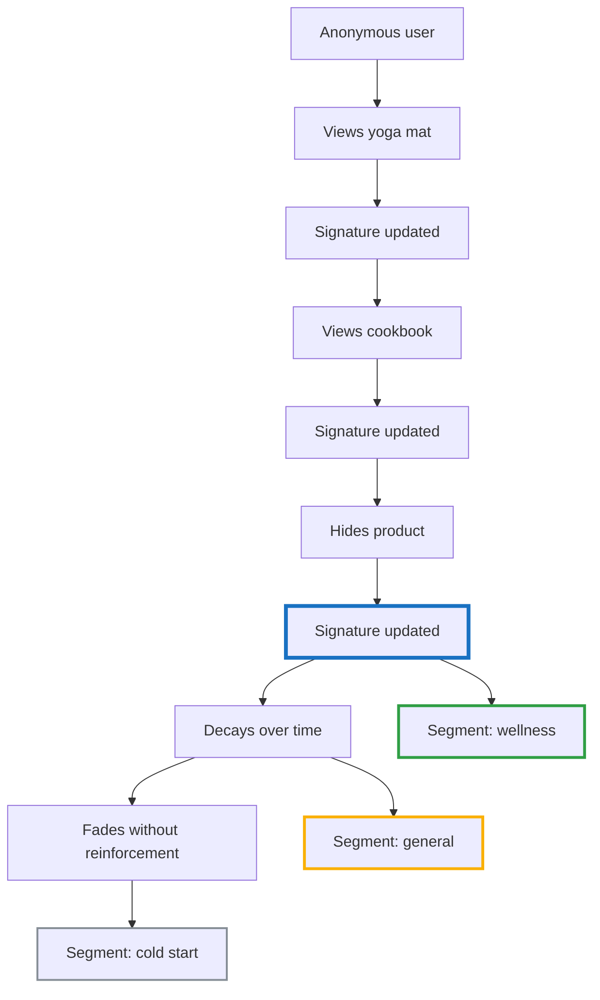
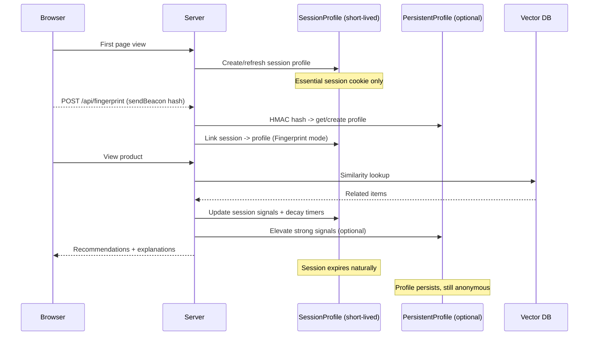
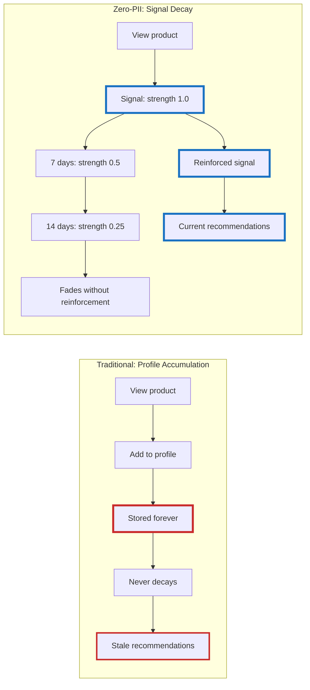

# Zero PII Customer Intelligence — Part 1: The Segmentation Model

<!--category-- Product, Privacy, RAG, DuckDB, Qdrant, C# -->
<datetime class="hidden">2025-12-24T20:00</datetime>

## Introduction

There's a widely-held belief in tech that you **cannot** build sophisticated customer intelligence without:
1. Harvesting personal data (emails, logins, persistent tracking)
2. Keeping the algorithm opaque (proprietary "black box" systems)

> 🎅 **MERRY CHRISTMAS** 🎅: As you'll have noticed Santa is NOT imminent as you read this most likely. It's my lazy pinning system for articles. I publish then add to them until the publication date...so you get to suffer my DRAFTS! In this case I espect to have the working system by publication date! 🎅

**Both assumptions are wrong—not philosophically, but architecturally and operationally.**

This series builds a working ecommerce system that proves you can have:
- Semantic understanding of customer interests (without storing identities)
- Statistical segmentation and personalisation (without persistent tracking)
- Full transparency (customers see and adjust their own interest signatures)
- Real-time adaptation (better than traditional profiling systems)

We'll build this using vector embeddings, session-based tracking, and aggregate analytics—all open and explainable.

In this first part, we establish the conceptual foundation: **why transparency isn't just ethical, it's better product design**.

[TOC]

## The False Dichotomy

The industry presents personalisation as a binary choice:

**Option A: Sophisticated but Misaligned**
- Collect lots of signals (some genuinely useful)
- Build permanent profiles optimised for targeting
- Cross-site tracking, third-party IDs, and often invasive fingerprinting
- Opaque algorithms users can't inspect or control
- Result: behavioural manipulation and advertising value, not customer value

**Option B: Privacy-Respecting but Dumb**
- No tracking at all
- Generic content for everyone
- No personalisation, no recommendations
- Result: Poor user experience, low engagement

This is a **false dichotomy**. There's a missing architecture.

## Personalisation Without Identity

What if customers could:
- See their own interest signatures in real-time?
- Understand exactly why they're seeing specific recommendations?
- Adjust their segments with simple controls?
- Trust the system because they can inspect it?

This isn't theoretical. We'll build it.

### The Core Insight

You don't need to know **who someone is** to understand **what they're interested in right now**.



An interest signature like:
```
"yoga • sustainability • minimalism • wellness • organic"
```

...tells you everything you need for personalisation without telling you anything about the person's identity.

It can live for a single session, or persist as an **anonymous profile** that the user can reset or export.

Early on, the simplest way to keep that profile stable without logins is **client-side fingerprinting**—but implemented in a *zero-PII / zero-tracking-cookie* way.

In the current codebase (`Mostlylucid.SegmentCommerce`) the browser computes a fingerprint **hash** (no raw signals sent, no localStorage, no tracking cookie) and POSTs it to `/api/fingerprint`. The server then **HMACs** that hash (so it’s useless outside this site) and links it to the current session.

We still use an **essential session cookie** for short-lived session state (views, cart events, etc.), but we do *not* need a dedicated “follow-you-forever” tracking cookie to get useful continuity. Later in the series we can upgrade to a logged-in identity mode (highest trust) without changing the rest of the segmentation design.



Crucially: persistence does not have to mean identity. The profile remains detached unless the user explicitly chooses to “unmask” it.

Compare that to traditional profiling:
```
Name: John Smith
Email: john@example.com
Age: 34
Location: Seattle
Purchase history: [284 items tracked forever]
Browsing history: [Cross-site tracking across 47 domains]
```

The first approach gives you **better recommendations** with **zero PII**. The second invades privacy and still gets it wrong (remember that one impulse purchase still haunting your feed six months later?).

## The Problem We're Solving

You've experienced the dysfunction yourself:

**What users experience:**
- "The feed feels weird"
- "Why am I seeing this?"
- "Why won't this go away?"
- "I looked at that once as a gift for someone else—stop showing me baby products"

**What they don't get:**
- A mental model of how it works
- A sense of control
- Trust

**What the industry says:**
- "Users won't understand the algorithm anyway"
- "Transparency hurts conversion rates"
- "Privacy and personalisation are incompatible"
- "The algorithm is too complex to explain"

These claims persist because they align with commercial incentives, not technical reality.

## Why Big Tech Won't Explain Their Algorithms

It's not that Google, Amazon, Meta, or TikTok **can't** explain how their recommendation systems work. They absolutely can. The algorithms aren't magic—they're math, statistics, and machine learning that could be explained in plain English.

**They choose not to because transparency would undermine the economic assumptions these systems are built on.**

### The Structural Problem

The core issue isn't technical complexity—it's that these systems optimise for different outcomes than users assume.

Collecting signals to make a product more useful is not the problem. The problem is when those same signals are repurposed for targeting and behavioural manipulation.

Engagement maximisation often conflicts with user value. Ad placement drives what you see. Behavioural nudging keeps you scrolling.

Transparency would make these conflicts obvious, so opacity becomes a feature, not a limitation.

### The Commercial Incentive for Opacity

There are massive commercial and PR reasons to avoid transparency:

**1. Data Collection Scope**
- Cross-site tracking, data broker purchases, behavioural inferences
- The full extent would shock most users

**2. Optimisation Targets**
- Systems optimised for engagement often amplify outrage
- Ad revenue frequently conflicts with user value
- The mismatch between stated and actual goals

**3. Profile Permanence**
- Data accumulated over years with no natural decay
- One-off actions treated as permanent preferences
- No distinction between curiosity and commitment

### The "It's Too Complex" Excuse

When pressed, Big Tech hides behind: "The algorithm is too complex for normal users to understand."

This framing is misleading. Users already understand:
- Interest rates and loan terms (complex math)
- Nutrition labels (statistical aggregates)  
- Weather forecasts (probabilistic models)
- Credit scores (multi-factor algorithms)

They could understand recommendations too—if companies chose to explain them.

Complexity isn't the barrier. Exposure is.


## The Solution: Transparent Segmentation

Building a zero-PII customer intelligence system starts with one fundamental principle: **users should understand what's happening and why**.

You don't need a whitepaper. You need a plain-English mental model that users can internalise in thirty seconds.

### What Is a Segment? (In Human Terms)

Here's what not to say:

> "A cluster derived from embeddings in a high-dimensional vector space, derived from similarity scores across vectors..."

Here's what works:

> "We group products and interests into small, overlapping segments based on how people interact with them. You're probably in dozens of segments at once—and they change constantly based on what you actually do."

Three key concepts to communicate:

1. **Segments are fluid** — They're not categories you get locked into
2. **You're in many at once** — Interest in hiking gear doesn't prevent you from also being interested in cooking
3. **They change over time** — Last month's interests don't define you forever



This framing immediately differentiates your system from the creepy "you looked at this once, now we'll show it to you forever" behaviour users have come to expect. *This is closer to how people actually behave than static "profiles" ever were.*

### What Signals Actually Matter

Transparency means being specific about what actions influence segmentation—and for how long. A simple table does wonders here:

| Action | Signal Strength | Duration | Notes |
|--------|----------------|----------|-------|
| Single click/view | Weak | Minutes–hours | Curiosity, not commitment |
| Multiple views over time | Medium | Days | Growing interest |
| Explicit "I'm interested" | Strong | Weeks | Clear signal |
| Save/bookmark | Strong | Weeks+ | Intentional signal |
| "Not relevant" / Hide | Suppression | Long | Respect the signal |
| No reinforcement | Decay | Varies | Interest fades naturally |

This table alone transforms the user experience from "mysterious algorithm" to "fair system I can influence."

### The Decay Differentiator

**This is the single biggest difference between segmentation and profiling.**

Here's where zero-PII segmentation shines: **interests fade unless reinforced**.

> "One late-night browse won't follow you for weeks. If you don't keep engaging with something, we assume you've moved on."

Traditional tracking systems build permanent profiles. Every action accumulates forever, creating an increasingly distorted picture of who you are.

A decay-based system is fundamentally different:
- Recent activity matters more than old activity
- One-off curiosity doesn't become part of your "identity"
- The system naturally adapts as your interests change

You don't need to explain the exponential decay function or half-life calculations. Users need reassurance, not mathematics.

### User Agency: Show Them Their Signature

Here's what radically differentiates this approach: **customers can see and adjust their own interest signatures**.

Imagine a simple interface that shows:

```
Your Current Interests (this session)
━━━━━━━━━━━━━━━━━━━━━━━━━━━━━━━━━━━
🌱 Sustainable Products     ████████░░ 80%
🧘 Yoga & Wellness          ███████░░░ 70%
📚 Minimalism              █████░░░░░ 50%
🏃 Athletic Gear           ████░░░░░░ 40%
🌿 Organic Foods           ███░░░░░░░ 30%

[Remove] [Adjust] [Add Interest]

These fade over time unless you keep engaging.
Last updated: 2 minutes ago
```

This level of transparency gives users:
- **Visibility**: "Oh, that's why I'm seeing these recommendations"
- **Control**: "Actually, I'm not interested in athletic gear anymore" [Remove]
- **Trust**: "The system shows me what it knows and lets me correct it"
- **Agency**: "I can shape my experience without creating an account"

Compare this to traditional systems where you have **no idea** what profile they've built about you, **no way** to inspect it, and **no control** to adjust it.

### Controls That Build Trust

Even with minimal implementation, you can offer capabilities that almost no ecommerce systems provide:

**Basic Controls:**
- "Hide this item" → Immediate suppression + negative signal to that segment
- "Not relevant" → Explicit negative feedback that adjusts segment strength
- "Show me why" → Displays which interest triggered this recommendation

**Advanced Controls (for later):**
- Explicit interest tagging: "I'm shopping for a gift" (temporary mode that doesn't affect your signature)
- Segment strength visualization: See the decay curve in real-time
- Decay rate preferences: "Remember my interests for days/weeks/session only"
- Export your signature: Download your current interest vector as JSON

**The key insight:** These aren't just features—they're **trust signals**. They communicate: "This system responds to you. You're not being subjected to it."

### Privacy Through Transparency

Traditional systems keep algorithms opaque to avoid exposing the scope of data collection, behavioural inference, and how that information is monetised (targeting, nudges, attribution).

We can be radically transparent because there's **nothing invasive to hide**:
- No personal data stored (can't leak what you don't have)
- No cross-site tracking (session-scoped only)
- No permanent profiles (decay by design)
- No identity linkage (semantic interests, not identity)
- No data sales (nothing to sell)
- No advertiser targeting (no profiles to target)

When users inspect their interest signature, they see clean semantic concepts: `"sustainable products • yoga • minimalism"` rather than demographic inferences or behavioural predictions.

This transparency isn't just ethical. **It's a competitive advantage** because you can say what competitors can't:

> "Here's exactly how our recommendations work. Inspect it. Control it. Trust it."

## Why Transparency Unlocks Better Features

When you can explain your algorithm openly, you can build features that targeting-driven systems **cannot**:

### Features Transparency Enables

**1. Real-Time Interest Dashboard**
- Show users their current signature
- Update it live as they browse
- Can't do this if your algorithm relies on creepy tracking

**2. Explicit Controls**
- "Reduce this interest by 50%"
- "I'm shopping for a gift" (temporary context)
- Can't offer this if you're profiling for advertisers

**3. Recommendation Explanations**
- "You're seeing this because you viewed X"
- "This came from your 'sustainable living' interest"
- Can't explain if the real reason is "advertiser paid extra"

**4. Algorithmic Auditing**
- Users can verify the system is fair
- No hidden discrimination or bias
- Can't allow inspection if you're doing demographic targeting

**5. Data Portability**
- Export your interest signature as JSON
- Import it in a new session
- Can't offer this if you're tracking identity across sites

### Features Opacity Requires

Notice what Big Tech **can't** build without admitting their practices:

- "See why you're seeing this ad" (the honest answer is often microtargeting)
- "Adjust your profile" (difficult if the profile is built from opaque inference)
- "Verify our algorithm is fair" (hard to audit if the optimisation target is engagement)
- "Export your data" (uncomfortable when a long-lived dossier exists)

They're **locked out** of building trust features because transparency would expose the surveillance.

Once segmentation is clearly explained, you can layer features that compound trust:

- **Gamification** becomes "help tune your segments" (not manipulation)
- **Voting/feedback** becomes "adjust segment strength" (explicit control)  
- **Explanations** become "this came from segment X" (traceable reasoning)
- **Decay** becomes visible (not mysterious)
- **Trust** compounds over time

You're not building features in isolation. You're creating a **coherent system** where each piece reinforces the mental model users already have—and can verify.

## Technical Foundation (What We'll Build)

While this article focuses on the conceptual model, let me preview the technical stack we'll use in the implementation parts:

### Vector Embeddings for Semantic Grouping

We'll use [Qdrant](semantic-search-with-onnx-and-qdrant) for semantic segmentation. Instead of manually defining categories, we'll let the system discover natural groupings based on how products relate semantically.

For example, "yoga mat" and "meditation cushion" cluster together not because we tagged them—but because their embeddings are naturally similar. We covered the basics in [Building CPU-Friendly Semantic Search](semantic-search-with-onnx-and-qdrant), and we'll extend those patterns here.

Key insight: Vector databases let you compare **interest patterns**, not user profiles. No identifiers stored.

### Session Signals (Plus an Anonymous Profile)

We use a short-lived **session profile** for immediate intent. In code this is a `SessionProfileEntity`: it stores “what’s happening *right now*” (recent interactions, context, decay timers).

Then, *optionally*, we link that session to a **persistent profile** (`PersistentProfileEntity`) via one of three identification modes:

- `Fingerprint`: the browser computes a fingerprint hash and sends **only the hash** to `/api/fingerprint` (no raw signals, no localStorage). The server HMACs that hash and uses it as the stable key. This is “zero tracking cookie” identification.
- `Cookie`: a classic first-party tracking cookie approach (useful, but should be consent-gated).
- `Identity`: logged-in user id (highest trust, easiest to explain).

The important design point is that *persistence does not have to mean identity*. Even in `Fingerprint` mode, the key is site-scoped and opaque; it only becomes “identified” if the user explicitly upgrades to an account / unmask flow.

## How Commercial Providers Stitch Profiles Together

The problem is not that signals exist. If a store learns that you’re interested in running shoes and uses that to show you better running shoes, great.

The problem is when the same signals are repurposed for **targeting, attribution, and behavioural manipulation** — and when identity makes those signals portable across the web.

### The Network Effect of Third-Party Identity

When you use third-party sign-in (for example “Sign in with Google”, “Sign in with Facebook”, etc.) you introduce a **globally stable identifier**.

That has a compounding effect:
- The more sites that use the same identity provider, the easier it becomes to correlate activity across them.
- The more correlation, the more valuable the profile becomes to advertisers and data brokers.
- The more valuable the profile, the stronger the incentive to keep the system opaque.

In other words: your profile becomes more valuable precisely because the identifier works everywhere.

### Why Google Is the Obvious Example (Including Gmail)

A Google account can span many high-signal products: Search, YouTube, Maps/Android, Chrome, and (for many people) Gmail.

Even if a given property has strict rules about what content is used for ad personalisation, the commercial value comes from the *stitching*:
- A stable identity makes it possible to join signals from different products.
- Joined signals enable more precise targeting and attribution.
- Targeting and attribution are what make profiles commercially valuable.

That’s why “Sign in with Google” can be a step-change: it replaces a local, first-party identity with a portable identifier that is easy to correlate.

### What We’ll Do Instead

In this series, persistence is either:
- session-scoped, or
- attached to a first-party anonymous key (fingerprint-hash HMAC, optional cookie ID, or logged-in user ID)

And it only becomes identifiable if the user explicitly chooses to unmask it.

This keeps the useful part (better recommendations) while avoiding the commercial part (portable profiles optimised for targeting).



The **session profile** stores:
- Recent interactions (views, cart adds, hides)
- Context (device type, referrer domain, time-of-day)
- Decay timers and “right now” intent

The **persistent profile** (optional) stores:
- A stable, site-scoped key (fingerprint HMAC / optional cookie / optional user id)
- Long-lived interests/signals that have been elevated
- Segment membership and derived attributes

No PII by default. Even when you persist, you’re persisting an **opaque key + interest signals**, not an identity.

### Aggregate Analytics with DuckDB

We've covered [using DuckDB with local LLMs](analysing-large-csv-files-with-local-llms) before. Here we'll extend that pattern for privacy-preserving analytics.

Instead of tracking individuals:
```sql
-- What we DON'T do
SELECT user_id, product_views FROM analytics WHERE user_id = 'john@example.com'

-- What we DO do
SELECT segment_id, COUNT(*) as users, AVG(engagement_score)
FROM interactions
GROUP BY segment_id
```

You see "people interested in sustainable products also engage with wellness content"—not "John Smith looked at these specific items."

This builds on concepts from [DataSummarizer](datasummarizer-how-it-works), where we generate insights from aggregate statistics, never raw individual data.

### Decay Functions (Interests Fade Naturally)

We'll implement exponential decay so interests naturally fade without reinforcement. This is illustrative, not prescriptive:

```csharp
public class DecayingSignal
{
    public double Strength { get; set; }
    public DateTime LastUpdate { get; set; }
    public double HalfLife { get; set; } = TimeSpan.FromDays(7).TotalSeconds;
    
    public double GetCurrentStrength()
    {
        var elapsed = (DateTime.UtcNow - LastUpdate).TotalSeconds;
        return Strength * Math.Exp(-elapsed * Math.Log(2) / HalfLife);
    }
}
```

A single view at 2 AM doesn't define you forever. After a week with no reinforcement, that signal has halved. After two weeks, it's down to 25%.

### Semantic Segmentation (Automatic Discovery)

This is where the series gets concrete: in Part 2 we’ll build the session-scoped “interest signature” and the logic that maps it onto a small set of dynamic segments.

The important conceptual point for Part 1 is simply this:

- We can segment **sessions** for immediate intent
- We can also maintain a **persistent anonymous profile** (fingerprint-hash HMAC / optional cookie / optional user id)
- The signature **decays** (so old intent fades out)
- The segments are **explainable** (users can see and adjust them)
- Identity is only introduced if the user explicitly “unmasks” the profile

The beauty of this approach is that you get **sophisticated personalisation without ever knowing who anyone is**. The specific tools matter less than the model.

## Framing It For Users

Your documentation should be clear and concise:

> "Our recommendations aren't a black box. They're built from lightweight segments that respond to what you do—and just as importantly, forget what you don't reinforce."

This sets the right expectations:
- Not mysterious (explicit about mechanism)
- Not permanent (decay is a feature)
- Not invasive (responding to behaviour, not identity)

## The Deeper Principle

What you're really building are **process-first systems**.

These must be explained in terms of:
- **Flow** — How signals move through the system
- **Influence** — What actions change what outcomes
- **Change over time** — How the system evolves and adapts

Not static snapshots. Not fixed categories. Not permanent profiles.

Documentation isn't an afterthought here—**it's part of the product**. The mental model you give users is as important as the algorithm itself.

## What We'll Build

This series will implement a complete proof-of-concept ecommerce system demonstrating these principles:

### Part 2: Core Implementation
- Session-based interest tracking (ephemeral signatures)
- Persistent anonymous profiles (fingerprint-hash HMAC / cookie / identity mode)
- Vector embeddings for semantic product grouping ([extending our Qdrant work](semantic-search-with-onnx-and-qdrant))
- Segment assignment from the session embedding
- Decay functions that feel natural
- Basic recommendation engine

### Part 3: User Interface & Transparency
- "Your Interests" dashboard showing the signature
- Real-time adjustments and controls
- Recommendation explanations ("Because you viewed X, you might like Y from segment Z")
- Interest signature export/import
- Gift mode and other temporary contexts

### Part 4: Analytics & Optimisation
- Aggregate analytics with DuckDB (no individual tracking)
- Segment performance metrics
- A/B testing without compromising privacy
- Statistical validation (does this actually work better?)
- Measuring trust and engagement

### Part 5: Advanced Patterns
- Cold start without login (smart defaults from semantic similarity)
- Cross-session learning through aggregate patterns only
- Hybrid recommendations (semantic + collaborative filtering without user IDs)
- Exploration vs. exploitation balance
- Handling edge cases and adversarial input

Each part will include **working code** in C#/.NET, deployable Docker configurations, and real performance metrics.

## Why This Matters Beyond Privacy

Building transparent, zero-PII intelligence isn't just ethically better. **It's technically better.**

### Better Recommendations

Traditional profiling systems accumulate noise over time:
- That one gift purchase you made pollutes your profile forever
- Old interests you've moved past keep surfacing
- Context collapse: work browsing mixed with personal interests
- No way to signal "this was just curiosity"

Decay-based, session-scoped systems are **more accurate** because they focus on **current intent**, not historical accumulation.



### Better Trust

Users who understand and control the system engage more:
- They'll try recommendations because they trust the source
- They'll provide explicit feedback because they see it work
- They won't use ad blockers or anti-tracking tools aggressively
- They'll recommend the experience to others

Opacity breeds distrust. Transparency builds loyalty.

### Better Business Model

You're not selling user data or running invasive ad networks:
- No GDPR nightmares (no PII to breach)
- No consent banners (no tracking to consent to)
- No regulatory risk from evolving privacy laws
- Competitive advantage from actual innovation

Plus: you can open-source the algorithm without giving away competitive advantage, because the value is in the **experience**, not the surveillance.

## The Challenge We're Accepting

We're going to prove you can build **semantic and statistical customer intelligence** that is:

1. **More accurate** than traditional profiling (because it focuses on current intent)
2. **Completely transparent** (users see and adjust their signatures)
3. **Zero PII** (no login, no persistent tracking, no personal data)
4. **Privacy-by-design** (not bolted on, fundamental to architecture)
5. **Open and inspectable** (we'll show all the code)

If we succeed, we'll have demolished the false dichotomy that says "good personalisation requires invasive tracking."

## Conclusion

The belief that sophisticated personalisation requires data harvesting and algorithmic opacity persists because it aligns with existing business models—not because it's technically necessary.

Over this series, we'll build a working ecommerce system that demonstrates:
- Semantic segmentation works without knowing identities
- Statistical intelligence improves without tracking individuals  
- Transparency enhances trust and engagement
- Decay-based systems are more accurate for current intent

When users understand the system, they work with it. When they can work with it, they trust it. And when they trust it, they engage with it.

**When personalisation is built from process instead of identity, privacy stops being a constraint—it becomes a property of the system.**

---

**Next:** [Part 2 - Core Implementation] where we build the session-based tracking, vector embeddings, and decay functions with working C# code.

*This series combines concepts from [Semantic Search with ONNX and Qdrant](/blog/semantic-search-with-onnx-and-qdrant) and [DataSummarizer](/blog/datasummarizer-how-it-works) into a complete zero-PII ecommerce intelligence system.*
