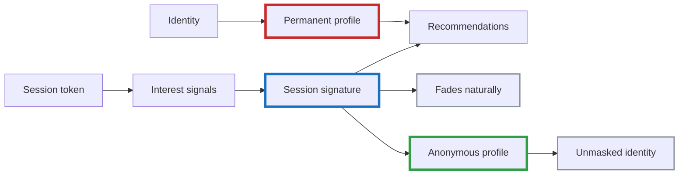
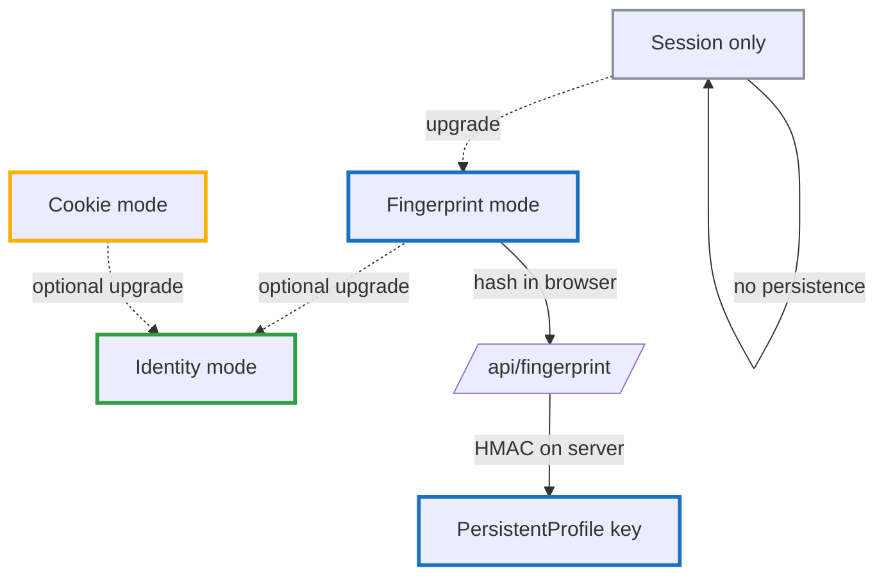
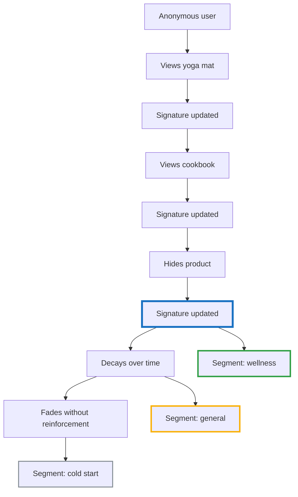
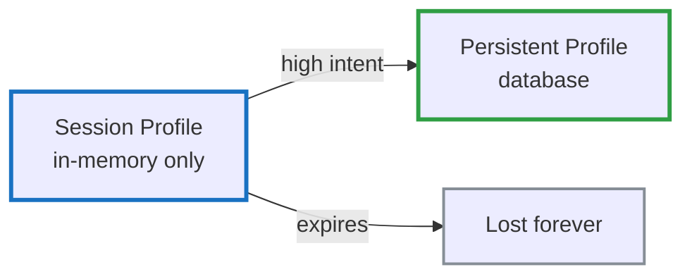

# Zero PII Customer Intelligence - Part 1: The Philosophy

<!--category-- Product, Privacy, Segmentation, C# -->
<datetime class="hidden">2025-12-31T20:00</datetime>

## What This Series Builds

This series builds a working ecommerce system that proves you can have sophisticated customer intelligence **without storing personal information**.

| What We Build | How It Works |
|--------------|--------------|
| Semantic segmentation | Vector embeddings group similar interests |
| Real-time personalisation | Session signals, not permanent profiles |
| Full transparency | Users see and adjust their interest signatures |
| Zero PII | Behavioral patterns, not identities |

The sample project (`Mostlylucid.SegmentCommerce`) is a complete, working implementation you can run locally.

### The Series

- **Part 1** (this article): The philosophy—why transparency beats opacity
- **[Part 1.1](/blog/zero-pii-customer-intelligence-part1-1)**: Generating synthetic sample data locally
- **[Part 2](/blog/zero-pii-customer-intelligence-part2)**: Session profiles, signals, and segment definitions
- **Part 3** (coming): Outbox pattern, job queue, and the transparency UI

[TOC]

## The False Dichotomy

The industry presents personalisation as a binary choice:

**Option A: Sophisticated but Misaligned**
- Collect lots of signals (some genuinely useful)
- Build permanent profiles optimised for targeting
- Cross-site tracking, third-party IDs, and often invasive fingerprinting
- Opaque algorithms users can't inspect or control
- Result: behavioural manipulation and advertising value, not customer value

**Option B: Privacy-Respecting but Dumb**
- No tracking at all
- Generic content for everyone
- No personalisation, no recommendations
- Result: Poor user experience, low engagement

This is a **false dichotomy**. There's a missing architecture.

## Personalisation Without Identity

What if customers could:
- See their own interest signatures in real-time?
- Understand exactly why they're seeing specific recommendations?
- Adjust their segments with simple controls?
- Trust the system because they can inspect it?

This isn't theoretical. We'll build it.

### The Core Insight

You don't need to know **who someone is** to understand **what they're interested in right now**.



An interest signature like:
```
"yoga • sustainability • minimalism • wellness • organic"
```

...tells you everything you need for personalisation without telling you anything about the person's identity.

It can live for a single session, or persist as an **anonymous profile** that the user can reset or export.

Early on, the simplest way to keep that profile stable without logins is **client-side fingerprinting**—but implemented in a *zero-PII / zero-tracking-cookie* way.

In the current codebase (`Mostlylucid.SegmentCommerce`) the browser computes a fingerprint **hash** (no raw signals sent, no localStorage, no tracking cookie) and POSTs it to `/api/fingerprint`. The server then **HMACs** that hash (so it’s useless outside this site) and links it to the current session.

We still use an **essential session cookie** for short-lived session state (views, cart events, etc.), but we do *not* need a dedicated “follow-you-forever” tracking cookie to get useful continuity. Later in the series we can upgrade to a logged-in identity mode (highest trust) without changing the rest of the segmentation design.



Crucially: persistence does not have to mean identity. The profile remains detached unless the user explicitly chooses to “unmask” it.

Compare that to traditional profiling:
```
Name: John Smith
Email: john@example.com
Age: 34
Location: Seattle
Purchase history: [284 items tracked forever]
Browsing history: [Cross-site tracking across 47 domains]
```

The first approach gives you **better recommendations** with **zero PII**. The second invades privacy and still gets it wrong (remember that one impulse purchase still haunting your feed six months later?).

## The Problem We're Solving

You've experienced the dysfunction yourself:

**What users experience:**
- "The feed feels weird"
- "Why am I seeing this?"
- "Why won't this go away?"
- "I looked at that once as a gift for someone else—stop showing me baby products"

**What they don't get:**
- A mental model of how it works
- A sense of control
- Trust

**What the industry says:**
- "Users won't understand the algorithm anyway"
- "Transparency hurts conversion rates"
- "Privacy and personalisation are incompatible"
- "The algorithm is too complex to explain"

These claims persist because they align with commercial incentives, not technical reality.

## Why Big Tech Won't Explain Their Algorithms

It's not that Google, Amazon, Meta, or TikTok **can't** explain how their recommendation systems work. They absolutely can. The algorithms aren't magic—they're math, statistics, and machine learning that could be explained in plain English.

**They choose not to because transparency would undermine the economic assumptions these systems are built on.**

### The Structural Problem

The core issue isn't technical complexity—it's that these systems optimise for different outcomes than users assume.

Collecting signals to make a product more useful is not the problem. The problem is when those same signals are repurposed for targeting and behavioural manipulation.

Engagement maximisation often conflicts with user value. Ad placement drives what you see. Behavioural nudging keeps you scrolling.

Transparency would make these conflicts obvious, so opacity becomes a feature, not a limitation.

### The Commercial Incentive for Opacity

There are massive commercial and PR reasons to avoid transparency:

**1. Data Collection Scope**
- Cross-site tracking, data broker purchases, behavioural inferences
- The full extent would shock most users

**2. Optimisation Targets**
- Systems optimised for engagement often amplify outrage
- Ad revenue frequently conflicts with user value
- The mismatch between stated and actual goals

**3. Profile Permanence**
- Data accumulated over years with no natural decay
- One-off actions treated as permanent preferences
- No distinction between curiosity and commitment

### The "It's Too Complex" Excuse

When pressed, Big Tech hides behind: "The algorithm is too complex for normal users to understand."

This framing is misleading. Users already understand:
- Interest rates and loan terms (complex math)
- Nutrition labels (statistical aggregates)  
- Weather forecasts (probabilistic models)
- Credit scores (multi-factor algorithms)

They could understand recommendations too—if companies chose to explain them.

Complexity isn't the barrier. Exposure is.


## The Solution: Transparent Segmentation

Building a zero-PII customer intelligence system starts with one fundamental principle: **users should understand what's happening and why**.

You don't need a whitepaper. You need a plain-English mental model that users can internalise in thirty seconds.

### What Is a Segment? (In Human Terms)

Here's what not to say:

> "A cluster derived from embeddings in a high-dimensional vector space, derived from similarity scores across vectors..."

Here's what works:

> "We group products and interests into small, overlapping segments based on how people interact with them. You're probably in dozens of segments at once—and they change constantly based on what you actually do."

Three key concepts to communicate:

1. **Segments are fluid** - They're not categories you get locked into
2. **You're in many at once** - Interest in hiking gear doesn't prevent you from also being interested in cooking
3. **They change over time** - Last month's interests don't define you forever



This framing immediately differentiates your system from the creepy "you looked at this once, now we'll show it to you forever" behaviour users have come to expect. *This is closer to how people actually behave than static "profiles" ever were.*

### What Signals Actually Matter

Transparency means being specific about what actions influence segmentation—and for how long. A simple table does wonders here:

| Action | Signal Strength | Duration | Notes |
|--------|----------------|----------|-------|
| Single click/view | Weak | Minutes–hours | Curiosity, not commitment |
| Multiple views over time | Medium | Days | Growing interest |
| Explicit "I'm interested" | Strong | Weeks | Clear signal |
| Save/bookmark | Strong | Weeks+ | Intentional signal |
| "Not relevant" / Hide | Suppression | Long | Respect the signal |
| No reinforcement | Decay | Varies | Interest fades naturally |

This table alone transforms the user experience from "mysterious algorithm" to "fair system I can influence."

### The Decay Differentiator

**This is the single biggest difference between segmentation and profiling.**

Here's where zero-PII segmentation shines: **interests fade unless reinforced**.

> "One late-night browse won't follow you for weeks. If you don't keep engaging with something, we assume you've moved on."

Traditional tracking systems build permanent profiles. Every action accumulates forever, creating an increasingly distorted picture of who you are.

A decay-based system is fundamentally different:
- Recent activity matters more than old activity
- One-off curiosity doesn't become part of your "identity"
- The system naturally adapts as your interests change

You don't need to explain the exponential decay function or half-life calculations. Users need reassurance, not mathematics.

### User Agency: Show Them Their Signature

Here's what radically differentiates this approach: **customers can see and adjust their own interest signatures**.

Imagine a simple interface that shows:

```
Your Current Interests (this session)
━━━━━━━━━━━━━━━━━━━━━━━━━━━━━━━━━━━
🌱 Sustainable Products     ████████░░ 80%
🧘 Yoga & Wellness          ███████░░░ 70%
📚 Minimalism              █████░░░░░ 50%
🏃 Athletic Gear           ████░░░░░░ 40%
🌿 Organic Foods           ███░░░░░░░ 30%

[Remove] [Adjust] [Add Interest]

These fade over time unless you keep engaging.
Last updated: 2 minutes ago
```

This level of transparency gives users:
- **Visibility**: "Oh, that's why I'm seeing these recommendations"
- **Control**: "Actually, I'm not interested in athletic gear anymore" [Remove]
- **Trust**: "The system shows me what it knows and lets me correct it"
- **Agency**: "I can shape my experience without creating an account"

Compare this to traditional systems where you have **no idea** what profile they've built about you, **no way** to inspect it, and **no control** to adjust it.

### Controls That Build Trust

Even with minimal implementation, you can offer capabilities that almost no ecommerce systems provide:

**Basic Controls:**
- "Hide this item" → Immediate suppression + negative signal to that segment
- "Not relevant" → Explicit negative feedback that adjusts segment strength
- "Show me why" → Displays which interest triggered this recommendation

**Advanced Controls (for later):**
- Explicit interest tagging: "I'm shopping for a gift" (temporary mode that doesn't affect your signature)
- Segment strength visualization: See the decay curve in real-time
- Decay rate preferences: "Remember my interests for days/weeks/session only"
- Export your signature: Download your current interest vector as JSON

**The key insight:** These aren't just features—they're **trust signals**. They communicate: "This system responds to you. You're not being subjected to it."

### Privacy Through Transparency

Traditional systems keep algorithms opaque to avoid exposing the scope of data collection, behavioural inference, and how that information is monetised (targeting, nudges, attribution).

We can be radically transparent because there's **nothing invasive to hide**:
- No personal data stored (can't leak what you don't have)
- No cross-site tracking (session-scoped only)
- No permanent profiles (decay by design)
- No identity linkage (semantic interests, not identity)
- No data sales (nothing to sell)
- No advertiser targeting (no profiles to target)

When users inspect their interest signature, they see clean semantic concepts: `"sustainable products • yoga • minimalism"` rather than demographic inferences or behavioural predictions.

This transparency isn't just ethical. **It's a competitive advantage** because you can say what competitors can't:

> "Here's exactly how our recommendations work. Inspect it. Control it. Trust it."

## Why Transparency Unlocks Better Features

When you can explain your algorithm openly, you can build features that targeting-driven systems **cannot**:

### Features Transparency Enables

**1. Real-Time Interest Dashboard**
- Show users their current signature
- Update it live as they browse
- Can't do this if your algorithm relies on creepy tracking

**2. Explicit Controls**
- "Reduce this interest by 50%"
- "I'm shopping for a gift" (temporary context)
- Can't offer this if you're profiling for advertisers

**3. Recommendation Explanations**
- "You're seeing this because you viewed X"
- "This came from your 'sustainable living' interest"
- Can't explain if the real reason is "advertiser paid extra"

**4. Algorithmic Auditing**
- Users can verify the system is fair
- No hidden discrimination or bias
- Can't allow inspection if you're doing demographic targeting

**5. Data Portability**
- Export your interest signature as JSON
- Import it in a new session
- Can't offer this if you're tracking identity across sites

### Features Opacity Requires

Notice what Big Tech **can't** build without admitting their practices:

- "See why you're seeing this ad" (the honest answer is often microtargeting)
- "Adjust your profile" (difficult if the profile is built from opaque inference)
- "Verify our algorithm is fair" (hard to audit if the optimisation target is engagement)
- "Export your data" (uncomfortable when a long-lived dossier exists)

They're **locked out** of building trust features because transparency would expose the surveillance.

Once segmentation is clearly explained, you can layer features that compound trust:

- **Gamification** becomes "help tune your segments" (not manipulation)
- **Voting/feedback** becomes "adjust segment strength" (explicit control)  
- **Explanations** become "this came from segment X" (traceable reasoning)
- **Decay** becomes visible (not mysterious)
- **Trust** compounds over time

You're not building features in isolation. You're creating a **coherent system** where each piece reinforces the mental model users already have—and can verify.

## Technical Preview

Part 2 covers the full implementation. Here's the architecture at a glance:

### Two-Tier Profiles



- **Session profiles**: In-memory only. Collect signals during a visit. Never persisted to database.
- **Persistent profiles**: Only created when users show high intent (cart adds, purchases). Still zero PII—just behavioral patterns keyed by an opaque hash.

### Fuzzy Segments (Not Binary Buckets)

Segments aren't "in or out". They're **fuzzy memberships** with scores (0-1):

| Profile | Tech Enthusiast | Bargain Hunter | Cart Abandoner |
|---------|-----------------|----------------|----------------|
| A | 0.85 | 0.20 | 0.10 |
| B | 0.30 | 0.75 | 0.60 |
| C | 0.95 | 0.05 | 0.00 |

And every score is **explainable**—users can see exactly why they're in a segment.

### Signal Decay

Interests fade unless reinforced:

```
Day 0: View product → Signal: 1.0
Day 7: No activity → Signal: 0.5  
Day 14: No activity → Signal: 0.25
Day 21: → Effectively gone
```

That one late-night browse doesn't define you forever.

## What's Next

**[Part 1.1](/blog/zero-pii-customer-intelligence-part1-1)**: Generating synthetic sample data locally (Ollama + ComfyUI)

**[Part 2](/blog/zero-pii-customer-intelligence-part2)**: Session profiles, signals, and segment definitions—the full implementation

**Part 3** (coming): Outbox pattern, job queue, and the transparency UI

---

**When personalisation is built from process instead of identity, privacy stops being a constraint—it becomes a property of the system.**
