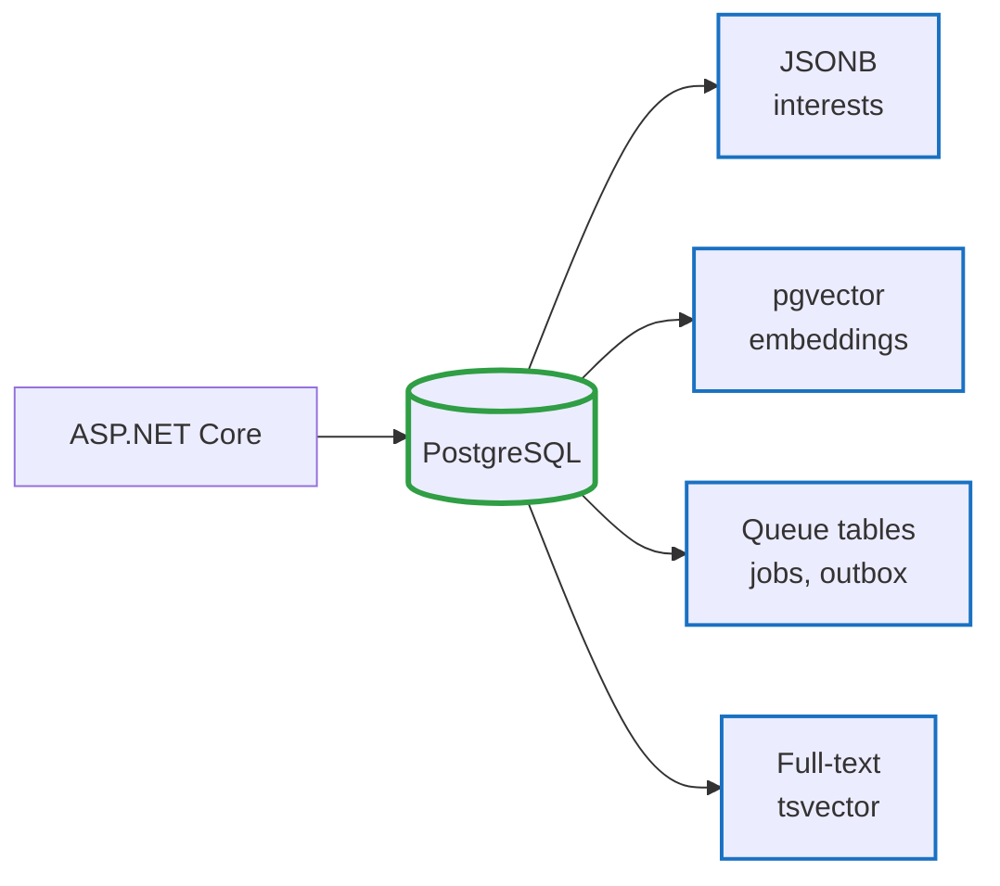
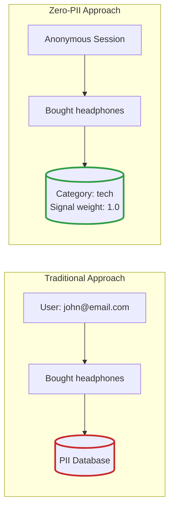
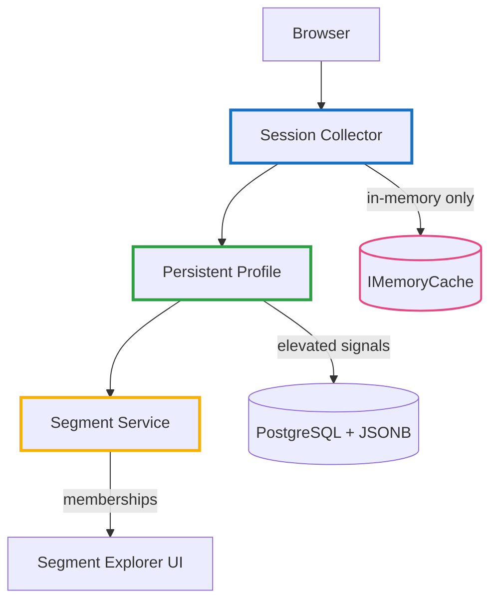
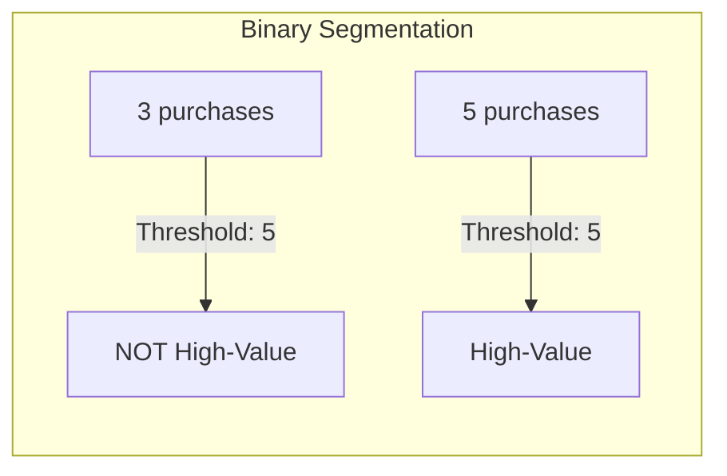
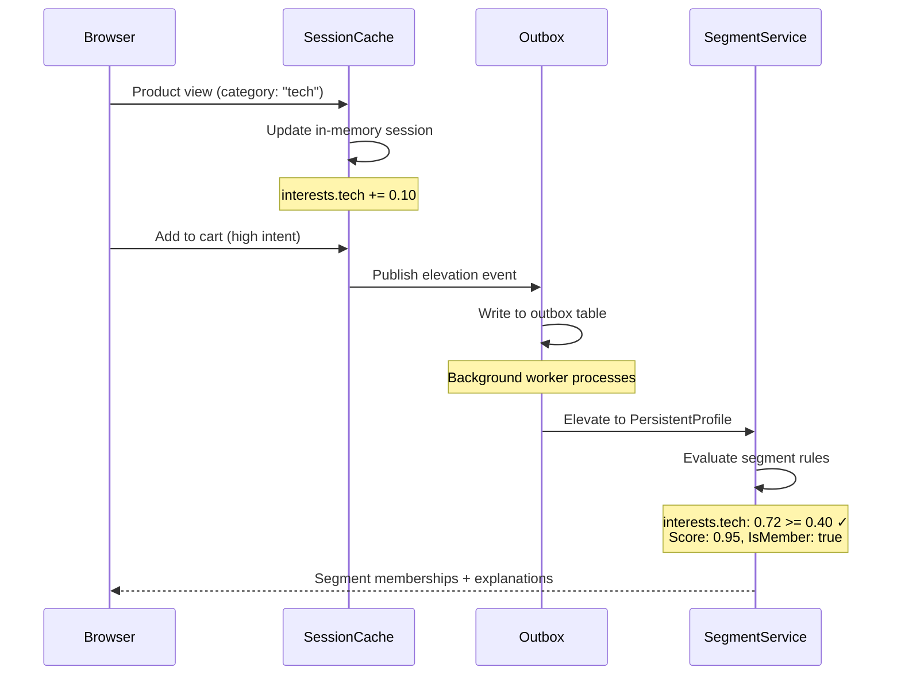
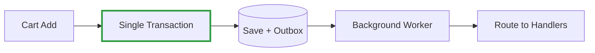

# Zero PII Customer Intelligence - Part 2: Profiles, Signals & Segments

<!--category-- Product, Privacy, Segmentation, C# -->
<datetime class="hidden">2025-12-31T20:00</datetime>

In [Part 1](/blog/zero-pii-customer-intelligence-part1) we covered the philosophy and series overview. In [Part 1.1](/blog/zero-pii-customer-intelligence-part1-1) we built the sample data generator.

Now let's build the core system. This part focuses on:

1. **Zero-PII profile architecture** - Ephemeral sessions vs persistent profiles
2. **Signals and weights** - What we track and how it accumulates
3. **Segment definitions** - Fuzzy membership with weighted rules (the main event)
4. **Outbox pattern preview** - Reliable event publishing (detailed in Part 3)

This is the **sample project** (`Mostlylucid.SegmentCommerce`) - a small ecommerce demo that shows the core patterns. It's intentionally simplified to demonstrate concepts clearly, but it also includes real infrastructure patterns (outbox-based message handling, background job processing, JSONB indexing) that you'd scale horizontally in production.

Think of this as "production patterns in a single-app form factor." The same code structure works whether you're running one process or distributing across services.

[TOC]

## Technology Choices

We chose a **simple, cohesive stack** to keep the sample clear while demonstrating production patterns.

### PostgreSQL + pgvector: One Database

Instead of separate vector databases, message queues, and caching layers, we use **PostgreSQL**:



- **JSONB** for flexible schemas (no separate NoSQL)
- **pgvector** for embeddings (no Qdrant/Pinecone)
- **LISTEN/NOTIFY** for jobs (no Redis/RabbitMQ)
- **tsvector** for full-text (no Elasticsearch)

One connection pool. One backup. One deployment.

### HTMX + Alpine.js: Server-Driven UI

```html
<!-- Instant search (no page reload) -->
<input 
    hx-get="/api/search" 
    hx-trigger="keyup changed delay:300ms" 
    hx-target="#results" />
```

- **HTMX**: Server renders partials (no JSON → templating)
- **Alpine.js**: Reactivity without a build step
- **Progressive enhancement**: Works without JS, better with it

SPA-like UX with server-rendering simplicity.

### ASP.NET Core: Distributable Patterns

Single app, but patterns scale:

- **Outbox** (DB events) → swap for message bus
- **Job queue** (LISTEN/NOTIFY) → swap for worker pool
- **Session collector** → swap for separate API

Start simple. Distribute when needed.

### What We Avoided

- No separate vector database (pgvector is colocated)
- No JS framework (HTMX + Alpine is simpler)
- No microservices yet (patterns work in monolith or distributed)
- No Docker Compose sprawl (one DB, one app)

## The Zero-PII Challenge

Traditional user tracking stores identifiable information: names, emails, user IDs linked to behavior. GDPR and privacy regulations make this increasingly problematic. Our approach is different:

**We store behavioral patterns, not identities.**



The key insight: **you don't need to know WHO someone is to know WHAT they're interested in**.

## Architecture Overview

The system has three core layers:



1. **Session Collector** - Captures behavioral signals (views, clicks, cart adds) - **in-memory only**
2. **Persistent Profile** - Elevates high-value signals, computes interests - **database-backed**
3. **Segment Service** - Evaluates profiles against rules, assigns memberships

**Critical distinction**: Sessions are ephemeral. Profiles are persistent. This is not an implementation detail-it's a privacy architecture decision.

## Session Profiles: Strict In-Memory (LFU Cache)

Sessions are **strictly in-memory**. They live in `IMemoryCache` with sliding expiration and **never touch the database**.

This is a hard architectural constraint: session data cannot persist. It collects signals during a visit and evicts after 30 minutes of inactivity via LFU (Least Frequently Used) cache policy under memory pressure.

### SessionProfile: The In-Memory Model

```csharp
// Mostlylucid.SegmentCommerce/Models/SessionProfile.cs
public class SessionProfile
{
    public string SessionKey { get; set; } = string.Empty;

    // Category interest scores: { "tech": 0.75, "fashion": 0.25 }
    public Dictionary<string, double> Interests { get; set; } = new();

    // Detailed signal counts: { "tech": { "product_view": 5, "add_to_cart": 1 } }
    public Dictionary<string, Dictionary<string, int>> Signals { get; set; } = new();

    // Products viewed this session
    public List<int> ViewedProducts { get; set; } = new();

    // Session context (device, referrer domain, time-of-day)
    public SessionContext? Context { get; set; }

    // Aggregates
    public double TotalWeight { get; set; }
    public int SignalCount { get; set; }
    public int PageViews { get; set; }
    public int ProductViews { get; set; }
    public int CartAdds { get; set; }

    // Timestamps
    public DateTime StartedAt { get; set; } = DateTime.UtcNow;
    public DateTime LastActivityAt { get; set; } = DateTime.UtcNow;

    // Link to persistent profile (if fingerprint resolved)
    public Guid? PersistentProfileId { get; set; }
}
```

### Stored in IMemoryCache (or IDistributedCache) with Sliding Expiration

```csharp
// Mostlylucid.SegmentCommerce/Services/Profiles/SessionCollector.cs
_cache.Set(sessionKey, sessionProfile, new MemoryCacheEntryOptions
{
    SlidingExpiration = TimeSpan.FromMinutes(30),
    Priority = CacheItemPriority.Normal, // LFU eviction under memory pressure
    
    // CRITICAL: Eviction callback decides whether to elevate to persistent profile
    PostEvictionCallbacks =
    {
        new PostEvictionCallbackRegistration
        {
            EvictionCallback = async (key, value, reason, state) =>
            {
                if (value is SessionProfile session && ShouldElevate(session))
                {
                    // Only NOW do we write to database (persistent profile)
                    await ElevateToProfileAsync(session);
                }
                // Otherwise: session is gone forever
            }
        }
    }
});
```

**Hard constraints:**
- **Zero accidental persistence**: Sessions live **only** in cache (IMemoryCache or IDistributedCache like Redis)
- **LFU eviction**: Low-use sessions evict first under memory pressure
- **Sliding expiration**: 30 minutes from last activity
- **Eviction callback**: Last chance to elevate high-value signals before they're lost
- **No recovery**: App restart = all sessions lost (unless using IDistributedCache, but still ephemeral)

### Elevation Decision (On Eviction)

```csharp
private bool ShouldElevate(SessionProfile session)
{
    // Elevate if:
    // - User added to cart (high intent)
    // - User completed purchase (conversion)
    // - Fingerprint was resolved (identity established)
    // - Session weight exceeds threshold (engaged visitor)
    
    return session.CartAdds > 0 
        || session.TotalWeight > 5.0 
        || session.PersistentProfileId.HasValue;
}
```

**Why eviction callback?**

This is the **only** safe point to decide persistence. By the time the cache evicts the session:
1. We know the full session history
2. We can evaluate total engagement
3. We avoid storing low-value sessions (single page view, bounce)
4. We guarantee sessions don't accidentally persist

If we don't elevate during eviction, the session is **gone forever**. This is the design.

### SessionContext: What We Track (Safely)

```csharp
public class SessionContext
{
    public string? DeviceType { get; set; }        // "mobile", "desktop"
    public string? EntryPath { get; set; }         // "/products/tech" (no query params)
    public string? ReferrerDomain { get; set; }    // "google.com" (domain only, not full URL)
    public string? TimeOfDay { get; set; }         // "morning", "afternoon"
    public string? DayType { get; set; }           // "weekday", "weekend"
}
```

Notice what's **not** here: IP addresses, user agents, full URLs, tracking pixels. We capture **context patterns**, not identifiable information.

## What Are Signals?

A **signal** is a behavioral fact captured during a user action. Instead of tracking "who," we track "what happened."

This concept comes from [ephemeral signals](/blog/ephemeral-signals)-short-lived facts that exist in a bounded window and age out naturally. In that system, operations emit signals like `"api.rate_limited"` or `"gateway.slow"` to coordinate behavior without tight coupling.

Here we apply the same pattern to user behavior:
- **Product view** → `product_view` signal (weight: 0.10)
- **Add to cart** → `add_to_cart` signal (weight: 0.35)  
- **Purchase** → `purchase` signal (weight: 1.00)

Signals are **ephemeral** (expire with the session), **zero-PII** (no identity), and **weighted** (intent-aware).

### Client Fingerprinting (Zero-Cookie Identification)

To link sessions without tracking cookies, we use **client-side fingerprinting**. The browser computes a hash from signals (timezone, screen resolution, WebGL renderer, canvas fingerprint) and sends **only the hash** to `/api/fingerprint`.

The server then **HMACs that hash** with a secret key, making it site-scoped and unusable elsewhere.

This code is adapted from my [bot detection project](/blog/botdetection-introduction), where it's used to identify scrapers. Same technique, different purpose.

```javascript
// Mostlylucid.SegmentCommerce/ClientFingerprint/fingerprint.js
// Collect signals (browser capabilities, not PII)
var signals = [
    Intl.DateTimeFormat().resolvedOptions().timeZone,
    navigator.language,
    screen.width + 'x' + screen.height,
    // ... (see full code)
];

// Hash locally
var hash = hash(signals.join('|'));

// Send only the hash via sendBeacon
navigator.sendBeacon('/api/fingerprint', JSON.stringify({ h: hash }));
```

**Server-side:**
```csharp
// Server HMACs the client hash with a secret key
var profileKey = HMACSHA256(clientHash + secretKey);
```

Now we have a stable, site-scoped identifier without cookies or localStorage. See the [full fingerprint.js source](https://github.com/scottgal/mostlylucidweb/blob/main/Mostlylucid.SegmentCommerce/ClientFingerprint/fingerprint.js) (adapted from mostlylucid.botdetection).

## Signal Types and Weights

Different actions have different intent levels. We model this with **base weights**.

### SignalTypes: The Weight Hierarchy

```csharp
// Mostlylucid.SegmentCommerce/Data/Entities/Profiles/SignalEntity.cs
public static class SignalTypes
{
    // Passive signals (low intent)
    public const string PageView = "page_view";              // 0.01
    public const string CategoryBrowse = "category_browse";  // 0.03
    public const string ProductImpression = "product_impression"; // 0.02

    // Active signals (medium intent)
    public const string ProductView = "product_view";        // 0.10
    public const string ProductClick = "product_click";      // 0.08
    public const string Search = "search";                   // 0.05

    // High-intent signals
    public const string AddToCart = "add_to_cart";           // 0.35
    public const string AddToWishlist = "add_to_wishlist";   // 0.25
    public const string ViewCart = "view_cart";              // 0.15
    public const string BeginCheckout = "begin_checkout";    // 0.40

    // Conversion signals (highest intent)
    public const string Purchase = "purchase";               // 1.00
    public const string Review = "review";                   // 0.60
    public const string Share = "share";                     // 0.50

    public static readonly Dictionary<string, double> BaseWeights = new()
    {
        { PageView, 0.01 },
        { ProductView, 0.10 },
        { AddToCart, 0.35 },
        { Purchase, 1.00 },
        // ... (see full code for complete list)
    };

    public static double GetBaseWeight(string signalType)
    {
        return BaseWeights.GetValueOrDefault(signalType, 0.05);
    }
}
```

**Why this matters:**
- A single page view (`0.01`) won't dominate the signal
- Adding to cart (`0.35`) is a strong intent signal
- Purchase (`1.00`) is the strongest signal

This hierarchy prevents "drive-by browsing" from polluting the profile.

## SessionCollector: Recording Signals (Cache-Only)

```csharp
// Mostlylucid.SegmentCommerce/Services/Profiles/SessionCollector.cs
public async Task<SessionProfile> RecordSignalAsync(
    SessionSignalInput input, CancellationToken ct = default)
{
    var sessionKey = input.SessionKey;
    
    // Get or create session FROM CACHE (never DB)
    var session = _cache.Get<SessionProfile>(sessionKey);
    
    if (session == null)
    {
        session = new SessionProfile
        {
            SessionKey = sessionKey,
            StartedAt = DateTime.UtcNow
        };
    }

    session.LastActivityAt = DateTime.UtcNow;

    var weight = input.Weight ?? SignalTypes.GetBaseWeight(input.SignalType);

    // Update in-memory aggregates
    session.TotalWeight += weight;
    session.SignalCount++;

    if (!string.IsNullOrEmpty(input.Category))
    {
        session.Interests.TryGetValue(input.Category, out var currentScore);
        session.Interests[input.Category] = currentScore + weight;
    }

    if (input.SignalType == SignalTypes.AddToCart)
    {
        session.CartAdds++;
    }

    // Put back in cache with sliding expiration
    _cache.Set(sessionKey, session, new MemoryCacheEntryOptions
    {
        SlidingExpiration = TimeSpan.FromMinutes(30),
        Priority = CacheItemPriority.Normal,
        PostEvictionCallbacks = { /* elevation callback */ }
    });

    return session;
}
```

**Fast because:**
- Pure in-memory (no DB writes)
- No serialization overhead (IMemoryCache)
- No network calls (local cache)

## Persistent Profiles: Elevated Signals

When a session shows high intent (cart adds, purchases), we elevate signals to a **persistent profile**.

### PersistentProfileEntity: The Long-Term Profile

```csharp
// Mostlylucid.SegmentCommerce/Data/Entities/Profiles/PersistentProfileEntity.cs
[Table("persistent_profiles")]
public class PersistentProfileEntity
{
    [Key]
    public Guid Id { get; set; } = Guid.NewGuid();

    [Required]
    [MaxLength(256)]
    public string ProfileKey { get; set; } = string.Empty;

    // How this profile is identified (Fingerprint, Cookie, Identity)
    public ProfileIdentificationMode IdentificationMode { get; set; }

    // Behavioral data (all JSONB)
    [Column("interests", TypeName = "jsonb")]
    public Dictionary<string, double> Interests { get; set; } = new();

    [Column("affinities", TypeName = "jsonb")]
    public Dictionary<string, double> Affinities { get; set; } = new();

    [Column("brand_affinities", TypeName = "jsonb")]
    public Dictionary<string, double> BrandAffinities { get; set; } = new();

    [Column("price_preferences", TypeName = "jsonb")]
    public PricePreferences? PricePreferences { get; set; }

    [Column("traits", TypeName = "jsonb")]
    public Dictionary<string, bool> Traits { get; set; } = new();

    // Computed segments
    public ProfileSegments Segments { get; set; } = ProfileSegments.None;

    [Column("llm_segments", TypeName = "jsonb")]
    public Dictionary<string, double>? LlmSegments { get; set; }

    // Vector embedding for similarity matching
    [Column("embedding", TypeName = "vector(384)")]
    public Vector? Embedding { get; set; }

    // Statistics
    public int TotalSessions { get; set; }
    public int TotalSignals { get; set; }
    public int TotalPurchases { get; set; }
    public int TotalCartAdds { get; set; }

    public DateTime CreatedAt { get; set; } = DateTime.UtcNow;
    public DateTime LastSeenAt { get; set; } = DateTime.UtcNow;
    public DateTime UpdatedAt { get; set; } = DateTime.UtcNow;
}
```

**Still zero PII**:
- `ProfileKey` is an HMAC hash (not reversible)
- `IdentificationMode` tells us how it was identified (fingerprint/cookie/login)
- All data is **behavioral signals**, not personal information

### Elevation: Session → Profile

```csharp
public async Task ElevateToProfileAsync(
    SessionProfileEntity session, 
    PersistentProfileEntity profile, 
    CancellationToken ct = default)
{
    if (session.IsElevated)
        return;

    // Merge interests (use higher value)
    foreach (var (category, score) in session.Interests)
    {
        if (!profile.Interests.ContainsKey(category) || 
            profile.Interests[category] < score)
        {
            profile.Interests[category] = score;
        }
    }

    // Update stats
    profile.TotalSessions++;
    profile.TotalSignals += session.SignalCount;
    profile.TotalCartAdds += session.CartAdds;
    profile.LastSeenAt = DateTime.UtcNow;
    profile.UpdatedAt = DateTime.UtcNow;

    // Mark session as elevated
    session.IsElevated = true;
    session.PersistentProfileId = profile.Id;

    // Clear segment cache (will be recomputed)
    profile.SegmentsComputedAt = null;
    profile.EmbeddingComputedAt = null;

    await _db.SaveChangesAsync(ct);
}
```

**When elevation happens:**
- After a cart add (high intent)
- After a purchase (conversion)
- When user opts into persistence (fingerprint/cookie/login)

## Segment Definitions: The Payoff

We've teased segments for two parts. Now let's deliver. Segments are the **actionable output** of all that signal collection-they answer "what kind of shopper is this?"

### Why Fuzzy Membership?

Traditional segmentation is binary: you're either in the segment or you're not. This creates problems:



A customer with 4 purchases is treated identically to one with 0. That's wrong.

**Fuzzy segmentation** gives every profile a score (0-1):

| Purchases | Binary | Fuzzy Score |
|-----------|--------|-------------|
| 0 | No | 0.0 |
| 2 | No | 0.4 |
| 4 | No | 0.8 |
| 5+ | Yes | 1.0 |

Now you can personalize proportionally: "almost high-value" customers get slightly different treatment than "nowhere close."

### The SegmentDefinition Structure

```csharp
// Mostlylucid.SegmentCommerce/Services/Segments/SegmentDefinition.cs
public class SegmentDefinition
{
    public string Id { get; set; }           // "tech-enthusiast"
    public string Name { get; set; }          // "Tech Enthusiasts"
    public string Description { get; set; }   // "Users with strong interest in technology"
    public string Icon { get; set; }          // "🔧"
    public string Color { get; set; }         // "#3b82f6"

    public List<SegmentRule> Rules { get; set; } = [];

    // How rules combine: All (AND), Any (OR), Weighted (sum)
    public RuleCombination Combination { get; set; } = RuleCombination.Weighted;

    // Minimum score to be "a member" (0-1)
    public double MembershipThreshold { get; set; } = 0.3;

    public List<string> Tags { get; set; } = [];  // For filtering/grouping
}
```

### Rule Types: What You Can Check

Each rule evaluates one dimension of the profile:

```csharp
public enum RuleType
{
    CategoryInterest,  // Check interests.tech, interests.fashion, etc.
    BrandAffinity,     // Check brandAffinities.Sony, brandAffinities.Nike, etc.
    PriceRange,        // Check price preferences (budget vs luxury)
    Trait,             // Check boolean traits (prefersDeals, browsesExtensively)
    Statistic,         // Check totalPurchases, totalSessions, totalCartAdds
    TagAffinity,       // Check affinities.gadgets, affinities.organic, etc.
    Recency,           // Check days since last activity
    Expression         // Custom expressions (advanced)
}
```

### Rule Operators

```csharp
public enum RuleOperator
{
    GreaterThan,       // value > threshold
    GreaterOrEqual,    // value >= threshold
    LessThan,          // value < threshold
    LessOrEqual,       // value <= threshold
    Equal,             // value == threshold
    NotEqual,          // value != threshold
    Contains,          // for array/string checks
    Between,           // for ranges
    In, NotIn          // for set membership
}
```

### Rule Combination Methods

How multiple rules combine into a final score:

```csharp
public enum RuleCombination
{
    All,      // AND logic: Score = min(all rule scores). All rules must pass.
    Any,      // OR logic: Score = max(all rule scores). Any rule can pass.
    Weighted  // Weighted sum: Score = Σ(rule.weight × rule.score) / Σ(rule.weight)
}
```

**Weighted** is most common-it lets you say "category interest matters 60%, recency matters 30%, brand affinity matters 10%."

### Real Segment Examples

Here are the default segments in the sample project:

#### 1. Tech Enthusiasts

```csharp
new SegmentDefinition
{
    Id = "tech-enthusiast",
    Name = "Tech Enthusiasts",
    Description = "Users with strong interest in technology products",
    Icon = "🔧",
    Color = "#3b82f6",
    MembershipThreshold = 0.35,
    Rules =
    [
        new() { 
            Type = RuleType.CategoryInterest, 
            Field = "interests.tech", 
            Operator = RuleOperator.GreaterOrEqual, 
            Value = 0.4, 
            Weight = 0.6,  // 60% of score
            Description = "Tech interest > 40%" 
        },
        new() { 
            Type = RuleType.TagAffinity, 
            Field = "affinities.gadgets", 
            Operator = RuleOperator.GreaterOrEqual, 
            Value = 0.2, 
            Weight = 0.2,  // 20% of score
            Description = "Likes gadgets" 
        },
        new() { 
            Type = RuleType.TagAffinity, 
            Field = "affinities.electronics", 
            Operator = RuleOperator.GreaterOrEqual, 
            Value = 0.2, 
            Weight = 0.2,  // 20% of score
            Description = "Likes electronics" 
        }
    ]
}
```

**Evaluation example:**
- Profile has `interests.tech = 0.72`, `affinities.gadgets = 0.31`, `affinities.electronics = 0.15`
- Rule 1: 0.72 >= 0.4 → score 1.0 (exceeds threshold)
- Rule 2: 0.31 >= 0.2 → score 1.0 (exceeds threshold)
- Rule 3: 0.15 < 0.2 → score 0.75 (partial: 0.15/0.2)
- Final: (1.0×0.6 + 1.0×0.2 + 0.75×0.2) / 1.0 = **0.95**
- 0.95 >= 0.35 threshold → **Member with 95% confidence**

#### 2. Cart Abandoners

```csharp
new SegmentDefinition
{
    Id = "cart-abandoner",
    Name = "Cart Abandoners",
    Description = "Users who add items to cart but don't complete purchase",
    Icon = "🛒",
    Color = "#ef4444",
    MembershipThreshold = 0.4,
    Rules =
    [
        new() { 
            Type = RuleType.Statistic, 
            Field = "totalCartAdds", 
            Operator = RuleOperator.GreaterOrEqual, 
            Value = 3, 
            Weight = 0.5, 
            Description = "3+ cart adds" 
        },
        new() { 
            Type = RuleType.Statistic, 
            Field = "totalPurchases", 
            Operator = RuleOperator.LessThan, 
            Value = 2, 
            Weight = 0.5, 
            Description = "Few purchases" 
        }
    ]
}
```

This catches the "adds to cart but doesn't buy" pattern-perfect for recovery campaigns.

#### 3. High-Value Customers

```csharp
new SegmentDefinition
{
    Id = "high-value",
    Name = "High-Value Customers",
    Description = "Customers who make frequent purchases and spend above average",
    Icon = "💎",
    Color = "#8b5cf6",
    MembershipThreshold = 0.4,
    Rules =
    [
        new() { 
            Type = RuleType.Statistic, 
            Field = "totalPurchases", 
            Operator = RuleOperator.GreaterOrEqual, 
            Value = 3, 
            Weight = 0.4, 
            Description = "3+ purchases" 
        },
        new() { 
            Type = RuleType.PriceRange, 
            Field = "priceRange", 
            Value = "100-10000",  // High-end shoppers
            Weight = 0.3, 
            Description = "High price range" 
        },
        new() { 
            Type = RuleType.Recency, 
            Field = "lastSeen", 
            Operator = RuleOperator.LessThan, 
            Value = 30, 
            Weight = 0.3, 
            Description = "Active in last 30 days" 
        }
    ]
}
```

#### 4. Bargain Hunters

```csharp
new SegmentDefinition
{
    Id = "bargain-hunter",
    Name = "Bargain Hunters",
    Description = "Price-sensitive shoppers who love deals and discounts",
    Icon = "🏷️",
    Color = "#22c55e",
    MembershipThreshold = 0.3,
    Rules =
    [
        new() { 
            Type = RuleType.PriceRange, 
            Field = "priceRange", 
            Value = "0-75",  // Budget shoppers
            Weight = 0.5, 
            Description = "Low price preference" 
        },
        new() { 
            Type = RuleType.Trait, 
            Field = "traits.prefersDeals", 
            Value = true, 
            Weight = 0.3, 
            Description = "Prefers deals" 
        },
        new() { 
            Type = RuleType.Statistic, 
            Field = "totalCartAdds", 
            Operator = RuleOperator.GreaterThan, 
            Value = 5, 
            Weight = 0.2, 
            Description = "Shops around" 
        }
    ]
}
```

### All Default Segments

The sample includes 10 segments covering common e-commerce patterns:

| Segment | Icon | Key Rules | Use Case |
|---------|------|-----------|----------|
| High-Value Customers | 💎 | 3+ purchases, high spend, recent | VIP treatment, loyalty programs |
| Tech Enthusiasts | 🔧 | Tech interest, gadget affinity | Tech product recommendations |
| Fashion Forward | 👗 | Fashion interest, multiple visits | Style recommendations |
| Bargain Hunters | 🏷️ | Low price range, prefers deals | Sale notifications |
| New Visitors | 👋 | ≤2 sessions, no purchases | Onboarding, first-purchase offers |
| Cart Abandoners | 🛒 | 3+ cart adds, few purchases | Recovery emails |
| Home Enthusiasts | 🏠 | Home interest, recent activity | Home product cross-sell |
| Fitness Active | 🏃 | Sport interest, health traits | Fitness product focus |
| Loyal Customers | ⭐ | 5+ purchases, 10+ sessions | Retention, rewards |
| Researchers | 🔍 | High signals, browses extensively | Comparison tools, detailed info |

## SegmentService: Computing Memberships

The `SegmentService` evaluates profiles against all segment rules:

```csharp
// Mostlylucid.SegmentCommerce/Services/Segments/SegmentService.cs
public SegmentMembership EvaluateSegment(ProfileData profile, SegmentDefinition segment)
{
    var ruleScores = new List<RuleScore>();
    
    foreach (var rule in segment.Rules)
    {
        var (score, actualValue) = EvaluateRule(profile, rule);
        ruleScores.Add(new RuleScore
        {
            RuleDescription = rule.Description,
            Score = score,
            Weight = rule.Weight,
            ActualValue = actualValue  // For transparency
        });
    }

    // Combine based on segment's combination method
    double finalScore = segment.Combination switch
    {
        RuleCombination.All => ruleScores.Min(r => r.Score),
        RuleCombination.Any => ruleScores.Max(r => r.Score),
        RuleCombination.Weighted => ComputeWeightedScore(ruleScores),
        _ => 0
    };

    return new SegmentMembership
    {
        SegmentId = segment.Id,
        SegmentName = segment.Name,
        Score = Math.Round(finalScore, 3),
        IsMember = finalScore >= segment.MembershipThreshold,
        RuleScores = ruleScores,
        Confidence = score switch  // Human-readable
        {
            >= 0.8 => "Very High",
            >= 0.6 => "High",
            >= 0.4 => "Medium",
            >= 0.2 => "Low",
            _ => "Very Low"
        }
    };
}
```

### Explainability Built-In

Every membership result includes the **actual values** that led to the score:

```csharp
// What the UI receives:
{
    "segmentId": "tech-enthusiast",
    "segmentName": "Tech Enthusiasts",
    "score": 0.95,
    "isMember": true,
    "confidence": "Very High",
    "ruleScores": [
        { "description": "Tech interest > 40%", "score": 1.0, "actualValue": "0.72" },
        { "description": "Likes gadgets", "score": 1.0, "actualValue": "0.31" },
        { "description": "Likes electronics", "score": 0.75, "actualValue": "0.15" }
    ]
}
```

Users can **see exactly why** they're in a segment. This is critical for transparency and GDPR compliance.

## Signal Flow: End-to-End

Here's how a product view becomes a segment membership:



## The Outbox Pattern (Preview)

All significant actions flow through the **outbox pattern**-our primary orchestration mechanism:



**Why?** Business data and events are written in a single transaction. Events can't be lost. Failures retry automatically with exponential backoff.

```csharp
// Every action publishes to outbox in the same transaction
await using var transaction = await _db.Database.BeginTransactionAsync(ct);

cart.Items.Add(new CartItem { ProductId = productId });
await _db.SaveChangesAsync(ct);

_outbox.Publish(OutboxEventTypes.ProductAddedToCart, new { ProductId = productId });
await _db.SaveChangesAsync(ct);

await transaction.CommitAsync(ct);
// Event is now guaranteed to be processed
```

**Part 3** covers the full outbox implementation: the job queue, LISTEN/NOTIFY for instant pickup, retry logic, and scaling patterns.

## What's Next

This part covered:
- **Zero-PII profile architecture** (ephemeral sessions vs persistent profiles)
- **Segment definitions** with fuzzy membership and weighted rules
- **The SegmentService** with built-in explainability

**Part 3** goes deeper into:
- **Outbox pattern implementation** - reliable event publishing and the single router
- **Job queue** with PostgreSQL `SKIP LOCKED` for distributed processing
- **LISTEN/NOTIFY** for instant job pickup (no polling)
- **UI and transparency** - the "Your Interests" dashboard and segment explorer

---

*Segments are the actionable output of this system. They answer "what kind of shopper is this?" with fuzzy scores, not binary buckets. And every user can see exactly why they're in a segment.*
