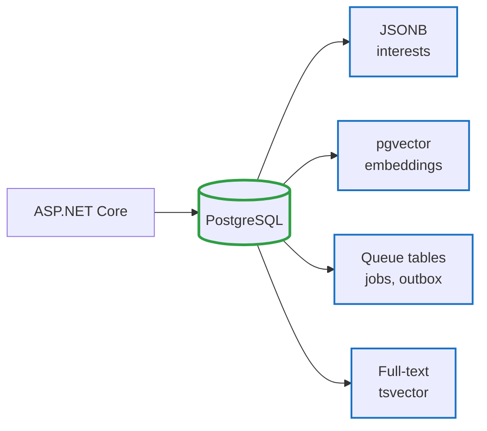
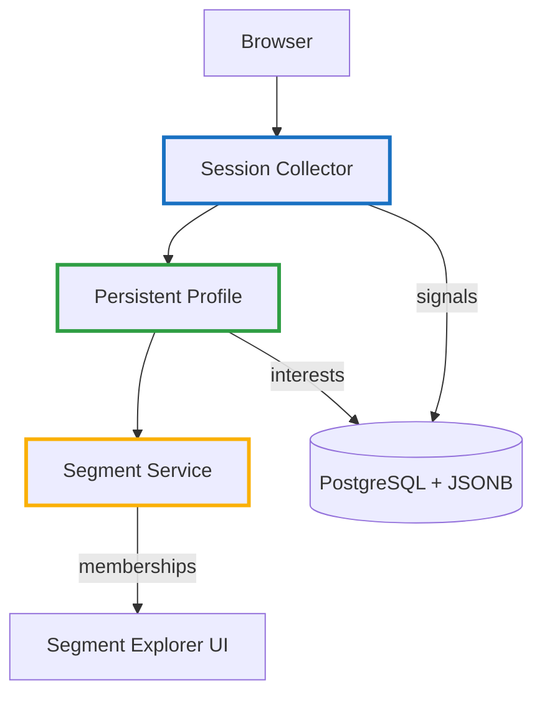
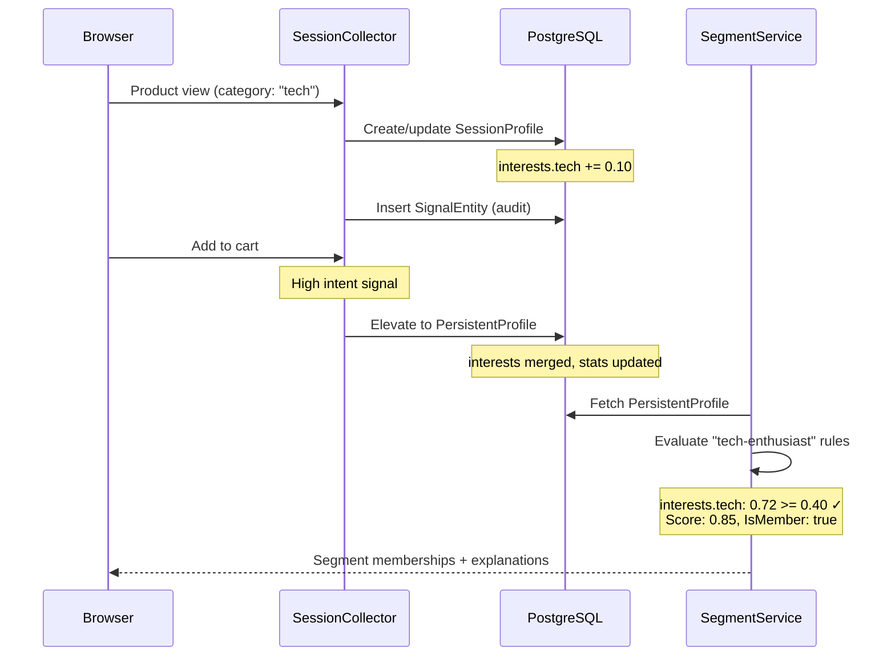

# Zero PII Customer Intelligence — Part 2: Sample Implementation

<!--category-- Product, Privacy, Segmentation, C# -->
<datetime class="hidden">2025-12-26T20:00</datetime>

In [Part 1](/blog/zero-pii-customer-intelligence-part1) we covered the architecture and principles. In [Part 1.1](/blog/zero-pii-customer-intelligence-part1-1) we built the sample data generator.

Now let's look at the **actual implementation**: how sessions track signals, how segments are computed, and how zero-PII profiles work in practice.

This is the **sample project** (`Mostlylucid.SegmentCommerce`)—a small ecommerce demo that shows the core patterns. It's intentionally simplified to demonstrate concepts clearly, but it also includes real infrastructure patterns (outbox-based message handling, background job processing, JSONB indexing) that you'd scale horizontally in production.

Think of this as "production patterns in a single-app form factor." The same code structure works whether you're running one process or distributing across services.

[TOC]

## Technology Choices

We chose a **simple, cohesive stack** to keep the sample clear while demonstrating production patterns.

### PostgreSQL + pgvector: One Database

Instead of separate vector databases, message queues, and caching layers, we use **PostgreSQL**:



- **JSONB** for flexible schemas (no separate NoSQL)
- **pgvector** for embeddings (no Qdrant/Pinecone)
- **LISTEN/NOTIFY** for jobs (no Redis/RabbitMQ)
- **tsvector** for full-text (no Elasticsearch)

One connection pool. One backup. One deployment.

### HTMX + Alpine.js: Server-Driven UI

```html
<!-- Instant search (no page reload) -->
<input 
    hx-get="/api/search" 
    hx-trigger="keyup changed delay:300ms" 
    hx-target="#results" />
```

- **HTMX**: Server renders partials (no JSON → templating)
- **Alpine.js**: Reactivity without a build step
- **Progressive enhancement**: Works without JS, better with it

SPA-like UX with server-rendering simplicity.

### ASP.NET Core: Distributable Patterns

Single app, but patterns scale:

- **Outbox** (DB events) → swap for message bus
- **Job queue** (LISTEN/NOTIFY) → swap for worker pool
- **Session collector** → swap for separate API

Start simple. Distribute when needed.

### What We Avoided

- No separate vector database (pgvector is colocated)
- No JS framework (HTMX + Alpine is simpler)
- No microservices yet (patterns work in monolith or distributed)
- No Docker Compose sprawl (one DB, one app)

## Architecture Overview

The system has three core layers:



1. **Session Collector** - Captures behavioral signals (views, clicks, cart adds)
2. **Persistent Profile** - Elevates high-value signals, computes interests
3. **Segment Service** - Evaluates profiles against rules, assigns memberships

## Session Profiles: Strict In-Memory (LFU Cache)

Sessions are **strictly in-memory**. They live in `IMemoryCache` with sliding expiration and **never touch the database**.

This is a hard architectural constraint: session data cannot persist. It collects signals during a visit and evicts after 30 minutes of inactivity via LFU (Least Frequently Used) cache policy under memory pressure.

### SessionProfile: The In-Memory Model

```csharp
// Mostlylucid.SegmentCommerce/Models/SessionProfile.cs
public class SessionProfile
{
    public string SessionKey { get; set; } = string.Empty;

    // Category interest scores: { "tech": 0.75, "fashion": 0.25 }
    public Dictionary<string, double> Interests { get; set; } = new();

    // Detailed signal counts: { "tech": { "product_view": 5, "add_to_cart": 1 } }
    public Dictionary<string, Dictionary<string, int>> Signals { get; set; } = new();

    // Products viewed this session
    public List<int> ViewedProducts { get; set; } = new();

    // Session context (device, referrer domain, time-of-day)
    public SessionContext? Context { get; set; }

    // Aggregates
    public double TotalWeight { get; set; }
    public int SignalCount { get; set; }
    public int PageViews { get; set; }
    public int ProductViews { get; set; }
    public int CartAdds { get; set; }

    // Timestamps
    public DateTime StartedAt { get; set; } = DateTime.UtcNow;
    public DateTime LastActivityAt { get; set; } = DateTime.UtcNow;

    // Link to persistent profile (if fingerprint resolved)
    public Guid? PersistentProfileId { get; set; }
}
```

### Stored in IMemoryCache (or IDistributedCache) with Sliding Expiration

```csharp
// Mostlylucid.SegmentCommerce/Services/Profiles/SessionCollector.cs
_cache.Set(sessionKey, sessionProfile, new MemoryCacheEntryOptions
{
    SlidingExpiration = TimeSpan.FromMinutes(30),
    Priority = CacheItemPriority.Normal, // LFU eviction under memory pressure
    
    // CRITICAL: Eviction callback decides whether to elevate to persistent profile
    PostEvictionCallbacks =
    {
        new PostEvictionCallbackRegistration
        {
            EvictionCallback = async (key, value, reason, state) =>
            {
                if (value is SessionProfile session && ShouldElevate(session))
                {
                    // Only NOW do we write to database (persistent profile)
                    await ElevateToProfileAsync(session);
                }
                // Otherwise: session is gone forever
            }
        }
    }
});
```

**Hard constraints:**
- **Zero accidental persistence**: Sessions live **only** in cache (IMemoryCache or IDistributedCache like Redis)
- **LFU eviction**: Low-use sessions evict first under memory pressure
- **Sliding expiration**: 30 minutes from last activity
- **Eviction callback**: Last chance to elevate high-value signals before they're lost
- **No recovery**: App restart = all sessions lost (unless using IDistributedCache, but still ephemeral)

### Elevation Decision (On Eviction)

```csharp
private bool ShouldElevate(SessionProfile session)
{
    // Elevate if:
    // - User added to cart (high intent)
    // - User completed purchase (conversion)
    // - Fingerprint was resolved (identity established)
    // - Session weight exceeds threshold (engaged visitor)
    
    return session.CartAdds > 0 
        || session.TotalWeight > 5.0 
        || session.PersistentProfileId.HasValue;
}
```

**Why eviction callback?**

This is the **only** safe point to decide persistence. By the time the cache evicts the session:
1. We know the full session history
2. We can evaluate total engagement
3. We avoid storing low-value sessions (single page view, bounce)
4. We guarantee sessions don't accidentally persist

If we don't elevate during eviction, the session is **gone forever**. This is the design.

### SessionContext: What We Track (Safely)

```csharp
public class SessionContext
{
    public string? DeviceType { get; set; }        // "mobile", "desktop"
    public string? EntryPath { get; set; }         // "/products/tech" (no query params)
    public string? ReferrerDomain { get; set; }    // "google.com" (domain only, not full URL)
    public string? TimeOfDay { get; set; }         // "morning", "afternoon"
    public string? DayType { get; set; }           // "weekday", "weekend"
}
```

Notice what's **not** here: IP addresses, user agents, full URLs, tracking pixels. We capture **context patterns**, not identifiable information.

## What Are Signals?

A **signal** is a behavioral fact captured during a user action. Instead of tracking "who," we track "what happened."

This concept comes from [ephemeral signals](/blog/ephemeral-signals)—short-lived facts that exist in a bounded window and age out naturally. In that system, operations emit signals like `"api.rate_limited"` or `"gateway.slow"` to coordinate behavior without tight coupling.

Here we apply the same pattern to user behavior:
- **Product view** → `product_view` signal (weight: 0.10)
- **Add to cart** → `add_to_cart` signal (weight: 0.35)  
- **Purchase** → `purchase` signal (weight: 1.00)

Signals are **ephemeral** (expire with the session), **zero-PII** (no identity), and **weighted** (intent-aware).

### Client Fingerprinting (Zero-Cookie Identification)

To link sessions without tracking cookies, we use **client-side fingerprinting**. The browser computes a hash from signals (timezone, screen resolution, WebGL renderer, canvas fingerprint) and sends **only the hash** to `/api/fingerprint`.

The server then **HMACs that hash** with a secret key, making it site-scoped and unusable elsewhere.

This code is adapted from my [bot detection project](/blog/botdetection-introduction), where it's used to identify scrapers. Same technique, different purpose.

```javascript
// Mostlylucid.SegmentCommerce/ClientFingerprint/fingerprint.js
// Collect signals (browser capabilities, not PII)
var signals = [
    Intl.DateTimeFormat().resolvedOptions().timeZone,
    navigator.language,
    screen.width + 'x' + screen.height,
    // ... (see full code)
];

// Hash locally
var hash = hash(signals.join('|'));

// Send only the hash via sendBeacon
navigator.sendBeacon('/api/fingerprint', JSON.stringify({ h: hash }));
```

**Server-side:**
```csharp
// Server HMACs the client hash with a secret key
var profileKey = HMACSHA256(clientHash + secretKey);
```

Now we have a stable, site-scoped identifier without cookies or localStorage. See the [full fingerprint.js source](https://github.com/scottgal/mostlylucidweb/blob/main/Mostlylucid.SegmentCommerce/ClientFingerprint/fingerprint.js) (adapted from mostlylucid.botdetection).

## Signal Types and Weights

Different actions have different intent levels. We model this with **base weights**.

### SignalTypes: The Weight Hierarchy

```csharp
// Mostlylucid.SegmentCommerce/Data/Entities/Profiles/SignalEntity.cs
public static class SignalTypes
{
    // Passive signals (low intent)
    public const string PageView = "page_view";              // 0.01
    public const string CategoryBrowse = "category_browse";  // 0.03
    public const string ProductImpression = "product_impression"; // 0.02

    // Active signals (medium intent)
    public const string ProductView = "product_view";        // 0.10
    public const string ProductClick = "product_click";      // 0.08
    public const string Search = "search";                   // 0.05

    // High-intent signals
    public const string AddToCart = "add_to_cart";           // 0.35
    public const string AddToWishlist = "add_to_wishlist";   // 0.25
    public const string ViewCart = "view_cart";              // 0.15
    public const string BeginCheckout = "begin_checkout";    // 0.40

    // Conversion signals (highest intent)
    public const string Purchase = "purchase";               // 1.00
    public const string Review = "review";                   // 0.60
    public const string Share = "share";                     // 0.50

    public static readonly Dictionary<string, double> BaseWeights = new()
    {
        { PageView, 0.01 },
        { ProductView, 0.10 },
        { AddToCart, 0.35 },
        { Purchase, 1.00 },
        // ... (see full code for complete list)
    };

    public static double GetBaseWeight(string signalType)
    {
        return BaseWeights.GetValueOrDefault(signalType, 0.05);
    }
}
```

**Why this matters:**
- A single page view (`0.01`) won't dominate the signal
- Adding to cart (`0.35`) is a strong intent signal
- Purchase (`1.00`) is the strongest signal

This hierarchy prevents "drive-by browsing" from polluting the profile.

## SessionCollector: Recording Signals (Cache-Only)

```csharp
// Mostlylucid.SegmentCommerce/Services/Profiles/SessionCollector.cs
public async Task<SessionProfile> RecordSignalAsync(
    SessionSignalInput input, CancellationToken ct = default)
{
    var sessionKey = input.SessionKey;
    
    // Get or create session FROM CACHE (never DB)
    var session = _cache.Get<SessionProfile>(sessionKey);
    
    if (session == null)
    {
        session = new SessionProfile
        {
            SessionKey = sessionKey,
            StartedAt = DateTime.UtcNow
        };
    }

    session.LastActivityAt = DateTime.UtcNow;

    var weight = input.Weight ?? SignalTypes.GetBaseWeight(input.SignalType);

    // Update in-memory aggregates
    session.TotalWeight += weight;
    session.SignalCount++;

    if (!string.IsNullOrEmpty(input.Category))
    {
        session.Interests.TryGetValue(input.Category, out var currentScore);
        session.Interests[input.Category] = currentScore + weight;
    }

    if (input.SignalType == SignalTypes.AddToCart)
    {
        session.CartAdds++;
    }

    // Put back in cache with sliding expiration
    _cache.Set(sessionKey, session, new MemoryCacheEntryOptions
    {
        SlidingExpiration = TimeSpan.FromMinutes(30),
        Priority = CacheItemPriority.Normal,
        PostEvictionCallbacks = { /* elevation callback */ }
    });

    return session;
}
```

**Fast because:**
- Pure in-memory (no DB writes)
- No serialization overhead (IMemoryCache)
- No network calls (local cache)

## Persistent Profiles: Elevated Signals

When a session shows high intent (cart adds, purchases), we elevate signals to a **persistent profile**.

### PersistentProfileEntity: The Long-Term Profile

```csharp
// Mostlylucid.SegmentCommerce/Data/Entities/Profiles/PersistentProfileEntity.cs
[Table("persistent_profiles")]
public class PersistentProfileEntity
{
    [Key]
    public Guid Id { get; set; } = Guid.NewGuid();

    [Required]
    [MaxLength(256)]
    public string ProfileKey { get; set; } = string.Empty;

    // How this profile is identified (Fingerprint, Cookie, Identity)
    public ProfileIdentificationMode IdentificationMode { get; set; }

    // Behavioral data (all JSONB)
    [Column("interests", TypeName = "jsonb")]
    public Dictionary<string, double> Interests { get; set; } = new();

    [Column("affinities", TypeName = "jsonb")]
    public Dictionary<string, double> Affinities { get; set; } = new();

    [Column("brand_affinities", TypeName = "jsonb")]
    public Dictionary<string, double> BrandAffinities { get; set; } = new();

    [Column("price_preferences", TypeName = "jsonb")]
    public PricePreferences? PricePreferences { get; set; }

    [Column("traits", TypeName = "jsonb")]
    public Dictionary<string, bool> Traits { get; set; } = new();

    // Computed segments
    public ProfileSegments Segments { get; set; } = ProfileSegments.None;

    [Column("llm_segments", TypeName = "jsonb")]
    public Dictionary<string, double>? LlmSegments { get; set; }

    // Vector embedding for similarity matching
    [Column("embedding", TypeName = "vector(384)")]
    public Vector? Embedding { get; set; }

    // Statistics
    public int TotalSessions { get; set; }
    public int TotalSignals { get; set; }
    public int TotalPurchases { get; set; }
    public int TotalCartAdds { get; set; }

    public DateTime CreatedAt { get; set; } = DateTime.UtcNow;
    public DateTime LastSeenAt { get; set; } = DateTime.UtcNow;
    public DateTime UpdatedAt { get; set; } = DateTime.UtcNow;
}
```

**Still zero PII**:
- `ProfileKey` is an HMAC hash (not reversible)
- `IdentificationMode` tells us how it was identified (fingerprint/cookie/login)
- All data is **behavioral signals**, not personal information

### Elevation: Session → Profile

```csharp
public async Task ElevateToProfileAsync(
    SessionProfileEntity session, 
    PersistentProfileEntity profile, 
    CancellationToken ct = default)
{
    if (session.IsElevated)
        return;

    // Merge interests (use higher value)
    foreach (var (category, score) in session.Interests)
    {
        if (!profile.Interests.ContainsKey(category) || 
            profile.Interests[category] < score)
        {
            profile.Interests[category] = score;
        }
    }

    // Update stats
    profile.TotalSessions++;
    profile.TotalSignals += session.SignalCount;
    profile.TotalCartAdds += session.CartAdds;
    profile.LastSeenAt = DateTime.UtcNow;
    profile.UpdatedAt = DateTime.UtcNow;

    // Mark session as elevated
    session.IsElevated = true;
    session.PersistentProfileId = profile.Id;

    // Clear segment cache (will be recomputed)
    profile.SegmentsComputedAt = null;
    profile.EmbeddingComputedAt = null;

    await _db.SaveChangesAsync(ct);
}
```

**When elevation happens:**
- After a cart add (high intent)
- After a purchase (conversion)
- When user opts into persistence (fingerprint/cookie/login)

## Segment Definitions: Fuzzy Membership

Segments are **not** boolean buckets. They're **fuzzy memberships** with confidence scores (0-1).

### SegmentDefinition: The Rule Structure

```csharp
// Mostlylucid.SegmentCommerce/Services/Segments/SegmentDefinition.cs
public class SegmentDefinition
{
    public string Id { get; set; } = Guid.NewGuid().ToString("N")[..8];
    public string Name { get; set; } = string.Empty;
    public string Description { get; set; } = string.Empty;
    public string Icon { get; set; } = "👤";
    public string Color { get; set; } = "#6366f1";

    // Rules that determine membership
    public List<SegmentRule> Rules { get; set; } = [];

    // How rules combine: All (AND), Any (OR), Weighted (sum)
    public RuleCombination Combination { get; set; } = RuleCombination.Weighted;

    // Minimum score to be "a member" (0-1)
    public double MembershipThreshold { get; set; } = 0.3;

    public List<string> Tags { get; set; } = [];
}

public class SegmentRule
{
    public RuleType Type { get; set; }
    public string Field { get; set; } = string.Empty;
    public RuleOperator Operator { get; set; }
    public object? Value { get; set; }
    public double Weight { get; set; } = 1.0;
    public string? Description { get; set; }
}
```

### Example Segment: Tech Enthusiasts

```csharp
_segments.Add(new SegmentDefinition
{
    Id = "tech-enthusiast",
    Name = "Tech Enthusiasts",
    Description = "Users with strong interest in technology products",
    Icon = "🔧",
    Color = "#3b82f6",
    MembershipThreshold = 0.35,
    Rules =
    [
        new() 
        { 
            Type = RuleType.CategoryInterest, 
            Field = "interests.tech", 
            Operator = RuleOperator.GreaterOrEqual, 
            Value = 0.4, 
            Weight = 0.6, 
            Description = "Tech interest > 40%" 
        },
        new() 
        { 
            Type = RuleType.TagAffinity, 
            Field = "affinities.gadgets", 
            Operator = RuleOperator.GreaterOrEqual, 
            Value = 0.2, 
            Weight = 0.2, 
            Description = "Likes gadgets" 
        }
    ],
    Tags = ["category", "tech"]
});
```

**What this means:**
- You need `interests.tech >= 0.4` (60% weight)
- Plus `affinities.gadgets >= 0.2` (20% weight)
- Combined weighted score must be `>= 0.35` to be a member

## SegmentService: Computing Memberships

The `SegmentService` evaluates profiles against segment rules.

```csharp
// Mostlylucid.SegmentCommerce/Services/Segments/SegmentService.cs
public class SegmentService : ISegmentService
{
    private readonly List<SegmentDefinition> _segments = [];

    public List<SegmentMembership> ComputeMemberships(ProfileData profile)
    {
        var memberships = new List<SegmentMembership>();

        foreach (var segment in _segments)
        {
            var membership = EvaluateSegment(profile, segment);
            memberships.Add(membership);
        }

        return memberships.OrderByDescending(m => m.Score).ToList();
    }

    public SegmentMembership EvaluateSegment(
        ProfileData profile, 
        SegmentDefinition segment)
    {
        var ruleScores = new List<RuleScore>();
        
        foreach (var rule in segment.Rules)
        {
            var (score, actualValue) = EvaluateRule(profile, rule);
            ruleScores.Add(new RuleScore
            {
                RuleDescription = rule.Description ?? 
                    $"{rule.Field} {rule.Operator} {rule.Value}",
                Score = score,
                Weight = rule.Weight,
                ActualValue = actualValue
            });
        }

        // Combine rule scores based on combination method
        double finalScore = segment.Combination switch
        {
            RuleCombination.All => 
                ruleScores.Count > 0 ? ruleScores.Min(r => r.Score) : 0,
            RuleCombination.Any => 
                ruleScores.Count > 0 ? ruleScores.Max(r => r.Score) : 0,
            RuleCombination.Weighted => 
                ComputeWeightedScore(ruleScores),
            _ => 0
        };

        return new SegmentMembership
        {
            SegmentId = segment.Id,
            SegmentName = segment.Name,
            Score = Math.Round(finalScore, 3),
            IsMember = finalScore >= segment.MembershipThreshold,
            RuleScores = ruleScores
        };
    }

    private double ComputeWeightedScore(List<RuleScore> ruleScores)
    {
        if (ruleScores.Count == 0) return 0;
        
        var totalWeight = ruleScores.Sum(r => r.Weight);
        if (totalWeight <= 0) return 0;
        
        return ruleScores.Sum(r => r.Score * r.Weight) / totalWeight;
    }
}
```

**What's happening:**
1. Evaluate each rule against the profile
2. Get a score (0-1) and actual value for transparency
3. Combine scores using the segment's combination method
4. Return membership with detailed rule scores (for "show me why")

### Rule Evaluation: Category Interest Example

```csharp
private (double, string?) EvaluateCategoryInterest(
    ProfileData profile, 
    SegmentRule rule)
{
    var category = rule.Field.Replace("interests.", "");
    if (!profile.Interests.TryGetValue(category, out var interest))
        return (0, "0");

    var threshold = Convert.ToDouble(rule.Value ?? 0.5);
    var score = rule.Operator switch
    {
        RuleOperator.GreaterThan => 
            interest > threshold ? 
                Math.Min(1, interest / threshold) : 
                interest / threshold * 0.5,
        RuleOperator.GreaterOrEqual => 
            interest >= threshold ? 
                Math.Min(1, interest / threshold) : 
                interest / threshold * 0.5,
        _ => interest >= threshold ? 1 : interest / threshold
    };

    return (Math.Max(0, Math.Min(1, score)), interest.ToString("F2"));
}
```

**Why return actual value?**

This is for **explainability**. When we show "Tech Enthusiast: 85% match", we can also show:
- "Tech interest: 0.72 (threshold: 0.40)" ✓
- "Gadget affinity: 0.31 (threshold: 0.20)" ✓

Users can **see exactly why** they're in a segment.

## Signal Flow: End-to-End

Here's how a product view becomes a segment membership:



## Default Segments (Sample)

The sample project ships with 10 default segments to demonstrate the patterns:

1. **High-Value Customers** 💎 - 3+ purchases, high spend, recently active
2. **Tech Enthusiasts** 🔧 - Strong tech interest, likes gadgets/electronics
3. **Fashion Forward** 👗 - Fashion interest, multiple visits
4. **Bargain Hunters** 🏷️ - Low price preference, deal-focused
5. **New Visitors** 👋 - Few sessions, no purchases yet
6. **Cart Abandoners** 🛒 - Multiple cart adds, few purchases
7. **Home & Living Enthusiasts** 🏠 - Home interest, recently active
8. **Fitness & Sports Active** 🏃 - Sport interest, health-conscious
9. **Loyal Customers** ⭐ - 5+ purchases, 10+ sessions
10. **Researchers** 🔍 - High engagement, browses extensively

Each segment has:
- **Icon + color** for visualization
- **Weighted rules** for fuzzy scoring
- **Threshold** for membership (typically 0.3-0.5)
- **Tags** for categorization

## What This Enables

With this architecture you can:

1. **Track sessions** without persistent cookies or tracking
2. **Elevate signals** when users show high intent
3. **Compute segments** with fuzzy memberships (not binary buckets)
4. **Explain memberships** with detailed rule scores
5. **Zero PII** throughout (no names, emails, identifiers)

## Hybrid RAG Search (Semantic + Full-Text)

The sample includes a production-quality search combining **vector embeddings** (semantic) with **PostgreSQL full-text search** (keyword matching).

```csharp
// Mostlylucid.SegmentCommerce/Services/Search/SearchService.cs
public async Task<SearchResults> SearchAsync(SearchRequest request, CancellationToken ct)
{
    var query = request.Query.Trim();
    var results = new List<SearchResultItem>();
    
    // Run both searches in parallel when semantic is enabled
    Task<List<SearchResultItem>>? semanticTask = null;
    if (request.EnableSemantic && IsEmbeddingServiceAvailable())
    {
        semanticTask = PerformSemanticSearchAsync(query, request.Limit * 2, ct);
    }
    
    // Full-text search (always enabled as fallback)
    var ftsResults = await PerformFullTextSearchAsync(query, request, ct);
    results.AddRange(ftsResults);

    // Merge semantic results if available
    if (semanticTask != null)
    {
        var semanticResults = await semanticTask;
        results = MergeResults(results, semanticResults, request.Limit);
    }

    return results.OrderByDescending(r => r.Score).ToList();
}
```

### Why Hybrid?

**Full-text search (FTS)** is great for exact matches ("Nike Air Max"), product codes, and brand names.

**Semantic search** understands intent: "comfortable running shoes" finds relevant products even if they don't contain those exact words.

**Hybrid** combines both and boosts items found by both methods:

```csharp
private List<SearchResultItem> MergeResults(
    List<SearchResultItem> ftsResults, 
    List<SearchResultItem> semanticResults, 
    int limit)
{
    var merged = new Dictionary<int, SearchResultItem>();

    // Add FTS results
    foreach (var item in ftsResults)
    {
        merged[item.ProductId] = item;
    }

    // Merge/boost semantic results
    foreach (var item in semanticResults)
    {
        if (merged.TryGetValue(item.ProductId, out var existing))
        {
            // Found in both - boost score significantly
            existing.Score = Math.Max(existing.Score, item.Score) * 1.5f;
            existing.SearchType = "hybrid";
        }
        else
        {
            merged[item.ProductId] = item;
        }
    }

    return merged.Values.OrderByDescending(r => r.Score).ToList();
}
```

**Result types:**
- `"fts"` - Found via keyword matching only
- `"semantic"` - Found via embedding similarity only  
- `"hybrid"` - Found via both (1.5x score boost)

This is the same pattern used in production RAG systems, just applied to product search instead of document retrieval.

## Infrastructure Patterns (Worth Noting)

While the focus is segmentation, this sample also demonstrates production-ready infrastructure patterns in a single app:

### Outbox Pattern for Reliable Events

```csharp
// Mostlylucid.SegmentCommerce/Services/Queue/PostgresOutbox.cs
// Events are written to the DB in the same transaction, then published async
public async Task PublishAsync<T>(T domainEvent, CancellationToken ct = default) 
    where T : class
{
    var outboxMessage = new OutboxMessage
    {
        EventType = typeof(T).Name,
        Payload = JsonSerializer.Serialize(domainEvent),
        CreatedAt = DateTime.UtcNow
    };
    
    _db.OutboxMessages.Add(outboxMessage);
    await _db.SaveChangesAsync(ct);
    // Background worker publishes from outbox table
}
```

This prevents "event lost" scenarios and makes the system **distributable** (swap the background worker for a message bus consumer).

### Background Job Queue

```csharp
// Mostlylucid.SegmentCommerce/Services/Queue/PostgresJobQueue.cs
// LISTEN/NOTIFY for near-instant job pickup
await _db.Database.ExecuteSqlRawAsync("LISTEN job_queue_notify");
```

PostgreSQL `LISTEN/NOTIFY` triggers job processing instantly (no polling). Same code works in-process or as a separate worker pool.

### JSONB Indexing for Fast Queries

```csharp
// Interests stored as JSONB with GIN index
[Column("interests", TypeName = "jsonb")]
public Dictionary<string, double> Interests { get; set; } = new();

// Query like this:
var techProfiles = await _db.PersistentProfiles
    .Where(p => EF.Functions.JsonContains(p.Interests, "{\"tech\": 0.5}"))
    .ToListAsync();
```

JSONB gives schema flexibility without sacrificing query performance.

These patterns let you start simple (one app, one database) and scale horizontally when needed (workers, shards, message buses)—**without rewriting the core logic**.

**Next:** [Part 3 - UI & Transparency] where we build the "Your Interests" dashboard and segment explorer.

---

*This is a sample ecommerce site showing the segmentation patterns. The infrastructure (outbox, job queue, JSONB) is production-ready and easily distributed, but kept in a single app here for clarity.*
