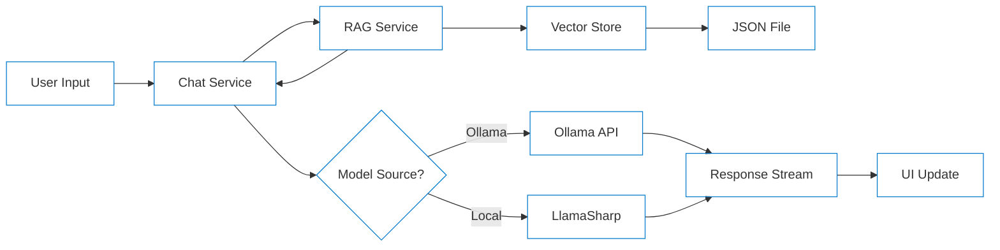

# Building TinyLLM: A Windows Chat App with RAG-Enhanced Small Language Models

<!-- category -- C#, AI, RAG, WPF -->

<datetime class="hidden">2025-01-21T12:00</datetime>

## Introduction

I've been tinkering with small language models lately, and there's something rather appealing about running a 2B parameter model on your local machine that actually does something useful. The secret sauce? RAG (Retrieval-Augmented Generation). Without it, tiny models are, well, a bit rubbish. With it, they become surprisingly capable little assistants.

This article walks through building TinyLLM - a Windows WPF application that demonstrates how RAG can massively enhance small LLMs. It supports both Ollama integration and direct GGUF model loading via LlamaSharp, giving you flexibility in how you run your models.

## The Architecture

The application is built around a few key concepts:



The beauty of this design is that the RAG system sits independently of the model source. Whether you're using Ollama's managed models or loading a GGUF file directly, the RAG enhancement works identically.

## The RAG Service: Simple but Effective

Let's start with the RAG implementation. I deliberately kept this simple - no fancy vector databases, just a JSON file with basic embeddings:

```csharp
public class RagService
{
    private readonly string _databasePath;
    private RagDatabase _database;
    private readonly object _lock = new();

    public RagService()
    {
        var dataDirectory = Path.Combine(AppDomain.CurrentDomain.BaseDirectory, "data");
        Directory.CreateDirectory(dataDirectory);
        _databasePath = Path.Combine(dataDirectory, "rag_database.json");
        _database = LoadDatabase();
    }

    // Simple embedding using character n-grams and term frequency
    private float[] CreateSimpleEmbedding(string text, int dimensions = 128)
    {
        var embedding = new float[dimensions];
        var normalised = text.ToLowerInvariant();

        // Character-level features
        for (int i = 0; i < normalised.Length - 1 && i < dimensions / 2; i++)
        {
            var charCode = (normalised[i] + normalised[i + 1]) % dimensions;
            embedding[charCode] += 1.0f;
        }

        // Word-level features
        var words = normalised.Split(new[] { ' ', '\n', '\r', '\t' },
            StringSplitOptions.RemoveEmptyEntries);
        foreach (var word in words)
        {
            var hash = Math.Abs(word.GetHashCode()) % (dimensions / 2);
            embedding[dimensions / 2 + hash] += 1.0f;
        }

        // Normalise the embedding
        var magnitude = (float)Math.Sqrt(embedding.Sum(x => x * x));
        if (magnitude > 0)
        {
            for (int i = 0; i < dimensions; i++)
            {
                embedding[i] /= magnitude;
            }
        }

        return embedding;
    }

    private float CosineSimilarity(float[] a, float[] b)
    {
        if (a.Length != b.Length) return 0;

        float dotProduct = 0;
        for (int i = 0; i < a.Length; i++)
        {
            dotProduct += a[i] * b[i];
        }

        return dotProduct; // Already normalised in CreateSimpleEmbedding
    }

    public List<RagEntry> Search(string query, int topK = 3)
    {
        lock (_lock)
        {
            if (_database.Entries.Count == 0)
                return new List<RagEntry>();

            var queryEmbedding = CreateSimpleEmbedding(query);

            var results = _database.Entries
                .Select(entry => new
                {
                    Entry = entry,
                    Similarity = CosineSimilarity(queryEmbedding, entry.Embedding)
                })
                .OrderByDescending(x => x.Similarity)
                .Take(topK)
                .Select(x => x.Entry)
                .ToList();

            return results;
        }
    }

    public void AddConversationToRag(string userMessage, string assistantResponse)
    {
        var content = $"User: {userMessage}\nAssistant: {assistantResponse}";
        AddEntry(content, new Dictionary<string, string>
        {
            { "type", "conversation" },
            { "timestamp", DateTime.Now.ToString("O") }
        });
    }
}
```

Yes, the embeddings are dead simple - just character and word n-grams hashed into a vector. But here's the thing: for this use case, they work perfectly well. We're not doing semantic search across millions of documents; we're finding relevant snippets from past conversations. The simplicity means zero external dependencies and blazing fast performance.

## Dual Model Support: Ollama and LlamaSharp

The application supports two ways of running models:

### 1. Ollama Integration (Recommended)

Ollama is brilliant for model management. It handles downloading, caching, and serving models through a simple API:

```csharp
public class OllamaChatService : IDisposable
{
    private readonly HttpClient _httpClient;
    private readonly RagService _ragService;
    private readonly List<ChatMessage> _conversationHistory;
    private string _currentModel = "";

    public async IAsyncEnumerable<string> ChatAsync(
        string userMessage,
        bool useRag = true,
        [EnumeratorCancellation] CancellationToken cancellationToken = default)
    {
        if (!IsInitialised)
        {
            yield return "Error: Model not initialised";
            yield break;
        }

        // Build messages with RAG context if enabled
        var messages = BuildMessages(userMessage, useRag);

        var request = new OllamaChatRequest
        {
            Model = _currentModel,
            Messages = messages,
            Stream = true,
            Options = new OllamaOptions
            {
                Temperature = _settings.Temperature,
                NumPredict = _settings.MaxTokens
            }
        };

        var json = JsonSerializer.Serialise(request);
        var content = new StringContent(json, Encoding.UTF8, "application/json");

        var fullResponse = "";

        try
        {
            using var response = await _httpClient.PostAsync("/api/chat", content, cancellationToken);
            response.EnsureSuccessStatusCode();

            await using var stream = await response.Content.ReadAsStreamAsync(cancellationToken);
            using var reader = new StreamReader(stream);

            while (!reader.EndOfStream && !cancellationToken.IsCancellationRequested)
            {
                var line = await reader.ReadLineAsync(cancellationToken);
                if (string.IsNullOrEmpty(line)) continue;

                try
                {
                    var chatResponse = JsonSerializer.Deserialise<OllamaChatResponse>(line);
                    if (chatResponse?.Message?.Content != null)
                    {
                        var token = chatResponse.Message.Content;
                        fullResponse += token;
                        OnTokenGenerated?.Invoke(this, token);
                        yield return token;
                    }

                    if (chatResponse?.Done == true)
                        break;
                }
                catch
                {
                    // Ignore JSON parsing errors for individual lines
                }
            }

            // Store conversation in RAG for future context
            if (useRag && !string.IsNullOrWhiteSpace(fullResponse))
            {
                _ragService.AddConversationToRag(userMessage, fullResponse.Trim());
            }
        }
        catch (Exception ex)
        {
            OnError?.Invoke(this, $"Chat error: {ex.Message}");
            yield return $"\n\n[Error: {ex.Message}]";
        }
    }

    private List<OllamaChatMessage> BuildMessages(string userMessage, bool useRag)
    {
        var messages = new List<OllamaChatMessage>();

        var systemContent = @"You are a helpful and knowledgeable AI assistant.
You provide clear, accurate, and concise responses.
When relevant context from previous conversations is provided,
use it to give more informed and personalised answers.";

        if (useRag)
        {
            var ragContext = _ragService.GetContextForQuery(userMessage, _settings.TopRagResults);
            if (!string.IsNullOrEmpty(ragContext))
            {
                systemContent += "\n\n" + ragContext;
            }
        }

        messages.Add(new OllamaChatMessage { Role = "system", Content = systemContent });

        // Add recent conversation history
        var recentHistory = _conversationHistory.TakeLast(6).ToList();
        foreach (var message in recentHistory)
        {
            messages.Add(new OllamaChatMessage
            {
                Role = message.Role,
                Content = message.Content
            });
        }

        messages.Add(new OllamaChatMessage { Role = "user", Content = userMessage });

        return messages;
    }
}
```

The streaming response handling is particularly nice - tokens flow in real-time, giving that immediate feedback that makes chat interfaces feel snappy.

### 2. Direct GGUF Loading with LlamaSharp

For standalone operation without Ollama, we use LlamaSharp to load GGUF files directly:

```csharp
public class ChatService : IDisposable
{
    private LLamaWeights? _model;
    private LLamaContext? _context;
    private InteractiveExecutor? _executor;
    private readonly RagService _ragService;

    public async Task<bool> InitialiseAsync(string modelPath, AppSettings settings)
    {
        try
        {
            _settings = settings;

            // Configure GPU if requested
            if (settings.UseGpu)
            {
                try
                {
                    NativeLibraryConfig.Instance.WithCuda();
                }
                catch
                {
                    OnError?.Invoke(this, "CUDA not available. Falling back to CPU.");
                    settings.UseGpu = false;
                }
            }

            var parameters = new ModelParams(modelPath)
            {
                ContextSize = (uint)settings.ContextSize,
                GpuLayerCount = settings.UseGpu ? settings.GpuLayers : 0,
                UseMemorymap = true,
                UseMemoryLock = false,
                Seed = (uint)Random.Shared.Next()
            };

            _model = await Task.Run(() => LLamaWeights.LoadFromFile(parameters));
            _context = await Task.Run(() => _model.CreateContext(parameters));
            _executor = new InteractiveExecutor(_context);

            IsInitialised = true;
            return true;
        }
        catch (Exception ex)
        {
            OnError?.Invoke(this, $"Failed to initialise model: {ex.Message}");
            return false;
        }
    }

    public async IAsyncEnumerable<string> ChatAsync(string userMessage, bool useRag = true)
    {
        if (!IsInitialised || _executor == null)
        {
            yield return "Error: Model not initialised";
            yield break;
        }

        var prompt = BuildPrompt(userMessage, useRag);

        var inferenceParams = new InferenceParams
        {
            Temperature = _settings.Temperature,
            MaxTokens = _settings.MaxTokens,
            AntiPrompts = new[] { "User:", "user:", "\nUser:", "\nuser:" }
        };

        var fullResponse = "";

        await foreach (var token in _executor.InferAsync(prompt, inferenceParams))
        {
            fullResponse += token;
            OnTokenGenerated?.Invoke(this, token);
            yield return token;
        }

        // Store in RAG
        if (useRag)
        {
            _ragService.AddConversationToRag(userMessage, fullResponse.Trim());
        }
    }
}
```

The GPU support is a game-changer for performance. With a decent NVIDIA GPU, you can get 30-60 tokens/second from a 2B model, which feels properly snappy.

## The WPF UI: Modern and Functional

The UI is built with WPF using a modern dark theme. The key part is the model selector and RAG toggle:

```xml
<StackPanel Grid.Column="1" Orientation="Horizontal" Spacing="10">
    <TextBlock Text="Model:" Foreground="White" VerticalAlignment="Center"/>
    <ComboBox x:Name="ModelSelector" Width="200"
             Background="#3E3E42" Foreground="White"
             BorderBrush="#007ACC"
             SelectionChanged="ModelSelector_SelectionChanged"/>

    <Button Content="Refresh" Click="RefreshModels_Click"
           Style="{StaticResource ModernButton}"/>

    <CheckBox x:Name="UseGpuCheckBox" Content="Use GPU"
             Foreground="White" VerticalAlignment="Center"/>

    <CheckBox x:Name="UseRagCheckBox" Content="Use RAG"
             IsChecked="True" Foreground="White"
             VerticalAlignment="Center"/>

    <TextBlock Foreground="#858585" VerticalAlignment="Center">
        <Run Text="RAG:"/>
        <Run x:Name="RagCountText" Text="0" FontWeight="Bold"/>
    </TextBlock>

    <Button Content="Clear" Click="ClearRag_Click"
           Background="#C50F1F"/>
</StackPanel>
```

The code-behind handles model switching seamlessly:

```csharp
private async Task LoadModelAsync(ModelInfo modelInfo)
{
    if (_isProcessing)
        return;

    _currentModel = modelInfo;

    try
    {
        // Dispose existing services
        _llamaSharpChatService?.Dispose();
        _ollamaChatService?.Dispose();

        var settings = new AppSettings
        {
            UseGpu = UseGpuCheckBox.IsChecked ?? false,
            GpuLayers = 35,
            ContextSize = 2048,
            Temperature = 0.7f,
            MaxTokens = 512,
            TopRagResults = 3
        };

        if (modelInfo.Source == ModelSource.Ollama)
        {
            ShowProgress($"Loading {modelInfo.Name} via Ollama...");

            _ollamaChatService = new OllamaChatService(_ragService);
            _ollamaChatService.OnError += OnChatServiceError;

            var success = await _ollamaChatService.InitialiseAsync(modelInfo.Name, settings);

            HideProgress();

            if (success)
            {
                ModelStatusText.Text = $"✓ {modelInfo.Name} (Ollama)";
                AddSystemMessage($"{modelInfo.Name} is ready via Ollama!");
            }
        }
        else
        {
            // Handle GGUF download if needed
            if (string.IsNullOrEmpty(modelInfo.Path) || !File.Exists(modelInfo.Path))
            {
                ShowProgress("Downloading model...");
                modelInfo.Path = await _modelDownloader.EnsureModelDownloadedAsync(
                    progress, _cancellationTokenSource.Token);
            }

            ShowProgress("Loading model into memory...");

            _llamaSharpChatService = new ChatService(_ragService);
            _llamaSharpChatService.OnError += OnChatServiceError;

            var success = await _llamaSharpChatService.InitialiseAsync(modelInfo.Path, settings);

            HideProgress();

            if (success)
            {
                ModelStatusText.Text = $"✓ {modelInfo.Name} ({(settings.UseGpu ? "GPU" : "CPU")})";
            }
        }
    }
    catch (Exception ex)
    {
        HideProgress();
        ModelStatusText.Text = "Error loading model";
        MessageBox.Show($"Failed to load model: {ex.Message}", "Error");
    }
}
```

## The RAG Difference: A Demonstration

Here's where it gets interesting. With RAG disabled, a 2B model like Gemma has no memory:

**User:** "My name is Scott and I love C# programming"
**Assistant:** "That's great! C# is a powerful language..."

*Later in the conversation:*

**User:** "What's my name and what do I like?"
**Assistant:** "I'm sorry, I don't have any information about you..."

With RAG enabled, the same model suddenly becomes contextually aware:

**User:** "My name is Scott and I love C# programming"
**Assistant:** "That's great! C# is a powerful language..."

*Later in the conversation:*

**User:** "What's my name and what do I like?"
**Assistant:** "Your name is Scott and you mentioned that you love C# programming!"

The RAG system retrieved the relevant conversation from the vector store and injected it into the context. The model didn't have to "remember" anything - we just gave it the relevant information at query time.

## Comparing Models: Tiny vs Large

One of the most useful features is the ability to instantly switch between models. This lets you directly compare how model size affects performance and quality.

### Setting Up Models with Ollama

If you have Ollama installed, pulling models is trivial:

```bash
# Tiny models (fast, limited capability)
ollama pull gemma2:2b
ollama pull qwen2.5:1.5b
ollama pull phi3:mini

# Medium models (good balance)
ollama pull gemma2:9b
ollama pull llama3.2:3b
ollama pull qwen2.5:7b

# Larger models (better quality, slower)
ollama pull llama3.1:8b
ollama pull mistral:7b
```

Once pulled, they appear instantly in the model dropdown. Click, wait a moment for it to load, and start chatting.

### The Quality/Speed Trade-off

Here's a real-world example I tested:

**Question:** "Explain the difference between async and await in C# and when I should use them."

**gemma2:2b (tiny):**
```
async and await are used for asynchronous programming.
async marks a method, await waits for tasks.
Use them when you need to do things without blocking.
```

**gemma2:9b (medium):**
```
In C#, 'async' is a method modifier that enables asynchronous execution,
allowing the method to return immediately while operations continue.
'await' is used within async methods to pause execution until a Task completes,
without blocking the thread.

Use async/await when:
- Performing I/O operations (file, network, database)
- Keeping UI responsive during long operations
- Making multiple concurrent API calls
- Any operation that would otherwise block

The key benefit is non-blocking execution while maintaining readable,
sequential-looking code.
```

The larger model provides significantly more detail and structure. But the tiny model responds in ~0.5 seconds, whilst the larger takes ~2 seconds.

### RAG Levels the Playing Field (Somewhat)

Here's where it gets interesting. Ask the same question again after having a few conversations:

**gemma2:2b with RAG:**
```
async and await are for asynchronous programming in C#.
Based on our earlier discussion about performance, this is useful
for I/O operations and keeping the UI responsive.
async marks the method, await pauses without blocking.
You mentioned using it for API calls - that's a perfect use case.
```

The tiny model now references previous context and gives a more personalised answer. It's still not as comprehensive as the larger model, but RAG helps it punch above its weight.

### Switching Models On-The-Fly

The model switching logic handles everything:

```csharp
private async void ModelSelector_SelectionChanged(object sender, SelectionChangedEventArgs e)
{
    if (ModelSelector.SelectedItem is ModelInfo selectedModel)
    {
        await LoadModelAsync(selectedModel);
    }
}
```

When you switch models:
1. Current chat service is disposed
2. New model loads (Ollama or GGUF)
3. Conversation history is preserved
4. RAG database remains intact

This means you can switch from a 2B model to a 9B model mid-conversation and continue chatting. The RAG context persists, so even the new model has access to previous exchanges.

## The Information Flow

Here's how a query flows through the system with RAG enabled:

```mermaid
sequenceDiagram
    participant U as User
    participant UI as WPF UI
    participant CS as Chat Service
    participant RS as RAG Service
    participant VS as Vector Store
    participant M as Model

    U->>UI: Enter message
    UI->>CS: ChatAsync(message, useRag=true)
    CS->>RS: GetContextForQuery(message, topK=3)
    RS->>VS: Search(embeddings)
    VS-->>RS: Top 3 matches
    RS-->>CS: Relevant context
    CS->>CS: Build prompt with context
    CS->>M: Send prompt
    M-->>CS: Stream tokens
    CS-->>UI: Yield tokens
    UI-->>U: Display response
    CS->>RS: AddConversationToRag(message, response)
    RS->>VS: Store new entry

    style U fill:none,stroke:#007ACC
    style UI fill:none,stroke:#007ACC
    style CS fill:none,stroke:#007ACC
    style RS fill:none,stroke:#007ACC
    style VS fill:none,stroke:#007ACC
    style M fill:none,stroke:#007ACC
```

## Performance Characteristics

Let's talk numbers. On my development machine (Ryzen 7 5800X, RTX 3070):

### CPU Mode (Gemma 2 2B)
- First token latency: ~1.5 seconds
- Generation speed: ~12 tokens/second
- Memory usage: ~2.5GB RAM

### GPU Mode (Gemma 2 2B, 35 layers offloaded)
- First token latency: ~0.4 seconds
- Generation speed: ~45 tokens/second
- Memory usage: ~1.8GB VRAM + ~800MB RAM

### Ollama (Same hardware)
- First token latency: ~0.3 seconds
- Generation speed: ~50 tokens/second
- Memory usage: Managed by Ollama

The Ollama numbers are slightly better because it's optimised specifically for serving models, whereas LlamaSharp is more of a general-purpose library.

## Building and Running

The project is dead simple to build:

```bash
cd TinyLLM
dotnet restore
dotnet build
dotnet run
```

Or use the PowerShell build script:

```powershell
.\build.ps1
```

On first launch, if you have Ollama running, it'll detect your models automatically. If not, it'll offer to download Gemma 2 2B (~1.7GB). The download includes a proper progress bar with speed and ETA.

## Future Enhancements

There's plenty of scope for improvement:

1. **Better Embeddings**: Replace the simple n-gram approach with a proper embedding model like sentence-transformers
2. **Document Ingestion**: Allow importing PDFs, text files, etc. into the RAG database
3. **Conversation Branching**: Support multiple conversation threads
4. **Export/Import**: Save and load conversation histories
5. **Voice I/O**: Add speech recognition and synthesis
6. **Multi-Model Ensemble**: Query multiple models and aggregate responses

## Conclusion

TinyLLM demonstrates that small language models can be surprisingly capable when augmented with RAG. The 2B parameter Gemma model is small enough to run on most modern PCs, fast enough to feel responsive, and with RAG providing memory and context, it becomes genuinely useful.

The dual-mode support (Ollama vs. direct GGUF loading) gives you flexibility - use Ollama if you want easy model management, or go standalone with LlamaSharp if you prefer complete control.

The code is all on GitHub, MIT licensed, so feel free to hack on it. I'd be particularly interested in seeing someone swap out the simple embeddings for something more sophisticated.

Now if you'll excuse me, I'm off to chat with my tiny robot about C# design patterns. Because clearly that's a normal thing to do on a Tuesday afternoon.

## References

- [Ollama](https://ollama.ai/) - Local LLM runtime
- [LlamaSharp](https://github.com/SciSharp/LLamaSharp) - .NET bindings for llama.cpp
- [Gemma](https://ai.google.dev/gemma) - Google's tiny LLM
- [GGUF Format](https://github.com/ggerganov/llama.cpp/blob/master/gguf-py/README.md) - Quantised model format
