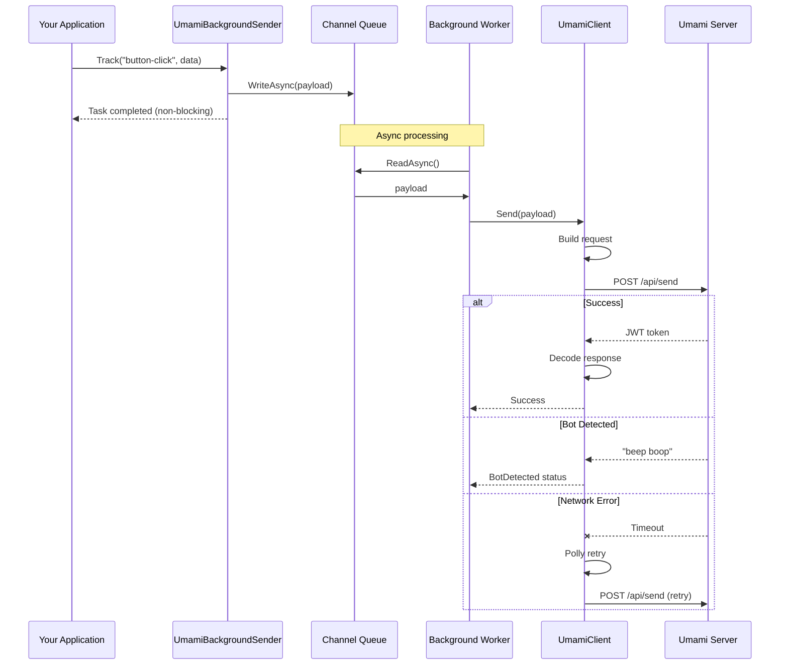
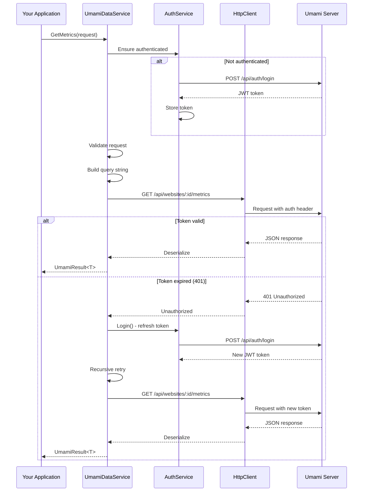
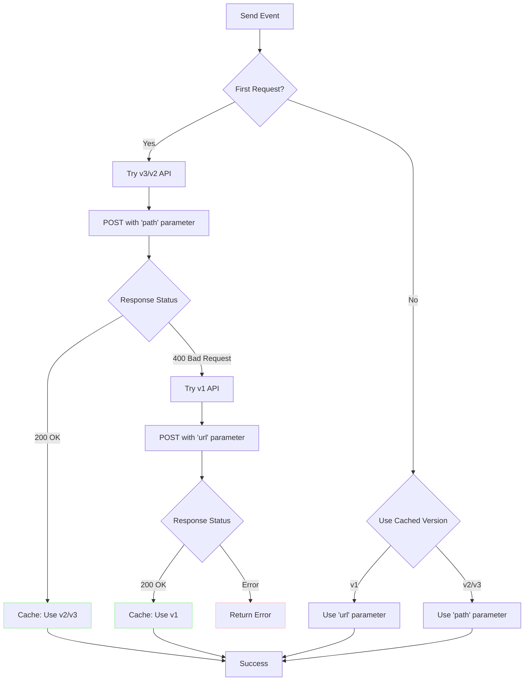
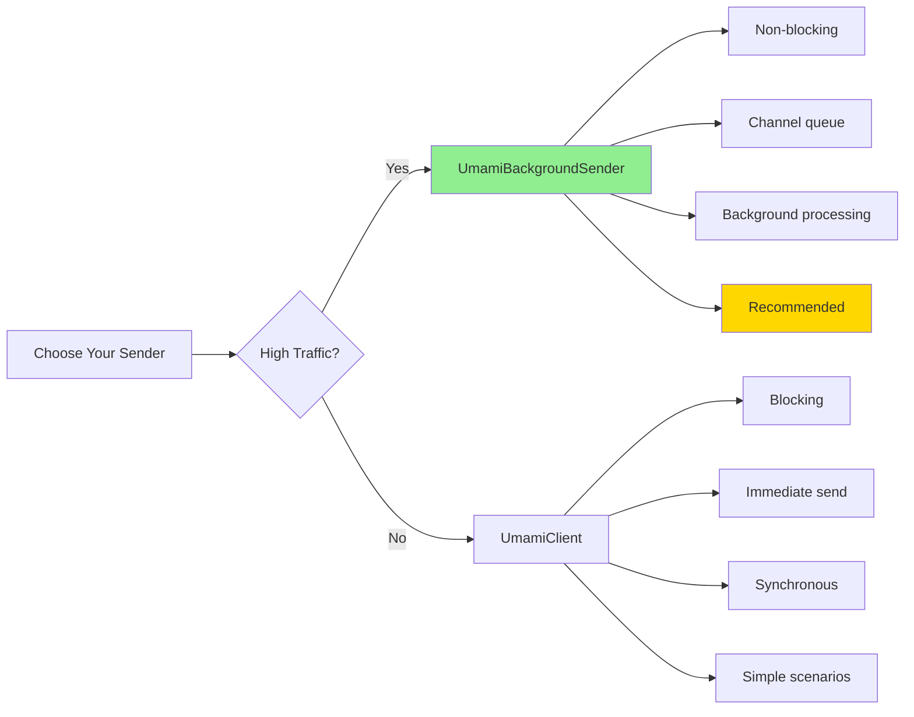
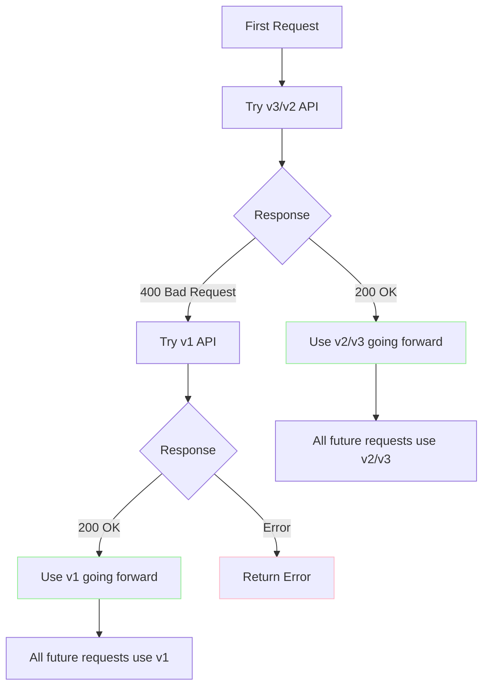
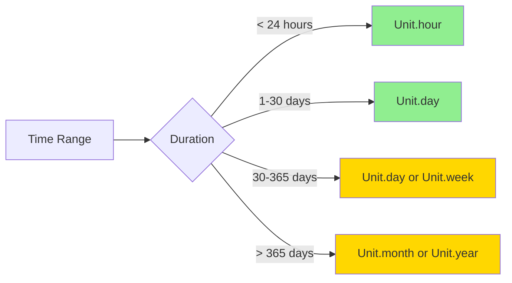

# Umami.Net

<div align="center">


**A production-ready .NET client library for [Umami Analytics](https://umami.is)**

*Privacy-focused web analytics that actually works with .NET*

[](https://www.nuget.org/packages/Umami.Net/)
[](https://opensource.org/licenses/MIT)
[](https://dotnet.microsoft.com/)

[Features](#features) • [Quick Start](#quick-start) • [Documentation](#documentation) • [Examples](#examples) • [API Reference](#api-reference)

</div>

---

## Why Umami.Net?

Umami's API is powerful but... challenging. Missing parameters result in silent failures. Error messages like `"beep boop"` for bot detection. Parameters that change names between versions (`path` vs `url`, `hostname` vs `host`). Timestamp formats that aren't documented.

**Umami.Net fixes all of this.** This isn't just an HTTP wrapper—it's a production-ready library that:

- **Validates early** with helpful error messages that tell you exactly what's wrong and how to fix it
-  **Handles quirks** like bot detection responses and parameter name changes automatically
-  **Auto-detects API versions** - works seamlessly with Umami v1, v2, and v3
-  **Never blocks** your application with background processing using System.Threading.Channels
-  **Recovers gracefully** from network failures with Polly retry policies
-  **Manages authentication** automatically with token refresh on expiration
-  **Tested extensively** with comprehensive unit and integration tests

## Table of Contents

- [Features](#features)
- [Architecture](#architecture)
- [Installation](#installation)
- [Quick Start](#quick-start)
- [Configuration](#configuration)
- [Event Tracking](#event-tracking)
- [Analytics Data API](#analytics-data-api)
- [API Version Compatibility](#api-version-compatibility)
- [Real-World Examples](#real-world-examples)
- [Error Handling](#error-handling)
- [Performance & Best Practices](#performance--best-practices)
- [Testing](#testing)
- [API Reference](#api-reference)
- [Gotchas & Troubleshooting](#gotchas--troubleshooting)
- [Contributing](#contributing)

---

## Features

### Event Tracking
-  **Custom Events** - Track any user interaction with optional metadata
-  **Page Views** - Automatic and manual page view tracking
-  **Background Processing** - Non-blocking event queue using Channels
-  **User Identification** - Track authenticated users
-  **Bot Detection** - Handles Umami's bot detection gracefully

### Analytics Data API
-  **Statistics** - Page views, visitors, visits, bounce rate, total time
-  **Metrics** - Aggregated data by URL, referrer, browser, OS, device, country, and more
-  **Time Series** - Page views and events over time
-  **Active Users** - Real-time active user count
-  **Expanded Metrics** - Detailed engagement data with bounce rates and time metrics

### Developer Experience
-  **Automatic Authentication** - JWT token management with auto-refresh
-  **Resilient** - Polly retry policies for transient failures
- ️ **Defensive** - Comprehensive validation with helpful error messages
-  **Well-Documented** - Extensive XML documentation and examples
-  **Type-Safe** - Strongly-typed request/response models
-  **Auto-Detection** - Automatically detects and adapts to Umami v1/v2/v3 APIs
-  **Production-Tested** - Battle-tested on high-traffic production sites

---

## Architecture

### Core Philosophy

**Umami.Net is built on one fundamental principle: Analytics should never break your application.**

This library follows a "fail loudly but recoverably" philosophy:

-  **Never throw exceptions** that break user requests
-  **Log everything** with detailed context so you know what went wrong
-  **Degrade gracefully** - if analytics fail, your app continues working
-  **Non-blocking by default** - analytics happen in the background
-  **Resilient to failures** - automatic retries with exponential backoff
-  **Validate early** - catch configuration errors at startup, not in production

**The Background Sender: Your Analytics Sidecar**

The `UmamiBackgroundSender` is designed as a **sidecar service** that runs alongside your application:

- **Completely non-blocking** - Events are queued in-memory and processed asynchronously
- **Fire and forget** - Your HTTP requests return immediately (<1ms overhead)
- **Fault-tolerant** - Starts and stops cleanly with your application
- **Self-contained** - Manages its own worker thread and error handling
- **Never blocks shutdown** - Graceful shutdown with timeout to drain pending events

Think of it as a separate microservice running inside your application process, dedicated solely to sending analytics data without impacting your primary application flow.

### System Overview

```mermaid
graph TB
    subgraph "Your Application"
        A[Controller/Service] --> B[UmamiBackgroundSender]
        A --> C[UmamiClient]
        A --> D[UmamiDataService]
    end

    subgraph "Umami.Net Library"
        B --> E[Channel Queue]
        E --> F[Background Worker]
        F --> G[UmamiClient]
        C --> G
        G --> H[PayloadService]
        H --> I[ResponseDecoder]

        D --> J[AuthService]
        J --> K[HttpClient with Polly]
        K --> L[Retry Policy]

        G --> K
    end

    subgraph "Umami Server"
        K --> M[/api/send]
        K --> N[/api/websites/:id/stats]
        K --> O[/api/websites/:id/metrics]
        K --> P[/api/websites/:id/pageviews]
        K --> Q[/api/websites/:id/active]
        K --> R[/api/auth/login]
    end

    style B stroke:#e1f5ff
    style G stroke:#ffe1e1
    style D stroke:#e1ffe1
```

### Event Tracking Flow



### Data API Flow with Auto-Retry



### Version Detection Flow



---

## Installation

### NuGet Package Manager

```bash
dotnet add package Umami.Net
```

### Package Manager Console

```powershell
Install-Package Umami.Net
```

### .csproj Reference

```xml
<PackageReference Include="Umami.Net" Version="1.0.0" />
```

---

## Quick Start

### 1. Configure Settings

Add to your `appsettings.json`:

```json
{
  "Analytics": {
    "UmamiPath": "https://analytics.yoursite.com",
    "WebsiteId": "12345678-1234-1234-1234-123456789abc"
  }
}
```

For analytics data retrieval, also add authentication:

```json
{
  "Analytics": {
    "UmamiPath": "https://analytics.yoursite.com",
    "WebsiteId": "12345678-1234-1234-1234-123456789abc",
    "UserName": "admin",
    "Password": "your-secure-password"
  }
}
```

### 2. Register Services

In your `Program.cs`:

```csharp
using Umami.Net;

var builder = WebApplication.CreateBuilder(args);

// For event tracking (includes both UmamiClient and UmamiBackgroundSender)
builder.Services.SetupUmamiClient(builder.Configuration);

// For analytics data API access
builder.Services.SetupUmamiData(builder.Configuration);

var app = builder.Build();
```

### 3. Track Events

```csharp
using Umami.Net;

public class HomeController : Controller
{
    private readonly UmamiBackgroundSender _umami;

    public HomeController(UmamiBackgroundSender umami)
    {
        _umami = umami;
    }

    public async Task<IActionResult> Index()
    {
        // Track a page view (non-blocking)
        await _umami.TrackPageView("/", "Home Page");

        return View();
    }

    [HttpPost]
    public async Task<IActionResult> Subscribe(string email)
    {
        // Track custom event with data
        await _umami.Track("newsletter-signup", new UmamiEventData
        {
            { "source", "homepage" },
            { "email_domain", email.Split('@')[1] }
        });

        return RedirectToAction("ThankYou");
    }
}
```

### 4. Retrieve Analytics

```csharp
using Umami.Net;

public class DashboardController : Controller
{
    private readonly IUmamiDataService _umamiData;

    public DashboardController(IUmamiDataService umamiData)
    {
        _umamiData = umamiData;
    }

    public async Task<IActionResult> Stats()
    {
        var request = new StatsRequest
        {
            StartAtDate = DateTime.UtcNow.AddDays(-30),
            EndAtDate = DateTime.UtcNow
        };

        var result = await _umamiData.GetStats(request);

        if (result.Status == System.Net.HttpStatusCode.OK)
        {
            var stats = result.Data;
            // Access: stats.pageviews.value, stats.visitors.value, etc.
            return View(stats);
        }

        return View("Error");
    }
}
```

---

## Configuration

### Settings Model

```csharp
public class UmamiClientSettings
{
    /// <summary>
    /// Base URL of your Umami instance (e.g., "https://analytics.yoursite.com")
    /// Required. Must be a valid absolute URI.
    /// </summary>
    public string UmamiPath { get; set; }

    /// <summary>
    /// Website ID (GUID format)
    /// Required. Must be a valid GUID.
    /// </summary>
    public string WebsiteId { get; set; }
}

public class UmamiDataSettings : UmamiClientSettings
{
    /// <summary>
    /// Umami username for API authentication
    /// Required for data API access.
    /// </summary>
    public string UserName { get; set; }

    /// <summary>
    /// Umami password for API authentication
    /// Required for data API access.
    /// </summary>
    public string Password { get; set; }
}
```

### Validation

Configuration is validated at startup:

```csharp
// ✅ Valid configuration
{
  "UmamiPath": "https://analytics.yoursite.com",
  "WebsiteId": "12345678-1234-1234-1234-123456789abc"
}

// ❌ Invalid - will throw at startup with helpful message
{
  "UmamiPath": "not-a-url",  // FormatException: UmamiUrl must be a valid Uri
  "WebsiteId": "not-a-guid"  // FormatException: WebSiteId must be a valid Guid
}
```

### Environment Variables

For production, use environment variables:

```bash
Analytics__UmamiPath=https://analytics.yoursite.com
Analytics__WebsiteId=12345678-1234-1234-1234-123456789abc
Analytics__UserName=admin
Analytics__Password=your-secure-password
```

### User Secrets (Development)

```bash
dotnet user-secrets set "Analytics:UmamiPath" "https://analytics.yoursite.com"
dotnet user-secrets set "Analytics:WebsiteId" "12345678-1234-1234-1234-123456789abc"
dotnet user-secrets set "Analytics:UserName" "admin"
dotnet user-secrets set "Analytics:Password" "your-password"
```

---

## Event Tracking

### UmamiClient vs UmamiBackgroundSender



**Use `UmamiBackgroundSender`** (recommended):
- **Production web applications** - Your users never wait for analytics
- **High-traffic websites** - Handles thousands of events without blocking
- **When response time matters** - Adds <1ms overhead vs 50-200ms for synchronous sending
- **Fault-tolerant scenarios** - Analytics failures don't impact your application

**Use `UmamiClient`**:
- **Background jobs or scripts** - When you're not in a web request context
- **Testing** - When you need immediate confirmation that events were sent
- **Low-traffic admin panels** - Where a few milliseconds don't matter

### How the Background Service Works

The `UmamiBackgroundSender` is a **hosted service** (implements `IHostedService`) that:

1. **Starts** when your application starts
2. **Creates** an unbounded channel for queueing events
3. **Spawns** a background worker task that continuously reads from the channel
4. **Processes** events by sending them to Umami with retry logic
5. **Logs** all errors with full context but never throws exceptions
6. **Stops** gracefully when your application shuts down, attempting to drain remaining events

**Lifecycle Management:**
```csharp
public class UmamiBackgroundSender : IHostedService
{
    // Called when application starts
    public Task StartAsync(CancellationToken cancellationToken)
    {
        _logger.LogInformation("Umami Background Sender started");
        _ = ProcessQueueAsync(_stoppingCts.Token);  // Fire and forget
        return Task.CompletedTask;
    }

    // Called when application stops
    public async Task StopAsync(CancellationToken cancellationToken)
    {
        _logger.LogInformation("Umami Background Sender stopping");
        _channel.Writer.Complete();  // Signal no more events

        // Wait for queue to drain (with timeout)
        try
        {
            await _processingTask.WaitAsync(TimeSpan.FromSeconds(10));
            _logger.LogInformation("Umami Background Sender stopped gracefully");
        }
        catch (TimeoutException)
        {
            _logger.LogWarning("Umami Background Sender stopped with pending events");
        }
    }

    // Background worker - runs continuously
    private async Task ProcessQueueAsync(CancellationToken cancellationToken)
    {
        await foreach (var payload in _channel.Reader.ReadAllAsync(cancellationToken))
        {
            try
            {
                await _client.Send(payload);
            }
            catch (Exception ex)
            {
                // NEVER let errors break the worker loop
                _logger.LogError(ex,
                    "Failed to send event to Umami. Event: {EventName}, URL: {Url}",
                    payload.Name, payload.Url);
            }
        }
    }
}
```

**Key Design Decisions:**

- **Unbounded channel** - We don't want to drop events; if memory becomes an issue, that's a symptom of a bigger problem (Umami down, network issues)
- **Fire and forget startup** - The background task runs independently of the startup sequence
- **Graceful shutdown** - Try to send remaining events, but don't block shutdown indefinitely
- **Detailed error logging** - Every failure is logged with the full event context
- **Never throw** - Errors are logged but don't propagate to prevent breaking the worker loop

### Track Custom Events

```csharp
private readonly UmamiBackgroundSender _umami;

// Simple event
await _umami.Track("button-click");

// Event with data
await _umami.Track("search", new UmamiEventData
{
    { "query", "umami analytics" },
    { "results", "42" },
    { "duration_ms", "156" }
});

// Event with custom URL (overrides auto-detected URL)
await _umami.Track("form-submit",
    url: "/custom/path",
    eventData: new UmamiEventData
    {
        { "form", "newsletter" }
    });
```

### Track Page Views

```csharp
// Basic page view
await _umami.TrackPageView("/blog/my-post");

// Page view with title
await _umami.TrackPageView("/blog/my-post", "My Blog Post");

// Page view with event data
await _umami.TrackPageView(
    url: "/products/item-123",
    eventType: "product-view",
    eventData: new UmamiEventData
    {
        { "category", "electronics" },
        { "price", "299.99" },
        { "sku", "ELEC-123" }
    }
);
```

### User Identification

Track specific users (authenticated scenarios):

```csharp
// Identify a user
await _umami.Identify(new UmamiEventData
{
    { "userId", user.Id.ToString() },
    { "email", user.Email },
    { "plan", user.SubscriptionPlan }
});

// Track event for identified user
await _umami.Track("purchase", new UmamiEventData
{
    { "amount", "99.99" },
    { "currency", "USD" },
    { "items", "3" }
});
```

### Low-Level Send Method

For advanced scenarios:

```csharp
var payload = new UmamiPayload
{
    Website = "your-website-id",
    Url = "/custom/page",
    Title = "Custom Page Title",
    Referrer = "https://google.com",
    Hostname = "yoursite.com",
    Language = "en-US",
    Screen = "1920x1080",
    Data = new UmamiEventData
    {
        { "custom_field", "value" }
    }
};

var response = await _client.Send(payload, eventType: "event");

// Check response status
switch (response.Status)
{
    case ResponseStatus.Success:
        // Event tracked successfully
        var visitorId = response.VisitorId;
        break;
    case ResponseStatus.BotDetected:
        // Request identified as bot
        break;
    case ResponseStatus.Failed:
        // Error occurred
        break;
}
```

> **Note:** Event type can only be `"event"` or `"identify"` as per the Umami API specification.

### Event Data Dictionary

`UmamiEventData` is a dictionary that accepts any string key-value pairs:

```csharp
var eventData = new UmamiEventData
{
    // String values
    { "action", "click" },
    { "category", "navigation" },

    // Numeric values (converted to string)
    { "duration", "1234" },
    { "count", "5" },

    // Boolean values (converted to string)
    { "success", "true" },

    // Complex data (serialize to JSON string)
    { "metadata", JsonSerializer.Serialize(complexObject) }
};
```

---

## Analytics Data API

All data API methods return `UmamiResult<T>` which includes:
- `Status` - HTTP status code
- `Message` - Success or error message
- `Data` - The response data (null on error)

### Get Active Users

Get real-time count of active users:

```csharp
var result = await _umamiData.GetActiveUsers();

if (result.Status == HttpStatusCode.OK)
{
    Console.WriteLine($"Active Users: {result.Data.visitors}");
}
```

**Response:**
```json
{
  "visitors": 42
}
```

### Get Statistics

Get summary statistics for a date range:

```csharp
var request = new StatsRequest
{
    StartAtDate = DateTime.UtcNow.AddDays(-30),
    EndAtDate = DateTime.UtcNow
};

var result = await _umamiData.GetStats(request);

if (result.Status == HttpStatusCode.OK)
{
    var stats = result.Data;

    Console.WriteLine($"Page Views: {stats.pageviews.value} (prev: {stats.pageviews.prev})");
    Console.WriteLine($"Visitors: {stats.visitors.value} (prev: {stats.visitors.prev})");
    Console.WriteLine($"Visits: {stats.visits.value} (prev: {stats.visits.prev})");
    Console.WriteLine($"Bounces: {stats.bounces.value} (prev: {stats.bounces.prev})");
    Console.WriteLine($"Total Time: {stats.totaltime.value}ms");

    // Calculate bounce rate
    var bounceRate = (double)stats.bounces.value / stats.visits.value;
    Console.WriteLine($"Bounce Rate: {bounceRate:P}");

    // Calculate average time per visit
    var avgTime = stats.visits.value > 0
        ? stats.totaltime.value / stats.visits.value
        : 0;
    Console.WriteLine($"Avg Time per Visit: {avgTime}ms");
}
```

**Optional Filters:**

```csharp
var request = new StatsRequest
{
    StartAtDate = DateTime.UtcNow.AddDays(-7),
    EndAtDate = DateTime.UtcNow,
    Url = "/blog/my-post",     // Stats for specific URL
    Referrer = "google.com",    // Traffic from specific referrer
    Title = "My Blog Post",     // Specific page title
    Query = "utm_source=newsletter", // Query parameter filter
    Event = "button-click",     // Specific event type
    Host = "yoursite.com",      // Specific hostname
    Os = "Windows",             // Operating system
    Browser = "Chrome",         // Browser
    Device = "desktop",         // Device type
    Country = "US",             // Country code
    Region = "CA",              // Region/state
    City = "San Francisco"      // City
};
```

### Get Metrics

Get aggregated metrics by dimension:

```csharp
var request = new MetricsRequest
{
    StartAtDate = DateTime.UtcNow.AddDays(-7),
    EndAtDate = DateTime.UtcNow,
    Type = MetricType.path,  // Dimension to aggregate by
    Unit = Unit.day,         // Optional in v3
    Limit = 10,              // Top N results
    Timezone = "UTC"         // Optional timezone
};

var result = await _umamiData.GetMetrics(request);

if (result.Status == HttpStatusCode.OK)
{
    foreach (var metric in result.Data)
    {
        Console.WriteLine($"{metric.x}: {metric.y} views");
    }
}
```

**Example Output:**
```
/blog/post-1: 1543 views
/blog/post-2: 891 views
/products: 672 views
```

### Metric Types

All available metric dimensions:

```csharp
public enum MetricType
{
    // Pages & Content
    url,        // Page URLs (v1 - use 'path' for v2/v3)
    path,       // URL paths (v2/v3 - recommended)
    title,      // Page titles
    query,      // Query parameters

    // Traffic Sources
    referrer,   // Traffic sources
    host,       // Hostnames
    hostname,   // Domain names

    // Technology
    browser,    // Browser analytics
    os,         // Operating systems
    device,     // Device types (desktop/mobile/tablet)
    screen,     // Screen resolutions
    language,   // Language codes

    // Geography
    country,    // Country codes (2-letter ISO)
    region,     // States/provinces
    city,       // City-level data

    // Behavior
    @event,     // Custom events
    entry,      // Entry pages
    exit,       // Exit pages

    // Organization
    tag,        // Content tags
    channel,    // Traffic channels
    domain      // Full domains
}
```

**Metric Type Examples:**

```csharp
// Top pages
Type = MetricType.path

// Traffic sources
Type = MetricType.referrer

// Browser breakdown
Type = MetricType.browser

// Geographic distribution
Type = MetricType.country

// Custom events
Type = MetricType.@event  // Note: @ prefix required for 'event' keyword
```

### Get Expanded Metrics

Get detailed engagement metrics including bounces and time:

```csharp
var request = new MetricsRequest
{
    StartAtDate = DateTime.UtcNow.AddDays(-30),
    EndAtDate = DateTime.UtcNow,
    Type = MetricType.path,
    Unit = Unit.day,
    Limit = 20
};

var result = await _umamiData.GetExpandedMetrics(request);

if (result.Status == HttpStatusCode.OK)
{
    foreach (var metric in result.Data)
    {
        // Calculate engagement metrics
        var bounceRate = metric.visits > 0
            ? (double)metric.bounces / metric.visits * 100
            : 0;

        var avgTimeSeconds = metric.visits > 0
            ? metric.totaltime / metric.visits / 1000.0
            : 0;

        Console.WriteLine($"\n{metric.name}");
        Console.WriteLine($"  Page Views: {metric.pageviews:N0}");
        Console.WriteLine($"  Unique Visitors: {metric.visitors:N0}");
        Console.WriteLine($"  Visits: {metric.visits:N0}");
        Console.WriteLine($"  Bounce Rate: {bounceRate:F1}%");
        Console.WriteLine($"  Avg Time: {avgTimeSeconds:F1}s");
    }
}
```

**Response Model:**
```csharp
public class ExpandedMetricsResponseModel
{
    public string name { get; set; }       // URL/path/dimension name
    public int pageviews { get; set; }     // Total page views
    public int visitors { get; set; }      // Unique visitors
    public int visits { get; set; }        // Total visits
    public int bounces { get; set; }       // Bounced visits
    public long totaltime { get; set; }    // Total time in milliseconds
}
```

### Get Page Views Over Time

Get time-series data for page views:

```csharp
var request = new PageViewsRequest
{
    StartAtDate = DateTime.UtcNow.AddDays(-30),
    EndAtDate = DateTime.UtcNow,
    Unit = Unit.day,
    Timezone = "America/Los_Angeles"
};

var result = await _umamiData.GetPageViews(request);

if (result.Status == HttpStatusCode.OK)
{
    // Time series data
    foreach (var dataPoint in result.Data.pageviews)
    {
        var date = DateTimeOffset.FromUnixTimeMilliseconds(
            long.Parse(dataPoint.x)).DateTime;
        Console.WriteLine($"{date:yyyy-MM-dd}: {dataPoint.y} views");
    }

    // Session data
    foreach (var sessionPoint in result.Data.sessions)
    {
        var date = DateTimeOffset.FromUnixTimeMilliseconds(
            long.Parse(sessionPoint.x)).DateTime;
        Console.WriteLine($"{date:yyyy-MM-dd}: {sessionPoint.y} sessions");
    }
}
```

**Optional Filters:**
```csharp
var request = new PageViewsRequest
{
    StartAtDate = DateTime.UtcNow.AddDays(-7),
    EndAtDate = DateTime.UtcNow,
    Unit = Unit.hour,
    Timezone = "UTC",
    Url = "/blog",              // Filter by URL
    Referrer = "google.com",    // Filter by referrer
    Title = "My Page",          // Filter by title
    Host = "yoursite.com",      // Filter by host
    Os = "Windows",             // Filter by OS
    Browser = "Chrome",         // Filter by browser
    Device = "mobile",          // Filter by device
    Country = "US",             // Filter by country
    Region = "CA",              // Filter by region
    City = "San Francisco"      // Filter by city
};
```

### Get Events Series

Get event occurrences over time:

```csharp
var request = new EventsSeriesRequest
{
    StartAtDate = DateTime.UtcNow.AddDays(-7),
    EndAtDate = DateTime.UtcNow,
    Unit = Unit.hour,
    Timezone = "UTC"
};

var result = await _umamiData.GetEventsSeries(request);

if (result.Status == HttpStatusCode.OK)
{
    foreach (var item in result.Data)
    {
        var timestamp = DateTimeOffset.FromUnixTimeMilliseconds(
            long.Parse(item.t)).DateTime;
        Console.WriteLine($"Event: {item.x}, Time: {timestamp}, Count: {item.y}");
    }
}
```

**Optional Filters:**
```csharp
var request = new EventsSeriesRequest
{
    StartAtDate = DateTime.UtcNow.AddDays(-1),
    EndAtDate = DateTime.UtcNow,
    Unit = Unit.hour,
    EventName = "button-click",  // Filter by specific event
    Url = "/landing-page",       // Events on specific page
    // ... all other filters from PageViewsRequest
};
```

### Time Units

```csharp
public enum Unit
{
    year,    // Yearly aggregation
    month,   // Monthly aggregation
    day,     // Daily aggregation (default)
    hour     // Hourly aggregation
}
```

**Best Practices:**
```csharp
// ✅ Good - hourly for recent data
var recentRequest = new MetricsRequest
{
    StartAtDate = DateTime.UtcNow.AddHours(-24),
    EndAtDate = DateTime.UtcNow,
    Unit = Unit.hour
};

// ✅ Good - daily for historical data
var historicalRequest = new MetricsRequest
{
    StartAtDate = DateTime.UtcNow.AddDays(-90),
    EndAtDate = DateTime.UtcNow,
    Unit = Unit.day
};

// ❌ Avoid - too granular (90 days × 24 hours = 2160 data points!)
var inefficientRequest = new MetricsRequest
{
    StartAtDate = DateTime.UtcNow.AddDays(-90),
    EndAtDate = DateTime.UtcNow,
    Unit = Unit.hour  // Way too much data!
};
```

---

## API Version Compatibility

### Automatic Detection - It Just Works™

**Umami.Net automatically detects which API version your Umami instance uses.** No configuration needed!



### How It Works

1. **First request** tries v3/v2 API (modern parameters: `path`, `hostname`)
2. If it receives **400 Bad Request**, automatically retries with v1 API (`url`, `host`)
3. **Caches the result** - all future requests use the detected version
4. **Zero configuration** from your side

### What This Means

**Just works** with any Umami version
**No version checks** needed in your code
**Automatic fallback** to older APIs
**Forward compatible** with future Umami updates

### Supported Versions

| Umami Version | API Version | Status | Key Differences |
|---------------|-------------|--------|-----------------|
| v1.x | v1 |  Supported | Uses `url`, `host` parameters |
| v2.x | v2 |  Supported | Uses `path`, `hostname` parameters |
| v3.x | v3 |  Supported (Latest) | Optional `unit` parameter, enhanced metrics |

### Version-Specific Features

#### Umami v3 Enhancements

```csharp
// v3 allows optional unit parameter
var request = new MetricsRequest
{
    StartAtDate = DateTime.UtcNow.AddDays(-7),
    EndAtDate = DateTime.UtcNow,
    Type = MetricType.path,
    // Unit is optional in v3!
};
```

#### Parameter Name Mapping

The library handles parameter name differences automatically:

| Feature | v1 API | v2/v3 API | Library Handles |
|---------|--------|-----------|--------------|
| URL path | `url` | `path` |  Automatic |
| Domain | `host` | `hostname` |  Automatic |
| Metrics granularity | `unit` required | `unit` optional (v3) |  Automatic |

---

## Real-World Examples

### Example 1: Popular Posts Widget

Display trending posts from the last 24 hours:

```csharp
public class PopularPostsService
{
    private readonly UmamiDataService _dataService;
    private readonly IBlogService _blogService;
    private readonly IMemoryCache _cache;
    private readonly ILogger<PopularPostsService> _logger;
    private readonly SemaphoreSlim _semaphore = new(1, 1);

    public async Task<PopularPost?> GetPopularPost()
    {
        await _semaphore.WaitAsync();
        try
        {
            const string cacheKey = "trending_post_24h";

            // Check cache first
            if (_cache.TryGetValue(cacheKey, out PopularPost cached))
                return cached;

            // Get path metrics from last 24 hours
            var metricsRequest = new MetricsRequest
            {
                StartAtDate = DateTime.UtcNow.AddHours(-24),
                EndAtDate = DateTime.UtcNow,
                Type = MetricType.path,
                Unit = Unit.hour,
                Timezone = "UTC",
                Limit = 100
            };

            var result = await _dataService.GetMetrics(metricsRequest);

            if (result?.Status != HttpStatusCode.OK || result.Data == null)
            {
                _logger.LogWarning("Failed to get metrics from Umami");
                return null;
            }

            // Filter for blog posts only
            var blogPosts = result.Data
                .Where(m => m.x.StartsWith("/blog/", StringComparison.OrdinalIgnoreCase))
                .ToList();

            if (!blogPosts.Any())
                return null;

            // Aggregate by slug (handle translated versions)
            var aggregated = new Dictionary<string, int>(StringComparer.OrdinalIgnoreCase);
            foreach (var post in blogPosts)
            {
                // Remove "/blog/" prefix
                var slug = post.x.Substring(6).Trim('/');

                // Remove language extension (.es, .fr, etc.)
                var baseSlug = slug.Contains('.')
                    ? slug.Substring(0, slug.LastIndexOf('.'))
                    : slug;

                aggregated[baseSlug] = aggregated.GetValueOrDefault(baseSlug) + post.y;
            }

            // Get top post
            var topPost = aggregated.OrderByDescending(kvp => kvp.Value).First();

            // Get full blog post details
            var blogPost = await _blogService.GetPost(
                new BlogPostQueryModel(topPost.Key, "en"));

            var popularPost = new PopularPost
            {
                Url = $"/blog/{topPost.Key}",
                Title = blogPost?.Title ?? topPost.Key,
                Views = topPost.Value,
                PublishedDate = blogPost?.PublishedDate ?? DateTime.UtcNow,
                Categories = blogPost?.Categories ?? Array.Empty<string>()
            };

            // Cache for 10 minutes
            _cache.Set(cacheKey, popularPost, TimeSpan.FromMinutes(10));
            return popularPost;
        }
        catch (Exception ex)
        {
            _logger.LogError(ex, "Error getting popular post");
            return null;
        }
        finally
        {
            _semaphore.Release();
        }
    }
}

public class PopularPost
{
    public string Url { get; set; } = "";
    public string Title { get; set; } = "";
    public int Views { get; set; }
    public DateTime PublishedDate { get; set; }
    public string[] Categories { get; set; } = Array.Empty<string>();
}
```

### Example 2: Analytics Dashboard

Complete dashboard with multiple metrics:

```csharp
public class AnalyticsDashboardService
{
    private readonly UmamiDataService _dataService;
    private readonly ILogger<AnalyticsDashboardService> _logger;

    public async Task<DashboardData> GetDashboard(int days = 30)
    {
        var endDate = DateTime.UtcNow;
        var startDate = endDate.AddDays(-days);

        // Execute all requests in parallel
        var statsTask = GetStatsAsync(startDate, endDate);
        var topPagesTask = GetTopPagesAsync(startDate, endDate);
        var topReferrersTask = GetTopReferrersAsync(startDate, endDate);
        var topCountriesTask = GetTopCountriesAsync(startDate, endDate);
        var browserStatsTask = GetBrowserStatsAsync(startDate, endDate);
        var deviceStatsTask = GetDeviceStatsAsync(startDate, endDate);
        var pageViewsTask = GetPageViewsTimeSeriesAsync(startDate, endDate);

        await Task.WhenAll(
            statsTask,
            topPagesTask,
            topReferrersTask,
            topCountriesTask,
            browserStatsTask,
            deviceStatsTask,
            pageViewsTask);

        return new DashboardData
        {
            Period = $"Last {days} days",
            Stats = await statsTask,
            TopPages = await topPagesTask,
            TopReferrers = await topReferrersTask,
            TopCountries = await topCountriesTask,
            BrowserStats = await browserStatsTask,
            DeviceStats = await deviceStatsTask,
            PageViewsTimeSeries = await pageViewsTask
        };
    }

    private async Task<StatsResponseModels?> GetStatsAsync(DateTime start, DateTime end)
    {
        var result = await _dataService.GetStats(new StatsRequest
        {
            StartAtDate = start,
            EndAtDate = end
        });

        return result.Status == HttpStatusCode.OK ? result.Data : null;
    }

    private async Task<List<MetricsResponseModels>> GetTopPagesAsync(DateTime start, DateTime end)
    {
        var result = await _dataService.GetMetrics(new MetricsRequest
        {
            StartAtDate = start,
            EndAtDate = end,
            Type = MetricType.path,
            Unit = Unit.day,
            Limit = 10
        });

        return result.Status == HttpStatusCode.OK
            ? result.Data.ToList()
            : new List<MetricsResponseModels>();
    }

    private async Task<List<MetricsResponseModels>> GetTopReferrersAsync(DateTime start, DateTime end)
    {
        var result = await _dataService.GetMetrics(new MetricsRequest
        {
            StartAtDate = start,
            EndAtDate = end,
            Type = MetricType.referrer,
            Unit = Unit.day,
            Limit = 10
        });

        return result.Status == HttpStatusCode.OK
            ? result.Data.ToList()
            : new List<MetricsResponseModels>();
    }

    private async Task<List<MetricsResponseModels>> GetTopCountriesAsync(DateTime start, DateTime end)
    {
        var result = await _dataService.GetMetrics(new MetricsRequest
        {
            StartAtDate = start,
            EndAtDate = end,
            Type = MetricType.country,
            Unit = Unit.day,
            Limit = 10
        });

        return result.Status == HttpStatusCode.OK
            ? result.Data.ToList()
            : new List<MetricsResponseModels>();
    }

    private async Task<List<MetricsResponseModels>> GetBrowserStatsAsync(DateTime start, DateTime end)
    {
        var result = await _dataService.GetMetrics(new MetricsRequest
        {
            StartAtDate = start,
            EndAtDate = end,
            Type = MetricType.browser,
            Unit = Unit.day,
            Limit = 5
        });

        return result.Status == HttpStatusCode.OK
            ? result.Data.ToList()
            : new List<MetricsResponseModels>();
    }

    private async Task<List<MetricsResponseModels>> GetDeviceStatsAsync(DateTime start, DateTime end)
    {
        var result = await _dataService.GetMetrics(new MetricsRequest
        {
            StartAtDate = start,
            EndAtDate = end,
            Type = MetricType.device,
            Unit = Unit.day,
            Limit = 3
        });

        return result.Status == HttpStatusCode.OK
            ? result.Data.ToList()
            : new List<MetricsResponseModels>();
    }

    private async Task<List<MetricsResponseModels>> GetPageViewsTimeSeriesAsync(
        DateTime start, DateTime end)
    {
        var result = await _dataService.GetPageViews(new PageViewsRequest
        {
            StartAtDate = start,
            EndAtDate = end,
            Unit = Unit.day,
            Timezone = "UTC"
        });

        return result.Status == HttpStatusCode.OK
            ? result.Data.pageviews.ToList()
            : new List<MetricsResponseModels>();
    }
}

public class DashboardData
{
    public string Period { get; set; } = "";
    public StatsResponseModels? Stats { get; set; }
    public List<MetricsResponseModels> TopPages { get; set; } = new();
    public List<MetricsResponseModels> TopReferrers { get; set; } = new();
    public List<MetricsResponseModels> TopCountries { get; set; } = new();
    public List<MetricsResponseModels> BrowserStats { get; set; } = new();
    public List<MetricsResponseModels> DeviceStats { get; set; } = new();
    public List<MetricsResponseModels> PageViewsTimeSeries { get; set; } = new();
}
```

### Example 3: Real-Time Activity Monitor

Monitor active users with SignalR:

```csharp
public class ActivityMonitor : BackgroundService
{
    private readonly UmamiDataService _dataService;
    private readonly IHubContext<AnalyticsHub> _hubContext;
    private readonly ILogger<ActivityMonitor> _logger;

    public ActivityMonitor(
        UmamiDataService dataService,
        IHubContext<AnalyticsHub> hubContext,
        ILogger<ActivityMonitor> logger)
    {
        _dataService = dataService;
        _hubContext = hubContext;
        _logger = logger;
    }

    protected override async Task ExecuteAsync(CancellationToken stoppingToken)
    {
        _logger.LogInformation("Activity Monitor started");

        while (!stoppingToken.IsCancellationRequested)
        {
            try
            {
                var activeUsers = await _dataService.GetActiveUsers();

                if (activeUsers.Status == HttpStatusCode.OK)
                {
                    await _hubContext.Clients.All.SendAsync(
                        "ActiveUsersUpdate",
                        activeUsers.Data.visitors,
                        stoppingToken);

                    _logger.LogDebug("Active users: {Count}", activeUsers.Data.visitors);
                }
                else
                {
                    _logger.LogWarning(
                        "Failed to get active users: {Status} - {Message}",
                        activeUsers.Status,
                        activeUsers.Message);
                }
            }
            catch (Exception ex)
            {
                _logger.LogError(ex, "Error in activity monitor");
            }

            // Update every 30 seconds
            await Task.Delay(TimeSpan.FromSeconds(30), stoppingToken);
        }

        _logger.LogInformation("Activity Monitor stopped");
    }
}

// SignalR Hub
public class AnalyticsHub : Hub
{
    public async Task SubscribeToActiveUsers()
    {
        await Groups.AddToGroupAsync(Context.ConnectionId, "ActiveUsers");
    }

    public async Task UnsubscribeFromActiveUsers()
    {
        await Groups.RemoveFromGroupAsync(Context.ConnectionId, "ActiveUsers");
    }
}
```

### Example 4: Event Tracking Middleware

Automatically track all page views:

```csharp
public class UmamiTrackingMiddleware
{
    private readonly RequestDelegate _next;
    private readonly ILogger<UmamiTrackingMiddleware> _logger;

    public UmamiTrackingMiddleware(
        RequestDelegate next,
        ILogger<UmamiTrackingMiddleware> logger)
    {
        _next = next;
        _logger = logger;
    }

    public async Task InvokeAsync(
        HttpContext context,
        UmamiBackgroundSender umami)
    {
        // Track page view before processing request
        var path = context.Request.Path.Value ?? "/";

        // Skip tracking for static files, api calls, health checks
        if (!ShouldTrack(path))
        {
            await _next(context);
            return;
        }

        try
        {
            var eventData = new UmamiEventData
            {
                { "method", context.Request.Method },
                { "user_agent", context.Request.Headers.UserAgent.ToString() }
            };

            // Add referrer if available
            if (context.Request.Headers.Referer.Any())
            {
                eventData.Add("referrer", context.Request.Headers.Referer.ToString());
            }

            // Track the page view
            await umami.TrackPageView(
                url: path,
                eventType: "pageview",
                eventData: eventData);
        }
        catch (Exception ex)
        {
            // Don't let tracking errors break the application
            _logger.LogError(ex, "Error tracking page view for {Path}", path);
        }

        await _next(context);
    }

    private static bool ShouldTrack(string path)
    {
        // Skip tracking for these paths
        var skipPaths = new[]
        {
            "/favicon.ico",
            "/robots.txt",
            "/sitemap.xml",
            "/health",
            "/metrics"
        };

        if (skipPaths.Any(skip => path.Equals(skip, StringComparison.OrdinalIgnoreCase)))
            return false;

        // Skip static files
        if (path.StartsWith("/css/", StringComparison.OrdinalIgnoreCase) ||
            path.StartsWith("/js/", StringComparison.OrdinalIgnoreCase) ||
            path.StartsWith("/images/", StringComparison.OrdinalIgnoreCase) ||
            path.StartsWith("/fonts/", StringComparison.OrdinalIgnoreCase))
            return false;

        // Skip API calls
        if (path.StartsWith("/api/", StringComparison.OrdinalIgnoreCase))
            return false;

        return true;
    }
}

// Register in Program.cs
app.UseMiddleware<UmamiTrackingMiddleware>();
```

---

## Error Handling

### Error Handling Philosophy

**Umami.Net fails loudly but recoverably.** This means:

1. **Never break your application** - No unhandled exceptions escape to your user-facing code
2. **Always log with context** - Every error includes full details about what went wrong and why
3. **Validate early** - Configuration errors fail at startup with clear messages
4. **Fail gracefully** - If analytics can't be sent, your app continues working
5. **Provide actionable errors** - Error messages tell you exactly how to fix the problem

**Error Logging Examples:**

The library logs errors with structured logging for easy troubleshooting:

```csharp
// Configuration validation error (at startup)
❌ FormatException: WebSiteId must be a valid Guid.
   Current value: 'my-website'
   Suggestion: Use a GUID format like '12345678-1234-1234-1234-123456789abc'

// Event sending error (at runtime - logged but doesn't throw)
⚠️ [Error] Failed to send event to Umami after 3 retries
   Event: {EventName = "button-click"}
   URL: {Url = "/products/123"}
   Exception: System.Net.Http.HttpRequestException: Connection refused
   Context: This is expected if Umami server is temporarily down.
           Events will be lost, but your application continues normally.

// Authentication error (auto-retries once then returns error result)
⚠ [Warning] Umami authentication failed
   Status: 401 Unauthorized
   Message: Invalid username or password
   Suggestion: Check Analytics:UserName and Analytics:Password in configuration
   Configuration: Analytics:UmamiPath = https://analytics.yoursite.com

// Validation error (before sending request)
 InvalidOperationException: StartAtDate is required.
   Suggestion: Set StartAtDate to a valid date (e.g., DateTime.UtcNow.AddDays(-7) for last 7 days).
   Current request: {Type = "path", EndAtDate = "2025-01-20"}
```

**What This Means For You:**

- **Development** - You see exactly what's wrong and how to fix it
- **Production** - Errors are logged for debugging but don't impact users
- **Monitoring** - Structure logging makes it easy to alert on analytics issues
- **Debugging** - Full context helps you understand what happened

### UmamiResult<T> Response Model

All data API methods return `UmamiResult<T>`:

```csharp
public class UmamiResult<T>
{
    public HttpStatusCode Status { get; set; }
    public string Message { get; set; }
    public T? Data { get; set; }
}
```

### Checking Results

```csharp
var result = await _dataService.GetMetrics(request);

//  Recommended: Check status code
if (result.Status == HttpStatusCode.OK && result.Data != null)
{
    // Success - use result.Data
    ProcessMetrics(result.Data);
}
else
{
    // Error - log and handle gracefully
    _logger.LogWarning(
        "Metrics request failed: {Status} - {Message}",
        result.Status,
        result.Message);
}
```

### Common HTTP Status Codes

```csharp
switch (result.Status)
{
    case HttpStatusCode.OK:
        // Success
        break;

    case HttpStatusCode.BadRequest:
        // Invalid parameters
        // Check result.Message for details
        // Common causes:
        // - Missing required parameters
        // - Invalid date range
        // - Malformed GUID
        break;

    case HttpStatusCode.Unauthorized:
        // Authentication failed
        // - Check username/password in configuration
        // - Token may have expired (auto-retry happens automatically)
        break;

    case HttpStatusCode.Forbidden:
        // Authenticated but not authorized
        // - User doesn't have access to this website
        break;

    case HttpStatusCode.NotFound:
        // Website ID not found
        // - Verify WebsiteId in configuration
        break;

    case HttpStatusCode.TooManyRequests:
        // Rate limited
        // - Implement caching
        // - Reduce request frequency
        break;

    case HttpStatusCode.ServiceUnavailable:
        // Umami server is down
        // - Polly will automatically retry
        break;

    default:
        // Unexpected error
        _logger.LogError("Unexpected status: {Status}", result.Status);
        break;
}
```

### Validation Errors

The library validates requests before sending:

```csharp
try
{
    var request = new MetricsRequest
    {
        Type = MetricType.path,
        //  Missing: StartAtDate, EndAtDate
    };

    await request.Validate();  // Explicit validation
    var result = await _dataService.GetMetrics(request);
}
catch (InvalidOperationException ex)
{
    // Validation failed with helpful message:
    // "StartAtDate is required. Suggestion: Set StartAtDate to a valid date
    // (e.g., DateTime.UtcNow.AddDays(-7) for last 7 days)."

    _logger.LogError(ex, "Validation error");
}
```

### Event Tracking Response Status

```csharp
public enum ResponseStatus
{
    Failed,       // Request failed
    BotDetected,  // Umami detected a bot (receives "beep boop")
    Success       // Event tracked successfully
}

var response = await _client.Send(payload);

switch (response.Status)
{
    case ResponseStatus.Success:
        // Event recorded
        var visitorId = response.VisitorId;
        _logger.LogInformation("Event tracked for visitor {VisitorId}", visitorId);
        break;

    case ResponseStatus.BotDetected:
        // Umami identified request as bot
        _logger.LogDebug("Bot detected - event not recorded");
        break;

    case ResponseStatus.Failed:
        // Error occurred
        _logger.LogWarning("Failed to track event");
        break;
}
```

### Graceful Degradation

Analytics should never break your application:

```csharp
public async Task<IActionResult> MyAction()
{
    // Your main application logic
    var result = await DoImportantWork();

    // Track analytics - but don't fail if it errors
    try
    {
        await _umami.Track("important-action-completed", new UmamiEventData
        {
            { "result", result.Status }
        });
    }
    catch (Exception ex)
    {
        // Log but continue - analytics failure shouldn't break the app
        _logger.LogWarning(ex, "Failed to track analytics event");
    }

    return Ok(result);
}
```

---

## Performance & Best Practices

### 1. Always Use Background Sender

```csharp
//  DON'T: Blocks the HTTP request
public async Task<IActionResult> Index()
{
    await _umamiClient.Track("page-view");  // Waits for HTTP request to complete
    return View();
}

// ✅ DO: Non-blocking
public async Task<IActionResult> Index()
{
    await _backgroundSender.Track("page-view");  // Queues and returns immediately
    return View();
}
```

**Performance difference:**
- `UmamiClient`: Adds 50-200ms to request time
- `UmamiBackgroundSender`: Adds <1ms to request time

### 2. Implement Caching

```csharp
public class CachedUmamiService
{
    private readonly UmamiDataService _dataService;
    private readonly IMemoryCache _cache;

    public async Task<MetricsResponseModels[]> GetTopPages(int days = 7)
    {
        var cacheKey = $"top_pages_{days}d";

        if (_cache.TryGetValue(cacheKey, out MetricsResponseModels[]? cached))
            return cached!;

        var request = new MetricsRequest
        {
            StartAtDate = DateTime.UtcNow.AddDays(-days),
            EndAtDate = DateTime.UtcNow,
            Type = MetricType.path,
            Unit = Unit.day,
            Limit = 10
        };

        var result = await _dataService.GetMetrics(request);

        if (result.Status == HttpStatusCode.OK && result.Data != null)
        {
            var cacheOptions = new MemoryCacheEntryOptions
            {
                AbsoluteExpirationRelativeToNow = TimeSpan.FromMinutes(15),
                SlidingExpiration = TimeSpan.FromMinutes(5)
            };

            _cache.Set(cacheKey, result.Data, cacheOptions);
            return result.Data;
        }

        return Array.Empty<MetricsResponseModels>();
    }
}
```

### 3. Use Appropriate Time Granularity



```csharp
// ✅ GOOD: Hourly for last 24 hours (24 data points)
var recentData = new MetricsRequest
{
    StartAtDate = DateTime.UtcNow.AddHours(-24),
    EndAtDate = DateTime.UtcNow,
    Unit = Unit.hour,
    Type = MetricType.path
};

// ✅ GOOD: Daily for last 30 days (30 data points)
var monthlyData = new MetricsRequest
{
    StartAtDate = DateTime.UtcNow.AddDays(-30),
    EndAtDate = DateTime.UtcNow,
    Unit = Unit.day,
    Type = MetricType.path
};

//  BAD: Hourly for 90 days (2160 data points!)
var inefficientData = new MetricsRequest
{
    StartAtDate = DateTime.UtcNow.AddDays(-90),
    EndAtDate = DateTime.UtcNow,
    Unit = Unit.hour,  // Too granular!
    Type = MetricType.path
};
```

### 4. Set Reasonable Limits

```csharp
// ✅ GOOD: Request only what you need
var topPages = new MetricsRequest
{
    StartAtDate = DateTime.UtcNow.AddDays(-7),
    EndAtDate = DateTime.UtcNow,
    Type = MetricType.path,
    Unit = Unit.day,
    Limit = 10  // Top 10 pages for display
};

// ❌ UNNECESSARY: Default is 500
var allPages = new MetricsRequest
{
    StartAtDate = DateTime.UtcNow.AddDays(-7),
    EndAtDate = DateTime.UtcNow,
    Type = MetricType.path,
    Unit = Unit.day
    // Limit defaults to 500 - do you really need that many?
};
```

### 5. Parallel Requests

Execute multiple independent requests in parallel:

```csharp
// ✅ GOOD: Parallel execution
var statsTask = _dataService.GetStats(statsRequest);
var metricsTask = _dataService.GetMetrics(metricsRequest);
var activeUsersTask = _dataService.GetActiveUsers();

await Task.WhenAll(statsTask, metricsTask, activeUsersTask);

var stats = await statsTask;
var metrics = await metricsTask;
var activeUsers = await activeUsersTask;

// ❌ SLOW: Sequential execution
var stats = await _dataService.GetStats(statsRequest);
var metrics = await _dataService.GetMetrics(metricsRequest);
var activeUsers = await _dataService.GetActiveUsers();
// Each waits for the previous to complete
```

### 6. Use Filtering

Reduce data volume by filtering at the API level:

```csharp
// ❌INEFFICIENT: Get all data then filter in memory
var allMetrics = await _dataService.GetMetrics(new MetricsRequest
{
    StartAtDate = DateTime.UtcNow.AddDays(-30),
    EndAtDate = DateTime.UtcNow,
    Type = MetricType.path,
    Unit = Unit.day
});
var blogPosts = allMetrics.Data
    .Where(m => m.x.StartsWith("/blog/"))
    .ToArray();

// EFFICIENT: Filter at API level
var blogMetrics = await _dataService.GetMetrics(new MetricsRequest
{
    StartAtDate = DateTime.UtcNow.AddDays(-30),
    EndAtDate = DateTime.UtcNow,
    Type = MetricType.path,
    Unit = Unit.day,
    Url = "/blog"  // Filter server-side
});
```

### 7. Avoid Chatty Calls

```csharp
// ❌ BAD: Making requests in a loop
foreach (var page in pages)
{
    var stats = await _dataService.GetStats(new StatsRequest
    {
        StartAtDate = DateTime.UtcNow.AddDays(-7),
        EndAtDate = DateTime.UtcNow,
        Url = page.Url  // One request per page!
    });
    page.Stats = stats.Data;
}

// ✅ BETTER: Single request with metrics
var metrics = await _dataService.GetExpandedMetrics(new MetricsRequest
{
    StartAtDate = DateTime.UtcNow.AddDays(-7),
    EndAtDate = DateTime.UtcNow,
    Type = MetricType.path,
    Unit = Unit.day,
    Limit = 100  // Get all pages at once
});

// Map metrics to pages in memory
foreach (var page in pages)
{
    page.Stats = metrics.Data.FirstOrDefault(m => m.name == page.Url);
}
```

---

## Testing

### Test Infrastructure

Umami.Net includes comprehensive test coverage using:
- **xUnit** - Test framework
- **Moq** - Mocking framework
- **FakeLogger** - Microsoft's test logger
- **Custom HTTP handlers** - For testing async operations

### Testing Event Tracking

```csharp
[Fact]
public async Task Track_SendsEventToUmami()
{
    // Arrange
    var mockHandler = new MockHttpMessageHandler();
    mockHandler.When("/api/send")
        .Respond("application/json", "\"eyJhbGciOiJIUzI1NiIsInR5cCI6IkpXVCJ9...\"");

    var httpClient = new HttpClient(mockHandler)
    {
        BaseAddress = new Uri("https://analytics.test.com")
    };

    var settings = new UmamiClientSettings
    {
        UmamiPath = "https://analytics.test.com",
        WebsiteId = "12345678-1234-1234-1234-123456789abc"
    };

    var client = new UmamiClient(httpClient, settings, logger);

    // Act
    var response = await client.Track("test-event", new UmamiEventData
    {
        { "key", "value" }
    });

    // Assert
    Assert.Equal(ResponseStatus.Success, response.Status);
}
```

### Testing Background Sender

```csharp
[Fact]
public async Task BackgroundSender_ProcessesEventAsynchronously()
{
    var tcs = new TaskCompletionSource<bool>();

    var handler = EchoMockHandler.Create(async (message, token) =>
    {
        try
        {
            var payload = await message.Content
                .ReadFromJsonAsync<UmamiPayload>();

            Assert.Equal("test-event", payload.Name);
            Assert.Equal("value", payload.Data["key"]);

            tcs.SetResult(true);
            return new HttpResponseMessage(HttpStatusCode.OK);
        }
        catch (Exception e)
        {
            tcs.SetException(e);
            return new HttpResponseMessage(HttpStatusCode.InternalServerError);
        }
    });

    var backgroundSender = CreateBackgroundSender(handler);

    // Act
    await backgroundSender.Track("test-event", data: new UmamiEventData
    {
        { "key", "value" }
    });

    // Assert - wait for background processing with timeout
    var completedTask = await Task.WhenAny(tcs.Task, Task.Delay(1000));

    if (completedTask != tcs.Task)
        throw new TimeoutException("Event was not processed within timeout");

    await tcs.Task; // Will throw if assertions failed
}
```

### Testing Data API

```csharp
[Fact]
public async Task GetStats_ReturnsStatsSuccessfully()
{
    // Arrange
    var mockResponse = new StatsResponseModels
    {
        pageviews = new StatsResponseModels.Pageviews { value = 1000, prev = 800 },
        visitors = new StatsResponseModels.Visitors { value = 500, prev = 400 },
        visits = new StatsResponseModels.Visits { value = 600, prev = 450 },
        bounces = new StatsResponseModels.Bounces { value = 100, prev = 90 },
        totaltime = new StatsResponseModels.Totaltime { value = 50000, prev = 45000 }
    };

    var mockHandler = new MockHttpMessageHandler();
    mockHandler.When("/api/websites/*/stats*")
        .Respond("application/json", JsonSerializer.Serialize(mockResponse));

    var service = CreateDataService(mockHandler);

    // Act
    var result = await service.GetStats(new StatsRequest
    {
        StartAtDate = DateTime.UtcNow.AddDays(-7),
        EndAtDate = DateTime.UtcNow
    });

    // Assert
    Assert.Equal(HttpStatusCode.OK, result.Status);
    Assert.NotNull(result.Data);
    Assert.Equal(1000, result.Data.pageviews.value);
    Assert.Equal(500, result.Data.visitors.value);
}
```

### Testing Validation

```csharp
[Fact]
public void MetricsRequest_MissingStartDate_ThrowsValidationError()
{
    // Arrange
    var request = new MetricsRequest
    {
        EndAtDate = DateTime.UtcNow,
        Type = MetricType.path,
        Unit = Unit.day
        // Missing StartAtDate
    };

    // Act & Assert
    var exception = Assert.Throws<InvalidOperationException>(() => request.Validate());

    Assert.Contains("StartAtDate is required", exception.Message);
    Assert.Contains("Suggestion:", exception.Message);
}

[Fact]
public void BaseRequest_StartAfterEnd_ThrowsValidationError()
{
    // Arrange & Act & Assert
    var exception = Assert.Throws<ArgumentException>(() =>
    {
        var request = new StatsRequest
        {
            StartAtDate = DateTime.UtcNow,
            EndAtDate = DateTime.UtcNow.AddDays(-7)  // Before start!
        };
    });

    Assert.Contains("must be after StartAtDate", exception.Message);
}
```

### Integration Testing

```csharp
public class UmamiIntegrationTests : IClassFixture<WebApplicationFactory<Program>>
{
    private readonly WebApplicationFactory<Program> _factory;

    public UmamiIntegrationTests(WebApplicationFactory<Program> factory)
    {
        _factory = factory;
    }

    [Fact]
    public async Task FullWorkflow_TrackAndRetrieveData()
    {
        // Arrange
        var client = _factory.CreateClient();
        var umami = _factory.Services.GetRequiredService<UmamiBackgroundSender>();
        var dataService = _factory.Services.GetRequiredService<IUmamiDataService>();

        // Act - Track event
        await umami.Track("integration-test", new UmamiEventData
        {
            { "test_id", Guid.NewGuid().ToString() }
        });

        // Wait for background processing
        await Task.Delay(1000);

        // Act - Retrieve stats
        var stats = await dataService.GetStats(new StatsRequest
        {
            StartAtDate = DateTime.UtcNow.AddHours(-1),
            EndAtDate = DateTime.UtcNow
        });

        // Assert
        Assert.Equal(HttpStatusCode.OK, stats.Status);
        Assert.True(stats.Data.pageviews.value > 0);
    }
}
```

---

## API Reference

### Event Tracking APIs

#### UmamiClient

| Method | Parameters | Returns | Description |
|--------|-----------|---------|-------------|
| `Track` | `eventName`, `eventData?`, `url?` | `Task<UmamiDataResponse>` | Track a custom event |
| `TrackPageView` | `url`, `eventType?`, `eventData?` | `Task<UmamiDataResponse>` | Track a page view |
| `Identify` | `eventData` | `Task<UmamiDataResponse>` | Identify a user |
| `Send` | `payload`, `eventData?`, `eventType` | `Task<UmamiDataResponse>` | Low-level send method |

#### UmamiBackgroundSender

| Method | Parameters | Returns | Description |
|--------|-----------|---------|-------------|
| `Track` | `eventName`, `url?`, `eventData?` | `Task` | Queue event for background sending |
| `TrackPageView` | `url`, `eventType?`, `eventData?` | `Task` | Queue page view for background sending |

### Analytics Data APIs

#### IUmamiDataService

| Method | Parameters | Returns | Description |
|--------|-----------|---------|-------------|
| `GetActiveUsers` | - | `Task<UmamiResult<ActiveUsersResponse>>` | Get current active users |
| `GetStats` | `StatsRequest` | `Task<UmamiResult<StatsResponseModels>>` | Get summary statistics |
| `GetMetrics` | `MetricsRequest` | `Task<UmamiResult<MetricsResponseModels[]>>` | Get aggregated metrics |
| `GetExpandedMetrics` | `MetricsRequest` | `Task<UmamiResult<ExpandedMetricsResponseModel[]>>` | Get metrics with engagement data |
| `GetPageViews` | `PageViewsRequest` | `Task<UmamiResult<PageViewsResponseModels>>` | Get page views time series |
| `GetEventsSeries` | `EventsSeriesRequest` | `Task<UmamiResult<EventsSeriesResponseModel[]>>` | Get events time series |

### Request Models

#### StatsRequest
```csharp
public class StatsRequest : BaseRequest
{
    public string? Url { get; set; }
    public string? Referrer { get; set; }
    public string? Title { get; set; }
    public string? Query { get; set; }
    public string? Event { get; set; }
    public string? Host { get; set; }
    public string? Os { get; set; }
    public string? Browser { get; set; }
    public string? Device { get; set; }
    public string? Country { get; set; }
    public string? Region { get; set; }
    public string? City { get; set; }
}
```

#### MetricsRequest
```csharp
public class MetricsRequest : BaseRequest
{
    public MetricType Type { get; set; }  // Required
    public Unit? Unit { get; set; }       // Optional in v3
    public int Limit { get; set; } = 500;
    public string? Timezone { get; set; }
    // ... same filter properties as StatsRequest
}
```

#### PageViewsRequest
```csharp
public class PageViewsRequest : BaseRequest
{
    public Unit Unit { get; set; }
    public string? Timezone { get; set; }
    // ... same filter properties as StatsRequest
}
```

#### EventsSeriesRequest
```csharp
public class EventsSeriesRequest : BaseRequest
{
    public Unit Unit { get; set; }
    public string? Timezone { get; set; }
    public string? EventName { get; set; }
    // ... same filter properties as StatsRequest
}
```

### Response Models

#### StatsResponseModels
```csharp
public class StatsResponseModels
{
    public Pageviews pageviews { get; set; }
    public Visitors visitors { get; set; }
    public Visits visits { get; set; }
    public Bounces bounces { get; set; }
    public Totaltime totaltime { get; set; }

    // Each contains: int value, int prev
}
```

#### MetricsResponseModels
```csharp
public class MetricsResponseModels
{
    public string x { get; set; }  // Dimension value
    public int y { get; set; }     // Count
}
```

#### ExpandedMetricsResponseModel
```csharp
public class ExpandedMetricsResponseModel
{
    public string name { get; set; }
    public int pageviews { get; set; }
    public int visitors { get; set; }
    public int visits { get; set; }
    public int bounces { get; set; }
    public long totaltime { get; set; }
}
```

---

## Gotchas & Troubleshooting

### Common Issues

#### 1. "beep boop" Response

**Problem:** Umami detects your requests as a bot.

```csharp
var response = await _client.Track("event");
// response.Status == ResponseStatus.BotDetected
```

**Causes:**
- Missing User-Agent header
- Requests coming from server-side (not browser)
- High-frequency requests from same IP

**Solutions:**
```csharp
// Option 1: Use background sender (handles this automatically)
await _backgroundSender.Track("event");

// Option 2: Accept bot detection for server-side tracking
if (response.Status == ResponseStatus.BotDetected)
{
    _logger.LogDebug("Server-side event - detected as bot (expected)");
    // This is fine for server-side analytics
}
```

#### 2. 400 Bad Request - Parameter Names

**Problem:** Using wrong parameter names for your Umami version.

**Error Message:**
```
Bad Request: Invalid parameter 'url'
```

**Solution:**
The library handles this automatically! If you're getting this error, file an issue - the auto-detection should prevent it.

```csharp
// You don't need to worry about v1 vs v2/v3 parameter names
// The library auto-detects and uses the correct ones
await _client.Track("event");  // Works on all versions
```

#### 3. 401 Unauthorized - Token Issues

**Problem:** Authentication failing for data API.

**Causes:**
- Wrong username/password
- Token expired (should auto-retry)

**Solution:**
```csharp
// Check your configuration
{
  "Analytics": {
    "UmamiPath": "https://analytics.yoursite.com",
    "UserName": "admin",  // ← Check these
    "Password": "password"  // ← Check these
  }
}

// Library auto-retries on 401, but if it persists:
var result = await _dataService.GetStats(request);
if (result.Status == HttpStatusCode.Unauthorized)
{
    _logger.LogError("Authentication failed - check credentials");
}
```

#### 4. Invalid GUID Format

**Problem:** Website ID is not a valid GUID.

**Error:**
```
FormatException: WebSiteId must be a valid Guid
```

**Solution:**
```csharp
// ❌ Wrong formats
"WebsiteId": "my-website"
"WebsiteId": "12345"
"WebsiteId": "{12345678-1234-1234-1234-123456789abc}"  // Braces not needed

// ✅ Correct format
"WebsiteId": "12345678-1234-1234-1234-123456789abc"
```

#### 5. Date Range Errors

**Problem:** StartDate after EndDate.

**Error:**
```
ArgumentException: StartAtDate must be before EndAtDate
```

**Solution:**
```csharp
//  Correct
var request = new StatsRequest
{
    StartAtDate = DateTime.UtcNow.AddDays(-7),  // Earlier
    EndAtDate = DateTime.UtcNow                  // Later
};

//  Wrong
var request = new StatsRequest
{
    StartAtDate = DateTime.UtcNow,
    EndAtDate = DateTime.UtcNow.AddDays(-7)  // Before start!
};
```

#### 6. Timezone Issues

**Problem:** Data doesn't match expected timezone.

**Solution:**
```csharp
// Always specify timezone for consistency
var request = new PageViewsRequest
{
    StartAtDate = DateTime.UtcNow.AddDays(-7),
    EndAtDate = DateTime.UtcNow,
    Unit = Unit.day,
    Timezone = "America/Los_Angeles"  // Use IANA timezone names
};

// Common timezones:
// - "UTC"
// - "America/New_York"
// - "America/Los_Angeles"
// - "Europe/London"
// - "Europe/Paris"
// - "Asia/Tokyo"
```

#### 7. No Data Returned

**Problem:** Request succeeds but returns empty data.

**Debugging:**
```csharp
var result = await _dataService.GetMetrics(request);

if (result.Status == HttpStatusCode.OK)
{
    if (result.Data == null || !result.Data.Any())
    {
        _logger.LogWarning(
            "No metrics data for range {Start} to {End}",
            request.StartAtDate,
            request.EndAtDate);

        // Possible causes:
        // 1. No data exists for this time range
        // 2. Filters are too restrictive
        // 3. Website ID is wrong
        // 4. Date range is in the future
    }
}
```

#### 8. Background Events Not Sending

**Problem:** Events queued but not appearing in Umami.

**Debugging:**
```csharp
// Check if background service is running
public class Startup
{
    public void ConfigureServices(IServiceCollection services)
    {
        services.SetupUmamiClient(Configuration);

        // Verify background sender is registered as hosted service
        var descriptor = services.FirstOrDefault(d =>
            d.ServiceType == typeof(IHostedService) &&
            d.ImplementationType == typeof(UmamiBackgroundSender));

        if (descriptor == null)
        {
            throw new InvalidOperationException(
                "UmamiBackgroundSender not registered as hosted service");
        }
    }
}

// Enable debug logging to see processing
{
  "Logging": {
    "LogLevel": {
      "Umami.Net": "Debug"
    }
  }
}
```

#### 9. High Memory Usage

**Problem:** Memory grows with background sender.

**Cause:** Channel queue growing faster than processing.

**Solution:**
```csharp
// If you have extremely high traffic, consider:

// Option 1: Increase background worker throughput
// (Modify library source or create custom implementation)

// Option 2: Sample events
public class SamplingBackgroundSender
{
    private readonly UmamiBackgroundSender _sender;
    private readonly double _sampleRate;
    private readonly Random _random = new();

    public async Task Track(string eventName, UmamiEventData? data = null)
    {
        // Only track 10% of events
        if (_random.NextDouble() < _sampleRate)
        {
            await _sender.Track(eventName, data: data);
        }
    }
}
```

#### 10. Polly Retry Exhaustion

**Problem:** All retries failed.

**Error in logs:**
```
Failed to send event to Umami after 3 retries
```

**Causes:**
- Umami server is down
- Network issues
- Firewall blocking requests

**Solution:**
```csharp
// The library already has retry logic built in
// If retries are exhausted, gracefully degrade:

var response = await _client.Send(payload);
if (response.Status == ResponseStatus.Failed)
{
    _logger.LogWarning(
        "Failed to track event after retries - data not sent");
    // Don't throw - analytics failures shouldn't break your app
}
```

### Performance Troubleshooting

#### Slow Data API Requests

```csharp
// Use Stopwatch to measure
var sw = Stopwatch.StartNew();
var result = await _dataService.GetMetrics(request);
sw.Stop();

if (sw.ElapsedMilliseconds > 5000)  // More than 5 seconds
{
    _logger.LogWarning(
        "Slow metrics request: {Ms}ms for {Type} over {Days} days",
        sw.ElapsedMilliseconds,
        request.Type,
        (request.EndAtDate - request.StartAtDate).TotalDays);

    // Consider:
    // 1. Reducing time range
    // 2. Using less granular Unit
    // 3. Reducing Limit
    // 4. Adding caching
}
```

---

## Contributing

Contributions are welcome! Here's how you can help:

### Reporting Issues

When reporting an issue, please include:

1. **Umami.Net version**
2. **Umami server version** (v1/v2/v3)
3. **Minimal reproduction code**
4. **Expected vs actual behavior**
5. **Error messages and stack traces**

### Pull Requests

1. Fork the repository
2. Create a feature branch (`git checkout -b feature/amazing-feature`)
3. Write tests for new functionality
4. Ensure all tests pass (`dotnet test`)
5. Commit your changes (`git commit -m 'Add amazing feature'`)
6. Push to the branch (`git push origin feature/amazing-feature`)
7. Open a Pull Request

### Coding Standards

- Follow existing code style
- Add XML documentation comments for public APIs
- Include unit tests for new features
- Update README if adding user-facing features

---

## License

This project is licensed under the MIT License - see the [LICENSE](LICENSE) file for details.

---

## Links & Resources

- **NuGet Package:** https://www.nuget.org/packages/Umami.Net/
- **GitHub Repository:** https://github.com/scottgal/mostlylucidweb/tree/main/Umami.Net
- **Umami Analytics:** https://umami.is/
- **Umami Documentation:** https://umami.is/docs
- **Blog Post:** https://www.mostlylucid.net/blog/addingumamitrackingclientfollowup

### Related Articles

- [Making Umami.NET Production Ready](https://www.mostlylucid.net/blog/umamiproductionready)
- [Adding Umami Tracking Client](https://www.mostlylucid.net/blog/addingumamitrackingclient)

---

## Support

- **GitHub Issues:** [Report an Issue](https://github.com/scottgal/mostlylucidweb/issues)
- **Discussions:** [GitHub Discussions](https://github.com/scottgal/mostlylucidweb/discussions)

---

## Acknowledgments

Built with ❤️ for the Umami community by developers who believe analytics should be:
- **Private** - No cookies, no tracking pixels, no selling user data
- **Simple** - Easy to integrate and use
- **Powerful** - Comprehensive insights without complexity

Special thanks to the [Umami Analytics](https://umami.is/) team for creating an outstanding open-source analytics platform.

---

<div align="center">

**[⬆ Back to Top](#uaminet)**

Made with ❤️ using .NET 9.0

</div>
